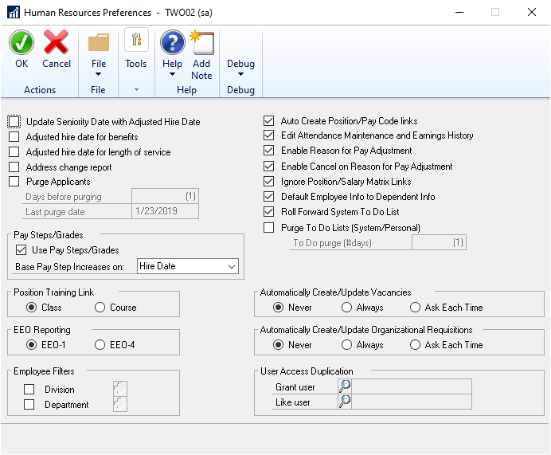

# Human Resources in Microsoft Dynamics GP

You can use Human Resources to set up, enter, and maintain most of your employee  management needs and to track organizational details and personal information for employees within your company. You also can use Human Resources to view important information about employees, their benefits, and other historical data.

You also can use Human Resources to complete the following tasks:

- Manage the interviewing and hiring of applicants, track the termination, training, and evaluation of employees, and maintain organizational details, such as the supervisor, position, and department assignment of employees

- Create company benefit plans—complete with employee and employer deduction provisions, enroll employees and their dependents in benefits, and calculate the benefit value

- Enter employee attendance information, including creating attendance transactions and tracking planned absences for employees

- Define vacation and other time accruals tracked in your organization and how employees can earn time accruals, then set up schedules to show how employees can earn the time accruals at various rates

- Monitor the distribution of company property, such as laptop computers and cell phones, to employees

If you are using U.S. Payroll, you can enter and maintain your employee information in Human Resources and those transactions automatically will update your payroll records.

In this article, we describe the system setup and how to define Human Resources preferences. For information about how to configure the company, see [Human Resources - Company Setup](human-resources-company-setup.md).  

If you are setting up Human Resources in the absence of Payroll, after setup you must modify user security settings to enable user access to Human Resources
functionality.  

## Human Resources preferences

You can specify default employee numbers for your organization by entering an employee ID in the Human Resources Setup window.  

You can choose to have Human Resources automatically assign employee IDs and increase the employee ID number by one for each new record in the Employee Maintenance window.

You can customize the way Human Resources works for your organization by specifying preferences in the Human Resources Preferences window. The user preferences you select will be applied to all the companies within your organization. You also can set up user access to employee information by divisions and departments.

Use the Human Resources User Preferences window to indicate which window should be displayed when you start Human Resources and choose to display employee information by descriptions or codes in the Employee Maintenance window.

This information is divided into the following sections:

- *Setting up an employee number*

- *Setting up Human Resources preferences*

- *Setting up user access to employee information*

- *Copying user access to employee information*

- *Setting up Human Resources user preferences*

## Setting up an employee number

Use the Human Resources Setup window to assign default employee IDs automatically. Each time you add a new employee in the Employee Maintenance
window, the default number will increase by one to the next available number as each number is accepted.

If you are registered for Payroll, the same settings in the Payroll Setup window will be updated with your settings in the Human Resources Setup window.

> [!NOTE]
> If you use Dynamics GP on a network where more than one person is entering new employee records at the same time, the default number might appear to increase by two or more.

### To set up an employee number

1. Open the Human Resources Setup window. (Microsoft Dynamics GP menu \>\> Tools \>\> Setup \>\> Human Resources \>\> Human Resources)

2. Mark the Auto Assign Employee ID option to assign an employee ID for each new employee record.

3. Enter the next employee ID that will be displayed when you add a new employee record in the Employee Maintenance window.

4. Choose OK to save your changes.

## Setting up Human Resources preferences

Use the Human Resources Preferences window to set up Human Resources preferences for your organization.

### To set up Human Resources preferences

1. Open the Human Resources Preferences window. (Microsoft Dynamics GP menu \>\> Tools \>\> Setup \>\> System \>\> Human Resources Preferences)

    

2. Mark options for seniority dates and address changes.

    The following table describes each option.

    | **HR preference option** | **How to use this option** |
    |--|--|
    | Update seniority date with adjusted hire date | Mark to use an employee's adjusted hire date as the seniority date for calculating accruals, such as vacation and sick time. |
    | Adjusted hire date for benefits | Mark to use an employee's adjusted hire date to determine eligibility for benefits, such as health insurance and 401(k) enrollment dates. |
    | Adjusted hire date for length of service | Mark to use an employee's adjusted hire date to determine length of service on the Employee Service by Hire Date report. |
    | Address change report | Mark to track an employee's previous address. |

    Changes to the adjusted hire date in the Employee Maintenance window will update the seniority date in the Employee Attendance Maintenance window.

    > [!NOTE]
    > An adjusted hire date is a hire date that has been changed to reflect time away from the job. For example, suppose an employee leaves your company but is hired again by your company six months later. You can create an adjusted hire date that is six months after his first hire date, which is then used to determine his benefit time and benefit eligibility.

3. Mark the Purge Applicants option to automatically delete applicant records at defined intervals.

    Enter the number of days that the applicant records should remain in the system before being deleted. The Last purge date field displays the date when applicant records were last deleted.

4. Mark the Use Pay Steps/Grades option to enable the use and display of pay step information throughout Human Resources.

    Select the type of date for the basis of the pay step increase. The date options are: Hire Date, Adjusted Hire Date, Seniority Date, or Manual.

    The selected type of date becomes the default option each time you create a pay step table.

    The pay steps feature integrates with U.S. Payroll, but is not available with Canadian Payroll.

5. Select Class or Course at Position Training Links to link classes or courses to positions defined in the Position Setup window.

    You can link positions with class or course training requirements. For example, your company may require new sales staff to complete a product marketing course that consists of six monthly classes. For more information, see *Setting up a training course* and *Setting up a training class*.

6. Select EEO-1 or EEO-4 to change the options in the EEO Class list in the Position Setup window in Payroll.

7. Mark or unmark your preferences for the position, salary and pay code options.

    The following table describes each option.

    | **HR preference option** | **How to use this option** |
    |--|--|
    | Auto Create Position/Pay Code links | Mark to automatically create a link between each pay code and each position. For more information, see *Linking pay codes to a position code.* |
    | Edit Attendance Maintenance and Earnings History | Mark to allow changes to attendance information in the Employee Attendance Maintenance window and to information in the Earnings History window. |
    | Enable Reason for Pay Adjustment | Mark to automatically open the Reason for Change window when making pay adjustments. In this window, enter an effective date and reason for the salary change. |
    | Enable Cancel on Reason for Pay Adjustment | Mark to make the Cancel button available in the Reason for Change window. Unless you've marked this option, you must always give a reason for the salary change before closing the window. |
    | Ignore Position/Salary Matrix Links | Mark if you don't want a message displayed when an employee's salary is outside the salary matrix ranges or a salary matrix doesn't exist. For more information about using matrix links, see *Adding a salary matrix*. |
    | Default Employee Info to Dependent | Mark to display the employee's address and phone information in the Employee Dependents window. |

8. Mark or unmark your To Do List options.

    The To Do List window is used to view calendar information, such as employee benefit eligibility dates and orientation dates.

    | **HR preference option** | **How to use this option** |
    |--|--|
    | Roll Forward System To Do List | Mark to have the system include today's To Do List unfinished items on the next day's To Do List. |
    | Purge To Do Lists (System/Personal) | Mark to delete the To Do List items and enter the number of days that the items should remain in the system before being deleted. |

9. Mark the Enable Attendance for Canada option if you are using Canadian Payroll and want to use the attendance features in Human Resources. This option is available only if Canadian Payroll is registered.

10. Mark the Never, Always, or Ask Each Time options to automatically create and update position vacancies.

11. Mark the Never, Always, or Ask Each Time options to automatically create and update organizational requisitions.

> [!TIP]
> To select Employee Filters and User Access Duplication, refer to Setting up user access to employee information.

## Setting up user access to employee information

Use the Employee Filter Divisions window and the Employee Filter Departments window to set up user access to employee information by divisions and departments.

### To set up user access to employee information

1. Open the Human Resources Preferences window.   (Microsoft Dynamics GP menu >> Tools >> Setup >> System >> Human Resources Preferences)
2. Mark Division and choose the expansion button to restrict user access by division. The Employee Filter Divisions window will open.
3. Mark Department and choose the expansion button to restrict user access by department. The Employee Filter Departments window will open.
4. Select a user ID. Mark divisions or departments in the Employee Filter Divisions window and Employee Filters Departments window to grant user access. To remove access, unmark a division or department.
5. Choose OK to save your changes.

## Copying user access to employee information

Use the Human Resources Preferences window to copy user access to employee information by divisions and departments from one user to another.

To copy user access to employee information:

1. Open the Human Resources Preferences window.   (Microsoft Dynamics GP menu >> Tools >> Setup >> System >> Human Resources Preferences)
2. Select a user to copy access information to in the Grant user field.
3. Choose the Like user lookup button to open the User Lookup window. Then select a user from which to copy access information in the Like user field.
4. A message gives you the option to copy the access information to the Grant user field.

## Setting up Human Resources user preferences

Use the Human Resources User Preferences window to set up Human Resources preferences for each user. You can select windows to be displayed when you start Human Resources and choose whether employee information will be displayed by descriptions or codes in the Employee Maintenance window.

To set up Human Resources user preferences:

1. Open the Human Resources User Preferences window.  (Microsoft Dynamics GP menu >> User Preferences >> HR button)
2. Indicate if you want a To Do List window to open when you start your Human Resources system.

    - Mark the Open To Do List option for the To Do List window to be displayed when you start Human Resources.
    - Mark the Open Personal To Do List option for the Personal To Do List window to be displayed when you start Human Resources.
3. Mark the Roll Personal To Do List Forward option to move personal to do list entries that aren't cancelled or finished to the next day in the to do list.
4. Select the Code option to display the organizational codes in the Employee Maintenance window. Select the Description option to display the organizational descriptions in the Employee Maintenance window.
5. Choose OK to save your changes.

## See also

[Human Resources - Company Setup](human-resources-company-setup.md)  
[Human Resources - Position Control Setup](human-resources-position-control.md)  
[Microsoft Dynamics GP Advanced Payroll](AdvancedPayroll.md)  
