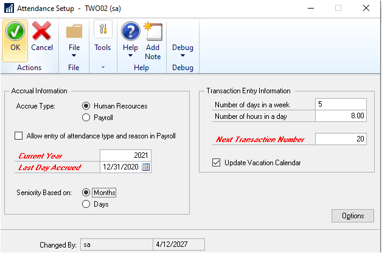
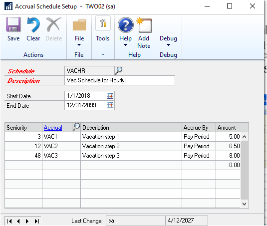
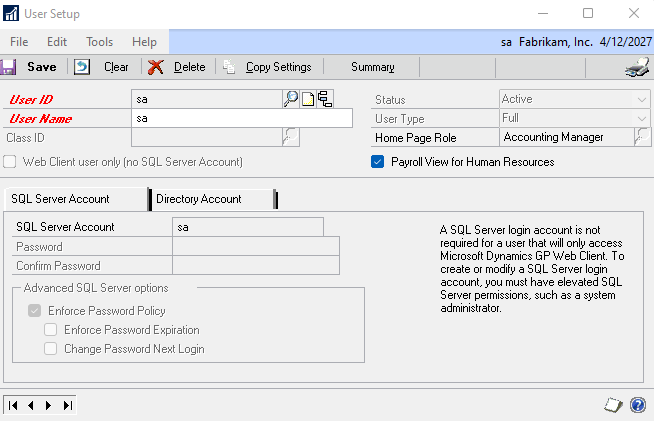
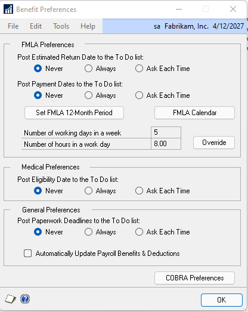

# Human Resources in Microsoft Dynamics GP

You can use Human Resources to set up, enter, and maintain most of your employee  management needs and to track organizational details and personal information for employees within your company. You also can use Human Resources to view important information about employees, their benefits, and other historical data.

You also can use Human Resources to complete the following tasks:

- Manage the interviewing and hiring of applicants, track the termination, training, and evaluation of employees, and maintain organizational details, such as the supervisor, position, and department assignment of employees

- Create company benefit plans—complete with employee and employer deduction provisions, enroll employees and their dependents in benefits, and calculate the benefit value

- Enter employee attendance information, including creating attendance transactions and tracking planned absences for employees

- Define vacation and other time accruals tracked in your organization and how employees can earn time accruals, then set up schedules to show how employees can earn the time accruals at various rates

- Monitor the distribution of company property, such as laptop computers and cell phones, to employees

If you are using U.S. Payroll, you can enter and maintain your employee information in Human Resources and those transactions automatically will update your payroll records.

In this article, we describe the system setup and how to define Human Resources preferences. For information about how to configure the company, see [Human Resources - Company Setup](human-resources-company-setup.md).  

If you are setting up Human Resources in the absence of Payroll, after setup you must modify user security settings to enable user access to Human Resources
functionality.  

## Human Resources preferences

You can specify default employee numbers for your organization by entering an employee ID in the Human Resources Setup window.  

You can choose to have Human Resources automatically assign employee IDs and increase the employee ID number by one for each new record in the Employee Maintenance window.

You can customize the way Human Resources works for your organization by specifying preferences in the Human Resources Preferences window. The user preferences you select will be applied to all the companies within your organization. You also can set up user access to employee information by divisions and departments.

Use the Human Resources User Preferences window to indicate which window should be displayed when you start Human Resources and choose to display employee information by descriptions or codes in the Employee Maintenance window.

This information is divided into the following sections:

- *Setting up an employee number*

- *Setting up Human Resources preferences*

- *Setting up user access to employee information*

- *Copying user access to employee information*

- *Setting up Human Resources user preferences*

## Setting up an employee number

Use the Human Resources Setup window to assign default employee IDs automatically. Each time you add a new employee in the Employee Maintenance
window, the default number will increase by one to the next available number as each number is accepted.

If you are registered for Payroll, the same settings in the Payroll Setup window will be updated with your settings in the Human Resources Setup window.

> [!NOTE]
> If you use Dynamics GP on a network where more than one person is entering new employee records at the same time, the default number might appear to increase by two or more.

### To set up an employee number

1. Open the Human Resources Setup window. (Microsoft Dynamics GP menu \>\> Tools \>\> Setup \>\> Human Resources \>\> Human Resources)

2. Mark the Auto Assign Employee ID option to assign an employee ID for each new employee record.

3. Enter the next employee ID that will be displayed when you add a new employee record in the Employee Maintenance window.

4. Choose OK to save your changes.

## Setting up Human Resources preferences

Use the Human Resources Preferences window to set up Human Resources preferences for your organization.

### To set up Human Resources preferences

1. Open the Human Resources Preferences window. (Microsoft Dynamics GP menu \>\> Tools \>\> Setup \>\> System \>\> Human Resources Preferences)

    

2. Mark options for seniority dates and address changes.

    The following table describes each option.

    | **HR preference option** | **How to use this option** |
    |--|--|
    | Update seniority date with adjusted hire date | Mark to use an employee's adjusted hire date as the seniority date for calculating accruals, such as vacation and sick time. |
    | Adjusted hire date for benefits | Mark to use an employee's adjusted hire date to determine eligibility for benefits, such as health insurance and 401(k) enrollment dates. |
    | Adjusted hire date for length of service | Mark to use an employee's adjusted hire date to determine length of service on the Employee Service by Hire Date report. |
    | Address change report | Mark to track an employee's previous address. |

    Changes to the adjusted hire date in the Employee Maintenance window will update the seniority date in the Employee Attendance Maintenance window.

    > [!NOTE]
    > An adjusted hire date is a hire date that has been changed to reflect time away from the job. For example, suppose an employee leaves your company but is hired again by your company six months later. You can create an adjusted hire date that is six months after his first hire date, which is then used to determine his benefit time and benefit eligibility.

3. Mark the Purge Applicants option to automatically delete applicant records at defined intervals.

    Enter the number of days that the applicant records should remain in the system before being deleted. The Last purge date field displays the date when applicant records were last deleted.

4. Mark the Use Pay Steps/Grades option to enable the use and display of pay step information throughout Human Resources.

    Select the type of date for the basis of the pay step increase. The date options are: Hire Date, Adjusted Hire Date, Seniority Date, or Manual.

    The selected type of date becomes the default option each time you create a pay step table.

    The pay steps feature integrates with U.S. Payroll, but is not available with Canadian Payroll.

5. Select Class or Course at Position Training Links to link classes or courses to positions defined in the Position Setup window.

    You can link positions with class or course training requirements. For example, your company may require new sales staff to complete a product marketing course that consists of six monthly classes. For more information, see *Setting up a training course* and *Setting up a training class*.

6. Select EEO-1 or EEO-4 to change the options in the EEO Class list in the Position Setup window in Payroll.

7. Mark or unmark your preferences for the position, salary and pay code options.

    The following table describes each option.

    | **HR preference option** | **How to use this option** |
    |--|--|
    | Auto Create Position/Pay Code links | Mark to automatically create a link between each pay code and each position. For more information, see *Linking pay codes to a position code.* |
    | Edit Attendance Maintenance and Earnings History | Mark to allow changes to attendance information in the Employee Attendance Maintenance window and to information in the Earnings History window. |
    | Enable Reason for Pay Adjustment | Mark to automatically open the Reason for Change window when making pay adjustments. In this window, enter an effective date and reason for the salary change. |
    | Enable Cancel on Reason for Pay Adjustment | Mark to make the Cancel button available in the Reason for Change window. Unless you've marked this option, you must always give a reason for the salary change before closing the window. |
    | Ignore Position/Salary Matrix Links | Mark if you don't want a message displayed when an employee's salary is outside the salary matrix ranges or a salary matrix doesn't exist. For more information about using matrix links, see *Adding a salary matrix*. |
    | Default Employee Info to Dependent | Mark to display the employee's address and phone information in the Employee Dependents window. |

8. Mark or unmark your To Do List options.

    The To Do List window is used to view calendar information, such as employee benefit eligibility dates and orientation dates.

    | **HR preference option** | **How to use this option** |
    |--|--|
    | Roll Forward System To Do List | Mark to have the system include today's To Do List unfinished items on the next day's To Do List. |
    | Purge To Do Lists (System/Personal) | Mark to delete the To Do List items and enter the number of days that the items should remain in the system before being deleted. |

9. Mark the Enable Attendance for Canada option if you are using Canadian Payroll and want to use the attendance features in Human Resources. This option is available only if Canadian Payroll is registered.

10. Mark the Never, Always, or Ask Each Time options to automatically create and update position vacancies.

11. Mark the Never, Always, or Ask Each Time options to automatically create and update organizational requisitions.

> [!TIP]
> To select Employee Filters and User Access Duplication, refer to Setting up user access to employee information.

## Setting up user access to employee information

Use the Employee Filter Divisions window and the Employee Filter Departments window to set up user access to employee information by divisions and departments.

### To set up user access to employee information

1. Open the Human Resources Preferences window.   (Microsoft Dynamics GP menu >> Tools >> Setup >> System >> Human Resources Preferences)
2. Mark Division and choose the expansion button to restrict user access by division. The Employee Filter Divisions window will open.
3. Mark Department and choose the expansion button to restrict user access by department. The Employee Filter Departments window will open.
4. Select a user ID. Mark divisions or departments in the Employee Filter Divisions window and Employee Filters Departments window to grant user access. To remove access, unmark a division or department.
5. Choose OK to save your changes.

### Copying user access to employee information

Use the Human Resources Preferences window to copy user access to employee information by divisions and departments from one user to another.

To copy user access to employee information:

1. Open the Human Resources Preferences window.   (Microsoft Dynamics GP menu >> Tools >> Setup >> System >> Human Resources Preferences)
2. Select a user to copy access information to in the Grant user field.
3. Choose the Like user lookup button to open the User Lookup window. Then select a user from which to copy access information in the Like user field.
4. A message gives you the option to copy the access information to the Grant user field.

### Setting up Human Resources user preferences

Use the Human Resources User Preferences window to set up Human Resources preferences for each user. You can select windows to be displayed when you start Human Resources and choose whether employee information will be displayed by descriptions or codes in the Employee Maintenance window.

To set up Human Resources user preferences:

1. Open the Human Resources User Preferences window.  (Microsoft Dynamics GP menu >> User Preferences >> HR button)
2. Indicate if you want a To Do List window to open when you start your Human Resources system.

    - Mark the Open To Do List option for the To Do List window to be displayed when you start Human Resources.
    - Mark the Open Personal To Do List option for the Personal To Do List window to be displayed when you start Human Resources.
3. Mark the Roll Personal To Do List Forward option to move personal to do list entries that aren't cancelled or finished to the next day in the to do list.
4. Select the Code option to display the organizational codes in the Employee Maintenance window. Select the Description option to display the organizational descriptions in the Employee Maintenance window.
5. Choose OK to save your changes.

## Organizational structure
Your company’s organizational structure might include multiple levels, such as divisions, departments, positions, supervisors, and locations. You can create these levels and store additional information for each level.

A division is a branch of a company, usually including several departments. A department is a specialized portion of a division or company, which usually concentrates on one type of task. You’ll use several windows to enter the various types of organizational information for your business. Some companies conduct business from more than one site or location and each site has a different address.

Each position has certain physical requirements. The Americans with Disabilities Act (ADA) prohibits employers from discriminating against qualified individuals with disabilities. Use the Position Setup window to enter employee positions, and use the ADA Physical Requirements window to define the physical requirements for each position.

Many positions require special skills and training and you can link training courses and classes to position codes. You can use the Position Course Link window and the Courses Available to Link window to link skill and training requirements to position codes.

You can use position control to plan future positions and roll down information from the planned positions and position seats to employees. Position control is optional. 

Use the Company Human Resources Setup window to set up company human resources information, such as the type of business and Standard Industrial Classification (SIC), Dun & Bradstreet (DUNS), North America Industry Classification System (NAICS), and Vets-100 numbers. You can set up human resources information for each company.

### To set up company human resources information:
1.	Open the Company Human Resources Setup window.  (Microsoft Dynamics GP menu >> Tools >> Setup >> Company >> Company >> Human Resources button)
 
2.	Enter the type of business and the SIC number for this company. 

3.	Enter the DUNS number and Vets-100 number for this company.

### Setting up an operating procedure
Use the Operating Procedures Setup window to set up an operating procedure. You can use the OLE (Object Linking and Embedding) Container to attach files created in other applications. 

To set up an operating procedure:  
1.	Open the Operating Procedures Setup window.  (Microsoft Dynamics GP menu >> Tools >> Setup >> Human Resources >> Operating Procedures)
2.	Enter a category name that describes the operating procedure.
3.	Enter the operating procedure information.

### Setting up a division code
Use the Division Setup window to set up a division. A division is an organizational level between a company and a department. A company can have several divisions, and each division can have several departments. You also can add information using extra fields. 
To set up a division code:

1.	Open the Division Setup window. (Microsoft Dynamics GP menu >> Tools >> Setup >> Human Resources >> Organization >> Division)
2.	Enter a name that identifies the division and a code or accept the default code.
3.	Enter an address, city, state, and postal code for this division.
4.	Enter a phone number, fax number, and e-mail address for this division.
5.	Choose Extra Fields to open the Division Extra Fields window. 

### Setting up a department code
Use the Department Setup window to set up a department code. A department is a specialized unit of a division or company, which usually concentrates on one type of task. For example, accounting and purchasing are typical departments. You can use up to six letters and numbers to create a department code. You also can add information using extra fields. 

To set up a department code: 
1.	Open the Department Setup window.  (Microsoft Dynamics GP menu >> Tools >> Setup >> Human Resources >> Organization >> Department)
2.	Enter a code that identifies the department and a description.
3.	Choose Extra Fields to open the Department Extra Fields window. Setting up a position code

### Setting up a position code
Use the Position Setup window to set up a position code. A position is a defined role within a company. You can create multiple positions for a single position plan. You can link training courses and specify which skill sets, if any, are required for a position. You also can link pay codes and Americans with Disabilities Act (ADA) physical requirements to a position code.

If your company uses salary matrices, you can link the low, middle, and high salaries for each position to a position code. You also can add information using extra fields. 
To set up a position code:

1.	Open the Position Setup window. (Microsoft Dynamics GP menu >> Tools >> Setup >> Human Resources >> Organization >> Position)
2.	Enter a code that identifies the position, and a description. Choose the notes button to add additional comments.
3.	Select an Equal Employment Opportunity (EEO) class and a Fair Labor Standards Act (FLSA) status.
4.	Enter or select a position the individuals in the position report to.
5.	Enter or select the review type to be used for employees in this position and enter or select a required skill set.
6.	Enter a description of the position in the Position Description field.

Choose the paperclip button to open the OLE (Object Linking and Embedding) container and store a position description file.
7.	Choose Linked Pay Codes to open the Position \ Pay Code Setup window and link pay codes and salary ranges to this position code. 
8.	Choose ADA to open the ADA Physical Requirements window. 
9.	Choose Training to open the Courses Available to Link window. 
10.	Choose Extra Fields to open the Position Extra Fields window. 

### Setting up a location code
Use the Company Addresses Setup window to set up a location code, which includes an address, phone numbers, and a contact person for each location. If your company has multiple sites, you can track which employees are working from which sites by setting up location IDs.

To set up a location code:
1.	Open the Company Addresses Setup window. (Microsoft Dynamics GP menu >> Tools >> Setup >> Human Resources >> Organization >> Location)
2.	Enter an identification and name for the company’s location.
3.	Enter contact, address and phone information.
4.	Choose Address ID Internet to enter or view Internet information for this address. 

### Setting up company Internet information
Use the Internet Information window to track Internet-related information about your company, such as e-mail addresses, Web page URLs, and FTP sites. If you’ve set up multiple addresses for your company, you can track Internet information for each address.

To set up company Internet information:
1.	Open the Internet Information window. (Microsoft Dynamics GP menu >> Tools >> Setup >> Company >> Internet Information)
2.	Select a company in the Select Information for field.
The company you’re currently logged in to is displayed in the Company ID field.
3.	Enter or select an address in the Address ID field.
4.	Enter Internet information.
5.	To print Internet information for the current company, choose File >> Print or the printer button. The Internet Information Report is printed, showing Internet information for the current company.

### Deleting an organizational code
Use the Division Setup, Department Setup, Position Setup or Company Addresses Setup windows to delete a division, department, position, or location code. You cannot delete a division code, department code, or position code that is assigned to an employee record.
To delete an organizational code:

1.	Open the Human Resources Organization Setup menu.  (Microsoft Dynamics GP menu >> Tools >> Setup >> Human Resources >> Organization)
2.	Select Division, Department, Position, or Location.
3.	Enter or select the code you want to delete.

### Linking pay codes to a position code
Use the Position and Pay Code Setup window to link pay codes to a position code.
If you marked the Auto Create Position/Pay Code links option in the Human Resources Preferences window, you do not need to link pay codes to a position code manually with this procedure.
To link pay codes to a position code:
1.	Open the Position\Pay Code Setup window.
(Microsoft Dynamics GP menu >> Tools >> Setup >> Human Resources >> Position and Pay Code)
2.	Enter or select a position code.
3.	Enter or select a pay code and choose the Salary Range lookup button. The Salary Matrix Lookup window will open.
4.	Select a table.
5.	Select a salary to use as the low salary indicator and choose the Low select button.
6.	Select a salary to use as the middle salary indicator and choose the Medium select button.
7.	Select a salary to use as the high salary indicator and choose the High select button.
8.	Choose Select to display the salary information in the Position\Pay Code Setup window.

### Understanding pay steps
Before you can begin using the pay steps feature, you need to activate it in the Human Resources Preferences window. 
(Microsoft Dynamics GP menu >> Tools >> Setup >> System >> Human Resources Preferences)

The pay steps feature integrates with U.S. Payroll, but is not available with Canadian Payroll.

You can use pay steps to associate an employee’s amount of time in a position with a rate of pay. A pay step table lists pay steps (or grades) by number, the assigned duration of each step, and the dollar amounts for each step under successive effective dates.

For example, after an employee has served in a position for the full duration of a pay step, the employee advances to the next pay step and its corresponding pay rate under the current effective date. When the next effective date arrives, the employee advances to the new pay rate for the current pay step.

When you assign an employee and an associated pay code to a pay step table (in the Employee/Pay Step Table Entry window or the Employee Pay Code Maintenance window), you can base the step increases on the employee’s hire date, adjusted hire date, seniority date, or a manually entered date.

The Payroll system creates post-dated pay rates for the future increases indicated in the pay steps table. A reminder on your Microsoft Dynamics GP home page lists employee post-dated pay rates eligible for activation. After you activate an employee’s post-dated pay rate, it becomes effective, on the designated date, for all future pay periods.

You can use multiple pay step tables to associate pay rates with other employee qualifications, such as education, in addition to time in a position. For example, if you base employee pay rates, in part, on education level, you can create a pay step table for “Bachelor’s Degree” and another for “Master’s Degree.”

You can use multiple pay step tables to associate pay rates with other employee qualifications, such as education, in addition to time in a position. For example, if you base employee pay rates, in part, on education level, you can create a pay step table for “Bachelor’s Degree” and another for “Master’s Degree.”

### Setting up pay step tables

You can create, save, modify, and delete pay step tables. In the Pay Step Table Entry window, you can create pay step tables having as many steps, number of months in each step, and effective dates, as you want. You can also enter past effective dates to record historical pay rate information.

You can export pay step table information to a Microsoft Excel® file, for further analysis and review.
Within a pay step table, you can add, copy, and delete columns, and delete rows.

To set up a pay step table:
1.	Open the Pay Step Table Entry window. (Microsoft Dynamics GP menu >> Tools >> Setup >> Human Resources >> Pay Step Table)
2.	Enter a pay step table ID and a short description.
3.	Select a unit of pay, either Hourly Rate or Salary.
4.	Enter the effective date. This date indicates when a new column of pay rates becomes effective, typically 01 January of successive years. You can enter any past, present, or future date.
5.	Enter the step (or grade) number into the pay step table.
6.	Enter the duration of this pay step as a range of months. For example, a range of 0 to 11 indicates that a new employee remains at this pay step for the first 12 months of employment.
7.	Enter a dollar amount in the cell across from the step number and below the effective date.
8.	Press the TAB key to begin a new row.
9.	To add additional effective date columns, select the Add Column tab, enter a date, and choose Add.
Choose Clear to remove all selections from the window.  

### Modifying or deleting pay step table data
You can add and remove columns in existing pay step tables by selecting the appropriate tab. You also can copy and adjust the amounts from an existing column to create a new column in the same table
You cannot change or delete pay step data in columns with effective dates earlier than the user date. Such data is preserved as historic data.

**To add a column**
1.	Open the Pay Step Table Entry window. (Microsoft Dynamics GP menu >> Tools >> Setup >> Human Resources >> Pay Step Table)
2.	Select a pay step table ID.
3.	Choose the Add Column tab. 
4.	Enter the effective date.
5.	Choose Add to add the new column to the table.

**To copy a column**
1.	Open the Pay Step Table Entry window.  (Microsoft Dynamics GP menu >> Tools >> Setup >> Human Resources >> Pay Step Table)
2.	Select a pay step table ID.
3.	Choose the Copy Column tab.
4.	Select the effective date of the pay step column you are copying.
5.	Enter or select the effective date of the column you are creating.
6.	Enter the amount or percentage of adjustment to apply to the copied amounts.
7.	Choose Copy to create the new column.

**To remove a column**
1.	Open the Pay Step Table Entry window. (Microsoft Dynamics GP menu >> Tools >> Setup >> Human Resources >> Pay Step Table)
2.	Select a pay step table ID.
3.	Choose the Remove Column tab.
4.	Select the effective date of the pay step column you are removing.
5.	Choose Remove.

### Adding an ADA physical requirements record
Use the ADA Physical Requirements window, the ADA Physical Requirements Page 2 window, and the ADA Physical Requirements Page 3 window to add an ADA physical requirements record. The Americans with Disabilities Act (ADA) prohibits employers from discriminating against qualified individuals with disabilities.

**To add an ADA physical requirements record**

1.	Open the Position Setup window. (Microsoft Dynamics GP menu >> Tools >> Setup >> Human Resources >> Organization >> Position)
2.	Enter or select a position code and choose ADA. The ADA Physical Requirements window will open.
3.	Enter a description of the position in the Job Purpose field and mark the appropriate requirements for this position.
4.	Choose the page turn button to open the ADA Physical Requirements Page 2 window and mark the appropriate requirements.
5.	Choose the page turn button to open ADA Physical Requirements Page 3 and mark the appropriate requirements for the position.

**Duplicating an ADA requirements record**

Use the Duplicate ADA window to duplicate an ADA requirements record. If your company has multiple positions with the same ADA physical requirements, you can duplicate an ADA physical requirements record.

To duplicate an ADA requirements record:
1.	Open the Position Setup window.  (Microsoft Dynamics GP menu >> Tools >> Setup >> Human Resources >> Organization >> Position)
2.	Enter or select a position code and choose ADA. The ADA Physical Requirements window will open.
3.	Choose Duplicate to open the Duplicate ADA window.
4.	Select the position to which you want to copy the ADA requirements.
5.	Choose Duplicate. A message will be displayed. Choose OK and close the Duplicate ADA window.

### Linking courses to a position code

Use the Position Course Link window to link courses to a position code. You also must mark Course as the position training link in the Human Resources Preferences window to link courses to position codes. 

Before you can link a course to a position code, you must first set up the course and assign an ID to it.

**To link courses to a position code**
1.	Open the Position Setup window. (Microsoft Dynamics GP menu >> Tools >> Setup >> Human Resources >> Organization >> Position)
2.	Enter or select a position code and choose Training to open the Position Course Link window. Courses that have been defined are displayed in the window.
3.	Select a course ID to link to this position; a black dot appears next to the course 
ID. To select all courses, choose Mark All. To unmark all courses, choose UnMark All.
4.	Choose Print to print the HRP Position Classes report.
5.	Choose OK. The Position Setup window is displayed.

**Linking classes to a position code**
Use the Courses Available to Link window to link classes to position codes. You also must mark Class as the position training link in the Human Resources Preferences window to link classes to position codes. 
To link classes to a position code:
1.	Open the Position Setup window. (Microsoft Dynamics GP menu >> Tools >> Setup >> Human Resources >> Organization >> Position)
2.	Enter or select a position code and choose Training to open the Courses Available to Link window.
3.	Select a course and choose the zoom button to open the Position Class Link window.
4.	Select a class ID to link to this position. A black dot appears next to the class ID. 5. To select all classes, choose Mark All. To unmark all classes, choose UnMark All.
6.	Choose Print to print the HRP Position Classes report.
7.	Choose OK. The Courses Available to Link window is displayed.

### Setting up a supervisor record
Use the Supervisor Setup window to set up a supervisor record. You can set up a supervisor record and assign the record of an individual to the position.

**To set up a supervisor record**
1.	Open the Supervisor Setup window.  (Microsoft Dynamics GP menu >> Tools >> Setup >> Human Resources >> Organization >> Supervisor)
2.	Enter the code and description of the supervisor.
3.	Enter or select the employee ID of the employee that holds this supervisor position.
4.	Choose Save. Continue entering codes for all your supervisors.
5.	Choose File >> Print to print a Supervisor Codes List to verify your information.

**Modifying or deleting a supervisor record**
Use the Supervisor Setup window to modify or delete a supervisor record. You can modify a supervisor record to reflect changes such as a change in employees for this position.
If you want to delete a supervisor record, make sure the supervisor isn’t assigned on any Employee Maintenance cards (Cards >> Human Resources >> Employee >> Employee).

To modify or delete a supervisor record:
1.	Open the Supervisor Setup window. (Microsoft Dynamics GP menu >> Tools >> Setup >> Human Resources >> Organization >> Supervisor)
2.	Enter or select a supervisor description.
3.	To change the employee that holds the supervisory position, select a different employee ID.
4.	To delete a supervisor record, choose Delete.

## Attendance Setup

You can accrue benefit time using Payroll or the Human Resources attendance feature. To accrue benefit time using Human Resources, you must set up accrual periods, accruals, accrual schedules, and time codes.

**Setting up attendance**

Use the Attendance Setup window to specify if your company accrues benefit time using U.S. Payroll or the Human Resources attendance system. You can set up attendance transactions to update the vacation calendar, set up default hours per day and default days per week, and set up reasons and types to use when creating attendance transactions.

If you mark the Update Vacation Calendar option, an entry appears in the calendar for each benefit or absent time code transaction. Any absences that are created if this option is marked will appear in the Attendance Transaction Entry window. Absence transactions that are created when this option is not marked will appear in the Absence Entry window.

To set up attendance:

1. Open the Attendance Setup window.  (Microsoft Dynamics GP menu >> Tools >> Setup >> Human Resources >> Attendance >> Setup)
2. Select Human Resources, or select Payroll to choose your accrue type if U.S. Payroll is registered.
3. Mark the Allow entry of attendance type and reason in Payroll option to link attendance type and reason codes to payroll transactions in the Payroll Transaction Entry window. This option is available only when the accrue type is Human Resources and U.S. Payroll is registered.
4. Enter the current accrual year and the last day that you accrued attendance, and indicate if seniority should be based on months or days.
These fields are available when U.S. Payroll is not registered, or when U.S. Payroll is registered and the accrue type is Human Resources.
5. Enter the number of days that equal a week and the number of hours that equal a day to define your organization’s work schedule. For example, a standard 40 hour work week might be Number of days in a week = 5 and Number of hours in a day = 8.
6. Enter the next transaction number. This number also appears in the Attendance Transaction Entry window and is the number of the next transaction to be posted.
7. To update the vacation calendar with attendance transactions, mark Update Vacation Calendar.
8. Choose Options to open the Attendance Setup Options window.
9. Enter an attendance reason for absence—such as Jury Duty—and choose Insert to add it to the Reason list. Then, enter an attendance type for the reason—such as Miscellaneous—and choose Insert to add it to the Type list.

The reasons and types that you enter will be displayed in the Attendance Transaction Entry window. If you marked the Allow entry of attendance type and reason in Payroll option in the Attendance Setup window and you’re using U.S. Payroll, the reasons and types will be displayed in the Payroll Transaction Entry window.
To remove an attendance reason or type from a list, select it and choose Remove. Predefined reasons and types cannot be removed.
10.	Choose OK to close the window. The Attendance Setup window is displayed.   Choose OK again to save your changes

**Setting up accrual periods**

Use the Accrual Period Setup window to set up your company’s accrual period structure. You’ll use the accrual periods when creating transactions and time accruals.
You should set up your accrual periods for the current year and the next year, and at the end of each year, set up the following year. You must have at least the current year and the following year set up.

To set up accrual periods:

1.	Open the Accrual Period Setup window   (Microsoft Dynamics GP menu >> Tools >> Setup >> Human Resources >> Attendance >> Accrual Periods)
2.	Enter the current year and choose the button for the accrual period intervals that your organization uses. The appropriate accrual period setup window will open.
3.	Enter the starting date of the first accrual period for this year in the Start Date #1 field. Press TAB to display dates in the rest of the fields. If you chose 
Semimonthly Setup, you also must enter the starting date for the #2 field, or the end date for the #1 field.
4.	Mark the * check box—for Accrued—next to previous periods to indicate accrued attendance transactions. As you accrue attendance transactions, each accrued transaction will be displayed with an asterisk that is for reference only.
To mark all accrual periods, choose Mark All. To unmark all accrual periods, choose Unmark All.
5.	Choose OK to save your changes in the accrual period setup window where you entered accrual period dates.
6.	Choose OK to save your changes in the Accrual Period Setup window.

> [!TIP]
> We recommend three years of accrual periods or pay periods are set up: 
> The previous year
> The current year
> The upcoming year
> This is something you will want to update as you start to Accrue in a new year, example January or after year end close.

**Setting up accruals**

Use the Accrual Setup window to create accruals that determine the rate at which benefit time, such as vacation time or sick time, is earned. An accrual is how an employee earns benefit time. Time codes indicate what is earned and accruals indicate how that time is earned. 

For example, suppose that employees earn 24 hours of vacation time after they work six months. After they work 12 months, they earn another 40 hours of vacation time, and after working two to five years, they earn 80 hours of vacation time. Each of these accruals can be added to an accrual schedule.

To use the Accrual Setup window, you must have marked Human Resources as the accrue type in the Attendance Setup window.

To set up accruals:
1.	Open the Accrual Setup window.  (Microsoft Dynamics GP menu >> Tools >> Setup >> Human Resources >> Attendance >> Accruals)
2.	Enter or select an accrual code and description.
3.	Select an option in the Accrue By field, such as Pay Period, to accrue benefit time.
4.	If you selected Post Once, Interval, or Pay Period in the Accrue By field, enter the number of hours to accrue.
5.	If you selected Interval in the Accrue By field, enter the number of days per interval.
6.	Enter the maximum accrual hours per year that an employee can earn.
7.	Enter the maximum hours available that an employee can have at any given time for the accrual you selected.
8.	If you selected Hour/Yr in the Accrue By field, enter the standard work hours per year an employee works in the Work Hours per Year field. 
9.	If you selected Pay Period in the Accrue By field, select the frequency that the accrual happens in the Accrual Period field.
10.	If you selected Hour/Yr in the Accrue By field, select one or more time codes in the Based on Time Codes list to base the accrual on. Transactions for these time codes will be used to calculate benefit hours earned.
Choose Mark All to mark all the time codes in the list, or choose Unmark All to unmark all the time codes in the list and choose Save.

There are 4 types of Accruals you can set up on HR:   
(Go to Microsoft Dynamics GP | Tools | Setup | Human Resources | Attendance | Accruals and refer to the ACCRUE BY field.)

1. POST ONCE -  The 'Number of Hours to Accrue' amount will be awarded ONE TIME only and stop.

2. INTERVAL -  The 'Number of Hours to Accrue' amount will be awarded repeatedly for each interval set, defined by the fixed 'Number Of Days per Interval' set.  For monthly, set to 30, for yearly, set to 365, etc. 

3. HOUR/YR - This is the 'Hours Worked' accrual and will be awarded based on transactions keyed (so is typically used for Hourly employees).  With this type, the 'Based on Time Codes' section will become available and you can mark which Time Codes should be accrued on.   The transactions must exist in the HR transaction table (TATX1030) BEFORE the Accrual process is run.  Once the transactions are accrued on, they are marked off in the table so they are not accrued on again.  This type is most common for hourly employees.  For the Hours/Yr accrual type, the amount accrued per hour/unit will equal the YEAR MAX / Hour per Year base (fields in the Accrual Setup window):  

Hours Accrued =  'Maximum Accrual Hours Per Year' / 'Work Hours Per Year'

Example:  If you wanted the employee to earn '4' Accrual hours for every 40 hours worked, and they can only earn a maximum of '80' accrual hours per calendar year, then you would use the equation above to figure out what to enter for the 'Work Hours Per Year' field on the Accrual setup.   In the Accrual Setup, the 'Maximum Accrual Hours per year' would be 80 according to our example, and the 'Work Hours Per Year' would be calculated out to be '800'.  Enter 800 in this field in the Accrual setup window.   So 80/800 = .01 hours per unit, and .01 x 40 total hrs = 4 hours earned.     

Here is how we back into our accrual amount
If you are going to user Human Resources
 
We need to figure out the accrual rate per hour worked as I think that is how we should accrue this.

Hours worked * Vacation/sick hours per year / 2080 = accrue amount.

For an example, I worked 20 hours you would need to back into it as follows (20 * 48 / 2080 = .46).
I worked 30 hours you would need to back into it as follows (30 * 48 / 2080 = .69
I worked 60 hours you would need to back into it as follows (60* 48 / 2080 = 1.39

For example, when you setup the accrual in the Accrual Setup window you would say Accrue by Hours/Yr and select 48 in the Maximum Accrual Hours per Year field and then 2080 in work hours per year

> [!TIP]
> If you import transactions to payroll, usually that does not update Human Resource information (TATX1030).  Then your hours worked accruals will not work.  This could happen if you are using Integration Manager or eConnect.  Once you have completed the import go to Tool | Utilites | Human Resource and Reconcile to update HR information from the payroll batch.

NOTE:  Keep in mind that salaried employees typically do not have transactions created in the TATX1030 table so the Hrs/Yr type is typically not used for salaried employees.     

4. PAY PERIOD -  The type will simply award a 'fixed amount' per pay period.  This type is most commonly used for salaried employees.

**Modifying or deleting an accrual**

Use the Accrual Setup window to modify or delete an accrual. You can modify an accrual to reflect changes, such as an increase in the maximum number of hours that can be earned.

To modify or delete an accrual:
1.	Open the Accrual Setup window.  (Microsoft Dynamics GP menu >> Tools >> Setup >> Human Resources >> Attendance >> Accruals)
2.	Enter or select an accrual.
3.	To modify the accrual, make your changes and choose Save.
4.	To delete the accrual, choose Delete.

**Setting up an accrual schedule**

After you’ve defined the benefit times tracked in your organization and how employees can earn those different types of benefit times, you can set up accrual schedules to show how employees can earn benefit times at various rates. For more information, refer to Setting up accruals on page 58.
Use the Accrual Schedule Setup window to create tiered structures that define how employees earn benefit time based on seniority.

Before you set up accrual schedules, you must indicate whether seniority is based on months or days in the Attendance Setup window. For more information, refer to Setting up attendance on page 55. 

To set up an accrual schedule:
1.	Open the Accrual Schedule Setup window.  (Microsoft Dynamics GP menu >> Tools >> Setup >> Human Resources >> Attendance >> Accrual Schedule)
2.	Enter or select a schedule code and description that identifies the accrual schedule.
3.	Enter the starting date and ending date for the accrual schedule. If it’s a continuous accrual schedule, leave the End Date field blank.
4.	In the Attendance Setup window, you selected to base seniority on months or days. In the Seniority column, enter the number of months or days of seniority an employee must have to be eligible for the accrual.
5.	Enter or select an accrual code in the Accrual column. Press TAB to display information in remaining columns and choose Save

**Modifying or deleting an accrual schedule**
Use the Accrual Schedule Setup window to modify or delete an accrual schedule. You can modify an accrual schedule to include changes, such as adding an accrual to an existing schedule.
To modify or delete an accrual schedule:
1.	Open the Accrual Schedule Setup window.  (Microsoft Dynamics GP menu >> Tools >> Setup >> Human Resources >> Attendance >> Accrual Schedule)
2.	Enter or select a schedule.
3.	To modify the schedule information, make your changes and choose Save.
4.	To delete schedule information, choose Delete. To delete a row of information, select the line and from the Edit menu, choose Delete Row.

**Setting up a time code**
You can set up a time code to categorize how employees use their time. For instance, time codes can be used to track vacation time, hourly time, Family and Medical Leave Act (FMLA) time, and sick time.

Use the Time Code Setup window to create time codes and define the various ways that employees in your organization account for their time. You also can link a default accrual schedule to each time code.

If your company employs both hourly workers and salaried workers, you might need to set up separate time codes for each of the different types of time tracked, such as vacation time and sick time. For example, you might set up a vacation time code for salaried employees and a vacation time code for hourly employees. You also might set up a sick time code for salaried employees and a sick time code for hourly employees.

You can select a pay code in the Linked Pay Code field to link an attendance time code to a U.S. or Canadian Payroll pay code. When you create a transaction for a pay code that is linked to a time code, a transaction also will be created for the time code. Then, you don’t have to enter transactions in both Human Resources and U.S. or Canadian Payroll. 
To link pay codes to time codes, pay codes and pay types must match the corresponding time codes and time types. For example, if the time type is Hourly, you only can link pay codes with a pay type of Hourly. Or, if the time type is Benefit, you only can link pay codes with a pay type of Vacation, Sick Time, or Holiday.

To set up a time code:
1.	Open the Time Code Setup window. (Microsoft Dynamics GP menu >> Tools >> Setup >> Human Resources >> Attendance >> Time Code)
2.	Enter or select a time code and description to identify the time record.
3.	Select a time type that the time code is based on and select an accrual period.
4.	If the time type is Benefit, enter or select a default accrual schedule.
5.	Enter or select a code in the Linked Pay Code field to link pay codes to time codes. 

If U.S. or Canadian Payroll is registered and you selected Human Resources for the accrue type in the Attendance Setup window, you can link one pay code per time code and vice versa using this option.

Linked pay codes and pay types must match the corresponding time codes and time types. For Canadian Payroll, the following table shows the pay types that correspond to a given time type.

The Time Code pay code relationship is 1 to 1.  Once a time code is linked to a pay code, you cannot link it to another pay code and it will not appear in the looking up to be linked.

Create Time Code that link to the Pay Code in Payroll.  Such as Sick, Vacation, and Holiday.  Select the Time Type and the Accrual Period for how often this code accrues.  If the Time Type is a Benefit, you will select a Default Accrual Schedule that you will setup after this window. Then select the Linked Pay Code.  If you mark Warn When Available Time Falls Below Zero, you will see warnings on your Payroll Batch Build report that states the Pay Code hours are below zero.  Continue to setup codes for all time that to accrue.

Anything you want visible on the employee check/earnings statement with a balance should be a time type of BENEFT which is a 4 in the table TATM1030.  If you set up a code with Absent as an example, you will not be able to accrue with this code or make it visible to the employee.  This cannot be changed once setup, unless you do this is SQL tables.

An example of an absent time type is maying you want to track how many times and employee is Tardy, but keep this as internal reporting in Dynamics GP.

select  * From tatm1030 where TIMECODE_I='XXX' 
If it is a BENEFIT type it will be a 4 in this table.
TIMETYPE_I='4' 

Time type	    Pay type
Absent	        Regular Pay
Hourly	        Regular Pay or Bonus
Salary	        Regular Pay or Bonus
Overtime	    Overtime
Benefit	        Benefit pay codes (Vacation and Sick)
Other	        Commission, Advance, or EI Rebate

6.	Mark the Warn When Available Time Falls Below Zero option if warning messages should be displayed when benefit hours are less than zero and click Save.

**Modifying or deleting a time code**

Use the Time Code Setup window to modify or delete a time code. You also can inactivate a time code if the time code is no longer being used. However, if you have Payroll transactions for employees with pay codes linked to time codes, you cannot inactivate these records. An inactive time code cannot be assigned to an employee.
To modify or delete a time code:

1.	Open the Time Code Setup window.  (Microsoft Dynamics GP menu >> Tools >> Setup >> Human Resources >> Attendance >> Time Code)
2.	Enter or select a time code.
3.	Make your changes in the window as needed, or to inactivate the time code, mark Inactive. Choose Save.
4.	Choose Delete to delete the time code. If the time code is attached to an employee, this option is not available.

## Benefit Setup

Before you set up the benefits that your company provides for employees, you must define benefit preferences. You will use benefit preferences to define a standard work week and work day for your organization, select a Family and Medical Leave Act (FMLA) year and select a method for tracking FMLA and Consolidated Omnibus Reconciliation Act (COBRA) payments. 

Use the following tips:
•	Human Resources includes deductions as options within the benefit setup windows. Therefore, all types of Human Resources benefits may funded by the employer, the employee, or both. Garnishments, though they are deductions, are set up in Human Resources as a type of miscellaneous benefit. U.S. Payroll, however, uses separate windows to set up benefits and deductions.
•	Benefits can be taxable, that is, the employee can be taxed on the value of the benefit received. Benefits can be calculated from net or gross pay or a deduction, as an amount per unit or as a fixed amount. Examples of benefits include insurance premiums and 401(k) matching contributions.
•	A deduction is an amount that is withheld from an employee’s net, unit or gross pay. For example, a donation to a charity, union dues and contributions to retirement plans could be set up as deductions.
•	You can set up default benefit and deduction cards and use them for setting up employee benefits and deductions. These cards also can be used to apply changes to several employees’ benefit and deduction cards.
•	If you’re using U.S. Payroll and you choose the Automatically Update Payroll Benefits and Deductions option in the Benefit Preferences window, the benefit modifications you make using Human Resources will automatically update the corresponding information in Payroll.
•	If you’ve marked the Payroll View for Human Resources option in the User Setup window, a message will appear to indicate that you must set up the corresponding codes in Payroll after you’ve defined the benefit or deduction in Human Resources to complete the integration.
•	If you didn’t mark the Payroll View for Human Resources option in the User Setup window, or you set up the benefit or deduction in Payroll, the benefit enrollment will be incomplete. Use the Reconcile Human Resources window to update the benefit setups.

**Granting Payroll view access to a user**

Use the User Setup window to grant Payroll view access to a Human Resources user, where U.S. Payroll is, or is being, set up. You must mark the Payroll View for Human Resources option to completely set up Human Resources benefit or deduction codes and the corresponding Payroll codes.

If you don’t mark the Payroll View for Human Resources option in the User Setup window, the benefit enrollment will be incomplete. The benefit enrollment also will be incomplete if you set up the benefit or deduction in Payroll. To update benefit setups, use the Reconcile Human Resources window. 

To grant Payroll view access to a user:
1.	Open the User Setup window.  (Microsoft Dynamics GP menu >> Tools >> Setup >> System >> User >> enter system password)
2.	Enter or select a User ID.
3.	Mark the Payroll View for Human Resources option and choose Save.
Repeat for every user who will enter or update benefit information in Human Resources.

**Setting up benefit preferences**

Use the Benefit Preferences window to set up benefit preferences. You can specify FMLA preferences, such as the 12-month period used by your company to calculate FMLA benefits and your company’s down days. You also can determine the prompts that will be available to users for posting specific benefits dates to the To Do list.

To set up benefit preferences: 
1.	Open the Benefit Preferences window. (Microsoft Dynamics GP menu >> Tools >> Setup >> Human Resources >> Benefits and Deductions >> Benefit Preferences)
2.	Mark Never, Always, or Ask Each Time to prompt the user for posting the FMLA return date and the payment dates to the To Do List.
3.	Choose Set FMLA 12-month Period to open the Setting FMLA 12-Month Period window. Mark the method used to calculate the FMLA 12-month period.
If you change the FMLA 12-month period, you’ll need to delete all of the employees’ previous leave instances and enter them again or the FMLA benefits won’t be calculated correctly.
4.	Choose Save. The Benefit Preferences window will be displayed.
5.	Choose FMLA Calendar to open the FMLA Calendar window. Mark None, 
Sundays Only, or Saturdays and Sundays to indicate your company-wide “down days.”
6.	Select individual calendar days to designate specific days as down days. Down days include weekends and holidays which are not counted as part of an FMLA leave. A message will appear to indicate that changing this selection will affect all employees’ FMLA leave. Choose Yes to continue.
7.	Choose OK. The Benefit Preferences window will be displayed.
8.	Accept the default number of working days in a week or the number of hours in a work day, or choose Override to make changes. The default numbers are defined in the Attendance Setup window. Refer to Setting up attendance on page 55.
9.	Mark Never, Always, or Ask Each Time to prompt the user for posting the eligibility date and the paperwork deadline dates to the To Do list.
10.	Mark the Automatically Update Payroll Benefits & Deductions option to update payroll benefit and deduction records without displaying integration messages.
11.	Choose COBRA Preferences to open the COBRA Preferences window. Mark Never, Always, or Ask Each Time to prompt the user for posting the COBRA payment dates and the coverage end date to the To Do list.
12.	Choose OK. The Benefit Preferences window will be displayed.  Choose OK to save.

Once benefit preferences are established for FMLA, they should not be changed. If they are, all entries will need to be entered again or FMLA benefits won’t be calculated correctly.

**Setting up miscellaneous benefits and garnishments**

Use the Miscellaneous Benefits Setup window to set up benefits, deductions, and combinations of both. For example, a parking allowance might be a benefit, union dues might be a deduction, and a donation to a charity with matching funds from the employer might be both a benefit and a deduction.

To set up a miscellaneous benefit:
1.	Open the Miscellaneous Benefits Setup window. (Microsoft Dynamics GP menu >> Tools >> Setup >> Human Resources >> Benefits and Deductions >> Miscellaneous Benefits)
2.	Enter an account name and description and select a frequency.
3.	Enter or select a group or agency with which the miscellaneous benefit is affiliated. If a company isn’t listed, select Affiliation and add the benefit carrier’s contact information in the Card Catalog window.
4.	Enter the beginning date and the ending date for the miscellaneous benefit. If it’s a continuous plan, leave the ending field blank.
5.	Mark Employee if the employee will contribute to the miscellaneous benefit. Select a method and mark single deduction tier or multiple tiers. If you mark a single amount or percent, enter an amount or percent. If you mark multiple tiers, choose Tiers to open the Tiered Deduction Setup window, where you can enter tiered deductions.
Enter deduction maximums. You can enter the maximum amount an employee can have deducted each pay period, each calendar year, each fiscal year, and for the entire time the employee works for your company.
6.	Mark Employer if the employer will contribute to the miscellaneous benefit. Select a method and mark a single deduction tier or multiple tiers. If you mark a single amount or percent, enter an amount or percent. If you mark multiple tiers, choose Tiers to open the Tiered Deduction Setup window, where you can enter tiered deductions.
Enter benefit maximums. You can enter the maximum amount an employer can have deducted each pay period, each calendar year, each fiscal year, and for the entire time the employee works for your company.
•	If you’ve entered contribution amounts and you’ve marked the Payroll View for Human Resources option in the User Setup window, you’ll be prompted to set up the corresponding account codes in Payroll. Choose Yes to complete the integration.
•	If you didn’t enter contribution amounts, you will not be prompted to set up the corresponding account codes in Payroll. However, you will need to set them up before you can enroll an employee in the miscellaneous benefit. To set up in Payroll, re-select the miscellaneous benefit, choose the Benefits button in the upper, right corner of the Miscellaneous Benefits Setup window, and select Payroll.

To set up a miscellaneous benefit as a garnishment:
1.	Open the Miscellaneous Benefits Setup window.  (Microsoft Dynamics GP menu >> Tools >> Setup >> Human Resources >> Benefits and Deductions >> Miscellaneous Benefits)
2.	Enter an account name and description, and select a frequency.
3.	Enter or select the garnishment recipient in the Affiliation field. If a recipient is not listed, choose the Affiliation link and add the recipient’s contact information in the Card Catalog window.
4.	Mark Garnishment.
5.	Mark Employee.
6.	Select the method of calculating the garnishment amount. The Amount Per Unit method is not permitted for garnishments.

Setting up a copayment record

Use the CoPay Setup window to define copayment codes for benefits within your company. A copayment is the amount of money that must be paid by an employee. For example, a health insurance benefit might have a $10 copayment.
To set up a copayment record:
1.	Open the CoPay Setup window.   (Microsoft Dynamics GP menu >> Tools >> Setup >> Human Resources >> Benefits and Deductions >> CoPay)
2.	Enter a copayment code and description. 
3.	Enter the amount of the copayment.

Setting up a health insurance coverage type

Use the Health Coverage Types Entry window to set up health insurance benefits and other insurance coverage types. Health insurance benefits can include medical insurance, dental insurance, and vision insurance. You can define coverage types by the coverage provided, such as health employee, health employee plus one, health employee family, dental employee, and so on.
To set up a health insurance coverage type:
1.	Open the Health Coverage Type Setup window.  (Microsoft Dynamics GP menu >> Tools >> Setup >> Human Resources >> Benefits and Deductions >> Health Coverage Type)
2.	Enter a coverage type code and description.

**Setting up a health insurance benefit**

Use the Health Insurance Setup window to enter and maintain health insurance benefit records. The plans set up in this window can be used as default entries for setting up employee benefits. They also can be used to apply changes to employee benefit cards and can be included in employee classes. Health insurance benefits can include medical insurance, dental insurance and vision insurance.

To set up a health insurance benefit:
1.	Open the Health Insurance Setup window. (Microsoft Dynamics GP menu >> Tools >> Setup >> Human Resources >> Benefits and Deductions >> Health Insurance)
2.	Enter a benefit code and a description of the benefit.
3.	Select a frequency and enter or select a benefit carrier, such as the name of the insurance company. If a company isn’t listed, choose Carrier and add the benefit carrier in the Card Catalog window.
4.	Enter the group number of the plan and the maximum age to enter the plan for an employee and an employee’s dependent.
5.	Enter the number of days an employee must work for the company before he or she is eligible for health insurance benefits in the Waiting Period field.
6.	Enter or select a type of coverage.
7.	Enter the employee and employer amounts, the deductible, COBRA premium and maximum benefit amounts.
8.	Enter the percentage of the costs that the major medical benefits will cover in the Major Medical Coverage field.
9.	Enter the maximum out-of-pocket expense the employee must pay in the Maximum Out-of-Pocket field. For example, if the major medical insurance will cover 80 percent of expenses until the employee’s paid $5,000 and then the major medical insurance will cover 100 percent, enter 80% in the Major Medical Coverage field and $5,000 in the Max. Out-of-Pocket field.
10.	Select a copayment code and enter a copayment amount or accept the default amount.
•	If you’ve entered amounts for your Employee or Employer fields and you’ve marked the Payroll View for Human Resources in the User Setup window, you’ll be given the option to set up the corresponding codes in Payroll. Choose Yes to complete the integration.
•	If you didn’t enter amounts for both the Employee and Employer fields, the corresponding codes will not have to be completed in Payroll.

**Setting up an age-based life insurance benefit**

Use the Life Insurance Setup window to set up an aged-based life insurance benefit. Premiums for an aged-based benefit change with the employee’s age. 
For example, an employee whose age is 21-34 might pay $3.00 per $1,000 of life insurance coverage and an employee whose age is 35-44 might pay $4.00 per $1,000 of life insurance coverage.

To set up an age-based life insurance benefit:
1.	Open the Life Insurance Setup window.  (Microsoft Dynamics GP menu >> Tools >> Setup >> Human Resources >> Benefits and Deductions >> Life Insurance)
2.	Enter a plan name and description of the benefit.
3.	Select the benefit frequency and enter or select the life insurance benefits carrier. 
If a company isn’t listed, choose Carrier and add the benefit carrier in the Card Catalog window.
4.	Enter the group number of the plan and the plan start date.
5.	Mark Age-Based to indicate the premium method for this benefit is based on age.

> [!TIP]
> A process runs when the first user of the day logs into a company, everyday.  It is driven from the HR Module and pertains to life insurance.  The process is called HR_Update_Age_Based_Employee.  When this process runs, it will look at all employees to see if there was a birthday and if based on your age base tables, should the employee premium get updated.  Basically the first person who logs for the day, into GP triggers a stored procedure that updates age based life insurance premiums in HR(which is linked to payroll). We do not check to see if this person has HR access or not, so you may see some random user that may have changed the age base life insurance tables as the system does this automatically for you each day at login.  [You can find more details on the Update Age Based Employee Procedure](https://community.dynamics.com/gp/f/microsoft-dynamics-gp-forum/72411/update-age-based-employee-procedure)

To set up a fixed amounts life insurance

6.	Enter the increment amounts for the employee, employee’s spouse and children, if applicable. For example, if an employee can purchase insurance in $1,000 increments, enter $1,000. The Life Insurance Premiums Table window will display these amounts.
7.	Choose Table to open the Life Insurance Premiums Table window. Enter the minimum age and basic premiums for the employee and the employee’s spouse, if applicable.
8.	Choose the insert button to save your changes. Continue entering premium information and then close the window. The Life Insurance Setup window will be displayed. 
9.	Enter the maximum amount of life insurance coverage that this plan offers.
10.	Enter a multiplication factor to define the employee’s maximum amount of life insurance coverage under this plan. The factor, multiplied by the employee’s annual salary, is the employee’s maximum coverage, up to the plan’s maximum.
For example, assume that an employee has an annual income of $25,000. A factor of 2 would mean that the employee’s maximum life insurance coverage under this plan would be $50,000 (or the plan’s maximum coverage, whichever is smaller).
Enter 0 to use the value in the Coverage Max Amt. field as the employee’s maximum coverage value.
11.	If you enter a factor other than 0, select a rounding option and to indicate whether the calculated maximum coverage should be rounded up or down to match predetermined life insurance coverage increments.

For example, assume that an employee has an annual income of $52,000, the factor is set to 2, and coverage increments are set at $10,000. The calculated maximum coverage in this case is $104,000. If you choose to round up, the employee’s maximum coverage would be set to $110,000, which is the nearest higher increment. If you choose to round down, the employee’s maximum coverage would be set to $100,000, which is the nearest lower increment.
12.	Mark Portable Plan if the employee can continue the life insurance plan after leaving the company.
13.	Mark how the employer pays for this benefit.
•	If you marked Increment Employee or Increment Whole Family, enter the employer Increments and Fixed Premium amounts.
•	If you marked Portion of Employee Premium, enter the employer portion of the employee premium.
You can enter zero in the fields for employee’s and employer’s contributions. 
•	If you’ve entered contribution amounts and you’ve marked the Payroll View for Human Resources in the User Setup window, you’ll be given the option to set up the corresponding codes in Payroll. Choose Yes to complete the integration.
•	If you didn’t enter contribution amounts, the corresponding codes will not have to be completed in Payroll.
•	If you didn’t mark the Payroll View for Human Resources in the User Setup window, the benefit enrollment will be incomplete. Use the Reconcile Human Resources window to update the benefit setups. 

Setting up a fixed-amount life insurance benefit

Use the Life Insurance Setup window to set up a fixed amount life insurance benefit. You can define the maximum coverage amount and indicate if the plan is portable—if the employee can continue receiving this benefit after leaving the company.

To set up a fixed-amount life insurance benefit:
1.	Open the Life Insurance Setup window.  (Microsoft Dynamics GP menu >> Tools >> Setup >> Human Resources >> Benefits and Deductions >> Life Insurance)
2.	Enter a plan name and select the benefit frequency.
3.	Enter a description of the benefit and enter or select the life insurance benefits carrier. If a company isn’t listed, choose Carrier and add the benefit carrier in the Card Catalog window.
4.	Enter the group number of the plan and the plan start and end dates. If it’s a continuous plan, leave the end date blank.
5.	Mark Fixed Amounts to indicate the premium method for this benefit.
6.	Enter the premium increments and fixed premium amounts for the employee, employee’s spouse, and employee’s children. For example, if the premium amount is $3.00 per $1,000 of insurance, enter $1,000 in the Increments field and $3.00 in the Fixed Premium field. If the premium for smokers is different, use the Smoker field as applicable.
Enter the full premium amounts in the Employee, Spouse, and Children fields. Any fixed premium amount contributed by the employer will be subtracted from the full premium amounts, either automatically or manually, according to the Employer Pays selection.
7.	Enter the maximum amount of life insurance coverage that this plan offers.
8.	Enter a multiplication factor to define the employee’s maximum amount of life insurance coverage under this plan. The factor, multiplied by the employee’s annual salary, is the employee’s maximum coverage, up to the plan’s maximum.
For example, assume that an employee has an annual income of $25,000. A factor of 2 would mean that the employee’s maximum life insurance coverage under this plan would be $50,000 (or the plan’s maximum coverage, whichever is smaller).
Enter 0 to use the value in the Coverage Max Amt. field as the employee’s maximum coverage value.
9.	If you enter a factor other than 0, select a rounding option and to indicate whether the calculated maximum coverage should be rounded up or down to match predetermined life insurance coverage increments.
For example, assume that an employee has an annual income of $52,000, the factor is set to 2, and coverage increments are set at $10,000. The calculated maximum coverage in this case is $104,000. If you choose to round up, the employee’s maximum coverage would be set to $110,000, which is the nearest higher increment. If you choose to round down, the employee’s maximum coverage would be set to $100,000, which is the nearest lower increment.
10.	Mark Portable Plan if the employee can continue the life insurance plan after leaving the company.
11.	Mark how the employer pays for this benefit.
•	If you marked Increment Employee or Increment Whole Family, specify the portion of the insurance premium that the employer pays for each increment. The employer’s portion of the premium is automatically subtracted from the employee’s total premium (including, if applicable, Spouse, and Children, but not including Smoker) and must be less than or equal to the employee’s total premium.
•	If you marked Portion of Employee Premium, enter the employer fixed premium, and change the employee total fixed premium entries (including, if applicable, Spouse, and Children, but not including Smoker) so their total is reduced by the amount of the employer fixed premium.
You can enter zero in the fields for employee’s and employer’s contributions. For information about how this affects Payroll records
•	If you’ve entered contribution amounts and you’ve marked the Payroll View for Human Resources in the User Setup window, you’ll be given the option to set up the corresponding codes in Payroll. Choose Yes to complete the integration.
•	If you didn’t enter contribution amounts, the corresponding codes will not have to be completed in Payroll.
•	If you didn’t mark the Payroll View for Human Resources in the User Setup window, the benefit enrollment will be incomplete. Use the Reconcile Human Resources window to update the benefit setups. 

Modifying or deleting a life insurance benefit

Use the Life Insurance Setup window to modify or delete a life insurance benefit. You can modify a life insurance benefit to reflect changes such as the group number or premium information. You can’t delete a benefit if employees are enrolled in the benefit.
	 	Delete the life insurance code or codes from Payroll first, and then follow these instructions.

To modify or delete a life insurance benefit:
1.	Open the Life Insurance Setup window.  (Microsoft Dynamics GP menu >> Tools >> Setup >> Human Resources >> Benefits and Deductions >> Life Insurance)
2.	Enter or select a plan name.
3.	Make your changes and choose Save.
•	You will have the option to apply the changes to all active benefit records.
•	If you’ve entered amounts for your Employee or Employer fields and you’ve marked the Payroll View for Human Resources in the User Setup window, you’ll be given the option to update the corresponding codes in Payroll. Choose Yes to complete the integration.
•	If you didn’t enter amounts for both the Employee and Employer fields, the corresponding codes will not have to be completed in Payroll.
•	If you marked the Automatically Update Payroll Benefits & Deductions option in the Benefit Preferences window, the corresponding payroll information will be updated automatically. Continue to step 5.
•	If you didn’t mark the Payroll View for Human Resources in the User Setup window, the benefit enrollment will be incomplete. Use the Reconcile Human Resources window to update the benefit setups. For more information, refer to Reconciling Human Resources information on page 323.
4.	Choose Delete to delete the benefit.  Close the window.

**Setting up a retirement plan insurance benefit**

Use the Retirement Plans Setup window to set up a retirement plan. You can add funds to a plan to which the employee can contribute, as well as enter the employee match percent and maximum match amounts.

To set up a retirement plan:
1.	Open the Retirement Plans Setup window.  (Microsoft Dynamics GP menu >> Tools >> Setup >> Human Resources >> Benefits and Deductions >> Retirement Plans)
2.	Enter a benefit code and description. Select a frequency.
3.	Enter or select the retirement plan trustee and enter the retirement plan account number. If a company isn’t listed, choose Trustee and add the trustee in the Card Catalog window.
4.	Mark Fixed or Tiers to indicate the premium structure. 
5.	Mark Amount or Percent to indicate the premium method and enter a premium amount or percentage. Enter the annual maximum contribution the employee can make to the plan during the calendar and fiscal year.
6.	Enter the percentage the employer matches for each employee dollar and enter the maximum percentage of the employee contribution that the employer will match. Enter maximum employer contributions for the calendar and fiscal year.
7.	Mark Bonus Elections Active if employees have the option to contribute a percentage of their bonus pay. Mark Loans Allowed if employees are allowed to withdraw contributions as loans. Mark Hardship Withdrawals OK if employees are allowed to withdraw contributions for hardship cases.
You can enter zero in the fields for employee’s and employer’s contributions. 
8.	Enter the minimum employee age required to participate in the retirement plan and the number of days the employee must be employed by your company to be eligible for the retirement plan.
9.	Enter a plan entrance date and choose the insert button to save the date.
10.	Choose Add A Fund to activate a row in the scrolling window and enter a fund code and the name of the fund. Mark Active if the fund is active.
11.	Choose Save.
•	If you’ve entered contribution amounts and you’ve marked the Payroll View for Human Resources in the User Setup window, you’ll be given the option to set up the corresponding codes in Payroll. Choose Yes to complete the integration.
•	If you didn’t enter contribution amounts, the corresponding codes will not have to be completed in Payroll.
•	If you didn’t mark the Payroll View for Human Resources in the User Setup window, the benefit enrollment will be incomplete. Use the Reconcile Human Resources window to update the benefit setups. 

Setting up a benefit tier

Use the Tiered Benefit Setup window to enter, maintain or delete a benefit tier.
This benefit tier is for reference only and is not required. If most employee benefits use the same tier structure, setting up this tier will reduce your data entry time.
To set up a benefit tier:
1.	Open the Miscellaneous Benefit Setup window. (Microsoft Dynamics GP menu >> Tools >> Setup >> Human Resources >> Benefits and Deductions)
2.	Choose Miscellaneous Benefits or Retirement Plans.
3.	Enter or select a benefit code. Mark Employer, select Multiple, and then choose Tiers to open the Tiered Benefit Setup window.
4.	Enter the To amounts for each tier. For example, if the first tier is from zero to $100, you would enter $100 in the To column. The next From amount automatically will be displayed.
5.	Enter the dollar amount or percentage that employees contribute to the plan for each tier.
6.	Choose OK to save your changes. The Miscellaneous Benefit Setup window will be displayed.
7.	Choose Save.
•	If you’ve entered contribution amounts and you’ve marked the Payroll View for Human Resources in the User Setup window, you’ll be given the option to set up the corresponding codes in Payroll. Choose Yes to complete the integration.
•	If you didn’t enter contribution amounts, the corresponding codes will not have to be completed in Payroll.
•	If you didn’t mark the Payroll View for Human Resources in the User Setup window, the benefit enrollment will be incomplete. Use the Reconcile Human Resources window to update the benefit setups. 

Setting up a deduction tier

Use the Tiered Deduction Setup window to enter maintain or delete a deduction tier.
This deduction tier is for reference only and is not required. If most employee deductions use the same tier structure, setting up this tier will reduce your data entry time.
To set up a deduction tier:
1.	Open a deduction setup window. (Microsoft Dynamics GP menu >> Tools >> Setup >> Human Resources >> Benefits and Deductions >> Miscellaneous Benefits)
You can assign a deduction tier to a Miscellaneous Benefit deduction and a Retirement Plan.
2.	Enter or select a deduction code. 
•	In the Miscellaneous Benefit Setup window, mark Employee and Multiple and choose Tiers to open the Tiered Deduction Setup window. 
•	In the Retirement Plans Setup window, select Tiers for the Premium Structure and choose Tiers to open the Tiered Deduction Setup window.
3.	Enter the To amounts for each tier. For example, if the first tier is from zero to $100, you would enter $100 in the To column. The next From amount automatically will be displayed.
4.	Enter the dollar amount or percentage that employees contribute to the plan for each tier.
5.	Choose OK to save your changes. The Miscellaneous Benefit Setup or Retirement Plans Setup window will be displayed.
6.	Choose Save.
•	If you’ve entered contribution amounts and you’ve marked the Payroll View for Human Resources in the User Setup window, you’ll be given the option to set up the corresponding codes in Payroll. Choose Yes to complete the integration.
•	If you didn’t enter contribution amounts, the corresponding codes will not have to be completed in Payroll.
•	If you didn’t mark the Payroll View for Human Resources in the User Setup window, the benefit enrollment will be incomplete. Use the Reconcile Human Resources window to update the benefit setups. 

Modifying or deleting a retirement plan
Use the Retirement Plans Setup window to modify or delete a retirement plan. You can inactivate certain funds, change the available entry dates, or change any of the other fields in the window. You can’t delete a benefit if employees are enrolled in the benefit.
	 	Delete the retirement plan code or codes from Payroll first, and then follow these steps.

To modify or delete a retirement plan:
1.	Open the Retirement Plans Setup window. (Microsoft Dynamics GP menu >> Tools >> Setup >> Human Resources >> Benefits and Deductions >> Retirement Plans)
2.	Enter or select a benefit code for the retirement plan.
3.	To inactivate a fund, unmark the Active check box for the fund and choose Save.
To delete a fund, select the fund, choose Delete a Fund and choose Save.
4.	Make your changes and choose Save.
•	You will have the option to apply the changes to all active benefit records.
•	If you’ve entered amounts for your Employee or Employer fields and you’ve marked the Payroll View for Human Resources in the User Setup window, you’ll be given the option to update the corresponding codes in Payroll. Choose Yes to complete the integration.
•	If you didn’t enter amounts for both the Employee and Employer fields, the corresponding codes will not have to be completed in Payroll.
•	If you marked the Automatically Update Payroll Benefits & Deductions option in the Benefit Preferences window, the corresponding payroll information will be updated automatically. Continue to step 5.
•	If you didn’t mark the Payroll View for Human Resources in the User Setup window, the benefit enrollment will be incomplete. Use the Reconcile Human Resources window to update the benefit setups. 
5.	Choose Delete to delete the retirement plan. Close the window.

**Completing a benefit or deduction setup**

Use the Incomplete Setup Codes window to complete a benefit or deduction setup. A benefit or deduction set up is incomplete when you create a benefit or deduction in Human Resources and the Payroll View for Human Resources check box is not marked in the User Setup window. A benefit or deduction also is incomplete when you create a benefit or deduction in Payroll, but don’t apply the information to Human Resources. 

To complete a benefit or deduction setup: 
1.	Open any benefits setup window. (Microsoft Dynamics GP menu >> Tools >> Setup >> Human Resources >> Benefits and Deductions)
2.	Choose Miscellaneous Benefits or Health Insurance or Life Insurance or Retirement Plans.
3.	Choose the benefits button and select Incompletes to open the Incomplete Setup Codes window.
4.	Highlight the code and choose Select.
•	If the code is a benefit, the Benefit Setup window will open. If the code is a deduction, the Deduction Setup window will open.
•	If a benefit is also a deduction, the Deduction Setup window will open. After you enter and save information in this window, the Benefit Setup window will open.
5.	Enter additional information in the Benefit Setup window and choose Save.

> [!TIP]
> The main benefit information for Human Resource is stored in the following two tables.
> Benefit Setup BE020230
> Employee Enrollment BE010130
> The column BENEFITKIND_I determins what type of benefit it is, there are 4 types
> 1=Health Insurance
> 2=Life Insurance
> 3=Retirement Plan
> 4=Miscellaneous Benefit/Deduction
> 

## See also

[Human Resources - Company Setup](human-resources-company-setup.md)  
[Human Resources - Position Control Setup](human-resources-position-control.md)  
[Microsoft Dynamics GP Advanced Payroll](AdvancedPayroll.md)  
