# Microsoft Dynamics GP Paid Time Off Manager

Examine how Paid Time Off Manager works with Microsoft Dynamics GP Payroll.

## Chapter 1: Paid Time Off Manager Overview

The objectives are:

- Examine how Paid Time Off Manager works with Microsoft Dynamics® GP Payroll to calculate vacation and sick time.

- Review some of the features and benefits that are associated with using Microsoft Dynamics GP Paid Time Off Manager.

### Introduction

Welcome to Microsoft Dynamics GP Paid Time Off Manager (PTO Manager), an integral component of the financial management system.

Paid Time Off Manager automatically manages complex vacation and sick time policies. It helps to reduce overhead costs by reducing paperwork and the time required by the Payroll team to manage manual paid time off record keeping. Paid Time Off Manager also enables the staff to manage complex and changing payroll situations quickly and accurately, while offering better service to the employees.

### How Paid Time Off Manager Works

Microsoft Dynamics GP Payroll and Human Resource users often need to calculate vacation and sick time (Earned Paid Leave) using a method different from the standard Microsoft Dynamics GP calculation. Because different companies also use different methods, Paid Time Off Manager for Microsoft Dynamics GP allows the calculations to be defined and set up by the user in an attempt to create one module to fit these varying calculation methods. The user now has the ability to assign a PTO Code to multiple employees who have similar or identical PTO configurations.

Paid Time Off Manager integrates with the Microsoft Dynamics GP Payroll module to provide a complete solution. When users process payroll in Microsoft Dynamics GP, Paid Time Off Manager calculates vacation and sick time during the calculate checks process. The updated vacation and sick time data is posted to employees’ records when the payroll checks are posted.

### Features and Benefits

The features and capabilities of Paid Time Off Manager include:

- **Increase productivity.** Perform calculations of accrued vacation and sick time automatically during the Calculate Checks process.

- **Manage multiple plans.** Define an unlimited number of calculation formulas for accruing vacation and sick time, as well as special features for managing carryovers, waiting periods and maximums.
- **Access real-time information.** Display updated vacation and sick time balances for the current pay period on the employee paycheck stub and in Self Service.

- **Automate manual processes.** Set up PTO plans for defined groups,replacing time-consuming manual processes and making maintenance simple.

- **Improve data accuracy.** Reduce data entry with defined PTO plans that are assigned to each employee based on defined factors.

- **Streamline budgeting and forecasting process.** Deliver access to PTO information with standard reports and on-demand SmartList reports.

### Summary

Paid Time Off Manager integrates with Microsoft Dynamics GP Payroll to provide a solution for sick and vacation schedules that are not easily handled within the core product.

Some key points to remember from this chapter include:

- Paid Time Off Manager works with Microsoft Dynamics GP Payroll to accrue sick and vacation time.

- Multiple paid time off calculations can be defined and set up by the organization.

- Calculations of accrued vacation and sick time take place during the calculate checks process in Payroll.

- Ability to assign a PTO Code to multiple employees who have similar or identical PTO configurations.

## Chapter 2: Setting Up Paid Time Off Manager

The objectives are:

- Grant Security to the Paid Time Off windows and reports.

- Use Security Task Setup window to edit security tasks for the PTO Manager module.

- Use Security Roles Setup window to edit security roles for the PTO Manager module.

- Set the Paid Time Off Options to establish the hire date parameter and the year-end closing process.

- Review the settings that must be in place for Paid Time Off Manager to work properly.

- Examine the appropriate Microsoft Dynamics GP core settings that need to be in place for Paid Time Off Manager to function properly.

- Set up a PTO code defining the accrual schedules based on organizational policies using ranges, calculation factor and maximums.

- Set up an “any time” maximum amount that an employee can have accumulated and identify the difference between this amount and the maximums set within the accrual schedules.

Setting up Paid Time Off Manager involves granting access to the windows and reports, the process of creating Accrual Schedules and Maximum Schedules and selecting a Paid Time Off option. Each of these topics is discussed in this chapter.

### Setting up a Security Task

Use the Security Task Setup window to select a default PTO Manager security task or modify the default security task. To open this window, click the **Administration** series button, click **System** on the Setup content pane and then click **Security Tasks**.

1. Select appropriate **Task ID**

2. Select **Product** – **HRM Solutions Series**

3. Select **Type** – **Windows**

4. Select **Series** – **3rd Party**

5. Select the following from the access list

    - **Accrual Schedule Setup**

    - **Accrual Schedules**

    - **Employee PTO Maintenance**

    - **Maximum Schedule Setup**

    - **Maximum Schedules**

    - **PTO Codes**

    - **PTO Options**

    - **PTO Reports**

    - **PTO Setup**

    - **PTO Utilities**

6. Change **Type** – **Reports**

7. Select **Series – 3rd Party**

8. Select the following form the access list

    - **Accrual Schedule List**

    - **Employee PTO Code List**

    - **Maximum Schedule List**

    - **PTO Accrual Schedule Codes List**

    - **PTO Accrue List**

    - **PTO Liability Report**

### Setting up a Security Role

Use the Security Role Setup window to select a default security role or modify the default security role. To open this window, click the
**Administration** series button, click **System** on the Setup content pane and then click **Security Roles**.

### Paid Time Off Manager Option

Paid Time Off Manager is set up for each individual company, and Paid Time Off Manager options must be selected for each company. When restoring a backup from one company into a new company, these options must be selected in the new company.

To open the PTO Options window, click the **HR and Payroll** series button, click **Payroll** on the Setup content pane, click **PTO Manager** and then click **PTO Options**.

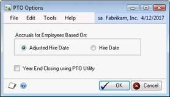

select * from APR_PTO00100 --PTO_Options

Use **Accruals for Employee Based On** to select which hire date the accruals are based on. These button options allow the user to select if he or she wants to base the employee accruals and waiting periods off of the employee **Hire Date** or **Adjusted Hire Date**. This selection affects all employees company-wide.

These dates can be found on the Employee Card:

- Adjusted Hire Date

    Select Adjusted Hire Date to base all employees’ accruals and waiting periods on the employee adjusted hire date.  
    Note: Using the Adjusted Hire Date is a good option for users who would like to base all employees’ accruals and waiting periods on the same date, such as July 1st.

- Hire Date

    Select Hire Date to base all employees’ accruals and waiting periods on the employee hire date.  

Update Vacation Calendar with Payroll PTO Events
Select the Update Vacation Calendar with Payroll PTO Events to have the system automatically create an absence entry for the HR Vacation Calendar when a payroll is processed.  The entry will indicate whether the event was for vacation or sick leave. This feature is available only when HR is installed and registered.  

Select the **Year End Closing using PTO Utility** check box to process vacation and sick time maximums from the PTO Utilities window for Employee PTO Setup records that are not selected to Calculate on Anniversary Date. Do not select the **Year End Closing using PTO Utility** check box to process vacation and sick time maximums during Payroll Year-End Closing for Employee PTO Setup records that are not selected to Calculate on Anniversary Date.

- If the ‘Year End Closing using PTO Utility’ option is not marked, when the Payroll year is closed, the user will be asked whether or not he/she wants to ‘apply carry over and reset PTO YTD Amounts’:

    - If ‘Continue’ is selected, carry overs will be applied and YTD amounts will be cleared from the Employee PTO Maintenance window.
    - If ‘Cancel’ is selected, nothing is cleared or applied.
- If the ‘Year End Closing using PTO Utility’ option is marked, the PTO Utilities window becomes available (Microsoft Dynamics GP >> Tools >> Utilities >> Payroll >> PTO Utilities). This allows users to run the PTO Year End process separately from Payroll Year End. 

### Other Settings Affecting PTO Accruals

To implement the functionality of PTO Manager, the following validations must be true.

On the Employee Maintenance window, the **Hire Date** must be a valid date and must be greater than 00/00/0000.

On the Employee Vacation-Sick Time Maintenance window, verify the following:

- **Accrue Vacation** check box must be selected for vacation to accrue

- **Based On: Hours Worked** must be selected for vacation to accrue

- **Accrue Sick Time** check box must be select for sick time to accrue

- **Based On: Hours Worked** must be selected for sick time to accrue

On the Employee Additional Information Maintenance window, the **Work Hours per Year** must be greater than zero.

On the Employee Pay Code Maintenance window, verify the following:

- The accrual eligible pay codes must be assigned to the employee.

- **Accrue - Vacation** check box must be selected for vacation to accrue for hours associated with this pay code.

- **Accrue - Sick Time** check box must be selected for sick time to accrue for hours associated with this pay code.

### Related Microsoft Dynamics GP Core Settings

Additional core Microsoft Dynamics GP settings affect or inter-relate to the PTO Manager options, features and functionality.

#### Employee Pay Code Maintenance Window

Users must select the appropriate check box on the Employee Pay Code Maintenance window for PTO Manager to accrue for vacation and/or sick time. To open this window, click the **HR and Payroll** series button, click **Payroll** on the Cards content pane and then click **Pay Code**.

#### Pay Code Setup Window

Users must select the appropriate check box on the Pay Code Setup window for PTO Manager to accrue for vacation and/or sick time. This must be done for each pay code that is to accrue time. To open this window, click the **HR and Payroll** series button, click **Payroll** on the Setup content pane and then click **Pay Code**.

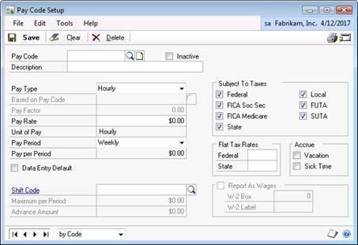

### Employee Class Setup Window

When working with employee classes, users must complete the appropriate check box and other information on the Employee Class Setup window for PTO Manager to accrue for vacation and/or sick time. To open this window, click the **HR and Payroll** series button, click **Payroll** on the Setup content pane and then click **Employee Class**.

### Setting up PTO Codes

Use the PTO Setup window to create setup data to be inherited at the employee level. The system allows the user to save, recall and update multiple PTO Setup records. To open the PTO Setup window, click the **HR and Payroll** series button, click **Payroll** on the Setup content pane and then click **PTO Setup**.

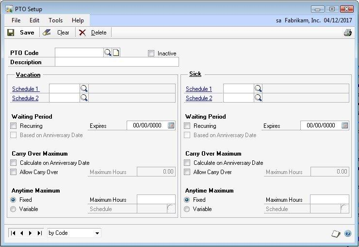

select * from PTO40400 --PTO Code Setup

Enter or select a **PTO Code**. Enter or select the **Vacation and/or Sick Accrual Schedules**.

Select the **Inactive** checkbox to inactivate the PTO Code. If the **Inactive** checkbox is marked, the system will process PTO time based on core Payroll setups.

**Waiting Period**
If a Waiting Period is being used, accruals move into the ‘Hours Pending’ field on the Employee PTO Maintenance Window and will not move to available or Year-To-Date Accrued Hours field until the Expiration date is met.  

- Recurring

    Mark to indicate the PTO Code has an annual waiting period.  The system will set the expiration date to 01/01 of the next calendar year based on the current user date. 
- Based on Anniversary Date

    If Recurring is marked the Based on Anniversary Date is enabled.  Mark Based On Anniversary date to set the recurring waiting period to the employees next anniversary date. 
- Expires

    If the Recurring Waiting Period or Based on Anniversary Date field is unmarked, the Waiting Period Expires field is set to 00/00/0000.

If either the Recurring Waiting Period or Based On Anniversary Date fields are marked, the Waiting Period Expires field is set to either the first of the calendar year or the employee’s anniversary date. When the Waiting Period Expires date is passed, the time is moved from the Pending Field to the available field for the employee, and the Waiting Period Expires date automatically resets to the first of the next calendar year or the employee’s next anniversary date. The resetting of the Waiting Period Expires date takes place during the first pay run after the expiration date.

> [!NOTE]
> The GP ‘User Date’ at the time of the pay run is utilized to determine the expiration date.  The employee must also be included in the pay run and fall into a valid schedule.

**Carry Over Maximum**
 
- Calculate on Anniversary Date

    Mark to reset the balance to zero on the anniversary date if Allow Carry over is unmarked.  If Allow Carry Over is marked the balance is reset to the maximum allowed.
- Allow Carry Over

    Mark to enable the Maximum Hours field.  
- Maximum Hours

    Enter the Maximum Hours to carry over on the anniversary date.

**Anytime Maximum** 
 
- Fixed 

    Mark to indicate the PTO Code has a fixed amount of hours available at any point in time.  
- Variable 

    Mark to indicate the PTO Code has a variable amount of hours available at any point in time. 
- Maximum Hours 

    When fixed is marked enter the maximum hours the PTO Code may accrue.  
- Schedule

    When variable is marked setup the Maximum Schedule and assign to the PTO Code. 

### Setting up Accrual Schedules

Use the Accrual Schedule Setup window to define multiple accrual schedules specific to the company and the accrual policies. Different schedules may represent different hour ranges and calculation factors.

> [!TIP]
> As an example, accrued time may be calculated differently for part-time employees versus full-time employees; or employees hired before a specific date may have a higher calculation factor than those hired after the specified date.

Users can create an unlimited variety of schedules. The schedules are implemented into the calculations when they are assigned to an employee on the Employee PTO Setup window. Assigning accrual schedules to an employee is explained further in the Employee PTO Setup window section.

To open the Accrual Schedule Setup window, click the **HR and Payroll** series button, click **Payroll** on the Setup content pane, click **PTO Manager** and then click **Accrual Schedules**.

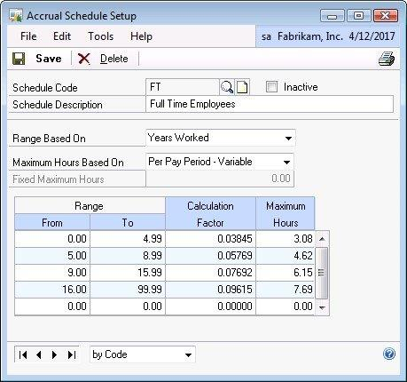

select * from PTO40100 --PTO Accrual Schedule Header
select * from PTO40101 --PTO Accrual Schedule Detail

Enter a **Schedule Code** and a **Schedule Description**.

#### Range Based On

Make a selection in the **Range Based On** field. Options include:

- Hours Worked / Pay Period - Select to accrue hours based on the number of hours worked per pay period.

- Hours Worked / Year - Select to accrue hours based on the number of hours worked per pay year.

- Hours Worked Life to Date- Select to accrue hours based on the number of hours worked life to date.

- Years Worked - Select to accrue hours based on the number of years worked.

Use calculation ranges to determine which calculation factor the system uses in figuring hours accrued. Ranges consist of a beginning and ending value that may represent hours worked or years worked for the calculation factor to be used, and a maximum number of hours that may be earned. From and To values cannot overlap.

Four methods of determining ranges and maximums can be used in any combination. However, if a user selects the Per Year - Fixed or Per Pay Period - Fixed method for calculating the maximum hours, he or she cannot enter data into the Maximum Hours column.

It is important to understand each Range Based On option and how it is used to select the proper type for the organization. The Range Based On selection tells the system what the **Range From** and **Range To** values in the scrolling window represent. When each employee’s paycheck is calculated, the system evaluates the data for the employee based on the range option selected and determines which range and calculation factor to use.

#### Range Based On: Hours Worked/Pay Period

Using this selection the Range From and Range To columns represent hours worked per pay period. All hours worked that are eligible for vacation and/or sick time calculations within the pay period are used to determine the range that the employee falls into. As shown in the figure, if the employee worked 13 hours during the pay period, then the calculation factor of 0.02910 is used.

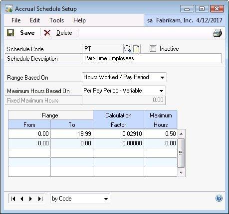

#### Range Based On: Hours Worked/Year

Using this selection the Range From and Range To columns represent hours worked per year. All hours worked that are eligible for vacation and/or sick time calculations within the current calendar year (plus all eligible hours for that pay period) are used to determine the calculation factor. As shown in the figure, if the employee has worked a total of 1,600 eligible hours in
the current year and has worked 80 eligible hours this pay period, the calculation factor of 0.00817 will be used.

Calculation factors are determined based on the organization’s pay schedules, standard hours worked for each pay period, and methods of determining earned hours.

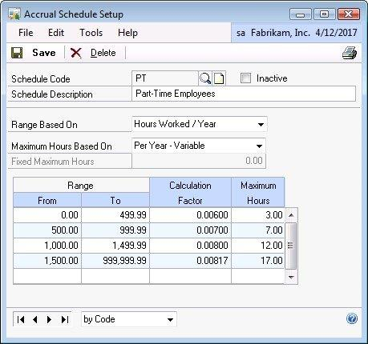

#### Range Based On: Hours Worked Life-to-Date

Using this selection the Range From and Range To columns represent Hours Worked Life to Date. All hours worked that are eligible for vacation and/or sick time calculations (that have been worked since the employee started) are used to determine the calculation factor.

> [!NOTE]
> The total Hours Worked Life-to-Date is derived from the Life-To-Date Hours Worked fields on the Employee PTO Setup window (plus all eligible hours for that pay period).

The following figure shows that if the employee has worked a total of 10,400 eligible hours since he or she was hired (equivalent to 5 years) and has worked 80 eligible hours this pay period, the calculation factor of 0.05769 must be used.

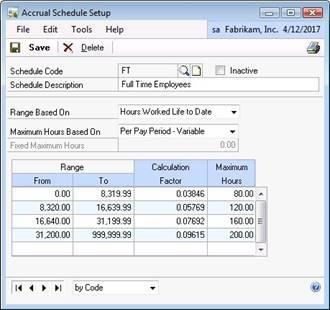

Calculation factors are determined based on the organization’s pay schedules, standard hours worked for each pay period, and methods of determining earned hours.

#### Range Based On: Years Worked

Using this selection the Range From and Range To columns represent years worked. The years worked are determined by the difference between the current date and hire date (or if it exists, adjusted hire date). The following figure shows that if the employee has worked a total of 11.5 years (based on the employee’s hire date), the calculation factor of 0.07692 will be used. In this example, the years worked are rounded to 11 years.

#### Maximum Hours Based On

Make a selection in the **Maximum Hours Based On** field. Options include:

- Per Pay Period -Variable - Select to apply a maximum based on a variable amount per pay period.

- Per Year - Fixed - Select to apply a maximum based on a fixed amount per pay period.

- Per Year - Variable - Select to apply a maximum based on a variable amount per year. 

- Per Pay Period - Fixed - Select to apply a maximum based on a fixed amount per year. 

#### Maximum Hours Based On: Per Pay Period - Variable

Employees may accrue a maximum number of hours for each pay period based on this calculation range. In the Years Worked example, the first range of years worked allows the employee to earn up to 3.08 hours in an 80 hour pay period (80 Hours \* Calculation Factor of 0.03845 = 3.08). If the employee had worked at the company for ten years, the employee can earn a maximum of 6.15 hours for the pay period.

#### Maximum Hours Based On: Per Year - Fixed

Employees may accrue a fixed maximum number of hours for each calendar year. However, rather than having the maximum depend on the range, the maximum is set regardless of which calculation range the employee falls into. The Per Year - Fixed option allows users to specify the number of hours for each year. An example can be that the employee may earn a total of 80 hours for
each year, regardless of how many actual hours were worked.

> [!NOTE]
> While an employee may have an annual maximum set, his or her total accrued time may be greater than the annual maximum due to rollover time.

#### Maximum Hours Based On: Per Year - Variable

Employees may accrue a maximum number of hours for each year based on their calculation range. For example, the calculation ranges may represent hours worked / year. If the employee worked 1200 hours during the year, he or she will earn a maximum of 12.0 hours (1200 \* Calc Factor 0.008 = 12.0 hours).

#### Maximum Hours Based On: Per Pay Period - Fixed

Employees may accrue a fixed maximum number of hours for each pay period. However, rather than having the maximum depend on the range, the maximum is set regardless of which calculation range the employee falls into. The employee has a per pay period maximum of 4.0 hours regardless of how many hours he or she works in the pay period; everyone has the same maximum.

If a Fixed option is selected for Maximum Hours Based On, a Fixed Maximum Hours must be entered.

#### Range From/To

- **From** - is not allowed to have a higher value than the Range To field. Set the criteria that these range fields are based on. If the schedule is assigned to an employee that has only worked 23.00 hours in the pay period, he or she is placed in the 20.00 - 29.99 range for that pay period. For this example, the employee’s accrual can change from one pay period to the next based on his or her “Hours Worked/Pay Period.”

- **To** - is not allowed to have a lower value than the Range From field. Set the criteria that these range fields are based on. If the schedule below is assigned to an employee that has only worked 23.00 hours in the pay period, he or she is placed in the 20.00 - 29.99 range for that pay period. For this example, the employee’s accrual can change from one pay period to the next based on his or her “Hours Worked/Pay Period.”

> [!NOTE]
> Occasionally a user will experience unexpected results with their ‘hours pending’ field such as the follwoing: 

- Growing at an unexpected rate, or see available time being greater than expected when the employees waiting period expires. 
- Reduced at an unexpected rate (possibly resulting in large negative values), or see available time updated with negative amounts when the employees waiting period expires. 

This is because when the ‘Maximum Hours Based On’ is utilizing an Hours Per Year option, GP looks at the ‘Year-To-Date Accrued Hours’ field on the Employee PTO Maintenance Window to determine whether or not the employee has met his/her maximum for the year each time payroll is processed.  

If the employee has a Waiting Period enabled, then the accruals from the schedule are building in the ‘Hour Pending’ field and does not update the Year-To-Date Accrued Hours until the waiting period is over. 

For example, when ‘Year-To-Date Accrued’ is less than the ‘maximum’, then ‘Hours Pending’ will continue to grow. As such, the ‘value’ in ‘Hours Pending’ will ALL become available when the ‘waiting period’ expires (unless utilizing anytime maximums).

Additionally, when ‘Year-To-Date Accrued’ is MORE than the ‘maximum’, then ‘Hours Pending’ will continue to shrink (resulting in negative values). As such, the ‘value’ in ‘Hours Pending’ will ALL become available when the ‘waiting period’ expires. 
This would result in negative amounts in the ‘Available’ field as well as negative ‘Year-To-Date’ Accrued Hours 

Therefore, if you are using waiting periods, it is recommended that you use an anytime maximum to restrict the number of hours that an employee can have at any given time OR to use a Per Pay Period Maximum and set the Per Pay Period maximum equal to your Yearly Maximum divided by the total pay periods.  

For example:  If the Maximum Hours Per year was 156 and I have biweekly pay runs, I would take 156 hours divided by 26 periods and have a Pay Period Maximum of 6.00 per period.  This would be equivalent to a yearly maximum of 156 hours. 

#### Calculation Factor

Enter the **Calculation Factor.** The **Calculation Factor** is always multiplied by the employees hours worked in the pay period.

> [!NOTE]
> If the employees must earn a set amount each pay run or year, then enter 9.99999 for the calculation factor, and set the Maximum Hours field value to limit the amount to receive.

#### Determining Calculation Factors

Calculation factors are determined based on the organization’s pay schedules, standard hours worked for each pay period, and methods of determining earned hours. In the previous examples, a bi-weekly pay period is used with a standard hours worked for each pay period of 80. In the following window, the calculation factor is determined by simply dividing the Maximum Hours by the To hours worked in the range (0.50 / 19.99= 0.0250). If the employee works 19.99 hours, he or she earns 0.5 hours(19.99 \* 0.025).

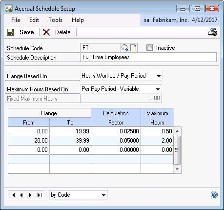

The following window shows that the factor is figured by dividing the Maximum Hours per Pay Period by the 2080 (maximum regular time work hours for each year). If an employee consistently works 80 hours each pay period, and he or she has worked a total of 10,400 hours since starting, the factor of 0.05769 is used, and he or she earns 4.62 hours each pay period. Since the employee is paid biweekly, there are a total of 26 pay periods. If the employee earns 4.62 hours every pay period, at the end of the year, he or she has accumulated 120 hours of earned time.

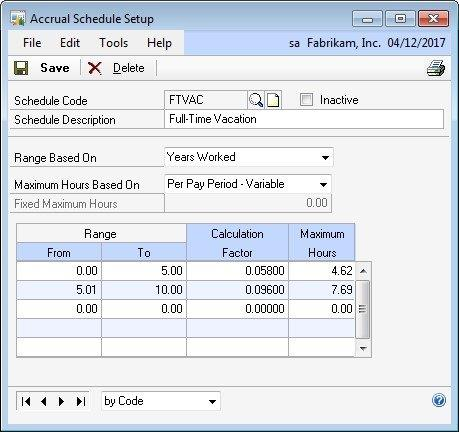

#### Maximum Hours

Set criteria for the Maximum Hours field based on, Per Pay Period - Variable,

Per Pay Period - Fixed, Per Year - Variable, or Per Year - Fixed. For both of the Fixed selections, enter only one maximum for all of the calculation ranges entered in the scrolling window. For both of the Variable selections, enter a different maximum hours for each calculation range entered in the scrolling window.

### Setting up an Accrual Waiting Period

PTO Manager allows the employee to accrue time that is not available for immediate use. Waiting periods can be set as a one-time (introductory period) waiting period, or recurring period, based on the calendar year or by employee anniversary date. PTO Manager allows the employee anniversary date to be specified as the Hire Date or Adjusted Hire Date on the employee maintenance card.

Waiting periods are used to hold earned hours until a specified date. For example, the employee may begin earning hours immediately after being hired, but not have the hours available for use until he or she has worked 90 days. In this example, the waiting period expiration date is set to 90 days from the employee’s hire date. The earned hours are calculated when a paycheck is processed, but the system will not post the hours to the employee’s available vacation and sick time until the after the waiting period is over.

> [!NOTE]
> If this check is voided, the lump sum that showed as Accrued is removed and will no longer exist. The amounts need to be manually re-entered.

#### Waiting Period Options

- **Recurring** - Selecting this check box under Vacation or Sick Waiting Period indicates that the PTO Code selected has an annual waiting period. The system will set the Vacation or Sick Expires date for affected records to 01/01 of the next year calendar year based on the current user date.

- **Based on Anniversary Date** - Selecting this check box is enabled only if the Recurring Waiting Period field is checked. Selecting the Based On Anniversary Date indicates that the employee selected has an annually recurring waiting period and the system will set the Vacation or Sick Expires date for affected records to 01/01 of the next calendar year based on the current user date.

- **Expires** - If the Recurring Waiting Period or Based on Anniversary Date field is not selected, the Waiting Period Expires field is set to 00/00/0000.

If either the Recurring Waiting Period or Based On Anniversary Date fields are checked, the Waiting Period Expires field is set to either the first of the calendar year or the employee’s anniversary date. When the Waiting Period Expires date is passed, the time is made available to the employee, and the Waiting Period Expires date automatically resets to the first of the next calendar year or the employee’s next anniversary date. The resetting of the Waiting Period Expires date takes place during the first pay run after the expiration date.

### Setting up Carry Over Maximum

- **Calculate on Anniversary Date** - Select this check box to reset the balance to zero on the Anniversary date if Allow Carry Over is not checked. If the Allow Carry Over check box is selected, it carries over up to the maximum allowed on the first payroll after the employees anniversary date.

- **Allow Carry Over** - Each employee may be assigned a maximum number of accrued hours that can be carried over to the next year. For every employee that is selected, when the PTO Year End process is invoked, PTO Manager will verify that Available time is less than or equal to the Maximum Carry Over value. The employee forfeits any earned hours in excess of the maximum that has not been used.

### Setting up Anytime Maximum

Select an Anytime Maximum option. Choices are:

- **Fixed -** indicates that the employee has a fixed amount of hours available to him or her at any point in time. When this option is selected, enter a maximum hour’s value in the Hours Allowed field.

- **Variable -** indicates that the employee has a variable amount of hours available at any point in time. The variable amount is determined based on the Maximum Schedule Code assigned to this employee in the Schedule field.

The Maximum Hours field is available only when Fixed has been selected. Enter the maximum available anytime hours in this field to set the fixed maximum amount of hours the employee has available at any given time.

The **Schedule** field and **Schedule Lookup** button are only available when **Variable** is selected. This field allows the entry of a Maximum Schedule Code that is set up in the Maximum Schedule Setup window.

### Setting up Maximum Schedules

The Maximum Schedule Setup window allows the user to create schedules for setting variable maximums. This feature of PTO Manager allows the user to set up variations for calculating the maximum amount of vacation or sick time an employee is allowed to have in his or her depository at any time.

> [!NOTE]
> This is not based on per year or annual; this is a maximum for any point in time.

The maximum schedule is set up based on Years Worked. When calculating Years Worked in the accrual process, the system will first attempt to calculate elapsed time from the Adjusted Hire Date, and then from the Hire Date.

To open the Maximum Schedules Setup window, click the **HR and Payroll Series** button, click **PTO Manager** on the Setup content pane and then click **Maximum Schedules**.

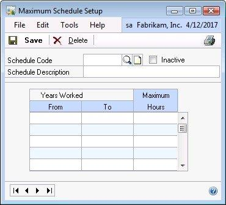

Enter or select a **Schedule Code** and a short **Description**. Enter the **Range From** and **Range To** and **Maximum Hours**.

select * from PTO40200 --PTO Max Schedule Header
select * from PTO40201 --PTO Max Schedule Detail

The Maximum Schedule Setup window allows the user to create schedules for setting variable maximums. This allows you to set up variations for calculating the maximum amount of vacation or sick time an employee is allowed to have in his or her depository at any time.

The maximum schedule is set up based on years worked. When calculating years worked in the accrual process, the system will first attempt to calculate elapsed time from the adjusted hire date, and then from the hire date.  The maximum amount is an anytime maximum.  

- Maximum Hours

    Enter the maximum hours an employee may have remaining at any given point in time.
- Years Worked 

    - From

        Enter the start of the range in years.
    - To

        Enter the end of the range in years.

### PTO Manager Examples

This section provides examples of waiting periods, maximums, and life-to-date/year-to-date amounts.

#### Example: Waiting periods for vacation accrual

According to the policies of Fabrikam, Inc., vacation time is subject to a waiting period. For full-time employees, vacation can be accrued on a recurring basis, based on the employee’s anniversary date. Sick time is not subject to a waiting period. These companywide policies are specified in the PTO Setup window (Microsoft Dynamics GP \> Tools \> Setup \> Payroll \> PTO Manager \> PTO Setup), as shown in the following illustration.

To apply this policy, in the Vacation group, under Waiting Period, mark
Recurring and Based on Anniversary Date.

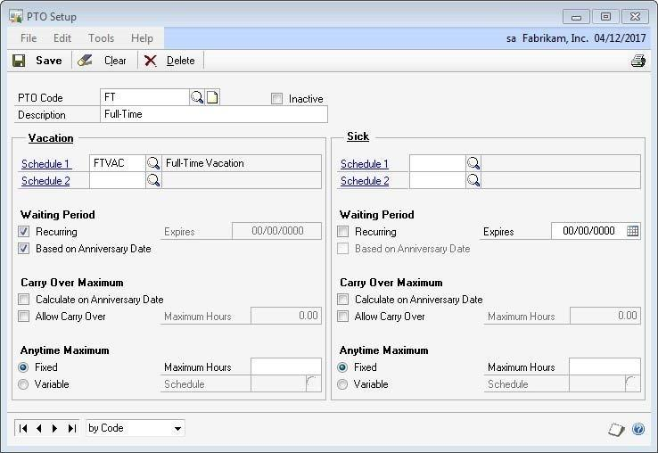

A full-time employee of Fabrikam, Inc. accrues PTO per pay period. The vacation accrual schedule is set to accrue a maximum of 4.62 hours for an employee who has worked 0 to 5 years and 7.69 hours for an employee who has worked 5.01-10 years. This is specified in the Accrual Schedule Setup window (Microsoft Dynamics GP \> Tools \> Setup \> Payroll \> PTO Manager \> Accrual Schedules), as shown in the following illustration.

To figure the Calculation Factor, calculate the yearly maximum hours divided by the number of hours worked per year. [120 (maximum hours per year) / 2080(hours worked per year) = 0.058)

Fabrikam’s employee, Pilar Ackerman, accrues vacation time according to the FTVAC schedule. Pilar was hired on August 3, 2015. If the current date is August 1, 2017, the next anniversary date is August 3, 2017. This date is shown in the Waiting Period Expires Date field in the Employee PTO Maintenance window (Cards \> Payroll \> PTO)

The Hours Pending field shows that Pilar has accrued 70 hours vacation but the hours are not yet available.

During the first payroll run after 08/03/2017, the following actions occur:

- The Vacation Available field will be set to the hours accrued including the hours pending.

- The Hours Pending fields will be set to 0.00.

- The Waiting Period Expires Date is reset to the next anniversary date, 08/03/2018.

To view the actions that occurred, open the Employee PTO Maintenance window (Cards \> Payroll \> PTO).

#### Example: Carry over maximums

According to the policies of Fabrikam, Inc., the carry over maximums for vacation and sick hours are based on the employee’s anniversary date. Vacation hours are allowed to be carried over with a maximum of 120.00 hours and sick hours are not allowed to be carried over.

These companywide policies are specified in the PTO Setup window (Microsoft Dynamics GP \> Tools \> Setup \> Payroll \> PTO Manager \> PTO Setup). Fabrikam’s employee, Pilar Ackerman, vacation carry over maximum is calculated on her anniversary date and the maximum carry over is 120.00 hours. Pilar’s sick carry over maximum is calculated on the anniversary date, with no carry over. The sick time will be reset to 0.00 on her anniversary date.

#### Example: Anytime maximums

According to the policies of Fabrikam, Inc., the anytime maximums for vacation sick hours are as follows:

- **Vacation hours** are set to variable with a Maximum Schedule assigned.

- **Sick hours** are set to fixed with a maximum of 40.00 hours.

To apply these policies, in the Vacation group, under Anytime Maximums, select Variable and assign the Maximum Schedule. In the Sick group, under Anytime Maximums, select Fixed and enter the maximum number of hours.

#### Example: Anniversary

Fabrikam runs payroll on a biweekly basis so they have 26 pay periods a year. 

Employees build vacation throughout the year and that vacation becomes available on their anniversary date.  They can have a maximum of 5 hours per pay period (5*26=130 hours per year) if they have been employee from 0 to 4 years.   

Employees who have worked 5 years or more, receive a maximum of 6 hours per pay period (6*26=156 hours per year).  
They have a carryover maximum of 50 hours and have a waiting period based on anniversary date. 
Their Anytime Maximum is 180 (130+ 50) hours for employees who have been with the company for 0 to 4 years, and 206 (156+50) hours for 5+ years.  

Their sick time does not have a waiting period, cannot be carried over, and is accrued at a rate of 0.83333 per pay period with an anytime maximum of 20 hours (20 hours per year/26 pay periods = .833333). 

1. For the employee ACKE0001 mark the options to accrue Vacation and Sick Time on their Employee Card (Vac/Sick) button and enter the number of hours that they work in a year. (This should match the number of hours worked per year on the ‘Additional Information’ button on the Employee card as well)  

2. Assign an hourly Paycode such as HOUR to ACKE0001 with a biweekly frequency and with Accrue Vacation and Sick Time Marked.  (You may need to create an hourly pay code if you do not already have one to assign)

3. Assign a vacation Pay Code to ACKE0001 such as VACN, and make sure that it is based on your HOUR pay code from step 2. (In this case we want to still accrue vacation and sick time on our when we use our Vacation so we marked to still accrue on this Pay Code)

4. Assign a sick Pay Code to ACKE0001 such as SICK, and make sure that it is based on your HOUR pay code from step 2. (In this case we want to still accrue vacation and sick time on our when we use Sick Time so we marked to still accrue on this Pay Code)

5. Create an accrual schedule for Vacation.

    - Range Based On: Years Worked
    - Maximum Hours Based On: Per Pay Period – Variable

    Create a range from 0 to 4.99 years worked.  Since our Yearly Maximum for this range is 130 Hours per year and we have 26 Pay periods, our Pay Period Maximum will be 5 (130 / 26 = 5).   We are on a biweekly frequency, so there are 80 hours per pay period.   In order to accrue a maximum of 5 hours of vacation per pay period, we need a Calculation Factor of 0.06250 (5 / 80 = 0.06250).   

    Create a second range for 5 to 99.99 years worked.   Since our Yearly Maximum for this range is 156 Hours per year and we have 26 Pay periods, our Pay Period Maximum will be 5 (156 / 26 = 6).   We are on a biweekly frequency, so there are 80 hours per pay period.   In order to accrue a maximum of 6 hours of vacation per pay period, we need a Calculation Factor of 0.07500 (6 / 80 = 0.07500).   

6. Create an accrual schedule for Sick.

    - Range Based On: Years Worked
    - Maximum Hours Based On: Per Pay Period – Variable

    Create a range from 0 to 99.99 years worked.  Since our Yearly Maximum for this range is 20 Hours per year and we have 26 Pay periods, our Pay Period Maximum will be 0.83 (20 / 26 = 0.83).   We are on a biweekly frequency, so there are 80 hours per pay period.   In order to accrue a maximum of 0.83 hours of vacation per pay period, we need a Calculation Factor of 0.01042 (0.8333 / 80 = 0. 01042).   

7. Create an Anytime Maximum

    In this scenario, we only need an Anytime Maximum for Vacation. Create rages based on your ranged based on the years worked from step 5.  Our anytime maximum is our yearly maximum plus what we are allowed to carry over each year (50). For 0 to 4.99 years 180 (130 + 50) and for 5 to 99.99 years 206 (156 + 50).

8. Create a PTO Code in PTO Setup. 

    Enter the Schedules that we created in step 5 and 6 for Vacation and Sick.  For Vacation mark to use a Recurring Waiting Period based on Anniversary date so that our employees will accrue time during the year, and that time will not become available to use until their anniversary date.  Also set to allow up to a maximum of 50 carry over hours to calculate on anniversary date.  Finally set your variable Anytime Maximum Schedule from step 7. 

9. Assign PTO Code to Employee (Cards >> Payroll >> PTO)

10. Process and post a pay run for 80.00 hours for this employee with a User Date that comes before the Expiration Date in the Employee PTO Maintenance Window. 

### Summary

PTO Manager allows an organization to develop an unlimited number of accrual schedules through the use of ranges, a calculation factor and maximums. Some key points to remember from this chapter include:

- Grant security to the windows and reports.

- An unlimited number of accrual schedules can be developed.

- Ranges within the accrual schedules can be based on hours worked for each pay period, hours worked each year, and hours worked lifeto-date or years worked.

- Maximum hours can be fixed or variable.

- The Calculation Factor is always multiplied by the employee’s hours worked in the pay period.

- Maximum schedules can be developed to control an “any time” maximum when carryover hours are permitted.

## Chapter 3: Maintenance and Processing

The objectives are:

- Assign a PTO Code to an employee by defining accrual schedule, organizational waiting periods, maximums, and carry over parameters.

- Recognize that PTO Manager works within the existing payroll processing structure.

- Examine what happens to accrued vacation or sick time if a payroll check is voided.

This chapter discusses how to set up an employee to use PTO Manager for accruing vacation and sick time. Also discussed is how to process a payroll with PTO Manager including voiding checks.

### Assigning Accrual Schedules

Use the Employee PTO Maintenance window to configure the accrual options for each employee. To open the Employee PTO Maintenance window, click the **HR and Payroll** series button, click **Payroll** on the Cards content pane and then click **PTO**.

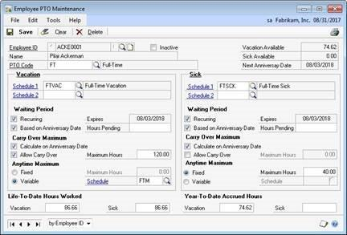

select * from PTO00100 --PTO Payroll Master
select * from PTO00101 --PTO Pending Master 
select * from PTO00102 --PTO Anniversary Carry Over

In the **Employee PTO Maintenance** window, enter or select an **Employee ID**. Enter or select the **PTO Code**. Enter or select the **Vacation and/or Sick Accrual Schedules**.

> [!NOTE]
> The system will not allow the user to assign an Inactive PTO Setup record to an Employee. If the Inactive checkbox is marked, the system will process PTO time based on core Payroll setups.

- **Vacation Available** will be populated based on values which display in the Employee Vacation-Sick Time Maintenance window in the Vacation Available field.

- **Sick Available** will be populated based on values which display in the Employee Vacation-Sick Time Maintenance window in the Sick Available field.

- **Next Anniversary Date** will be calculated on the Hire Date or Adjusted Hire Date based on your selection in the PTO Options window.

Each employee can only have one PTO Code assigned and each employee must be assigned at least one Accrual Schedule. Lookup options are available when selecting schedules. The system currently supports two vacation schedules and two sick time schedules. The second vacation and sick time schedules are not required to be used, they simply provide a greater opportunity for flexibility if needed. An example of when to use the second vacation schedule may be for floating holidays or special accrual scenarios.

> [!NOTE]
> If a second accrual schedule is assigned (for either vacation or sick), they calculate these accruals separately and then add them together for the total vacation or sick accrual.

Once a PTO Code has been selected for the Employee all the setup fields are prefilled from the PTO Code Setup window. Many of the fields are editable at the Employee level on the Employee PTO Maintenance window.

- **Waiting Period Hours Pending** - When the waiting period functionality is used, any time accrued is put into the Hours Pending field and does not show on the employee’s check as accrued or available. When the first pay run after the waiting period has passed, the Hours Pending transfers to Available and the entire lump sum shows as “Accrued” on the employee’s check.

- **Life-To-Date Hours Worked** - PTO Manager tracks all hours worked by each employee that is eligible for vacation and sick time. This information is used when applying accrual schedules where the Range Based On option is Hours Worked Life-To-Date. These fields are also editable to allow initial setup of hours eligible from previous data or other systems.

- **Vacation Hours -** - If eligible hours from previous data are available, that total can be entered into this field. As each pay run is processed, all eligible vacation hours for that pay period are added to the total.

- **Sick Time Hours** - If eligible hours from previous data are available, that total can be entered into this field. As each pay run is processed, all eligible sick hours for that pay period are added to the total.

- **Year-To-Date Accrued Hours** - PTO Manager tracks all time earned by each employee in the Year-To-Date Accrued Time fields. These fields are editable to allow initial setup of hours previously accrued for this year from previous data. These fields are also reset to 0.00 when Year-End processing occurs. The data from these fields is used when calculating maximums.

  Additional notes about these fields include:

  - They are not used in any accrual calculations

  - During initial Employee setup, do not enter values in these fields

  - These fields are not always going to equal the Available time in the Employee Vacation/Sick card

  - When an employee uses vacation or sick time, the used amount is not subtracted from these fields

  - These fields are a running total of time that an employee has accrued since January 1 of the current year

- **Vacation Time** - If hours accrued from previous data are available, that total can be entered into this field. As each pay run is processed, all accrued vacation time for that pay period are added to the total.

- **Sick Time** - If hours accrued from previous data are available, that total can be entered into this field. As each pay run is processed, all accrued sick time for that pay period will be added to the total.

### Processing Payroll with PTO Manager

Processing payroll with PTO Manager installed is no different than the Microsoft Dynamics GP core functions of payroll processing. There are no extra steps involved in the processing of payroll. After payroll has been processed, any time that has been accrued and is available for a specific employee is stored in the same core Microsoft Dynamics GP fields. This can be verified by opening the Employee Vacation/Sick maintenance card.

To open this window, click the **HR and Payroll** series button, click **Payroll** on the Cards content pane, click **Employee**, and then click the **Vac/Sick** button.

The GP User Date (in the lower left corner of GP) is the date used for Ranges, Expirations, and Maximums. Be sure to set this accordingly before processing your pay run.

1. When the pay run is built, GP totals the hours worked for pay codes that are set to accrue vacation/sick.

    Helpful scripts:
    SELECT UNTSTOPY, ACRUSTIM, ACRUVACN, * FROM UPR10203 WHERE EMPLOYID = 'XXX'
    SELECT SUM(UNTSTOPY) FROM UPR10203 WHERE EMPLOYID = 'XXX' AND ACRUVACN = '1'
    SELECT SUM(UNTSTOPY) FROM UPR10203 WHERE EMPLOYID = 'XXX' AND ACRUSTIM = '1'
2. GP determines which ‘Range’ the employee falls into based on the schedule using their hire or adjusted hire date in comparison to the GP User Date. 

3. GP multiplies the employees’ total hours by the calculation factor on the accrual schedule assigned to the employee.
4. GP looks at the ‘Maximums’ assigned in the accrual schedule.  For a Pay Period Max, GP will restrict the accrued time for the pay period down to the maximum if needed.  For Yearly Maximums, GP looks at the ‘Year-To-Date Accrued Hours’ on the Employee PTO Maintenance card to determine how many hours can be accrued for this period.  

    Note:  If you are using Waiting Periods, your hours go into the Hours Pending field in Employee PTO Maintenance, and not the Year-To-Date Accrued Hours field.  The Hours Pending field is not looked at for maximums.   If you are going to use waiting periods, it is best practice to use Per Pay Period Maximums, rather than Per Year Maximums on your Accrual Schedule. This ensures a restriction will occur before amounts update Hours Pending

5. Once the number of hours to accrue is calculated, GP checks to see if the employee’s expiration date is on or before the GP User Date.  

    - If there is no Waiting Period set up for the employee, then the accrued hours move directly to the Hours Available and Year-To-Date Accrued Hours fields. 
    - If there is an expiration date present and it is on or before the GP User Date, all of your Pending Hours (including the hours accrued in the current pay run) will move from Hours Pending, to Available and Year-To-Date Accrued Hours.  
    - If you allow Carry Over, then the amount (up to the Carry Over Maximum) will remain Available in addition to amounts described in the previous bullet point.  
    - If there is an expiration date present, but it is not met (GP user date falls after expiration date), then the accrued hours go into the Hours Pending field. 
6. If an Anytime Maximum is set, the Available amounts will be reduced to ensure ‘available amounts’ are never over the Anytime Maximum amount assigned. 

### Voiding Checks

If checks are voided for any employees that use PTO Manager and have accrued vacation or sick time on the specified pay run, the accrued time is backed out of the employee’s balance by a reversing entry.

> [!NOTE]
> A company cannot have a check number 000; if this check number exists, the Void Checks PTO functionality does not work. Meaning that the time the employee accrued on the voided check is not reversed out of their balance.*

### Summary

Once the accrual schedules are set up as discussed previously, it is necessary to assign those schedules to the appropriate employees. This chapter focused on assigning accrual schedules to employees. Some key points to remember from this chapter include:

- Waiting periods can be assigned on the employee level for a single or a recurring time period.

- Hours accrued during the waiting period are in a pending field.

- Vacation/Sick Time Maximums consists of Carry Over and Maximum Available Anytime.

## Chapter 4: Reports and Utilities

The objectives are:

- Run a PTO Liabilities report to determine departmental liability for sick and/or vacation time.

- Process year-end using the PTO Utilities window.

This chapter focuses on the reporting capabilities of PTO Manager and the period end processing that needs to take place to reset values for year end.

### PTO Code List Report

A PTO Codes List can be printed from the PTO Setup window. This report lists the active and inactive PTO Codes and the description.

### PTO Liabilities Report

The PTO Liabilities Report provides administration the opportunity to view any department’s vacation/sick liability.

To open the PTO Report Options window, click the **HR and Payroll** series button, click **Payroll** on the Reports content pane and then click **PTO**.

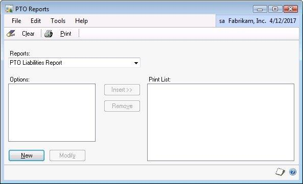

The criteria to set up this report states that employees must be assigned at least one accrual schedule and must have one pay code marked as a Primary Pay Code on the Employee Pay Code Maintenance window. When creating a PTO Report Option, the user has the flexibility to calculate liability (in hour and dollar amounts) for Vacation and/or Sick time. Liabilities can also be calculated by accrual schedule, in other words, only for employees with the selected accrual schedules assigned to them.

### Calculating the PTO Liability Report

After the PTO Report Option is set up and the report is printed, the system will find employees that meet all specified criteria. For these employees, the system finds their primary pay code pay rate and multiplies that by the amount of hours the employees have in their Available buckets. All employee hour/dollar liabilities are displayed in the report grouped by department.

> [!NOTE]
> To select the Primary Pay Code in the Pay Code window, Microsoft Dynamics GP Human Resources must be installed and registered.

### PTO Utilities Window

The PTO Utilities window is used to process the year-end information for the paid-time-off accruals. To open the PTO Utilities window, click the **HR and Payroll** series button, click **Payroll** on the Utilities content pane and then click **PTO Utilities**.

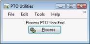

Click the **Process** button. Once Process is selected, the system checks every marked employee to allow carry over and verifies that each employee has hours that are less than or equal to the Maximum Hours Allowed. This process also resets the Year-To-Date Accrued Time fields on the Employee PTO Setup window to zero. This utility allows the company to perform the PTO Year End process at a time consistent with their business requirements.

### PTO Detail Inquiry 

Cards >> Payroll >> PTO – Go To >> PTO Detail
select * from PTO30100  --PTO Transaction 

The PTO Detail Inquiry displays accruals that have occurred for an employee.   Keep in mind that if you have a Waiting period, your accruals are still pending until your expiration date, therefore it will not show up in this window, until your pending time becomes available. 
 
### PTO Adjustment Entry Window

Cards >> Payroll >> PTO – Go To >> PTO Adjustment

You can make adjustments to Available time, PTO Transaction Detail, or Both from this window.  These do not update your Year-To-Date Accrued Hours or hours Pending so that would need to be edited manually if needed.   

Employee Available Balance Only

- This option will create an adjustment to the Vacation Available or Sick Available balance in Employee PTO maintenance (also seen in upper right corner of PTO Detail Inquiry) It also creates a transaction detail record for visibility purposes. *However, this record is excluded from the PTO Exception Report calculation as it does not factor into the running transaction totals for PTO events. 

PTO Transaction Detail Only 

- This option will create a transaction detail record but WILL NOT affect the Vacation Available or Sick Available balance in Employee PTO maintenance (also seen in upper right corner of PTO Inquiry) The amount will be included in the PTO Exception Report calculation.

Both Balance and Detail 

  - Both Balance and Detail: This option will create a detail transaction as described above and will ALSO create an adjustment to the Vacation Available or Sick Available balance in Employee PTO maintenance (also seen in upper right corner of PTO Inquiry)

### Summary

This chapter focuses on the PTO Liabilities Report and how to close out a year of accruals in PTO Manager.

Some key points to remember from this chapter include:

- PTO Liabilities Report can provide total hours and dollars associated with PTO Liability.

- The Primary Pay Code must be indicated on the Employee Pay Code Maintenance window.

- The PTO Utilities process resets the Year-To-Date Accrued Time fields on the Employee PTO Setup window to zero.

### Additional Feature Functionality added to PTO

Tips how PTO Manager should be set up: [Blog post: Understanding How PTO Manager Works in Microsoft Dynamics GP](https://community.dynamics.com/gp/b/dynamicsgp/archive/2016/06/08/understanding-how-pto-manager-works-in-microsoft-dynamics-gp)

