# Microsoft Dynamics GP Payroll Extensions

## Chapter 1: Payroll Extension Essentials

### Payroll Integration to Payables

Payroll Integration to Payables provides a time-saving tool for creating purchasing transactions for standard payroll generated expenses. As part of the payroll process, businesses need to generate checks (or EFT – Electronic File Transfer) to vendors to pay for the various deductions applied to mployee checks during payroll processing. The Payroll Vendor Setup window will allow the user to assign types of deductions to a vendor. During the posting process of the payroll processing, the system will create Payables Voucher Transaction(s) automatically. The user can then cut checks or do EFTs using the standard Microsoft Dynamics® GP Payables Management features.

With the automation of creating these purchasing transactions, you can quickly print checks and post a batch, without manually keying all the payables transactions required to complete payroll.

Payroll Integration to Payables allows you to set up Payroll Vendor selections for each transaction type available. The selections and Payroll Vendor Setup records created will determine the details of all purchasing transactions creating by Payroll Integration to Payables during the payroll posting process. If no Payroll Vendor Setup record exists for a particular tax or deduction code, no payables transaction will be created for that amount.

> [!NOTE]
> Reported Tips, Charged Tips, and Manual Checks are not supported by Payroll Integration to Payables features.

Payroll Integration to Payables also provides some additional Payroll Reporting options:

- Print Distribution Reports

- Print Period End Payroll Reports

### Overtime Rate Manager

Many methods are utilized to calculate overtime hours and overtime pay rates to apply to those hours. The methods are framed by federal law, state law, corporate policies, collective bargaining agreements and rules according to certain positions and employee classifications.

Overtime Rate Manager provides enhanced overtime calculation methods, allowing you to set up calculation methods that meet requirements of law as well as requirements based on your unique company policies. The flexibility provided in this tool allows you to apply blended rates where needed and make exceptions based on certain pay scenarios such as shift codes, positions or departments. Each calculation method can be applied at an employee level and rolled down from the company level via the Pay Code Setup window.

With the ability to assign the calculation methods you define to employee levels, you can easily manage overtime calculation variables due to multiple employee types.

Overtime Rate Manager allows you to set up one or more calculation methods that can be assigned to pay codes at both the company (Pay Code Setup window) and employee (Employee Pay Code Maintenance window) levels.

The calculation method selected will determine what calculation will be used, as well what average calculations and exclusions will be applied for transactions entered for that pay code. If no calculation method is selected for the employee pay code, no rate adjustments will take place to transactions with those pay codes. Any number and configuration of calculation methods can be created and used with Overtime Rate Manager.

### Deduction In Arrears

The Deductions In Arrears module enables the tracking of deduction balances when the employee’s net pay is not sufficient to meet all deductions or collect mandatory arrears for employee deductions where the employee does not receive a pay check.

Microsoft Dynamics GP Payroll or Human Resources users often need to track deduction amounts that the system was unable to collect during a specific pay run or that originated outside of a standard deduction. The Deductions In Arrears module has been designed to allow the uncollected deductions to be tracked, edited, added to or deleted providing activity level tracking of all arrear transactions.

Deductions In Arrears integrates with the Microsoft Dynamics GP Payroll module to provide a seamless solution. When processing your payroll in Microsoft Dynamics GP, Deductions In Arrears calculates and attempts to take any deductions that are currently in arrears. Any new deductions that cannot be collected during that payroll processing are then assigned as new arrears records for that employee.

> [!NOTE]
> Deduction In Arrears does not “uncollect” on voids; it simply updates the YTD summary for Employee + Deduction.

## Chapter 2: Payroll Setup Procedures

The objectives are:

- Understand the procedures to follow when setting up the Microsoft Dynamics GP Payroll Extensions module.

- Set up the integration to make the association between the payroll totals and their appropriate vendors.

- Set up Overtime Rate Manager calculation methods and Overtime Rate Manager options.

- Set up deduction in arrears parameters on the Deduction Setup window.

### Introduction

This chapter explains how to set up overtime rate calculation methods, default deduction in arrears and the payroll integration to payables.

Microsoft Dynamics GP Payroll Extensions is a computer application that helps to:

- Use Security Task Setup window to edit security tasks for Payroll Extensions modules.

- Use Security Roles Setup window to edit security roles for Payroll Extensions modules.

- Set up multiple calculation methods to match your company policies

- Calculate Overtime with blended rates

- Set up exceptions within each calculation method to include hours and or dollars in the calculation

- Set up exceptions within each calculation method to exclude hours/dollars for specific departments, positions or shifts

- Apply calculation methods at employee level

- Calculate Average overtime by transactions in batch only or in all batches included in the current Build

- Arrears setup at the Deduction Setup level

- Arrears setup at the Employee Deduction level

- Allow Arrears

- Mandatory Deductions/Arrears

- Collect Arrears When Possible

- Add/Edit/Delete Arrears

- Track Activity on each Arrears

- Integration with core deduction collections

- Automation of creating Purchasing Transactions for: Federal Taxes, State Taxes, Local Taxes, Company Deductions, Employee Deductions, Company Benefits, and Employee Benefits

### Security Task Setup

Use the Security Task Setup window to select a default Payroll

Extensions security task or modify the default security task. To open Security Task Setup window, click the **Administration** series button, click **System** on the Setup content pane and then click **Security Tasks**.

1. Select appropriate **Task ID**

2. Select **Product** – **HRM Solutions Series**

3. Select **Type** – **Windows**

4. Select **Series** – **3rd Party**

5. Select the following from the access list

    - Arrear Transaction Summary

    - Arrear Transactions

    - Arrear Transactions Activity

    - Arrear Transactions Reports

    - Calculation Method Setup

    - Calculation Methods

    - Deduction In Arrears Setup

    - Employee Pay Code Options

    - Mandatory Arrears

    - ORM Options

    - Pay Code Options

6. Change **Type** – **Reports**

7. Change **Series** – **3rd Party**

8. Select the following from the access list

    - APR Arrears TRX Activity Report

    - APR Arrears TRX Report

    - APR Arrears TRX Summary Report

    - APR Deduction In Arrears Register

    - APR DIA Mandatory Arrears Calculated Arrears

    - APR DIA Mandatory Arrears Payruns

    - ID Employee Ded in Arrears Report

    - ORM_Adjustment_Report

9. Change **Series** – **Payroll**

10. Select the following form the access list

    - DIA Deduction Build Report

11. Change **Product** – **Payroll Integration to Payables**

12. Change **Type** – **Windows**

13. Change **Series** – **3rd Party**

14. Select the following from the access list

    - Create Stored Procedures

    - Payroll Vendor Setup

    - Prompt Print Edit Reports

15. Change **Type** – **Reports**

16. Select the following from the access list

    - APR Payroll Vendor Setup

    - APR PPM Distribution Report Detail

    - APR PPM Distribution Report Summary By Depart

17. Change **Type** – **Windows**

18. Change **Series** – **Payroll**

19. Select the following from the access list

    - Employee Benefits

    - Employee Deductions

20. Click **Save**.

### Alternate/Modified Forms and Reports

Use the Alternate/Modified Forms and Reports window to set access to the alternate/modified forms for Payroll Extensions. To open this window, click the **Administration** series button, click **System** on the Setup content pane and then click **Alternate/Modified Forms and Reports**.

1. Select appropriate **ID**

2. Select **Product** – **HRM Solutions Series**

3. Select **Type** – **Windows**

4. Expand the Payroll folder and select the HRM Solution Series radio button for each of the following Alternate Core Microsoft Dynamics GP windows:

    - Benefit Setup

    - Deduction Setup

    - Employee Deduction Maintenance

    - Employee Pay Code Maintenance

    - Pay Code Setup

5. Click **Save**.

### Setting up Security Roles

Use the Security Role Setup window to select a default security role for Payroll Extensions or modify the default security role. To open this window, click the **Administration** series button, click **System** on the Setup content pane and then click **Security Roles**.

### Setting up Payroll Integration to Payables Management

Use the Payroll Vendor Setup window to make the association between the payroll totals and their appropriate vendors. To open this window, click the **HR and Payroll** series button, then click **Payables Integration** on the Setup content pane, and then click **Vendors.**

#### Transaction Type

Selecting the desired Transaction Type, the fields and/or options reflect that selection. For example, when Transaction Type of Local Tax is selected the **Code** field lookup contains a list of all Local Tax codes and only allows selecting a code that is a Local Tax type.

**Transaction Type** drop-down contains the list of transaction types that vendor assignments can be set up for.

#### Employee ID

**Employee and Name** fields are only accessible when the Transaction Type of Employee Deduction or Employee Benefit is selected. This allows vendor assignments to be set up for deductions at the employee level, not just the company education level.

For example, if a Child Support deduction is sent to different vendors for each employee, then set up Payroll Vendor Setup records for Employee Deductions for each employee required with that child care deduction code. The Vendor assigned can then be set to the correct one for that specific Employee's Child Care deduction payments.

#### Code

**Code** varies based on the Transaction Type selected. Selecting the code here allows selecting related Payroll Vendor setup information that is used to create a purchasing transaction for each code.

The Zoom and Lookup features available on the **Code** field allow the appropriate transaction type data available based on which transaction type is currently selected.

For example, if transaction type of Local Tax is selected the **Code** field reflects a Zoom to the correct Local Tax setup window and the Lookup reflects only Local Tax codes.

**Description** displays the appropriate description for the selected Code. The **Code** field is always a required field even though the label might not reflect that property correctly.

#### Vendor

The **Vendor** field allows selecting an existing vendor to assign to a particular Payroll Vendor Setup record. **Vendor Name** displays the appropriate name for the selected vendor.

#### Voucher Description and Document Number

**Voucher Description** list varies based on the Transaction Type selected. When any of these options are selected, when the voucher is created, the related information is pulled and inserted into the **Description** field. For example: If Voucher Description option Deduction Code + Check Date is selected, the **Description** field in the corresponding payables transaction created displays UW 4/17/2014 where the deduction code used is UW and the check date for that Pay Run is set to 4/17/2014.

Also, any specific text value can be entered by typing in this field. If the value United Way Deductions is entered, when the voucher is created, the **Document Number** field on the payables transaction displays United Way Deductions.

**Voucher Document Number** the system auto-increments by the selected Vendor ID (the first Voucher Created by Payroll Integration to Payables for a specific vendor has the Voucher Document Number set to PIP00000000000000001).

A Payroll Vendor Setup report can be printed from this window. This report contains the Payroll Vendor Setup records.

### Payroll Edit Preferences

Use the Posting Setup window to specify which pre-posting reports print after calculation separately from the reports which print during the posting process. The user can differentiate between how the system prints the pre-posting report from the posting report. To open this window, click the **Administration** series button, click **Posting** on the Setup content pane and then click **Posting**.

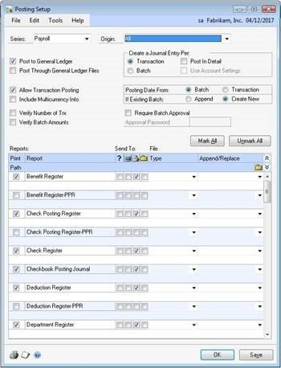

### Setup for Multiple Account Distributions

Use this window to set up distributions across multiple accounts. To open this window, click the **Administration** series button, and then click **Payroll Accounts** on the Setup content pane.

An example of this requirement is to departmentalize the accruals into multiple accounts. The configuration requirements to utilize this Payroll Integration to Payables are listed in this course.

**Payroll Account Type** - Select Deduction Withholding (CR). The Payroll Posting Account Setup window is set up to allocate Deduction Withholding (CR) by department to separate General Ledger accounts.

Use the **Vendor Account Maintenance** window to set both the Accounts Payable and Purchases GL account post to the same account number. To open this window, click the **Purchasing** series button, click **Vendor** on the Cards content pane and then click **Accounts** on the Vendor Maintenance window.

The distributions created are based on the Account setup for the particular corresponding Vendor ID. To have the payment affect the correct General Ledger account, it is necessary to change the payment Distribution to reflect the amount of each departmental accrual being paid to the associated General Ledger account. These accounts mirror the setup in Payroll Posting Accounts Setup.

### Setting up Overtime Rate Manager

Many methods are used to calculate overtime hours and overtime pay rates to apply to those hours. The methods are framed by federal law, state law, corporate policies, collective bargaining agreements and rules according to certain positions and employee classifications. To open the Calculation Method Setup window, click the **HR and Payroll** series button and then click **Overtime Methods** on the Setup content pane.

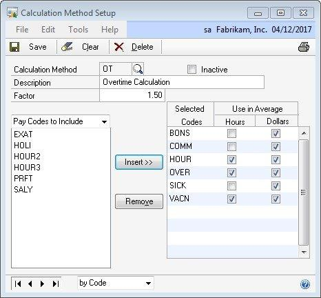

Overtime Rate Manager is used to:

- Set up multiple calculation methods to match company policies.

- Calculate overtime with blended rates.

- Set up exceptions within each calculation method to include hours and or dollars in the calculation.

- Set up exceptions within each calculation method to exclude hours and, or dollars for specific departments, positions or shifts.

- Apply calculation methods at the employee level.

- Calculate average overtime by transactions in batch only or in all batches included in the current build.

Use Overtime Rate Manager to set up one or more calculation methods that can be assigned to pay codes at both the company (Pay Code Setup window) and employee (Employee Pay Code Maintenance window) levels.

> [!TIP]
> It is not recommended to run the same build ID for multiple users a the same time. It is also not recommended to build or calculate more than one record at the same time, but rather process them sequentially.

### Calculating Overtime Hours

Overtime Hours are earned when an employee works in excess of a set amount of hours in a specific time frame. This can be hours in a day, week, and, or pay-period, and so on.

### Calculating Overtime Pay Rates

Overtime Hours are the hours worked by the employee that are eligible to receive a pay rate at least 1.5 times the standard rate. This increased rate is referred to as the Overtime Rate.

The Overtime Rate can be calculated in a number of ways. However, by law (FSLA), the overtime rate must be at least 1.5 times the standard rate. Sometimes, the difficult part is determining what the standard rate is for a particular time period where an employee works for different rates of pay. The standard rate can also take into account bonus amounts that are paid to the employee.

### Weekly Overtime

Weekly overtime is the method an employee is given overtime for any hours over 40 worked in a week.

### Overtime Hours

The overtime hours are calculated by subtracting 40 from the total hours worked in that week. The result is the number of hours the employees are paid the overtime rate for.

For example, if an employee works 45 hours in that week, the overtime hours are 5 (45-40 = 5).

### Overtime Rate

The calculation of the overtime rate paid for the overtime hours is dependent on other variables.

### Simple Method

The simplest method of calculating the overtime rate occurs if the employee works at the same rate for all hours. In this situation, that pay rate is multiplied by 1.5 to arrive at the overtime rate.

Example: The employee works 45 hours in a week at a rate of \$10 per hour for all 45 hours. The threshold for overtime is 40 hours. The employee receives \$10 per hour for 40 hours and \$15 (\$10 \* 1.5) for the 5 hours of overtime (45-40 = 5). The employee's gross pay is \$475.

### Blended Rate

The employee's overtime rate is calculated differently if the employee works hours at multiple rates of pay. In this situation, the employee's overtime rate is calculated by multiplying a weighted average rate times the overtime factor of 1.5.

Example: The employee works 45 hours in a week. The employee works 20 hours at a rate of \$10 per hour, 20 hours at a rate of \$12 per hour, and 5 hours at a rate of \$15 per hour. The employee receives the overtime rate for 5 hours. In this situation, the overtime rate is the weighted average rate for all the hours worked \* 1.5. The weighted average rate is determined by dividing the total wages / total hours: (\$200 + \$240 + \$75) / 45 = \$11.44

Typically, the overtime rate is calculated as \$11.44 \* 1.5 = \$17.16. However, in this case, the standard pay rate is not known for those 5 hours that are now considered overtime. It is not necessary to breakout the 40 hours of standard time and 5 hours of overtime. Consider the 45 hours as paid and the standard rate (factor of 1.0), so now only the overtime factor (.5) is paid for the overtime hours. So, the overtime premium for this employee is \$11.44 \* .5 = \$5.72 \* 5 (hrs) = \$28.60. The employees gross pay is \$514.80 + \$28.60 = \$543.40.

### Overtime Rate with Bonus Pay

Much like the blended rate calculation, when an employee is given a performance based bonus, this amount must be figured into the overtime calculation. Again, in this case, the weighted average rate (which the overtime rate is applied to) is determined by taking the gross wages (including bonus) / hours worked.

Example: The employee works 45 hours, and also receives a \$100 performance bonus in this pay period. The weighted average rate is determined by dividing the total wages / total hours: (\$200 + \$240 + \$75 + 100) / 45 = \$13.67 / hour.

Consider the 45 hours as paid and the standard rate (factor of 1.0), so now only the overtime factor (.5) is paid for the overtime hours. So, the overtime premium for this employee is \$13.67 \* .5 = \$6.84 \* 5 (hours) = \$34.20. The employee's gross pay is \$514.80 (hourly wages) + \$100 (bonus) + \$34.20 (Overtime Premium) = \$649.00.

The result is that even though the employee only earned a \$100 bonus, the employee's gross pay increased \$105.60 compared to the blended rate example.

### Weekly Overtime with Bi-Weekly Pay Periods

- **Overtime Hours**
  The overtime hours are calculated by subtracting 40 from the total hours worked in each week. The result is the number of hours in each week the employee is paid the overtime rate for. For example, if an employee works 45 hours in that week, the overtime hours are 5 (45-40 = 5).

- **Overtime Rate**
  The overtime rate is calculated according to the methods above. However, these calculations happen twice (one for each week) producing two distinct results for overtime hours and overtime pay rates.

### Setting up a Calculation Method

The Calculation Methods created are implemented into the calculations when they are assigned to a Pay Code or Employee Pay Code.

- **Calculation Method** - Enter a code to identify this calculation method.

- **Description** - Enter a description to identify this calculation method.

- **Inactive** - Makes a calculation method inactive. An inactive calculation method cannot be assigned to any pay codes or employee pay codes.

- **Factor** - Enter the factor to calculate by.

  - If the Pay Factor on the Pay Code Setup window is greater than or equal to 1, then the factor is added to the factor on the Calculation Method Setup window.

  - If the Pay Factor on the Pay Code Setup window is less than 1, then the factor replaces the factor on the Calculation Method Setup window.

- **Pay Codes to Include** - Select all Pay Codes to use to figure this calculation method. Click the **Insert** button. For each Pay Code selected, select to use only the hours, only the dollars or both hours and dollars from that pay code to impact the calculations.

- **Use in Average - Hours** - Select to include all payroll transaction hours for this pay code in the calculation. If this box is selected for a pay code that does not track hour units, a message stating, “This pay code does not track hours” appears, and this box cannot be selected.

- **Use in Average - Dollars** - Select to include all payroll transaction dollars for this pay code in the calculation.

When calculating MS Extensions Overtime Rate Manager Rates, the system adds the Overtime Rate Manager rate to the rate from the Employee Pay Code Maintenance window for the Pay Code associated with the MS Extensions Overtime Rate Manager rate **only if**, the factor for the selected Pay Code is \<= 1.00. Otherwise, the system uses the Overtime Rate Manager rate and ignores the rate from the Employee Pay Code Maintenance window for the Pay Code associated with the MS Extensions Overtime Rate Manager rate.

### Setting up Exceptions

The Calculation Method window allows further restrictions to the calculation method by assigning exclusions. Exclusions can be selected for Departments, Positions or Shifts. Each exception can be set to use only the hours, only the dollars or both hours and dollars from that pay code to impact the calculations.

- Select the drop-down arrow next to Pay Codes to Include.

- Select one of the following items to base exception upon:

o Department Exceptions o Position Exceptions o Shift Exceptions

In the following example, the calculation method is set up to include all selected Pay Code Hours and Dollars excluding payroll transactions where the Department is ADMN. When the transaction Department is ADMN the calculation method includes only the Dollars from that transaction when calculating the overtime rate.

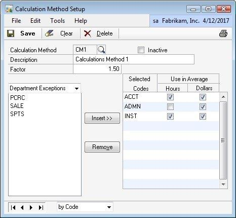

### Overtime Rate Manager Options

The Overtime Rate Manager Options window extends the functionality provided in the Overtime Rate Manager by allowing the overtime average to be calculated by only transactions within a batch or across all batches in the current build. To open this window, click the **HR and Payroll** series button and then click **Overtime Options** on the Setup content pane.

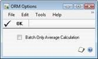

The standard Overtime Rate Manager Calculation uses all transactions across all batches in the current build. If the Batch Only Average Calculation option is selected on the ORM Options window, the overtime average is calculated based only on transactions within the same batch as the overtime transaction being calculated.

#### Example for Overtime Rate Manager

Fabrikam, Inc. uses a blended overtime methodology to determine overtime rates. Payroll Extensions offers the user flexibility to choose how to determine their overtime rate through the use of the Pay Code Setup, Pay Code Options and Calculation Method windows.

The Pay Code Setup window allows the user to determine the pay factor associated with overtime and how the calculation for overtime will be performed. In this example showing one of Fabrikam’s choices, the pay factor for the pay code OVER is set to 0.00. When the pay factor on the Pay Code Setup window is less than or equal to 1, this pay factor is added to the factor found on the Calculation Method window. Next, the user must attach one or more calculation methods using the Pay Code Options window. This is specified in the Pay Code Setup window (Microsoft Dynamics GP \> Tools \> Setup \> Payroll \> Pay Code), as shown in the following illustration.

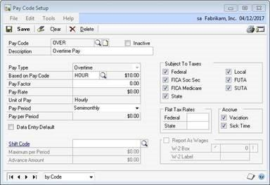

The Pay Code Options window includes functionality for Payroll Extensions and for Advanced Payroll. For this example, the fields applicable to blended overtime are the two Calculation Method fields. These two fields are active only if the selected pay code has an associated pay type of overtime or double time. Use the lookup button to select the appropriate Calculation Method, in this example OT. This is specified in the Pay Code Options window (Microsoft Dynamics GP \> Tools \> Setup \> Payroll \> Pay Code \> GoTo \>
Pay Code Options), as shown in the following illustration.

Fabrikam has chosen to apply a factor of 1.50 to this particular calculation method. In addition, they determined that of the pay codes
available, BONS, COMM, HOUR, OVER, SICK and VACN would be used to determine the average. As indicated in the illustration below, the
dollars associated with each pay code will be used to calculate the average,but only the hours for the pay codes HOUR, OVER and VACN will be used.This is specified in the Calculation Method Setup window (Microsoft Dynamics GP \> Tools \> Setup \> Payroll \> Overtime Methods), as shown in the following illustration.

To enter the time for this example, in the Payroll Transaction Entry window, Fabrikam will enter at least two transactions. One or more entries will be for straight time worked (HOUR, SICK, VACN), and there will be another entry for overtime hours.

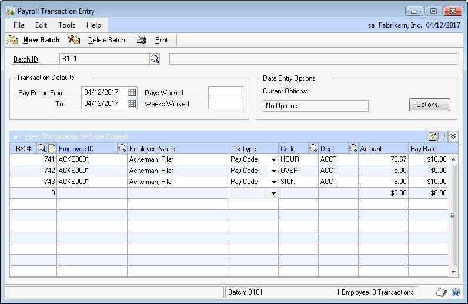

Fabrikam can choose other combinations of pay factors in the Pay Code Setup window and the factor in the Calculation Method window depending on their particular business practices. If necessary more than one Calculation Method can be assigned to the overtime pay code, which causes the results of each Calculation Method assigned to be added together for a total overtime rate.

### Setting up Pay Code Options

Use the Pay Code Options Setup window to enter Linked Pay Codes and their associated Pay Percentages or Minimum Amounts, enter AddOn Codes and Calculation Methods to Pay Codes, to exclude hours from payroll accruals, to select pay codes that will not post hours to the General Ledger, to calculate FTE by pay code and to enter whether a pay code is considered productive or non-productive time. The Pay Code Options window includes functionality for Payroll Extensions and for Advanced Payroll. The functionality specific to Payroll Extensions is discussed here.

- **Pay Code**
  Displays the pay code that you entered or selected in the Pay Code Setup window.

- **Description**
  Displays the description for the pay code that you entered or selected on the Pay Code Setup window.

- **Differential Pay**
  Select a pay code as Differential when you want to add a blended premium amount to the transactions included in a build for the Based On Pay Code which have the same Employee ID, Department Code, Position Code and Shift Code assigned to the transaction. The system will update the pay rate when the Based On Pay Code transaction Start and/or End Date falls within the Start and End Date of the Differential Pay transaction.

- **Adjust All Based On Codes**
  Mark the Adjust all based on codes check box to add a blended premium amount to other pay codes which are based on the same pay code as the differential pay code (for example: Vacation, Sick, and Holiday pay codes).

  > [!NOTE]
  > Transactions created for differential pay codes will not be paid to the employee; they will be used only for updating rates of other pay codes included in the build for the employee.

- **Calculation Method 1**
  Select an active calculation method to assign it to the selected pay code. The system will perform the calculation during the payroll process. This field is enabled only if the Pay Code is pay type overtime or double-time.

- **Calculation Method 2**
  Select an active calculation method to assign it to the selected pay code. The system will perform the calculation during the payroll process. This field is enabled only if the pay code is pay type overtime or double-time.

> [!NOTE]
> The system will sum the calculated rate from the Calculation Method 1 and Calculation Method 2.

### Setting up Deduction In Arrears

Use the Deduction Setup window to enter and maintain company deduction in arrears records to use as default entries for setting up employee deductions. To open this window, click the **HR and Payroll** series button and then click **Deduction Setup** on the Setup content pane.

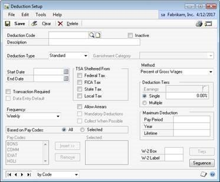

Use the Deductions In Arrears feature to track deduction balances when the employee's net pay cannot meet all deductions, or to collect mandatory arrears for employee deductions where the employee does not receive a pay check. The Deduction In Arrears feature is available for only standard deduction types. This feature is unavailable to use with garnishment deduction types.

Often, Microsoft Dynamics GP Payroll Extensions, and Microsoft Dynamics GP Human Resource users need to track deduction amounts the system is unable to collect during a specific pay run or that originated outside of a standard deduction. The Deductions In Arrears feature is designed to allow the uncollected deductions to be tracked, edited, added to or deleted
providing activity level tracking of all arrear transactions.

### Deduction Code

Select each **Deduction Code** to assign the default arrears fields:

- **Allow Arrears** - Select to default as a selected option when creating a new employee deduction. This check box enables the tracking of deduction balances when the employee’s net pay is not sufficient to meet all deductions.

- **Mandatory Deductions** - Select to default as a selected option when creating a new employee deduction. This option is not available unless the Allow Arrears option is selected. This check box collects mandatory arrears for employee deductions where the employee does not receive a pay check.

- **Collect When Possible** - Select to default as a selected option when creating a new employee deduction. This option is not available unless the Allow Arrears option is selected.

### Deduction Arrear Settings - Roll Down

When changes are made to the **Arrear Options**, and the Deduction Setup record is saved, the following message is prompted “Do you want to roll down Deduction in Arrears changes to all employees with this Deduction?”

- Click **Yes** to modify all employee deduction Arrear Options settings to match the Deduction Setup Arrear Option settings.

- Click **No** to continue with the save of this Arrear Options setting at the Deduction Setup level without modifying any existing employee deduction Arrear Options settings.

### Summary

This chapter focused on using Payroll to set up different overtime rate calculation methods, deduction in arrears and payroll integration to payables.

Some key points to remember from this course include:

- Use Deductions In Arrears to track deduction balances when an employee's net pay is not sufficient to meet all deductions, or to collect mandatory arrears for an employee's deductions when the employee does not receive a pay check.

- Set up Overtime Rate Manager calculation methods and Overtime Rate Manager options.

- Set up the integration to make the association between the payroll totals and their appropriate vendors to distribute company and employee withholdings to the appropriate vendors and account for the correct distribution of costs and liabilities in the general ledger.

## Chapter 3: Employee Setup

The objectives are:

- Assign a Calculation Method.

- Edit or add new uncollected deductions in arrears.

This chapter describes how to assign a Calculation Method. The chapter also describes how to edit or add new uncollected deductions in arrears.

### Employee Pay Code Options

Use the Employee Pay Code Maintenance window to select an employee and pay code combination to designate a linked pay code, an add-on code, or a calculation method.

The Employee Pay Code Options window also allows an add-on code to be specified as differential pay and to adjust all the pay codes that are based on the selected pay code. When you assign a new employee and pay code combination, you can choose whether to use default information from the company pay code record. If you choose to use the default information, it will be included in the Employee Pay Code Options window. This information can be edited if needed.

To open the Employee Pay Code Options window, click the **HR and Payroll** series button, click **Pay Code** on the Cards content pane, then click the **Go To** button and finally click **Employee Pay Code Options**.

When Payroll Transactions are created with this Employee and Pay Code, the pay rate is adjusted based on that Calculation Method. If there is a Calculation Method assigned to this Pay Code at the Pay Code Setup level when the Employee Pay Code record is created, the

### Calculation Method defaults

The values for this window default from the Pay Code Options window for the pay code selected. The default values are saved upon clicking **SAVE** on the Employee Pay Code Maintenance window. To change the defaults, enter the changes, press **OK** and **Save** on the Employee Pay Code record.

Employee Pay Code Option records are created when an Employee Class ID is assigned to an employee in the Employee Maintenance window: This occurs when first answering **Yes** to the “Do you want to use default information from the employee class record?” message that appears when exiting the **Class ID** field and Save the Employee Maintenance record.

- **Differential Pay**

    Select a pay code as Differential when you want to add a blended premium amount to the transactions included in a build for the Based On Pay Code which have the same Employee ID, Department Code, Position Code and Shift Code assigned to the transaction. The system will update the pay rate when the Based On Pay Code transaction Start and/or End Date falls within the Start and End Date of the Differential Pay transaction.

    Mark the Adjust all based on codes check box to add a blended premium amount to other pay codes which are based on the same pay code as the differential pay code (for example: Vacation, Sick, and Holiday pay codes).

    > [!NOTE]
    > Transactions created for differential pay codes will not be paid to the employee; they will be used only for updating rates of other pay codes included in the build for the employee.*

- **Calculation Method**

    Select one or more active **Calculation Method(s)** and assign it to the displayed Employee and Pay Code combination. The system will sum the calculation during the payroll process. This field is only enabled if the Pay Code is pay type overtime or double-time.

### Employee Standard Deduction Maintenance

Use the Employee Deduction Maintenance window to enter and maintain employee>   deduction records. To open this window, click the **HR and Payroll** series button and then click **Deduction** on the Setup content pane.

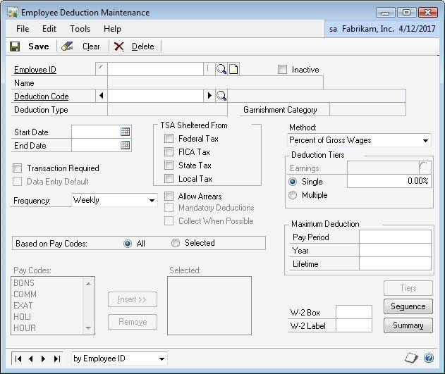

Use the Employee Deduction Maintenance window to enter Payroll deduction information for a specific employee. For example, the amount an employee wants deducted for charitable contributions or union dues can be entered. A deduction can be set up as a percentage of gross, net, or earnings wages, as a fixed amount, or as an amount per unit of wages.

The three Deductions in Arrears check boxes default from the Deduction Setup window and these defaults can be overridden.

Refer to the Payroll / Human Resources printable manuals for the other deduction setups.

- **Allow Arrears**

    Select **Allow Arrears** to enable the tracking of deduction balances when the employee's net pay is not sufficient to meet all deductions. This check box enables the tracking of deduction balances when the employee’s net pay is not sufficient to meet all deductions.

- **Mandatory Deductions**

    Select **Mandatory Deductions** to collect mandatory arrears for employee deductions where the employee does not receive a pay check. This check box collects mandatory arrears for employee deductions where the employee does not receive a pay check.

- **Collect When Possible**

    Select **Collect When Possible** to collect deduction in arrears amounts from ANY paycheck.

    If **Collect When Possible** is not selected, an attempt is made to collect deductions in arrears amounts ONLY from paychecks where the deduction code already exists on the paycheck. This option is not available unless the Allow Arrears option is selected.

> [!NOTE]
> The Maximum Deductions (per Pay Period, Per Year and Per Lifetime) still apply when Arrears options are selected. If the employee hits a Max Per Pay Period during a pay cycle the balance of the deduction amount is created as a new arrears record. If the employee hits a Max Per Year or a Max Per Lifetime during a pay cycle no arrears record is created for the balance.

### Arrears Transactions

Use the Arrear Transactions window to edit or add new uncollected deductions in arrears. To open this window, click the **HR and Payroll** series button and then click **Arrears Transactions** on the Cards content pane.

A new arrear adjustment for an uncollected deduction can be created when it is paid by the employee outside of a pay check, or if it is forgiven by the employer, or if it needs to be edited or removed. The Arrears Amount can be edited or the record can be deleted to handle these situations. The uncollected deductions in arrears amounts can be increased or reduced or the entire arrears record can be deleted.

#### Employee ID, Name and View

Enter or select an Employee ID. The selected employee's name displays.

The View option defaults to Open. However, the option exists to view either Open, or All of an Employee's transactions.

- **View Open** transactions are defined as those arrear transactions with a Remaining Balance greater or less than 0.00.

- **View All** transactions are defined as all an Employee's Arrear Transactions regardless of the Remaining Balance.

#### TRX No. and Created Date

**TRX \#** is a unique number assigned to each new arrears transaction created. **Created Date** reflects the original date the arrears transaction is created.

#### Deduction and Deduction Description

**Deduction** code displays the deduction code of the arrears transaction.

**Deduction Description** displays the deduction description of the arrears transaction.

#### Deduction Amounts

- **Deduction Amounts Original** reflects the original arrears transaction amount.

- **Deduction Amounts Collected** reflects the total amount collected against this arrears transaction.

- **Deduction Amounts Adjusted** reflects the total amount adjusted against this arrears transaction.

- **Deduction Amounts Remaining** reflects the total amount remaining on this arrears transaction.

#### Status

**Status** is an informational field that displays a User ID if this deduction is currently in a payroll build, calculate or posting process. Anytime the status is filled with a User ID this employee deduction cannot be edited.

### Arrear Transaction Summary

The Arrear Transaction Summary window allows the current or all arrears for an employee to be viewed, as in the Arrear Transactions window, but they are summarized by the deductions. To open this window, click the **HR and Payroll** series button and then click **Arrears Transactions** on the Cards content pane, then click **Go To** on the Arrear Transactions window, and then click **Arrear Transaction Summary.**

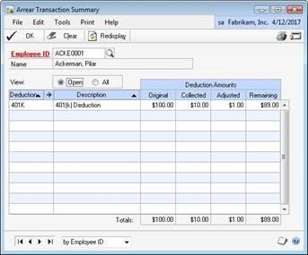

The scrolling window allows multiple sorting options by clicking on the column headings. Both ascending and descending sorts are available for these columns, the current sort indicated by the arrow on the column heading pointing up or down.

### Arrears Transaction Activity

The Arrears Transaction Activity GoTo option is available when a record/row is selected in the scrolling window and is used to view all the activity of a specific arrear transaction. To open this window, click the **HR and Payroll** series button and then click **Arrears Transactions** on the Cards content pane, then click **Go To** on the Arrear Transactions window, and then click **Arrear Transaction Activity.**

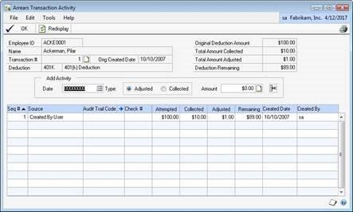

A record/row can be selected by clicking on the created date or the row. New activity arrears records can be created. The scrolling window allows multiple sorting options by clicking on the column headings. Both ascending and descending sorts are available for these columns, the current sort indicated by the arrow on the column heading pointing up or down.

#### Employee ID and Name

- **Employee ID/Name** reflects the employee associated with this arrear transaction. The selected employee's name displays.

#### TRX No. and Orig. Created Date

- **TRX \#** is a unique number assigned to each new arrears transaction created.

- **Original Created Date** reflects the original date the arrears transaction is created.

#### Deduction and Deduction Description

- **Deduction** code displays the deduction code of the arrears transaction.

- **Deduction Description** displays the deduction description of the arrears transaction.

#### Original Deduction Amount and Total Amount Collected

- **Original Deduction Amount** reflects the original arrears transaction amount. **Total Amount Collected** reflects the total amount collected against this arrears transaction.

#### Total Amount Adjusted and Deduction Remaining

- **Total Amount Adjusted** reflects the total amount adjusted against this arrears transaction. **Deduction Remaining** reflects the total amount remaining on this arrears transaction.

#### Add Activity

- **Date**
  This becomes the Created Date for the new activity record.

- **Type**
  This is the type of activity record to add; Adjusted or Collected.

- **Amount**
  This is the amount of the adjustment or collection to add with this activity record.

Click the Note icon to add a note related to this activity record to the Trx \# note.

#### Sequence Number

The sequence number is a unique number assigned to each new arrears transaction activity created.

#### Source

- **Source**
  The source is assigned to each new arrears transaction activity when it is created to reflect the process that generated the activity record. The following are the sources and the related processes that generate those particular activity records.

  - **Created By User**
    Source used when a new Arrear TRX \# is added by the user in the Arrears Transaction window.

  - **Collected By User**
    Source used when a Collected Add Activity is added in the Arrears Activity Transaction window.

  - **Edited By User**
    Source used when an Adjusted Add Activity is added in the Arrears Activity Transaction window.

    > [!NOTE]
    > This source is also used when the DIA Data Conversion is run.

- **Deleted By User**
    Source used when a record (it zero's out) is deleted in the Arrears Transaction window.

- **Created By Payrun**
    Source used when a new Arrear TRX \# is created by the payroll process.

- **Updated By Payrun**
    Source used when the payroll process updates all or a portion of an existing Arrears TRX \#.

- **Attempted By Payrun**
    Source used when no amount of an existing Arrears TRX \# can be collected during the payroll process but the payroll process attempted to collect on it.

- **Created By Voided TRX**
    Source used when a check that had an associated arrear transaction activity record is voided.

- **Created By Mandatory**
    Source used when arrears records are posted from the Mandatory window/process.

- **Employee Changes**
    Source used when Yes is the answer to the Inactivate Employee Deduction message “Do you wish to zero out the remaining balance for all arrears associated with this Employee and Deduction?” or when Yes is the answer to the Terminate Employee message “Do you wish to zero out the remaining balance for all arrears associated with this Employee and eduction?”

- **Edited By User for Settings**
    Source used when Un-Select Allow Arrears is used on an Employee/Deduction and the answer is Yes to the message “Do you wish to zero out the remaining balance for all arrears associated with this Employee and Deduction?”

#### Audit Trail Code

The Audit Trail Code assigned to the arrear transaction activity records created during the payroll process and it reflects the audit trail code associated with that payroll process. If a specific row is selected zoom to the transaction history of that audit trail code/payroll process for related information.

#### Check Number

The Check Number assigned to the arrear transaction activity records created during the payroll process and it reflects the audit trail code associated with that payroll process.

#### Attempted and Collected

- **Attempted**
  The Attempted column reflects the beginning amount of this arrear transaction activity.
- **Collected**
  The Collected column reflects the amount collected against this arrears transaction with this arrears transaction activity.

#### Adjusted and Remaining

- **Adjusted**
  The Adjusted column reflects the amount adjusted against this arrears transaction with this arrears transaction activity.

- **Remaining**
  The Remaining column reflects the total amount remaining on this arrears transaction as the end result of this arrear transaction activity.

#### Created Date and Created By

- **Created Date**
  The created date reflects the date the arrears transaction activity record is created.

- **Created By**
  The created by reflects the user that created the arrears transaction activity record.

### Summary

This chapter explains how to enter information about the employee deduction in arrears and overtime parameters.

Some key points to remember from this course include:

- The uncollected deductions in arrears amounts can be increased or reduced or the entire arrears record can be deleted.

- How to assign calculation methods.

## Chapter 4: Daily Procedures

The objectives are:

• Use the Mandatory Arrears window to process mandatory arrears.

This chapter describes how to use the Mandatory Arrears window to process the mandatory arrears.

### Mandatory Arrears

Deduction In Arrears allows mandatory arrears to be captured for collection during the pay run for an employee. Use the Mandatory Arrears window to process the mandatory arrears. To open this window, click the **HR and Payroll** series button, and click **Mandatory Arrears** on the Transactions content pane.

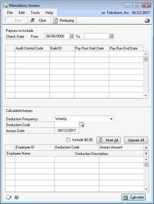

The Mandatory Arrears feature is used for a standard deduction like health insurance that is a required per pay period deduction even though the employee does not receive a pay check for that pay period.

It becomes a new step in the payroll processing to collect and post all mandatory deductions for any employees not included in that pay period processing. Once Mandatory Arrears are calculated they are then posted and an Arrears record for that employee, deduction and arrears amount is created.

Collection is not attempted for mandatory deductions without marking the Allow Arrears and Mandatory Arrears check boxes in the Employee Deduction Maintenance window.

### Check Date and Pay Runs to Include

Enter the beginning (From) and ending (To) check dates range. Once the check date range is entered, <!-- something missing -->

### Pay runs to Include

The scrolling window populates with all builds that are posted with a check date that falls within that date range. Select the appropriate builds. Mandatory Arrears are calculated based on Deduction frequency.

### Deduction Frequency, Deduction Code and Arrears Date

Once all the appropriate Builds are selected, select or enter the desired Deductions Frequency, Deduction Code and Arrears Date.

- **Deductions Frequency**

The deduction frequency restricts the calculated arrears to mandatory employee deductions that are set up with that deduction frequency.

- **Deduction Code**

  When the deduction code is left blank the system calculates mandatory arrears for all employee deductions that match the deductions frequency selected. When mandatory arrears are calculated for a specific deduction that deduction can be selected from the lookup or the deduction code can be entered into this field.

- **Arrears Date**

  Enter the date to assign the arrears record created during the Post Mandatory Arrears process.

### Calculate

Once all the criteria are selected, press **Calculate** at the bottom of the window. The system calculates which employees have mandatory deductions and are not included in any of the selected Builds that match any other criteria selected.

> [!NOTE]
> Note: The employee must not exist in any of the selected builds to show in the scrolling window in the Calculated Arrears section of the Mandatory Arrears window.

The scrolling window in the Calculate Arrears section of the Mandatory Arrears window populates with all employees and mandatory deductions that match all the criteria. The Arrears Amount defaults to that employee deduction amount from the employee deduction record but can be edited. Select the Employee/Deduction(s) to create Mandatory Arrears records for.

By selecting or deselecting the Include \$0.00 option, it further expands or restricts the Mark All selection. Mandatory Arrears functionality only supports Fixed Amount deductions.

### Summary

This chapter explains how to use the Mandatory Arrears window to process the mandatory arrears.

Some key points to remember from this course include:

• Mandatory Arrears functionality only supports fixed amount deductions.

## Chapter 5: Reports

The objectives are:

• Understand the options available for printing reports in Payroll Extensions.

Payroll Extensions provides the ability to print window level reports, Deduction in Arrears Build report and Differential Build Edit Report.

The Payroll Extensions module provides printing capabilities by using the printer icons on the individual windows. For example, pulling up the Calculation Method Setup window and selecting the printer icon (without making any Calculation Methods selections) will print a report giving all of the Calculation Methods currently set up.

### Deduction In Arrears Build Report

After the Build processing has completed, the user will be prompted with the option to print the DIA Deduction Build Report.

The report is comprised of the following data elements for each Employee/Deduction included in the Build:

- **Standard deductions** –The pay period deductions Microsoft Dynamics GP is set up to take from the employee either as Transactions entered or as automatic transactions created during the build process.

- **Arrear Transaction deductions** –The deductions that have been put into Arrears. There may be multiple arrear transactions for the same deduction. The system will track each missed or uncollected arrear separately and attempt to take that arrear until the total remaining has been completely collected. These rows are identified by the text “(DIA)” prior to the Code on the report.

> [!NOTE]
> You can adjust the arrear transactions through the Arrear Transaction windows as needed. What will be collected is only the Amount Remaining at the time the Build is generated.

### Differential Build Edit Report

The **Differential Build Edit Report** prints after the calculate checks process and details the differential transaction which was responsible for adjusting any pay codes in the build.

### Summary

Payroll Extensions provides reporting capabilities by using history windows,the Percent Current Inquiry window, and the use of printer icons on individual windows.

Key points to remember from this chapter:

• Reports are provided by using printer icons.
