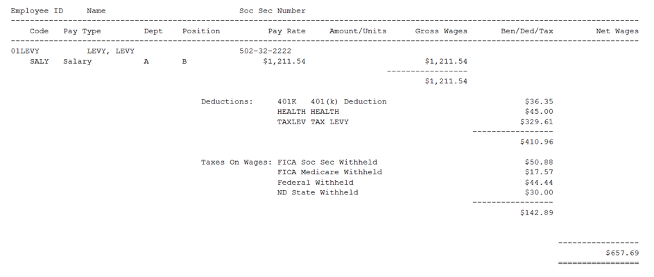
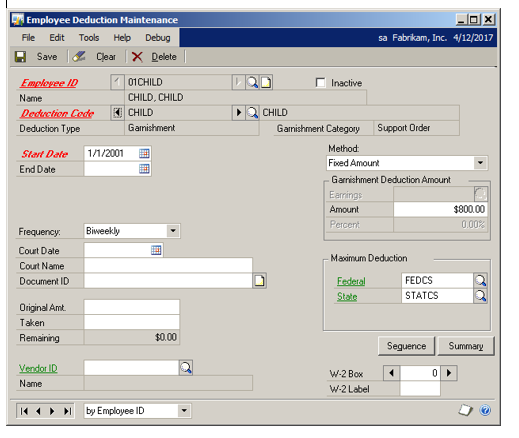

# Microsoft Dynamics GP U.S. Payroll

You can use U.S. Payroll to set up, enter, and maintain employee payroll records and transactions. Employee cards are the foundation of your U.S. Payroll system and they are used to keep your U.S. Payroll information up to date. You can view current and historical payroll information and pay activity for one employee or a group of employees.

You also can use U.S. Payroll to complete the following tasks:

- Set up employee classes to create default entries that can make data entry quicker for new employee records because the payroll information is grouped according to common factors, such as pay codes and positions

- Create batches that you use just one time, or create recurring batches for transactions that you enter on a regular basis, such as weekly payroll

- Use the reconciling process to check for discrepancies in employee financial information and for differences between detail records and summary records

- Prepare U.S. Payroll reports to analyze payroll activity and identify errors in transaction entry

- Use routines to create customized checklists for processing month-end, quarter-end, or year-end tasks, such as preparing government-required W-2 and 1099-R statements

If you are using Human Resources, you can enter and maintain your employee information in Human Resources and those transactions will automatically update your Payroll records.

If you are using Direct Deposit, you can transfer funds directly to employee bank accounts when processing payroll transactions.

If you are using Bank Reconciliation, your checkbook is automatically updated when you post Payroll transactions.

**What's in this manual**

This manual is designed to give you an understanding of how to use the features
of U.S. Payroll, and how it integrates with the Microsoft Dynamics GP system.

Some features described in the documentation are optional and can be
purchased through your Microsoft Dynamics GP partner.

To view information about the release of Microsoft Dynamics GP that you're
using and which modules or features you are registered to use, choose Help
\>\> About Microsoft Dynamics GP.

The manual is divided into the following parts:

- *Part 1, Setup*, describes how to set up Payroll, including department and
    position codes, pay codes, workers' compensation codes, and local and
    unemployment tax cards. It also explains how to set up deduction codes,
    benefit codes, and employee classes.

- *Part 2, Cards*, describes how to create employee cards, tax cards, and
    deduction and benefit cards. It also describes how to enter beginning
    balances.

- *Part 3, Transactions*, explains how to create single-use or recurring
    batches, and how to create and process Payroll check transactions.

- *Part 4, Inquiries and reports*, describes how to view current and
    historical employee information, employee pay activity, and how to use
    Payroll reports to track changes in employee pay information.

- *Part 5, Utilities*, explains how to help keep your Payroll records current
    and how to make changes to incorrect tax information.

- *Part 6, Routines*, describes how to create customized checklists of Payroll
    routines or modify existing checklists. It also describes tasks that you
    will complete at the end of the month, quarter, or year, and tasks that
    relate to government regulations and required forms.

- *Part 7, Payroll Direct Deposit*, explains how to set up and use Payroll
    Direct Deposit, create employee direct deposit cards, and create the ACH
    File used to transfer funds to employee bank accounts.

## Part 1: Setup

This part of the documentation describes how to set up Payroll, department
codes, position codes, and pay codes. It also explains how to set up local and
unemployment tax codes, workers' compensation codes, and employee classes.

The following information is discussed:

- *Chapter 1, "Setting up Payroll,"* explains how to use the setup routine
    provided with the accounting system to set up Payroll.

- *Chapter 2, "Setting up codes,"* describes how to set up location,
    department, position, supervisor, pay, and shift codes, as well as pay
    types. Once set up, you can assign these codes to employee records for
    identification purposes.

- *Chapter 3, "Setting up deductions and benefits,"* explains how to set up
    default deduction and benefit codes that will be used for setting up
    employee deductions and benefits.

- *Chapter 4, "Setting up taxes and compensation codes,"* describes how to set
    up default workers' compensation, local, and unemployment tax cards that
    will be used for setting up employee taxes.

- *Chapter 5, "Setting up employee classes,"* explains how to set up employee
    classes according to similar characteristics to help make setting up
    employee records easier and save data entry time.

### Chapter 1: Setting up Payroll

During the Payroll setup process, you'll create pay cards, benefit cards,
and deduction cards for each employee and can set up employee classes.
Before you begin setting up Payroll, be sure you've completed the System
Setup and General Ledger setup procedures. For more information about
completing these procedures, refer to Help \>\> Contents \>\> select Setting
Up the System or the General Ledger documentation.

When you set up Payroll, you can open each setup window and enter
information, or you can use the Setup Checklist window (Administration \>\>
Setup \>\> Setup Checklist) to guide you through the setup process. See your
System Setup Guide (Help \>\> Contents \>\> select Setting up the System)
for more information about the Setup Checklist window.

If you're using Human Resources, set up benefit and deduction cards in Human
Resources. Refer to the "Benefit setup" chapter in the Human Resources
documentation.

This information is contained in the following sections:

- *Payment and adjustment numbers in Payroll*

- *Overtime in Payroll*

- *Calculating overtime pay*

- *Employee numbers in Payroll*

- *Options for tracking history and employees*

- *Payroll setup options for tips*

- *Options for including year-to-date amounts*

- *Setting up Payroll default entries*

- *Required Payroll posting accounts*

- *Setting up Payroll posting accounts*

- *Setting up default transaction dimension codes for Analytical Accounting*

- *Employee onboarding workflow*

- *Employee personnel maintenance workflow*

#### Payment and adjustment numbers in Payroll

Use the Payroll Setup Options window to enter or change payment and
adjustment numbers.

- A payment number identifies a group of related entries that are posted
    collectively as a single computer or manual check.

- An adjustment number identifies a group of adjustments that you make in the
    Payroll Manual Check-Adjustment Entry window. You can use payment and
    adjustment numbers to trace transactions to the check they originated from
    in Payroll. These numbers will appear on reports as part of your audit
    trail.

- A computer check transaction number identifies a specific transaction
    entered in the Payroll Transaction Entry window.

- A manual check transaction number identifies a specific transaction in the
    Payroll Manual Check Transaction Entry window.

Each time you enter a transaction, the default numbers will increase by one
to the next available number as each number is accepted. You can change the
next numbers, but the default numbers will continue to be displayed for new
transactions.

If you use Microsoft Dynamics GP on a network where more than one person is
entering transactions at the same time, the default number might appear to
increase by two or more.

#### Overtime in Payroll

When you set up Payroll, you can mark Automatic Overtime and make other
selections in the Payroll Setup window to specify how overtime pay should be
calculated.

Automatic overtime is based on the total units for a specific pay code. The
overtime will reduce the hourly pay code and create an overtime pay
transaction for the overtime hours, based upon the transaction that you
enter for the hourly pay code, and what you've set up in the Regular Hours
Required field. If you don't want overtime calculated automatically, you
must manually enter overtime pay transactions. For more information, refer
to *Entering Payroll computer check transactions* .

If your company pays overtime wages and you mark Automatic Overtime in the
Payroll Setup window, you must enter the number of hours an employee must
work in a pay period before overtime will be paid.

For example, you might enter 40 for regular hours required if employees are
paid weekly. Assume you've marked Automatic Overtime for a biweekly pay
period and it is based on 40 hours a week. You must enter two hourly pay
code transactions for each employee; each hourly pay code should have a
corresponding overtime pay code.

If you enter a pay record transaction for an hourly employee who worked 35
hours the first week and 45 hours the next, you must enter 35 hours in the
first hourly pay code transaction and 45 hours in the second hourly pay code
transaction. The employee will then receive 75 hours of hourly pay and 5
hours of overtime pay.

If Automatic Overtime is not marked, you must enter transactions for both
hourly and overtime pay codes—one hourly pay code transaction for 75 hours
and one overtime pay code transaction for 5 overtime hours.

*Total Pay / Total Hours = Average Pay Rate x Overtime Factor for the Overtime
Pay Rate.*

If your business needs require complex overtime calculations, consider using
Overtime Rate Manager, which is included with Payroll Extensions. This
module is part of the Human Resources and Payroll Suite, which can be
installed as an additional product.

#### Calculating overtime pay

There are several ways that overtime can be calculated. Two examples are
described in detail here. Refer to online help for additional examples.

**Automatic overtime without shifts and without pay rate changes**

The following example shows how overtime will be calculated without shifts
and without pay rate changes, using the following pay codes and pay rates:

- HOUR pay code set up with a \$10.00 pay rate

- HOUR2 pay code set up with a \$12.00 pay rate

- OT pay code set up to be determined by multiplying the HOUR pay rate by the
    overtime pay factor

- OT2 pay code set up to be determined by multiplying the HOUR2 pay rate by
    the overtime pay factor

- Payroll Setup has Automatic Overtime at 40 hours

| **Pay code** | **Hours** | **X** | **Hourly calculation** | **=** | **Amount calculation** |
|--------------|-----------|-------|------------------------|-------|------------------------|
| HOUR         | 30        | X     | \$10.00                | =     | \$300.00               |
| HOUR         | 20        | X     | \$10.00                | =     | \$200.00               |
| HOUR2        | 30        | X     | \$12.00                | =     | \$360.00               |
| HOUR2        | 15        | X     | \$12.00                | =     | \$180.00               |

Total gross pay equals \$1,040.00.

The total pay per pay code is then divided by the number of hours for that
pay code to determine the average pay rate for all the transactions. Each
pay code is treated individually.

| **Pay code** | **Total pay** | **÷** | **Hours** | **=** | **Average pay rate** |
|--------------|---------------|-------|-----------|-------|----------------------|
| HOUR         | \$500.00      | ÷     | 50        | =     | \$10.00              |
| HOUR2        | \$540.00      | ÷     | 45        | =     | \$12.00              |

The overtime value is determined by multiplying the overtime hours by the
employee's overtime pay code and then multiplying that by the average pay
rate. Each pay code is treated individually.

| **Pay code** | **Hours** | **X** | **Pay factor** | **X** | **Average pay rate** | **=** | **Overtime value** |
|--------------|-----------|-------|----------------|-------|----------------------|-------|--------------------|
| OT           | 10        | X     | 1.5            | X     | \$10.00              | =     | \$150.00           |
| OT2          | 5         | X     | 1.5            | X     | \$12.00              | =     | \$90.00            |

Because we don't know which pay code should have the hours of overtime
removed, we need to reduce both pay code transactions by the weight each
provides. To do this, the regular pay code hours are multiplied by the
overtime hours and divided by the total regular hours to determine the total
number of overtime hours. Each pay code is treated individually.

| **Pay code** | **Regular hours** | **X** | **Overtime hours** | **÷** | **Total regular hours** | **=** | **Total overtime hours** |
|--------------|-------------------|-------|--------------------|-------|-------------------------|-------|--------------------------|
| HOUR         | 30                | X     | 10                 | ÷     | 50                      | =     | 6.00                     |
| HOUR         | 20                | X     | 10                 | ÷     | 50                      | =     | 4.00                     |
| HOUR2        | 30                | X     | 5                  | ÷     | 45                      | =     | 3.33                     |
| HOUR2        | 15                | X     | 5                  | ÷     | 45                      | =     | 1.67                     |

Each hourly weight is subtracted from each transaction to determine adjusted
hours. Each pay code is treated individually.

| **Pay code** | **Regular hours** | **-** | **Total overtime hours** | **=** | **Adjusted hours** |
|--------------|-------------------|-------|--------------------------|-------|--------------------|
| HOUR         | 30                | \-  | 6.00                     | =     | 24.00              |
| HOUR         | 20                | \-  | 4.00                     | =     | 16.00              |
| HOUR2        | 30                | \-  | 3.33                     | =     | 26.67              |
| HOUR2        | 15                | \-  | 1.67                     | =     | 13.33              |

The adjusted hours are multiplied by the pay rate to determine the
transaction dollar value. Each pay code is treated individually.

| **Pay code** | **Adjusted hours** | **X** | **Pay rate** | **=** | **Transaction dollar value** |
|--------------|--------------------|-------|--------------|-------|------------------------------|
| HOUR         | 24.00              | X     | \$10.00      | =     | \$240.00                     |
| HOUR         | 16.00              | X     | \$10.00      | =     | \$160.00                     |
| HOUR2        | 26.67              | X     | \$12.00      | =     | \$320.04                     |
| HOUR2        | 13.33              | X     | \$12.00      | =     | \$159.96                     |

The transaction dollar values are added to the overtime values to calculate
the total paid to the employee.

| **Pay code** | **Value** | **Description**          |
|--------------|-----------|--------------------------|
| OT           | \$150.00  | Overtime value           |
| OT2          | \$90.00   | Overtime value           |
| HOUR         | \$240.00  | Transaction dollar value |
| HOUR         | \$160.00  | Transaction dollar value |
| HOUR2        | \$320.04  | Transaction dollar value |
| HOUR2        | \$159.96  | Transaction dollar value |

Gross pay for this employee is \$1,120.00.

**Automatic overtime with shifts and with pay rate changes**

The following example shows how overtime will be calculated with shifts and
with a pay rate change, using the following pay codes and pay rates:

- HOUR pay code set up with a \$10.00 pay rate

- HOUR2 pay code set up with a \$12.00 pay rate that changes to a \$14.00 pay
    rate

- OT pay code set up to be determined by multiplying the HOUR pay rate by the
    overtime pay factor

- OT2 pay code set up to be determined by multiplying the HOUR2 pay rate by
    the overtime pay factor

- SHIFT1 pay code set up with a \$1.00 pay rate

- SHIFT2 pay code set up with a \$2.00 pay rate * Payroll Setup has Automatic
    Overtime at 40 hours

.

| **Pay code**   | **Hours** | **X** | **Hourly calculation** | **=** | **Amount calculation** |
|----------------|-----------|-------|------------------------|-------|------------------------|
| HOUR + SHIFT1  | 20        | X     | \$10.00 + \$1.00       | =     | \$220.00               |
| HOUR + SHIFT1  | 25        | X     | \$10.00 + \$1.00       | =     | \$275.00               |
| HOUR2 + SHIFT2 | 30        | X     | \$12.00 + \$2.00       | =     | \$120.00               |
| HOUR2 + SHIFT2 | 20        | X     | \$14.00 + \$2.00       | =     | \$320.00               |

Since the total hours on the transactions are 45 hours—5 hours over the
overtime limit for HOUR—and 50 hours—10 hours over the overtime limit for
HOUR2—we need to calculate overtime. However, we do not know which pay rate
the overtime needs to apply to so we need to take an average of the 2 pay
rates. We also need to add in the Shift pay to the pay rates. Each pay code
is treated individually.

The dollar value of each transaction is calculated and the shift value is
added to the dollar value. Each pay code is treated individually.

| **Pay code** | **Hours** | **X** | **Hourly pay with shift code** | **=** | **Dollar value** |
|--------------|-----------|-------|--------------------------------|-------|------------------|
| HOUR         | 20        | X     | \$11.00                        | =     | \$220.00         |
| HOUR         | 25        | X     | \$11.00                        | =     | \$275.00         |

The total dollar value for the HOUR pay code is \$495.00.

| **Pay code** | **Hours** | **X** | **Hourly pay with shift code** | **=** | **Dollar value** |
|--------------|-----------|-------|--------------------------------|-------|------------------|
| HOUR2        | 30        | X     | \$14.00                        | =     | \$420.00         |
| HOUR2        | 20        | X     | \$16.00                        | =     | \$320.00         |

The total dollar value for the HOUR2 pay code is \$740.00.

The total dollar value per pay code is divided by the number of hours for
that pay code to determine the average pay rate. Each pay code is treated
individually

| **Total dollar value** | **÷** | **Hours per pay code** | **=** | **Average pay rate** |
|------------------------|-------|------------------------|-------|----------------------|
| \$495.00               | ÷     | 45                     | =     | \$11.00              |
| \$740.00               | ÷     | 50                     | =     | \$14.80              |

The overtime hours are multiplied by the employee's overtime pay code and
then multiplied by the average pay code pay rate to determine the overtime
pay. Each pay code is treated individually.

| **Pay code** | **Hours** | **X** | **Pay factor** | **X** | **Average pay rate** | **=** | **Overtime pay** |
|--------------|-----------|-------|----------------|-------|----------------------|-------|------------------|
| OT           | 5         | X     | 1.5            | X     | \$11.00              | =     | \$82.50          |
| OT2          | 10        | X     | 1.5            | X     | \$14.80              | =     | \$222.00         |

Because we don't know which pay code should have the hours of overtime
removed, we need to reduce both pay code transactions by the weight each
provides. To do this, the regular pay code hours are multiplied by the
overtime hours and divided by the total regular hours to determine the total
number of overtime hours. Each pay code is treated individually.

| **Pay code** | **Regular hours** | **X** | **Overtime hours** | **÷** | **Total regular hours** | **=** | **Total overtime hours** |
|--------------|-------------------|-------|--------------------|-------|-------------------------|-------|--------------------------|
| HOUR         | 20                | X     | 5                  | ÷     | 45                      | =     | 2.22                     |
| HOUR         | 25                | X     | 5                  | ÷     | 45                      | =     | 2.78                     |
| HOUR2        | 30                | X     | 10                 | ÷     | 50                      | =     | 6.00                     |
| HOUR2        | 20                | X     | 10                 | ÷     | 50                      | =     | 4.00                     |

Each hourly weight is subtracted from each transaction to determine adjusted
hours. Each pay code is treated individually

| **Pay code** | **Regular hours** | **-** | **Total overtime hours** | **=** | **Adjusted hours** |
|--------------|-------------------|-------|--------------------------|-------|--------------------|
| HOUR         | 20                | \-  | 2.22                     | =     | 17.78              |
| HOUR         | 25                | \-  | 2.78                     | =     | 22.22              |
| HOUR2        | 30                | \-  | 6                        | =     | 24.00              |
| HOUR2        | 20                | \-  | 4                        | =     | 16.00              |

The adjusted hours are multiplied by the pay rate to determine the
transaction dollar value. Each pay code is treated individually.

| **Pay code** | **Adjusted hours** | **X** | **Pay rate** | **=** | **Transaction dollar value** |
|--------------|--------------------|-------|--------------|-------|------------------------------|
| HOUR         | 17.78              | X     | \$11.00      | =     | \$195.58                     |
| HOUR         | 22.22              | X     | \$11.00      | =     | \$244.42                     |
| HOUR2        | 24                 | X     | \$14.00      | =     | \$336.00                     |
| HOUR2        | 16                 | X     | \$16.00      | =     | \$256.00                     |

The transaction dollar values are added to the overtime dollar values to
calculate the total paid to the employee.

| **Pay code** | **Value** | **Description**          |
|--------------|-----------|--------------------------|
| OT           | \$82.50   | Overtime value           |
| OT2          | \$222.00  | Overtime value           |
| HOUR         | \$195.58  | Transaction dollar value |
| HOUR         | \$244.42  | Transaction dollar value |
| HOUR2        | \$336.00  | Transaction dollar value |
| HOUR2        | \$256.00  | Transaction dollar value |

Gross pay for this employee is \$1,336.50.

#### Employee numbers in Payroll

When you set up Payroll, you can mark Auto Assign Employee ID and specify
the next Employee ID number for each new employee record created for your
company.

Each time you add a new employee, the default number will increase by one to
the next available number as each number is accepted.

After an ID has been assigned to an employee it cannot be modified. To
change the employee's ID, you must inactivate the existing ID record in the
Employee Maintenance window. Then, you must create a new record for the
employee. You also will have to update all year-to-date information manually
for the employee's new ID.

*If you use Microsoft Dynamics GP on a network where more than one person is
entering a new employee record at the same time, the default number might
appear to increase by two or more.*

#### Options for tracking history and employees

When you set up Payroll, you will need to determine how much information
you'll want to track about Payroll transactions, and about your employees.

**History-tracking options**

You can select options for maintaining historical information for checks,
transactions and account distributions in the Payroll Setup window. You can
mark any or all of the following options, depending upon the needs of your
business.

**Check history** Check history includes a summary of Payroll checks.

**Transaction history** Transaction history includes pay, deduction,
benefit, state and local tax transaction information.

**Account distribution history** Account distribution history includes a
record of the distributions that have been posted to posting accounts.

You can maintain Payroll history and view employee financial information for
an unlimited number of years. To view past-year information, you can print a
history report or view check or transaction information using the inquiry
windows.

**Employee tracking options**

You will use the Payroll Setup Options window to select options for tracking
an employee's days and weeks worked, edit financial fields throughout the
Payroll system, and edit pay rates used in transactions.

**Track Days Worked** To track the number of days each employee worked for
each pay code, you must enter the number of days worked during the salary
pay period for each transaction you enter during a pay run.

**Track Weeks Worked** To track the number of weeks each employee worked for
each pay code, you must enter the number of weeks worked for each
transaction and the number of weeks worked by salaried employees during a
pay run. When you enter this information in the Build Payroll Checks window,
the days and weeks worked are rolled down to all automatic pay types. This
information will be printed on state unemployment reports.

**Edit Financial Fields** You can edit an employee's financial information,
such as employee summary information. Typically, this option shouldn't be
marked, to ensure that changes aren't made inadvertently. If you need to
make changes, it's a good idea to mark the option, make the changes, then
unmark the option again after the changes have been made. This will prevent
someone from making changes that weren't meant to be made.

**Display Rate on Trx** Mark this option to edit pay rates in the Payroll
Transaction Entry window for the following pay types:

- Hourly

- Piecework

- Overtime, double time, vacation, sick or holiday pay types that are based on
    hourly or piecework pay types

However, the following pay types or pay types based on these cannot be
edited in the Payroll Transaction Entry window:

- Salary

- Commission

- Business Expense

- Pension

- Earned Income Credit (EIC)

- Other

- Overtime, double time, vacation, sick or holiday pay types that are based on
    salary pay types

#### Payroll setup options for tips

Some of the tasks you'll need to do to take advantage of tips wage tracking
involve setting up various options and codes. Be sure you complete the
following in the Payroll Setup Options window:

- Mark the Calculate Tip Allocation option.

- Verify the Tip Allocation Rate. Check IRS regulations for the current rate
    if you are unsure of what it should be.

*Payroll uses the gross receipts method to calculate the tip allocation.
When setting up charged and reported tips, be sure the Tips Received field
is set up correctly, as it is used to determine the allocated tip amount.*

#### Options for including year-to-date amounts

You can select options for including codes with year-to-date amounts on the
check stub or earnings statements in the Payroll Setup Options window.
Marking any of the following options from this window will allow you to
reconcile Gross year-todate Amounts against the check stub or earnings
statements, even if the selected options are not included in the check run:

- Pay Codes

- Deductions

- Benefits

- State Taxes

- Local Taxes

#### Setting up Payroll default entries

Use the Payroll Setup window to set up default entries that appear throughout Payroll. Payroll history options and employee tracking options that you select can help increase your data entry time and can make compiling historical records easier for you.

**To set up Payroll default entries:**

1. Open the Payroll Setup window. (HR & Payroll \>\> Setup \>\> Payroll \>\> Payroll)


1. Enter overtime information and passwords for vacation and sick time
    available, if necessary. You will need to enter a password when you create a
    transaction for more vacation or sick time hours than the employee has
    available. Refer to *Overtime in Payroll* for more information about setting
    up overtime options. If you're using Human Resources and have marked Human
    Resources as the accrue type in the Attendance Setup window, the vacation
    and sick time fields will not be available. Refer to the "Attendance setup"
    chapter in the Human Resources documentation for more information.

2. Assign the Next Employee ID for new employee records, if necessary. Refer to
    *Employee numbers in Payroll* for more information on auto-assigning
    employee IDs in Payroll.

3. Mark the options to maintain historical information for checks,
    transactions, and account distributions, as needed. If you don't mark any
    options, you won't be able to print period-end reports or view employee
    financial information in summary and inquiry windows.

4. Enter the last date posted information and enter or select the checkbook
    from which computer and manual paychecks typically will be issued.

5. Select a check format.

6. If your organization has multiple payroll clerks who complete separate pay
    runs for each department or business unit, choose Multiuser to open the
    Multiuser Payroll Setup window.

7. Specify how concurrent payroll processing tasks are queued.

Certain tasks, such as calculating payroll checks, printing checks, and
printing direct deposit earning statements can only be performed by one user
at a time. If another user tries to perform one of these tasks at the same
time, you can specify how long that user's processing request will wait in
the queue, and how often the processing request will be retried.

1. Choose OK in the Payroll Multiuser Setup window to save your changes.

2. Choose Options to open the Payroll Setup Options window and enter additional Payroll default entries.

  

3. Enter the next transaction numbers and select the number of decimal places for pay rates, deductions, and benefits.

4. Enter user-defined field prompts for tracking additional employee information that might be specific to your company.

5. Mark Enable Fiscal Year Tracking to track employee payroll information by fiscal year, as well as by calendar year.  

    If you enable fiscal year tracking during the year, it is a good idea to reconcile your fiscal year employee information to help ensure that your historical data is summarized correctly. For more information, see Reconciling employee records.

4. Mark Track Days Worked to track the number of days an employee's work was
    assigned to each pay code. *Depending upon the calculation method used by
    your state, this information might be needed to calculate workers'
    compensation tax.*

5. Mark Track Weeks Worked to track the number of weeks each employee worked
    for each pay code.

6. Mark Edit Financial Fields to edit employee summary information throughout
    the system.

7. Mark Display Pay Rate on Trx to display and edit employee pay rates when you
    enter transactions.

8. Mark Calculate Tip Allocation and verify the Tip Allocation Rate if you
    track tips wages for your employees.

9. Mark an option if you want all of its codes with year-to-date amounts to be
    included in the check stub or earning statement.

10. Choose OK in the Payroll Setup Options window to save your changes.

11. Choose File \>\> Print to print a Payroll Options Report to verify your
    information.

> [!TIP]
> Although you can create employee classes at this time by choosing Classes to open the Employee Class Setup window, it's a good idea to wait until you've set up codes. For more information, refer to [Chapter 2 Setting up codes](#chapter-2-setting-up-codes), and [Creating an employee class](#creating-an-employee-class).

#### Required Payroll posting accounts

Payroll has several posting accounts that are required and are used only for Payroll transactions. They are:

**Gross Pay** This account type is an expense account that can be entered for all employees' salaries.

**Federal Tax Withholding** This account type is a liability account. Transactions will be posted to it for the following tax withholding codes:

- EFIC/M (Employer FICA/Medicare Tax)

- EFIC/S (Employer FICA/Social Security Tax)

- FED (Federal Tax Withholding)

- FICA/M (FICA/Medicare Tax Withholding)

- FICA/S (FICA/Social Security Tax Withholding)

**State Tax Withholding** This account type is a liability account that can be entered for state tax codes.

**Local Tax Withholding** This account type is a liability account that can be entered for local tax codes.

**Deduction Withholding** This account type is a liability account that can be entered for deduction codes.

**Employer's Tax Expense** This account type is an expense account. Transactions will be posted to it for the following tax expense codes:

- FIC/ME (FICA/Medicare Tax Expense)

- FIC/SE (FICA/Social Security Tax Expense)

- FUTA (FUTA Tax Expense)

- SUTA (SUTA Tax Expense)

**Benefits Expense** This account type is an expense account that can be entered for benefit codes.

**Benefits Payable** This account type is a liability account that can be entered for benefit codes.

**Taxable Benefits Expense** This account type is an expense account that can be entered for taxable benefit codes.

**Taxable Benefits Payable** This account type is a liability account that can be entered for taxable benefit codes.

**SUTA Payable** This account type is a liability account that can be entered for state unemployment tax liability.

**FUTA Payable** This account type is a liability account that will allow only FUTA to be entered for federal unemployment tax liability.

**Workers' Compensation Tax Expense** This account type is an expense account that can be entered for state codes to record workers' compensation expense.

**Workers' Compensation Tax Payable** This account type is a liability account that can be entered for state codes to record workers' compensation liability.

It's a good idea to set up default information using the Payroll Setup window before setting up posting accounts. If you haven't set up default information yet, see [Setting up Payroll default entries](#setting-up-payroll-default-entries) for more information about using the Payroll Setup window.

The following table shows the posting accounts required in Payroll and the departments, positions, and codes associated with each.

Review this information for [enhancements around payroll posting in Microsoft Dynamics GP 2016](https://community.dynamics.com/gp/b/dynamicsgp/archive/2016/05/26/payroll-payroll-posting-accounts-setup-enhancements).


#### Setting up Payroll posting accounts

Use the Payroll Posting Accounts Setup window to set up Payroll posting
accounts. Payroll posting accounts are used to track gross pay, taxes
withheld, tax expenses, and various benefit and deduction accounts.
Transactions posted to these accounts will appear on the Payroll Check
Posting Register.

You must set up departments and positions before setting up Payroll posting
accounts. Refer to *Setting up department codes* and *Setting up position
codes* for more information.

> [!IMPORTANT]
> Before you set up posting accounts, be sure to set the account format using the Account Format Setup window. For more information, refer to Help \>\> Contents \>\>
select Setting Up the System. You also should have completed Setting up Payroll default entries.

**To set up Payroll posting accounts:**

1. Open the Payroll Posting Accounts Setup window. (Administration \>\> Setup     \>\> Posting \>\> Payroll Accounts)

  

2. Select an account type and position for the employee's Payroll code. When
    you select an account type, existing accounts, and an account description
    for the account type chosen, will be displayed in the scrolling window. You
    can either accept the default entry for all departments and positions, or
    you can post with more detail to General Ledger if you enter departments and
    positions. You also can enter a department and position for the employees'
    pay code transactions when you enter transactions. *The Code lookup window
    displays codes for the selected posting account type. For example, if you
    selected Gross Pay for the Payroll account type, the window displays pay
    codes.*

2. Enter or select the posting account that transactions with the selected
    account type should be posted to.

3. Repeat steps 2 and 3 for all posting accounts.

4. Choose Save to save the posting accounts.

5. Choose File \>\> Print to print a Posting Accounts List to verify your
    information.

#### Setting up default transaction dimension codes for Analytical Accounting

Use the Analytical Payroll Default Dimensions window to set up default transaction dimension codes. This feature lets you link transaction dimension codes to ledger transactions in U.S. Payroll, which makes classifying, reporting, and analyzing transactions easier and more powerful. For more information on transaction dimensions and transaction dimension codes, see the Analytical Accounting documentation.

Before you can complete the procedure in this section, you must define the Payroll pay codes, benefits, deductions, and so on that you plan to use with Analytical Accounting. Also, you must install, activate, and set up Analytical Accounting, and create Analytical Accounting dimension codes and account classes. For more information, see the Analytical Accounting documentation.

**To set up default transaction dimension codes for Analytical Accounting**

1. Open the Analytical Payroll Default Dimensions window. (Administration \>\> Setup \>\> Posting \>\> Payroll Accounts \>\> Analytical Accounting button)

    

2. Select a payroll posting type.

    When you select a payroll posting type, the default entries that you defined when you set up Payroll are automatically entered in the scrolling window.

    The Code lookup window displays codes for the selected payroll posting type. For example, if you selected Gross Pay for the Payroll account type,the window displays pay codes.

1. Enter or select, as necessary, new entries for Employee ID, Department, Position, Code, or Percent.

    The alias that links Analytical Accounting to U.S. Payroll is a combination of the Payroll Posting Type, Employee ID, Department, Position, and Code. Accordingly, the same combination of those fields can exist only once. For the same reason, the Percent cannot total more than 100% for records with the same combination of those fields.

1. Choose the Print button to print the Analytical Payroll Default Dimensions report to verify your information.

2. Choose OK to save your changes and exit the window.

### Chapter 2: Setting up codes

You can set up location codes, department codes, position codes, and pay
codes to which you can assign employees for identification purposes.

This information is contained in the following sections:

- *Setting up location codes*

- *Setting up department codes*

- *Setting up position codes*

- *Setting up supervisor codes*

- *Payroll pay codes and types*

- *Setting up pay codes*

- *Setting up pay codes for tips*

- *Setting up shift codes*

- *Setting up secondary status codes*

#### Setting up location codes

Use the Company Addresses Setup window to set up a location code, which
includes an address, phone numbers, and a contact person for each location.
If your company has multiple sites, you can track which employees are
working from which sites by setting up location IDs.

**To set up location codes:**

1. Open the Company Addresses Setup window. (HR & Payroll \>\> Setup \>\>
    Payroll \>\> Location)

2. Enter an identification and name for the company's location.

3. Enter contact, address, and phone information.

4. Choose Address ID Internet to enter or view Internet information for this
    address.

5. Choose Save.

#### Setting up department codes

Use the Department Setup window to enter and maintain department codes and
descriptions. Department codes help you track employee cards by providing a
list of all the departments and their descriptions within your company. The
following are some examples of department codes you might use:

- ACTG - Accounting

- SALS - Sales

- PROG - Programming

- MKTG - Marketing

- COMM - Communications

- RSDV - Research/ Development

- SSUP - Sales/Support

- DPT1 - Department 1

- CONT - Contract Work

- SRVC - Service Work

- FDWK - Field Work

*Before setting up department codes, you should have completed Setting up
Payroll default entries . To ensure reports are printed in the correct
order, each department code should have the same number of characters. The
characters are sorted from left to right, and numbers take priority over
letters.*

**To set up department codes:**

1. Open the Department Setup window. (HR & Payroll \>\> Setup \>\> Payroll \>\>    Department)

2. Enter the code and description for a department.

3. Choose Save to store the code. Continue entering codes for all your departments.

4. Choose File \>\> Print to print a Department Codes List to verify your information.

#### Setting up position codes

Use the Position Setup window to set up a position code. A position is a defined role within a company. Positions can be used to track employee cards
by providing a list of all positions and their descriptions for your company. The following are some examples of position codes you might use:

- ACT - Accounting

- CEO - Chief Executive Officer

- BUY - Buyer

- MFG - Machinist First Grade

- GMR - Group Manager

- LBR - Laborer

- CPR - Computer Programmer

- JB1 - Job 1

- PLM - Plumber

- ELE - Electrician

If you're using Human Resources, you can link training courses and specify which skill sets, if any, are required for a position. You also can link pay codes and Americans with Disabilities Act (ADA) physical requirements to a position code. If your company uses salary matrices, you can link the low, middle and high salaries for each position to a position code. You also can add information using extra fields.

**To set up position codes:**

1. Open the Position Setup window. (HR & Payroll \>\> Setup \>\> Payroll \>\>    Position)

2. Enter a code that identifies the position and a description. Choose the notes icon button to add additional comments.

These fields are available if you're using Human Resources. For more
information, see your Human Resources documentation. **EEO Class** Select an
Equal Employment Opportunity (EEO) class **FLSA Status** Select a Fair Labor
Standards Act (FLSA) status.

**Reports to Position** Enter or select a position the individuals in the
position report to.

**Review Type** Enter or select the review type to be used for employees in
this position.

**Default Skill Set** Enter or select a required skill set.

**Position Description** Enter a description of the position.

*Choose the paperclip icon button to open the OLE (Object Linking and
Embedding) container and store a position description file.*

These buttons are available if you're using Human Resources. For more
information, see your Human Resources documentation.

**Linked Pay Codes** Opens the Position\\Pay Code Setup window to link pay
codes and salary ranges to this position code.

**ADA** Opens the ADA Physical Requirements window to add an ADA
requirements record.

**Training** Opens the Courses Available to Link window to link courses to a
position code.

**Extra Fields** Opens the Position Extra Fields window to set up extra
fields for a position code.

1. Choose Save. Continue entering codes for all positions.

2. Choose File \>\> Print to print a Position Codes List to verify your
    information.

#### Setting up supervisor codes

Use the Supervisor Setup window to enter and maintain supervisor codes and
descriptions. You can set up a supervisor record and assign an employee
record to the position.

**To set up supervisor codes:**

1. Open the Supervisor Setup window. (HR & Payroll \>\> Setup \>\> Payroll \>\> Supervisor)

2. Enter the code and description of the supervisor.

3. Enter or select the employee ID of the employee that holds this supervisor position.

- 4.Choose Save to store the code. Continue entering codes for all supervisors.

1. Choose File \>\> Print to print a Supervisor Codes List to verify your information.

#### Payroll pay codes and types

With Payroll you can set up different company pay codes to be the basis of employee pay codes and to apply changes to employee pay codes. You also can
assign company pay codes to employee classes.

When you define a pay code, you can assign pay types to it. The pay types you assign to a pay code will depend on how you're using a specific pay
code. For example, if you define a pay code SLRY for salaried employees, you probably wouldn't include the overtime or double time pay types in that pay
code.

Available pay types include:

- **Hourly**

    Hourly pay type will be used for employees who are paid by the hour.

- **Salary**

    Salary pay type will be used for employees who are paid a specific pay amount each pay period. With this pay type, the pay per period is automatically calculated. If you select this pay type, you also can enter the amount to be paid for an advance pay run. An advance pay run is a way to pay salaried employees an advance on their regular salary pay. The advanced amount will be subtracted from the employees' net pay in the next salary pay run.

- **Piecework**

    Piecework pay type will be used for employees who are paid a certain amount per unit made or completed.

- **Commission**

    Commission pay type will be used for employees who earn their wages according to what and how much they sell. You can enter the maximum earnings per pay period, and you also can enter the amount to be paid for an advance pay run. An advance pay run is a way to pay commissioned employees an advance on their commission pay. The advanced amount will be subtracted from the employees' net pay in the next commission pay run.

- **Business Expense**

    Business Expense pay type will be used to track the records of employees who are reimbursed for mileage and travel expenses. You can include the pay in the gross wages amount that will be reported on the W-2 statement.

    If you mark Report as Wages, the pay will be included in gross wages on the W-2 statement and will be treated as a nonaccountable plan. If you don't mark this option, the pay won't be included in gross wages on the W-2 statement and will be treated as an accountable plan.

    Nonaccountable plans are reported as wages on the W-2 statement and are subject to taxes. Accountable plans aren't subject to taxes and aren't reported on the W-2 statement.

    If you pay a per diem or mileage allowance and expenses exceed the Internal Revenue Service guidelines, you must tax the excess amount and report it as wages on the W-2 statement; the non-taxable portion must be reported in box 13. For more information, refer to the W-2 instructions supplied by the IRS.

- **Overtime**

    Overtime pay type will be used for employees who receive pay for working more than the assigned number of hours and are paid at a different pay rate for the additional hours.

- **Double Time**

    Double Time pay type will be used for employees who qualify for Double Time pay, normally paid at twice the rate of the Based on Pay Code rate.

- **Vacation**

    Vacation pay type will be used for employees who receive pay while on vacation.

- **Sick**

    Sick pay type will be used for employees who receive pay while they're sick.

- **Holiday**

    Holiday pay type will be used for employees who receive paid time off during holidays.

- **Pension**

    Pension pay type will be used for employees who are retired and receive pension pay from the company.

- **Other**

    Other pay types can be used to classify additional types of pay. Some examples of other pay types are jury duty, bonus pay, long-term disability, and short-term disability.

- **Earned Income Credit**

    Select Earned Income Credit if the pay code will be used for employees who qualify for earned income credit and have filed a W-5 form.

- **Charged Tips**

    Select Charged Tips if the pay code will be used for employees who receive tips from customers through a charge card or check. This amount will be included in the amount paid to employees.

- **Reported Tips**

    Select Reported Tips if the pay code will be used for employees who receive tips (cash) from customers that they report to the employer. This amount will not be included in the amount paid to the employee, but will be used to determine taxes on the reported tips.

- **Minimum Wage Balance**

    Select Minimum Wage Balance if the pay type will be used for employees who must earn a specified minimum hourly amount. This is available only for Charged Tip and Reported Tip pay types.

#### Setting up pay codes

Use the Pay Code Setup window to enter and maintain company pay codes. These codes are used as default entries when setting up employee pay codes, can be
used to apply changes to employee pay codes, and also can be included in employee classes. You can enter your own identifying pay codes and a
description for each type of pay. You also can assign pay types to pay codes. For example, you might assign an hourly pay type to the HOUR pay
code. You can set up as many pay codes for each pay type as you need for your business.

Changes made to a pay code can be reflected in any pay codes that are based on it, causing the dependent codes, including overtime and double time
codes, to recalculate their pay rates. Overtime and double time pay rates are also affected by changes made to the pay factor.

If you're using Human Resources, changes made to pay rate values in the Pay Code Setup window are not applied to employee pay records that are assigned
to a pay step. If you want to make pay rate adjustments and you have pay rates assigned to pay steps, you must first use the Employee/Pay Step Table
Assignment window to remove the pay step assignments. Refer to the Human Resources documentation for more information about pay steps.

The following are some examples of pay codes you might use:

- HOUR - Hourly

- SALY - Salary

- VACN - Vacation

- SICK - Sick time

- PCWK - Piecework

- COMM - Commission

- OVER - Overtime

**To set up pay codes:**

1. Open the Pay Code Setup window. (HR & Payroll \>\> Setup \>\> Payroll \>\> Pay Code)

    

1. Enter a pay code and description.

2. Select a pay type.

3. If you're setting up an overtime, double time, vacation, sick time, or
    holiday pay code, select the Based On Pay Code the pay type is based on. For
    example, if you're setting up an overtime pay code for an employee with an
    hourly pay type, you must base the overtime pay type on the employee's
    hourly pay, or the wages won't be calculated accurately. Enter the code for
    a specific hourly, salary or piecework pay code that you're basing the
    overtime, vacation, sick, or holiday pay type on. If the pay type is
    overtime or double time, the based on pay rate appears next to the Based On
    Pay Code field.

    When setting up pay codes, select vacation or sick as pay types for vacation and sick time. This ensures that when you enter transactions, they will automatically reduce the available amount of vacation and sick time.

1. If your pay type is overtime or double time, you also can specify a pay
    factor that is multiplied with the pay code's pay rate to determine the
    overtime or double time pay rate. If the pay factor is selected, the
    overtime or double time pay rate is automatically recalculated every time
    the pay factor is changed. The pay factor information is saved with the pay
    code. When the pay rate is changed for a pay code on which overtime or
    double time is based, the overtime or double time pay rate is automatically
    recalculated by multiplying the pay rate of the based-on pay code by the pay
    factor.

    If your business needs require complex overtime calculations, consider using Overtime Rate Manager, which is included with Payroll Extensions. This module is part of the Human Resources and Payroll Suite, which can be installed as an additional product.

1. Enter the pay rate for the amount of pay.

    - If Earned Income Credit is the pay type, leave the Pay Rate field blank to use the EIC tables supplied with Payroll to calculate the EIC
        payment.

    - Enter the name of the unit of work in the Unit of Pay field if the pay type is Piecework. This unit name will be printed on Payroll reports.

    - If the pay type is Salary or is based upon a salary pay type, select the unit of pay from the list of pay periods.

    - If the pay type is Charged Tips or Reported Tips, the Unit of Pay label changes to Tips Received. Select Directly or Indirectly.

2. Select the pay period for the wages and mark Data Entry Default to automatically use the information in this window when you create a
    transaction for the pay code during a pay run.

3. Enter or select a shift code to assign to the pay code. For more information, refer to *Setting up shift codes* .

4. Mark the taxes the pay is subject to.

5. If you selected a commission or business expense pay type, enter the maximum amount per pay period.

6. If you selected a salary or commission pay type, enter an amount to pay in advance if the employee is to receive an advance.

7. Enter the federal and state tax rate for the pay if the pay type is subject to federal or state taxes, and should be calculated at a flat rate. For
    example, bonus pay can be taxed at a 20.00 percent flat rate. You can leave these fields blank to use the tax calculations from the federal and state
    tax tables instead of a flat tax rate.

8. Mark Vacation and Sick Time to accrue vacation and/or sick time on this pay code.

    If you're using Human Resources and have marked Human Resources as the accrue type in the Attendance Setup window, these fields will not be available. Refer to the Human Resources documentation for more information.

1. Enter W-2 information.

    If the amount of the business expense should be included with gross wages on the W-2 statement, mark Report as Wages. If the business expense should also be printed in a special box on the W-2 statement, enter the number of the box in the W-2 Box field. Then enter a label, if required, to be printed in the box on the W-2 statement.

    If the amount must be reported in multiple locations on the W-2 statement, use the browse buttons to select an additional location, and enter the appropriate box number and label. You can specify as many as four locations.

   
1. Choose Save to store the pay code.

2. Choose File \>\> Print to print a Company Pay Codes List to verify your information.

#### Setting up pay codes for tips

Use the Pay Code Setup window to set up pay codes for Charged Tips, Reported
Tips, and Minimum Wage Balance, in addition to your regular hourly pay code.
The following table shows possible pay codes and descriptions:

| **Pay code** | **Description**       |
|--------------|-----------------------|
| CTIPS        | Charged tips          |
| RTIPS        | Reported tips         |
| MINWG        | Minimum wage balances |
| HR-W         | Hourly weekly         |

Refer to *Setting up pay codes* for more information.

Suppose an employee has the four pay codes listed above—hourly weekly,
minimum wage balance, charged tips, and reported tips. The first pay code
would be the normal hourly pay rate and weekly pay period, as shown in the
following Employee Pay Code Maintenance window.


Because her wages are derived primarily from tips, she also needs a charged
tips and reported tips pay code.

The charged tips pay code is used to report tips included in charge cards or
checks, not cash paid directly to the employee. Generally, these are paid to
the employee in the paycheck on a regularly scheduled basis, in this case,
weekly. The following is an example of how you could set up the reported
tips pay code.


Reported tips are tips the employee receives from patrons in cash. Employees
need to report this amount to employers on a regular basis so that a
transaction can be entered for these tips. Taxes are calculated on the tips
wages, and reported on the employee's W-2, but not withheld from the
employee's paycheck. So, the employee also needs a pay code for reported
tips, as shown in the following Employee Pay Code Maintenance window.

The employee also is guaranteed a minimum hourly wage, so she needs a
minimum wage balance pay code in addition to the three pay codes already
assigned to her. The following is an example of how you could set up the
minimum wage balance pay code.


> [!NOTE]
> Once you setup a pay code pay type, you cannot change the Pay type it will grey out.  

You can change it in the database if need be.

There are two tables the pay type is stored in:

Pay code Setup - UPR40600
Pay code Employee - UPR00400

These scripts should be run against the company database.

This is an example of changing the type to Holiday pay type for a specific code.

Update UPR00400
Set PAYTYPE = '10' where PAYRCORD = 'FLOAT'
 
Update UPR40600
Set PAYTYPE = '10' where PAYRCORD = 'FLOAT'


Below is a list of Pay types with the associated number in SQL

Hour = 1
Salary = 2
Piecework = 3
Commission = 4
Business Expense = 5
Overtime = 6
Double Time = 7
Vacation = 8
Sick = 9
Holiday = 10
Pension = 11
Other = 12
Earned Income Credit = 13
Charged tips = 14
Reported tips = 15
Minimum Wage Balance = 16 


#### Setting up shift codes

Use the Shift Code Setup window to set up a shift code. You can enter a
shift premium as an amount or percentage.

**To set up shift codes:**

1. Open the Shift Code Setup window. (HR & Payroll \>\> Setup \>\> Payroll \>\> Shift Code)

2. Enter a code that identifies the shift code and a description.

3. If the employees assigned to the shift code are eligible for additional pay
    for working this shift, mark Amount or Percent for the shift premium, and
    enter the shift amount or percent.

4. Choose Save.

5. Choose File \>\> Print to print a Shift Codes List to verify your
    information.

#### Setting up secondary status codes

Use the Secondary Status Setup window to define codes that provide more
detail about an employee's status, such as why an employee is inactive or
isn't being paid. For example, you could set up codes for inactive employees
who are taking military or family leave, or active employees who are on
probation, awaiting a grant assignment, or between school terms

**To set up a secondary status code:**

1. Open the Secondary Status Setup window. (HR & Payroll \>\> Setup \>\>
    Payroll \>\> Secondary Status)

2. Enter a code that defines the secondary status and a description.

3. Select whether the status code applies to active or inactive employees.
    Active status types can only be assigned to active employees, and Inactive
    status types can only be assigned to inactive employees.

4. Choose Save.

5. Choose File \>\> Print to print a Secondary Status Codes List to verify your
    information.

### Chapter 3: Setting up deductions and benefits

You can set up company deduction and benefit cards, also known as deduction
and benefit codes, to be used as default entries for employee deductions and
benefits. You can use these company cards to apply changes to several
employees' deduction and benefit cards at once, and assign them to employee
classes.

If you're using Human Resources, set up benefit and deduction cards in Human
Resources. Refer to the "Benefit setup" chapter in the Human Resources
documentation.

A deduction is an amount withheld from an employee's wages. For example,
donations to a charity, union dues, and contributions to retirement plans
could be set up as deductions. A garnishment is a court-ordered deduction,
often for child support, delinquent taxes, or bankruptcy debts. A
tax-sheltered annuity (TSA) is a deduction exempt from one or more types of
taxation. You can set up a deduction as a percentage of gross, net, or
earnings wages, as a fixed amount, or as an amount per unit of wages.

You also can set up deduction sequences at the company or employee level to
specify the order in which deductions are taken. If you do not create
deduction sequences, the Payroll system applies a default sequence.

A benefit is an amount paid by the employer on the employee's behalf. Some
benefits are taxable. Examples of benefits include employer-paid portions of
insurance premiums, and 401(k) matching contributions. You can set up a
benefit as a percentage of gross or net wages, as a percentage of a
deduction, as a fixed amount, or as an amount per unit of wages.

Before setting up a deduction or benefit, first complete *Setting up Payroll
default entries* . To ensure reports are printed in the correct order, be
sure that each deduction and benefit code has the same number of characters.
The characters are sorted from left to right, and numbers take priority over
letters.

Review [this blog post to set up and HAS (Health Savings Account) in Microsoft
Dynamics GP](https://community.dynamics.com/gp/b/dynamicsgp/archive/2018/05/14/how-to-setup-up-an-hsa-health-savings-account-in-microsoft-dynamics-gp).

Information is contained in the following sections:

- *Using zero benefit and deduction amounts*

- *Deduction types*

- *Deduction tiers*

- *Setting up a standard deduction*

- *Setting up a garnishment*

- *Setting up earnings codes*

- *Setting up maximum garnishment rules*

- *Deducting multiple garnishments*

- *Setting up a company-level deduction sequence*

- *Benefit types*

- *Benefit tiers*

- *Setting up a benefit*

- *Setting and activating post-dated pay rates*

- *Modifying a pay, benefit, or deduction code*

- *Inactivating or deleting a pay, benefit, or deduction code*

#### Using zero benefit and deduction amounts

You can use zero for benefit and deduction amounts when you set up benefit
and deduction cards. If you enter a zero amount, you create a zero default
for new employee records. Then, you can enter the appropriate amount of the
benefit or deduction for each employee without having to edit a standard
default amount.

You can choose to not enter a benefit or deduction amount in the following
windows:

| **Window**                     | **Fields**                            |
|--------------------------------|---------------------------------------|
| Benefit Setup                  | Benefit Tiers and Maximum Benefit     |
| Deduction Setup                | Deduction Tiers and Maximum Deduction |
| Employee Benefit Maintenance   | Benefit Tiers and Maximum Benefit     |
| Employee Deduction Maintenance | Deduction Tiers and Maximum Deduction |

When you leave any of the foregoing fields blank, the record will be saved
in Payroll even if you're not using Human Resources.

#### Deduction types

A deduction can be based upon a specified percentage or an amount of income.
You can use one of the following five calculation methods to calculate
deductions.

**Percent of Gross Wages** Calculates the deduction as a percentage of total
wages before taxes are deducted. Taxes are calculated before deductions are
made, so deducting from gross wages won't affect taxable amounts unless the
deduction is a tax-sheltered annuity.

**Percent of Net Wages** Calculates the deduction as a percentage of gross
wages after taxes. This method is only permitted when all TSA check boxes
are unmarked and when the deduction is based on all pay codes.

**Fixed Amount** Deducts a fixed amount from the employee's wages.

**Amount per Unit** Calculates the deduction based upon units using
piecework, hourly, double time or overtime pay.

**Percent of Earnings Wages** Calculates the deduction as a percentage of an
employee's Net Disposable Income (NDI). NDI is a legally-defined sum of
wages, deductions, and taxes from which garnishments and other deductions
may be taken. The definition of NDI depends on state law.

This method is not permitted for Tax Sheltered Annuities.

This method is only permitted for deductions based on all pay codes.

#### Deduction tiers

You can select either a single deduction tier or multiple tiers. The
following are some examples of how you might set up your deduction method
and tier.

**Example 1** If you select Percent of Gross Wages as the calculation
method, the tiered deduction might be set up as follows:

| **Percentage** | **Wage level**                 |
|----------------|--------------------------------|
| 4.375 percent  | Up to and including \$2,541.66 |
| 7.25 percent   | Over \$2,541.66                |

If the gross wages equaled \$3,000, the deduction is calculated as follows:

| **Wage**        | **Rate**      | **Deduction amount** |
|-----------------|---------------|----------------------|
| \$2,541.66      | 4.375 percent | \$111.20             |
| \$458.34        | 7.25 percent  | \$33.23              |
| Total deduction |               | \$144.43             |

**Example 2** If you select Fixed Amount as the calculation method, the
tiered deduction might be set up as follows:

| **Amount** | **Wage level**                 |
|------------|--------------------------------|
| \$10       | Up to \$1,000                  |
| \$15       | Over \$1,000 and up to \$2,000 |
| \$20       | Over \$2,000                   |

If the wages equaled \$3,000, the deduction is calculated as follows:

| **Wage**        | **Deduction amount** |
|-----------------|----------------------|
| First \$1,000   | \$10                 |
| Second \$1,000  | \$15                 |
| Third \$1,000   | \$20                 |
| Total deduction | \$45                 |

**Example 3** If you select Amount per Unit as the calculation method, the
tiered deduction might be set up as follows:

| **Rate per unit** | **Number of units**            |
|-------------------|--------------------------------|
| \$0.10            | Up to 100                      |
| \$0.20            | Over 100 units up to 500 units |
| \$0.39            | Over 500 units                 |

If the number of units equaled 250, the deduction is calculated as follows:

| **Units**           | **Rate per unit** | **Deduction amount** |
|---------------------|-------------------|----------------------|
| First 100 units     | \$0.10            | \$10                 |
| Remaining 150 units | \$0.20            | \$30                 |
| Total deduction     |                   | \$40                 |

#### Setting up a standard deduction

Use the Deduction Setup window to enter and maintain company deduction cards
that you can use as default entries for setting up employee deductions. You
can apply changes to employee deduction cards and can include them in
employee classes. Deductions can be taken from net, unit or gross pay.
Examples of deductions include donations to charities, union dues, and
contributions to pension plans.

Garnishments are mandatory deductions, such as debt payments enforced by
court order. To set up garnishment deductions, follow the steps in *Setting
up a garnishment* .

*Before changing a deduction code to apply a new earnings code, confirm that
the earnings code does not use the same deduction code in its own
definition. Such a circular reference could cause inconsistent and undesired
results.*

The frequency with which a deduction is taken depends on selections you make
when you build the paychecks. Your selections in the Frequency field in the
Deduction Setup window will be used to annualize the tax-sheltered deduction
when taxes for paychecks are calculated.

*If your business needs require you to track deduction balances when the
employee's net pay cannot meet all deductions, or to collect mandatory
arrears for employee deductions where the employee does not receive a pay
check, consider using Deductions in Arrears, which is included with Payroll
Extensions. This module is part of the Human Resources and Payroll Suite,
which can be installed as an additional product.*

The following are some examples of deduction codes you might use:

- ADV - Advance to Employee

- CHD - Child Care Deduction

- DEP - Family Health

- 401 - 401(k) Contribution

- MED - Medical

- SGL - Single Insurance

- UWY - United Way

**To set up a standard deduction:**

1. Open the Deduction Setup window. (HR & Payroll \>\> Setup \>\> Payroll \>\>    Deduction)


1. Enter a deduction code and description.

2. Select Standard as the deduction type.

3. Enter start and end dates for the deduction. The start date should be on or
    before the ending date of the pay period the first deduction is to be made;
    otherwise, the deduction won't be taken. If it's a continuous deduction,
    leave the end date field blank. If the ending date is on or after the ending
    date for the pay run, the deduction will be taken.

4. Mark Transaction Required if the dollar amount or percentage of the
    deduction varies each time it's calculated. For example, if you have an
    employee purchase plan and the amount you withhold varies with each
    paycheck, or there is no withholding for some paychecks, mark Transaction
    Required.

    If you mark the deduction as Transaction Required, you'll need to enter a transaction for the amount or percentage of the deduction for each pay run in which the deduction is taken.

1. Mark Data Entry Default to use the information in this window when you create a transaction for the deduction code during a pay run.

2. Select the deduction frequency.

3. Mark the taxes from which the deduction is sheltered. Taxable wages will be
    reduced by the amount of the tax-sheltered deduction before taxes are
    calculated. If federal tax is marked, the amount of the deduction won't be
    included in the Wages, Tips, and Other Comp field on the employee's W-2
    form.

4. Select whether to base the deduction on all pay codes or on a selected list
    of pay codes. To base the deduction on all pay codes, mark All. If you mark
    Selected, the pay codes list will be displayed. Select each code to base the
    deduction on and choose Insert to add the pay code to the Selected list.

5. Select a deduction method, and a single deduction tier or multiple tiers.
    For more information, refer to *Deduction tiers* and *Setting up earnings codes* .

6. Enter deduction maximums. You can enter the maximum amount an employee can
    have deducted each pay period, each calendar year, each fiscal year, and for
    the entire time the employee works for your company.

7. If you need to print the year-end total amount for this deduction on the W-2
    statement, enter the number of the appropriate W-2 statement box, and enter
    appropriate label information. See IRS rules for the applicable year for a
    current list of labels.

If the amount must be reported in multiple locations on the W-2 statement,
use the browse buttons to select an additional location, and enter the
appropriate box number and label. You can specify as many as four locations.

*You can choose Sequence to specify the order in which the deductions will
be deducted from the employee's wages. For more information about setting up
deduction sequences, see Setting up a company-level deduction sequence .*

1. Choose Save to store the code. You can then continue to set up more
    deductions.

2. Choose File \>\> Print to print a Company Deduction Codes List to verify
    your information.

#### Setting up a garnishment

Use the Deduction Setup window to enter and maintain garnishments.
Garnishments are mandatory deductions from employee pay, such as debt
payments enforced by court order. For example, a bankruptcy court may order
an employer to deduct wages to pay an employee's outstanding debts.

Specify which portion of an employee's wages are subject to garnishments.
See *Setting up earnings codes* .

Federal and state governments also set maximum percentages for garnishments.
See *Setting up maximum garnishment rules* .

Review [this detail document for examples of how Garnishments are set up](https://community.dynamics.com/gp/b/dynamicsgp/archive/2011/11/01/how-do-you-setup-a-payroll-garnishment-in-microsoft-dynamics-gp).

**To set up a garnishment:**

1. Open the Deduction Setup window. (HR & Payroll \>\> Setup \>\> Payroll \>\> Deduction)

2. Enter a deduction code and description.

3. Select Garnishment as the deduction type.

4. Select a garnishment category.

5. Select a garnishment deduction method. If you select Percent of Earnings Wages, enter or select an earnings code. Earnings codes specify the amount and type of earnings that are subject to a deduction. See *Setting up earnings codes .*

    To deduct a company fee from employee wages for processing garnishments, create a deduction code and include it in the earnings code.

1. Select the deduction frequency.

2. If you need to print the year-end total amount for this garnishment on the
    W-2 statement, enter the number of the appropriate W-2 statement box, and
    enter appropriate label information.

    See IRS rules for the applicable year for a current list of labels.

1. Choose Save to store the code. You can then continue to set up more
    garnishments or other deductions.

    You can choose Sequence to specify the order in which deductions will be taken from the employee's wages. For more information about setting up deduction sequences, see Setting up a company-level deduction sequence .

1. Choose File \>\> Print to print a Company Deduction Codes List to verify
    your information.

#### Setting up earnings codes

Use the Earnings Setup window to define an employee's Net Disposable Income
(NDI). NDI is a legally-defined selection of wages, deductions and taxes
from which garnishments and standard deductions may be taken. The definition
of NDI depends on state law.

You can set maximum deduction amounts in the Garnishment Maximum Setup
window. See *Setting up maximum garnishment rules* .

**To set up earnings codes:**

1. Open the Earnings Setup window. (HR & Payroll \>\> Setup \>\> Payroll \>\> Earnings Setup)

    

1. Enter or select an earnings code.

2. Enter a description.

3. Select a pay code and choose Insert to move it to the Selected list for
    inclusion in this earnings code. Choose Insert All to move all pay codes to
    the Selected list.

    To remove a pay code from the Selected list, select it and choose Remove. Choose Remove All to remove all pay codes.

1. Select a deduction code and choose Insert to move it to the Selected list
    for inclusion in this earnings code. Deductions in the Selected list reduce
    net disposable income.

    To deduct a company fee from employee wages for processing garnishments, create a deduction code and include it in the earnings code.

1. Mark the taxes to apply to this earnings code and reduce net disposable
    income.

2. Choose Save to store the code.

#### Setting up maximum garnishment rules

Federal and state law each establish maximum rates and amounts for
garnishments. Payroll calculates garnishment amounts using both state and
federal maximum amount rules, compares them to the target garnishment
amount, and selects the lesser of the three amounts as the garnishment.

**To set up maximum garnishment rules:**

1. Open the Garnishment Maximum Setup window. (HR & Payroll \>\> Setup \>\>
    Payroll \>\> Garnishment Maximum Setup)

2. Enter or select a maximum deduction code.

3. Enter a description.

4. Mark Include Previously Sequenced Garnishment Deductions if multiple
    garnishments are levied against an employee, and you want to deduct the
    garnishments in sequence until the maximum value is reached. If the full
    amount of a given garnishment can't be deducted without the total exceeding
    the maximum, Payroll will deduct as much of the garnishment as possible. For
    more information, see *Deducting multiple garnishments* .

5. Enter a state by postal abbreviation, enter FED for federal, or select a
    jurisdiction from the lookup window.

6. Select the method of garnishment. *If selecting Percent of Earnings as the
    method, confirm that the earnings code you select does not use the same
    garnishment that will use this maximum deduction code.*

7. Enter the maximum percentage of wages to be garnished.

8. Enter the maximum amount of wages exempt from garnishment.

9. Enter the minimum wage rule amount, if required. For some types of
    garnishments, the law may exempt an amount of the employee's wages equal to
    a specified number of hours multiplied by the minimum wage.

10. If you selected Percent of Earnings as the calculation method, enter or
    select an earnings code.

11. Choose Save to store the code.

#### Deducting multiple garnishments

If multiple garnishments are levied against an employee, you'll first need
to set up codes defining the maximum rates and amounts that can be withheld,
in accordance with applicable state and federal regulations. (See *Setting
up maximum garnishment rules* ) Then you'll need to decide how to apply the
maximums when calculating an employee's pay. Payroll provides several ways
to apply maximums:

**To each garnishment individually** When you define maximum codes in the

Garnishment Maximum Setup window, leave the Include Previously Sequenced
Garnishment Deductions option unmarked. Each garnishment is compared to the
maximum, and deducted if it does not exceed the maximum. This method works
best for single garnishments; however, if you use this method for multiple
garnishments, you may want to define separate maximum deduction codes for
each garnishment.

##### **To multiple garnishments, in a priority sequence** In the Garnishment

Maximum Setup window, mark the Include Previously Sequenced Garnishment

Deductions option. Garnishments will be deducted in the order defined in the
Employee Deduction Sequence window, until the maximum value is reached. If
the full amount of a given garnishment can't be deducted without the total
exceeding the maximum value you define, Payroll will deduct as much of the
garnishment as possible. If the same maximum deduction code applies to any
garnishments with later sequence numbers, those garnishments won't be
deducted.

##### **To multiple garnishments, without priority** In the Employee Deduction

Sequence window, assign the garnishments the same sequence number. In the
Garnishment Maximum Setup window, define a maximum code that applies to the
total of all the garnishments that have the same sequence number, and leave
the Include Previously Sequenced Garnishment Deductions option unmarked. If
the total of all the garnishments that have the same sequence number exceeds
the maximum, the garnishments will be reduced by an even or proportional
value specified in the Split Method window.

For example, assume an employee has three garnishments of differing
priority. The total of all garnishments cannot exceed \$200, so a maximum
deduction code is set up with this amount, and applied to all three
garnishments. The Include Previously Sequenced Deductions option is marked
in the Garnishment Maximum Setup window.

| **Name** | **Target** | **Maximum** | **Taken** | **Calculation**                       |
|----------|------------|-------------|-----------|---------------------------------------|
| GARN1    | 150        | 200         | 150       |                                       |
| GARN2    | 75         | 200         | 50        | 200 (maximum) - 150 (previous amount) |
| GARN3    | 50         | 200         | 0         | 200 (maximum) - 200 (previous amount) |

Be aware that when there are separate state and federal maximums, Payroll
will always apply the maximum that deducts the smallest amount from an
employee's pay.

#### Garnishment Setup Examples

##### Tax Levies

A federal tax levy is accomplished by ‘garnishing’ an employee’s wages to the extent that they are not exempt from the levy.  For example, there may be a tax levy that is for $25,000.  The tax levy deduction will be taken from the employees ‘take-home pay’ until it reaches the exempt amount.

The exempt amount is an amount that comes from the table (after looking at form 668-W that the employee fills out – (according to the number of exemptions, the pay period, and the filing status)).  

The ‘take-home pay’ will be calculated as Wages, minus all Taxes and Deductions (both voluntary and involuntary) that were in effect at the time of receiving the tax levy.  Once an employee’s take-home pay has been determined, all but the exempt amount is subject to the levy.

Any new payroll deductions that are initiated by the employee after the levy has been received by the employer must be deducted from the exempt amount when determining the employee’s net pay, unless they are required as a condition of employment.  (This also includes increases in elective deductions such as a 401k.) 

It looks like Tax Levies are always an amount (by looking at the form 668-W).

Example:  Employee Arthur receives $1,211.54 every two weeks.  On Aug 1, 2010, the employer receives form 668-W stating that a federal tax levy was being issued against Arthur’s wages for $25,000.  Arthur claimed married filing jointly with 3 personal exemptions on Part 3 of the form.  (The exempt amount taken from the table is $657.69.)  As of Aug 1, Arthur had the following deductions:

| Type | Amount |
|--|--|
| Federal income tax | $44.44 |
| Medicare tax | 17.57 |
| State income taxes | 30.00 |
| 401K plan(3% of salary) | 36.35 |
| Health INS (after tax) | 45.00 |
| Total: | $224.24 |

Prior to the Tax Levy, Arthur’s take-home pay is $987.30 ($1,211.54 - $224.24).  The exempt amount of Arthur’s take-home pay (taken from the table) is $657.69.  Therefore, the amount subject to the tax levy is $329.61 ($987.30 - $657.69).  And the take home pay after the Tax Levy is $657.69.

How would we set up this deduction?

In the **Employee Deduction Maintenance** window:

| Field | Value |
|--|--|
|Deduction Type|  Garnishment|
|Original Amount|$25,000|
|Method |      Fixed Amount|
|Garnishment Category|Tax Levy|
|Amount |$25,000|
|Percent |N/A|
|Earnings |N/A|
|Maximum Deduction Codes||
|Federal|FEDLEVY (this is just an example)|
|State |N/A|


In the **Garnishment Maximum Setup** window:

| Field | Value |
|--|--|
| Code|FEDLEVY |
| Method |Percent of Earnings |
| Max Withholding %	|100% |
| Max Exempt Amount|	$657.69 (This is the amount taken from the table) |
| Min Wage Rule Amt	|$0 |
| Earnings Code |FEDLEVY |


In the **Earnings Setup** window:

| Field | Value |
|--|--|
| Code |FEDLEVY |
| Pay Codes| All |
| Deductions </br>(According to the info we have about Federal Tax Levies, it should be all deductions that are being taken at the time the tax levy was issued.  New deductions after the tax levy is in place would not be included.) |        401K & Health Insurance |
| Taxes |      All Checkboxes Marked |


Recap of the **Calculate Checks** report:

Prior to the Tax Levy, Arthur’s take-home pay is $987.30 ($1,211.54 - $224.24).  The exempt amount of Arthur’s take-home pay (taken from the table) is $657.69.  Therefore, the amount subject to the tax levy is $329.61 ($987.30 - $657.69).  And the take home pay after the Tax Levy is $657.69.



##### Child Support Withholding Orders

Maximum amount to withhold:  Under the CCPA, the maximum amount that can be withheld from an employee’s wages for spousal or child support is:

- 50% of the employee’s ‘disposable earnings’ if the employee is supporting another spouse and/or children.
- 60% if the employee is not supporting another spouse and/or children.
- 
Note:  These amount increase to 55% and 65%, respectively, if the employee is at least 12 weeks late in making support payments.  State laws may impose lower limits.

Disposable earnings are determined by subtracting all deductions required by law from an employee’s gross earnings (wages, commissions, bonuses, sick pay, and periodic pension payments).  Deductions required by law include withholding for federal, state, or local income tax, social security or Medicare tax, state unemployment or disability tax, and mandated payments for state employee retirement systems.  

Voluntary deductions, such as health and life insurance premiums, union dues, and retirement plan contributions, are not subtracted from earnings to calculate disposable earnings.  (State law needs to be checked, as some states require health insurance premiums to be deducted when determining disposable earnings.)  Wages already subject to withholding for tax levies, bankruptcy orders, other child support withholding orders, or wage garnishments are not considered deductions required by law.  Therefore, they should not be subtracted from gross earnings when determining the maximum amount subject to child support withholding.  

However, if the tax levy, bankruptcy order, etc. has priority over the current child support withholding order, the amount required to be deducted under the order having priority must be taken into account when determining whether the CCPA maximum has been reached.  Tips may or may not be earnings (depends on whether they are given directly to employees vs being added to the bill and paid to the employee later as earnings). 

It looks like Child Support Withholding Orders are always an amount (according to the form that is filled out).

Ex:  Gary’s employer receives a child support withholding order from his home state of Arkansas, demanding that $800  in current support with no arrears, of Gary’s earnings be withheld each pay period if paid bi-weekly.  The amounts of Gary’s income are determined as follows:


Since the child support withholding maximum calculated is less than the $800 demanded in the withholding notice, the system compares the numbers between state and federal.  The lowest maximum available amount to garnish between the two is the amount available for garnishment. Gary has $728.85 available for garnishment on his paycheck.

His final take home pay is $405.90  ($1134.75 - $728.85).  The amount remaining of $71.15 ($800.00 - $728.85) is the responsibility of the employee.  We do not arrear child support.  

How would we set up this deduction?

In the **Employee Deduction Maintenance** window:

| Field | Value |
|--|--|
| Deduction Type | Garnishment |
| Method | Fixed Amount |
| Garnishment Category | Child Support |
| Amount | $800.00 |
| Percent | N/A |
| Earnings | N/A |
| Maximum Deduction Codes |  |
| Federal | FEDCS |
| State | AKCSWHLTH |



In the **Garnishment Maximum Setup** window:


In the  **Earnings Setup** window:


Recap of **Calculate Checks** report:


##### Creditor Garnishments

There is a limit on the amount that can be garnished.  The CCPA states that the maximum amount of an employee’s ‘disposable earnings’ that can be garnished to repay a debt is the lesser of:

- 25% of the employee’s disposable earnings for the week; or
- The amount by which the employee’s disposable earnings for the week exceed 30 times the federal minimum hourly wage then in effect.

> [!NOTE]
> There is a table in the book for this depending on if the employee is paid weekly, biweekly, semimonthly or monthly.
> 
> Also, State Laws may still apply.

Disposable earnings are determined by subtracting all deductions required by law from an employee’s gross earnings (wages, commissions, bonuses, sick pay, and periodic pension payments).  Deductions required by law include withholding for federal, state, or local income tax, social security or Medicare tax, state unemployment or disability tax, and mandated payments for state employee retirement systems (but not amounts designated for direct deposit into an employee’s bank account).  Voluntary deductions, such as health and life insurance premiums, union dues, and retirement plan contributions, are generally not subtracted from earnings to calculate disposable earnings.  In some states, health insurance contributions may be included in the calculation of disposable pay, especially if the contributions are mandated under a child support order.  Tips may or may not be earnings (depends on whether they are given directly to employees vs being added to the bill and paid to the employee later as earnings).

In determining an employee’s disposable earnings, wages already subject to withholding for child support, tax levies, or bankruptcy orders are not considered deductions required by law.  Therefore, they should not be subtracted from gross earnings when determining the maximum amount subject to garnishment.  However, if the child support withholding order, tax levy, or bankruptcy order has priority over the creditor garnishment and constitutes at least 25% of the employee’s disposable wages, no amount can be withheld for the creditor garnishment.

When looking at information, it looks like Creditor Garnishments will be an amount.  

Ex:  Employee Michelle’s Disposable Earnings bi-weekly is $769.23. Her employer in Illinois receives a garnishment order on March 10, 2020 requiring that $1000 total be withheld at 15% per pay period.  

The maximum amount of Michelle’s disposable earnings that can be garnished is determined as follows:

- Creditor Deduction Calculation:
    - $769.23 x 15% = $115.38 (this is the amount calculated for the Creditor Garnishment Deduction prior to looking at the Maximum rules)
- Federal Creditor Garnishment Withholding Maximum:  Use the lesser of:
    - (25% of Disposable Earnings) $769.23 x 25% = $192.31
    - (The amount by which earnings are greater than 30 times the Federal Minimum Wage) (for bi-weekly 60 times the Federal Minimum Wage) 60 x $7.25= $435.00		$769.23-$435.00 = $334.23
- IL Creditor Garnishment Withholding Maximum:  Use the lesser of:
    - (25% of Disposable Earnings) $769.23 x 25% = $192.31
    - (The amount by which earnings are greater than 30 times the State Minimum Wage)(for bi-weekly 60 times the State Minimum Wage) 60 x 8.25 = $495.00		$769.23-$495.00 = $274.23

The computer calculates the Withholding Maximums and compares the numbers between state and federal.  The lowest maximum available amount to garnish is the amount available for garnishment.

Typically if you have multiple garnishments with creditor garnishments in your setup as this example you would not mark the box to include previously sequenced garnishment deductions when using the Min Wage Rule Amount.  If you do, you will notice unexpected results.  What you will want to do with this example if you have more garnishments is include the first garnishment in your earnings code and reduce from earnings by that garnishment.  Then in this example, it still would only take the maximum of the two of 115.38, it adds them together and reduces the 2nd garnishment to take only as much as it can to keep the Min Wage Rule Amount you have set.

How would we set up this deduction?

In the **Employee Deduction Maintenance** window:

| Field | Value |
|--|--|
| Deduction Type | Garnishment |
| Method | Percent of Earnings |
| Garnishment Category | Garnishment |
| Amount | N/A |
| Percent | 15 % |
| Earnings | FEDCREDIT  |
| Maximum Deduction Codes |  |
| Federal | FEDCEDIT |
| State | STATECRED |


In the **Garnishment Maximum Setup** window:


In the  **Earnings Setup** window:


Recap of **Calculate Checks** report:


If you need to take another garnishment before this Credit garnishment of 115.38 but still have the total of the two are 115.38 so you meet the Min Wage Rule Amount you set in Garnishment Maximum setup.  Create your other deduction, in this example it was a fixed amount of 30.00 I want that out first, then my credit deduction listed above.  In your Earnings Setup code, insert over this deduction under the Reduce from Earnings area.

In this example, I lowered my pay so you can see the minimum kick in
Federal Creditor Garnishment Withholding Maximum:  Use the lesser of:
•	(25% of Disposable Earnings) $480.77 x 25% = $120.19
•	(The amount by which earnings are greater than 30 times the Federal Minimum Wage) (for bi-weekly 60 times the Federal Minimum Wage) 
60 x $7.25= $435.00		$480.77-$435.00 = $45.77


#### Setting up a company-level deduction sequence

Use the Deduction Sequence Setup window to specify a company-level sequence
in which deductions are deducted from employees' wages.

Use the Employee Deduction Sequence window to specify sequences for
individual employees. See *Chapter 8, "Deduction and benefit cards."*

You can assign all types of deductions to the sequence, including standard,
garnishment, and TSA types. The Payroll system will calculate the TSA
deductions from pre-tax wages, regardless of the sequence.

If you do not create deduction sequences, the Payroll system applies this
default sequence:

- Standard TSA deductions (FICA sheltered), in alphanumeric order by code.

- Standard TSA deductions (not FICA sheltered), in alphanumeric order by code.

- Garnishment deductions, in alphanumeric order by code.

- Standard non-TSA deductions, in alphanumeric order by code.

*Before you set up deduction sequences, be sure to set up your deductions.
Refer to Setting up a standard deduction . You should also set up Payroll
default entries.*

**To set up a company-level deduction sequence:**

1. Open the Deduction Sequence Setup window. (HR & Payroll \>\> Setup \>\> Payroll \>\> Deduction Sequence)

    

    You also can open this window by choosing Sequence in the Deduction Setup window.

1. Select an unsequenced deduction from the Unsequenced Deductions list and
    choose Insert to add it to the Sequenced Deductions list in the lowest
    position.

2. To move a sequenced deduction to a higher or lower position, select it and
    choose the up or down arrow button.

3. Choose OK to save the deduction sequence.

#### Benefit types

A benefit can be based on a specified percentage or an amount of income. You
can use one of the following five calculation methods to calculate the
benefit.

**Percent of Gross Wages** Calculates the benefit using total wages before
taxes are deducted.

**Percent of Net Wages** Calculates the benefit using gross wages minus
taxes.

**Percent of Deduction** Calculates the benefit as a percentage of the total
deduction it's based on.

**Fixed Amount** Calculates the benefit as a fixed amount.

**Amount per Unit** Calculates the benefit based on piecework, hourly, or
overtime wages.

#### Benefit tiers

You can select either a single benefit tier or multiple tiers. The following
are some examples of how you might set up your calculation method and tier.

**Example 1** If you select Percent of Gross Wages as the calculation
method, the tiered benefit might be set up as follows:

| **Percentage** | **Wage level**                 |
|----------------|--------------------------------|
| 4.375 percent  | Up to and including \$2,541.66 |
| 7.25 percent   | Over \$2,541.66                |

If the gross wages equaled \$3,000, the benefit is calculated as follows:

| **Wage**        | **Rate**      | **Benefit amount** |
|-----------------|---------------|--------------------|
| \$2,541.66      | 4.375 percent | \$111.20           |
| \$458.34        | 7.25 percent  | \$33.23            |
| Total deduction |               | \$144.43           |

**Example 2** If you select Fixed Amount as the calculation method, the
tiered benefit might be set up as follows:

| **Amount** | **Wage level**                 |
|------------|--------------------------------|
| \$10       | Up to \$1,000                  |
| \$15       | Over \$1,000 and up to \$2,000 |
| \$20       | Over \$2,000                   |

If the wages equal \$3,000, then the benefit is calculated as follows:

| **Wage**       | **Benefit amount** |
|----------------|--------------------|
| First \$1,000  | \$10               |
| Second \$1,000 | \$15               |
| Third \$1,000  | \$20               |
| Total benefit  | \$45               |

**Example 3** If you select Amount per Unit as the calculation method, the
tiered benefit might be set up as follows:

| **Rate per unit** | **Number of units**            |
|-------------------|--------------------------------|
| \$0.10            | Up to 100                      |
| \$0.20            | Over 100 units up to 500 units |
| \$0.39            | Over 500 units                 |

If the number of units equal 250, the benefit is calculated as follows:

| **Units**           | **Rate per unit** | **Benefit amount** |
|---------------------|-------------------|--------------------|
| First 100 units     | \$0.10            | \$10               |
| Remaining 150 units | \$0.20            | \$30               |
| Total benefit       |                   | \$40               |

#### Setting up a benefit

Use the Benefit Setup window to enter and maintain company benefit cards
that you can use as default entries for setting up employee benefits. You
can apply changes to employee benefit cards and include them in employee
classes. Benefits can be calculated on net, unit or gross pay. Examples of
benefits include insurance premiums and 401(k) matching contributions.

The Employer Maximum Match field stores the maximum the employer will
contribute to an employee's 401(k) fund. With this feature, you can set up
one 401(k) deduction and one benefit code for an employee.

The following are some examples of benefit codes you might use:

- 401M - 401(k) Employer Match

- CMCH - Contribution Match

- INSU - Insurance

**To set up a benefit:**

1. Open the Benefit Setup window. (HR & Payroll \>\> Setup \>\> Payroll \>\>
    Benefit)

    

1. Enter a benefit code and description.

2. Enter start and end dates for the benefit. The start date should be on or
    before the ending date of the pay period the benefit should take effect;
    otherwise, the benefit won't be calculated. If it's a continuous benefit,
    leave the End Date field blank. If the ending date is on or after the ending
    date for the pay run, the benefit will be taken.

3. Mark Transaction Required if the dollar amount or percentage of the benefit
    varies each time it's calculated. For example, if the amount of the benefit
    varies each paycheck, or some paychecks have no benefit amount, mark
    Transaction Required.

    If you mark the benefit as transaction required, you'll need to enter a transaction for the amount or percentage of the benefit for each pay run that the benefit is taken.

1. Mark Data Entry Default to use the information in this window when you
    create a transaction for the benefit code during a pay run.

2. Select the benefit frequency.

    The frequency with which a benefit is taken depends upon selections made when you build paychecks. If you pay your employees biweekly, the benefit should also be calculated biweekly.

1. Mark the taxes to which the benefit is subject. If the benefit is subject to
    any federal or state taxes, you can enter a flat tax rate. Even though a
    benefit isn't paid to the employee, the employee still will be taxed on the
    value of the benefit if it's set up as a taxable benefit.

2. Select whether to base the benefit on all pay codes, a selected list of pay
    codes or on a selected deduction. To base the benefit on all pay codes, mark
    All. If you mark Selected, the pay codes list or the deduction codes list
    opens. Select each code to base the benefit on and choose Insert to add the
    code to the Selected list.

3. Select a calculation method and a single benefit tier or multiple tiers.
    Refer to *Benefit tiers* for more information.

    If you selected Percent of Deduction as your calculation method, enter the maximum percent the employer will match for this benefit.

    If you modified an existing benefit's employer maximum percent, you may have to roll down the changes to existing employee benefit records. If you're using Human Resources, you may have to update your benefit setup and employee records in the Reconcile Human Resources window (HR & Payroll \>\> Utilities \>\> Human Resources \>\> Reconcile).*

1. Enter benefit maximum amounts. You can enter the maximum amount each
    employee can receive for this benefit for each pay period, calendar year,
    fiscal year, or lifetime.

2. Enter the number of the box in the W-2 Box Field if the benefit amount needs
    to be printed in a special box on the W-2 statement. Enter a label, if
    required, to be printed in the W-2 box. If the amount must be reported in
    multiple locations on the W-2 statement, use the browse buttons to select an
    additional location, and enter the appropriate box number and label. You can
    specify as many as four locations.

3. Choose Save to store the code.

4. Choose File \>\> Print to print a Company Benefits List to verify your information.

#### Setting and activating post-dated pay rates

Use the Post-Dated Pay Rates window to enter a value for a pay code that you
don't want to use now but want to activate at a later date. You can enter
more than one post-dated pay rate for one pay code.

**To set post-dated pay rates:**

1. Open the Employee Post-Dated Pay Rates window. (HR & Payroll \>\> Cards \>\> Payroll \>\> Post-Dated Pay Rates)

2. Select the employee ID and pay code.

3. Enter the new pay rate and effective date.

4. If desired, enter or select a reason for change. If you are using Human
    Resources, the Reason for Change field selections will include Pay Step
    Increase and ON HOLD. Choose Save to store the code.

**To activate post-dated pay rates:**

1. Open the Activate Post-Dated Pay Rates window. (HR & Payroll \>\>
    Transactions \>\> Payroll \>\> Activate Post-Dated) (HR & Payroll \>\>
    Transactions \>\> Human Resources \>\> Activate Post-Dated)

2. Select a range type and enter the range, or choose All.

3. Select how to sort the search results.

4. Choose Redisplay to show the range and sorting results.

5. In the Activate column, mark the check box for each post-dated pay rate you
    want to activate. To mark all the check boxes, choose Mark All. To unmark
    all the check boxes, choose Unmark All.

6. Choose Process.

#### Modifying a pay, benefit, or deduction code

Use the Pay Code Setup window, the Benefit Setup window or the Deduction Setup window to make changes to pay, benefit, or deduction codes. When you change information, you might have the option to "roll down" your changes to the items that belong to the item class.

**To modify a pay, benefit, or deduction code:**

1. Open the Item Class Setup window.

(HR & Payroll \>\> Setup \>\> Payroll \>\> Pay Code)

(HR & Payroll \>\> Setup \>\> Payroll \>\> Benefit)

(HR & Payroll \>\> Setup \>\> Payroll \>\> Deduction)

1. Enter or select a pay code, deduction, or benefit.

2. Make changes, as needed.

3. Choose Save to store the code. Depending on the changes you've made, a
    message might appear, and you will have the option to roll down the changes
    you made to all employees with this code.

#### Inactivating or deleting a pay, benefit, or deduction code

Use the Pay Code Setup window, the Benefit Setup window or the Deduction Setup window to inactivate a pay, benefit, or deduction code if you're not using it now, but don't want to delete it because you'll need the code in the future.

You also can delete a pay, benefit, or deduction code. For example, perhaps your company had separate insurance plans for medical and dental expenses, but now is using one insurance plan for both. You must delete the medical and dental insurance deduction codes, and enter a new code for the combined plan. However, you can't delete a code if an employee has been paid under the code in the current year.

**To inactivate a pay, benefit, or deduction code:**

1. Open the Item Class Setup window.

    (HR & Payroll \>\> Setup \>\> Payroll \>\> Pay Code)

    (HR & Payroll \>\> Setup \>\> Payroll \>\> Benefit)

    (HR & Payroll \>\> Setup \>\> Payroll \>\> Deduction)

1. Choose Pay Code, Benefit or Deduction.

2. Select the code to inactivate.

3. Choose Inactive.

4. Choose Save to store the code. A message appears, giving you the option to
    apply the changes to existing records. If you choose Yes, all records based
    on the record being inactivated also will be inactivated.

> [!TIP]
> You can inactivate pay, benefit, and deduction codes at any time; the codes assigned to employees also will be inactivated.

**To delete a pay, benefit, or deduction code:**

1. Open the Item Class Setup window.

    (HR & Payroll \>\> Setup \>\> Payroll \>\> Pay Code)

    (HR & Payroll \>\> Setup \>\> Payroll \>\> Benefit)

    (HR & Payroll \>\> Setup \>\> Payroll \>\> Deduction)

1. Choose Pay Code, Benefit, or Deduction.

2. Select the code to delete.

3. Choose Delete.

> [!NOTE]
> If the selected deduction code is assigned to an employee card, you can't delete it, even if the employee card has been inactivated.

### Chapter 4: Setting up taxes and compensation codes

You can set up tax codes—including workers' compensation, local, and unemployment taxes—that will be used as default entries for setting up employee taxes. You can apply changes to several employees' tax cards at once and assign them to employee classes.

You don't need to set up state and federal taxes, but can download the latest federal, FICA, and state tax tables from the CustomerSource Web site. We recommend that you enroll in an enhancement plan to ensure you will always be able to download the latest tax tables and any changes in supported tax forms.

Before setting up workers' compensation codes, you should have completed *Setting up Payroll default entries* . To ensure reports are printed in the correct order, be sure that each deduction code has the same number of characters. The characters are sorted from left to right, and numbers take priority over letters.

If taxes are not calculating as expected, see [https://community.dynamics.com/gp/b/dynamicsgp/posts/is-microsoft-dynamics-gp-calculating-payroll-taxes-correctly](https://community.dynamics.com/gp/b/dynamicsgp/posts/is-microsoft-dynamics-gp-calculating-payroll-taxes-correctly)

Workers' compensation codes are used to track the amount of workers'
compensation taxes for which your company, as an employer, is liable.

This information is contained in the following sections:

- *Worker's compensation tax calculation methods*

- *Workers' compensation tax calculation methods for overtime*

- *Setting up workers' compensation codes*

- *Local tax calculation methods*

- *Setting up a local tax*

- *State and federal unemployment taxes*

- *Setting up an unemployment tax*

- *Setting up federal and state tax identification numbers*

#### Worker's compensation tax calculation methods

A tax liability can be based on a specified percentage or amount. You can
use one of the following four methods to calculate workers' compensation
tax.

**Percent of Gross** Calculates the workers' compensation tax liability as a
percentage of gross earnings. If you use this method, indicate how tax on
overtime pay—straight pay rate or overtime pay rate—should be calculated.
Also, enter the tax percentage and the yearly wage limit established by the
state for this code.

**Fixed Amount** Calculates workers' compensation tax liability as a fixed
amount per employee on a monthly or quarterly basis. If you use this method,
enter the tax amount per month or quarter. For example, the fixed amount
could be \$100 per month per employee.

**Number of Hours/Units** Calculates the workers' compensation tax liability
as a fixed amount per hour or unit per employee that you enter. Use the
number of units for a piecework pay type. For example, if the fixed amount
is \$2.00 an hour and the employee works 160 hours in a month, the total
workers' compensation would be \$320 for this employee.

**Days Worked** Calculates the workers' compensation tax liability as a
fixed amount per days worked per employee. If you select this method, enter
the tax amount for each day worked. For example, if the tax amount was \$5
per day worked and the employee worked 21 days, the workers' compensation
would be \$105.

*You also must mark Track Days Worked in the Payroll Setup window and enter
the number of days worked when entering transactions for taxes to be
calculated correctly.*

#### Workers' compensation tax calculation methods for overtime

If you use the Percent of Gross calculation method for workers' compensation
taxes, you must select a method for calculating the tax on overtime.

**Straight Rate** The workers' compensation tax will be calculated using the
pay rate assigned to the pay card that the overtime pay is based on. For
example, assume the pay rate is \$5 per hour, the overtime pay rate is
\$7.50 per hour and the employee works 5 overtime hours. The workers'
compensation tax for overtime pay is calculated on \$25 (5 hours x \$5 per
hour).

**Overtime Pay Rate** The workers' compensation tax will be calculated using
the overtime pay rate. For example, assume the pay rate is \$5 per hour, the
overtime pay rate is \$7.50 per hour and the employee works 5 overtime
hours. The workers' compensation tax for overtime pay is calculated on
\$37.50 (5 hours x \$7.50 per hour).

#### Setting up workers' compensation codes

Use the Workers' Compensation Setup window to enter and maintain the tax
rates and yearly wage limits for workers' compensation codes.

**To set up workers' compensation codes:**

1. Open the Workers' Compensation Setup window. (HR & Payroll \>\> Setup \>\>
    Payroll \>\> Workers' Compensation)

2. Enter a workers' compensation code and description assigned by each state.

*Some workers' compensation codes have been provided for you. These codes
will be displayed in the lookup window. You can view the provided taxes
using the Payroll Tax Setup window (Administration \>\> Setup \>\> System
\>\> Payroll Tax).*

1. Enter the two-character postal abbreviation for the state for which this
    workers' compensation code is being entered.

2. Select a tax calculation method.

    - If you select Percent of Gross, mark a calculation method for tax on
        overtime pay. You can skip this step if you've selected any of the other
        calculation methods.

    - If you select Fixed Amount, enter the tax rate amount.

    - If you select Number of Hours/Units, enter the tax rate per unit.

    - If you select Days Worked, enter the tax rate per day.

3. Choose Save to store the code.

4. Choose File \>\> Print to print a Workers' Compensation Codes List to verify
    your information.

#### Local tax calculation methods

Local taxes include city and county income taxes. You can select up to five
of the following calculation methods to be used in the calculation sequence.

**Subtract Exemption** Subtracts employees' local tax exemptions. If you
select this calculation, enter the amount that should be multiplied by the
number of exemptions specified on each employee's local tax records.

##### **Check Minimum Annualized Taxable Wages** You can specify a minimum

taxable wages amount. For example, a jurisdiction can't tax an individual's
income if that annual income is less than \$10,000. If you select this
calculation method, enter the minimum wages that must be earned before the
tax will be calculated.

**Apply Tax Rate** Multiplies the annualized taxable wages by the tax rate
entered.

**Apply Tax Table** Calculates the tax based on information in the tax table
you've set up for this local tax code.

**Subtract Flat Tax Amount** Subtracts a flat amount each pay period.

**Check Maximum Withholding** You can enter a limit on the tax amount to be
withheld for the year.

**Check Minimum YTD Taxable Wages** You can enter a minimum wage at which an
employee would begin paying the local tax.

**Subtract Standard Deduction** Subtracts a specified amount or percentage
each pay period.

**Check Maximum YTD Taxable Wages** You can enter a limit on the taxable
wages, so that pay is reduced for the current pay run if the current pay run
plus year-to-date wages is greater than the limit.

#### Setting up a local tax

Use the Payroll Local Tax Setup window to maintain tax tables for local
taxes. Employees' local taxes can be calculated automatically for each pay
run.

The tax calculations will take place in the order that they appear in the
Sequence list. Therefore, it is important to be sure the order is correct or
the calculations might differ. For example, if the order is Apply Tax Rate
followed by Check Maximum Withholding, the tax rate will always be taken.
However, if you have Check Maximum Withholding followed by Apply Tax Rate,
the tax rate won't be applied when the maximum amount is reached.

**To set up a local tax:**

1. Open the Payroll Local Tax Setup window. (HR & Payroll \>\> Setup \>\>
    Payroll \>\> Local Tax)


1. Enter or select a local tax code and a description.

2. Select a tax calculation and choose Insert to insert it in the Sequence
    list. To remove a calculation from the Sequence list, select it and choose
    Remove.

3. Choose Tables to set up tax brackets for the local tax code that you set up
    in this window. The Payroll Local Tax Table window will open. *You can
    choose Tables at any time to edit the tax table for a local tax.*

4. Enter the amount of the limit in the But Not Over field if an employee's
    annual wages are in a tax bracket where his or her wages are greater than a
    certain limit and less than or equal to the upper limit.

5. Enter the amount of tax for the tax bracket and the tax rate that will be
    applied to taxable wages in excess of the amount subtracted.

6. Enter the amount of wages that will be subtracted from the taxable wages
    before the tax rate is applied. The following illustration identifies key
    elements of the window.

7. Choose OK to redisplay the Payroll Local Tax Setup window.

8. Choose Save to store the code.

9. Choose File \>\> Print to print a Company Local Taxes List to verify your
    information.

#### State and federal unemployment taxes

You must download the latest payroll tax update from the Customersource web site to receive state and federal tax rates and wage limits—they are not included when you install Payroll. After you've downloaded the state and federal tax rates and wage limits, the wage limit for the state you entered or the federal wage limit will be displayed automatically in the Wage Limit field when you enter a two-character state abbreviation or FED (for federal unemployment tax) in the Tax Code field in the Unemployment Tax Setup
window. You must manually enter the state tax rate that's been applied to your business.

*Unemployment tax rates or limits are not included in tax updates. If these change, you'll need to manually enter the state tax rate that's been applied to your business.*

**Previous state wages**

If you're setting up a state unemployment tax (SUTA), you have the option to include wages earned by the employee in other states to determine whether individual employees have met state unemployment wage limits.

For example, assume one of your employees worked at your company's North Dakota branch for a period of time in the current year, and he or she earned \$5,000. That employee then went to work at your company's California branch, where he or she earned \$12,000.

Also, assume the SUTA wage limits for these states are:

- North Dakota \$6,000

- California \$7,000

If California doesn't allow previously earned wages to be included in determining SUTA wage limits, you—the employer—are required to pay SUTA taxes based upon the following wages.

- To North Dakota based upon \$5,000

- To California based upon \$7,000

The wages earned in North Dakota can't be included in reaching the \$7,000 SUTA wage limit for California. The entire \$7,000 wage limit for California must be met using wages earned in California.

However, if California allows previously earned wages to be included in
determining SUTA wage limits, you—the employer—are required to pay SUTA
taxes based upon the following wages:

- To North Dakota based upon \$5,000

- To California based upon \$2,000

The \$5,000 of wages earned in North Dakota can be used to reach
California's SUTA wage limit. An additional \$2,000 of wages earned in
California is all that's needed to meet the \$7,000 limit.

**Tax-sheltered annuities**

You also have the option to include employees' tax-sheltered annuities (TSA)
in the amount of wages subject to unemployment taxes.

For example, assume an employee is paid \$800 each pay period, and \$20 from
each paycheck is put into a tax-sheltered annuity.

If you don't include tax-sheltered annuities in the amount of wages subject
to unemployment taxes, the amount that will appear as unemployment taxable
wages on the Monthly or Quarterly Unemployment Reports will be \$780.

If you do include tax-sheltered annuities in the amount of wages subject to
unemployment taxes, the amount that will appear as unemployment taxable
wages on the reports will be \$800. The \$20 TSA amount won't be deducted
from the total pay amount when state and federal wage limits are determined.

The TSA Deductions list in the Unemployment Tax Setup window displays all
the tax-sheltered annuity deduction codes that have been set up for your
company. If TSA deduction amounts are included as taxable wages, select each
TSA deduction that should be included, and choose Insert to add the
deduction to the Include As Taxable Wages list.

#### Setting up an unemployment tax

Use the Unemployment Tax Setup window to enter unemployment tax rates used
to calculate state and federal unemployment tax amounts for which your
company is liable as an employer.

If you're entering a state unemployment tax, enter the two-character postal
abbreviation for the state you want to enter unemployment tax information
for. If you're entering federal unemployment tax, enter FED as the tax code.

**To set up an unemployment tax:**

1. Open the Unemployment Tax Setup window. (HR & Payroll \>\> Setup \>\>
    Payroll \>\> Unemployment Tax)

2. Enter or select a tax code.

3. Enter your employer ID number.

    - If you're entering federal unemployment tax (FUTA), enter your company's
        federal employer identification number. This is the number that will be
        used on W-2 statements for the federal ID number.

    - If you're entering state unemployment tax (SUTA), enter your company's
        state ID number. This is the number that will be used on W-2 statements
        for the state ID number.

4. Enter the unemployment tax rate. Enter state and federal unemployment tax
    rates using four decimal places. For example, if the unemployment tax rate
    is 5 percent, enter 5. or 5.0000.

5. Enter a wage limit for the unemployment tax code or accept the default wage
    limit.

6. Indicate whether to include previous state wages or tax-sheltered annuities.

7. Select the TSA deductions to include as taxable wages. *You can only include
    TSA deductions if the Tax Sheltered Annuities option was previously marked.*

8. Choose Save to store the code.

9. Choose File \>\> Print to print an Unemployment Rates List to verify your
    information.

#### Setting up federal and state tax identification numbers

Use the Payroll Tax Identification Setup window to set up assigned federal and state tax identification numbers so they are printed correctly on employee W-2s and employer W-3 forms when you complete Payroll year-end processes. For example, you might have two different state identification numbers—one for filing taxes and another for filing the unemployment forms and taxes. Using this window, you can assign codes for the correct numbers for each of the forms, eliminating the need to edit the form each time you need a different federal or state tax identification number.

Your Payroll system also accommodates states with just one number. If there is no value in the SUTA Tax ID when you set up the Tax ID Number, the Payroll system will fill the SUTA Tax ID with the same value as the Tax ID Number. If there is a value in the field when you enter the Tax ID Number, however, no change will take place.

The reverse is also true; if there is no value in the Tax ID Number when you set up the SUTA Tax ID, the Payroll system will fill the Tax ID Number with the same value as the SUTA Tax ID. If there is a value in the field when you enter the SUTA information, however, no change will take place.

**To set up federal and state tax identification numbers:**

1. Open the Payroll Tax Identification Setup window. (HR & Payroll \>\> Setup
    \>\> Payroll \>\> Tax ID)

2. Enter or select the tax code to set up.

3. Enter the tax identification number to associate with this code.

4. Choose Save.

5. Choose File \>\> Print to print the Tax ID Setup Report.

### Chapter 5: Setting up employee classes

You can set up employee classes to make entering employee information easier
and to save data entry time. You can use employee classes to group employee
information according to common entries. For example, you can create classes
for hourly employees, temporary employees, part-time employees, or any other
similar characteristics. After you've identified the different classes that
you'll need for employee cards, group the employee cards into classes, and
identify those classes by assigning class IDs. You might find it helpful if
you name each class ID something that describes the class. For example, you
could name a class CLERKS or

MACHINISTS.

By creating and assigning classes, you can speed up data entry for new
employee cards and transactions by providing default entries. For each
class, you can enter as much information as you need. If default information
for the specific class doesn't pertain to a particular employee, you can
change the information for that employee in the Employee Maintenance window.

> [!IMPORTANT]
> Before creating an employee class, you should have completed Setting up Payroll default entries .

This information is contained in the following sections:

- *Applying class changes*

- *Accrual methods for vacation and sick time*

- *Creating an employee class*

- *Employee class and position setup options for tracking tips*

- *Assigning codes to an employee class*

- *Deleting or changing an employee class*

#### Applying class changes

When changing information in an employee class card, you can quickly add
that information to all the employee cards included in the class by applying
the changes to all employee cards. For example, you can change the method of
accruing vacation time in a class from Hours Worked to Set Hours and apply
the changes so that for all the employee cards in the class, Set Hours is
the vacation accrual method.

If you're using Human Resources, do not assign deduction or benefit codes to
employee classes. Such assignments only apply in Payroll but not in Human
Resources.

You can choose not to apply the changes to existing employee cards. New
employee cards added to the class will have Set Hours as the vacation
accrual method, but existing cards won't be affected by the change.

*If an employee record from a particular class has been customized and
changed from the original class, you will be asked if those changes should
be inactive if the employee class is changed and those changes are rolled
down.*

#### Accrual methods for vacation and sick time

Use the Employee Vacation-Sick Time Maintenance window to specify an accrual method for vacation and sick time. You have the option to automatically accrue employee vacation and sick time. By doing this, the Payroll system will automatically calculate your employees' vacation and sick time and will decrease vacation and sick time as hours are taken, whether you're accruing vacation and sick time or not. You can have a warning displayed when the available vacation or sick time for an employee is below zero.

If you're using Human Resources, you can accrue vacation and sick time using different accrual methods. Refer to the "Attendance setup" chapter in the Human Resources manual for more information.

You also have the option to accrue vacation and/or sick time automatically for some employees and not for others. You can set up your Payroll system so each employee's vacation and/or sick time pay can be accrued by different methods. At least two scenarios are possible, as outlined in the following examples. The examples given are for vacation pay, but sick pay can be treated the same way.

##### Accrue Vacation or Accrue Sick Time is not marked

If the number of hours per year for vacation and sick time is set at the beginning of each
year, you must enter the number of hours that can be taken during the year. Then, enter the number of vacation and sick time hours this employee has available for the year. In this case, all vacation and sick time hours will be available to the employee as soon as the new year begins.

##### Accrue Vacation or Accrue Sick Time is marked

If an employee can accrue a specified number of vacation and sick time hours throughout the year, you must enter the number of vacation and sick time hours that can be taken during the year. Then enter the number of vacation and sick time hours this employee has remaining for the year—the number of hours currently available to the employee. The hours available will increase as hours are accrued. Employees are able to take vacation and sick time hours for greater than the amount of vacation and sick time hours available. As a result, the vacation and sick time available will be a negative amount.

##### Hours Worked

To accrue vacation and sick time by the Hours Worked method, the number of
hours that accrue each pay period will be calculated using the following
formula:

Hours worked x (Vacation or sick time hours per year/Work hours per year) =
Hours of vacation accrued

Here, hours worked per year is from your entry in the Employee Maintenance
window. For example:

- Hours worked during the pay period = 40

- Vacation or sick time hours per year = 80

- Work hours per year = 2080

- (40 x 80) / 2080 = 1.5 hours of vacation accrued

##### Set Hours

To accrue vacation and sick time by Set Hours, enter the number of hours that should be accrued each pay period for the employee.

Available vacation and sick time might be higher than the hours per year.
For example, your employees might be allowed to carry over unused vacation
hours into the next year. In this case, an employee might be allowed 40
hours of vacation time each year, but he or she used only 20 hours last
year. Hours Per Year would be 40 hours—the amount this employee is allowed
each year—but available would be 20 hours. In this example, the Available
field will be updated each pay run for the 40 hours for the year.

#### Creating an employee class

Use the Employee Class Setup window to set up and assign your employees to
employee classes. You don't have to enter information in every field.
However, the more information you enter, the faster data entry will be when
you set up new employee cards using the Employee Maintenance window.

We recommend that you enter the class with the most common entries first and
mark this class as your default class. You can mark Default in the Employee
Class Setup window and the information you've set up for this class
automatically appears as the default information for every subsequent class
you create. You can have only one default employee class.

**To create an employee class:**

1. Open the Employee Class Setup window. (HR & Payroll \>\> Setup \>\> Payroll
    \>\> Employee Class)

    

2. Enter an ID and description for the class.

3. Enter or select the department and position codes that apply to the majority of employees in the class.

4. Enter or select the state to which unemployment taxes are paid and the workers' compensation code for the employees in the class.

5. Enter the minimum amount that the employees in the class must receive in each paycheck, if any, and the number of hours the employees in the class typically work in a year. This information will be used to calculate accrued vacation, sick time, and salary amounts.

6. Enter user-defined information. If you have set up user-defined fields,these fields will be displayed.

7. Mark Calculate Minimum Wage Balance if the majority of employees in the class must be paid at least the minimum wage when their regular wage plus tips does not equal the minimum wage. Calculate Minimum Wage Balance can only be used with pay codes that have charged tips or reported tip pay types.

8. Select an employment type.

9. Select where to post the net pay for the employees in the class. You can post to the cash account used for the checkbook or to an account that you can specify for each employee. If you post to the account specified for an employee, enter an account to use for each employee in the class.

10. Enter vacation and sick time accrual information. Refer to *Accrual methods for vacation and sick time* for more information about accruing vacation and sick time. If you selected Human Resources as your accrue type in the Attendance Setup window, these accrue vacation and sick time fields are not available.

11. Choose Codes to assign codes to the class in the Employee Class Code Setup window. For more information, refer to *Assigning codes to an employee class* .

12. If you're using Project Accounting, choose Projects to specify the employer, employment type, employee expense setting, pay code, profit settings, and posting accounts for an employee class. Refer to the Project Accounting documentation for more information.

13. Choose File \>\> Print to print an Employee Class List to verify your information.

14. Choose Save.

#### Employee class and position setup options for tracking tips

If you have many employees who receive tips, directly or indirectly, set up
employee classes for these employees in the Employee Class Setup window. For
example, if you have servers who receive tips directly, as well as bus
persons or hosts who share tips indirectly, you might set up the following
classes:

| **Employee class** | **Employee position**          |
|--------------------|--------------------------------|
| SERV               | Servers                        |
| BUS                | Bus persons, salad bar workers |
| HOST               | Hosts and hostesses            |

#### Assigning codes to an employee class

Use the Employee Class Code Setup window to assign pay codes, deduction
codes, benefit codes, state tax codes, and local tax codes to an employee
class.

##### To assign codes to an employee class

1. Open the Employee Class Setup window.

    (HR & Payroll \>\> Setup \>\> Payroll \>\> Employee Class)

2. Enter or select a class ID and choose Codes to open the Employee Class Code
    Setup window.

3. Select a code type to assign to the employee class.

4. Select each code that you want to assign to the class from the Available
    Codes list.

5. Choose Insert to add the code to the Assigned Codes list.

6. Choose OK to close the window and return to the Employee Class Setup window.

#### Deleting or changing an employee class

If an employee class has become obsolete and you're not planning to use it
again in the future, you can delete it. In some circumstances, you might
need to change an existing employee class to reflect changes, such as adding
a new pay code. If you change an existing employee class, you'll have the
option to apply the changes to all employee cards in the class.

If the class that you want to change has been assigned to employees, we
recommend that you print an employee list before making changes to determine
how changing the class will affect those employee cards.

> [!NOTE]
> If an employee record from a particular class has been customized and changed from the original class, you will be asked if the employee class is changed and if those changes should be rolled down.

##### To delete or change an employee class

1. Open the Employee Class Setup window. (HR & Payroll \>\> Setup \>\> Payroll
    \>\> Employee Class)

2. Enter or select the ID for the employee class you want to delete or change.

3. Choose Delete to delete the class.

    > [!NOTE]
    > Deleting an employee class won't affect the existing employee cards assigned to the class. However, you won't be able to apply changes to this group in the future.

4. To change the class, select the field and enter the new information.

5. Choose Save to store your changes. You'll have the option to apply changes to all the employee cards assigned to the class.

## Part 2: Cards

This part of the documentation describes how to enter employee cards, tax cards,
deduction cards, and benefit cards, as well as entering beginning balances if
you start using Payroll at a time other than the beginning of a calendar year.

The following information is discussed:

- *Chapter 6, "Employee cards,"* explains how to create employee cards to
    track the status of employees and to print reports.

- *Chapter 7, "Tax cards,"* describes how to create tax cards to track your
    individual employees' tax liabilities to various government agencies.

- *Chapter 8, "Deduction and benefit cards,"* describes how to enter employee
    deduction and benefit cards based on the company deductions and benefits you
    have already set up.

- *Chapter 9, "Beginning balances,"* explains how to enter beginning balances
    to ensure that your monthly, quarterly, and yearly financial amounts are
    correct, as well as to correctly process W-2 statements at the end of the
    year.

### Chapter 6: Employee cards

Employee cards are the foundation of your Payroll system. This information
is used to track the status of employees, to write letters, and to print
reports. It's important to keep this information up to date to reflect your
company's current activity.

This information is contained in the following sections:

- *Entering an employee card*

- *Entering an employee additional information card*

- *Assigning pay, deduction, and benefit codes to an employee*

- *Inactivating an employee card*

- *Reactivating an employee card*

- *Deleting or changing an employee card*

- *Entering an employee address card*

- *Setting up employee Internet information*

- *Entering an employee pay card*

#### Entering an employee card

Use the Employee Maintenance window to enter an employee card. When entering
your first employee cards, consider how to arrange your current and future
employee cards. You can assign specific identification numbers or other
types of IDs to different groups of employees. After you've determined the
most appropriate numbering system for your employee cards, use it
consistently for the best results when printing reports and using other
Payroll windows.

To ensure reports are printed in the correct order, be sure that each
employee ID has the same number of characters, if you're using numeric
characters. The characters are sorted from left to right, and numbers take
priority over letters. If you don't use the same number of characters for
employee IDs, the numbering system won't be consistent, and your employee
IDs might not be listed in the order you intended.

You can automatically assign employee IDs in the Payroll Setup window. Each
time an employee card is created, the default number will increase by one to
the next available number as each number is accepted. After an ID has been
assigned to an employee it cannot be modified. Refer to *Employee numbers in
Payroll* for more information about auto-assigning and modifying employee
IDs in Payroll.

You can categorize employee information by classes when you enter employee
cards. A class will supply default values for many fields, making data entry
easier and faster. If an individual employee card requires different
information, you can override the default information for that employee.
Refer to *Chapter 5, "Setting up employee classes,"* for more information.

If you are setting up cards for employees who earn tips in addition to
regular wages, refer to *Employee class and position setup options for
tracking tips* for more information.

**To enter an employee card:**

1. Open the Employee Maintenance window. (HR & Payroll \>\> Cards \>\> Payroll
    \>\> Employee)

    

1. Enter an employee ID. *If you don't enter an employee ID, Payroll retrieves
    the next employee ID for this field if employee IDs were auto-assigned in
    the Payroll Setup window.*

2. You can enter or select a class ID to assign this employee to a class.

3. Enter the employee's full name and Social Security number. *The Payroll
    system will validate the Social Security number. If it's not a valid number,
    an error message will be displayed. If you're not sure of the number, you
    can enter all zeros and replace it later with the employee's Social Security
    number.*

4. Enter the date the employee started working. If you use adjusted hire dates
    for attendance or reviews, enter the adjusted hire date for the employee. If
    you don't enter an adjusted hire date, the hire date will be displayed in
    the Adjusted Hire Date field.

5. Enter or select the primary state to which unemployment taxes are paid and
    enter or select the workers' compensation code for the employee.

6. Select the employee's employment type, and enter an address and phone
    number.

7. Enter or select the department code for the primary department the employee
    works in, as well as the position code for the employee's primary position.
    If you enter a code that doesn't already exist, you'll have the option to
    enter the information needed to add the code.

    If you've selected a class, this information will appear as a default entry. You can override any of the default information, if necessary.

1. Enter or select a location and supervisor for the employee.

2. If you're using Human Resources, you can use the following fields and
    buttons to enter additional employee information.

**Division** Enter or select the division the employee works in.

**Additional Positions** Opens the Employee Positions window, where you can
enter multiple positions for the employee. For more information, see the
Human Resources documentation.

**Human Resources** Opens the Employee Human Resources Maintenance window,
where you can enter information for benefit and reporting purposes, such as
VETS-100 information. For more information, see the Human Resources
documentation.

1. Choose Vac/Sick to open the Employee Vacation-Sick Time Maintenance window,
    where you can enter accrual options. For more information about accruing
    methods, refer to *Accrual methods for vacation and sick time* .

*If you selected Human Resources as your accrue type in the Attendance Setup
window, this button will not be available.*

1. Choose Additional Information to open the Employee Additional Information
    Maintenance window, where you can enter employee information such as birth
    date and work hours per year. For more information, refer to *Entering an
    employee additional information card* .

2. Choose Address to open the Employee Address Maintenance window, where you
    can store additional employee addresses. For more information, refer to
    *Entering an employee address card* .

3. If you're using Project Accounting, choose Projects to specify the
    employee's employer, employment type, employee expense setting, pay code,
    profit settings, posting accounts, and overhead computation. Refer to the
    Project Accounting documentation for more information.

4. Choose File \>\> Print to print a Detailed Employee List to verify your
    information. Refer to *Chapter 15, "Payroll reports,"* for more information
    about printing reports.

5. You can choose Write Letters to open the Letter Writing Assistant to create
    new letters or prepare prewritten, preformatted employee letters in
    Microsoft Word, such as benefit enrollment notices and birthday letters. For
    more information, refer to Microsoft Software Integration in the System
    User's Guide.

6. Choose Save in the Employee Maintenance window. If you marked the employee
    card as inactive, Payroll automatically inactivates all records pertaining
    to the employee card. For more information, see *Inactivating an employee
    card* . If you reactivated the employee card, you can select the records to
    inactivate using the Reactivate Employee window. For more information, see
    *Reactivating an employee card* .

If you are using employee onboarding workflow or employee personnel
maintenance workflow, choose Submit to Workflow. If both workflow types are
activated, select whether to submit your changes to employee onboarding
workflow or employee personnel maintenance.

#### Entering an employee additional information card

Use the Employee Additional Information Maintenance window to enter employee
additional information. You can enter information such as birth date, work
hours per year, and posting account information.

**To enter an employee additional information card:**

1. Open the Employee Maintenance window. (HR & Payroll \>\> Cards \>\> Payroll
    \>\> Employee)

2. Enter or select an employee ID and choose Additional Information to open the
    Employee Additional Information Maintenance window.


1. Enter the employee's birth date, nickname, and alternate name—if applicable—
    and select the employee's gender.

2. Select an ethnic origin and the employee's marital status, and enter the
    employee's spouse's name and Social Security number, if applicable.

3. Mark Calculate Minimum Wage Balance if this employee must be paid at least
    the minimum wage when their regular wage plus tips does not equal the
    minimum wage.

4. Enter an amount if there is a minimum amount that the employee must receive
    in each paycheck. Taxes will still be deducted from the employee's pay;
    however, some deductions may not be deducted.

5. Enter the number of hours the employee will work in a year.

This information will be used to calculate accrued vacation and sick time
amounts, if you accrue vacation and sick time by hours worked. It also will
be used to calculate the hourly rate on salary pay cards when you enter
adjustments for salary pay.

1. If you entered information for the user-defined fields in the Payroll Setup
    window, these fields appear in the Employee Additional Information
    Maintenance window. You can enter information in these fields.

2. Enter posting account information. You have the option of posting the net
    pay for this employee to the cash account used for the checkbook or to an
    account to be specified for the employee. If you post to the account
    specified for the employee, mark Employee and enter an account to use for
    the employee.

*If you're using Bank Reconciliation, it's a good idea to use the cash
account from the checkbook so that you can easily reconcile the cash account
entered in the Checkbook Maintenance window for a checkbook with the cash
account balance in General Ledger.*

1. Choose OK to close the Employee Additional Information window and return to
    the Employee Maintenance window.

2. Choose Save.

#### Assigning pay, deduction, and benefit codes to an employee

Use the Payroll Quick Employee Assignment window to quickly assign active
pay codes, deduction codes, and benefit codes to an employee.

If you're using Human Resources, do not use the Payroll Quick Employee
Assignment window to assign deduction or benefit codes. Such assignments
apply only in Payroll, and not in Human Resources.

**To assign pay, deduction, and benefit codes to an employee:**

1. Open the Payroll Quick Employee Assignment window. (HR & Payroll \>\> Cards
    \>\> Payroll \>\> Quick Assignment)

2. Enter or select an employee ID.

3. Select the type of code to display.

4. To view all codes of that type, mark All Company Codes. To view the codes
    assigned to the employee, mark Only Employee Codes.

5. Mark each code to assign to the employee.

6. Choose Mark All to assign all codes to the employee.

7. Choose OK to save your changes.

> [!NOTE]
> The SUTA and workers' compensations codes are taken from the Employee Maintenance window. If that information does not exist, you must enter it in the Employee Maintenance window. A message will appear if any of the selected pay codes or benefit codes are subject to SUTA, or if a workers' compensation code was created in the Workers' Compensation Setup window.

#### Inactivating an employee card

Use the Employee Maintenance window to inactivate an employee card. You can
inactivate an employee card and then reactivate it at a later date.

If an employee card is inactivated using the Employee Maintenance window,
Payroll automatically inactivates the records pertaining to the employee,
such as benefit records, deduction records, and direct deposit records.

*Inactive employee cards will continue to appear on Payroll reports if they
have current-year activity. When you print other reports in Payroll, such as
employee lists, you can choose whether to include inactive employee cards.
Refer to Removing inactive records for information about deleting inactive
employee cards.*

**To inactivate an employee card:**

1. Open the Employee Maintenance window. (HR & Payroll \>\> Cards \>\> Payroll
    \>\> Employee)

2. Enter or select an employee ID.

3. Mark Inactive to inactivate the card.

4. Enter the date the card was inactivated and the reason why.

5. Assign a secondary status code if you need to provide more detail about the
    employee's current status.

6. Choose Save to save the change.

You can reactivate an employee card by unmarking Inactive and choosing Save.
The Reactivate Employee window will open, where you can reactivate the
employee cards. Choose OK when you've finished. For more information, refer
to *Reactivating an employee card* .

#### Reactivating an employee card

Use the Employee Maintenance window to reactivate an employee card that has
been inactivated. You can reactivate employee cards only if the number of
active employees is less than the number your company is registered for.

**To reactivate an employee card:**

1. Open the Employee Maintenance window. (HR & Payroll \>\> Cards \>\> Payroll
    \>\> Employee)

    

1. Enter or select an employee ID.

2. Unmark Inactive to reactivate the employee card.

3. You can enter an adjusted hire date for the employee.

4. Choose Save. The Reactivate Employee window will open.

5. Mark the records to reactivate. Your options are:

    - State Tax Records

    - Local Tax Records

    - Pay Records

    - Deduction Records

    - Benefit Records

    - Direct Deposit

    If you're using Human Resources and you selected Human Resources as your accrue type in the Attendance Setup window, you can mark the Time Records option.

1. Choose OK. All marked records will be reactivated.

#### Deleting or changing an employee card

Use the Employee Maintenance window to delete or change an employee card.
You can delete an employee card if you're not planning to use it in the
future. You also have the option to change information on cards to reflect
changes such as a pay rate or the number of exemptions.

*If summary information exists for an employee, such as monthly, quarterly
or yearly information, you can't delete the employee. You can only delete
the employee at the end of the year. Refer to Removing inactive records .*

**To delete or change an employee card:**

1. Open the Employee Maintenance window. (HR & Payroll \>\> Cards \>\> Payroll
    \>\> Employee)

2. Select an employee ID.

3. Make the changes. To make changes to the employee, select the fields to
    change and enter the new information.

4. Choose Delete to delete the card.

5. Choose Save to save the card.

6. While the Employee Maintenance window is displayed, choose File \>\> Print
    to print the Detailed Employee List to verify your changes.

#### Entering an employee address card

Use the Employee Address Maintenance window to enter an employee address
card. You can enter address and phone information.

**To enter an employee address card:**

1. Open the Employee Maintenance window.

(HR & Payroll \>\> Cards \>\> Payroll \>\> Employee)

1. Enter or select an employee ID and choose Address to open the Employee
    Address Maintenance window.

2. Enter an identification to describe the address and the address information,
    including city, state, and postal code.

3. Enter county and country/region information and phone and fax numbers.

4. Choose Save.

#### Setting up employee Internet information

Use the Internet Information window to track Internet-related information
about an employee, such as e-mail addresses, Web page URLs, and FTP sites.

**To set up employee Internet information:**

1. Open the Employee Maintenance window.

(HR & Payroll \>\> Cards \>\> Payroll \>\> Employee)

1. Enter or select an employee ID and choose the Address ID Internet icon to
    open the Internet Information window.

2. Select Employees in the Select Information for field.

3. Enter or select an address in the Address ID field, if necessary.

4. Enter Internet information.

5. Choose Save.

6. To print Internet information for the current employee, choose File \>\>
    Print. The Internet Information Report is printed, showing Internet
    information for the current employee.

To print an Internet Information Report showing Internet information for all
employees, use the Company General Report Options window. Refer to Help \>\>
Index \>\> Company General Report Options window for more information.

#### Entering an employee pay card

Use the Employee Pay Codes Maintenance window to enter and maintain employee
pay cards. You can enter your own identifying pay code and description to
describe each type of pay. You also can assign pay types to pay codes. For
example, you might assign an hourly pay type to the pay code, HOUR.

For overtime, double-time, vacation, sick time, and holiday pay types,
select the pay code the pay type is based on. For example, if you're setting
up an overtime pay card for an employee with an hourly pay type, you need to
base the overtime pay type upon the employee's hourly pay. Refer to *Setting
up pay codes* for more information about the different pay types.

You can apply a pay step table to an employee's pay code if you are using
Human Resources and you have marked the Use Pay Steps/Grades option in the
Human Resources Preferences window. For more information about pay steps,
refer to the Human Resources documentation.

*Before entering an employee pay card, you should have completed Entering an
employee card .*

**To enter an employee pay card:**

1. Open the Employee Pay Code Maintenance window. (HR & Payroll \>\> Cards \>\>
    Payroll \>\> Pay Code)

    

1. Enter or select an employee ID.

2. Enter or select a code to identify the pay card.

    - To view the financial information for a pay card, choose Summary to open
        the Employee Pay Code Summary window. This window will display the
        monthly, quarterly, and yearly totals for the pay code in a selected
        year.

    - To view individual transactions associated with the pay code in a
        selected year, choose History to open the Employee Pay Code History
        window.

3. If applicable, select a Based On Pay Code. If the pay type is overtime or
    double time, the pay rate appears next to the Based On Pay Code field.

4. If overtime or double time is selected, you also can specify a pay factor to
    multiply the pay rate. If the pay factor is selected, the overtime or double
    time pay rate is automatically recalculated every time the pay factor is
    changed. The pay factor information is saved with the pay code.

    If your business needs require complex overtime calculations, consider using Overtime Rate Manager, which is included with Payroll Extensions. This module is part of the Human Resources and Payroll Suite, which can be installed as an additional product.

1. Enter the pay rate. The Payroll system adjusts the pay factor to equal this
    code's pay rate divided by the base code pay rate, if any.

    - If the pay type is Earned Income Credit, leave the Pay Rate field blank
        to use the EIC tables supplied with Payroll to calculate the EIC
        payment. If you don't use the EIC tables that are supplied, enter an
        amount.

    - If the pay type is Piecework, enter the name of the unit of work. This
        unit name will be printed on Payroll reports.

    - If the pay type is Salary or is based upon a Salary pay type, select a
        unit of pay to define how often the total salary is paid.

    When the pay rate is changed for a pay code on which overtime or double time is based, the overtime or double time pay rate is automatically recalculated by multiplying the pay rate of the base pay code by the pay factor.

1. Select the pay period to determine how the wages will be annualized for tax
    calculating purposes. After you select a pay period, the pay per period will
    be displayed. For example, if the pay type is Salary with a rate of \$1,000
    per month (Unit of Pay: Monthly) and it is paid semimonthly (Pay Period:
    Semimonthly), the amount per pay period is \$500.

2. Mark Data Entry Default to use the information in this window when you
    create a transaction for the pay code during a pay run.

3. Enter or select a shift code to assign to this pay code, if applicable.

    The SUTA state and workers' compensation code entered in the Employee Maintenance window for this employee will appear as default entries. You have the option of changing these codes.

1. Enter or select the state (using the two-letter abbreviation) for SUTA
    (state unemployment tax). If you are using pay steps, current and future pay
    rates for the employee are calculated.

2. Enter or select the workers' compensation code, if applicable.

3. Enter the maximum amount per pay period for commission and business expense
    pay types.

4. Enter an amount to pay in advance for a salary or commission pay type, if
    the employee is to receive an advance.

5. If you are using pay steps, select Hire Date, Adjusted Hire Date, or
    Seniority Date as the basis for step increases, or select Manual to enable
    manual entry of a step or grade number, a step effective date, and an FTE
    factor.

6. Enter or select a pay step table ID. You can't change this field if the
    selected pay code is based on another pay code.

7. If you selected Manual for the basis of step increases, enter or select a
    step or grade, a step effective date, and an FTE factor.

8. Mark all taxes to which the pay is subject.

9. Enter the federal and state tax rate for the pay if it is subject to federal
    or state taxes and should be calculated at a flat rate. For example, bonus
    pay might be taxed at a 20.00 percent flat rate. You can leave this field
    blank if you use the federal and state tax tables instead of a flat tax
    rate.

10. Mark Vacation and Sick Time if vacation and/or sick time should be accrued
    on this pay code. Your Payroll system must be set up for automatic accrual.
    For more information about accruing methods, refer to *Accrual methods for
    vacation and sick time* .

    If you're using Human Resources and have Human Resources marked as the accrue type in the Attendance Setup window, these fields will not be available. Refer to the Human Resources documentation for more information.

1. Enter W-2 information if the pay type is Business Expense.

    If the amount of the business expense should be included with gross wages on the W-2 statement, mark Report as Wages. If the business expense should also be printed in a special box on the W-2 statement, enter the number of the box in the W-2 Box field. Then, enter a label, if required, to be printed in the box on the W-2 statement.

    If the amount must be reported in multiple locations on the W-2 statement, use the browse buttons to select an additional location, and enter the appropriate box number and label. You can specify as many as four locations.

1. If you're using Human Resources, choose Human Resources to open the Employee
    Pay Code HR Maintenance window, where you can enter and edit the employee's
    position and pay code information and earnings history. For more
    information, see the Human Resources documentation.

2. Choose Save to store the pay code.

Changes made to a pay code can be reflected in any pay codes that are based on it, causing the dependent codes, including overtime and double time codes, to recalculate their pay rates. Overtime and double time pay rates are also affected by changing the pay factor.

### Chapter 7: Tax cards

You can set up tax cards and use them to track your individual employees'
tax liabilities to various government agencies.

Before you can set up tax cards, you must download federal, state, and local
tax tables from the CustomerSource Web site by using the Payroll Update. For
more information, see *Chapter 19, "Payroll updates."*

This information is contained in the following sections:

- *W-2 boxes*

- *States with no withholding tax*

- *Entering an employee tax card*

- *Entering an employee state tax card*

- *Entering an employee local tax card*

#### W-2 boxes

When setting up employee tax cards, you can specify whether either of two
boxes will appear on the W-2 statement for an employee. The two boxes are:

**Statutory Employee** The employee is subject to FICA withholding but not
federal withholding.

**Retirement Plan** The employee was an active participant in a retirement
plan, such as a 401(k) plan.

#### Entering an employee tax card

Use the Employee Tax Maintenance window to enter and maintain employee tax cards
for federal taxes.

**To enter an employee tax card:**

1. Open the Employee Tax Maintenance window. (HR & Payroll \>\> Cards \>\>
    Payroll \>\> Tax)

    

1. Enter or select an employee ID.

2. Select the appropriate federal filing status for the employee. This status
    determines the tax table that will be used to calculate federal taxes. If
    the only option is Exempt, tax tables aren't installed. Use the
    CustomerSource Web site to download tax tables.

3. If the employee is eligible for advanced earned income credit payments,
    select the appropriate Earned Income Credit (EIC) filing status for this
    employee. This status determines the tax table that will be used to
    calculate EIC payments. If the only option is Not Eligible, tax tables
    aren't installed. Use CustomerSource to download tax tables.

4. Enter the number of exemptions the employee has claimed on his or her W-4
    form.

5. Enter the additional amount, if any, that the employee specified to be
    withheld on the W-4 form. This amount will be added to either the calculated
    or estimated federal withholding to determine the total federal withholding
    for each pay run.

6. Enter the amount that should be withheld each pay run if the employee
    estimates his or her federal tax liability instead of using tax table
    calculations. If you entered an amount in the Additional Federal Withholding
    field, that additional amount will not be added to the estimated withholding
    amount to determine the total federal withholding for each pay run.

7. Enter or select the state to which the employee must pay income tax, as well
    as the locality to which income taxes should be paid for the employee. This
    information will appear as default entries when you enter pay transactions
    and will be used for automatic pay cards subject to state or local tax.

8. Mark Household Employee if it applies to the employee and mark Medicare
    Qualified Government Employee if the employee is exempt from FICA Social
    Security tax but is subject to FICA Medicare tax.

9. Mark the Withhold New York State Tax Difference if the employee's state of
    residence is New York, but the tax withholding state is a different state.

10. Mark the W-2 boxes that apply to the employee. These boxes will be marked on
    the employee's W-2 form when you print W-2 statements.

11. Choose State Tax to open the Employee State Tax Maintenance window where you
    can enter state tax information. For more information, refer to *Entering an
    employee state tax card* .

12. Choose Local Tax to open the Employee Local Tax Maintenance window where you
    can enter local tax information. For more information, refer to *Entering an
    employee local tax card* .

13. Choose Save. The pointer returns to the Employee ID field and you can
    continue by creating another card.

#### Entering an employee state tax card

Use the Employee State Tax Maintenance window to enter and maintain employee
state tax cards. Employee state tax cards track individual employees' tax
liability to various state government agencies. You also have the option of
setting up multiple state taxes for each employee. For example, if an
employee works in two states, you might need to set up two state tax cards.

**To enter an employee state tax card:**

1. Open the Employee State Tax Maintenance window. (HR & Payroll \>\> Cards
    \>\> Payroll \>\> State Tax)

    

1. Enter or select an employee ID.

2. Enter the state code for which the employee's income tax is withheld.

3. Select the appropriate filing status for the employee. The options available
    will depend on the state code you entered. *If no filing status exists for a
    state, Not Applicable will appear in the Filing Status list.*

4. Enter the number of dependents claimed by this employee as exemptions. Don't
    count the employee's own exemption or that of his or her spouse.

5. Enter the number of personal or itemized exemptions claimed by this
    employee.

6. Enter the amount that should be withheld from each paycheck if the employee
    indicated on the state's equivalent of the W-4 form that additional taxes
    should be withheld from each paycheck. This amount will be added to either
    the calculated or estimated state withholding to determine the total state
    withholding for each pay run.

7. Enter the amount of estimated state tax to be withheld from each pay run for
    employees who estimate their state tax liability instead of using tax table
    calculations.

    - For the state of California, enter the number of additional withholding
        allowances for estimated deductions claimed on the DE-4 or W-4 forms.

    - For the state of Mississippi, enter the total exemption amount claimed
        on the 62-420 form.

8. Mark all the exemptions that the employee has claimed on his or her state's
    equivalent of the W-4 form. These exemptions are for state tax purposes
    only. *Choose Summary in the Employee State Tax Maintenance window to view
    state tax amounts or financial information for an employee.*

9. Choose Save to save the employee state tax information you've entered.

> [!NOTE]
> If you have state flat tax rates that are set up for this pay code, the resolution steps will not take effect. To verify your state flat tax rates, click Cards, point to Payroll, and then click Pay Codes.

> [!NOTE]
> If you need to set up and employee exempt from paying state taxes, there is only exempt status for Federal, not on each state. We can still accomplish it with the following workaround.

1. Click Cards, point to Payroll, click State Tax, and then select the appropriate state.


2.In the Additional Withholding box, type -$1.00 (negative one dollar). This offsets the Estimated Withholding amount in the next step.

3. In the Estimated Withholding box, type $1.00 (positive one dollar), and then click Save. (If you enter an amount in the Estimated Withholding box, the system will withhold this amount per pay run instead of using the state tax calculations.)

This method will not withhold state tax, but will update wages.


#### Entering an employee local tax card

Use the Employee Local Tax Maintenance window to enter and maintain employee
local tax cards. Employee local tax cards track individual employees' tax
liability to various local government agencies. You also have the option of
setting up multiple local taxes for each employee. Refer to *Setting up a local
tax* for more information.

##### **To enter an employee local tax card:**

1. Open the Employee Local Tax Maintenance window. (HR & Payroll \>\> Cards
    \>\> Payroll \>\> Local Tax)

    

1. Enter or select an employee ID.

2. Enter or select the code for the local government to which the employee pays
    taxes.

3. Mark Automatically Calculate if the local tax should be automatically
    deducted from the pay cards that are subject to local taxes for each pay
    run. For example, assume you have an employee who lives in a particular city
    and is subject to that city's tax, regardless of where he or she works.

4. Select a filing status. If you enter a local code that is provided with your
    accounting system, the Filing Status list will display a description for
    each filing status. If you entered a new code, Not Applicable will appear in
    the list.

5. Enter the number of exemptions this employee claims from local taxes if the
    locality allows exemptions to be taken.

6. Enter any additional withholding the employee requests. Choose Summary in the Employee Local Tax Maintenance window to view local tax amounts or financial information for an employee.

7. Choose Save to store the employee local tax information.

### Chapter 8: Deduction and benefit cards

After you've set up deduction and benefit company cards, also known as
deduction and benefit codes, you can enter employee deduction and benefit
cards based on net, unit or gross pay. Refer to *Setting up a standard
deduction* and *Setting up a benefit* for more information.

You also can set up employee-level deduction sequences, which may be
necessary to comply with tax and garnishment regulations. If an employee has
multiple garnishments, you can specify a "split method" for situations in
which available wages aren't enough to pay the total garnishment amount.

If you also use Human Resources, refer to your Human Resources documentation
for information about entering employee deduction and benefit cards.

This information is contained in the following sections:

- *Entering an employee deduction card*

- *Entering an employee-level deduction sequence*

- *Selecting a split method*

- *Entering an employee benefit card*

#### Entering an employee deduction card

Use the Employee Deduction Maintenance window to enter and maintain employee deduction cards. You can set up a deduction as a percentage of gross, net, or earnings wages, as a fixed amount, or as an amount per unit of wages. Examples of deductions include donations to charities, union dues, and garnishments. After you have set up company deduction cards, also known as deduction codes, (see *Chapter 3, "Setting up deductions and benefits"*), you can select these deduction codes for individual employees by entering an
employee deduction card.

You can choose not to enter deduction amounts in this window. 

You can enter two types of employee deduction cards: standard and garnishment.

If a deduction is not coming out of an employee check review the below:
<https://community.dynamics.com/gp/b/dynamicsgp/posts/why-won-t-regular-deductions-withhold-from-employee-pay-checks>

**To enter a standard employee deduction card:**

1. Open the Employee Deduction Maintenance window. (HR & Payroll \>\> Cards\>\> Payroll \>\> Deduction)


1. Enter or select an employee ID.

2. Enter or select a deduction code of the standard type.

3. Enter the starting date of the deduction. This date should be on or before
    the ending date of the pay period in which the first deduction is to be
    taken.

4. Enter the ending date of the deduction. This date should be on or before the
    ending date of the pay period in which the last deduction is to be taken. If
    the deduction is continuous, leave this field blank.

5. Mark Transaction Required if the dollar amount or percentage of the
    deduction varies each time it's calculated. For example, if you have an
    employee purchase plan and the amount you withhold varies with each
    paycheck, or there is no withholding for some paychecks, mark this option.

*If you mark the deduction as transaction-required, you'll need to enter a
transaction for the amount or percentage of the deduction for each pay run
in which the deduction is taken.*

1. Mark Data Entry Default to use the information in this window when you
    create a transaction for the deduction code during a pay run.

2. Select the frequency.

*The frequency with which a deduction is taken depends upon selections you
make when building paychecks. The selection you make in the Frequency field
here will be used to annualize the tax-sheltered deduction when taxes for
paychecks are calculated.*

1. Mark the taxes from which the deduction is sheltered. If the deduction is a
    taxsheltered annuity (TSA), the amount deducted won't be included in the
    employee's wages when federal, FICA, state or local taxes are calculated. If
    federal tax is marked, the amount of the deduction won't be included in the
    Wages, Tips, and Other Comp field on the employee's W-2 form.

2. To base the deduction on all pay codes, mark All. To base the deduction on
    selected pay codes, mark Selected. From the displayed pay codes list, select
    each code and choose Insert to add each to the Selected list.

3. Select a deduction method. If you select Percent of Earnings Wages, also
    select an earnings code.

4. Select a single deduction tier or multiple tiers. If you mark Single, enter
    an amount or percent. If you mark Multiple, choose the Tiers button and the
    Employee Tiered Deduction Maintenance window opens, where you can enter
    tiered deductions. Refer to *Deduction tiers* for more information.

5. Enter deduction maximums. You can enter the maximum amount an employee can
    have deducted each pay period, each calendar year, each fiscal year, and for
    the entire time the employee works for your company.

6. If you need the year-end total amount for this deduction printed in a
    special box on the W-2 statement, enter the box number and label.

If the amount must be reported in multiple locations on the W-2 statement,
use the browse buttons to select an additional location, and enter the
appropriate box number and label. You can specify as many as four locations.

1. You can choose Sequence to specify the order in which the deductions will be
    taken from the employee's wages. For more information about setting up
    deduction sequences, see *Chapter 3, "Setting up deductions and benefits."*

2. Choose Summary to open the Employee Deduction Summary window and view the
    employee's past amounts deducted for the specified deduction code, by month,
    quarter, year, and life to date.

3. Choose Save to save the standard deduction card.

**To enter a garnishment employee deduction card:**

1. Open the Employee Deduction Maintenance window. (HR & Payroll \>\> Cards
    \>\> Payroll \>\> Deduction)

2. Enter or select an employee ID.

3. Enter or select a deduction code of the garnishment type. When you select a
    garnishment deduction code, the window layout changes, as shown in the
    following illustration.

4. Enter the starting date of the deduction. This date should be on or before
    the ending date of the pay period in which the first deduction is to be
    taken.

5. Enter the ending date of the deduction. This date should be on or before the
    ending date of the pay period in which the last deduction is to be taken. If
    the deduction is continuous, leave this field blank.

6. Select the frequency. Make sure the deduction frequency matches the
    employee's pay period.

7. Enter the court date, court name, and court document ID from the court order
    document requiring the garnishment.

8. As the original amount, enter the total amount to be garnished, if specified
    in the court order.

9. You may enter a past amount already taken from the employee's wages for this
    garnishment, if applicable. Payroll will add all further amounts taken and
    calculate the remaining portion of the original amount.

10. Enter or select a vendor ID to identify the recipient of the garnished
    wages.

11. Select a garnishment deduction method.

    - The Percent of Earnings Wages method is not permitted when the selected
        deduction code is assigned to an earnings code.

    - If you select Percent of Earnings Wages, also select an earnings code.

12. If the court order specifies a fixed amount at a frequency different from
    the employee's pay period, match the frequency to the pay period and
    pro-rate the amount. For example, if the garnishment is for \$100 per month
    and the employee's pay period is semimonthly, enter a fixed amount of \$50
    with a semimonthly frequency.

13. Enter or select the federal and state deduction maximums. Federal and state
    law establish maximum rates and amounts for garnishments, and Payroll allows
    you to define codes for the applicable rules. See *Setting up maximum
    garnishment rules* .

14. If you need the year-end total amount for this garnishment printed in a
    special box on the W-2 statement, enter the box number and label.

15. If the employee has multiple deductions and needs them deducted in a
    particular sequence, choose Sequence to specify the order in which the
    deductions will be taken from the employee's wages. For more information
    about setting up deduction sequences, see *Entering an employee-level
    deduction sequence* and *Deducting multiple garnishments* .

16. Choose Summary to open the Employee Deduction Summary window and view the
    employee's past amounts deducted for the specified deduction code, by month,
    quarter, year, and life to date.

17. Choose Save to save the garnishment deduction card.

#### Entering an employee-level deduction sequence

Use the Employee Deduction Sequence window to specify deduction sequences
for individual employees.

If you do not create a deduction sequence for an individual employee, the
Payroll system applies the company-level sequence, if one was created in the
Deduction Sequence Setup window, or the Payroll system's default sequence.
See *Chapter 3, "Setting up deductions and benefits."*

You can assign all types of deductions to the sequence, including standard,
garnishment, and TSA types. The Payroll system will calculate the TSA
deductions from pre-tax wages, regardless of the sequence.

If you assign a deduction to an employee after creating that employee's
deduction sequence, Payroll will place the new deduction at the bottom of
the sequence.

*Before you set up deduction sequences, be sure to set up deductions. Refer
to Chapter 3, "Setting up deductions and benefits." You should also set up
Payroll default entries.*

**To enter an employee-level deduction sequence:**

1. Open the Employee Deduction Sequence window. (HR & Payroll \>\> Cards \>\>
    Payroll \>\> Deduction Sequence) You also can open this window by choosing
    Sequence in the Employee Deduction Maintenance window.

2. Enter or select an employee ID.

3. Select Employee to create or change an employee-level deduction sequence. If
    you select Company, the company-level sequence will be used, if one exists,
    and any employee-level sequence you created will be deleted.

4. To move a deduction to a higher or lower position in the sequence, select
    it, and choose the up or down arrow button.

5. To assign one sequence number to two or more garnishments, select each
    garnishment's sequence number in the Sequence column, and enter the number.

By default, the Payroll system applies the Even split method to garnishments
sharing a sequence number. To change the Split Method, see *Selecting a
split method* .

1. Choose Save to store the sequence.

#### Selecting a split method

Use the Split Method window to select the method of dividing available wages
between two or more garnishments assigned the same sequence number in the
Employee Deduction Sequence window. A split method is used to determine
individual garnishment amounts if available wages aren't sufficient to pay
the total garnishment amount.

For more information about ways to handle multiple garnishments, see
*Deducting multiple garnishments* .

**To select a split method:**

1. In the Employee Deduction Sequence window, select a garnishment deduction
    that has the same sequence number as another garnishment deduction. Choose
    the Split Method button to open the Split Method window. (HR & Payroll \>\>
    Cards \>\> Payroll \>\> Deduction Sequence \>\> Split Method button)

2. Select a split method, Even or Pro-Rata. The method you select will be
    assigned to all the deductions having this same sequence number.

The Even split method calculates the amount by which the total of these
garnishments exceed available wages, and subtracts equal shares of this
amount from the garnishments, reducing each by the same amount. *In
transactions where the Even split method would reduce a garnishment amount
to less than zero, Payroll does not process the check, and lists the
transaction on the Calculate Exceptions report.*

The Pro-Rata split method calculates the amount by which the total of these
garnishment amount exceeds available wages, and subtracts proportional
shares of this amount from the garnishments, reducing each in proportion to
its share of the total garnishment amount.

1. Choose OK.

#### Entering an employee benefit card

Use the Employee Benefit Maintenance window to enter and maintain employee
benefit cards. You can select individual employee cards and apply benefit
codes to them by entering an employee benefit card. Benefits can be based
upon a fixed amount, net wages, gross wages, a deduction, or amount per
unit. Examples of employee benefits include insurance premiums and 401(k)
contributions made by the company on behalf of an employee.

The Employer Maximum Match field stores the maximum the employer will
contribute to an employee's 401(k) fund. With this feature, you can set up
one 401(k) deduction and one benefit code for an employee.

You can choose not to enter benefit amounts in this window. For more
information, refer to *Using zero benefit and deduction amounts* .

**To enter an employee benefit card:**

1. Open the Employee Benefit Maintenance window. (HR & Payroll \>\> Cards \>\>
    Payroll \>\> Benefit)


1. Enter or select an employee ID.

2. Enter or select the benefit code for the benefit you're setting up.

3. Enter the date that the benefit should take effect. This date should be on
    or before the ending date of the pay period the first benefit should take
    effect; otherwise, the benefit won't be calculated.

4. Enter the date that the benefit should end. If it is a continuous benefit,
    leave this field blank, and no ending date will be specified. If the ending
    date is after or on the ending date for the pay run, the benefit will be
    taken.

5. Mark Transaction Required if the amount or percentage of the benefit varies
    each time it's calculated, or there are some paychecks with no benefit. You
    must enter transactions to include a transaction required benefit in a pay
    run.

6. Mark Data Entry Default to use the information in this window when you
    create a transaction for the benefit code during a pay run.

7. Select the benefit frequency and mark the taxes the benefit is subject to.

8. Select pay codes or deductions to base the benefit on.

    - To base the benefit on all pay codes, select Pay Codes and mark All.

    - To base the benefit on certain pay codes, select Pay Codes and mark
        Selected. Select each code to base the benefit on and choose Insert to
        add the pay code to the Selected list.

    - To base the benefit on certain deductions, select Deductions and mark
        Selected. Select each code to base the benefit on and choose Insert to
        add the deduction code to the Selected list.

9. Select a calculation method and select a single benefit tier or multiple
    tiers. If you select a single amount or percent, enter an amount or percent.
    If you select multiple tiers, choose Tiers to open the Employee Tiered
    Benefit Maintenance window, where you can enter tiered benefits. Refer to
    *Benefit tiers* for more information.

If you selected Percent of Deduction as your calculation method, enter the
maximum percent the employer will match for this employee benefit.

1. Enter benefit maximums. You can enter the maximum amount each employee can
    receive for this benefit for each pay period, calendar year, fiscal year,
    and lifetime.

2. Enter the number of the box in the W-2 Box field if the benefit amount needs
    to be printed in a special box on the W-2 statement. Enter a label, if
    required, to be printed in the W-2 box.

If the amount must be reported in multiple locations on the W-2 statement,
use the browse buttons to select an additional location, and enter the
appropriate box number and label. You can specify as many as four locations.
*Choose Summary to view an employee's benefit amounts or financial
information.* Choose Save.

### Chapter 9: Beginning balances

If you're setting up Payroll for the first time and the calendar year has
already started, you should enter beginning balances to ensure that your
monthly, quarterly, and yearly financial amounts are correct, as well as to
correctly process W-2 statements at the end of the year.

This information is contained in the following sections:

- *Entering beginning balances*

- *Posting beginning balances*

#### Entering beginning balances

Use the Payroll Manual Check-Adjustment Entry window to create a batch of
transactions for your beginning balances. A batch is a group of transactions
identified by a name or number. For more information, refer to *Creating a
batch* .

You have several options when entering beginning balances:

- You can enter an amount for each month for each employee.

- You can enter an amount for each quarter for each employee. If you select
    this method, you won't be able to print accurate monthly reports.

- You can enter a total amount for the year-to-date for each employee. If you
    select this option, you won't be able to print accurate period-end or
    quarterly reports, but you'll be able to print accurate W-2 statements at
    the end of the year.

**To enter beginning balances:**

1. Open the Payroll Manual Check-Adjustment Entry window. (HR & Payroll \>\>
    Transactions \>\> Payroll \>\> Manual Checks)


A screenshot of a cell phone Description automatically generated

A screenshot of a cell phone Description automatically generated

A screenshot of a cell phone Description automatically generated

A screenshot of a cell phone Description automatically generated

A screenshot of a cell phone Description automatically generated

1. Mark Beginning Balances as the check type. These transactions do not update
    Bank Reconciliation or General Ledger information.

2. Enter an adjustment number and enter or select a batch ID. A batch ID
    identifies a group of related entries that are posted collectively as a
    single, complete transaction.

3. Enter a check date to help you track information about individual
    transactions. You should enter the posting date for the beginning balance
    transaction. This date should reflect the month the amounts are posted.

4. Enter or select an employee ID.

5. Choose Transactions to open the Payroll Manual Check Transaction window.

6. Select a transaction type and enter or select a code. Then enter the
    appropriate information for the code. Continue with additional transaction
    types and codes. *For some Transaction Types, such as Federal Tax and State
    Tax, you must also enter the Taxable Wage amount.*

7. Choose Save and close the window.

8. Choose Distributions to open the Manual Check Distribution Entry window.

This window lets you view distributions on manual check transactions, view
the Analytical Accounting transactions that are assigned to the check
distributions, and make any final changes before posting.

1. Choose OK to close the window.

2. The Payroll Manual Check-Adjustment Entry window opens. Choose Save.

3. Enter beginning balance information for another employee. Repeat this
    process until beginning balances have been entered for all employees.

4. Choose File \>\> Print to print a Manual Check Edit List to verify your
    beginning balance information.

5. If you identify errors in transactions on the edit list, refer to
    *Correcting manual check transactions* for more information.

#### Posting beginning balances

Use the Payroll Batch Entry window to post beginning balances.

**To post beginning balances:**

1. Open the Payroll Batch Entry window. (HR & Payroll \>\> Transactions \>\>
    Payroll \>\> Manual Checks \>\> Batch ID expansion button)

2. Choose Post. Depending on how you entered the transactions, the posted
    amount will be reflected for the month and for the year-to-date figure as
    each employee's beginning balance.

An audit trail code automatically will be assigned to these transactions as
they're posted. You can use audit trail codes to trace the posting sequence
of a transaction back to the check. The audit trail code for the beginning
balance transactions will have the prefix UPRMC.

## Part 3: Transactions

This part of the documentation describes how to create Payroll batches and
transactions.

The following information is discussed:

- *Chapter 10, "Batches and posting,"* explains how to create single-use
    batches, or recurring batches for transactions you enter on a regular basis.
    Batches can be identified as a group of transactions entered by a specific
    employee, or a group of transactions entered on a particular date.

- *Chapter 11, "Payroll transactions,"* describes how to create Payroll check
    transactions including computer check transactions and manual check
    transactions.

- *Chapter 12, "Editable pay rates,"* includes examples of how you might use
    editable pay rates in different industries.

### Chapter 10: Batches and posting

Batches are groups of transactions—accounting entries that change the
balance of liability, revenue, asset or expense accounts—identified by a
name or a number, that are used for identification purposes and to make the
posting process easier. Entering and posting transactions in batches lets
you group similar transactions during data entry and review them before
posting at a later time. You can create batches that you use just one time,
or recurring batches for transactions you enter on a regular basis. Batches
can be a group of transactions entered by a specific employee, or a group of
transactions entered on a particular date.

Payroll batches have either Manual Check or Computer Check as their origin.
Since batches can use only one origin, you can have batches with the same
name, but different origins.

In Payroll, posting updates the balances that are displayed in the Employee
Summary window, so you can view up-to-date information for your employees.
If you're using Bank Reconciliation, your checkbook also is updated when you
post. For more information, refer to the Bank Reconciliation documentation.

This information is contained in the following sections:

- *Creating a batch*

- *Modifying or deleting a batch*

- *Posting a batch*

#### Creating a batch

Use the Payroll Batch Entry window to create a batch—a group of transactions
identified by a name or number. Each transaction in a batch must have the
same origin. Entering and posting transactions in batches lets you group
similar transactions during data entry and review them before posting at a
later time.

**To create a batch:**

1. Open the Payroll Batch Entry window. (HR & Payroll \>\> Transactions \>\>
    Payroll \>\> Batches)


A screenshot of a computer screen Description automatically generated

1. Enter a batch ID to identify the batch and select a batch origin.

2. Enter a batch comment, such as a brief description of the transactions that
    will be entered in the batch.

3. If you want to look up an individual check transaction in the batch you
    selected, choose Transactions, select Payroll Transaction Entry, and choose
    Go To. In the Payroll Transaction Entry window, choose the Lookup icon next
    to the Transaction list heading. Enter the transaction number or select a
    transaction from the list, then choose Open. Close the Payroll Transaction
    Entry window to return to the Payroll Batch Entry window.

4. If you selected Computer Check as the origin, select a frequency. If at
    least one Payroll transaction is linked to a Human Resources attendance
    transaction, this field cannot be modified.

5. If you selected Manual Check as the origin, enter a posting date. The
    default posting date is the user date, but it can be changed to post the
    batch as of a different date. If you assign a manual check to a batch, it
    will be posted on the posting date, whether Transaction or Batch is marked
    in the Posting Setup window.

If you're using a manual check and not using a batch, you must post
transactions using the date entered in the Payroll Manual Check-Adjustment
Entry window.

1. Enter any requirements for posting the batch, such as recurring posting days
    or transaction totals.

2. Choose Save to save the batch.

3. Enter or select the batch ID and choose Transactions to enter transactions
    in the batch.

- If the origin is Manual Check, the Payroll Manual Check-Adjustment Entry
    window opens.

- If the origin is Computer Check, the Go To window opens, from which you can
    open the Payroll Transaction Entry window or the Payroll Mass Transaction
    Entry window.

1. When you've entered and saved all transactions for a batch, return to the
    Payroll Batch Entry window and select the batch ID.

2. Choose File \>\> Print to print a Transaction Edit List to verify your
    entries.

#### Modifying or deleting a batch

Use the Payroll Batch Entry window to change or delete an unposted batch.
Recurring batches are deleted automatically after the batch has been posted
the number of times you specify in the Recurring Posting field. To make
changes to specific transactions in a batch after they're posted, refer to
*Correcting Payroll computer check transactions* or *Correcting manual check
transactions* for more information.

**To modify or delete a batch:**

1. Open the Payroll Batch Entry window. (HR & Payroll \>\> Transactions \>\>
    Payroll \>\> Batches)

2. Enter or select a batch ID. If you enter a batch ID, you must also enter the
    batch origin before information about the batch will be displayed.

3. Make the changes and choose Save.

4. To delete the batch, choose Delete.

#### Posting a batch

Use the Payroll Batch Entry window to post a single batch. Before you post a
Payroll batch, you should print an edit list and review the transactions in
the batch. To print an edit list from this window, select the batch ID and
choose File \>\> Print. If you need to make corrections, do so at this time.
You also should make a backup of your company's data. Refer to Help \>\>
Contents \>\> select System Administration for more information about making
backups.

**To post a batch:**

1. Open the Payroll Batch Entry window. (HR & Payroll \>\> Transactions \>\>
    Payroll \>\> Batches)


1. Enter or select the batch ID and origin for the batch to post. *Only batches
    with a manual check origin can be posted in this window.*

2. Approve the batch for posting, if required. After it's approved, a batch
    can't be edited unless you unmark Approved.

3. Choose Post. Your Payroll records will be updated to reflect the information
    from the transactions and general ledger accounts will be updated, depending
    on your posting setup selections in the Posting Setup window.

- If you post to General Ledger, the batch appears in the Financial Series

Posting and Master Posting windows. You can edit the transactions in the
General Ledger Transactions Entry window before posting them again. Your
accounts are updated when you post the transactions in General Ledger.

- If you post through General Ledger, your accounts are updated at once and
    you don't need to post the batch again in General Ledger.

*If you enter batch total requirements or batch approval requirements in
Payroll and post a batch through General Ledger, the batch is posted
regardless of the batch requirement or approval requirements that are
selected in General Ledger.*

One or more posting journals might be printed, depending on the options
marked in the Posting Setup window.

### Chapter 11: Payroll transactions

A paycheck is a group of transactions involving a single employee. You might pay an employee a month's salary, which is one transaction. You might also
withhold income taxes and the employee's portion of insurance payments, and contributions to a 401(k) plan. You also can record vacation accrued and
your company's portion of 401(k) contributions for the employee. Each of these items is a separate transaction and you can have all the transactions
that apply to an employee put into a single paycheck.

You can automatically create many of the Payroll transactions for your employees during the process of building checks. If you have a group of
employees who receive a regular salary, you won't have to enter individual transactions for the salary pay; the build checks process creates them for
you, along with transactions for the applicable taxes, benefits, and deductions.

Payroll check transactions include computer check transactions and manual check transactions. You must enter Payroll transactions in batches. To print
edit lists for transactions, the transactions must be part of a batch. For more information, refer to *Chapter 10, "Batches and posting."*

If you're using Human Resources and accruing benefit time using Human Resources, refer to the Human Resources documentation for information about
creating Payroll transactions.

If you're using Human Resources and you import attendance transactions directly into U.S. Payroll, Human Resources tables may not be updated. In
such cases you must reconcile attendance transactions using the Reconcile Human Resources window before you calculate the payroll checks.

This information is contained in the following sections:

- *Entering employee mass transactions*

- *Entering Payroll computer check transactions*

- *Correcting Payroll computer check transactions*

- *Entering manual check transactions*

- *Correcting manual check transactions*

- *Entering Analytical Accounting information for Payroll transactions*

- *Modifying a specific transaction in Payroll*

- *Processing an advance pay run*

- *Creating employee retroactive pay transactions*

- *Building Payroll checks*

- *Calculating Payroll checks*

- *Printing and posting checks*

- *Voiding a Payroll check*

- *Reprinting paystubs and earnings statements*

- *How Payroll calculates the minimum wage balance*

#### Entering employee mass transactions

Use the Payroll Mass Transaction Entry window to add similar pay transactions, and all transaction-required benefit and deduction
transactions quickly when the same transactions apply to a range of employees.

You can exclude individual employee records from a mass transaction entry. For example, you might be giving all your employees a bonus, but one of them
hasn't worked at your company long enough to be eligible for bonus pay.

**To enter employee mass transactions:**

1. Open the Payroll Mass Transaction Entry window. (HR & Payroll \>\> Transactions \>\> Payroll \>\> Mass Entry)


1. Create or select a batch ID. If you enter a new batch ID, a message appears
    asking if you want to add the batch. Choose Add to open the Payroll Batch
    Entry window. Refer to *Creating a batch* for more information.

2. Select a transaction type and enter or select the appropriate code for the
    employees.

3. To assign an Analytical Accounting alias to the batch, enter or select one
    from the lookup window. This field is available only for the Pay Code
    transaction type when Analytical Accounting is registered and integrated
    with Payroll. The alias you enter here is associated with every payroll
    transaction in the batch. It overrides any default alias that would have
    been defined for any transaction in the batch. If you enter nothing here,
    transactions in the batch use the default Analytical Accounting data from
    the Analytical Payroll Default Dimensions window.

4. Enter start and end dates for the transaction. To track the number of days
    and weeks worked for SUTA, and workers' compensation purposes, you must have
    marked the Track Days Worked and Track Weeks Worked options in the Payroll
    Setup window.

5. Depending on the transaction type and pay code, you might need to enter the
    pay amount, hours or units, transaction required deduction or transaction
    required benefit amount, or the transaction required deduction or
    transaction required benefit percentage.

If you have different amounts for the mass transaction, you can enter a zero
in this field and later enter each amount separately. Or, you can enter the
amount needed for most records to apply it to every record of the mass
transaction, and then later change the records that require a different
amount.

1. To create transactions for a specific range of employees, enter or select
    starting and ending ranges or mark All to include all employees.

The Payroll system will create a pay transaction, a transaction required
deduction transaction or a transaction required benefit transaction for each
employee within the designated range for whom corresponding cards have been
set up.

1. Choose Insert to save the range.

2. Choose Preview to open the Preview Mass Entry Transactions window and view
    or make changes to the transactions that will be created.

3. When you've finished, close the window to return to the Payroll Mass
    Transaction Entry window.

4. To edit an individual transaction, choose Transactions. The Payroll
    Transaction Entry window will open. Enter or select the batch to edit and
    change the appropriate information. For more information about changing or
    deleting transactions, refer to *Correcting Payroll computer check
    transactions*.

5. Choose Build Batch in either the Payroll Mass Transaction Entry window or
    the Preview Mass Entry Transactions window to create the transactions for
    the selected employees. Close the window when you've finished. You'll have
    the option to print the Payroll Audit Report.

#### Entering Payroll computer check transactions

Use the Payroll Transaction Entry window to enter computer check
transactions and to edit pay rates for hourly and piecework pay types, or
overtime, vacation, sick, or holiday pay types that are based on hourly or
piecework pay types. You must enter Payroll transactions in a batch. Before
entering payroll computer check transactions, make sure you have saved any
changes made to pay rates.

You usually won't need to enter transactions for salary pay types. Salary
pay is included automatically in a pay run. You'll only need to enter
transactions for a salary pay type to reduce dollars or hours, reallocate
dollars or hours, or add an additional amount of hours. Refer to online help
for the Payroll Transaction Entry window for an explanation for each option.
For example, you might need to make a salary reduction if an employee takes
a day off without pay, or you might need to reallocate hours if an employee
worked in a department or job other than his or her regular department or
job. For more information, refer to *Building Payroll checks* .

*A transaction number automatically is assigned to each transaction; the
numbers are used to differentiate transactions. The transactions will be
removed from the batch when checks are posted—unless they're recurring
transactions.*

**To enter Payroll computer check transactions:**

1. Open the Payroll Transaction Entry window. (HR & Payroll \>\> Transactions
    \>\> Payroll \>\> Transaction Entry)

The first time you open the window, you'll have the option to open the
Payroll Transaction Entry window or the Payroll Mass Transaction Entry
window.


1. Create or select a batch ID. For more information, refer to *Creating a
    batch* .

2. Enter the pay period dates for the transaction and the default number of
    days and weeks worked during the pay period, if your company tracks those
    worked by each employee. You can change the dates for a transaction.

3. Choose Options to open the Payroll Transaction Entry Options window. The
    option you mark in this window will help speed up your data entry by using
    default values for the next transaction or automatically creating default
    transactions. Refer to the online help for this window for more information.


1. Choose OK to close the window and return to the Payroll Transaction Entry
    window.

2. Enter or select an employee ID and select a transaction type. You can select
    any benefit or deduction transaction type, even if the transaction is not
    marked transaction required. The Attendance Information window automatically
    opens when you enter a linked transaction time code for an Absent, Benefit,
    or Other transaction type. Select a type, such as Planned, and reason, such
    as Vacation, for the transaction. This window is available only when you're
    using summary view in the Payroll Transaction Entry window, and only if you
    select the Allow entry of attendance type and reason in Payroll option in
    the Attendance Setup window.

3. If you want to look up an individual check transaction in the batch you
    selected, choose the Lookup icon next to the Transaction list heading. Enter
    the transaction number or select a transaction from the list, then choose
    Open.

4. Enter or select the appropriate code for the employee.

5. Choose the show and hide buttons to display or hide additional information.

6. If needed, modify the department, position, state tax, local tax, workers'
    compensation codes, the unemployment state, and shift information; these
    were previously entered in the Employee Maintenance and Employee Pay Code
    Maintenance windows and appear as default entries. A pay rate does not
    change if the pay rate it is based on is changed in another window.

7. To open the Analytical Payroll Transaction Entry window, where you can enter

Analytical Accounting information for a specific transaction, choose the
Dimensions button. This option is available only for the Pay Code
transaction type. For more information, see *Entering Analytical Accounting
information for Payroll transactions* .

1. Enter Receipts if the pay code you've selected is Charged Tips or Reported
    Tips.

2. Select a salary change option if the pay code you selected is Salary. The
    Payroll Salary Adjustment window will open, where you can select a salary
    change and enter the amount or number of hours to adjust the salary by.

3. If you are preparing checks for salaried employees that include amounts that
    are in addition to regular earnings, select the In Addition to Salary
    option. For example, if you have vacation or sick time to be paid out in a
    final check for a salaried employee, select this option. This field is only
    active if the transaction type is Pay Code and the code that you selected is
    Vacation or Sick Time based on Salary.

4. To delete a transaction in the Payroll Transaction Entry window, select the
    row and choose Edit \>\> Delete Row or choose the delete row icon button. If
    you've identified errors in transactions on the edit list, refer to
    *Correcting Payroll computer check transactions* .

5. Choose File \>\> Print to print a Payroll Transaction Edit List to verify
    your entries.

You can print the Payroll Transaction Audit report when you close this
window. This report shows all the transactions that were added, changed or
deleted since the last time you used the Payroll Transaction Entry window.

#### Correcting Payroll computer check transactions

Use the Payroll Transaction Entry window to make corrections to your
transactions. If you've identified an error on the Check File Report, the
Calculate Exceptions report, or the Calculate Checks Report, you must first
remove the check build. Use the Build Payroll Checks window to remove the
check build. After you remove the check build, you can continue making
corrections.

*If the errors are caused because the wrong range of employees was included
or because you forgot to include a deduction or benefit, make the change
using the Build Payroll Checks window, then choose Rebuild. If the
transaction has been posted, void the check using the Void Payroll Checks
window (HR & Payroll \>\> Transactions \>\> Payroll \>\> Void Checks) and
reenter the information. For more information, refer to Voiding a Payroll
check .*

**To correct Payroll computer check transactions:**

1. Open the Payroll Transaction Entry window. (HR & Payroll \>\> Transactions
    \>\> Payroll \>\> Transaction Entry)

2. Enter or select a batch ID. For more information, refer to *Creating a
    batch* .

3. To look up a transaction, choose the lookup button in the Transaction field.

Enter a transaction number in the Find by Number field, and then choose
Open. Or highlight a transaction in the list and choose Select.

1. Select the row that contains the information to change and change the
    incorrect information, if the transaction hasn't been posted.

2. Choose File \>\> Print to print an edit list to verify your entries.

After you've checked the entries on the edit list, you can process the
computer check run. For more information, refer to *Building Payroll checks*
.

*Depending on how your Payroll system has been set up, posting journals might be printed automatically when you post computer checks. Posting journals provide a record of the changes you've made in transaction entry. For more information about posting options, refer to Help \>\> Contents \>\> Setting Up the System.*

#### Entering manual check transactions

Use the Payroll Manual Check–Adjustment Entry window to record manually written paychecks. You also can reverse a previously written manual or
computer check and enter adjustments to make corrections to employee financial information using this window.

A default payment number or adjustment number will be displayed from the Payroll Setup window. A payment number identifies a group of related entries
that are posted collectively as a single, complete transaction or check. An adjustment number identifies a group of adjustments that you make in this
window that are posted collectively as a single, complete transaction. You can change this number.

*An adjustment doesn't affect gross or net wages since you're not issuing a check and can be posted only if the gross and net amounts are zero.*

**To enter manual check transactions:**

1. Open the Payroll Manual Check–Adjustment Entry window. (HR & Payroll \>\>Transactions \>\> Payroll \>\> Manual Checks)

    


2. Select a check type.

3. Enter or select a batch ID. For more information, refer to *Creating a batch* .

4. Enter or select the checkbook ID from which this check was issued. Then, either accept the default number or enter a new check number and the date you issued the check.  
   If the transaction doesn't have a batch ID assigned to it, you can enter a Posted Date. If there is a batch ID assigned, the date comes from the Payroll Batch Entry window. 
   
    *You can only select a checkbook ID and check number if you marked Manual Check as your check type.*

5. Enter or select the ID of the employee the check was written for.

6. Choose Transactions to open the Payroll Manual Check Transaction Entry window, where you can enter transactions for the manual check.

    *If the manual check entry is being used to reverse a previous check, enter negative amounts. All your entries will be posted as negative amounts, offsetting the amounts of the earlier check.*

7. Select the transaction type that applies to this transaction.

8. Enter or select the appropriate transaction code and enter or select the appropriate shift code, if applicable.

9. Enter the Taxable Wage amount, if applicable.

10. Enter start and end dates for the transaction and the amount or hours/units to reverse.

11. Enter the number of days and weeks worked during the pay period if your company tracks those worked by each employee.

12. If needed, edit the department, position, state tax, local tax, workers' compensation codes, the unemployment state, and shift information; these were previously entered in the Employee Maintenance and Employee Tax information windows and appear as default entries. If you're entering a pay code transaction, you can select other codes.

13. Choose Save to save the transaction and return to the Payroll Manual CheckAdjustment Entry window.

14. Choose Distributions to open the Manual Check Distribution Entry window.

    This window lets you view distributions on manual check transactions, view the Analytical Accounting transactions that are assigned to the check distributions, and make any final changes before posting. You can edit the account number only. Choosing Default updates the list with the most current distributions.

15. Choose OK to save the information and return to the Payroll Manual CheckAdjustment Entry window.

16. Choose File \>\> Print in the Payroll Manual Check–Adjustment Entry window
    to print a Manual Check Edit List to verify your entries. If you've
    identified errors in transactions on the edit list, refer to *Correcting
    manual check transactions* for more information.

17. Choose Post to post the check. Depending on the way your Payroll system has been set up, posting journals might be printed when you post batches. When
    you post transactions individually, the Check Register will be printed when the Payroll Manual Check-Adjustment Entry window is closed.

To post manual checks individually, the Batch ID field must be blank. Manual checks must be posted at this point using transaction-level posting; transactions entered individually can't be saved and posted later. All transactions posted individually during a single data entry session will have the same audit trail code.

#### Correcting manual check transactions

Use the Payroll Manual Check–Adjustment Entry window to enter adjustments for manual checks. If you've identified an error on a check that's been posted already, you can void the check using the Void Payroll Checks window.

If you're not keeping check and transaction history or if you're voiding a check from a previous year, you'll need to reverse the check using the Payroll Manual Check– Adjustment Entry and Payroll Manual Check Transaction Entry windows. To reverse a check, enter the check information using negative amounts. After you've entered these amounts you can issue a correct check using either computer or manual check processes.

##### To correct manual check transactions

1. Open the Payroll Manual Check-Adjustment Entry window. (HR & Payroll \>\>
    Transactions \>\> Payroll \>\> Manual Checks)

2. Enter or select a batch ID and employee ID. For more information, refer to
    *Creating a batch* .

3. Choose Transactions to change information for an unposted transaction.

4. Choose Distributions to verify distributions and Analytical Accounting
    transactions, as appropriate.

5. Choose File \>\> Print to print a Manual Check Edit List to verify your
    changes.

6. Choose Save.

##### Manual Checks What You Should Know

Before you enter/post a Manual Check you'll want to ensure you chose the appropriate 'Check Type' in the Payroll Manual Check Adjustment Entry Window.

Here's what you need to know about each Check Type:

**Manual Check** – Will update Payroll, Bank Rec, and General Ledger. Use this if you are: 
- Recording a manually written paycheck
- Making a negative adjustment 

    > [!NOTE]
    > Negative Manual Checks cannot be saved to a batch.
- Most Commonly Used
- Do not enter positive and negative amounts at the same time:
    - Post only positive amounts
    - Or post only negative amounts
    

**Adjustment** – Will update Payroll and General Ledger. User this if you are:
- Entering an adjustment.
- Post each transaction type individually.
- Adjustments can be posted only if the gross and net wage amounts are zero. 
There will be no check number associated with an adjustment.

- If GL is not being updated as expected: 
Ensure you're set up to 'Post To' GL and not 'Through' 
(Microsoft Dynamics GP >> Tools >> Setup >> Posting >> Posting >> Series = Payroll >> Origin = Manual Checks).


**Beginning Balances** – Will NOT update Bank Rec or General Ledger. Use this if you are:
- Entering beginning balances. 
There will be no check number associated with a beginning balance.

- Don't want to update Bank Rec or GL

> [!IMPORTANT]
> Manual Checks is that they are exactly that: manual. Microsoft Dynamics GP does not automatically calculate anything for you when you process a Manual Check. As such, you need to know exactly what amounts need to be entered/adjusted.

##### Steps you can utilize to process a Manual Check

Enter appropriate information in the Payroll Manual Check-Adjustment Entry Window:


1. To open the Payroll Manual Check Adjustment Entry window: on the Transactions menu, point to Payroll, and then click on Manual Checks.
2. Select the appropriate Check Type.
3. Enter a Batch ID if applicable (*Remember you cannot enter a negative manual check in a batch).
4. Enter a Checkbook ID if applicable (Not available if processing an Adjustment or Beginning Balance).
5. Ensure the Check Number is accurate (Not available if processing an Adjustment or Beginning Balance).
6. Enter an appropriate Check Date (The date the check was issued) and Posted Date (The date you want the check will be posted).  
7. Next to Employee ID, enter the appropriate Employee ID.
8. Click on the Transactions button to open the 'Payroll Manual Check Transaction Entry Window'.
9. Enter/Save all applicable transactions in the Payroll Manual Check Adjustment Entry window **(DETAILS ON HOW TO DO THAT BELOW)**
10. After all transactions have been entered/saved in the Payroll Manual Check Adjustment Entry window:

    IF transactions are NOT saved in a batch, click 'Post' in the Payroll Manual Check – Adjustment Entry Window.
    IF transactions ARE saved in a batch, click 'Save' in the Payroll Manual Check – Adjustment Entry Window, and 'Post' the batch from the Payroll Batch Entry Window (Transactions >> Payroll >> Batch Entry).

The Payroll Manual Check Transaction Entry window is where you will enter all of the individual transactions/adjustments associated with a manual check.

Detailed steps and a description of how each adjustment works and effects amounts in Payroll: 

##### To enter/adjust an amount for a specific Pay Code

1. Next to 'Transaction Type' select 'Pay Code'.

2. Next to 'Code' select the appropriate pay code.

    > [!NOTE]
    > As soon as you select the pay code the following fields will automatically be populated (Pulling in from Employee Pay Code Maintenance window):
    >
    >  - State (this does NOT mean state tax will be calculated for you – it won't).
    >  - SUTA State SUTA is not calculated during a pay run. 
    >      If you want wages associated with this pay code to be subject to SUTA be sure this field is populated appropriately.
    >  - Workers' Comp - Workers Comp is not calculated during a pay run. 
    >      If you want wages associated with this pay code to be subject to Workers Comp be sure this field is populated appropriately.
    >  - Shift Code - Informational Only
    >  - Department
    >  - Position

3. Enter appropriate dates in the 'Date From' and 'Date To' fields. These dates reflect the pay period the transaction is associated with. These are 'informational' dates and DO NOT drive 'when' the transaction is posted.

4. In the 'Amount' field: Enter the total amount by which you need to adjust the wages associated with this pay code:

    - Positive Amount = Increase in gross and net wages
    - Negative Amount = Decrease in gross and net wages

5. You can enter data in the following fields. However, be aware that GP does NOT calculate wages based off what you enter in these fields:

    - Hours/Units
    - Days Worked
    - Weeks Worked

6. Click 'Save' in the Payroll Manual Check Transaction Entry Window.

    > [!NOTE]
    > NO tax calculations will be done for you automatically. If you need to increase or decrease taxes in association with this pay code, you'll need to do so manually with the appropriate tax in this window.


**Pay Code transaction in Manual Check Transaction Entry Window**

| Field           | Gross Wages   | Net Wages    | Taxable Wages (ALL)   |
|-----------------|---------------|--------------|-----------------------|
| Amount-positive | Increase      | Increase     | No  Effect            |
| Amount- negative| Decrease      | Decrease     | No  Effect            |
| Hours/Units-post| No  Effect    | No  Effect   | No  Effect            |
| Hours/Units-nega| No  Effect    | No  Effect   | No  Effect            |
| Days Wroked     | No  Effect    | No  Effect   | No  Effect            |
| Shift           | No  Effect    | No  Effect   | No  Effect            |
| Premium         | No  Effect    | No  Effect   | No  Effect            |
| Weeks Worked    | No  Effect    | No  Effect   | No  Effect            |
| State (tax)     | No  Effect    | No  Effect   | No  Effect            |
| SUTA State      | Should be populated to calculaate SUTA on wage       |
| Workers Comp    | Should be populated to calculaate Worke Comp on wage |


**To enter/adjust an amount for a specific Deduction:**

1. Next to 'Transaction Type' select Deduction.
2. Next to 'Code' select the appropriate deduction.
3. Enter appropriate dates in the 'Date From' and 'Date To' fields. These dates reflect the pay period the transaction is associated with. These are 'informational' dates and DO NOT drive 'when' the transaction is posted.
4. In the 'Amount' field: Enter the total amount by which you need to adjust the Deduction Code:

    - Positive Amount = Decrease in Net Wages
    - Negative Amount = Increase in Net Wages
5. Click 'Save' in the Payroll Manual Check Transaction Entry Window.

> [!NOTE]
> NO tax calculations will be done for you automatically. If you need to increase or decrease taxes in association with this deduction, you'll need to do so manually with the appropriate tax in this window


**Deduction transaction in Manual Check Transaction Entry Window**

| Field           | Gross Wages   | Net Wages    | Taxable Wages (ALL)   |
|-----------------|---------------|--------------|-----------------------|
| Amount-positive | No Effect     | Decrease     | No  Effect            |
| Amount- negative| No Effect     | Increase     | No  Effect            |


**To enter/adjust an amount for a specific Benefit:**

1. Next to 'Transaction Type' select 'Benefit'.
2. Next to 'Code' select the appropriate benefit.
3. Enter appropriate dates in the 'Date From' and 'Date To' fields. These dates reflect the pay period the transaction is associated with. These are 'informational' dates and DO NOT drive 'when' the transaction is posted.
4. In the 'Amount' field: Enter the total amount by which you need to adjust the Benefit Code:
o    Positive Amount = No effect on wages
o    Negative Amount = No effect on wages 
5. Click 'Save' in the Payroll Manual Check Transaction Entry Window.

> [!NOTE]
> NO tax calculations will be done for you automatically. If you need to increase or decrease taxes in association with this benefit, you'll need to do so manually with the appropriate tax in this window.


**Benefit transaction in Manual Check Transaction Entry Window**

| Field           | Gross Wages   | Net Wages    | Taxable Wages (ALL)   |
|-----------------|---------------|--------------|-----------------------|
| Amount-positive | No Effect     | Decrease     | No  Effect            |
| Amount- negative| No Effect     | Increase     | No  Effect            |


**To enter/adjust an amount for Federal Tax:**

1. Next to 'Transaction Type' select 'Federal Tax'.
2. Enter appropriate dates in the 'Date From' and 'Date To' fields. These dates reflect the pay period the transaction is associated with. These are 'informational' dates and DO NOT drive 'when' the transaction is posted.
3. In the 'Amount' field: Enter the total amount by which you need to adjust Federal Tax:
o    Positive Amount = Decrease in Net Wages
o    Negative Amount = Increase in Net Wages
4. In the 'Taxable Wage' field: Enter the total amount by which you need to adjust Federal Taxable Wages:
o    Positive Amount = Increase in Federal Taxable Wages 
o    Negative Amount = Decrease in Federal Taxable Wages
5. Click 'Save' in the Payroll Manual Check Transaction Entry Window.

> [!NOTE]
> NO tax calculations will be done for you automatically. You need to know the amount by which both Federal Tax and Federal Taxable Wages need to be adjusted. GP will not calculate Federal Tax for you automatically in this window.


**Federal Tax transaction in Manual Check Transaction Entry Window**

| Field             | Gross Wages   | Net Wages    | Federal Taxable Wages |
|-----------------  |---------------|--------------|-----------------------|
| Amount-positive   | No  Effect    | Decrease     | No  Effect            |
| Amount- negative  | No  Effect    | Increase     | No  Effect            |
| Taxable Wage-post | No  Effect    | No  Effect   | Increase              |
| Taxable Wage-nega | No  Effect    | No  Effect   | Decrease              |

**To enter/adjust an amount for FICA Social Security Tax:**

1. Next to 'Transaction Type' select 'FICA Soc Sec Tax'.
2. Enter appropriate dates in the 'Date From' and 'Date To' fields. These dates reflect the pay period the transaction is associated with. These are 'informational' dates and DO NOT drive 'when' the transaction is posted.
3. In the 'Amount' field: Enter the total amount by which you need to adjust FICA Social Security Tax owed by the employee:
o    Positive Amount = Decrease in Net Wages
o    Negative Amount = Increase in Net Wages
4. In the 'Taxable Wage' field: Enter the total amount by which you need to adjust FICA Social Security Taxable Wages:
o    Positive Amount = Increase in FICA Social Security Taxable Wages 
o    Negative Amount = Decrease in FICA Social Security Taxable Wages

    > [!NOTE]
    > If the employee has already met his/her maximum Social Security Taxable Wages, GP will not record additional Social Security Taxable Wages regardless of what is entered in the Taxable Wage field.

5. In the 'EFIC Amount' field: Enter the total amount by which you need to adjust FICA Social Security Taxes owed by the employer.
o    Positive Amount = Increase in Employer owed FICA Social Security Tax
o    Negative Amount = Decrease in Employer owed FICA Social Security Tax
6. Click 'Save' in the Payroll Manual Check Transaction Entry Window.

    > [!NOTE]
    > NO tax calculations will be done for you automatically. You need to know the amount by which the FICA Social Security Tax, the FICA Social Security Taxable Wages, and the Employer FICA Social Security Taxes need to be adjusted. GP will not calculate FICA Social Security Tax for you automatically in this window.


**FICA Social Security Tax transaction in Manual Check Transaction Entry Window**

| Field             | Gross Wages   | Net Wages    | FICA Soc Sec Taxable Wages | Employer FICA Soc Sec Taxable Wages |
|-----------------  |---------------|--------------|--------------------------- | ----------------------------------- |
| Amount-positive   | No  Effect    | Decrease     | No  Effect                 | No Effect                           |
| Amount- negative  | No  Effect    | Increase     | No  Effect                 | No Effect                           |
| Taxable Wage-post | No  Effect    | No  Effect   | Increase                   | No Effect                           |
| Taxable Wage-nega | No  Effect    | No  Effect   | Decrease                   | No Effect                           |
| EFIC Amount-post  | No  Effect    | No  Effect   | No Effect                  | Increase                            |
| EFIC Amount-nega  | No  Effect    | No  Effect   | No Effect                  | Decrease                            |


> [!NOTE]
> Microsoft Dynamics GP will check to verify whether or not the employee has exceeded FICA Social Security maximums per the Payroll Tax Tables (Microsoft Dynamics GP >> Tools >> Setup >> System >> Payroll Tax). 

If the employees max has been reached, you will receive a warning as follows (GP won't prevent you from posting the transaction, but it WILL warn you):

*The FICA Social Security tax for this employee has exceeded the maximum for the year*  

When 'Continue' is clicked and the transaction is saved/posted the following will occur:
o    If the employee is going to meet and go over maximum Soc Sec Taxable Wages: GP will record 'as much' of the taxable wage as possible 'up to' the maximum. This amount is stored in the FICASSWP field in the UPR30100 table.
o    If the employee is already over the Social Security Maximum Taxable Wages: GP will not record any Social Security Taxable Wages regardless of what is entered in the Taxable Wage field.
o    GP will still post the employee and employer tax amounts (not wages) regardless of whether the maximum Soc Sec wage has been met.


**To enter/adjust an amount for FICA Medicare Tax:**

1. Next to 'Transaction Type' select 'FICA Medicare Tax'.
2. Enter appropriate dates in the 'Date From' and 'Date To' fields. These dates reflect the pay period the transaction is associated with. These are 'informational' dates and DO NOT drive 'when' the transaction is posted.
3. In the 'Amount' field: Enter the total amount by which you need to adjust FICA Medicare Tax owed by the employee:
o    Positive Amount = Decrease in Net Wages
o    Negative Amount = Increase in Net Wages
4. In the 'Taxable Wage' field: Enter the total amount by which you need to adjust FICA Medicare Taxable Wages:
o    Positive Amount = Increase in FICA Medicare Taxable Wages 
o    Negative Amount = Decrease in FICA Medicare Taxable Wages
5. In the 'EFIC Amount' field: Enter the total amount by which you need to adjust FICA Medicare Taxes owed by the employer.
o    Positive Amount = Increase in Employer owed FICA Medicare Tax
o    Negative Amount = Decrease in Employer owed FICA Medicare Tax
6. Click 'Save' in the Payroll Manual Check Transaction Entry Window.

> [!NOTE]
> NO tax calculations will be done for you automatically. You need to know the amount by which the FICA Medicare Tax, the FICA Medicare Taxable Wages, and the Employer FICA Medicare Taxes need to be adjusted. GP will not calculate FICA Medicare Tax for you automatically in this window.


**FICA Medicare Tax transaction in Manual Check Transaction Entry Window**

| Field             | Gross Wages   | Net Wages    | FICA Soc Sec Taxable Wages | Employer FICA Soc Sec Taxable Wages |
|-----------------  |---------------|--------------|--------------------------- | ----------------------------------- |
| Amount-positive   | No  Effect    | Decrease     | No  Effect                 | No Effect                           |
| Amount- negative  | No  Effect    | Increase     | No  Effect                 | No Effect                           |
| Taxable Wage-post | No  Effect    | No  Effect   | Increase                   | No Effect                           |
| Taxable Wage-nega | No  Effect    | No  Effect   | Decrease                   | No Effect                           |
| EFIC Amount-post  | No  Effect    | No  Effect   | No Effect                  | Increase                            |
| EFIC Amount-nega  | No  Effect    | No  Effect   | No Effect                  | Decrease                            |


**To enter/adjust an amount for State Tax:*


1. Next to 'Transaction Type' select 'State Tax'.
2. Next to 'Code' select the appropriate state tax.
3. Enter appropriate dates in the 'Date From' and 'Date To' fields. These dates reflect the pay period the transaction is associated with. These are 'informational' dates and DO NOT drive 'when' the transaction is posted.
4. In the 'Amount' field: Enter the total amount by which you need to adjust State Tax owed by the employee:
o    Positive Amount = Decrease in Net Wages
o    Negative Amount = Increase in Net Wages
5. In the 'Taxable Wage' field: Enter the total amount by which you need to adjust State Taxable Wages:
o    Positive Amount = Increase in State Taxable Wages 
o    Negative Amount = Decrease in State Taxable Wages
6. Click 'Save' in the Payroll Manual Check Transaction Entry Window.

> [!NOTE]
> NO tax calculations will be done for you automatically. You need to know the amount by which the State Tax and State Taxable Wages need to be adjusted. GP will not calculate State Tax for you automatically in this window.


**State Tax transaction in Manual Check Transaction Entry Window**

| Field             | Gross Wages   | Net Wages    | Federal Taxable Wages |
|-----------------  |---------------|--------------|-----------------------|
| Amount-positive   | No  Effect    | Decrease     | No  Effect            |
| Amount- negative  | No  Effect    | Increase     | No  Effect            |
| Taxable Wage-post | No  Effect    | No  Effect   | Increase              |
| Taxable Wage-nega | No  Effect    | No  Effect   | Decrease              |


**To enter/adjust an amount for Local Tax:*

1. Next to 'Transaction Type' select 'Local Tax'.
2. Next to 'Code' select the appropriate local tax.
3. Enter appropriate dates in the 'Date From' and 'Date To' fields. These dates reflect the pay period the transaction is associated with. These are 'informational' dates and DO NOT drive 'when' the transaction is posted.
4. In the 'Amount' field: Enter the total amount by which you need to adjust Local Tax owed by the employee:
o    Positive Amount = Decrease in Net Wages
o    Negative Amount = Increase in Net Wages
5. In the 'Taxable Wage' field: Enter the total amount by which you need to adjust Local Taxable Wages:
o    Positive Amount = Increase in Local Taxable Wages 
o    Negative Amount = Decrease in Local Taxable Wages
6. Click 'Save' in the Payroll Manual Check Transaction Entry Window.

> [!NOTE]
> NO tax calculations will be done for you automatically. You need to know the amount by which the Local Tax and Local Taxable Wages need to be adjusted. GP will not calculate Local Tax for you automatically in this window.


**Local Tax transaction in Manual Check Transaction Entry Window**

| Field             | Gross Wages   | Net Wages    | Federal Taxable Wages |
|-----------------  |---------------|--------------|-----------------------|
| Amount-positive   | No  Effect    | Decrease     | No  Effect            |
| Amount- negative  | No  Effect    | Increase     | No  Effect            |
| Taxable Wage-post | No  Effect    | No  Effect   | Increase              |
| Taxable Wage-nega | No  Effect    | No  Effect   | Decrease              |


To enter/adjust an amount for a specific Pay Advance:

1. Next to 'Transaction Type' select 'Pay Advance'.
2. Next to 'Code' select the appropriate pay code.

    > [!NOTE]
    > Employees can receive a Pay Advance for Salary or Commission Pay Types only.
3. Enter appropriate dates in the 'Date From' and 'Date To' fields. These dates reflect the pay period the transaction is associated with. These are 'informational' dates and DO NOT drive 'when' the transaction is posted.
4. In the 'Amount' field: Enter the total amount by which you need to adjust the wages associated with this pay advance:

     - Positive Amount = Increase in gross and net wages
     - Negative Amount = Decrease in gross and net wages
5. Click 'Save' in the Payroll Manual Check Transaction Entry Window.

> [!NOTE]
> NO tax calculations will be done for you automatically. If you need to increase or decrease taxes in association with this pay advance, you'll need to do so manually with the appropriate tax in this window.


**Pay Advance transaction in Manual Check Transaction Entry Window**

| Field           | Gross Wages   | Net Wages    | Taxable Wages (ALL)   |
|-----------------|---------------|--------------|-----------------------|
| Amount-positive | Increase      | Increase     | No  Effect            |
| Amount- negative| Decrease      | Decrease     | No  Effect            |
| Shift           | No  Effect    | No  Effect   | No  Effect            |
| Premium         | No  Effect    | No  Effect   | No  Effect            |


**To enter/adjust an amount for a specific Withhold Advance:*

1. Next to 'Transaction Type' select 'Withhold Advance'.
2. Next to 'Code' select the appropriate pay code.

    > [!NOTE]
    > It is not possible to withhold more from an employee than he/she has been advanced for a specific salary or commission pay code.
3. Enter appropriate dates in the 'Date From' and 'Date To' fields. These dates reflect the pay period the transaction is associated with. These are 'informational' dates and DO NOT drive 'when' the transaction is posted.
4. In the 'Amount' field: Enter the total amount by which you need to adjust the wages associated with this withhold advance:

    - Positive Amount = Decrease in Net Wages
    - Negative Amount = Increase in Net Wages
5. Click 'Save' in the Payroll Manual Check Transaction Entry Window.

> [!NOTE]
> NO tax calculations will be done for you automatically. If you need to increase or decrease taxes in association with this withhold advance, you'll need to do so manually with the appropriate tax in this window.


**Withhold Advance transaction in Manual Check Transaction Entry Window**

| Field           | Gross Wages   | Net Wages    | Taxable Wages (ALL)   |
|-----------------|---------------|--------------|-----------------------|
| Amount-positive | Increase      | Decrease     | No  Effect            |
| Amount- negative| Decrease      | Increase     | No  Effect            |
| Shift           | No  Effect    | No  Effect   | No  Effect            |
| Premium         | No  Effect    | No  Effect   | No  Effect            |


**To enter/adjust an amount for FICA Social Security Tips:*

1. Next to 'Transaction Type' select 'FICA Soc Sec Tips'.
2. Enter appropriate dates in the 'Date From' and 'Date To' fields. These dates reflect the pay period the transaction is associated with. These are 'informational' dates and DO NOT drive 'when' the transaction is posted.
3. In the 'Amount' field: Enter the total amount by which you need to adjust FICA Social Security Tips tax  owed by the employee:
o    Positive Amount = Decrease in Net Wages
o    Negative Amount = Increase in Net Wages
4. In the 'Taxable Wage' field: Enter the total amount by which you need to adjust FICA Social Security Tips Taxable Wages:
o    Positive Amount = Increase in FICA Social Security Tips Taxable Wages 
o    Negative Amount = Decrease in FICA Social Security Tips Taxable Wages
5. In the 'EFIC Amount' field: Enter the total amount by which you need to adjust FICA Social Security Tips Taxes owed by the employer.
o    Positive Amount = Increase in Employer owed FICA Social Security Tips Tax
o    Negative Amount = Decrease in Employer owed FICA Social Security Tips Tax
6. Click 'Save' in the Payroll Manual Check Transaction Entry Window.

> [!NOTE]
> NO tax calculations will be done for you automatically. You need to know the amount by which the FICA Social Security Tips Tax, the FICA Social Security Tips Taxable Wages, and the Employer FICA Social Security Tips Taxes need to be adjusted. GP will not calculate FICA Social Security Tips Tax for you automatically in this window.


**FICA Social Security/Tips transaction in Manual Check Transaction Entry Window**

| Field             | Gross Wages   | Net Wages    | FICA Soc Sec Tips Wages    | Employer FICA Soc Sec Tip Tax Liab  |
|-----------------  |---------------|--------------|--------------------------- | ----------------------------------- |
| Amount-positive   | No  Effect    | Decrease     | No  Effect                 | No Effect                           |
| Amount- negative  | No  Effect    | Increase     | No  Effect                 | No Effect                           |
| Taxable Wage-post | No  Effect    | No  Effect   | Increase                   | No Effect                           |
| Taxable Wage-nega | No  Effect    | No  Effect   | Decrease                   | No Effect                           |
| EFIC Amount-post  | No  Effect    | No  Effect   | No Effect                  | Increase                            |
| EFIC Amount-nega  | No  Effect    | No  Effect   | No Effect                  | Decrease                            |


**To enter/adjust an amount for FICA Medicare Tips:*

1. Next to 'Transaction Type' select 'FICA Medicare Tips'.
2. Enter appropriate dates in the 'Date From' and 'Date To' fields. These dates reflect the pay period the transaction is associated with. These are 'informational' dates and DO NOT drive 'when' the transaction is posted.
3. In the 'Amount' field: Enter the total amount by which you need to adjust FICA Medicare Tips Tax owed by the employee:
o    Positive Amount = Decrease in Net Wages
o    Negative Amount = Increase in Net Wages
4. In the 'Taxable Wage' field: Enter the total amount by which you need to adjust FICA Medicare Tips Taxable Wages:
o    Positive Amount = Increase in FICA Medicare Tips Taxable Wages 
o    Negative Amount = Decrease in FICA Medicare Tips Taxable Wages
5. In the 'EFIC Amount' field: Enter the total amount by which you need to adjust FICA Medicare Tips Taxes owed by the employer.
o    Positive Amount = Increase in Employer owed FICA Medicare Tips Tax
o    Negative Amount = Decrease in Employer owed FICA Medicare Tips Tax
6. Click 'Save' in the Payroll Manual Check Transaction Entry Window.

> [!NOTE]
> NO tax calculations will be done for you automatically. You need to know the amount by which the FICA Medicare Tips Tax, the FICA Medicare Tips Taxable Wages, and the Employer FICA Medicare Tips Taxes need to be adjusted. GP will not calculate FICA Medicare Tips Tax for you automatically in this window.


**FICA Medicare Tips transaction in Manual Check Transaction Entry Window**

| Field             | Gross Wages   | Net Wages    | FICA Soc Sec Tips Wages    | Employer FICA Medicare Tip Tax Liab |
|-----------------  |---------------|--------------|--------------------------- | ----------------------------------- |
| Amount-positive   | No  Effect    | Decrease     | No  Effect                 | No Effect                           |
| Amount- negative  | No  Effect    | Increase     | No  Effect                 | No Effect                           |
| Taxable Wage-post | No  Effect    | No  Effect   | Increase                   | No Effect                           |
| Taxable Wage-nega | No  Effect    | No  Effect   | Decrease                   | No Effect                           |
| EFIC Amount-post  | No  Effect    | No  Effect   | No Effect                  | Increase                            |
| EFIC Amount-nega  | No  Effect    | No  Effect   | No Effect                  | Decrease                            |


**To enter/adjust an amount for Federal Tax/Tips:*

1. Next to 'Transaction Type' select 'Federal Tax/Tips'.
2. Enter appropriate dates in the 'Date From' and 'Date To' fields. These dates reflect the pay period the transaction is associated with. These are 'informational' dates and DO NOT drive 'when' the transaction is posted.
3. In the 'Amount' field: Enter the total amount by which you need to adjust Federal Tax owed by the employee on Tips:
o    Positive Amount = Decrease in Net Wages
o    Negative Amount = Increase in Net Wages
4. In the 'Taxable Wage' field: Enter the total amount by which you need to adjust Federal Taxable Tips Wages:
o    Positive Amount = Increase in Federal Taxable Tips Wages 
o    Negative Amount = Decrease in Federal Taxable Tips Wages
5. Click 'Save' in the Payroll Manual Check Transaction Entry Window.

> [!NOTE]
> NO tax calculations will be done for you automatically. You need to know the amount by which both Federal Tips Tax and Federal Taxable Tips Wages need to be adjusted. GP will not calculate Federal Tips Tax for you automatically in this window.


**Federal Tax/Tip transaction in Manual Check Transaction Entry Window**

| Field             | Gross Wages   | Net Wages    | Federal Taxable Tip Wages |
|-----------------  |---------------|--------------|-----------------------    |
| Amount-positive   | No  Effect    | Decrease     | No  Effect                |
| Amount- negative  | No  Effect    | Increase     | No  Effect                |
| Taxable Wage-post | No  Effect    | No  Effect   | Increase                  |
| Taxable Wage-nega | No  Effect    | No  Effect   | Decrease                  |


**To enter/adjust an amount for Uncollected FICA Social Security Tax:*

1. Next to 'Transaction Type' select 'Uncollected FICA Soc Sec Tax'.
2. Enter appropriate dates in the 'Date From' and 'Date To' fields. These dates reflect the pay period the transaction is associated with. These are 'informational' dates and DO NOT drive 'when' the transaction is posted.
3. In the 'Amount' field: Enter the total amount by which you need to adjust Uncollected FICA Social Security tax  owed by the employee:
o    Positive Amount = Increase Uncollected FICA Soc Sec Tax on Tips
o    Negative Amount = Decrease Uncollected FICA Soc Sec Tax on Tips
4. Click 'Save' in the Payroll Manual Check Transaction Entry Window.

> [!NOTE]
> NO tax calculations will be done for you automatically. You need to know the amount by which the Uncollected FICA Social Security Tax needs to be adjusted. GP will not calculate Uncollected FICA Social Security Tax for you automatically in this window.


**Uncollected FICA Social Security Tax transaction in Manual Check Transaction Entry Window**

| Field             | Gross Wages   | Net Wages    | FICA Soc Sec Taxable Wage  | Uncollected  Soc Sec Tax on Tips    |
|-----------------  |---------------|--------------|--------------------------- | ----------------------------------- |
| Amount-positive   | No  Effect    | No Effect    | No  Effect                 | Increase                            |
| Amount- negative  | No  Effect    | No Effect    | No  Effect                 | Decrease                            |


**To enter/adjust an amount for Uncollected FICA Medicare Tax:*


1. Next to 'Transaction Type' select 'Uncollected FICA Medicare Tax'.
2. Enter appropriate dates in the 'Date From' and 'Date To' fields. These dates reflect the pay period the transaction is associated with. These are 'informational' dates and DO NOT drive 'when' the transaction is posted.
3. In the 'Amount' field: Enter the total amount by which you need to adjust Uncollected FICA Medicare tax  owed by the employee:
o    Positive Amount = Increase Uncollected FICA Medicare Tax on Tips
o    Negative Amount = Decrease Uncollected FICA Medicare Tax on Tips
4. Click 'Save' in the Payroll Manual Check Transaction Entry Window.

> [!NOTE]
> NO tax calculations will be done for you automatically. You need to know the amount by which the Uncollected FICA Medicare Tax needs to be adjusted. GP will not calculate Uncollected FICA Medicare Tax for you automatically in this window.


**Uncollected FICA Medicare Tax transaction in Manual Check Transaction Entry Window**

| Field             | Gross Wages   | Net Wages    | FICA Soc Sec Taxable Wage  | Uncollected  Soc Sec Tax on Tips    |
|-----------------  |---------------|--------------|--------------------------- | ----------------------------------- |
| Amount-positive   | No  Effect    | No Effect    | No  Effect                 | Increase                            |
| Amount- negative  | No  Effect    | No Effect    | No  Effect                 | Decrease                            |


#### Entering Analytical Accounting information for Payroll transactions

Use the Analytical Payroll Transaction Entry window to enter analysis
information for specific Payroll transactions. The fields that appear in
this window vary depending on how you accessed it.

If you delete a transaction in the Analytical Payroll Transaction Entry
window, any analysis information entered for the transaction is also
deleted.

**To enter Analytical Accounting information for Payroll transactions:**

1. Open the Analytical Payroll Transaction Entry window.

    (HR & Payroll \>\> Transactions \>\> Payroll \>\> Transaction Entry \>\>Choose the Analytical Accounting button)

    (HR & Payroll \>\> Transactions \>\> Payroll \>\> Payroll Posting Edits \>\>Choose the Analytical Accounting button)

    (HR & Payroll \>\> Transactions \>\> Payroll \>\> Manual Check \>\> Choose the Distributions button \>\> Choose the Analytical Accounting button)

    
2. Depending on how you opened the Analytical Payroll Transaction Entry window, the information displayed will be either for the distribution or transaction that you selected. To view the other distributions or transactions, enter or select a different number in the Distribution or Transaction field.

    - **Functional Amount** This field displays the amount in the originating or functional currency based on the option selected in the currency view.

        > [!TIP]
        > You can choose the expansion button to view multicurrency information if the originating currency differs from the functional currency. The currency icon is not displayed if the displayed account is a unit account.

    - **Account** This field displays the account related to the distribution or transaction. The expansion button will open the Account Entry window. The balance type is also displayed.

    - **Assigned** This field displays the total amount in value and percentage that has been assigned.

    - **Unassigned** This field displays the remaining amount that is to be assigned in value and percentage.

    In the assignment list view, an arrow next to the Number field indicates that the analysis information displayed is for the selected assignment. Each assignment created for the distribution or transaction is displayed separately.

3. Select how to assign the amount, either as hours/units or as a percentage. 

    - **Number** This field displays the number of the assignment.

    - **Hours/Units or Percentage** This field displays the assignment as an integer or percentage, based on the option you selected in the Assignment Type field. Enter the amount to assign in this field. Assignments can be entered in the functional or originating currency.

4. Enter the assignment in percentage value in the Assign% field. Initially, a single assignment is created by default. You can overwrite the assignment with more than one assignment. You can save analysis information even if the assignment is not 100%.

5. Enter or select an alias.

6. Enter reference information for the assignment in the Reference field.

7. Choose Remaining to add one assignment for the remaining unassigned amount. The new assignment will ensure that the total assigned amount equals the distribution amount. For example, the distribution amount is \$100 and
you've entered four assignments that total \$75. When you choose Remaining, a fifth assignment for the remaining value, \$25 is created. This button is not available if the Distribution field is blank or has a zero value.

8. Choose Default to use the current setup information specified for the account class and create a single assignment.

    - **Trx Dimension** This field displays transaction dimension ID for the transaction dimensions that are available.

    - **Trx Dimension Description** This field displays the first description for the selected transaction dimension.

9. Enter or select the code for each alphanumeric transaction dimension in the Alphanumeric column.

    *You can only add an alphanumeric code that the user ID you're logged in as, and the selected account, both have access to. For more information, see the Analytical Accounting documentation.*

10. Enter a transaction dimension code in the Numeric, Yes/No or Date field for a Numeric, Boolean or Date type transaction dimension.

11. To validate that the information you've entered can be saved, choose Validate. If errors are found, the Analytical Accounting Validation Log window opens, where you can view the errors or changes. For more information about validation, see the Analytical Accounting documentation.

12. To save changes and close the window, choose OK.

13. To save changes and clear the window, choose Save.

14. To clear the window and close it without saving changes, choose Clear.

#### Modifying a specific transaction in Payroll

Use the Payroll Posting Edit List window to view information for a specific
transaction that has already been posted, and make changes to its account
number or Analytical Accounting information as necessary.

**To modify a specific transaction in Payroll:**

1. Open the Payroll Posting Edit List window. (HR & Payroll \>\> Transactions \>\> Payroll \>\> Posting Edit List)

2. In the Restrictions group, enter or select a value for each field for which you want to display data. For example, entering or selecting a range in the Employee ID field restricts the data shown in the scrolling window to a corresponding range of employee IDs.

3. To make changes to the Analytical Accounting information for the selected transaction, choose the Analytical Accounting button in the scrolling window. The Analytical Payroll Transactions Entry window opens. For information on this window, see *Entering Analytical Accounting information for Payroll transactions* .

4. To make changes to the account number for the selected transaction, choose the Account Number lookup button in the scrolling window.

5. Choose Redisplay to update the window with any changes.

6. Choose Clear to remove your entries and continue working in the window, or choose OK to save your changes and close the window.

#### Processing an advance pay run

Use the Build Payroll Checks window to process an advance pay run.

**To process an advance pay run:**

1. Open the Build Payroll Checks window. (HR & Payroll \>\> Transactions \>\>
    Payroll \>\> Build Checks)

    
1. Enter or select a default ID. You can enter that default ID the next time
    you build an identical or similar pay run.

2. Mark Advance Pay. Only salary and commission pay records can be included in
    an advance pay run.

3. Enter the pay period dates and the employee ranges you wish to include in
    the pay run.

4. Choose Include Pay Codes to open the Payroll Check Pay Codes window where
    you can select the pay codes to include. When you've finished, choose OK to
    return to the Build Payroll Checks window.

5. Choose Build to build the paychecks. The Check File Report will be printed
    when the build process is complete. This report lists all the transactions
    that will be included in the pay run.

If the Check File Report contains no errors or warnings, you can proceed
with *Calculating Payroll checks* . If there are errors, you must correct
them in the Transaction Entry window or the Build Checks window. If there
are warnings, you can correct them or continue.

#### Creating employee retroactive pay transactions

You can issue retroactive payments to employees when wage increases are made
effective as of a past date, or when past wage increases have gone unpaid.

Use the Retroactive Pay Management window to calculate employee retroactive
payments and to create payment transactions.

Use the Create Retroactive Payments window to assign the transactions to a
batch ID and a pay period.

You can only make retroactive payments to employees in single-use, computer
check batches.

**To create employee retroactive pay transactions:**

1. Open the Retroactive Pay Management window. (HR & Payroll \>\> Utilities
    \>\> Payroll \>\> Retroactive Payment Management)

2. Enter the start and end date for the retroactive period. The start and end
    dates must be on or before the user date.

3. Enter ranges, or select All, for Class ID, Employee ID, Department, and
    Position.

4. Select the adjustment method, and enter an amount or a percentage.

5. Select a default code to pay, if any.

6. Choose Insert For Retro to add records to the scrolling window.

The scrolling window displays one record for each unique combination of
employee, department, position, pay, and pay rate codes. Consequently, you
may see more than one retroactive pay record per employee.

Retroactive pay does not apply to these pay types: Business Expense, Charged
Tips, Reported Tips, EIC, Minimum Wage Balance, and Pension. Pay codes of
these pay types do not generate Retroactive Pay records.

1. Unmark the check box for any record you do not want to include when you
    create retroactive pay transactions. To unmark all check boxes, choose
    Unmark All.

If needed, adjust values for individual records in the following fields:

- Amount/Percent (select the current value, or choose the arrow and select the
    currently unused adjustment type, \$ or % , and enter a new value)

- Code to Pay (selected pay code must be of the pay type Other)

- Reduce Days By (enter a number less than or equal to Total Hours divided by
    eight)

- Reduce Hours By (enter a number less than or equal to Total Hours)

1. To print the Proposed Retroactive Payments report, choose Print, select one
    or more report destinations, and choose OK.

2. Choose Create Retro to open the Create Retroactive Payments window.

3. Enter or select a batch ID for a single-use, computer check batch.

4. Enter or select start and end dates to identify a pay period for issuing the
    retroactive payments.

5. Choose Finish to create the retroactive pay transactions.

6. Select one or more report destinations for the Transaction Edit List. Use
    this list to verify your entries.

#### Building Payroll checks

Before processing computer checks, you must first build Payroll checks. During the check building process, the Payroll system will search for all the transactions and employee cards that you've selected to include in the pay run. It also will verify posting accounts and other information.

Use the Build Payroll Checks window to indicate which employees, pay codes, deductions, and benefits to include in the pay run. This process is known as building Payroll checks and must be done before processing a pay run.

After the checks have been built, the Check File Report will be printed. This report lists the wages, tax codes, deduction, and benefit codes that will affect each employee's paycheck. It also lists any errors or warnings in the build.

- Errors are problems with individual transactions that must be corrected before you can calculate the paychecks.

- Warnings don't prevent you from calculating checks. You'll need to decide whether you should correct the situations causing the warning.

> [!NOTE]
> If you decide to ignore the warning, the transaction for which the warning appeared will be either totally or partially ignored, in some cases. For example, if a transaction was subject to local tax, but no local tax code was specified, the transaction would be paid but no local tax would bewithheld.

You'll need to remove a build when there are errors that require changes to transactions included in the build.

To remove a build before posting it, choose Remove in the Build Payroll Checks window. Any batches that you marked will be unmarked automatically. Since a batch can't be edited while it's marked, and a batch can't be unmarked if it's included in a build, you must remove the build before editing transactions included in the build. However, when you've finished editing the transaction, you can mark the batch and build the paychecks again.

You can build checks again before they're calculated. Before you build checks, you can change any of the fields in the Build Payroll Checks window. For example, if you forgot to include salary pay in the original build, you can mark the Salary box and then choose Rebuild. A build is removed automatically after the paychecks are calculated, printed, and posted.

**To build Payroll checks:**

1. Open the Build Payroll Checks window. (HR & Payroll \>\> Transactions \>\>
    Payroll \>\> Build Checks)

    


1. Enter or select a default ID. You can enter that default ID the next time
    you build an identical or similar pay run. *The default ID does not select
    batches. After entering a default ID, you still must select the batches to
    process in the Payroll Check Batches window.*

2. Mark the type of pay run to create; regular pay or advance pay. For more
    information, refer to *Processing an advance pay run* .

3. Enter the pay period dates and the employee ranges you wish to include in
    the pay run.

4. Mark the pay periods to include in the pay run if you've selected to include
    the automatic pay types of salary and pension. For example, if you pay some
    employees every week and others twice a month, and you're paying both types
    now, mark both Weekly and Semimonthly.

5. Mark the automatic pay types to be calculated. Refer to the online help for
    this window for an explanation of each type. If you don't select any of
    these pay codes, checks will be built only for the batches you mark in the
    Select Batches window.

Mark Salary when preparing final checks for salaried employees with vacation
or sick time to be paid out. Be sure you marked the In Addition to Salary
check box in the Payroll Transaction Entry window detail. The option is only
available if the type is Pay Code and the code that is selected is Vacation
or Sick Time based on Salary. For more information, refer to *Entering
Payroll computer check transactions* .

1. Enter the number of days and weeks worked in this pay period if you're
    tracking them. These numbers will be assigned to the automatic pay types,
    not entered transactions.

2. Choose Include Deductions to open the Payroll Check Deductions window, where
    you can select the deductions to include in this pay run.

When you've finished, choose OK to return to the Build Payroll Checks
window.

*You must select the deductions and benefits to include in this pay run for
the deductions and benefits to be taken. The Include Pay Periods choices you
chose have no relevance to the deductions and benefits to include.*

1. Choose Include Benefits to open the Payroll Check Benefits window, where you
    can select the benefits to include in this pay run.When you've finished,
    choose OK to return to the Build Payroll Checks window.

2. Choose Select Batches to open the Payroll Check Batches window where you can
    select the batches of Payroll transactions to process for this pay run.

When you've finished, choose OK to display the Build Payroll Checks window.
Any unmarked batches won't be included in the pay run.

1. Choose Build to build the paychecks. The Check File Report will be printed
    when the build process is complete. This report lists all the transactions
    that will be included in the pay run.

If the Check File Report contains no errors or warnings, you can proceed
with *Calculating Payroll checks* . If there are errors, you must correct
them in the Transaction Entry window or the Build Payroll Checks window. If
there are warnings, you can correct them or continue.

#### Calculating Payroll checks

Use the Calculate Payroll Checks window to calculate checks after you build
them. This procedure assumes you've completed *Building Payroll checks* .

**To calculate Payroll checks:**

1. Open the Calculate Payroll Checks window. (HR & Payroll \>\> Transactions \>\> Payroll \>\> Calculate Checks)

    

2. Choose OK to begin calculating the checks.

When an employee's wage calculations have conflicts in both deduction sequence and earnings codes, or have conflicts in TSA calculations, Payroll excludes the employee's pay check from processing.

Payroll also displays a message and prints error information in the Calculate Exceptions report before printing the Calculate Checks report. Employees included in the Calculate Exceptions report are not included in the Calculate Checks report.

Payroll generates an exception batch for any manual transactions included in the Calculate Exceptions report. Payroll creates this batch during the Print Checks routine and gives it the prefix PREXP.  

For information on correcting calculation conflicts, see *Correcting Payroll computer check transactions* .

Payroll prints the Calculated Checks report when the checks have been calculated. Verify the information and dollar amounts to be printed on the employees' paychecks. Continue the payroll process with *Printing and posting checks* .

#### Printing and posting checks

Use the Print Payroll Checks window to print computer paychecks after the Calculate Checks Report has been printed with no errors. You also can use this window to print an alignment form to ensure the checks will be aligned correctly.

> [!NOTE]
> If it's necessary to reprint or void any paychecks that have been printed already, you can do so after the paychecks have been printed. However, paychecks can't be printed after they've been posted.

**To print and post checks:**

1. Open the Print Payroll Checks window. (HR & Payroll \>\> Transactions \>\> Payroll \>\> Print Checks)

    

1. Enter or select a checkbook ID that checks will be posted to.

2. Enter a starting check number.

    The check date will be printed on the check and is the date that the checks are posted within Payroll and to Bank Reconciliation. The default date is the user date; you can change the date.

    > [!NOTE]
    > If you're using Direct Deposit and you change the check date, a message will appear indicating that the ACH posting date will be recalculated, which could change the payment dates for direct deposit employees.

1. Select whether you're printing an alignment form or the paychecks.

2. Select a sorting method for the checks to be printed, and select the check format to use or accept the default format.

3. Choose Print. After you've printed the paychecks, the Post Payroll Checks window will open.

4. Enter the posting date for the check run in the Post Payroll Checks window. This will be the date the checks are posted to General Ledger.

5. Select a process. You can reprint checks, void checks, print an alignment form or post checks.

    > [!NOTE]
    > Voided checks won't be posted to General Ledger. If you will be voiding checks, enter the reason for voiding them in the Post Payroll Checks window. You can void checks that have already been printed but have not yet been posted. For more information about voiding checks, refer to Voiding a Payroll check.

1. Select Post Checks and then choose Process to post the check amounts and the transactions associated with them.

    After the posting process is complete, the Check Register, the Check Posting Register, and other registers will be printed. Depending on how your Payroll system has been set up, posting journals might be printed automatically when you post computer checks. For more information about posting options, refer to your System User's Guide (Help \>\> Contents \>\> select Setting Up the System).

Any check numbers that were used during the alignment process will be noted on the Check Register, as well as the numbers for any checks that were reprinted or voided. A summary of the Payroll taxes for this pay run will appear at the bottom of the Check Register. The employer FICA tax liability will be calculated and posted, as well.

If you have a payroll posting issue, see this blog post:
[https://community.dynamics.com/gp/b/dynamicsgp/posts/recovering-from-failed-payroll-processing-activity-in-dynamics-gp](https://community.dynamics.com/gp/b/dynamicsgp/posts/recovering-from-failed-payroll-processing-activity-in-dynamics-gp)

#### Voiding a Payroll check

Use the Void Payroll Checks window to void one or more computer or manual
checks that have been printed and posted. When you void a check using Void
Payroll Checks, all Payroll information, such as gross pay, taxable wages,
taxes, deductions, benefits, and sick time and vacation time accrual are
automatically updated. Voiding checks using this window reduces the
possibility of user errors that might occur if you entered the information
manually.

To void checks, the checks must meet several conditions.

- The check can't be reconciled in Bank Reconciliation.

- The check can't be marked for reconciling in Bank Reconciliation.

- Check and transaction detail history must have been kept when the check was
    issued and the check to void must exist in history.

- The check date must be within the current (calendar) year.

**To void a Payroll check:**

1. Open the Void Payroll Checks window. (HR & Payroll \>\> Transactions \>\> Payroll \>\> Void Checks)

2. Mark the option to display the type of checks you would like to void.

3. Enter or select information for your check or range of checks. These fields are only available if you selected Check as your check type.

    - **Checkbook ID** Enter or select a checkbook ID from which the check or checks to void were issued.

    - **Display Range By** Select whether to display all or a range of checks available for voiding, employee IDs or audit trail codes.

1. Enter the check date to appear as the posting date in Payroll for the entries that will be used to reverse the checks. If your Payroll system is integrated with Bank Reconciliation, the check date will be used to update Bank Reconciliation.

2. Enter the posting date. This is the date that will appear as the posting date for the reversing entries to the general ledger accounts that offset the original transaction distributions, and is the posted date that is printed on the Payroll Check Posting Register.

3. Choose Redisplay to display the checks within the selected range that are available for voiding. If you make changes to the selected range, you'll need to choose Redisplay again to display the checks within the new range.

    > [!NOTE]
    > If you believe a check meets all the criteria necessary to be voided, but doesn't appear in the scrolling window, another user in the Payroll system might have reconciled the check or marked it for reconciling in Bank Reconciliation, or removed history for the check since you opened the window.

1. Mark each check to void or choose Mark All to void all of them. You can't void more than one check for the same employee at a time. For each check, enter the reason for voiding the check.

2. Choose File \>\> Print to print a Void Payroll Checks Edit List. This will show all the checks that are available for voiding, based on the range you entered and the checks that have been marked for voiding—indicated by an X. The edit list also lists the checks that can't be voided and a message explaining why.

    If another user has made changes to checks in the Payroll system since you selected a range to display in the scrolling window, such as marking checks for reconciliation in Bank Reconciliation, the edit list will display messages for any checks that are no longer available for voiding.

1. Make a backup of your company Payroll data files. For more information, refer to your System User's Guide (Help \>\> Contents \>\> select System
    Administration).

2. Choose Process to void the selected checks.

If you're keeping check and transaction history, information for the original check and the voided check will be printed on history reports. The voided check amounts will be negative. The voided checks also will be indicated by an asterisk on the Check History Report.

Depending on how your Payroll system has been set up, several reports might be printed when you choose Process—including the Check Posting Register and Check Register. The Check Posting Register is like the Void Payroll Checks Edit List and shows the details for each transaction that has been posted.

If you receive an error message:
“There are no checks in this range to void for this checkbook ID and year”. 

“One or more checks cannot be voided because errors exist. To verify the checks that cannot be voided, print an Edit List, and unmark the checks that contain errors. Then, choose Process to continue.” 

Several things must exist for the Void Check feature to work in Payroll. If any of the below data conditions exist or are missing, this maybe the reason why a check cannot be voided. If a payroll interruption occurred this could have created bad data in the tables by not updating the tables correctly.  

The check you are trying to void must exist in both:  

Check History table UPR30100 HR & Payroll >> Inquiry >> Payroll >> Check History and 
Transaction History table UPR30300 HR & Payroll >> Inquiry >> Payroll >> Transaction History. 

The check cannot have a duplicate check number in the check history table. Execute this statement to see if duplicates exist. 
Select * from UPR30100 where CHEKNMBR ='XXXX' –replace XXXX with the check number you are trying to void. 

If leading zeros are not used in the check number (Cards >> Financial >> Checkbook), the system may see duplicate check numbers because GP reads check numbers from left to right. This is why it is highly recommended to use leading zeros in check numbers. 

If no leading zeros are used GP will see duplicate check numbers: 
101 
1011 

If leading zeros are used GP will not see duplicate check numbers: 
00101 
01011 

The check must be available to be reconciled in the Bank Reconciliation module. 

Go into SQL Server Management Studio execute these statements:  

The data results for these columns RECONUM, Recond, VOIDED must all equal 0 for the check to appear in the void window. If any of these columns has a ‘1’ the check will not appear in the void window. 

Select RECONUM, Recond, VOIDED, * from CM20200 where SRCDOCNUM  = 'XXXX' –replace XXXX with the check number you are trying to void. 

If the data returned displays duplicate check numbers, you cannot void the check even if the duplicate check numbers are from different modules. 

Select * from CM20200 where CMTrxNum ='XXXX'–replace XXXX with the check number you are trying to void. 

The check must fall within the current year. 

The check you are trying to void contains a pay code, deduction code, and/or benefit code that has not been assigned to the employee in GP. This can only occur when payroll transactions are imported into GP. Core Dynamics GP will not allow a user to manually enter a transaction which contains a pay code, deduction code, and/or benefit code that is not currently assigned to the employee (but transactions with codes not assigned to the employee can be imported and posted in GP). 

Go to Check History Inquiry window: Inquiry >> Payroll >> Check History.  

Select the employee id with the check that needs to be voided. 

Highlight the line that contains the problem check number >> click on the Transactions button to open the Payroll Transaction Inquiry window.  

Note all the pay codes, deduction codes, and benefits codes associated with the check. 

Run the following select statements in SQL Server Management Studio replacing XXX with the problem employee id: The data returned is telling what codes are assigned to the employee. 

SELECT * FROM UPR00400 WHERE EMPLOYID = 'XXX' /*PAY CODE MASTER*/ 

SELECT * FROM UPR00500 WHERE EMPLOYID = 'XXX' /*DEDUCTION MASTER*/ 

SELECT * FROM UPR00600 WHERE EMPLOYID = 'XXX' /*BENEFIT MASTER*/ 

Look for any codes included in the check that are not assigned to the employee.  

If there are codes in the check that are not assigned to the employee, you should be able to resolve the problem by assigning the employee to the code(s) included on the check that the employee is not currently assigned to.  

To add codes to the employee record, go to: 
Cards >> Payroll >> Pay Code 
Cards >> Payroll >> Deduction  
Cards >> Payroll >> Benefits. 

After adding the code(s) to the employee record, try voiding the check again. If the check still cannot be voided you will have to back out the check by creating a negative manual check, noted in this section above.

#### Reprinting paystubs and earnings statements

Use the Payroll Check Inquiry window to reprint paystubs and direct deposit earnings statements in a format that closely resembles the original documents.

**To reprint paystubs and earnings statements:**

1. Open the Payroll Check Inquiry window. (HR & Payroll \>\> Inquiry \>\> Payroll \>\> Check History)

2. Enter or select an employee ID.

3. Select a range of check numbers, check dates or audit trail codes.

4. Choose Redisplay to display the checks within the selected range that are available for viewing.

5. Mark the check box next to a paycheck transaction to include it when reprinting paystubs and direct deposit earnings statements. If specific transactions aren't marked, all records listed in the scrolling window will be included.

6. Choose Recreate Paystub to print the selected documents.

#### How Payroll calculates the minimum wage balance

If you have employees whose income is derived primarily from tips or
piecework, but who are also guaranteed a minimum hourly wage, you can use
Payroll to automatically calculate that minimum wage and generate a Payroll
transaction to make up the difference, if any.

Payroll calculates the amount for the pay rate entered for the minimum wage
balance pay code in the Pay Code Setup window times the hours entered for a
pay period. Then the same calculation is done using the minimum wage balance
pay rate entered in the Employee Maintenance window. Any other
income—including Charged Tips and Reported Tips but excluding EIC—is added
to the amount from the Employee Maintenance window calculation, and the two
totals are compared. An employee must earn at least the amount from the
minimum wage balance pay code calculation. If the amount is less than the
minimum wage balance pay code amount, an automatic transaction is generated
for the difference.

> [!NOTE]
> To ensure the correct minimum wage balance record is used, you should only have one active minimum wage record active for each employee at a time.

Using the previous example, suppose the employee worked 40 hours in a given pay period. The minimum wage balance calculation would be:

| **Amount** | **From**                                                                             |
|------------|--------------------------------------------------------------------------------------|
| \$85.20    | Calculated from the Payroll Transaction Entry window (40 hours multiplied by \$2.13) |
| \$150.00   | Reported tips                                                                        |
| \$200.00   | Charged tips                                                                         |
| \$435.20   | Total compensation before minimum wage balance is taken into consideration           |
| \$206.00   | Calculated from minimum wage balance pay code (40 hours multiplied by \$5.15)        |
| None       | Amount of automatic transaction for minimum wage balance                             |
| \$435.20   | Gross wages for pay period                                                           |

In a different pay period, the employee worked only 10 hours during a period
when business was very light. The minimum wage balance calculation would be:

| **Amount** | **From**                                                                   |
|------------|----------------------------------------------------------------------------|
| \$21.30    | Calculated from Employee Maintenance card                                  |
| \$10.00    | Reported tips                                                              |
| \$0.00     | Charged tips                                                               |
| \$31.30    | Total compensation before minimum wage balance is taken into consideration |
| \$51.50    | Calculated from minimum wage balance pay code                              |
| \$20.20    | Amount of automatic transaction for minimum wage balance                   |
| \$51.50    | Gross wages for pay period                                                 |

(10 hours multiplied by \$2.13)

(10 hours multiplied by \$5.15)

The following windows illustrate transactions for the first minimum wage
balance example. The first transaction is the normal hourly pay code for the
employee.


The second transaction reflects charged tips for the employee for the same
period.


The third transaction is for reported tips for the same period, an amount
the employee provides to her employer.


No automatic transaction would be generated for minimum wage balance. This
transaction would result in gross wages of \$435.20.

### Chapter 12: Editable pay rates

The following examples show typical uses for the Editable Pay Rate feature
and explain how common pay situations are treated when you use this feature.

This part of the documentation contains the following sections:

- *Hospitality industry example*

- *Manufacturing industry example*

- *Contract services industry example*

#### Hospitality industry example

Sam works as server or host in a restaurant, depending on scheduling and
other commitments. If Sam works as a server, the pay rate is \$2.13 per hour
(the minimum wage for servers). If Sam works as a host, the pay rate is
\$9.50 per hour. In a typical week, daily pay transactions for Sam might
include:

- 5 hours at \$2.13 per hour on Monday

- 3 hours at \$9.50 per hour on Tuesday

- 5 hours at \$2.13 per hour on Wednesday

- 3 hours at \$9.50 per hour on Thursday

- 5 hours at \$2.13 per hour on Friday

- 8 hours at \$2.13 per hour on Saturday

Since Sam is paid hourly, all of these transactions might use the pay code
HOUR and the hourly pay type, but you could edit the pay rate to reflect the
rate for the job Sam performed.

When these transactions are posted and the Check File Report printed, Sam's
pay would show two different pay categories:

- 23 hours at \$2.13 per hour

- 6 hours at \$9.50 per hour

The gross pay amount would equal \$105.99.

#### Manufacturing industry example

Erin normally works as an assembler in a manufacturing plant at a pay rate
of \$16.50 per hour. Erin sometimes also works as a machinist, with a pay
rate of \$18.10 per hour, depending on work load at the plant.

In this two-week pay period, Erin worked at both jobs, so pay transactions
for Erin include the following:

- 24 hours as a machinist at \$18.10 per hour

- 16 hours as an assembler at \$16.50 per hour

- 28 hours as a machinist at \$18.10 per hour

- 16 hours as an assembler at \$16.50 per hour

Because Erin is paid hourly, all of these transactions might use the pay
code HOUR and the hourly pay type. If you did not edit the pay rate for
those hours worked as a machinist, Erin would be paid the normal pay rate of
\$16.50 per hour for all hours worked in this period. In addition, pay for
this period would be paid based on the rate of \$16.50 per hour, as well,
even though Erin's overtime work was as a machinist.

If the pay rates for the transactions as a machinist are edited, the
resulting pay still depends on whether Automatic Overtime is marked in the
Payroll Setup window.

**With Automatic Overtime option** If Automatic Overtime is marked in the
Payroll Setup window, automatic overtime is based on the total units for a
specific pay code; in this case, HOUR. An automatic overtime transaction is
created, using the weighted average multiplied by the pay factor for the
overtime pay rate specified in the Employee Pay Code Maintenance window.

This might not reflect the correct—or expected—overtime rate.

Overtime and double time pay codes are based on existing pay codes that are
multiplied by the overtime or double time pay factor. Overtime and double
time do not have their own pay rates.

**Without Automatic Overtime option** If Automatic Overtime is not marked in
the Payroll Setup window, you must create an overtime transaction, using
whichever rate you choose. If Erin worked the overtime while performing the
job paid at \$18.10 per hour, you could pay an overtime rate based on 1.5
times \$18.10, or \$27.15 per hour.

You would then enter the following transactions for Erin:

- 24 hours at \$18.10 per hour * 16 hours at \$16.50 per hour * 24 hours at
    \$18.10 per hour

- 16 hours at \$16.50 per hour

- 4 hours at \$27.15 per hour

#### Contract services industry example

In a typical contract services environment, there might be many employees
who are all classed as hourly workers. You could use a single pay code,
HOUR, with an hourly pay type for all employees, but edit the rate depending
on the job being performed. By editing the pay rate, you can avoid setting
up an hourly pay type for each job or pay rate you need.

## Part 4: Inquiries and reports

This part of the documentation describes how to view employee and pay
activity information and how to print Payroll reports.

The following information is discussed:

- *Chapter 13, "Employee inquiries,"* describes how to quickly view both
    current and historical employee information and review information in
    summary or detailed form.

- *Chapter 14, "Payroll card inquiries,"* describes how to view important
    information about employee pay activity.

- *Chapter 15, "Payroll reports,"* explains how to use Payroll reports as
    employee records, to track transactions and simplify audits, and to view
    Payroll expenses.

### Chapter 13: Employee inquiries

Analyzing your employee activity is an important part of your accounting
system. You can view information using the inquiry windows. These windows
provide easy access to detailed and summarized Payroll information and you
can quickly view both current and historical employee information. In some
of the windows, you can review information in summary or detailed form, and
have the option to print the information in the window.

This information is contained in the following sections:

- *Viewing Payroll check history*

- *Viewing Payroll transactions*

- *Viewing Payroll check distributions in Payroll*

- *Viewing an employee's personal information*

- *Viewing employee Payroll codes*

- *Viewing paycheck summary information by codes*

- *Viewing paycheck breakdown information*

- *Viewing historical paycheck information by codes*

- *Viewing historical pay code information*

- *Viewing the company payroll summary*

#### Viewing Payroll check history

Use the Payroll Check Inquiry window to view Payroll check history
information for an employee. You can view all the checks for one employee,
or view a range of checks for one employee.

This window displays the audit trail code, check number, payment number,
gross wages, federal and all FICA taxes on regular and tips wages, total
deductions and total benefits withholding, net wages and uncollected FICA
taxes on tips wages for each check. It also includes information about any
voided checks.

**To view Payroll check history:**

1. Open the Payroll Check Inquiry window. (HR & Payroll \>\> Inquiry \>\>
    Payroll \>\> Check History)

2. Enter or select an employee ID.

3. Select the range for which to view check history. You can view a range of
    check numbers, check dates or audit trail codes.

4. Choose Redisplay to display the checks within the selected range that are
    available for viewing. For beginning balance transactions, "BEG BAL" will
    appear in the scrolling window's Check Number field. Automatic transactions
    are marked with a caret (\^).

5. To print the Check Inquiry Report showing information that's currently
    displayed in the window, choose File \>\> Print.

To print only selected records, mark the check box next to the paycheck
transactions you want to include on the report. Do not mark the
corresponding check box in the Void column.

*To view detailed information about a particular paycheck, select the check
and choose Transactions to open the Payroll Transaction Inquiry window.*

#### Viewing Payroll transactions

Use the Payroll Transaction Inquiry window to view Payroll transaction
information for an employee.

**To view Payroll transactions:**

1. Open the Payroll Transaction Inquiry window. (HR & Payroll \>\> Inquiry \>\>
    Payroll \>\> Transaction History)

2. Enter or select an employee ID.

3. Select the range for which to view transaction information. You can view a
    range of check numbers, check dates or audit trail codes.

4. Choose Redisplay to display the transactions within the selected range that
    are available for viewing. For beginning balance transactions, "BEG BAL"
    will appear in the scrolling window's Check Number field. Automatic
    transactions are marked with a caret (\^).

#### Viewing Payroll check distributions in Payroll

Use the Payroll Check Distribution Inquiry window to view Payroll
distribution information for an employee.

**To view Payroll check distributions in Payroll:**

1. Open the Payroll Transaction Inquiry window. (HR & Payroll \>\> Inquiry \>\>
    Payroll \>\> Transaction History)

2. Enter or select an employee ID.

3. To open the Payroll Check Distribution Inquiry window, choose the
    Distributions button.

4. To open the Analytical Payroll Transaction Entry window, where you can view,
    edit, and enter Analytical Accounting information for this transaction,
    choose the Analytical Accounting button.

#### Viewing an employee's personal information

Use the Employee Inquiry window to view information you've entered for a
particular employee in the Employee Maintenance window. This window also
displays the employee's gender, ethnic origin, federal tax withholding
information, user-defined field entries, and transaction entry default
information.

**To view an employee's personal information:**

1. Open the Employee Inquiry window. (HR & Payroll \>\> Inquiry \>\> Payroll
    \>\> Employee)

2. Enter or select an employee ID.

3. When you've finished, close the window.

#### Viewing employee Payroll codes

Use the Employee Record Inquiry window to view the pay, deduction, benefit,
and state and local tax codes assigned to each employee. If any of these
codes for the employee have been marked as inactive, an asterisk will follow
the code in the list.

**To view employee Payroll codes:**

1. Open the Employee Record Inquiry window. (HR & Payroll \>\> Inquiry \>\>
    Payroll \>\> Employee Record)

2. Enter or select an employee ID. You can view the employee card by the ID,
    last name or first name.

3. When you've finished, close the window.

#### Viewing paycheck summary information by codes

Use the Employee Record Summary Inquiry window to view summary information
for individual pay, deduction, benefit, and state and local tax records for
each employee. This window displays monthly, quarterly, yearly, and
life-to-date deduction and benefit amounts for an employee in a selected
year.

**To view paycheck summary information by codes:**

1. Open the Employee Record Summary Inquiry window. (HR & Payroll \>\> Inquiry
    \>\> Payroll \>\> Employee Record Summary)

2. Enter or select an employee ID.

3. Select the type of record to view. The fields and summary information
    displayed in this window will depend on the record type you select.

4. Enter or select a code for the record to view.

5. Choose whether to view calendar year or fiscal year information, then enter
    or select a year for the record to view.

If you choose to display fiscal year information, quarterly amounts are not
displayed.

1. When you've finished, close the window.

#### Viewing paycheck breakdown information

Use the Employee Summary Inquiry window to view the monthly, quarterly and
yearly gross wages, net wages, federal tax, FUTA wages, SUTA wages, FICA
wages, and FICA withholding for each employee in a selected year.

You also can use this window to verify the amount of vacation and sick time
available to a particular employee.

> [!TIP]
> To view employee state tax summaries, use the Employee State Tax Maintenance Window (HR & Payroll \>\> Cards \>\> Payroll \>\> State Tax) and choose the Summary button.

**To view paycheck breakdown information:**

1. Open the Employee Summary Inquiry window. (HR & Payroll \>\> Inquiry \>\> Payroll \>\> Employee Summary)

    

1. Enter or select an employee ID.

2. Choose whether to view calendar year or fiscal year information, and then select a year and a month, or fiscal period, to view.

If you choose Fiscal Year, only periodic and yearly amounts are displayed.

If Human Resources is selected as the accrue type in the Attendance Setup window, the vacation and sick time hours fields will not be available.

1. Choose Tips to open the Employee Tips Summary Inquiry window, where you can view employee tips by month or fiscal period. For more information, refer to *Viewing employee tips wage and tax information* .

2. When you've finished, close the window.

#### Viewing historical paycheck information by codes

Use the Employee Pay History Inquiry window to view employee pay history
information in a selected year. For example, the window will display the
hours, days, and weeks worked for a pay transaction. You also can use this
window to view which department, position, and workers' compensation code
was used for a particular transaction.

**To view historical paycheck information by codes:**

1. Open the Employee Pay History Inquiry window. (HR & Payroll \>\> Inquiry
    \>\> Payroll \>\> Employee Pay History)

2. Enter or select an employee ID and a pay code.

3. Choose whether to view calendar year or fiscal year information, and then
    select a year you would like to view historical paycheck information for.

4. When you've finished, close the window.

#### Viewing historical pay code information

Use the Employee Pay Codes History Inquiry window to view employee pay code
history information in a selected year. For example, the window will display
the amount paid for a pay code and a year-to-date summary of the amount paid
for a pay code. You also can use this window to see the hours, days, and
weeks worked for a specific pay code.

**To view historical pay code information:**

1. Open the Employee Pay Codes History Inquiry window. (HR & Payroll \>\>
    Inquiry \>\> Payroll \>\> Pay Codes History)

2. Enter or select an employee ID.

3. Choose whether to view calendar year or fiscal year information, and then
    select a year you would like to view pay code history information for.

4. When you've finished, close the window.

#### Viewing the company payroll summary

Use the Payroll Summary Inquiry window to view company payroll information
for a month of the year.

**To view the company payroll summary:**

1. Open the Payroll Summary Inquiry window. (HR & Payroll \>\> Inquiry \>\>
    Payroll \>\> Company Payroll Summary)

2. Choose whether to view calendar year or fiscal year information, and then
    select a year and month, or fiscal period, to view.

If you choose to display fiscal year information, quarterly amounts are not
displayed.

If Human Resources is selected as the accrue type in the Attendance Setup
window, the vacation hours and sick time hours fields will not be available.

1. To view the summary of tips for the selected year and month (or fiscal
    period), choose Tips to open the Payroll Tips Summary Inquiry window.

2. Choose OK when you've finished.

### Chapter 14: Payroll card inquiries

Analyzing your Payroll activity is an important part of your accounting
system. You can view important information about employee pay activity using
the Employee Summary Inquiry and Payroll Summary Inquiry windows. These
windows provide easy access to detailed and summarized Payroll information.

This information is contained in the following sections:

- *Viewing employee tips wage and tax information*

- *Viewing Payroll and tips breakdown information*

- *Viewing Payroll audit trail information*

#### Viewing employee tips wage and tax information

Use the Employee Summary Inquiry window and the Employee Tips Summary Inquiry window to view tips summary information for a selected year.

> [!NOTE]
> To view employee state tax summaries, use the Employee State Tax Maintenance Window (HR & Payroll \>\> Cards \>\> Payroll \>\> State Tax) and choose the Summary button.

**To view employee tips wage and tax information:**

1. Open the Employee Summary Inquiry window.

    (HR & Payroll \>\> Inquiry \>\> Payroll \>\> Employee Summary)

1. Enter or select an employee ID.

2. Choose whether to view calendar year or fiscal year information, then select    a year and a month (or fiscal period) to view wage and tax information for.

3. Choose Tips to open the Employee Tips Summary Inquiry window. Choose OK.

#### Viewing Payroll and tips breakdown information

Use the Payroll Tips Summary Inquiry window to view monthly (or periodic), quarterly, and yearly tips wage and tax information for the entire company in a selected year.

**To view Payroll and tips breakdown information:**

1. Open the Payroll Summary Inquiry window. (HR & Payroll \>\> Inquiry \>\> Payroll \>\> Company Payroll Summary)

2. Choose whether to view calendar year or fiscal year information, then select a year and a month (or fiscal period) to view.

3. Choose Tips to open the Payroll Tips Summary Inquiry window.

    In addition to tips wage and tax information, all uncollected FICA Social Security and Medicare tax information will be displayed in this window.

4. Choose OK

#### Viewing Payroll audit trail information

Use the Payroll Audit Trail Inquiry window to view information associated with a specific audit trail code. The window opens only if you zoom from the Transaction Entry Zoom window in General Ledger and are maintaining summary history.

> [!NOTE]
> You must be keeping check history to zoom from General Ledger to Payroll. You also must be posting in summary. The Create a Journal Entry Per Batch option must be marked in the Posting Setup window for whatever type of Payroll transaction you want to track.

If you've posted a computer check or manual check in detail, the Payroll Check Inquiry window will open when you zoom from the Transaction Entry Zoom window in General Ledger.

For more information about posting in summary and detail, refer to the online help for the Posting Setup window.

You can zoom from General Ledger to Payroll only to view single transactions, not posted month-end or quarter-end information.

### Chapter 15: Payroll reports

You can use Payroll reports to analyze payroll activity and identify errors
in transaction entry. Use this information to guide you through printing
reports and working with report options and report groups.

For more information about creating and printing reports, using sample
reports, and modified reports from the Reports Library, and the various
reporting tools that you can use with Microsoft Dynamics GP, refer to your
System User's Guide (Help \>\> Contents \>\> select Using The System).

This information is divided into the following sections:

- *Payroll report summary*

- *Cross-company reports*

- *Specifying a Payroll report option*

- *Payroll Microsoft SQL Server Reporting Services reports*

#### Payroll report summary

You can print several types of reports using Payroll. Some reports
automatically are printed when you complete certain procedures; for example,
posting journals can automatically be printed when you post transactions,
depending on how your posting options are set up. You can print some reports
during procedures; for example, you can print an edit list when entering
transactions by choosing Print in the Batch Entry window.

To print some reports, such as analysis or history reports, you must set up
report options to specify sorting options and ranges of information to
include on the report. For more information, refer to *Specifying a Payroll
report option* .

The following lists the report types available in Payroll and the reports in
those categories.

*Employee Lists*

Choose File \>\> Print in the window you use to complete the procedure **or**
create report options in the Employee Lists window.

Detailed Employee List  
Empl w/o Pay Codes  
Employee Address List  
List by Benefit  
List by Class  
List by Deduction  
List by Department  
List by Local Tax  
List by Location  
List by Pay Code  
List by Position  
List by State Tax  
List by Supervisor  
Personnel List  
Vacation/Sick Time List\*

\* Indicates reports that are not available when Human Resources is selected as
the accrue type in the Attendance Setup window. Refer to the "Attendance setup"
chapter in the Human Resources manual.

*Wage and Hour*
Department Wage and Hour Report
State Wage Report
FICA Wage Report
Earnings Register
Employee Wage and Hour *History Reports*
Transaction History
Check History
Employee Pay History
Distribution Breakdown History *Audit Trail Reports*
Choose File \>\> Print in the window you use to complete the procedure **or** some might automatically be printed when you complete the procedure.
Employee Mass Update Audit
Payroll FUTA Posting Journal
Benefit Summary

Payroll Benefit Posting Journal

Payroll Check Register

Payroll Deduction Posting Journal

Position Posting Journal

Local Tax Posting Journal

State Tax Posting Register

Tip Allocation Posting Register

Pay Code Posting Journal

Shift Code Register

SUTA Posting Journal

Vacation/Sick Time Accrual Register  
Workers' Compensation Posting Journal

*Setup Reports*

Choose File \>\> Print in the setup windows **or** create report options in the
Payroll Setup Reports window.

Benefit Codes  
Class Codes  
Deduction Codes  
Department Codes  
Earnings Codes  
FUTA/SUTA Rates  
Garnishment maximum Codes  
Local Tax Codes  
Location Codes  
Pay Codes  
Position Codes  
Posting Accounts  
Shift Codes  
Tax ID  
Workers' Comp Codes

*Period-end Reports*

Choose File \>\> Print in the window you use to complete the procedure **or**
create report options in the Period-End Payroll Reports window.

Detailed information on how FUTA/ SUTA reports calculate:

<https://community.dynamics.com/gp/b/dynamicsgp/archive/2017/01/24/everything-and-anything-you-wanted-to-know-about-suta-in-microsoft-dynamics-gp>

Deduction Summary

Department Wage Summary

FUTA Summary

Local Tax Summary

Payroll Summary

Pay Code Summary

Position Summary

State Tax Summary

SUTA Summary

Workers' Compensation Summary

*Quarter-End Reports*

Choose File \>\> Print in the window you use to complete the procedure **or**
create report options in the Quarter-End Payroll Reports window.

941 Preparation Report  
941 Schedule B Preparation Report  
Form 941  
Form 941 Schedule B

*Check-Processing Reports*

Calculate Checks Report  
Calculate Exceptions  
Check File Report  
Payables Garnishment Detail  
Payables Garnishment Summary  
Paychecks

*Edit Lists*

Choose File \>\> Print in the window you use to complete the procedure.

Employee Mass Update Edit List  
Manual Check Edit List  
Payroll Transaction Audit List  
Payroll Transaction Edit List  
Void Checks Edit List

*Year-end Reports*

Choose File \>\> Print in the window you use to complete the procedure.

Year-End Employee Wage Report  
Form 1096  
Form 8027  
1099-R Validation  
1099-R Statement  
W-2 Validation  
W-2 Statement  
W-3 Form  
1095-C  
1094-C

*Utility Reports*

Reconcile Payroll Error Report  
Employee Reconcile Error Report  
Proposed Retroactive Payments  
Employee Summary Report  
Employee Tips Summary Report  
Employee Transaction Summary Report  
Federal Tax Liabilities List

*Cross-Company reports Refer to Cross-company reports for more information*

Choose HR & Payroll \>\> Reports \>\> Payroll \>\> Cross-Company

Cross-Company Detailed Employee List  
Cross-Company Employee Address  
Cross-Company List by Benefit  
Cross-Company List by Class  
Cross-Company List by Deduction  
Cross-Company List by Department  
Cross-Company List by Position  
Cross-Company List by Local Tax  
Cross-Company List by Location  
Cross-Company List by Pay Code  
Cross-Company Employee List without Pay Codes  
Cross-Company List by State Tax  
Cross-Company List by Supervisor  
Cross-Company Personnel List  
Cross-Company Vacation/Sick Time  
Cross-Company 941 Preparation  
Cross-Company Form 941 Schedule B  
Cross-Company Form 941  
Cross-Company Form 941 Schedule B  
Cross-Company Benefit Summary  
Cross-Company Deduction Summary  
Cross-Company Department Summary  
Cross-Company FUTA Summary  
Cross-Company Local Tax Summary  
Cross-Company Payroll Summary  
Cross-Company Pay Code Summary  
Cross-Company Position Summary  
Cross-Company State Tax Summary  
Cross-Company SUTA Summar  
Cross-Company Workers' Compensation Summary

#### Cross-company reports

You can print reports that contain consolidated information from more than
one company in Microsoft Dynamics GP. Cross-company reports allow you to
compare information between calendar and fiscal years, including information
between companies in different locations.

You can print information for multiple companies in the following reports.

- Employee Lists

- Quarter-End reports

- Period-End reports

For information about the cross-company reports that you can generate in
Microsoft Dynamics GP, choose Help \>\> Microsoft Dynamics GP Online, where
you can view the sample reports.

#### Specifying a Payroll report option

Report options include specifications for sorting options and range
restrictions for a particular report. To print several Payroll reports, you
must first create a report option. Each report can have several different
options so that you can easily print the information you need. For example,
you can create report options for the employee list that show either
detailed or summary information.

*A single report option can't be used by multiple reports. You must create
identical options for several reports separately.*

Use the Payroll report options windows to create sorting, restriction,
printing, and email options for the reports that have been included with
Payroll.

**To specify a Payroll report option:**

1. Open a reports window. There are separate windows for each report type. (HR & Payroll \>\> Reports \>\> Payroll \>\> select a reports window)

2. Select a report from the Reports list.

3. Choose New to open the report options window. Your selection in step 2 determines which report options window appears.

    > [!TIP]
    > For report options window information choose Help \>\> Index; then enter the name of the specific report options window.

1. Name the option and enter information to define the option. The name you enter for the option won't appear on the report. The selections available for defining report options vary, depending on the report type you've selected.

2. Enter range restrictions. The Ranges list shows the available options for each report. The available ranges vary, depending on the type of report.

    > [!NOTE]
    > You can enter only one restriction for each restriction type. For instance, you can insert one employee ID range restriction and one date range restriction (01/01/2017 to 06/30/ 2017).

1. Choose Insert to insert the range in the Restrictions List. To remove an existing range from the list, select the range and choose Remove.

2. Choose Email Options to enter email options for the report option. Once the email options are set up, you'll be able to send the reports in an email message from this window by choosing Email. You also can send this report in an email from any list view where the report option is displayed.

3. Choose Destination to select a printing destination. Reports can be printed to the screen, to the printer, to a file, or to any combination of these options. If you select Ask Each Time, you can select printing options each time you print this report option.

For more information about printing reports, refer to *Chapter 15, "Payroll reports."*

#### Payroll Microsoft SQL Server Reporting Services reports

You can view Payroll Reporting Services reports from the Reporting Services
Reports list. If you are using Reporting Services 2008, payroll metrics for
your home page also appear in the Reporting Services Reports list. You can
access the Reporting Services Reports list from the navigation pane or from
an area page in the Microsoft Dynamics GP application window. This report
list appears if you specified the location of your Reporting Services
reports using the Reporting Tools Setup window. See your System Setup Guide
(Help \>\> Contents \>\> select Setting up the System) for more information.

The following Reporting Services reports are available for Payroll.

##### Check History Check Registry Department Wage and Hour Report Earnings Summary Employee Pay History Employee Wage and Hour Payroll Summary State Wage Report Vacation Sick Time List Employee List by Pay Code

**To print a Payroll Reporting Services report:**

1. In the navigation pane, choose the HR & Payroll button, and then choose the
    Reporting Services Reports list.

2. Mark the Payroll report that you want to print.

3. In the Actions group, choose View to open the Report Viewer.

4. In the Report Viewer, select the specifications for the report and choose
    View Report.

5. After viewing the report, select a format and print the report.

## Part 5: Utilities

This part of the documentation describes how you can help keep your Payroll
records current and how to edit tax information.

The following information is discussed:

- *Chapter 16, "Company record utilities,"* describes how to help keep your
    Payroll records current.

- *Chapter 17, "Removing records,"* describes how you can remove Payroll
    history information that is no longer useful to your company.

- *Chapter 18, "Tax utilities,"* explains how to edit federal tax liabilities,
    tax codes, and FICA taxes, if the amounts are incorrect.

- *Chapter 19, "Payroll updates,"* helps you update your Payroll system's tax
    tables and software.

### Chapter 16: Company record utilities

You can help keep your Payroll records current using company record
utilities. The reconciling process checks for discrepancies in employee
financial information and checks for differences between detail records and
summary records. Comparing the detail and summary amounts can help you
verify the accuracy of your entries when you're setting up Payroll for the
first time—or any time you enter or change information in the employee
financial fields.

This information is contained in the following sections:

- *Reconciling employee records*

- *Situations for using mass updates*

- *Mass update methods*

- *Mass update limitations*

- *Updating a range of information for employees*

- *Calculating net-to-gross wages*

#### Reconciling employee records

Use the Reconcile Employee Information window to compare information shown
in the Employee Summary window and the Employee Tips Summary window, if
applicable, to the detail information shown in the Employee Pay Code Summary
and the Employee Deduction Summary windows for the selected range of
employees.

To determine total gross wages for any one employee, for example, add wages
for all pay codes for the employee and subtract all tax-sheltered deductions
to determine the value for the month in question. Use values from the
Employee Pay Code Summary window and the Employee Deduction Summary window.

The Payroll system generates a report that flags all discrepancies for each
month; you must determine which value is correct and make manual
adjustments, if necessary.

You should reconcile records if a Payroll system problem occurs and you need
to verify your Payroll data. The reconcile process also is useful if you
discover inconsistencies in reports.

> [!IMPORTANT]
> Before reconciling, back up all your company's accounting data. For more information about making backups, refer to your System User's Guide (Help \>\> Contents \>\> select System Administration).

**To reconcile employee records:**

1. Open the Reconcile Employee Information window. (HR & Payroll \>\> Utilities
    \>\> Payroll \>\> Reconcile)

2. Choose whether to reconcile calendar year or fiscal year information, then
    select the year you will be reconciling your records or printing a Reconcile
    Error report for.

3. Mark any of these options.

**Print Report** Mark this option to print a Reconcile Error report based on
the selected records.

**Reconcile** Mark this option to reconcile your employee information. If
this option is not marked and you choose Process, Payroll will not perform
the reconcile process based on the selected records.

If employee onboarding workflow or employee personnel maintenance workflow
is activated, select the type of information to reconcile. The list isn't
available if neither workflow type is activated.

1. Select a range of employee IDs to reconcile. If you don't enter a range, all
    employee records will be reconciled.

2. Choose Insert to insert the range.

3. Choose Process to compare your employee summary and detail financial
    information or print the Payroll Reconcile Error Report, depending on your
    selections in this window.

If you've marked both Reconcile and Print Report, the report is printed
before information is reconciled. This report will display the amounts for
the employees whose detail records don't match the summary records.

> [!NOTE]
> After employee records have been reconciled, the values on the summary windows will be adjusted based on the transaction details of the employees.

#### Situations for using mass updates

Situations might arise when you need to change or adjust information for a
range of employees. You can do so by using the Employee Mass Update window.

If you're using Human Resources, you can't use the Employee Mass Update
window to make changes to benefits, deductions, or sick and vacation amounts
if you're accruing sick time and vacation time using Human Resources.

When you make pay rate changes in the Employee Mass Update window, they do
not apply to employee /pay code combinations assigned to pay step tables.

The following are some examples of situations that could be handled with a
mass update:

- Your company has decided to give a 5 percent pay increase to all employees.
    You can select each hourly or salary pay code and increase the pay rate by 5
    percent, and also select the option to include all pay codes based on that
    specific pay code. Doing so will update all hourly or salary pay cards—along
    with any vacation, sick time, holiday, and overtime pay cards that are based
    on those pay codes—for the employees.

- Your company has decided to give pay increases to employees in a specific
    department, to all employees with a specific position or to a specific class
    of employees.

- Your company has a policy that vacation accrual rates are increased after
    five years of service. You could update the accrual amount based on the
    employee start date.

- Your company has a policy that accrued vacation hours can't exceed 80 hours
    if vacation isn't used by a certain date. Using the Employee Mass Update
    window, you could set vacation available hours that are greater than 80 to

#### Mass update methods

There are four different mass update methods.

**Change by Amount** Updates employee cards by increasing or decreasing the
current amounts by a specific amount.

For example, suppose you have a group of hourly employees who are paid \$10
an hour. To increase their wage to \$12 an hour, you'd enter \$2 in the
Amount field and mark Increase.

**Change by Percent** Updates employee information, such as a pay rate,
based on the current pay rate, increasing or decreasing the amounts by a
certain percentage.

For example, if your company has decided to give a range of employees a 5
percent pay raise, you'd enter 5.00 and mark Increase.

**Replace with Amount** Updates employee information by replacing an amount
with a specific amount.

For example, your company policy may be that the number of vacation hours
per year for employees increases from 80 hours to 120 hours after five years
of service. In this example, you'd select a range of employees, based on
their start date, select Replace with Amount and enter 120 in the Amount
field.

**Replace with Amount if Greater Than Amount** Replaces existing amounts
with a specific amount if the existing amount is greater than the amount you
enter.

For example, if your company has a policy that employees cannot carry more
than 100 hours of vacation from one year to the next, at the end of the year
you could set all vacation available hours that are greater than 100 back to
100. By doing so, employees with fewer than 100 hours of vacation will be
unaffected.

In this example, you'd select Replace with Amount if Greater Than Amount and
enter 100 in the Amount field. If an employee had a vacation available
amount of 140 hours, that amount would be replaced with 100.

#### Mass update limitations

There are some limitations to updating records in the Employee Mass Update
window.

- If you're updating a benefit or deduction code and the calculation method
    for the code is Percent of Gross or Percent of Net, the updated method for
    the code can't be more than 100 percent. For example, if you have a
    deduction percentage that is 20 percent of gross and you enter 90 percent to
    increase the percentage to 110 percent, the updated amount will be set to
    100 percent.

- You can't update tiered deductions or tiered benefits using the Employee
    Mass Update window.

- You can't update Charged Tips or Reported Tips pay types.

- If you're updating a pay or benefit code, you can't decrease the current
    amount to an amount less than zero. However, if you're updating a deduction
    code, you can decrease the current amount to an amount that is less than
    zero.

#### Updating a range of information for employees

Use the Employee Mass Update window to change pay rates and benefit and
deduction amounts for a range of employees. You also can make adjustments to
an individual employee's amount within the range using the Edit Employee
Mass Update window.

When you make pay rate changes in the Employee Mass Update window, they do
not apply to employee /pay code combinations assigned to pay step tables.

**To update a range of information for employees:**

1. Open the Employee Mass Update window. (HR & Payroll \>\> Utilities \>\>
    Payroll \>\> Mass Update)

    

1. Select a record type to update.

2. Select a specific code to change. This field is available only if you chose Pay Rate, Deduction Amount or Benefit Amount in the Update field.

3. Enter ranges of class IDs, employee IDs, departments, positions, and start dates to include a specific range of employees, or accept the default entry ALL to include all employees in the update.

4. Select a method for updating cards. For more information, refer to *Mass update methods* .

5. Enter the amount or percentage by which the selected cards are to be adjusted. Depending on the update method you selected, this field is labeled either Amount or Percentage.

    > [!NOTE]
    > If you manually update an employee's overtime or doubletime pay rate, this will also update the pay rate for the pay code.

1. Mark Increase or Decrease, depending on whether the existing employee cards are to be increased or decreased. This field is available only if you select Change by Amount or Change by Percent as the update method.

2. Mark Round to Nearest Dollar to round the updated amount to the nearest dollar. This field is available only if you select Change by Percent as the update method.

    > [!NOTE]
    > If you change an amount in the Updated Amount column in the scrolling window of the Edit Employee Mass Update window, the amount you change in that window won't be rounded, even if this selection is marked.

1. Mark Include Pay Codes Based on this Pa Code to update all pay codes that are based on this pay code. For example, if you're changing the pay rate for a salary pay code, you can apply the rate change to all pay codes that are based on the salary pay code, such as vacation or overtime pay types. A new pay rate or pay factor is automatically calculated based on the old rates.

2. Choose Edit Records to display the Edit Employee Mass Update window where you can preview and edit the updated information.

    The current information—the amount prior to updating—for the range of employees will be displayed in the Current Amount field in the scrolling window. The updated information, or the proposed amount, will be displayed in the Updated Percent/Amount field in the scrolling window. You can make changes to this field.

1. Choose File \>\> Print to print an Employee Mass Update report to verify your changes.

2. Choose Update to save the updated amounts. The Employee Mass Update Audit report will be printed, displaying the employee information that was updated.

#### Calculating net-to-gross wages

Use the Payroll Gross Up window to quickly determine the gross pay amount
needed for an employee to net a specified dollar amount for bonuses, holiday
pay or other special Payroll events. For example, if you wanted to award a
bonus of \$250.00 after taxes to an employee, you can use this window to
calculate the amount to include in an employee's pay for the employee to
receive \$250.00 after taxes.

**To calculate net-to-gross wages:**

1. Open the Payroll Gross Up window. (HR & Payroll \>\> Utilities \>\> Payroll
    \>\> Gross Up)

    

1. Enter the net amount to pay your employee. 3. Enter the employee's federal
    tax percentage.

2. Enter the employee's state and local tax percentages, if any.

3. Choose Calculate. The gross Payroll amount will be calculated and displayed.

4. Choose OK to close the window.

#### Modifying codes

There may be instances when the code you use for pay codes, benefit codes or
deduction codes need to be changed. For example, if you have a legacy code
that uses a number and you'd like to use a more descriptive code using a
word, or change codes to be more meaningful to the people using the system.

You can modify codes either one at a time, or by importing a text file
containing multiple codes and change them at once.

If you are modifying a batch of codes, prepare the text file before you
begin. The text file must be a tab-delimited, two-column format. The
following criteria are checked when you validate the file:

- Old codes match the code type selected

- Old codes exist in the system

- New codes do not exist in the system, and only one time in the file

- New codes are no longer than six characters

- New codes are not named "ALL"

- Only uppercase letters are used

**To modify Payroll codes:**

1. Open the Payroll Code Modifier window. (HR & Payroll \>\> Utilities \>\>
    Payroll \>\> Payroll Code Modifier)

2. Select the method you'll use to change the codes, one code at a time, or a
    batch of codes.

3. Select the type of code to modify. You can change pay codes, benefit codes
    or deduction codes. If you're changing a batch of codes, you can change only
    one type at a time, and skip to step 5.

4. If you're modifying a single code, enter or select the code you want to
    change. Then, enter the new code you'll use to replace it. Skip to step 7.

5. If you're modifying a batch, select the path to the import file that
    contains the code changes. The file should be a tab delimited text file,
    containing two columns of uppercase codes. Column 1 should list the old
    code; Column 2 should list the new code that replaces each old code. Numbers
    can be used.

6. Choose Validate. This button is available only if you're importing a file.
    The validation will ensure your old codes are all of the same code type that
    you selected and whether the old code exists. A Code Validation Report will
    print when the validation is complete and list any errors found during the
    process. If you have no errors, the Update button will be available.

7. Choose Update. The code or codes you selected will be modified in any tables
    in which the code exists. A Code Modification Report will be printed that
    displays the change.

### Chapter 17: Removing records

You can help maintain your records by removing history information from your
Payroll that is no longer useful to your company.

This information is contained in the following sections:

- *Removing Payroll history*

- *Removing employee summary information*

- *Removing inactive records*

- *Removing year-end information*

- *Removing distribution information*

- *Removing journal history*

#### Removing Payroll history

History records provide useful information for audit purposes. If you're
keeping one of the types of history available in Payroll, these records can
be maintained for an unlimited number of years. Removing history might
affect your ability to reprint posting journals and void posted checks.

When you remove historical records, the Payroll system removes records only
for the range you specify. Normally, history is removed after the year-end
closing process; however, at other times during the accounting cycle, it
might be necessary to remove ranges of history that are no longer useful.

> [!IMPORTANT]
> Don't remove history until you've printed all government statements and reports for that year. After Payroll history is removed, you won't be able to reprint statements and reports for that year. Before removing history, back up your company's accounting data. For more information about making backups in Microsoft Dynamics GP, refer to your System User's Guide (Help \>\> Contents \>\> select System Administration).

Use the Remove Payroll History window to remove Payroll history. You can
remove Payroll history for a range of audit trail codes, posting dates or
employees. After you've removed history, you can't void checks or reprint
posting journals for computer checks, manual checks or void checks for the
range of transactions that were removed.

**To remove Payroll history:**

1. Open the Remove Payroll History window.(HR & Payroll \>\> Utilities \>\>Payroll \>\> Remove Payroll History)

2. Select a range from the list and enter a range restriction.

3. Choose Insert to insert the range restriction. You can select additional ranges and restrictions. If you've made an error in a range or a restriction, select the range and choose Remove.

4. Mark Print Check History to print the Check History Report without removing history. Mark Print Transaction History to print the Transaction History Report without removing history.

5. Mark Remove Check History, Remove Transaction History or both to remove Check History or Transaction History.

6. Choose Process to clear payroll history for the selected ranges.

#### Removing employee summary information

Use the Remove Employee Summary window to remove employee summary and tip information for a selected year. You also can print a summary report using this window.

> [!NOTE]
> Don't remove employee summary information until you've printed all government statements and reports for that year. After you've removed employee summary information, you won't be able to reprint statements and reports for that year.

**To remove employee summary information:**

1. Open the Remove Employee Summary window. (HR & Payroll \>\> Utilities \>\>    Payroll \>\> Remove Employee Summary)

2. Choose whether to remove calendar year or fiscal year information, then select the year you would like to remove employee summary information for.

3. Select the method to use to define the range of summary and tip information to remove: employee IDs, employee classes, departments, positions, and hire date.

4. Choose Insert to add the range to the Restrictions List. To remove range from the list, select the restriction and choose Remove.

5. Mark any of these options.

    - **Print Summary Report** Mark to print a summary report.

    - **Remove Summary Information** Mark to remove employee summary information. If this option is not marked and you choose Process, Payroll will not remove summary information based on the selected records.

1. Choose Process to remove summary and tip information or print the Summary Report, depending on your selections in this window.

If you've marked both Print Summary Report and Remove Summary Information, the report is printed after historical records are removed.

#### Removing inactive records

Use the Remove Inactive Records window to remove inactive employee and
inactive history records for the year.

Removing inactive employee records will permanently delete information
needed in creating your year-end wage file. If you still plan to create a
year-end wage file, be sure to reactivate the employees first before
choosing to remove inactive records.

> [!IMPORTANT]
> Don't remove inactive records until you've printed all government statements and reports for that year. After inactive employee records are removed, you won't be able to reprint statements and reports for that year.

If you're using Human Resources, removing inactive records in Payroll will also remove inactive records in Human Resources. If you're using Direct Deposit, removing inactive employee records will also remove records of employees that were marked as inactive in the Direct Deposit Employee Maintenance window.

**To remove inactive records:**

1. Open the Remove Inactive Records window. (HR & Payroll \>\> Utilities \>\> Payroll \>\> Remove Inactive Records)

2. Select the inactive records to remove by marking any of these options.

    - **Remove Inactive Employee Records** Mark this option to remove employee records for inactive employees.

        > [!NOTE]
        > If you mark Remove Inactive Employee Records and did not mark Remove History for Inactive Employee Records, information in Payroll history reports will be retained.

    - **Remove History for Inactive Employee Records** Mark this option to remove history records for inactive employees.

        > [!NOTE]
        > If you remove inactive employee and history records, reprint journals will not print correct information.

1. Choose Process to remove the selected inactive records.

#### Removing year-end information

Use the Remove Payroll Year-End Information window to move year-end
information to history. All the information for printing W-2 statements and
1099-R forms also is moved to history.

**To remove year-end information:**

1. Open the Remove Payroll Year-End Information window. (HR & Payroll \>\>    Utilities \>\> Payroll \>\> Remove Year-End Information)

2. Select the year to remove year-end history information for.

3. Choose Insert to add the year to the Restrictions window. You can remove yearend information for multiple years. If you've selected the wrong year, select the year and choose Remove. The year will be removed from the Restrictions window.

4. Choose Process.

#### Removing distribution information

Use the Remove Payroll Distribution History window to remove Payroll
distribution information. If you're keeping distribution history, there will
be detailed records of how Payroll transactions have affected the balances
of posting accounts.

Before removing history, be sure there is no need to retain the distribution
information. After you've removed history, you won't be able to print the
Reprint Check Posting Register, FUTA Posting Register, SUTA Posting Register
or Workers' Compensation Posting Register for the audit trail codes that
were removed.

**To remove distribution information:**

1. Open the Remove Payroll Distribution History window. (HR & Payroll \>\>
    Utilities \>\> Payroll \>\> Remove Distributions)

2. Select a range from the list and enter a range restriction.

3. Choose Insert to add the range restriction. You can select additional ranges and restrictions. If you've made an error in a range or a restriction, select the range and choose Remove.

4. Mark Print Report to print the Distribution History Report without removing history.

5. Mark Remove History to remove distribution history for the range you've entered.

6. Choose Process to clear distribution history for the selected ranges.

#### Removing journal history

Use the Remove Payroll Journal History window to remove Payroll journal
history. If your posting options have been set up to allow posting journals
to be reprinted, you've been able to reprint posting journals for Payroll
transactions. Posting journals include the audit trail code that was
assigned to transactions during the posting process and are a valuable audit
trail tool. After history has been removed, you won't be able to reprint
posting journals for computer checks, manual checks, voided checks,
month-end reports or quarter-end reports for the range of transactions that
were removed.

**To remove journal history:**

1. Open the Remove Payroll Journal History window. (HR & Payroll \>\> Utilities    \>\> Payroll \>\> Remove Journals)

2. Select a range from the list and enter a range restriction.

3. Choose Insert to add the range restriction. You can select additional ranges and restrictions. If you've made an error in a range or a restriction, select the range and choose Remove.

4. Choose Process to clear journal history for the selected ranges.

### Chapter 18: Tax utilities

You can help keep your Payroll records current by using tax utilities to
edit federal tax liabilities, tax codes, and FICA taxes, if the amounts are
incorrect.

This information is contained in the following sections:

- *Editing federal tax liabilities*

- *Viewing and editing Payroll taxes*

- *Tax calculation methods*

#### Editing federal tax liabilities

Use the Payroll Edit Federal Tax Liabilities window to make changes to the
federal tax liability amounts if the amounts are incorrect on Form 941 or
the Quarterly 941 Preparation Report.

We don't recommend using the Payroll Edit Federal Tax Liabilities window to
edit your liability information except in circumstances such as those
described above.

> [!NOTE]
> To edit federal tax liabilities, you must have marked the Edit Financial Fields option in the Payroll Setup window.

Differences in tax liability amounts might occur in any of the following
circumstances:

- If transaction posting was interrupted at any time.

- If you began using Payroll during the year and entered pay run information
    for your employees using the Employee Summary window—instead of entering the
    information using the Payroll Manual Checks-Adjustment Entry window.

- If you made any adjustments to the information in the Employee Summary
    window during the year.

**To edit federal tax liabilities:**

1. Open the Payroll Edit Federal Tax Liabilities window. (HR & Payroll \>\>
    Utilities \>\> Payroll \>\> Edit Liabilities)


1. Move the cursor to the first available line in the scrolling window to enter  information for a missing pay run.

2. Move the cursor to the appropriate field in the scrolling window to make changes to an existing pay run.

The changes you make in this window will be reflected on the following Reports:

- Federal Tax Liabilities List

- Quarterly 941 Preparation Report

- Form 941

- Quarterly 941 Schedule B Preparation Report

- Quarterly 941 Schedule B

The Payroll Tax Liability Table table will be updated with these changes.
The Payroll Employee Master Table won't be affected. If you make changes
using this window, we recommend you print the Federal Tax Liabilities List
and keep the report for your records.

1. Choose OK to save your changes.

#### Viewing and editing Payroll taxes

Use the Payroll Tax Setup window to view and edit the predefined FICA,
federal, state, and local taxes tables, if necessary.

> [!NOTE]
> Use Payroll Update (Microsoft Dynamics GP menu \>\> Maintenance \>\> U.S.Payroll Updates \>\> Check for Tax Updates) to download and install updated information, including tax tables, to calculate federal tax, FICA tax, and state and local tax withholding. You also can use the tax tables for the lesson company. If you've modified the tax tables while working in the lesson company, you'll need to install the tables again.

**To view and edit Payroll taxes:**

1. Open the Payroll Tax Setup window. (Administration \>\> Setup \>\> System    \>\> Payroll Tax)

    

2. Enter or select a tax code. The tax calculations for that code will be displayed in the Sequence list box. For more information, refer to *Tax calculation methods* .

3. Choose Filing Status to open the Payroll Tax Filing Status window, where you can view the filing status information for the selected tax code. You also can use this window to view personal exemption information, standard deduction information, and other tax information.

    If the selected tax code uses a calculation that requires a tax table, you can choose Tables after you've entered a filing status to view the tax tables, low income tables, personal exemption tables or special tables for a filing status of a tax code. The Payroll Tax Tables window will open.

4. Close the window.

#### Tax calculation methods

The following information lists the tax calculation methods and how each
method works.

**Subtract Standard Deduction**

Subtracts a standard deduction amount from taxable wages. Depending on the
state, the calculation method will vary. The methods include subtracting a
percent of gross wages per employee's filing status, subtracting a percent
of gross wages with a minimum and maximum amount, and subtracting a flat
amount per filing status.

**Subtract Personal Exemption**

Subtracts any personal exemptions the tax code allows. If processing federal
tax, the number of personal exemptions is determined by the number of
exemptions entered in the Employee Tax Maintenance window. If processing
state tax, the number of exemptions is based on the Include checkboxes in
the Payroll Tax Filing Status window.

For example, if Include Personal Exemptions is marked, the number of
exemptions is the total personal exemptions marked in the Employee State Tax
Maintenance window. If Include Additional Allowances is marked, the number
of exemptions is the number entered in the Employee State Tax Maintenance
window. If Include Dependents is marked, the number of exemptions is the
number entered in the Employee State Tax Maintenance window.

Unique methods exist for the following states:

- Alabama: Taxable wages are reduced by the personal exemption amount
    specified in the Payroll Tax Filing Status window.

- Connecticut, Iowa, Massachusetts, Missouri: Personal exemption table exists
    in the Payroll Tax Table Setup window.

**Subtract Dependent Exemption**

Subtracts any dependent exemptions the tax code allows. This is a flat
amount multiplied by the number of dependents, based on your entries for
each employee in the Employee Tax Maintenance window.

**Apply Tax Table**

Uses the tax table set up for the code in the Payroll Tax Tables window.

**Apply Flat Tax Rate**

Multiplies a flat tax rate by the taxable wages. However, for Yonkers
Resident, the flat tax rate is multiplied by the tax withholding amount. The
flat tax rate is entered in the Payroll Tax Filing Status window.

**Percentage of Federal Tax Withholding**

Applies a percentage to the federal tax withholding per filing status for
the tax code. The percentage is entered in the Payroll Tax Filing Status
window.

**Subtract Annualized Federal Tax Withholding**

Subtracts the federal tax withholding and checks against the maximum amount.

The percentage and maximum are entered in the Payroll Tax Filing Status
window.

**Subtract Annualized FICA Tax Withholding**

Subtracts a percentage of FICA tax withholding and checks against the
maximum amount. This information is entered in the Payroll Tax Filing Status
window.

**Check Low Income Tables**

Checks taxable wages against a low income limit entered in the Payroll Tax
Filing Status window. For Arkansas, if the filing status equals SLI, MFJLI
or HOHLI, the taxable wages are adjusted based on the special table entered
in the Payroll Tax Table Setup window.

**No State Tax**

Used for states that don't have an income tax.

**Subtract Estimated Deductions**

Subtracts the estimated deduction amount specified in this window for each
estimated deduction specified in the Employee State Tax Maintenance window.
This calculation applies only to state tax codes.

**Apply Credit Percentage Table**

Uses a special tax table entered in the Payroll Tax Tables window to
calculate a tax credit.

**Calculate Tax On Excess Wages**

Calculates tax on the taxable wages that exceed the wage limit for Oklahoma.
This reduces the taxable wages to the maximum wage limit.

**Adjust Taxable Wages**

Makes a special adjustment on taxable wages for Oklahoma.

**Check Exception Status**

Checks for wage exceptions and applies a flat tax rate for Wisconsin.

**Apply Special Table For Tax Credit**

Applies a special table for tax credit.

**Round to the Nearest Dollar**

Rounds the tax amount for the pay run to the nearest dollar.

### Chapter 19: Payroll updates

The payroll update engine helps you update your Payroll system and company
databases with the latest round of tax table information and all preceding
tax updates for the current year.

You must download year-end updates and any changes affecting Payroll program
code from the Tax Updates section of the CustomerSource Web site, and
install them separately.

Use the following information to apply tax table and year-end payroll
software updates.

- *Using the tax table update engine*

- *Installing year-end software updates*

#### Using the tax table update engine

You can use the automatic update feature to update your database with the
latest tax table information.

The tax update engine runs the SQL scripts required to update both the
Payroll system database and each of your company databases.

Review this blog on tips to install the Payroll Tax Update:

<https://community.dynamics.com/gp/b/dynamicsgp/archive/2017/05/09/tips-to-install-the-u-s-payroll-tax-update>

**To use the tax table update engine:**

1. Open the Payroll Tax Update window. (Microsoft Dynamics GP menu \>\> Maintenance \>\> U.S. Payroll Updates \>\> Check for Tax Updates)

2. Select an update method, then choose Next.

    - The Automatic option downloads all current and prior tax table updatesfor the year to the default location.

    - The Manual option processes all current and prior tax table updates for the year from a location you specify. You might choose Manual if you need to update a computer that isn't connected to the Internet.

    If you use the Manual option, first download the update and documentation From CustomerSource, and copy the update files to a location accessible to the computer you want to update.

1. If you selected Automatic in the Payroll Tax Update window, enter your authorization number. Choose Log in to start the download.

2. If you selected Manual in the Payroll Tax Update window, specify the location where your tax update files are located.

3. Choose Process to start the update.

4. Verify that Microsoft Dynamics GP has the latest tax update (Administration\>\> Setup \>\> System \>\> Payroll Tax).

#### Installing year-end software updates

Microsoft Business Solutions releases periodic updates to Payroll program
code to maintain compliance with government legal requirements. These
updates typically occur at calendar year end, and occasionally during the
year. Collectively, Payroll code updates are called "year-end updates" or
"compliance updates".

Payroll code updates are distributed as Microsoft Windows Installer patch
(.msp) files and are installed the same way as service packs. Payroll code
updates do not contain tax table information. You must install each type of
update separately.

You can obtain the latest downloads at [this location](/dynamics/s-e/gp/tugp2018_391).

For additional instructions, refer to the instructions that accompany a specific update. Instructions for year-end updates contain detailed checklists and procedures for  completing year-end payroll processing.

## Part 6: Routines

This part of the documentation describes how to use Payroll checklists and
routines to complete Payroll tasks. It also describes tasks that relate to
government regulations.

The following information is discussed:

- *Chapter 20, "Payroll checklist items,"* explains how to create, modify, and
    delete customized checklists of Payroll routines or modify existing
    checklists.

- *Chapter 21, "Payroll company routines,"* describes tasks that are done at
    the end of the month, quarter, or year, and includes printing period-end
    reports and closing the year in Payroll.

- *Chapter 22, "Government form and report routines,"* describes tasks that
    relate to government regulations and required forms, such as the W-2 and
    1099-R statements.

### Chapter 20: Payroll checklist items

You can create customized checklists of Payroll routines or modify existing
checklists. For example, you can set up a checklist to ensure that your
month-end reports are printed consistently each month.

This information is contained in the following sections:

- *Adding or modifying checklist items*

- *Deleting checklist items*

#### Adding or modifying checklist items

Use the Payroll Checklists window to add or modify checklist items to
Payroll routines. You can specify the frequency with which each set of
routines should be completed—daily, on payday, at the end of a period,
month, quarter, fiscal year or calendar year, or during setup.

**To add or modify checklist items:**

1. Open the Payroll Checklists window. (HR & Payroll \>\> Routines \>\> Payroll    \>\> Checklists)

2. Select a frequency.

3. To add an item, choose Add, or to update an item, select it, then choose Modify. The Add-Modify Payroll Routines window will open.

4. Enter the item information.

5. Choose OK to save the information. The Payroll Checklists window is redisplayed. You can adjust the position of the items in the checklist using the Top, Up, Down, or Bottom buttons.

6. Choose Revert to cancel changes and return to the window in its original state.

#### Deleting checklist items

Use the Payroll Checklists window to delete checklist items of Payroll
routines. You can specify the frequency with which each set of routines
should be completed— daily, on payday, at the end of a period, month,
quarter, fiscal year, or calendar year.

**To delete checklist items:**

1. Open the Payroll Checklists window. (HR & Payroll \>\> Routines \>\> Payroll \>\> Checklists)

1. Select a frequency and select the checklist item to delete.

2. Choose Delete. You can adjust the position of the items in the checklist
    using the Top, Up, Down, or Bottom buttons.

3. Choose Revert to cancel changes and return to the window in its original
    state.

### <a name=payrollcompanyroutine></a> Chapter 21: Payroll company routines

There are specific tasks you must complete at the end of a specified period,
quarter or year. They include printing period-end reports and closing the
year in Payroll.

This information is contained in the following sections:

- *Printing period-end reports*

- *Printing quarter-end reports*

- *Closing a year*

- *Printing the Year-End Employee Wage Report*

- *Year-end procedures for reporting tips*

#### Printing period-end reports

Use the Period-End Payroll Reports window to print any or all of the
period-end reports. These reports provide summary information about pay
codes, departments, positions, deductions, benefits, state taxes, local
taxes, unemployment taxes, and workers' compensation in the time period you
specify. Period-end reports can contain information for more than one year,
provided you specify a range in the Date From and Date To fields. You also
have the option of posting the SUTA, FUTA, and Workers' Compensation tax
liabilities.

**To print period-end reports:**

1. Open the Period-End Payroll Reports window. (HR & Payroll \>\> Reports \>\>
    Payroll \>\> Period-End)

    

1. Select the range of information you want to specify. Records within the
    range you specify will be included on the report.

2. Enter the starting and ending dates of the period you're printing period-end
    reports or posting tax liabilities for. Ending date will be the default
    posting date.

3. Select the period-end reports to print. For information about each type of report, refer to *Chapter 15, "Payroll reports."*

4. Mark the appropriate options to post FUTA tax, SUTA tax, and workers' compensation tax. When you mark these options, the Posting Date field displays the date that you're posting these liabilities.

5. Choose Process. The reports you've marked will be printed and the tax liabilities will be posted if you selected to post them.

#### Printing quarter-end reports

Use the Quarter-End Payroll Reports window to print quarter-end reports.
These include reports such as the 941 Preparation Report, Form 941, and the
Form 941 Schedule B Preparation Report. Print these reports for a quarterly
summary of your wages and taxes.

**To print quarter-end reports:**

1. Open the Quarter-End Payroll Reports window. (HR & Payroll \>\> Reports \>\> Payroll \>\> Quarter-End)

2. Select a quarter.

3. Select the quarter-end reports to print. For information about each type of report, refer to *Chapter 15, "Payroll reports."*

4. Choose Process. The reports you've marked will be printed.

**Detailed information on Quarterly 941 report**

Information on the 941 is generated using information found in the following tables in GP:
UPR00900	Payroll Employee Summary 
UPR00901	Payroll Employee Tips Summary 
UPR30200	Tax Liability File
UPR30300	Payroll Transaction History (Detail)
UPR00400	Payroll Pay Code Master
UPR00500	Payroll Deduction Master
UPR00600	Payroll Benefit Master

Here is a detailed description of how each line is calculated on 941 Report:

*LINE 1: NUMBER OF EMPLOYEES *
Line 1 includes both active and inactive employees. Law requires that the 941 report include the total number of employees for all quarters. 

The number of employees is based on the number of employees that are paid during the period for which you are reporting. Because Microsoft Dynamics GP does not maintain a daily count of employees, an approximation is all that can be completed. 

All in all, if the employee has wages in the UPR00900/UPR00901 for the employee during the time frame for which the report is generated: the employee will be included in the employee count.

The count also does not include employees that have a Household Employee tax status. 

*LINE 2: WAGES AND TIPS, AND OTHER COMPENSATION *
This line shows Total Federal Wages for all employees.
The calculation for Line 2 is as follows:
First the amount in the Gross Wages field in the Employee Summary window and the amounts in the Reported Tips and Charged Tips fields in the Employee Tips Summary window are added together.

Next, Taxable Pension Wages (UPR30300) are subtracted and Taxable Benefits (UPR30300) are added.

Finally, Microsoft Dynamics GP reduces the total by any Tax Sheltered Deductions (UPR30300) to come up with the amount you see in Line 2.

Here is an example of the calculation:

Total Federal Wages = Gross Wages + Reported Tips + Charged Tips – Taxable Pension Wages + Taxable Benefits – Tax Sheltered Deductions


Fields used to calculate Line 2 on the 941 in GP

+	Gross Wages	            |Employee Summary	        | UPR00900  | Cards-Payroll-Summary
+	Reported Tips	        |Employee Tips Summary	    | UPR00901  | Cards-Payroll-Summary-Tips
+	Charged Tips	        |Employee Tips Summary	    | UPR00901  | Cards-Payroll-Summary-Tips
-	Taxable Pension Wages	|Payroll Transaction Inquiry| UPR00400  | Cards-Payroll-Paycode
-	                                                    | UPR30300  | Cards-Payroll-Paycode-Summary
+	Taxable Benefits	    |Payroll Transaction Inquiry| UPR00600  | Cards-Payroll-Benefits
+                                                       | UPR30300  | Cards-Payroll-Benefits-Summary
-	Tax Sheltered Deductions|Payroll Transaction Inquiry| UPR00500  | Cards-Payroll-Deduction
-	                                                    | UPR30300  | Cards-Payroll-Deduction-Summary

*Important Note: Non-Taxable Pension Wages will be included in line 2 of the 941 in Microsoft Dynamics GP.

If you have an employee with Non-Taxable Pension Wages (PAYTYPE of 11 in the UPR00400), and you do not want them included in line 2 of the 941: You can reduce ‘Gross Wages’ for the employee in the Employee Summary window by the amount of the overstated non-taxable pension wages (Cards >> Payroll >> Summary >> Reduce Gross Wages field) to keep them from being included on line 2.

*LINE 3: TOTAL INCOME TAX WITHHELD FROM WAGES, TIPS, AND OTHER COMPENSATION*
Microsoft Dynamics GP sums the amount in the Federal Tax Withheld field in the Employee Summary window for all employees for all applicable months.

This amount does not include tax on pension pay types. 

Fields used to calculate Line 3 on the 941 in GP

+	Federal Tax Withholding	 | Employee Summary	  | UPR00900  |  Cards-Payroll-Summary

*LINE 4 (TRUE OR FALSE):*
If wages, tips and other compensation are NOT subject to Social Security or Medicare Tax, an X WILL be displayed on this line. 
If wages, tips and other compensation ARE subject to Social Security or Medicare Tax, there WILL NOT be an X displayed on this line. 

Microsoft Dynamics GP will look at the UPR00400 (Pay Code Setup) and UPR30300 (Payroll Transaction History) tables to determine whether or not there are wages subject to Social Security or Medicare Tax.

1 = True
0 = False |	Subject To Federal Tax	Employee Pay Code Maintenance |	UPR00400

*LINE 5: TAXABLE SOCIAL SECURITY AND MEDICARE WAGES AND TIPS *
*Line 5a: Taxable Social Security Wages *

The calculation for Line 5a is as follows:

The FICA Social Security Wages amounts are summed from the Employee Summary window for each applicable month. 

Next, the total FICA Social Security Wages field for each applicable month is multiplied by 12.4 %. (Employee + Employer share).   

Fields used to Calculate Line 5a on the 941 in GP

	
+	FICA Social Security Wages	 |   Employee Summary 	 |   UPR00900   | Cards-Payroll-Summary

Multiplied by total tax rate Percentage

Currently: 12.4 % 	Employer & Employee FICA SS Tax Rate 

Found in Payroll Tax Tables | Tools | Setup | System | Payroll Tax
Codes EFICS (Employer) FICAS (Employee)

*Line 5b: Taxable Social Security Tips *

The calculation for Line 5b is as follows:

Microsoft Dynamics GP first sums the FICA Social Security Tips fields for all applicable employees in the Employee Tips Summary Window for each month included on the report. This is the sum of Reported Tips and Charged Tips that are subject to FICA Social Security tax.
Next, the sum of the FICA Social Security Tips are multiplied by 12.4 %. (Employee + Employer share).   

Fields used to calculate Line 5b on the 941 in GP

+	FICA Social Security Tips (array)	 | Employee Tips Summary 	| UPR00901

Multiplied by total tax rate Percentage

*Line 5c: Taxable Medicare Wages and Tips *

The calculation for Line 5c is as follows:

This line reflects the amount in the FICA Medicare Wages field in the Employee Summary window plus the amount in the FICA Medicare Tips fields in the Employee Tips Summary window summed for each employee and each applicable month. 

Next, the summed amount is multiplied by the employee and employer FICA Medicare Tax Rate).   


Fields used to Calculate Line 5c on the 941 in GP

+	FICA Medicare Wages (array)	        | Employee Summary      | 	UPR00900
+	FICA Medicare Tips Wages (array)	| Employee Tips Summary |   UPR00901

Multiplied by total tax rate Percentage 2.9% up to $200,000.

Found in Payroll Tax Tables | Tools | Setup | System | Payroll Tax
Codes EFICM (Employer) FICAM (Employee)

*Line 5d: Taxable Wages & Tips subject to Additional Medicare Tax Withholding*

The calculation for Line 5d is as follows:

Microsoft Dynamics GP sums FICA Medicare Wages in the Employee Summary window (UPR00900) and the FICA Medicare Tips fields in the Employee Tips Summary window (UPR00901) for each month of the year for wages over $200,000.

Microsoft Dynamics GP then multiplies that by .9% for the Employee only.

Calculation for Line 5d on the 941 in GP


+	FICA Medicare Wages (array)	    | Employee Summary       |    	UPR00900
+	FICA Medicare Tips Wages (array)	Employee Tips Summary|  	UPR00901
Multiplied by total tax rate Percentage

Additional .9% over 200,000
	Employee FICA Med Tax Rate 

Currently 2.35 (1.45 + .9) for employee wages over 200,000	

*Line 5e: Total Social Security and Medicare Taxes *

Line 5e sums the amounts in Line 5a through Line 5d:

Calculation for Line 5e on the 941 in GP

+	Line 5a	Taxable Social Security Wages
+	Line 5b	Taxable Social Security Tips
+	Line 5c	Taxable Medicare Wages and Tips
+	Line 5d	Taxable Wages and Tips subject to Additional Tax Withholding

*LINE 6: TOTAL TAXES BEFORE ADJUSTMENTS *
Line 6 sums the amounts in Line 3 and Line 5e:

Calculation for Line 6 on the 941 in GP

+	Line 3	Total Income Tax Withheld from wages, tips, and other compensation
+	Line 5e	Sum of amounts in Line 5a through 5d

*LINE 7: CURRENT QUARTER’S FRACTIONS OF CENTS *
The calculation for Line 7 is as follows:
First Microsoft Dynamics GP finds the Actual Social Security Tax Withheld as follows: 

GP sums the amounts in the FICA Soc Sec Tax Withheld field and the FICA Medicare Tax Withheld field for each employee in each applicable month in the UPR00900 table.  

Next Microsoft Dynamics GP adds the Employer FICA Soc Sec Tax Withheld field and the FICA Medicare Tax Withheld EFIC Soc Sec W/H field for each payroll that is processed in the UPR30200 table.

Finally, the Actual Social Security Tax Withheld is subtracted line 5e (Total Social Security and Medicare Taxes).

Fractions of Cents = Total Social Security and Medicare Taxes – Actual Social Security Tax Withheld

Calculation for Line 7 fractions of cents on the 941 in GP

+	FICA Social Security Tax Withheld Liability for quarter	    | Payroll Edit Federal Tax Liabilities	UPR30200
+	FICA Medicare Withheld Tax Liability for quarter	        | Payroll Edit Federal Tax Liabilities	UPR30200
+	Employer FICA Social Security Tax Withheld Liability        | Payroll Edit Federal Tax Liabilities	UPR30200
+	Employer FICA Medicare Withheld Tax Liability for quarter 	| Payroll Edit Federal Tax Liabilities	UPR30200
Subtracted from	Line 5e	Total Social Security and Medicare Taxes


When the amount is a positive: GP is telling you that you withheld more than expected (the amount is amount over and above what should have been withheld).

When the amount is a negative: GP is telling you that you withheld less than expected (not enough was withheld either from the employee or the employer compared to wages).

*LINE 9: CURRENT QUARTER’S ADJUSTMENTS FOR TIPS AND GROUP-TERM LIFE INSURANCE *

Line 9 is the sum of the Uncollected FICA Social Security and Uncollected FICA Medicare fields in the Employee Tips Summary window (UPR00901) for all employees in each applicable month. 

The result is displayed as a negative number.


Calculation for Line 9 on the 941 in GP

+	Uncollected FICA Social Security (array)	| Employee Tips Summary  |	UPR00901
+	Uncollected FICA Medicare (array)	        | Employee Tips Summary  |	UPR00901


*LINE 10 : TOTAL TAXES AFTER ADJUSTMENTS *
Line 10 sums the amounts in Line 6, Line 7, and line 9:

Calculation for Line 10 on the 941 in GP

+	Line 6 – Total taxes before adjustments	Sum of Line 3 and Line 5e
(Total Income Tax Withheld from wages, tips and other compensation + Total Social Security and Medicare Taxes)

+	Line 7	Current quarter’s fraction of cents 

+	Line 9	Current quarter’s adjustments for tips and group term life insurance (usually negative)

*LINE 14: SEMIWEEKLY DEPOSITORS: COMPLETE SCHEDULE B*
Informational for Semiweekly Depositors

*LINE 14: TOTAL LIABILITY MONTH 1*
The calculation for line 14 total liability for month 1 is as follows:

Sum of the Federal Tax Withheld Liability, the FICA Social Security Tax Withheld Liability, the FICA Medicare Withheld Tax Liability, the Employer FICA Social Security Tax Withheld Liability, and the Employer FICA Medicare Withheld Tax Liability fields from the Payroll Tax Liability Table (UPR30200) for the 1st month of the quarter.


Calculation for Line 14 Liability Month 1 on the 941 in GP

+	Federal Tax Withheld Liability for 1st month in Quarter	                    | Payroll Edit Federal Tax Liabilities	UPR30200
+	FICA Social Security Tax Withheld Liability for 1st month in Quarter        | Payroll Edit Federal Tax Liabilities	UPR30200
+	FICA Medicare Withheld Tax Liability for 1st month in Quarter	            | Payroll Edit Federal Tax Liabilities	UPR30200
+	Employer FICA Social Security Tax Withheld Liability for 1st month Quarter	| Payroll Edit Federal Tax Liabilities	UPR30200
+	Employer FICA Medicare Withheld Tax Liability for 1st month in Quarter  	| Payroll Edit Federal Tax Liabilities	UPR30200


*LINE 14: TOTAL LIABILITY MONTH 2*
The calculation for line 14 total liability for month 2 is as follows:

Sum of the Federal Tax Withheld Liability, the FICA Social Security Tax Withheld Liability, the FICA Medicare Withheld Tax Liability, the Employer FICA Social Security Tax Withheld Liability, and the Employer FICA Medicare Withheld Tax Liability fields from the Payroll Tax Liability Table (UPR30200) for the second month of the quarter.

Calculation for Line 14 Liability Month 2 on the 941 in GP

+	Federal Tax Withheld Liability for 2nd month in Quarter                 	| Payroll Edit Federal Tax Liabilities	UPR30200
+	FICA Social Security Tax Withheld Liability for 2nd month in Quarter	    | Payroll Edit Federal Tax Liabilities	UPR30200
+	FICA Medicare Withheld Tax Liability for 2nd month in Quarter	            | Payroll Edit Federal Tax Liabilities	UPR30200
+	Employer FICA Social Security Tax Withheld Liability for 2nd month Quarter	| Payroll Edit Federal Tax Liabilities	UPR30200
+	Employer FICA Medicare Withheld Tax Liability for 2nd month in Quarter      | Payroll Edit Federal Tax Liabilities	UPR30200

*LINE 14: TOTAL LIABILITY MONTH 3 *
The calculation for line 14 total liability for month 3 is as follows:

Sum of the Federal Tax Withheld Liability, the FICA Social Security Tax Withheld Liability, the FICA Medicare Withheld Tax Liability, the Employer FICA Social Security Tax Withheld Liability, and the Employer FICA Medicare Withheld Tax Liability fields from the Payroll Tax Liability Table (UPR30200) for the third month of the quarter.

+	Federal Tax Withheld Liability for 3rd month in Quarter                 	| Payroll Edit Federal Tax Liabilities	UPR30200
+	FICA Social Security Tax Withheld Liability for 3rd month in Quarter	    | Payroll Edit Federal Tax Liabilities	UPR30200
+	FICA Medicare Withheld Tax Liability for 3rd month in Quarter	            | Payroll Edit Federal Tax Liabilities	UPR30200
+	Employer FICA Social Security Tax Withheld Liability for 3rd month Quarter	| Payroll Edit Federal Tax Liabilities	UPR30200
+	Employer FICA Medicare Withheld Tax Liability for 3rd month in Quarter      | Payroll Edit Federal Tax Liabilities	UPR30200

*LINE 14: TOTAL*
The calculation for line 14 Total is the sum of Line 14 total liability month 1, Line 14 total liability month 2, and Line 14 total liability month 3:

Calculation for Line 14 Total on the 941 in GP

+	Line 14 total liability month 1
+	Line 14 total liability month 2
+	Line 14 total liability month 3


#### Closing a year

Use the Payroll Year-End Closing window to create a file of annual wage
information. This file will be used to print W-2 and 1099-R statements.

If you're enrolled in a current Microsoft Dynamics GP enhancement plan,
updated year-end and tax information and detailed instructions for closing
the year, processing W-2 statements, and running pay runs for the next year
will be available to download from CustomerSource or by using the Payroll
Update. For more information about the Payroll Update, see *Chapter 19,
"Payroll updates."* Information in the year-end update supersedes
information in this manual.

You can continue to work in your accounting system while year-end processing
takes places. You can't void checks or process manual or computer checks
during the procedure, or complete Period-End or Quarter-End procedures.

**To close a year:**

1. Open the Payroll Year-End Closing window. (HR & Payroll \>\> Routines \>\> Payroll \>\> Year-End Closing)

2. Enter the calendar year to close and create a year-end wage file. A file will be created for printing W-2 statements and 1099-R forms.

3. Choose Process to close the year. The Year-End Wage File will be created.

#### Printing the Year-End Employee Wage Report

Use the Year-End Wage Report window to print the Year-End Employee Wage
Report to verify W-2 amounts before printing W-2 statements. This report
includes the same information that appears on the W-2 statement and includes
headings for each field. You can print the Year-End Employee Wage Report
only if the year-end wage file exists for the year to use.

**To print the Year-End Employee Wage Report:**

1. Open the Year-End Wage Report window. (HR & Payroll \>\> Routines \>\> Payroll \>\> Year-End Wage Report)

2. Select a year.

3. Select the employee type. Employees classified as Medicare Qualified Government Employees (MQGE) always are listed after all Regular employees.

4. Select a sorting option.

5. Enter the range of employee IDs or choose All to include all employees.

6. Choose Print to print the Year-End Employee Wage Report.

#### Year-end procedures for reporting tips

Only one additional year-end form is required by the IRS if you are
reporting tips wages, but additional information is printed on W-2
statements for tipped employees.

Form 8027 is a form used by large food and beverage establishments to report
tips and receipts to the federal government. You can modify or print Form
8027 or its associated preparation report for a specific year as long as the
year-end wage file exists for that year.

### <a name=govformreportroutines></a>Chapter 22: Government form and report routines

There are specific tasks that relate to government regulations and required
forms, such as the W-2 and 1099-R statements.

This information is contained in the following sections:

- *Editing W-2 information*

- *Verifying W-2s for tipped employees*

- *Printing W-2 statements*

- *Editing 1099-R information*

- *Printing 1099-R statements*

- *Editing Form 8027 information*

- *Printing Form 8027*

#### Editing W-2 information

You can use the Edit W-2 Information window to verify and make changes to an employee's W-2 information. For example, an employee's address might have changed. You must close the year in the Payroll Year-End Closing window before you can edit or print W-2 statements for a specific year.

**To edit W-2 information:**

1. Open the Edit W-2 Information window.(HR & Payroll \>\> Routines \>\> Payroll \>\> Edit W-2s)

    

2. Select a sorting option at the bottom of the window. This determines how the employee IDs will be sorted in the lookup window and also the order the records will appear when using the browse buttons.

3. Select the calendar year.

4. Select an employee ID. The employee's Social Security number and address will be displayed. You can edit this information. Changing this information here will not change the information in the Employee Maintenance window.

    If the employee has a foreign address, mark the Foreign Address option. Fields specific to a foreign address will be displayed.

5. Edit the wage and withholding information for the employee, if necessary.

6. Mark the boxes that apply to the employee whose W-2 information you're editing. Your entries in the Employee Tax Maintenance window will appear as default entries and will appear on the W-2 statement. For more information about each option, see [Chapter 7: Tax cards](#chapter-7-tax-cards).

7. Choose Special to open the Edit W-2 Special Information window, or choose Other to open the Edit W-2 Other Information window. Use these windows to view and enter the labels and the amounts that will be printed in the appropriate boxes on the W-2 statement, if required.

8. Choose State or Local to open the Edit W-2 State Tax Information window or the Edit W-2 Local Tax Information window. Use these windows to view and change state and local tax information that will be printed on the W-2 statement.

9. Choose OK to close the window. The Edit W-2 Information window will be redisplayed, and you can continue editing W-2 information.

10. Choose Save. For more information, see [Printing W-2 statements](#printing-w-2-statements).

#### Verifying W-2s for tipped employees

Tipped employees require no extra W-2 procedures, but because additional
information is printed on W-2 statements, it is a good idea to verify
information for tipped employees on a random basis.

Be sure that the following items are included in the correct boxes on W-2
statements for tipped employees:

| **Box**                  | **Information**                               |
|--------------------------|-----------------------------------------------|
| Allocated tips check box | This box should be marked                     |
| 5 and 7                  | Gross wages and tips                          |
| 13A and 13B              | Uncollected FICA Medicare and Social Security |

#### Printing W-2 statements

You can use the Print W-2 Forms window to specify the information to be
printed on W-2 statements and then print the statements.

**To print W-2 statements:**

1. Open the Print W-2 Forms window. (HR & Payroll \>\> Routines \>\> Payroll\>\> Print W-2s)

    

2. Select a year to print W-2 statements for.

3. Select a printing option. To print W-2 statements for employees at the end of the year, mark Normal Year-End. To print W-2 statements for inactive employees before the end of the year, mark Pre-Year-End Inactive Employees.

4. Select an employee type. Select Regular for employees who are required to pay both FICA Social Security and FICA Medicare taxes. Select Medicare Qualified Government Employee for employees who are exempt from FICA Social Security tax but subject to FICA Medicare tax.

    Medicare Qualified Government Employee must also be selected in the Employee Tax Maintenance window for each employee whose W-2 statement you're printing.

5. Enter a range of employee IDs or mark All to print W-2 statements for allemployees.

6. Enter a starting control number. This is the number you can assign to help you track the W-2 statements you print.

7. Select a sorting order for the W-2 statements.

8. Enter your company name, address, and employer identification number.

9. Select a form to print.

    - Mark Validation Report to print a report to verify information, such as Company EINs.

    - Mark W-2 Forms Alignment to print a test form to ensure the forms are aligned. For information about adjusting the alignment of forms, refer to your Report Writer documentation.

    - Mark W-2 Forms to print the W-2 statements.

    - Mark W-3 Transmittal Form to print a summary of the W-2 statements.

10. Print a Validation Report and verify the information before printing W-2 and W-3 statements.

11. Choose Print to print the report or forms you selected. If you're printing W-2 statements, be sure to insert W-2 forms in the printer.

#### Editing 1099-R information

You can use the Edit 1099-R Information window to make changes to a retired
employee's 1099-R information. A 1099-R statement shows an employee's
distribution from a retirement plan. You must close the Payroll year before
you can edit or print 1099-R statements for a specific year. Only pay codes
with a pay type of Pension will be displayed in this window or printed on
the 1099-R statement.

**To edit 1099-R information:**

1. Open the Edit 1099-R Information window. (HR & Payroll \>\> Routines \>\> Payroll \>\> Edit 1099-Rs)

2. Enter or select an employee ID. The employee's Social Security number and address will be displayed. You can edit this information. Changing this information here will not change the information in the Employee Maintenance
    window.

3. Select the calendar year.

4. Change the gross distribution amount of the pension, if necessary. The gross distribution amount is the total amount of pension the employee received in the selected year. If a portion of the distribution is taxable, enter that amount. Otherwise, leave the Taxable Amount Not Determined field marked and the Taxable Amount as 0.

5. Change other distribution information, if necessary.

6. Change the amounts of the federal and state income tax withheld, if necessary. You also can change the state, payer's state ID, local income tax withheld, and the locality to which the tax was paid.

7. Choose Save to save the information you've entered. For more information about printing the 1099-R statements, see [Printing 1099-R statements](#printing-1099-r-statements).

#### Printing 1099-R statements

You can use the Print 1099-R Forms window to print 1099-R statements. These statements show an employee's distribution from a retirement plan.

**To print 1099-R statements:**

1. Open the Print 1099-R Forms window. (HR & Payroll \>\> Routines \>\> Payroll \>\> Print 1099-Rs)

2. Select the year to print 1099-R statements for.

3. Enter a range of employee IDs or mark All to print 1099-R statements for all employees.

4. Select the sorting order for the 1099-R statements.

5. Enter your company name, address and employer identification number.

6. Select the form type to print.

    - Mark Validation Report to print a report to verify information.

    - Mark 1099-R Forms Alignment to print a test form to ensure the forms are aligned. For information about adjusting the alignment of forms, refer to your Report Writer documentation.

    - Mark 1099-R Forms to print the 1099-R statements.

    - Mark 1096 Transmittal Form to print a summary of the 1099-R statements.

7. Print a Validation Report and verify the information before printing 1099-R statements.

8. Choose Print to print the report or forms you selected. If you're printing 1099-R statements, be sure to insert 1099-R forms in the printer.

#### Editing Form 8027 information

You can use the Form 8027 window to review the Form 8027 preparation report,
and, if necessary, make changes to Form 8027 tips and receipts information
before printing Form 8027.

Form 8027 is a form used by large food and beverage establishments to report
tips and receipts to the federal government. You must close the Payroll year
before you can edit or print Form 8027 or its associated preparation report
for a specific year.

**To edit Form 8027 information:**

1. Open the Form 8027 window. (HR & Payroll \>\> Routines \>\> Payroll \>\>Form 8027)

2. Select a reporting year. A year-end wage file must exist for that year to prepare Form 8027.

3. Verify company name and address information.

4. Select the type of establishment for which you are preparing Form 8027—Evening Meals Only, Evening and Other Meals, Meals Other than Evening Meals or Alcoholic Beverages.

5. You can enter an establishment number.

6. Choose File \>\> Print to verify information before you print Form 8027 to send to the IRS.

#### Printing Form 8027

You can use the Form 8027 window to print Form 8027, which is used by large
food and beverage establishments to report tips and receipts to the federal
government. You must close the Payroll year before you can edit or print
Form 8027 or its associated preparation report for a specific year. For more
information, refer to *Editing Form 8027 information* .

**To print Form 8027:**

1. Open the Form 8027 window.

    (HR & Payroll \>\> Routines \>\> Payroll \>\> Form 8027)

1. Select a reporting year. A year-end wage file must exist for the year to print Form 8027.

2. Verify company name and address information. You should have already verified tips information using the Form 8027 Preparation Report.

3. Select the type of establishment for which you are preparing Form 8027—Evening Meals Only, Evening and Other Meals, Meals Other than Evening Meals
    or Alcoholic Beverages.

4. Select the type of return, Final or Amended.

5. Choose Print.

## Part 7: Payroll Direct Deposit

This part of the documentation describes how to use Payroll Direct Deposit
to process a pay run and deposit employee Payroll funds to a bank account or
credit union account.

The following information is discussed:

- *Chapter 23, "Payroll Direct Deposit setup,"* explains the differences
    between regular and deduction direct deposits. It also explains the
    remainder of net, prenotifications and exceptions, as well as how to set up
    Direct Deposit and security.

- *Chapter 24, "ACH File setup,"* explains how to define the bank or credit
    union information used to create the ACH file.

- *Chapter 25, "Deduction Direct Deposit setup,"* explains how to set up a
    direct deposit as a link to a Payroll deduction, rather than as a separate
    Payroll Direct Deposit account entry.

- *Chapter 26, "Employee Direct Deposit maintenance,"* explains how to create
    employee direct deposit cards when an employee requests his or her Payroll
    funds be directed to a checking or savings account.

- *Chapter 27, "Deduction Direct Deposit maintenance,"* describes how to set
    up employee deduction direct deposit cards if an employee requests having
    some Payroll funds directed to a direct deposit account and the remainder of
    his or her earnings paid with a check.

- *Chapter 28, "Payroll Direct Deposit routines,"* describes the additional
    steps required when you add Payroll Direct Deposit to your existing Payroll
    process.

- *Chapter 29, "Payroll Direct Deposit reports,"* describes Payroll Direct
    Deposit reports you can use to monitor your direct deposit transactions.

### Chapter 23: Payroll Direct Deposit setup

Payroll Direct Deposit is a system of distributing employees' earnings
directly to their checking or savings accounts. Direct deposit relies upon
the use of a standardized electronic file—called an ACH file—that summarizes
basic information about the account your company uses for Payroll
transactions, and it includes basic information about the employees'
accounts.

You can use Payroll Direct Deposit to generate the information you need to
have Payroll funds automatically deposited into employees' accounts at their
financial institutions. You can customize the information that is given to
your financial institution to meet both your company's needs and the
financial institution's needs.

Each employee's pay can be distributed between up to twelve bank accounts.
There are two types of direct deposit accounts: direct deposit accounts—the
ones most of your employees will use—and deduction direct deposit accounts.

*Deduction direct deposit accounts should be used only if you have employees
who want a portion of their pay sent to a direct deposit account and the
remainder paid to them in a paycheck. For more information about the
differences between regular direct deposit accounts and deduction direct
deposit accounts, refer to Regular vs. deduction direct deposits .*

When you process a pay run, you can print Payroll checks in one print job,
then print Payroll Direct Deposit earnings statements in another. This lets
you conserve your check stock for printing actual checks.

This information is contained in the following sections:

- *Regular vs. deduction direct deposits*

- *Remainder of net*

- *Payroll Direct Deposit prenotifications*

- *Direct deposit exceptions*

- *Setting up Payroll Direct Deposit*

- *Entering auto-settle line information*

- *Setting up Payroll Direct Deposit security*

#### Regular vs. deduction direct deposits

A deduction direct deposit account is set up as a link to a Payroll
deduction, rather than as a separate Payroll Direct Deposit account entry.
You should use deduction direct deposit only if an employee requests to have
some Payroll funds deposited to a direct deposit account and the remainder
of his or her earnings paid with a check.

The following table explains the differences between a regular direct
deposit and a deduction direct deposit.

|                          | **Regular direct deposits**                                                                                                                                                                                                                                     | **Deduction direct deposits**                                                                                                               |
|--------------------------|-----------------------------------------------------------------------------------------------------------------------------------------------------------------------------------------------------------------------------------------------------------------|---------------------------------------------------------------------------------------------------------------------------------------------|
| **Effect on wages**      | Sends net wages to direct deposit accounts.                                                                                                                                                                                                                 | Reduces net wages.                                                                                                                      |
| **Setup location**       | Employee Direct Deposit Maintenance window.                                                                                                                                                                                                                 | Employee Deduction                                                                                                                          |
| **Payment order**        | Paid in the order they appear in the Employee Direct Deposit Maintenance window, after any deduction direct deposits.                                                                                                                                       | Paid first.                                                                                                                             |
| **Remainder of net pay** | Remainder of net pay over the amount of deductions and direct deposits will be sent to the direct deposit account indicated by the Remainder of Net Line Number field in the Employee Direct Deposit Maintenance window.                                    | Net pay over the amount of the direct deposits cannot be sent to any direct deposit account, but is paid with a "real" check.           |
| **Checks**               | If an employee has "regular" direct deposit accounts, any net pay over the amount will be sent to the direct deposit account specified in the Remainder of Net Line Number field; the employee might get a voided check or a direct deposit earnings statement. | If an employee has only a deduction direct deposit account, any net pay over the amount of the deductions will be paid with a "real" check. |

#### Remainder of net

Payroll calculates the net wages for an employee's earnings, which can then
be distributed to one or more direct deposit accounts. If all direct deposit
accounts are paid and the net wages have not been fully exhausted, the
remaining amount is called the remainder of net.

- If the employee is using regular direct deposit accounts, the remainder of
    net will be added to the amount paid to the account indicated by the
    Remainder of Net Line Number on the Employee Direct Deposit Maintenance
    window.

For example, suppose Jane's net wages are \$1,200. She has two direct
deposit accounts:

- Line 1 is a \$500 Direct deposit to a savings account.

- Line 2 is a \$500 Direct deposit to a checking account.

\$1200 - \$500 - \$500 = \$200

The Remainder of Net Line Number is 2, her checking account. The remainder
of net is \$200. This amount will be added to Jane's checking account. The
total deposits will be \$500 to savings and \$700 to checking.

- If the employee is using deduction direct deposit, those "deductions" are
    processed in Payroll just like any other Payroll deduction. The amount for a
    deduction direct deposit is determined by Payroll and is not changed by
    Payroll Direct Deposit. If an employee is using deduction direct deposit,
    the employee's net wages—the amount left after deductions are paid—are paid
    with a paycheck. For more information, refer to *Chapter 25, "Deduction
    Direct Deposit setup."*

#### Payroll Direct Deposit prenotifications

A prenotification or prenote is a test run of direct deposit information to
help you verify the financial institution and employee account numbers
you've entered in Payroll Direct Deposit. If you're using deduction direct
deposits, the effect of prenotes is slightly different. Refer to *Chapter
25, "Deduction Direct Deposit setup,"* for more information.

After you've entered an employee's Direct Deposit preferences, you might be
required by your financial institution to process one or more
prenotifications to verify the information in the ACH file. You'll need to
check with your bank or credit union's guidelines and process as many
prenotes as required when an employee adds an account to his or her direct
deposit setup.

> [!NOTE]
> Each time an employee begins using Direct Deposit, you'll probably be required to complete a prenotification for that employee's distributions. Check with your financial institution for more details about particular requirements.

If you generate an ACH file that includes an employee account that has
prenote status, the ACH file line item will include financial institution
and account numbers, but a zero dollar value.

Payment to employees who have entries that are in prenote status will depend
on whether all or some of the employee's accounts have prenote status:

- If all of an employee's accounts have prenote status, the employee will not
    be paid by Direct Deposit. A check will be generated for the employee
    instead.

- If the employee has a combination of active and prenote status accounts, the
    employee's distributions to the active accounts will be completed. The
    remainder of net will be deposited in a direct deposit account; it will not
    be paid by check.

#### Direct deposit exceptions

Occasionally, you will not be able to complete the direct deposit
transactions that are specified by your employees. This causes an exception
to your direct deposit process. Exceptions are the instances when direct
deposit transactions are not completed as you might have intended. Payroll
direct deposit groups exceptions into three categories:

- Insufficient Funds

- Amount Deducted, Not Deposited

- Other

Situations that might cause each of these exceptions are described here.

**Insufficient funds**

The employee hasn't earned enough funds in this pay period to pay all
deposit accounts.

**Situation A** The amount scheduled to be directly deposited to the account
exceeded the net pay for the employee.

For example, suppose that Kevin's usual net pay is \$1,000, and has only one
line in his direct deposit setup, directing that \$600 be sent to a savings
account.

During one pay period, however, his net wages are only \$500. The direct
deposit for that Payroll would be \$500 to the savings account. This
amount—even though it is an exception to a typical Payroll run—would be
transferred to the account with Direct Deposit.

**Situation B** Funds were allocated to other direct deposit accounts or
deductions, resulting in insufficient funds to pay the direct deposit
account referred to in the exception entry.

For example, suppose that Maria's usual net pay is \$1,000 and she has the
following direct deposit accounts set up:

- Line 1: Savings \$400

- Line 2: Checking \$600

During one pay period, however, her net wages are only \$800. The direct
deposits for that Payroll would be \$400 to the savings account—since
accounts are paid in the order they appear in the scrolling window—and \$400
to her personal checking account. These amounts—even though they are
exceptions to a typical Payroll run—would be transferred to the accounts
with Direct Deposit.

**Situation C** The entire net pay was split by percentage between two or
more direct deposit accounts and the net pay couldn't be divided evenly.

For example, suppose that Sam's net pay is \$999.99 and he has the following
direct deposit accounts set up:

- Line 1: Checking 50 percent

- Line 2: Savings 50 percent

In this scenario, \$500 would be sent to the first account listed in the
Direct Deposit Setup window, and \$499.99 would be deposited into the second
account listed.

**Amount deducted, not deposited**

The amount was deducted but not deposited.

**Situation A** A Payroll deduction was linked to direct deposit in the
Direct

Deposit Setup window, but when the accounts were set up for the employee in
the Employee Direct Deposit Maintenance window, no link was established
between the deduction and the employee's direct deposit accounts.

**Situation B** A deduction direct deposit account was set to Inactive or
Prenote, or was deleted in the Employee Direct Deposit Maintenance window.

**Other exceptions**

These are exceptions not covered in Type 1: Insufficient Funds or Type 2:
Amount Deducted, Not Deposited.

**Situation A** The entire net pay had been exhausted for payment other than
deductions—which may or may not have been deduction direct deposits—and no
funds remained for the last deduction direct deposit.

**Situation B** A deduction direct deposit was not on the list of deductions
to be included when checks were built for the pay run.

**Situation C** The amount to be directed to a deduction direct deposit
exceeded net pay, so funds were deducted.

**Situation D** A deduction direct deposit account was set to Inactive or
was deleted in the Employee Deduction Maintenance window.

#### Setting up Payroll Direct Deposit

Use the Direct Deposit Setup wind ow to enter direct deposit information,
such as the number of days from pay to post, the type of printing method to
use, and the next earnings statement number.

**To set up Payroll Direct Deposit:**

1. Open the Direct Deposit Setup window. (HR & Payroll \>\> Setup \>\> Payroll
    \>\> Direct Deposit)

    
1. Mark Active to turn on Payroll Direct Deposit.

    You can mark Inactive to turn off Direct Deposit for a single pay run. However, we recommend that you select No Deposits this Payroll in the Deposit Method drop-down list in the Direct Deposit Print window.

1. Select an earnings statement print option.

    - **Separate From Checks** Generates separate print jobs—one for employees who receive actual checks, and another for employees whose entire paychecks are deposited directly. With this option, you aren't required to print voided checks for employees whose entire earnings are deposited directly; earnings statements for employees using Direct Deposit are printed.

    - **As Voided Checks** Generates a single Payroll print job that will print a Payroll check for every employee. The print job will include voided checks for employees whose pay is entirely dispersed using Direct Deposit.

1. Enter the next earnings statement number that should appear on the next
    deposit slip. This number will increase automatically.

2. Enter the number of prenotes required of new employee direct deposit
    accounts.

3. In the Days From Pay to Post field, enter the number of days after the end
    of the pay period that the direct deposit funds will be available to your
    employees. For example, if your pay period ends on Friday and the funds need
    to be available on the following Monday, you would enter "3."

4. Mark the type of exceptions to check for. We recommend that you mark all
    three types.

5. If you print voided checks, mark one or both of the Visual Indicators for
    Voided Checks.

- Mark Mask Dollar Amount to place a row of X's on the line typically used to
    spell out the check amount on the check portion of the paycheck. The amount
    displayed in the other amount field on the check will be \$00.00.

- Mark VOID Due to DD Stamp for those words to appear in large letters on the
    signature line of the Payroll check.

1. Select whether to update bank reconciliation with individual employee
    earnings statements or with one total amount for all employee earnings
    statements.

2. Choose ACH Fields to open the ACH Fields Setup window. For more information,
    refer to *Setting up the ACH fields* .

3. Choose Headers/Footers to open the ACH File Header and Footer window. For
    more information, refer to *Creating an ACH header and footer* .

4. Choose Links to open the Link Deduction Setups to Direct Deposit window. For
    more information, refer to *Linking Payroll Direct Deposit deductions to
    direct deposits* .

5. Choose OK.

#### Entering auto-settle line information

The auto-settle line is an optional line of information added to some ACH
files generated by Direct Deposit to bring the ACH file into balance.

Use the Checkbook Maintenance window and the Bank Maintenance window to
enter Payroll Direct Deposit auto-settle line information.

> [!NOTE]
> Some financial institutions that process direct deposit payments require ACH files to contain the auto-settle line. Others require that the ACH files do not contain it. Check with your financial institution for its requirements.

**To enter auto-settle line information:**

1. Open the Checkbook Maintenance window. (Financial \>\> Cards \>\> Financial\>\> Checkbook)

2. Enter or select a checkbook ID.

3. You can click the Bank ID field to open the Bank Maintenance window, where you can enter the DD Transit Number. Choose Save. The Checkbook Maintenance window will be displayed.

4. Choose Direct Deposit in the Checkbook Maintenance window to open the Direct Deposit Checkbook Maintenance window.

5. Enter a bank account and account name.

6. Mark the type of account—checking or savings.

7. Choose OK to save your changes.

#### Setting up Payroll Direct Deposit security

To use Payroll Direct Deposit, you must have access to the Payroll Direct
Deposit windows.

**To set up Payroll Direct Deposit security:**

1. Open the Security Setup window. (Microsoft Dynamics GP menu \>\> Tools \>\> Setup \>\> System \>\> Security \>\> enter system password)

2. Select a user ID and a company. The security you set up will apply to the user only when the user is logged into that company.

3. Select Microsoft Dynamics GP from the Product list and select Windows from the Type list.

4. From the Series list, select Payroll. When you select a series, the Access List displays the items for the product, type, and series you selected. Each item appears marked with an asterisk (\*), which means the item is available to the user.

5. Using the Access List, remove or grant access to Direct Deposit items.

    - To restrict access to an item for this user, double-click the item and the asterisk will disappear.

    - To grant access to an item for this user, double-click the item and the asterisk will appear.

    - Choose Unmark All to restrict access to all items in the list, or Mark All to grant access to all items in the list.

6. Choose OK.

### Chapter 24: ACH File setup

An ACH file is an Automated Clearing House transaction file—a text file
containing a group of electronic payments that will be deposited into
employee bank accounts in lieu of paper checks.

You will submit ACH files to a financial institution that is a member of the
National Automated Clearing House Association (NACHA) to transmit the
payments contained in the ACH file. You can transfer the file to the bank or
credit union electronically.

This information is contained in the following sections:

- *Setting up the ACH fields*

- *Creating an ACH header and footer*

#### Setting up the ACH fields

Use the ACH Fields Setup window to enter specific information about the bank
or credit union account that your company uses to generate its Payroll. When
you enter direct deposit information for your employees, it is entered into
a special format that can be interpreted by banks and credit unions to
complete the transactions.

Members of NACHA use the following codes to specify each type of ACH
transaction:

- Checking Credits (22)

- Checking Credit Prenotifications (23)

- Checking Debits (27)

- Checking Debit Prenotifications (28)

- Savings Credits (32)

- Savings Credit Prenotifications (33)

- Savings Debits (37)

- Savings Debit Prenotifications (38)

Part of the information you enter, like your company's identification
number, probably won't change from one pay run to the next. You can enter
that information in the ACH Fields Setup window, so it is automatically
included in the ACH files you generate.

To see how the information, you enter in the ACH Fields Setup window will
affect the ACH files you generate, you can refer to the following
illustrations. The information displayed in the following ACH File was
generated from the ACH Fields Setup window shown.


**To set up the ACH fields:**

1. Open the Direct Deposit Setup window. (HR & Payroll \>\> Setup \>\> Payroll \>\> Direct Deposit)

2. Choose ACH Fields to open the ACH Fields Setup window. Enter information about your company and the financial institution in the available fields. This information will be provided by the financial institution receiving your ACH File.

    - Company Identification: Enter up to ten digits to identify your company.

    - Company Identification Name: Enter the name of your company.

    - Immediate Origin and Name: Enter the routing number and name of the financial institution sending the ACH file.

    - Immediate Destination and Name: Enter the routing number and name of the financial institution receiving the ACH file.

    - Originating Institution: Enter the routing number of the originating financial institution.

    - Discretionary Data: Enter information given to you by your financial institution, as needed.

    - Description: Enter text to appear on employee earnings statements.

3. Select whether to identify the employee in the ACH file by the employee ID or Social Security number.

4. Mark Include Auto-Settle-Line if your financial institution requires this.If it isn't marked, the financial institution will create the balancing line. For more information, refer to *Entering auto-settle line information*.

    > [!NOTE]
    > You cannot generate an ACH file that includes some Payroll runs with the Auto-Settle Line option and some without; they must all have the option or all be without it.

1. In the ACH File Location field, enter or select the path where the generated ACH file will be stored.

2. Enter the file name to use for your first ACH file in the Next ACH Filename field.

3. Mark Increment ACH Filename to save each ACH file you that you generate and to have your ACH file names automatically incremented (ACH001.TXT, ACH002.TXT, etc.).

4. Choose OK.

#### Creating an ACH header and footer

Use the ACH File Header and Footer window to define headers and footers for
your ACH File. Headers and footers are lines of data that you can create to
be added to the beginning or the end of the ACH File.

Headers and footers can be used for extra information needed in the ACH File
and automatically will be added to your file each time it's generated. The
lines will appear exactly as shown in the ACH File Header and Footer window
and will become part of the ACH File.

Some banks or credit unions might require that you include additional
information in your ACH file, such as a password or account number. Be sure
to check with your financial institution for more information about specific
requirements for these files.

> [!NOTE]
> In the ACH File Header and Footer window, all changes are saved immediately. If you delete or change a header or footer, you can only restore it by re-entering it.

**To create an ACH header or footer:**

1. Open the Direct Deposit Setup window. (HR & Payroll \>\> Setup \>\> Payroll\>\> Direct Deposit)

2. Choose Headers/Footers to open the ACH File Header and Footer window.

3. Choose Add under the appropriate scrolling window.

4. Enter your information on the first available line in the scrolling window.

    > [!NOTE]
    > Make sure you check with your financial institution for more information about specific requirements for ACH file headers and footers.

1. Repeat Steps 3 and 4 to continue creating header and footer information.

2. Enter the number of header lines and footer lines to include in the ACH file.

3. Choose Delete under the appropriate scrolling window to delete a header or footer. Choose Delete All under the appropriate scrolling window to delete all headers or footers.

4. Choose OK.

### Chapter 25: Deduction Direct Deposit setup

A deduction direct deposit account is set up as a link to a Payroll
deduction, rather than as a separate Payroll direct deposit account entry.
You should use deduction direct deposit only if an employee requests to have
some Payroll funds deposited to a direct deposit account and the remainder
of his or her earnings paid with a check. For more information, refer to
*Regular vs. deduction direct deposits* .

When you use a deduction direct deposit, a Bank Reconciliation entry is not
made for the deposit and the deposit amount is not reflected in Payroll
Check History information. You must create a manual Bank Reconciliation
transaction for the deduction deposit.

If you use deduction direct deposits, you must complete the following
procedures to complete a Payroll deduction setup routine. The setup routine
will include:

- Creating Payroll deductions and setting the sequence for the deductions

- Establishing a link between deductions and direct deposit

- Enrolling individual employees in the deduction direct deposits

- Entering the information for employees' specific account setups

*The key difference between direct deposit accounts and deduction direct
deposit accounts is the setup of each. After you've completed the setup, you
can generate ACH files just as you would if they were regular direct deposit
accounts.*

This information is contained in the following sections:

- *Creating a direct deposit deduction*

- *Linking Payroll Direct Deposit deductions to direct deposits*

- *Prenotification and deduction direct deposits*

#### Creating a direct deposit deduction

Use the Deduction Setup window to enter and maintain company deduction
cards. Examples of Payroll Direct Deposit deductions include savings
deductions and checking deductions. Be sure to include the deduction with
your pay run in the Build Payroll Checks window.

**To create a direct deposit deduction:**

1. Open the Deduction Setup window. (HR & Payroll \>\> Setup \>\> Payroll \>\> Deduction)

2. Create a Payroll deduction and verify that the deduction is not sheltered from taxes. For more information about setting up Payroll deductions, refer to *Setting up a standard deduction* .

3. Choose Save.

4. Select the deduction you created and choose Sequence to open the Deduction Sequence Setup window.

5. Add the Direct Deposit deductions to the list of Sequenced Deductions by selecting the Unsequenced Deduction and choosing Insert.

6. Choose OK.

#### Linking Payroll Direct Deposit deductions to direct deposits

Use the Link Deduction Setups to Direct Deposit window to link the deduction
to Payroll Direct Deposit after setting up the Payroll Direct Deposit
deduction.

When you use a deduction direct deposit, an advice slip or earnings
statement for the deduction deposit amount will not be printed for the
employee. A check will be printed only for the amount of the linked
deduction. Also, the linked deduction amount will not be posted to Bank
Reconciliation.

**To link Payroll Direct Deposit deductions to direct deposits:**

1. Open the Direct Deposit Setup window. (HR & Payroll \>\> Setup \>\> Payroll\>\> Direct Deposit)

2. Choose Links to open the Link Deduction Setups to Direct Deposit window.

3. Select the deduction to link to Direct Deposit from the Deductions Not Linked list and choose Insert. The deduction is moved to the Deductions Linked to DD list. Choose OK

You only need to link a Direct Deposit option to the Payroll process once.After the link has been established, it is available for future pay runs.

> [!tip]
> Do not link all deductions, only those you created to use with Payroll Direct Deposit.

When you use linked deductions, you are actually giving the employee 2 checks
and both of those checks DO NOT update Bank Reconcilation or the checkbook. This
may cause your checkbook to be off.

#### Prenotification and deduction direct deposits

Your financial institution will require one or more prenotifications for
deduction direct deposits, as they do for regular direct deposits. For more
information, refer to *Payroll Direct Deposit prenotifications* .

If you must complete a prenotification for a deduction direct deposit
account, follow the procedure in *Generating an ACH file with prenotes only*
. If a deduction direct deposit account is set to prenote status during a
regular pay run, the amount will be deducted, but will not be transferred
into an account.

> [!NOTE]
> During a regular pay run, deduction direct deposit accounts with prenote status will be noted in the Exceptions Report.

### Chapter 26: Employee Direct Deposit maintenance

You'll need to enter employee direct deposit information when an employee
requests his or her Payroll funds be directed to a direct deposit account.
To set up an employee's records so that some Payroll funds are deposited
into a direct deposit account and also print a check for the employee, refer
to *Regular vs. deduction direct deposits* . To set up a one-time check run
for special payments, such as holiday bonuses, refer to *Inactivating
employee direct deposit accounts* .

This information is contained in the following sections:

- *Single- and multiple-account direct deposit distribution types*

- *Creating an employee direct deposit record*

- *Updating an employee direct deposit account status*

- *Inactivating employee direct deposit accounts*

- *Reactivating direct deposit records*

- *Reactivating an employee direct deposit account*

#### Single- and multiple-account direct deposit distribution types

There are two types of direct deposit distributions: single-account
distributions and multiple-account distributions.

**Single-account distributions** Used when only one account line is entered
for an employee and the entire net wages from the pay run will be deposited
to that account. If you're using a single-account distribution, it's best to
use the percentage field and set it to 100 percent. This makes distribution
of any unusual Payroll amounts—for employees who earn overtime, for
example—easier.

**Multiple-account distributions** Used when more than one account is set up
for an employee and net wages are to be distributed into the accounts in a
certain order. Because Payroll Direct Deposit pays each account in order, it
is possible to have some accounts receive less than the entered amount.

If you specify an amount when using multiple-account distributions, the
employee's net wages will be reduced by that amount. If you enter a percent,
the employee's net wages will be multiplied by that percent. Each time an
account is paid, net wages for the employee are reduced. This continues
until all the net wages have been deposited or until all lines have been
paid. Any funds remaining are called remainder of net and are added to the
account indicated in the Remainder of Net Line Number field.

If an employee's net wages for the pay period are not sufficient to pay all
items defined for an employee, the items are paid in full from top to bottom
until all net wages are deposited. In no circumstance will an employee have
more or less money paid to accounts than the net wages in the pay run.

> [!NOTE]
> Guidelines in this section do not apply to direct deposit entries that are linked to Microsoft Dynamics GP deductions. For more information, refer to Chapter 25, "Deduction Direct Deposit setup."

#### Creating an employee direct deposit record

Use the Employee Direct Deposit Maintenance window to set up direct deposit information for a specific employee.

**To create an employee direct deposit record:**

1. Open the Employee Direct Deposit Maintenance window. (HR & Payroll \>\>    Cards \>\> Payroll \>\> Direct Deposit)

    

1. Select an Employee ID.

2. Choose Add Accounts to create a new line item. Each line is numbered
    automatically.

3. Enter the bank and account numbers in the appropriate fields and indicate if the account is a savings or checking account.

4. Enter amount or percentage information for this account. For example, suppose an employee wants to split his or her paycheck in the following way:

    - \$800 to a personal checking account

    - \$400 (and remainder of net) to a credit union savings account

        If the employee takes one week without pay, the employee's net pay for that period is only \$600. The entire \$600 will be deposited to the personal checking account because it is listed first in the Employee Direct Deposit Maintenance window. No payments are made to the second account—the credit union account.

        To have this noted in the exceptions report, you must mark Insufficient Funds in the Direct Deposit Setup window.

1. Select a Status option.

    - **Prenote** 

        Use this option if this is a trial run to verify the entries are properly set up.

        > [!NOTE]
        > Consult your bank or credit union representative to see how many prenotes are required for each account.

    - **Active**

        Use this option to make an actual deposit to the account.
    - **Inactive**
        Use this option to temporarily stop direct deposits to this account.

    > [!NOTE]
    > No deposits can be made to accounts that are marked Inactive or Prenote. If the account is marked Prenote, however, a line will be displayed in the ACH file to show a transfer of \$00.00 to that account.

1. If the Status is Prenote, enter the number of prenotes that are required in the \# field.

    The number of prenotes that must still be completed will be tracked. If you need to complete three prenotes, for example, this number will be adjusted to 2 after you complete the first prenotification.

    > [!NOTE]
    > A prenote status does not automatically change to Active. This must be done manually.

1. If you are using a multiple-account distribution, be sure the Remainder of Net Line Number field references the line number where any remainder of net should be deposited.

2. Repeat steps 3 to 8 for each account for this employee.

3. Choose Save.

#### Updating an employee direct deposit account status

Use the Default Prenote Count field in the Direct Deposit Setup window to
track the number of prenotifications that are required for each employee's
direct deposit account. Each time you generate an ACH file, the prenote
count will change in the Employee Direct Deposit Maintenance window.

When the \# field in the Employee Direct Deposit Maintenance window is zero
and the status is Prenote, the Employee ID and Employee Name will appear in
the Completed Prenotes window.

Use the Completed Prenotes window to update an employee direct deposit
account status. This window is a shortcut to the Employee Direct Deposit
Maintenance window, where you can change the employee's account status from
Prenote to Active.

**To update an employee direct deposit account status:**

1. Open the Generate ACH File window. (HR & Payroll \>\> Transactions \>\>    Payroll \>\> Generate ACH File)

2. Choose View Completed Prenotes to open the Completed Prenotes window.

3. Select an employee ID and choose Select. The Direct Deposit Employee Maintenance window opens.

4. Update the status of the appropriate account or accounts. You might want to look for accounts that have zeros in the \# column but are still set to Prenote status; those accounts have completed prenotes.

5. Choose Save. The Employee Direct Deposit Maintenance window closes and the Completed Prenotes window opens.

6. Repeat steps 3 through 5 for each employee whose records you are updating.

    > [!NOTE]
    > After you select an employee record in the Completed Prenotes window, the employee's name will be removed from the scrolling window whether or not you changed the employee's account status.

7. When you've finished, close the Completed Prenotes window.

#### Inactivating employee direct deposit accounts

The Employee Direct Deposit Maintenance window provides you with two ways to
inactivate employees' direct deposit accounts—inactivating an employee's
entire direct deposit record and inactivating individual employee direct
deposit accounts. Inactivate direct deposit to run checks for special
situations like one-time, holiday bonus payments.

Direct deposit records also can be inactivated in the Employee Maintenance
window. If you inactivate an employee card in the Employee Maintenance
window, Payroll will also inactivate the employee's direct deposit records.
If you inactivate a direct deposit record in the Employee Maintenance
window, the accounts for the direct deposit accounts will not be
automatically inactivated. For more information, see *Inactivating an
employee card*

> [!NOTE]
> Inactive employee direct deposit records are automatically deleted when you choose Remove Inactive Records in the Remove Inactive Records window. Refer to Removing inactive records for information about deleting inactive employee cards.

**To inactivate a direct deposit record for an employee:**

1. Open the Employee Direct Deposit Maintenance window. (HR & Payroll \>\> Cards \>\> Payroll \>\> Direct Deposit)

2. Enter or select an employee ID.

3. Mark Inactive to inactivate the employee's direct deposit record.

4. Choose Save.

**To inactivate individual employee direct deposit accounts:**

1. Open the Employee Direct Deposit Maintenance window. (HR & Payroll \>\> Cards \>\> Payroll \>\> Direct Deposit)

2. Enter or select an employee ID.

3. Change the Status field for each account in the scrolling window to Inactive.

4. Choose Save.

#### Reactivating direct deposit records

Direct deposit records can be reactivated in the Employee Maintenance
window. If you unmark Inactive in this window and mark Direct Deposit in the
Reactivate Employee window, the employee's direct deposit records will be
reactivated. For more information, see *Reactivating an employee card* .

You also can reactivate direct deposit records from the Employee Direct
Deposit

Maintenance window, but you should have reactivated the records first in the
Employee Maintenance window.

#### Reactivating an employee direct deposit account

If an account has been inactive and then is reactivated, you might need to
complete more prenotifications. Rules vary, so be sure to check with your
financial institution.

**To reactivate an employee direct deposit account:**

1. Open the Employee Direct Deposit Maintenance window. (HR & Payroll \>\> Cards \>\> Payroll \>\> Direct Deposit)

2. Enter or select an employee ID.

3. Unmark Inactive to activate all accounts for this employee, or change the appropriate Status field to activate individual accounts.

4. Choose Save.

### Chapter 27: Deduction Direct Deposit maintenance

Use employee deduction direct deposits if an employee requests having some
Payroll funds deposited into a direct deposit account and the remainder of
his or her earnings paid with a check.

This information is contained in the following sections:

- *Enrolling an employee in a direct deposit deduction*

- *Creating an employee deduction direct deposit record*

#### Enrolling an employee in a direct deposit deduction

These instructions assume that you have already created Microsoft Dynamics
GP deductions, set the sequence for the deductions and established a link
between those deductions and Payroll Direct Deposit. For more information,
refer to *Creating a direct deposit deduction* and *Linking Payroll Direct
Deposit deductions to direct deposits* .

After creating the Payroll Direct Deposit deduction and linking it to
Payroll Direct Deposit, you can enroll employees in that Payroll Direct
Deposit deduction.

**To enroll an employee in a direct deposit deduction:**

1. Open the Employee Deduction Maintenance window. (HR & Payroll \>\> Cards\>\> Payroll \>\> Deduction)

2. Select an employee ID.

3. Enter or select the appropriate Payroll Direct Deposit deduction.

4. Choose Save.

#### Creating an employee deduction direct deposit record

After the Microsoft Dynamics GP deduction has been created and linked to Payroll Direct Deposit, you can enter employee-specific deduction direct deposit information.

Inactivating deduction direct deposit accounts can be done in either of the two ways outlined in the *Inactivating employee direct deposit accounts*.

> [!NOTE]
> Deduction direct deposit accounts marked Inactive will be noted in the Exceptions Report.

**To create an employee deduction direct deposit record:**

1. Open the Employee Direct Deposit Maintenance window. (HR & Payroll \>\> Cards \>\> Payroll \>\> Direct Deposit)

2. Select an employee ID and choose Link Deduction to open the Deductions window.

3. Select a deduction and choose Select. The deduction direct deposit record is displayed in the Employee Direct Deposit Maintenance window.

4. Enter a bank number and an account number for the deduction.

5. Mark checking or savings to indicate the type of bank account the deduction will be deposited to.

6. Verify the amount or percentage for this account. You cannot change the amount or percentage in this window. Use the Employee Deduction Maintenance window to make changes.

7. Select a status for the account.

8. Enter a Remainder of Net Line Number. This should be the last line number with bank account information.

    A deduction direct deposit account cannot be assigned as a Remainder of Netaccount.

9. Choose Save.

### Chapter 28: Payroll Direct Deposit routines

Adding Payroll Direct Deposit to Payroll will require you to vary the
typical Payroll process routine. In addition to building, calculating,
printing, and posting checks, you'll need to calculate direct deposit
transactions, print earnings statements or voided checks for employees using
Direct Deposit and generate an ACH file to transmit to your financial
institution.

This information is contained in the following sections:

- *Calculating Payroll Direct Deposit information*

- *Printing direct deposit earnings statements*

- *Posting checks using Payroll Direct Deposit*

- *Generating an ACH file*

- *Generating an ACH file with prenotes only*

#### Calculating Payroll Direct Deposit information

Payroll Direct Deposit changes the Payroll process for Microsoft Dynamics GP. After building and calculating checks, you'll need to complete some additional tasks if you're using Direct Deposit. Use the Print Payroll Checks window to calculate direct deposit and print checks and earnings statements. After you have printed checks using this window, the Post Payroll Checks window will open. Refer to *Posting checks using Payroll Direct Deposit* for more information.

**To calculate Payroll Direct Deposit information:**

1. Open the Print Payroll Checks window. (Transaction \>\> Payroll \>\> Print    Checks)

    

1. Choose Process to calculate the direct deposit information.

    If some of the direct deposits weren't made, an exceptions report will be printed. If you have exceptions, you can change them now and recalculate Payroll; however you aren't required to change any exceptions before continuing with the Payroll process.

1. If you set your Earnings Statements to print Separate from Checks in the
    Direct Deposit Setup window, you must print checks now. Later you can print
    the earnings statements.

Proceed with *Printing direct deposit earnings statements* .

#### Printing direct deposit earnings statements

Use the Post Payroll Checks window to print direct deposit earnings
statements. If you set your Earnings Statements to print Separate from
Checks in the Direct Deposit Setup window, you must print checks before you
can print earnings statements.

> [!NOTE]
> You can reprint earnings statements as many times as needed until they've been posted. If you need to reprint earnings statements after posting, you can use the Payroll Check Inquiry window to re-create earnings statements in a format that closely resembles the original documents.

**To print direct deposit earnings statements:**

1. After you have printed checks using the Print Payroll Checks window, the Post Payroll Checks window will open. Refer to *Calculating Payroll Direct Deposit information* for more information.

    If your Deposit Method is Separate from Checks you must print the earnings statements now. You will not be able to print earnings statements after posting.

    

1. Enter a posting date or accept the default date and select Print Earnings Statements in the Process field.

2. You can change the number in the Starting Earnings Statements field.

3. Choose Process to print direct deposit earnings statements.

After the earnings statements have been printed, the Post Payroll Checks
window opens. Continue the Payroll process with *Posting checks using
Payroll Direct Deposit* .

#### Posting checks using Payroll Direct Deposit

Use the Post Payroll Checks window to post checks. If your deposit method is
Separate from Checks, you must print the earnings statements before posting
checks. Refer to *Printing direct deposit earnings statements* .

**To post checks using Payroll Direct Deposit:**

1. The Post Payroll Checks window opens after you print checks or earnings statements.

2. Enter a posting date or accept the default date and select Post in the Process field.

3. Choose Process to post your Payroll checks.

Continue the Payroll process with *Generating an ACH file* .

#### Generating an ACH file

After posting Payroll, you're ready to generate your ACH file. An ACH file
is an Automated Clearing House transaction file—a text file containing a
group of electronic payments. The electronic payments are deposited into
employee bank accounts in lieu of paper checks. Use the Generate ACH File
window to create the text file that your bank can use to transfer electronic
payments into employee back accounts.

These instructions assume that you have already completed the following
processes— building checks, calculating checks and direct deposit, printing
checks and earnings statements, and posting checks.

**To generate an ACH file:**

1. Open the Generate ACH File window. (HR & Payroll \>\> Transactions \>\> Payroll \>\> Generate ACH File)  
    It is recommended to have minimal records in this window. If you have more
    than 6 months of old payrolls, you may see performance issues when you post
    current payrolls. After you have confirmed the bank has accepted the file,
    it would be recommended to delete the build from this window.

    

1. Mark Include all prenotes to include all existing prenotes for employees, including those not part of this pay run.

2. Mark Delete build after use to delete the direct deposit data file after the ACH file is generated. The direct deposit information will be deleted after
    the Generate ACH File window is closed and the information will not be stored anywhere after the window closes.

    If Delete build after use is not marked, the build will be available if you should need to generate the ACH file again.

1. Mark Include in the scrolling window for each entry to include in the ACH
    file.

    Whether or not Include is automatically marked for a particular set of Payroll data will depend on if you marked Include Auto-Settle-Line in the ACH Fields Setup window when the data was generated. You can generate ACH files with Payroll data that includes that line, and you can generate ACH files with Payroll data that does not include that line. If you try to create an ACH file from a group of Payroll data files including some Payroll files with the line and some without, alert messages will be displayed.

1. Choose Create File to generate an ACH file. The ACH file will be written to the location you specified in the ACH File Location field. For more information, refer to *Setting up Payroll Direct Deposit* . The Report Destination window opens.

2. Select a print destination for the ACH Transmittal report.

> [!NOTE]
> This report is not the ACH file. The ACH file that you transmit to your financial institution will be written to the location specified in the ACH File Location field in the ACH Fields Setup window.

#### Generating an ACH file with prenotes only

Use the Generate ACH File window to generate an ACH file that includes only
prenote accounts.

A prenotes-only ACH file includes all employee accounts that have the
prenote status. To generate a prenotes-only ACH file, you don't need to
complete the Payroll portion of the process. Because no Payroll builds will
be included in this ACH file, marking Delete build after use will have no
effect on this process.

**To generate an ACH file with prenotes only:**

1. Open the Generate ACH File window. (HR & Payroll \>\> Transactions \>\> Payroll \>\> Generate ACH File)

2. Mark Include all prenotes.

3. Unmark the Include checkbox on each line in the scrolling window. This ensures that no Payroll builds are used in the ACH file.

4. Choose Create File. The Report Destination window opens.

5. Select a print destination for the ACH Transmittal report.

> [!NOTE]
> This report is not the ACH file. The ACH file that you transmit to your financial institution will be written to the location specified in the ACH File Location field in the ACH Fields Setup window. For more information, refer to *Setting up the ACH fields*.

### Chapter 29: Payroll Direct Deposit reports

You can use Payroll Direct Deposit reports to help you monitor your direct
deposit transactions. Use the information in this chapter to guide you
through printing reports and working with report options.

For more information about creating and printing reports, using sample
reports and modified reports from the Reports Library, and the various
reporting tools that you can use with Microsoft Dynamics GP, refer to your
System User's Guide (Help \>\> Contents \>\> select Using The System).

This information is contained in the following sections:

- *Payroll Direct Deposit report summary*

- *Payroll Direct Deposit check forms*

#### Payroll Direct Deposit report summary

Payroll Direct Deposit reports are printed from the Generate ACH File
window. Additional reports, such as Payroll checks, earnings statements, and
the Check Register, are printed during the Payroll process.

Payroll Direct Deposit reports available are:

| **Report**           | **Report information**  |
|----------------------|-------------------------|
| Direct Deposit ACH File Report                                                                                                                                              | A printout of the ACH file. Creating a printout at the time you generate your ACH file saves you the work of opening and printing your ACH destination file later.                                                                                                                                                    |
| Direct Deposit ACH Transmittal                                                                                                                                              | A combination of smaller reports, based on information you've entered during the Payroll process. Use transmittal reports to see the effect of the direct deposit transactions on your company's accounts, and your employees' savings and checking accounts. Each report is separated from the others with a page break. |
| Direct Deposit Check Register                                                                                                                                               | A check register with an asterisk (\*) next to checks that have been voided during the Payroll process. A "D" indicates a check that has been voided due to direct deposit.                                                                                                                                           |
| Direct Deposit Exceptions Report                                                                                                                                            | Lists any employee direct deposits that were not completed. Exceptions are divided into three categories— Insufficient Funds, Amount Deducted, Not Deposited, and Other.                                                                                                                                              |
| Direct Deposit Detail List                                                                                                                                                  | A list of all employee accounts—including those belonging to the employees who aren't part of the current pay run— that have "prenote" status for any account in the Status dropdown list in the Employee Direct Deposit Maintenance window.                                                                          |
| † Indicates reports that can be assigned to named printers. For more information, refer to your System User's Guide (Help \>\> Contents \>\> select System Administration). |                                                                                                                                                                                                                                                                                                                           |

A descriptive summary of all employee accounts that are involved in Payroll
Direct Deposit. In this report, one line is created for each employee
account. If an employee is using two direct deposit accounts, for example,
there will be two lines in the report representing that employee's line
items.

| **Report** | **Report information**     |
|------------|----------------------------|
| Direct Deposit List                                                                                                                                                         | A list of all employees and their direct deposit statuses. In this report, one line item is created for each employee. It is possible for an employee to have an Active status even if their account status is set to Inactive. For an employee to have an Inactive status, Inactive must be marked in the Employee Direct Deposit Maintenance window.                                                                                                                                            |
| Direct Deposit Register                                                                                                                                                     | Shows the amount deposited for each employee. The report lists the employee ID, Social Security number, gross pay, net pay, and check number.                                                                                                                                                                                                                                                                                                                                                     |
| Direct Deposit Statement of                                                                                                                                                 | Generated when Payroll checks are posted. Instead of printing voided checks for employees who have all their earnings deposited using direct deposit, users can print checks for only those employees who are paid with a "real" Payroll check. Employees paid entirely through direct deposit transactions can be given earnings statements that can be printed on regular printer paper. The direct deposit earnings statements include the same information as the Payroll checks and check stubs. |
| Direct Deposit Trxs Register                                                                                                                                                | A list of all direct deposit transactions completed during the pay period. The report lists all employees who were enrolled in either type of direct deposit transaction in alphabetical order. Other information is included for each employee record—the employee's Social Security or employee ID number; the types of accounts to which the funds were deposited; and the amount deposited to each account. Prenotification transactions will also appear on this report.                     |
| † Indicates reports that can be assigned to named printers. For more information, refer to your System User's Guide (Help \>\> Contents \>\> select System Administration). |                                                                                                                                                                                                                                                                                                                                                                                                                                                                                                       |

The Direct Deposit ACH Transmittal Report is a combination of smaller reports,
based on information you've entered during the Payroll process. These are the
available Transmittal reports, along with their bank transaction codes:

- Checking Credits (22)

- Checking Credit Prenotifications (23)

- Checking Debits (27)

- Checking Debit Prenotifications (28)

- Savings Credits (32)

- Savings Credit Prenotifications (33)

- Savings Debits (37)

- Savings Debit Prenotifications (38)

- Summary Table

The summary table—always the last page of the report—follows the format of a
report required by many financial institutions to accompany the ACH file.

#### Payroll Direct Deposit check forms

Microsoft Dynamics GP provides five different check forms. The report you
use will depend on the type of check stock you use. The Payroll Direct
Deposit check forms use the same format as the standard Microsoft Dynamics
GP checks.

The five Payroll Direct Deposit check forms and the corresponding standard
Microsoft Dynamics GP check forms are listed in the following table.

| **Payroll Direct Deposit check form**                   | **Standard Microsoft Dynamics GP check form**        |
|---------------------------------------------------------|------------------------------------------------------|
| Direct Deposit Employee Checks Stub on Top- D           | Employee Checks Stub on Top - Continuous             |
| Direct Deposit Employee Checks Stub on Bottom-D         | Employee Checks Stub on Bottom - Continuous          |
| Direct Deposit Employee Checks Stub on Top and Bottom-L | Employee Checks Stub on Top and Bottom - Single Feed |
| Direct Deposit Employee Checks Other-D                  | Employee Checks Other - Continuous                   |
| Direct Deposit Employee Checks Other-L                  | Employee Checks Other - Single Feed                  |

The Payroll Direct Deposit changes made to each of the five standard
Microsoft Dynamics GP check forms are listed here:

- A restriction called Suppress Check lets you split the check-printing
    process into two processes—one for pay checks and one for direct deposit
    earnings statements.

- The array DD String30 Array10 will print "VOID Due to Direct Deposit" on the
    signature line of voided checks because all earnings were deposited
    directly.

- The following calculated fields will be created to mask the amounts on the
    check form in the numerical and text fields, respectively.

- DD_Mask_Dollar

- DD_Mask_Words


## Part 8: Affordable Care Act - ACA

It is mandatory as an Employer that you report 1095-C information to your employees each year.  
Typically each year changes will be made to the 1095-C form that will require you to install an update to be current with these changes.

The 1095-C form can be printed out of Dynamics GP and includes all the lines on the form with instructions so no extra form needs to be purchased and you can print them on blank paper.  There is also an Employer summary form (1094-C), that you can also print in Dynamics GP.

Requirements to Implement Changes Associated with the Affordable Care Act:

In addition to Payroll, the Human Resources module is required to track Affordable Care Act information in Microsoft Dynamics GP.
The GREAT news is that Human Resources is FREE with Microsoft Dynamics GP.

Recommended to Track ACA Information:
•	Install the Year End Updates each year for noted ACA changes.
•	Install Human Resources
•	Install Human Resources and Payroll Suite to utilize [Deductions In Arrears (DIA)](/dynamics-gp/payroll/payrollextensions)
    Deductions In Arrears allows you to track uncollected deductions to ensure they are recovered in a future pay run, vital for ACA coverage.
•	Add all Employee Dependents
•	Ensure Benefits and Deductions exist both in Human Resources and Payroll (Integration between HR and PR complete)

[ACA TRAINING VIDEO SETUP](https://www.youtube.com/watch?v=ocx23LFlmyU)
[ACA Year-End Blog tips](https://community.dynamics.com/gp/b/dynamicsgp/posts/microsoft-dynamics-gp-year-end-update-2021-affordable-care-act-aca)

**Health Insurance Setup Window**
The Offer Of Coverage Code (line 14)
Safe Harbor Code (line 16) 
Employee Required Contribution line 15 (Lowest Cost Premium)
fields were added to accommodate ACA changes implemented in the Health Insurance Setup window. 

To open the Health Insurance Setup window, click the HR and Payroll series button, click Human Resources on the Setup content pane, click Benefits and Deductions and then click Health Insurance.

The codes you assign in this window will be stored in the BE020230 - HR Benefit Setup table. Users can ‘roll down’ changes made here to the Health Insurance Enrollment Window to update the employee level if desired.

The same above fields are also added to the Human Resource Health Insurance Enrollment window.  
To open the Health Insurance Enrollment window, click the HR and Payroll series button, click Human Resources on the Cards content pane, click Employee -Benefits and then click Health Insurance.

Users can assign appropriate Affordable Care codes in this window, or code changes can be ‘rolled down’ from the Health Insurance Setup window. ACA codes in the employee enrollment window are stored in the BE010130 - HR Benefit Master table.


**Employee Dependents Window**
The Health Insurance Coverage field was added accommodate ACA changes implemented in the Employee Dependents window. To open the Employee Dependents window, click the HR and Payroll series button, click Human Resources on the Cards content pane, click Employee, and then click Dependents.

Things to know about this window:
•	Dependents in this window will default to ‘covered’.
•	If the dependent is not covered, you will need to change the ‘Health Ins. Coverage’ to ‘not covered’ in this window. Dependent coverage information is stored in the UPR00904 table and can be updated throughout the year.
•	Dependent coverage data in the UPR00904 is not updated retroactively. As such, if the dependent is entered into the system on 03/15/2021: the UPR00904 will store records for that dependent starting in March of 2021 and going forward.


**Table Information for ACA Tracking**

UPR40105 - UPR 1095 Setup File
The UPR40105 holds ACA codes and descriptions. You can see the data stored in this table when you open the Affordable Care Act Codes window.
This table is utilized to allow users to fill out boxes that will show on the Federal Government’s 1095-C form.

UPR00904 – Payroll Master Dependent ACA
The UPR00904 table stores a record for every dependent associated with each employee.
Things to know about this table:
•	Health Insurance Dependent Coverage (HealthInsDependentCov) field meaning:
o	1 = Covered			2 = Not Covered
•	Dependents are marked as ‘covered’ in this table by default
•	This information can be updated throughout the year, and is tracked on a monthly basis

UPR00905 – Payroll Master Employee ACA
The UPR00905 table stores Affordable Care Act Codes assigned in the Health Insurance Enrollment window.
•	ACA Codes can be updated in the Health Insurance Enrollment window.
•	These codes are tracked monthly throughout the year.
•	As you make changes to employee benefit records for ACA it will store the GP user date of the change to this table to determine what code will print each month.
•	If there are multiple date lines in a month, we will take the "latest" date of change for that month.


UPR10110 – Payroll Master Dependent ACA History and UPR10111 - Payroll Master Employee ACA History tables
•	The UPR10110 will be updated during the year-end close is process in Payroll using data from the UPR00904 (Payroll Master Dependent ACA) table. 
•	The UPR10111 will be updated during the year-end close is process in Payroll using data from the UPR00905 (Payroll Master Employee ACA) table. 

The 1095-C (given to employee from the employer - like a W2- to show Employer Provided Health Insurance Offer and Coverage) and 1094-C (summary the employer fills out of all employees that received the 1095-C) forms will be added in Quarter 1 of 2015.
When you create the Year End Wage File for the year, all Affordable Care Act information you've been tracking will be accumulated to the year end tables, similar to how we accumulate the W2 information. 

Just like the W2:
•	You can edit 1095-C information if needed in the Edit W2 window.
•	Edits will lost if the Year End Wage File is removed and recreated.

***Make sure you are printing the ORIGINAL form and you do not have security set to an older modified version of the 1095-C form***

**Items to help you as you track ACA Information**

1. We do not use the benefit start date for ACA tracking, when a user updates Benefit ACA fields in the window, we track the GP user date at the time and save the changes to the UPR0095 table, this table is then used when you create the year end wage file for the year.

2. There is no electronic filing for ACA in Dynamics GP.  There are ISV products that offer this solution if you need it.
Greenshades and Integrity-Data will allow you to track ACA in Microsoft Dynamics GP, and just do the electronic filing for you at a lower cost option.
Thanks to both ISV's for doing this!!
[Greenshades](https://www.greenshades.com)             

[Integrity Data](http://www.integrity-data.com)

3. You can now add a dependent on the fly in the Edit W2 window under the Dependents button (if one was forgot and the year end wage file has been created), this was a large request from our customers.

4. The all 12 month checkbox is not required for employee so we are populating each individual amount for employee,but on the dependent the covered all 12 month box will be populated.

5. One of the items we still struggle with is inactive employees and to not print a 1095-C form.  With how the ACA rules changed, now you cannot leave a box blank/empty, so when employee Joe leaves the company, what customers do is put 2A in Box 16 - meaning Employee not employed during the month.  When you click the PRINT button for the 1095-C form, if an employee is 2A for all 12 months, the form will NOT print.  I feel this is a great indicator to go by.  You will see the employees get complied in the year end, (incase you need to edit this employee and make changes to the record) but when you go to print, those employees will not be included.

Remember, it is when you click the PRINT button for the 1095-C form, if an employee is 2A for all 12 months, the form will not print. 

If you have not been doing this all year, you can use this script too and remove employees for 1095-C printing.
This removes employees that have no wages in the year, if you are using payroll we assume employees would have wages.  Back up's are always recommended.

delete a from UPR10111 a
inner join UPR10101 b
on a.EMPLOYID = b.EMPLOYID
and a.YEAR1 = b.RPTNGYR
where b.RPTNGYR = '2021'
and b.WGTPCOMP = 0


6. Multiple insurance plans (dental and vision examples) dishevel the 1095-C reporting.
As you review your ACA process YOY another area that was causing ACA data inconsistencies was insurance codes that are non ACA reportable, such as Vision or Dental as an example.  How Dynamics GP will decide to "identify" true ACA recordable codes is from the Health Insurance Setup on the Human Resource side. The field we will use to determine if the code is ACA recordable is at the Setup, None and None for line 14 and 16.  Then we will NOT include this code when we create the year end wage file.

7. When you need to change what is reporting for an employee for a month, change the Dynamics GP user date to the end of that month (lower left of GP window), example, you want to change the month of March and on, set the Microsoft Dynamics GP user date to 3/31/2022 make your record change, and recreate the year end wage file and you will see the change, you can also do this by rolling down from setup by a date.  We always take the last record of the month for what should print on the form.

8. We have had a couple of requests where a few forms have been rejected by the IRS.  Make sure if you are submitting forms, the 1094-C, we only print 1 page as that is all that is in Dynamics GP for information, but the form is actually more pages.  Make sure to complete the entire 1094-C prior to sending in to the IRS.

9. If you print Dependents, they now all moved to their own page (as of 2020 reporting year), no dependents will print on the first page of the 1095-C form as they have in years past.  To print Dependents, make sure to mark the box in the Print W-2 window - Employer provided self-insured coverage.

10. Employee's Age will be calculated and printed on the form (as of 2020 reporting year).  If the employee date of birth is not populated on the employee record, the age will not calculate correctly.

The age will be calculated on the fly when you print the 1095-C form, it is not stored when you create the year end wage file.  It takes the year the year end wage file is created minus birthday year.

The employee birth date is stored under the Additional Information window from the main employee maintenance record, table UPR00100 field brthdate

select brthdate, * from UPR00100

11. The Plan Start Month was required starting with the 2020 year.  We made some modifications to this in the 2021 year.  It will no longer calculate as the "employee" plan start month but Employer plan start month.  

Plan Start Month should indicate the beginning of the plan year for the health plan that was offered to the employee. 

For example, if an employer’s plan year begins in January for all of its employees, the employer will complete the plan start month box for all of its Forms 1095-C with 01. However, if an employer’s plan year operates on a fiscal year of July through June for all of its employees, the employer will complete the plan start month box for all its Forms 1095-C with 07.

We also added this as a field in the Print W-2 window for you to populate to print on the forms.    

 

## Part 9: Employee Self Service 

### Employee Self Service Timecard Setup

The following list is a quick guide of what needs to be setup for Time Cards to work. We will go through each area in detail.

1. Set up Payroll Timecard Approval Workflow  
2. Timecard Options in Payroll Setup  
3. Setup up the employee Pay Schedules in Pay Schedule setup and assign to the employees  
4. Create a timecard restriction and assign to your employees  
5. Create Batch Prefixes and assign to the appropriate employee  
6. Create Timecard Assignments and make sure to choose one of them as a default option, assign to employees as necessary  

    Assign Timecard Assignments to employees if you do not want to use the default option, under Cards | Payroll | Timecard Assignments  
7.	Assign your employee a GP User ID under Employee Maintenance | Additional Information  
8.	For Managers direct report, create a Supervisor Codes and assign the Supervisor code to the correctly employees in employee maintenance  
9.	Optional, create a time on behalf code, assign to employee if created  

### Timecard Options Setup

Navigate to HR & Payroll, click Payroll from the Setup area page.  

This will bring you into the Payroll Setup window.  

From this window click Timecard Options, this will bring you into the Timecard Options window.  
Use the Timecard Options window to specify how direct reports are displayed in the My Team navigation lists and specify an assignment priority. 

The assignment priority indicates which assignment type–employee, position, department, location, or division—takes precedence when an employee enters a timecard.
Choose Timecard Options to open the Timecard Options window to specify how direct reports are displayed in the My Team navigation list for historical and current timecards and to specify an assignment priority. 

The assignment priority indicates which assignment type–employee, position, department, location, or division—takes precedence when an employee enters a timecard.

This is held in the UPR40200 table Payroll Setup
VIEWMULTDIR and INCINEMP
For the direct report options.
The Timecard Options is stored in the UPR40202 

### Time on Behalf Setup

Navigate to HR & Payroll, click Time on Behalf  from the Setup area page.  This will bring you into the Time on Behalf Setup window.  Use the Time on Behalf Setup window to define and maintain time on behalf codes for your company. You can use the time on behalf codes you define in this window to create specific time on behalf codes for each employee.

This information is stored in the following tables:

- UPR42200  
- UPR42201 - Department  
- UPR42202 - Class  
- UPR42203 – Employee  

Use the Time on Behalf Setup window to define and maintain time on behalf codes for your company. You can use the time on behalf codes you define in this window to create specific time on behalf codes for each employee.

> [!TIP]
> Admin Code
> Mark to designate a time on behalf code as an administrator code. This means that all active employees, employee classes, and departments for the time on behalf code are selected. Any new employees, employee classes or departments that are added to the code are selected. 

[Blog to setup a delegate for approval of timecards](https://community.dynamics.com/gp/b/dynamicsgp/posts/create-a-delegate-account-for-39-timecards-pending-approval-39)

**Timecard Assignment Setup**

Navigate to HR & Payroll, click Timecard Assignment Setup  from the Setup area page.  This will bring you into the Timecard Assignment Setup window. 
 
Use the Timecard Assignment Setup window to define and maintain assignment codes for your company.

If you mark DEFAULT for the assignment code, this code acts as a default assignment code for employees that are NOT assigned codes.

The Default checkbox is nice to use and less setup is needed when the box is marked.  

This information is stored in the following tables:

- UPR42300  
- UPR42301  

### Pay Schedule Setup

Navigate to HR & Payroll, click Pay Schedule Setup from the Setup area page.  This will bring you into the Pay Schedule Setup window.  

Use the Pay Schedule Setup window to create a pay schedule. A pay schedule is a record of the beginning and ending dates of each pay period, for a specific pay period frequency, and for a specific year. You must create a pay schedule for each pay period your company uses, and assign your employees to it. For example, create a weekly pay schedule for employees who are paid weekly, and a monthly pay schedule for employees who are paid monthly. You also can specify how many past and future pay periods will be available to employees to enter time against. 

You can restrict which pay schedule an employee will use when entering timecards based on location, department, position, employee class, an employee ID.

Here are the tables it stores the schedule data

```sql
SELECT * FROM UPR42100—header
SELECT * FROM UPR42101—detail
SELECT * FROM UPR42102—location
SELECT * FROM UPR42103—department
SELECT * FROM UPR42104—position
SELECT * FROM UPR42105—class
SELECT * FROM UPR42106—employee
```

Be sure enough past pay periods are displayed to employees. For example, an employee may need to view past pay periods so that she can enter vacation hours for time already taken. Or an employee may have saved—and not yet submitted—a timecard for a previous pay period. If you choose to no longer display past pay periods, the employee will not be able to submit the saved timecard.

You can clear the Use Only Full Pay Periods option to create pay periods that can be shorter than a standard pay period. If this option is cleared, the pay schedule will be 365 days long—or 366 days long for leap years. The last pay period for the year will be one or two days long.

When you use different categories to assign employees to pay schedules, some employees may be assigned to multiple pay schedules. For example, suppose you assigned MonthlyPaySchedule to all employees in the Sales department and BiweeklyPaySchedule to all employees who are managers. Now assume that Michael is the manager of the Sales department. This means he is assigned to both MonthlyPaySchedule and BiweeklyPaySchedule. However, only one pay schedule can be used when entering timecards. The pay schedule an employee will use when entering timecards is determined by the assignment priority.

> [!TIP]
> Pay Schedules are very flexible.  Once setup, when the Navigation list appears of all open timecards, if it is slow or seems to hang, review the tables above.  You should only pick 1 way to assign pay schedules.  For example, do not assign pay schedules by Department and Position, just pick 1 way to assign.  If we have enteries in multiple tables above, it will cause timecards to load slow.

[Blog with tips on how you can change the timecard pay period calendar in employee self-service](https://community.dynamics.com/gp/b/dynamicsgp/posts/payroll-timecard-schedule-setup-tips)

[Blog on Employee to Direct Manager Workflow and how it works](https://community.dynamics.com/gp/b/dynamicsgp/posts/employee-to-direct-manager-workflow-process-how-it-works)


### Timecard Restriction Setup

Navigate to HR & Payroll, click Timecard Restriction Setup  from the Setup area page.  This will bring you into the Timecard Restriction Setup window.  

A timecard restriction is a group of rules controlling timecards. For example, a timecard restriction specifies whether employees must enter start and stop times on their timecards. A timecard restriction also specifies whether employees must electronically sign their timecards.  

You must create timecard restrictions and assign them to employees. The following information explains more about timecard restrictions, including how to create them and assign them to employees.

- Set hour requirements  

    Indicate the minimum and maximum number of hours that an employee can enter on a timecard.
- Indicate whether start and stop times are required  

    Indicate whether employees must enter the time they started and stopped working each day. For example, instead of entering eight hours of work for a specific day, they’ll need to enter 8:00 A.M. as the starting time and 5:00 P.M. as the stopping time.  

- Indicate which fields are editable  

    Indicate whether employees will be able to view and edit specific fields on their timecards.

When an employee enters time against a pay code, the fields that you select will be available on the employee’s timecard. When an employee enters time against a time code, only the Notes field will be available (that is, if you select the Notes check box).

When you use different categories to assign employees to timecard restrictions, some employees may be assigned to multiple timecard restrictions. For example, let’s say you assigned TimecardRestrictionSales to all employees in the Sales department and TimecardRestrictionManagers to all employees who are managers. Now assume that Michael is the manager of the Sales department. This means he is assigned to both TimecardRestrictionSales and TimecardRestrictionManagers. However, only one timecard restriction can be used when entering time cards. The timecard restriction an employee will use when entering timecards is determined by the assignment priority. You specify the assignment priority in the Timecard Options window.

```sql
SELECT * FROM UPR42400--Restriction Setup
SELECT * FROM UPR42401--Required Start / Stop times
SELECT * FROM UPR42403--Restriction by Department
SELECT * FROM UPR42402--Restriction by Location ID
SELECT * FROM UPR42404--Restriction by Jobtitle/Position
SELECT * FROM UPR42405--Restriction by Employee Class
SELECT * FROM UPR42406--Restriction by Employee ID
```

### Timecard Batches

Navigate to HR & Payroll, click Timecard Batches  from the Setup area page.  This will bring you into the Batch Prefix Setup window.  

The Batch Prefix Setup window to create batch prefixes to identify the Payroll batches in which timecards will be saved in. The batch prefix you create will identify the Payroll batches in which timecards will be saved in. After you create a batch prefix, you’ll need to assign it to employees. For example, you can create a batch prefix named SALESTIME to identify timecards submitted by the Sales department.

When employee timecards are approved, they are saved in batches. Batches are used to group transactions for posting, and are identified by a name or a number.

After creating batch prefixes, assign them to your employees. If an employee is not assigned to a batch prefix, he or she can’t enter timecards.
You can assign batch prefixes to each employee individually, or to specific groups of employees. For example, you can assign a batch prefix to all employees in a certain location or department.

This is stored in the following tables

```sql
SELECT * FROM UPR42500 – Batch Prefix
SELECT * FROM UPR42501 - Location ID
SELECT * FROM UPR42502 -  Department
SELECT * FROM UPR42503 - Jobtitle/Position
SELECT * FROM UPR42504 - Employee Class
SELECT * FROM UPR42505 - Employee ID
```

### Employee Setup

Each employee will need to be tied to a Microsoft Dynamics GP user.  This will be the identification between what information you will see on your Time Management area.
Navigate to HR & Payroll, click Time on Behalf  from the Card area page.  This will bring you into the Employee Time on Behalf  window.  Use the Employee Time on Behalf Setup window to define and maintain time on behalf codes for a specific employee. You can use the time on behalf codes you define in this window to create specific time on behalf codes for each employee.

Admin Code
Mark to designate a time on behalf code as an administrator code. This means that all active employees, employee classes, and departments for the time on behalf code are selected. Any new employees, employee classes or departments that are added to the code are selected. 

This is stored in the following tables

```sql
SELECT * FROM UPR00200 –
SELECT * FROM UPR00201 - Department
SELECT * FROM UPR00202 - Class
SELECT * FROM UPR00203 - Employee
```

Navigate to HR & Payroll, click  Timecard Assignment from the Card area page.  This will bring you into the Employee Timecard Assignment  window.  Use the Employee Timecard Assignment window to enter timecard assignment information for a specific employee.

> [!NOTE]
> With the new default code in the setup, there is less need to do this by specific employee, exceptions from the default code you have setup.

This is stored in the following tables   

```sql
SELECT * FROM UPR00210 –
SELECT * FROM UPR00211 – Detail  
```

Navigate to HR & Payroll, click  Employee  from the Card area page.  This will bring you into the Employee Maintenance window, choose Additional Information.  

Assign a GP User ID to the employee they are associated with.

This is stored in the UPR00100 Payroll Master table column USERID and each employee that wants access to enter timecards needs to have a GP User ID setup.

The manager / supervisor field off the employee record is important about where the employee timecard will appear and what is under your Navigation list as a manager.
In this example Terry is a manager of a select group of employees.
For the workflow piece, it will be using activity directory to determine who is the manager and where the timecard will go based on active directory settings.


## Additional Feature Functionality added to Payroll

To review detailed information about each feature, click the relevant link
below.

[**Employee Self Service in GP 2015 RTM**]
(https://community.dynamics.com/gp/b/dynamicsgp/archive/2015/01/13/human-resource-and-payroll-features-in-microsoft-dynamics-gp-2015)
Empower your employees to access their own information and make changes with workflow, giving Human Resource and Payroll professionals time back in their day.

[**Employees can not print their W-2 in self service**]
(https://community.dynamics.com/gp/b/dynamicsgp/archive/2015/06/03/microsoft-dynamics-gp-2015-r2-hrp-new-features-employee-self-service-view-print-w-2)
In Microsoft Dynamics GP 2015 R2, new window that can be accessed in the Time Management content pane by Self Service employees, was added that enables the user to Print/View their W-2.  The Self Service employee will be able to print their own W-2 with the most current boxes and labels.   We also added an option starting on version 14.00.0898 that allows payroll admin to choose which year's
W-2 are available for Self Service Users to Print.

[**Mask Social Security Numbers on reports**]
(https://community.dynamics.com/gp/b/dynamicsgp/archive/2015/06/02/microsoft-dynamics-gp-2015-r2-hrp-new-features-mask-social-security-number-on-payroll-reports)
For years, customers have been modifying their payroll reports in GP to mask the Social Security Numbers. With this new feature in Microsoft Dynamics GP 2015 R2, a Payroll Administrator has the option to mask the Social Security Numbers on a predefined list of reports within Microsoft Dynamics GP without having to make Report Writer modifications. At the same time they can choose to not mask the Social Security Number for reports that may need the Social Security Numbers to display due to state or federal requirements such as W-2s. If the Payroll Administrator selects to apply the mask for one of the predefined reports, when generated, the employee's social security number field will appear with a XXX-XX-XXXX mask.

[**Payroll Posting Accounts navigation list**]
(https://community.dynamics.com/gp/b/dynamicsgp/archive/2016/05/26/payroll-payroll-posting-accounts-setup-enhancements)
A new navigation list was added in Microsoft Dynamics GP 2016 that enhances a user's ability to view, sort, search, set up, and edit their Payroll Posting Accounts. This new Payroll Posting Accounts navigation list is a great new way to manage your Payroll Posting Accounts and allows for users to import and export their Payroll Posting Accounts setup. For example, a user can export
their setup, make changes in Excel, and then import those changes back into the system. Select the HR & Payroll Module. In the Navigation Pane to the left, select 'Payroll Posting Accounts'. Your Payroll Posting Account information will now be displayed in a manner that can be filtered and searched on.

[**Employee Self Service - Managers can View Employee Available Time**]
(https://community.dynamics.com/gp/b/dynamicsgp/archive/2016/05/24/employee-self-service-managers-can-view-employee-available-time)
In Microsoft Dynamics GP 2016 you will now be able to see Human Resources attendance balances as an ESS Employee or Manager on the Preview Pane of Timecard Navigation. The setting to accrue with Human Resources rather than Payroll is located at the following path. (HR & Payroll \>\> Setup \>\> Human Resources \>\> Attendance \>\> Setup)

The Current Timecards and Historic Timecards navigation lists will now display the current balance for the first 5 active Time Codes for an employee in alphabetical order in the Preview Pane. Time Codes balances will only show if Print Available Time on Payroll Checks is marked in the Employee Attendance Maintenance Window.

[**Ability to print a W-2 form with LINES**]
(https://community.dynamics.com/gp/b/dynamicsgp/archive/2017/01/05/microsoft-dynamics-gp-2016-r2-print-w2-with-boxes-lines-and-labels)
In Microsoft Dynamics GP 2016 R2 you are now able to print the 1 Wide W2 form with boxes and label directly from the Print W2 Forms window without using stock paper. Navigate to (HR & Payroll \>\> Routines \>\> Payroll \>\> Print W-2s). This will bring you into the Print W-2 Forms window. A new Form Type is now available call '1 Wide – Forums with Box'.

[**Track History on Terminations and Rehires Date**]
(https://community.dynamics.com/gp/b/dynamicsgp/archive/2017/01/04/human-resources-track-history-on-terminations-and-rehires-date-information-huge-request)
In GP 2016 R2 we added a new 'Employment History Inquiry' window which can be accessed directly from the Employee Card. 
This allows users to see Termination and Hire dates per employee. In some businesses, such as a seasonal business, the same employee can be hired many times and the business may need to track the multiple dates for this employee, such as the hire date, adjusted hire date and the last day worked (termination date). Navigate to (HR & Payroll \>\> Inquiry \>\> Payroll \>\> Employee). Click
on the GoTo action on the Menu bar, you will see a new Employment History button. This will bring you into the Employment History Inquiry window. From this window, you can select an employee to view their history of Termination and Hire dates.

[**Option to roll down items from Payroll Setup to inactive records**]
(https://community.dynamics.com/gp/b/dynamicsgp/archive/2017/12/28/huge-request-from-customers-ability-to-roll-down-items-from-payroll-setup-to-inactive-records)
There may be instances where you want to make a change in the Payroll setup options, but do not want inactive employees to be included.  There is now an option in GP 2018 RTM, to only roll down changes for the active records instead
of all of them.  This feature will save time as the system will not have to update all the inactive employees which can be a lot of records after a long period of time.

[**Ability to change the name of your Departments**]
(https://community.dynamics.com/gp/b/dynamicsgp/archive/2017/12/29/our-users-like-the-changer-functionality-ability-who-wants-to-be-stuck-with-old-code-names-so-we-added-departments)
In Microsoft Dynamics GP 2018, users will now be able to select Department Code to modify in addition to Pay, Benefit and Deduction.  To open the Payroll Code Modifier window: Under HR & Payroll, point to Utilities, under Payroll select Payroll Code Modifier. This will open the Payroll Code Modifier window. 

[**Shared Deduction and Benefit Maximum**]
(https://community.dynamics.com/gp/b/dynamicsgp/archive/2018/11/09/microsoft-dynamics-gp-2018-r2-shared-maximums-for-benefits-and-deductions)  
With the release of Microsoft Dynamics GP 2018 R2, it is possible to assign a shared Calendar Year maximum for groups of benefits and/or groups of deductions. This will be a huge benefit to your organization for employees who may contribute to two 401K plans. In prior versions of Microsoft Dynamics GP, Calendar Year maximums can be assigned to one benefit and/or one deduction. It was not possible to set up a 'shared' maximum amount.

[**Start and End dates on Pay codes**]
(https://community.dynamics.com/gp/b/dynamicsgp/archive/2018/11/13/microsoft-dynamics-gp-2018-r2-start-and-end-dates-for-pay-codes)
With the release of Microsoft Dynamics GP 2018 R2, users can assign a 'Start Date' and/or an 'End Date' to Pay Codes in the Employee Maintenance window. This functionality is similar to the start/end dates already used for benefits and deductions in the Payroll module. This new feature will allow users to setup new pay codes without having to worry about when to start using them, or when to
inactivate those they no longer wish to use. This will be very useful to you when you are activating a new hire and terminating an existing salary employee.  In prior versions of Microsoft Dynamics GP, it was not possible to restrict whether a pay code is included in a pay run via start and/or end dates. Instead, users would generally 'inactive' a pay code (most often a salary type pay code)
to ensure it's not included in a pay run.

[**Ability to Exclude Additional Withholding in Payroll**]
(https://community.dynamics.com/gp/b/dynamicsgp/posts/microsoft-dynamics-gp-october-2019-release-new-feature-ability-exclude-additional-withholding)
Users can now specify whether "Additional Taxes" are included or excluded in a Payroll build via the Build Payroll Checks window.
To exclude a specific "Additional Tax" from a specific payroll build, users can simply "unmark" the box next to the appropriate additional tax type in Build Payroll Checks window.  
In prior versions of Microsoft Dynamics GP, users did not have the ability to include or exclude Additional Tax in the Build Payroll Checks window. Additional Tax Withholding amounts were automatically included and calculated as part of the normal payroll process.

[**Deduction and Benefit Quick Assignments in Human Resource**]
(https://community.dynamics.com/gp/b/dynamicsgp/posts/microsoft-dynamics-gp-october-2019-release-new-feature-deduction-and-benefit-quick-assignments)
With this release of Microsoft Dynamics GP, users can now assign benefit and/or deduction codes to employees in mass at the Payroll/Human Resources Setup level.  Quick assignments are only accessible via GoTo menus which are available on each of the benefit/deduction code setup windows in Human Resources and Payroll. This allows users to create or modify a code and then immediately assign it to one or more employees quickly. When the Quick Assignment window is opened from a setup record, it will default in the code that is currently being displayed in its parent window.  Users can change the "Code Type" and/or the "Code" in the Quick Assignment window to quickly assign additional codes to one or more employees without having to first open the corresponding setup window. 

[**Exclude Inactive records for Human Resource Benefit and Deduction lookups**]
(https://community.dynamics.com/gp/b/dynamicsgp/posts/microsoft-dynamics-gp-october-2019-release-new-feature-exclude-inactive-records-for-human-resource-benefit-and-deduction-lookups)
Human Resources has been enhanced to allow users to exclude inactive benefit and/or deduction codes from some HR Lookup windows. This enhancement provides the same 'exclude inactive codes from lookups' functionality currently available in the Payroll module. 
To exclude an inactive code from being displayed in the lookup window, click on the 'black' arrow on the left hand side of the lookup window and click on 'Exclude Inactive Benefits/Deductions'

[**Employment History Reason for Change**]
(https://community.dynamics.com/gp/b/dynamicsgp/posts/microsoft-dynamics-gp-october-2019-release-new-feature-employment-history-reason-for-change)
Users can record a reason for change via the 'Reason' field in the Employee Maintenance window when certain fields are modified for an employee record in Payroll and/or Human Resources. These changes can be viewed after the fact in the Employee History Inquiry window.
Microsoft Dynamics GP has always required users to specify a reason for change when the 'Date Inactivated Field' is modified in the Employee Maintenance window.
In prior versions of GP, the 'Date Inactivated' field was the only field in the Employee Maintenance window for which the "Reason" field was editable in the Employee Maintenance window.
In addition to the 'Date Inactivated' field, the following fields now allow users to specify a reason for change in the Employee Maintenance window:
*Last Day Worked
*Hire Date
*Adjusted Hire Date

[**Payroll Reprint Pay Statement by Audit Trail Code**]
(https://community.dynamics.com/gp/b/dynamicsgp/posts/microsoft-dynamics-gp-october-2019-release-new-feature-payroll-reprint-pay-statement-by-audit-trail-code)
Users can now reprint pay statements in mass per Audit Trail code in the Reprint Payroll Posting Journals window. In prior versions of Microsoft Dynamics GP, it was not possible to reprint the pay statement in mass. Instead, users were required to reprint each employee pay statement individually via 'Recreate Pay Stub' button in the Payroll Check Inquiry window.  "Reprint Pay Statement" has been added to the "Reports" dropdown in the Reprint Payroll Posting Journals window to accommodate the new "Reprint Pay Statement per Audit Trail Code" functionality.


## Glossary

#### 1099-R statement
A statement showing an employee's distribution from retirement, profit-sharing or pension plans. 

#### Account alias
A 20-character "short name" for a posting account in the chart of accounts. If the account format has a large number of segments, using aliases can speed data entry.

#### ACH
Acronym for Automated Clearing House, a standardized format for electronic funds transfer files.

#### Adjustment number
A number that identifies an adjustment transaction made in the Payroll Manual Check-Adjustment Entry window.

#### Allocated tips
Microsoft Dynamics GP uses the Gross Receipts method that is calculated per pay run. The allocated tips amount equals the difference between tips received and employee gross receipts divided by company gross receipts, multiplied by the tip allocation rate, provided the difference is more. Made to each directly tipped employee.

#### Authorization number
A number assigned to you by Microsoft Dynamics GP to identify you for support records, and to work with the payroll update engine.

#### Auto-Settle Line (ASL)
A line that can be added to ACH files generated by Direct Deposit to bring the ACH into balance. Most ACH files generated for deposits to employee accounts include many credits to employee accounts. The auto-settle line in those instances would be a debit to the company's Payroll account that is equal to the sum of the credits.

Some financial institutions require an unbalanced ACH file containing only credits, and create the debit themselves. Other institutions require a balanced ACH file. Check with your financial institution for more details.

#### Background processing
A processing system that allows users to continue working while transactions are being posted or reports are being printed.

#### Bankruptcy
A garnishment category, in which a court orders the employer to deduct amounts from the employee's wages to repay the employee's creditor.

#### Batch
A group of transactions identified by a unique name or number. Batches are used in computerized accounting to conveniently group transactions, both for identification purposes and to make posting the transactions easier.

#### Batch approval
Allows users to choose whether to approve batches of transactions before posting. If the batch approval option is being used, the ID of the user who approved the batch and the approval date will appear on edit lists and posting reports.

#### Batch control
Values for both the number of transactions in a batch and the number of employees in the batch. As transactions are entered, the actual totals will be displayed. These totals can be verified periodically as transactions are entered to ensure that the control number and amount of transactions match the actual number and amount that was entered.

#### Batch frequency
A selection that determines how often a recurring batch will be posted, such as weekly, monthly or quarterly.

#### Batch-level posting
A posting method that allows transactions to be saved in batches and poststhe batch whenever convenient. There are three types of batch-level posting: batch posting, series posting, and master posting. *See also Posting*.

#### Benefit
A contribution provided by the company that may be calculated on net, unit or gross pay. Examples of benefits include insurance premiums and 401(k) contributions.

#### Building checks
The process of indicating which employees, pay records, deductions, and benefits should be included in the pay run.

#### Business expense
A pay code that's used to pay employees who are reimbursed for expenses incurred while doing business, such as meals, mileage, and travel expenses.

#### Charged receipts
Gross sales for the employee or establishment from sales that were charged, used to calculate allocated tips.

#### Charged tip
Money (a gratuity) that the employee receives from customers through a charge card or check. The employer must include this money on an employee's Payroll check because it was not received as cash.

Charged tips are added into gross wages on the check, and are subject to FICA Social Security and Medicare, Federal, and FUTA taxes. Generally, charged tips also are subject to State, Local, and SUTA taxes.

#### Check number
A number assigned to a check. Payroll usually assigns check numbers automatically, but you can override the default and assign another number.

#### Class
A feature that allows employees, customers, vendors, users or items to be grouped according to common characteristics. For example, an employee class could be created to group employees according to credit limit or location.

#### Comma-delimited file
The standard comma-separated ASCII character format used when exporting a report so that it can be read by database programs.

#### Commissions
The amount, usually a percentage of the sale amount, paid to the salesperson making the sale.

#### Computer check
Paychecks that are calculated and printed using the Microsoft Dynamics GP system.

#### Data entry fields
Specific areas in a window, from which you can make a selection, enter information or access more information. For example, areas where you can type in an employee ID or a transaction amount are data entry fields. *See also Field*.

#### Deduction
An amount that may be withheld from an employee's net, unit or gross pay. For example, a donation to a charity could be set up as a deduction.

#### Deduction direct deposit
A deduction direct deposit account is set up as a link to a Payroll deduction, rather than as a separate direct deposit account entry. Deduction direct deposits should be used only if an employee requests having some Payroll funds directed to a direct deposit account and the remainder of his or her earnings paid with a check.

#### Default
A suggested entry that is used by Microsoft Dynamics GP, unless you make a different entry in its place.

#### Default class
A class whose values are used for the creation of new classes.

#### Department code
A unique alphanumeric name used to identify a department.

#### Direct deposit
Direct deposit is a system of distributing employees' earnings directly to their checking or savings accounts. Direct deposit relies on the use of a standardized account from which your company pays its Payroll, and includes basic information about employees' accounts.

#### Directly-tipped employee
Employees, such as waiters or waitresses, who receive tips directly from the customer. Used to calculate allocated tips.

#### Earnings wages
The deduction method that calculates deductions as a percentage of an employee's Net Disposable Income (NDI). *See also NDI*.

#### Earnings statement
A report generated by Payroll Direct Deposit that summarizes Payroll information for employees who will have all their earnings deposited with direct deposit transfers.

#### Edit list
A list of transactions in an unposted batch that you can print to check the accuracy of the transaction entries before posting.

#### EIC
An abbreviation for Earned Income Credit. A pay code that's used to make advance payments to employees who qualify for earned income credit and have filed a W-5 form.

#### EIN
An abbreviation for Employer Identification Number, a number issued to companies operating in the United States. The EIN usually is used as a tax ID number for state and federal taxing agencies.

#### Employer Maximum
The amount of an employee's contribution to a 401(k) that the employer matches.  Expressed in percent.

#### Exceptions
Exceptions are the instances when direct deposit transactions are not completed as the user may have intended. Direct deposit groups exceptions into three categories: no funds, deducted but not deposited and other.

**Federal Unemployment Tax Act**
*See FUTA*.

#### FICA
An acronym for Federal Insurance Contributions Act. An employee deduction for Social Security and Medicare. The employer matches the withholding.

**FICA Medicare tip**
Tips that are subject to FICA Medicare tax.

#### FICA Social Security tip
Tips that are subject to FICA Social Security tax.

#### Field
An area in a window where you can enter a single piece of information. For instance, the area in the Employee Maintenance window where you enter the employee's name is a field.

#### Footers
Footers are lines of data which you create to be appended to the end of the ACH file. The lines will appear exactly as shown in the ACH File Header and Footer window and will become part of the ACH file. Some financial institutions require additional information about the ACH file, such as identifying strings or passwords. If your financial institution has no such requirements, you may not need to use this window.

#### Form 1096
A form report that summarizes the 1099-R information.

#### Form 8027
An IRS form used by large food and beverage establishments to report tips and receipts to the US government.

#### FTE
An acronym for Full-Time Equivalency, a factor multiplied by a pay step table amount to adjust an individual employee's pay rate without changing the pay step table. FTE factors less than 1.00 decrease the pay rate, and factors above 1.00 increase the pay rate.

#### FUTA
An acronym for Federal Unemployment Tax Act. This, along with state unemployment taxes, provides for payments of unemployment compensation to workers who have lost their jobs.

#### Garnishment
A court-ordered process that takes property from a person to satisfy debt. For example, a person who owes money to a creditor may have her wages garnished if she loses a lawsuit filed by the creditor.

Also, the name of a garnishment category for student loan or creditor debts.

#### Grade
An employee's rank within a position. Grade does not depend on the length of time in a position. A promotion typically raises grade rather than pay step.

#### Gross up
An IRS-approved formula that employers can use to determine the taxable gross payment when the employer wishes to pay the employee's share of tax.

#### Gross wages
The wages an employee earns before any deductions or taxes are taken out.

#### Group printing
Saving and printing reports in groups. For example, you can create a report group that is used to print all employee lists before closing a year. You can create groups of reports within the same series and groups of series report groups.

#### Headers
Headers are lines of data which you create to be appended to the top of the ACH file. The lines will appear exactly as shown in the ACH File Header and Footer window and will become part of the ACH file. Some financial institutions require additional information about the ACH file, such as identifying strings or passwords. If your financial institution has no such requirements, you may not need to use this window.

#### Holiday pay
A pay code that's used to pay employees who receive paid time off for holidays.

#### Hourly pay
A pay code that's used to pay employees an amount per hour worked.

#### Inactivate
The process of making employee records inactive. If you inactivate an employee record, all of the employee's pay, deduction, and benefit records will be inactivated, as well, and paychecks will no longer be printed for the individual.

#### Indirectly tipped employee
Employees who do not receive tips directly from the customer.  Cooks or people who clean tables. Used to calculate allocated tips.

#### Inquiry
The Microsoft Dynamics GP feature that allows you to review open-year and historical information.

#### Integrate
To join two or more accounting modules to form a system in which data is shared among modules. All Microsoft Dynamics GP modules are automatically integrated.

#### Local tax
A tax paid to local government agencies. You can set up multiple local taxes for each employee, if you wish.

#### Main segment
The segment of posting accounts that has been designated as the sorting option for accounts on financial statements. Typically, the main segment is used to indicate whether the account is an asset, liability, owners' equity, revenue or expense account.

#### Manual check
A manually written paycheck; manual checks can be recorded in the Microsoft Dynamics GP system.

#### Mass transaction entry
The process of quickly entering similar pay transactions, variable deductions or variable benefits for many employees.

#### Minimum wage balance
A pay code used to make up the difference between the amount of wages, tips, and other compensation, and the minimum wage.

#### Multiple companies
Companies for which separate data folders have been established. Microsoft Dynamics GP multiple-company feature allows you to keep a separate set of financial information for each company you operate.

#### Multiple-account distributions
Multiple-account distributions are employee direct deposit setups for which more than one account is set up and net wages are to be distributed into the accounts in a certain order. If you specify an amount when using multiple-account distributions, Direct Deposit will attempt to pay that amount. If a percent is chosen, then Direct Deposit will multiply the percent by the employee's net wages in the Payroll run and attempt to pay that amount. Each time an account is paid, net wages for the individual are reduced. This continues until all the net wages are exhausted or until all lines have been paid. Any funds remaining are called remainder of net.

#### National Automated Clearing House Association (NACHA)
The National Automated Clearing House Association (NACHA) is the national body of the Automated Clearing House (ACH) Network, a nationwide electronics payments system used by more than 22,000 participating financial institutions in the United States.

#### NDI
An acronym for Net Disposable Income, a legally-defined selection of wages, deductions and taxes from which garnishments may be taken. The definition of NDI depends on state law.

#### Net pay
The payment amount an employee receives after all deductions and taxes have been taken out of his or her paycheck.

#### Net wages
The calculated result of an employee's gross wages minus taxes. 

#### Notes
The Microsoft Dynamics GP feature that is used to attach messages to windows and records throughout the Microsoft Dynamics GP system. The note button shows whether a note is attached to a window. Notes can be edited and reattached, deleted or printed.

#### Option
Printing specifications set up for reports. A variety of options can be used with each report.

#### Origin
A transaction entry window within a specific Microsoft Dynamics GP module. Certain options, such as closing fiscal periods, can be selected for each transaction origin. Also, the transaction origin appears as part of the audit trail code on all posting reports in Microsoft Dynamics GP.

#### Overtime pay
A pay code that's used to pay employees for working more than the assigned number of hours and are reimbursed at a different pay rate for the additional hours.

#### Pay code
A code used to identify a specific type and rate of pay. For example, an employee who is paid a specific salary may have the pay code SAL assigned to him or her.

#### Pay factor
The number that is multiplied by the Based on Pay Code's pay rate to calculate overtime or double time pay rates.

#### Pay period
The time period between regularly scheduled pay runs.

#### Pay rate
The amount an employee is paid for a specified period or amount of work.

#### Pay record
A Payroll record that tracks money paid to an employee, showing pay expenses by pay code, department or job.

#### Pay step
A pay level based on length of time in a position. When an employee's time in a position exceeds the length of the pay step, the employee advances to the next pay step.

#### Pay type
A general category used to identify different kinds of pay, such as hourly or salary. For example, if an employee is paid a set amount per unit made or job completed, the pay type would be piecework.

#### Paycheck
A printed form that is issued to employees as payment of wages earned.

#### Payment number
A number that identifies a group of related entries for a computer or manual check that are posted collectively as a single, complete transaction.

#### Pension
A payment to a retired employee from a retirement plan.

#### Piecework
A pay code that's used to pay employees a certain amount per unit made or completed.

#### Position
A unique alphanumeric name used to identify a position.

#### Posting
A procedure that makes temporary transactions a part of your business records; permanent records are updated with the amount of these
transactions. In manual accounting, to transfer journal totals to the appropriate accounts in a ledger.

#### Posting account
A financial account that tracks assets, liabilities, revenue or expenses. Amounts posted to these accounts appear on the Profit and Loss Statement, the Balance Sheet, and other financial reports if you are using General Ledger.

#### Posting date
The date on which a specific transaction was posted to your company's posting accounts.

#### Posting journal
A report printed following the posting process that shows the detail for each transaction that has been posted. Posting journals also include the audit trail code, which provides a precise record of where each transaction has been posted within Microsoft Dynamics GP.

#### Prenotification
A prenotification or "prenote" is a test-run of direct deposit information. After you've entered an employee's direct deposit preferences, you will probably be required by your financial institution to have a prenotification run or runs to verify the information in the ACH file.

#### Process server
The Microsoft Dynamics GP application that allows a user to direct the processing of some accounting functions and maintenance procedures to another computer on a network. No additional actions are required by the user. After tasks have been sent to a process server, users can begin other tasks immediately.

#### Range
A selection used to narrow the amount of records that are printed on a report. For example, a selected range of employee IDs could be those between 1001 and 9999.

#### Reactivate
The process of making employee records active. If you reactivate an employee record, all of the employee's pay, deduction, and benefit records can be activated, as well, and paychecks can be printed for the individual.

**Recurring batch**
A batch that can be posted repeatedly.

#### Remainder of net
Remainder of net refers to any amount owed to the employee after any deductions and direct deposit totals.

#### Removing history
A procedure used to erase ranges of account, check or transaction history that are no longer useful.

#### Report option
A collection of entries that specify the amount of information or the type of information that appears on a report. Multiple report options can be created.

#### Reported tip
Money—cash—the employee receives from customers that they report to the employer.

Reported tips are not added into gross wages on the check, but are subject to FICA Social Security and Medicare, Federal, and FUTA taxes. Generally, reported tips are also subject to State, Local, and SUTA taxes.

#### Retroactive pay
Supplemental wages paid to an employee whose pay rate has been increased effective as of a past date.

#### Roll down
To apply changes you've made to a class record to all employee records within the class. For example, if you change the payment terms for the class from Net 30 to 2 percent-10/Net 30, you can roll down the change to all records in the employee class.

#### Salary pay
A pay code that's used for employees who are paid a specific pay amount each pay period.

#### Sample data
Data that can be used to practice Microsoft Dynamics GP procedures by entering the information listed in the online lessons. Sample data can be accessed using the lesson company, Fabrikam, Inc.

#### Series
A group of Microsoft Dynamics GP modules that form an interrelated set of applications. Receivables Management is part of the Sales series, for example.

#### Shift code
A code used to identify a specific type and rate of pay given for different times of work. For example, an employee who works a night shift might receive an additional \$1.00 per hour.

#### Sick time
A pay code that's used to pay employees for time off due to sickness.

#### Single-account distributions
Single-account distributions are employee direct deposit setups for which only one account line is entered and the entire net wages from the Payroll will go to that account.

#### Sorting
A method of arranging data based on the order of specified information. For example, records sorted by document list all items on a document before listing the items on the next document.

#### State tax
A tax paid to state government agencies. You can set up multiple state taxes for each employee, if you wish.

**State Unemployment Tax Act**
*See SUTA*.

#### SUTA
An acronym for State Unemployment Tax Act. This is the state unemployment tax paid by an employer to provide for payments of unemployment compensation to workers who have lost their jobs.

#### Support order
A garnishment category, in which a court orders the employer to deductamounts from the employee's wages to pay support for a child or other dependent.

#### Tax levy
A garnishment category, in which a court orders the employer to deduct amounts from the employee's wages to pay overdue taxes.

#### Tax table
In Payroll, where tax information is stored for federal, EIC, FICA, state, and pre-defined local taxes.

#### Taxable benefit
Benefits paid on the employee's behalf, but not directly to the employee that are subject to income tax.

#### Text file (text only)
A file format that saves reports as text without formatting. This option should be used when the application to which you're converting the document is unable to read any of the other file formats.

#### Tip
Money an employee receives from customers as an acknowledgement of services rendered. Tips include both Charged Tips and Reported Tips and are tracked directly or indirectly.

**Tip allocation rate** 
The rate—set by the IRS—used to determine the tip allocation amount.

#### Transaction required benefit
A benefit that you must create a transaction for.

#### Transaction required deduction
A deduction that you must create a transaction for.

#### Transaction-level posting
A posting method that allows you to enter and post transactions individually without having to create a batch.

#### TSA
An acronym for Tax-Sheltered Annuity, an employee deduction that reduces wages for the purpose of calculating employer and employee taxes. It also reduces the employee gross wages on the year-end W2 statement.

#### Uncollected FICA Medicare tax on tips
FICA Medicare tax on tips that could not be collected from the employee. This information must be reported on the employee's W-2 form.

#### Uncollected FICA Social Security tax on tips
FICA Social Security tax on tips that could not be collected from the employee. This information must be reported on the employee's W-2

#### User-defined field
Two fields in the Employee Additional Information Maintenance window that you can define to track information.

#### Vacation pay
A pay code that's used to pay employees while on vacation.

#### Voiding
The process of recording an equal and opposite transaction to undo the effect of a posted transaction.

**W-2 statement**
Wage and tax statement.

#### W-3 form
A report that summarizes the W-2 information.

#### Workers' compensation tax
Taxes paid by the employer for insurance covering injuries incurred on the job. Workers' compensation is paid to the state government.

#### Year-end closing
The process used to create a table for annual wage information.
