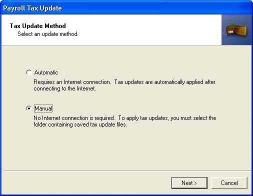

# U.S. 2020 Payroll Tax Update

This tax update applies to:

- Microsoft Dynamics GP on Microsoft SQL Server
- Microsoft Dynamics GP 2016 on Microsoft SQL Server
- Microsoft Dynamics GP 2015 on Microsoft SQL Server

This document contains instructions for installing the 2020 U.S. Payroll Tax Update for Microsoft Dynamics GP.

The third tax update for 2020 replaces all previous tax updates. It includes federal and state tax table changes that took effect January 1, 2020. It is recommended you install this update before processing payrolls for the year 2020.

This document assumes that you are familiar with the Microsoft Dynamics GP U.S. Payroll module.

## Changes in January Round 3 update
- Arkansas
- Oregon - Correction

### 2020 state or territorial tax changes

The following tax changes are included in this update:

#### Withholding changes for Arkansas

Tax Type rates for Filing Status NA

| If Over     | But Not Over     | Tax Amount     | Tax Rate     | On Excess Over     |
|-------------|------------------|----------------|--------------|--------------------|
| 0           | 4,599            | 0              | 0.0%         | 0                  |
| 4,599       | 9,099            | -91.98         | 2.0%         | 0                  |
| 9,099       | 13,699           | -182.97        | 3.0%         | 0                  |
| 13,699      | 22,599           | -237.77        | 3.4%         | 0                  |
| 22,599      | 37,899           | -421.46        | 5.0%         | 0                  |
| 37,899      | 80,800           | -762.55        | 5.9%         | 0                  |
| 80,800      | 81,800           | -1,243.40      | 6.6%         | 0                  |
| 81,800      | 82,800           | -1,143.40      | 6.6%         | 0                  |
| 82,800      | 84,100           | -1,043.40      | 6.6%         | 0                  |
| 84,100      | 85,200           | -943.40        | 6.6%         | 0                  |
| 85,200      | 86,200           | -843.40        | 6.6%         | 0                  |
| 86,200      | And over         | -803.40        | 6.6%         | 0                  |

#### Withholding changes for Oregon correction

The filing status of S2 only had a correction for the tax rate from 9.75% to 8.75% on wages between $40,735 and $125,000.

## Changes in January Round 2 update
- Federal
- Colorado
- Idaho
- Maryland
- Massachusetts
- Mississippi
- New Mexico
- New York & Yonkers
- Oregon
- Rhode Island
- Vermont

### 2020 Federal tax changes

Standard deduction amounts were removed for the following Filing Status:

- HOHHR - Head of Household Higher WH
- MARHR - Married Higher WH 
- SGLHR - Single Higher WH

### 2020 state or territorial tax changes

The following tax changes are included in this update:

#### Withholding changes for Colorado

- Flat tax rate of 4.63 for all filing status
- For Filing Status of MAR, the Personal Exemption amount is \$8,000 per exemption entered
- For Filing Status of SINGLE, the Personal Exemption amount is \$4,000 per exemption entered

#### Withholding changes for Idaho

Withholding rates for taxpayers filing as *SINGLE*

| If Over     | But Not Over     | Tax Amount     | Tax Rate     | On Excess Over     |
|-------------|------------------|----------------|--------------|--------------------|
| 0           | 12,200           | 0              | 0%           | 0                  |
| 12,200      | 13,741           | 0              | 1.125%       | 12,200             |
| 13,741      | 15,281           | 17.00          | 3.125%       | 13,741             |
| 15,281      | 16,822           | 65.00          | 3.625%       | 15,281             |
| 16,822      | 18,362           | 121.00         | 4.625%       | 16,822             |
| 18,362      | 19,903           | 192.00         | 5.625%       | 18,362             |
| 19,903      | 23,754           | 279.00         | 6.625%       | 19,903             |
| 23,754      | And Over         | 534.00         | 6.925%       | 23,754             |

Withholding rates for taxpayers filing as *MAR*

| If Over     | But Not Over     | Tax Amount     | Tax Rate     | On Excess Over     |
|-------------|------------------|----------------|--------------|--------------------|
| 0           | 24,400           | 0              | 0%           | 0                  |
| 24,400      | 27,482           | 0              | 1.125%       | 24,400             |
| 27,482      | 30,562           | 35.00          | 3.125%       | 27,482             |
| 30,562      | 33,644           | 131.00         | 3.625%       | 30,562             |
| 33,644      | 36,724           | 243.00         | 4.625%       | 33,644             |
| 36,724      | 39,806           | 385.00         | 5.625%       | 36,724             |
| 39,806      | 47,508           | 558.00         | 6.625%       | 39,806             |
| 47,508      | And Over         | 1,068.00       | 6.925%       | 47,508             |

#### Withholding changes for Maryland

Withholding rates for taxpayers filing as *AAMAR*

| If Over     | But Not Over     | Tax Amount     | Tax Rate     | On Excess Over     |
|-------------|------------------|----------------|--------------|--------------------|
| 0           | 5,000            | 0              | 0.00%        | 0                  |
| 5,000       | 150,000          | 0              | 7.60%        | 0                  |
| 150,000     | 175,000          | 11,400.00      | 7.85%        | 150,000            |
| 175,000     | 225,000          | 13,362.50      | 8.10%        | 175,000            |
| 225,000     | 300,000          | 17,412.50      | 8.35%        | 225,000            |
| 300,000     | And over         | 23,675.00      | 8.60%        | 300,000            |

Withholding rates for taxpayers filing as *ARNDEL*

| If Over     | But Not Over     | Tax Amount     | Tax Rate     | On Excess Over     |
|-------------|------------------|----------------|--------------|--------------------|
| 0           | 5,000            | 0              | 0.00%        | 0                  |
| 5,000       | 100,000          | 0              | 7.60%        | 0                  |
| 100,000     | 125,000          | 7,600.00       | 7.85%        | 100,000            |
| 125,000     | 150,000          | 9,562.50       | 8.10%        | 125,000            |
| 150,000     | 250,000          | 11,587.50      | 8.35%        | 150,000            |
| 250,000     | And over         | 19,937.50      | 8.60%        | 250,000            |

- Withholding rates for taxpayers filing as *BMCNTY* and 
- Withholding rates for taxpayers filing as *DRCHST* and 
- Withholding rates for taxpayers filing as *KENT*   and 
- Withholding rates for taxpayers filing as *STMARY* and 
- Withholding rates for taxpayers filing as *WASHTN*

| If Over     | But Not Over     | Tax Amount     | Tax Rate     | On Excess Over     |
|-------------|------------------|----------------|--------------|--------------------|
| 0           | 5,000            | 0              | 0.00%        | 0                  |
| 5,000       | 100,000          | 0              | 7.95%        | 0                  |
| 100,000     | 125,000          | 7,950.00       | 8.20%        | 100,000            |
| 125,000     | 150,000          | 10,000.00      | 8.45%        | 125,000            |
| 150,000     | 250,000          | 12,112.50      | 8.70%        | 150,000            |
| 250,000     | And over         | 20,812.50      | 8.95%        | 250,000            |

- Withholding rates for taxpayers filing as *BLMAR* and 
- Withholding rates for taxpayers filing as *DRMAR* and 
- Withholding rates for taxpayers filing as *KNMAR* and 
- Withholding rates for taxpayers filing as *SMMAR* and
- Withholding rates for taxpayers filing as *WHMAR* 

| If Over     | But Not Over     | Tax Amount     | Tax Rate     | On Excess Over     |
|-------------|------------------|----------------|--------------|--------------------|
| 0           | 5,000            | 0              | 0.00%        | 0                  |
| 5,000       | 150,000          | 0              | 7.95%        | 0                  |
| 150,000     | 175,000          | 11,925.00      | 8.20%        | 150,000            |
| 175,000     | 225,000          | 13,975.00      | 8.45%        | 175,000            |
| 225,000     | 300,000          | 18,200.00      | 8.70%        | 225,000            |
| 300,000     | And over         | 24,725.00      | 8.95%        | 300,000            |

Withholding rates for taxpayers filing as *WRMAR* and 
Withholding rates for taxpayers filing as *NONMAR*

| If Over     | But Not Over     | Tax Amount     | Tax Rate     | On Excess Over     |
|-------------|------------------|----------------|--------------|--------------------|
| 0           | 5,000            | 0              | 0.00%        | 0                  |
| 5,000       | 150,000          | 0              | 7.00%        | 0                  |
| 150,000     | 175,000          | 10,500.00      | 7.25%        | 150,000            |
| 175,000     | 225,000          | 12,312.50      | 7.50%        | 175,000            |
| 225,000     | 300,000          | 16,062.50      | 7.75%        | 225,000            |
| 300,000     | And over         | 21,875.00      | 8.00%        | 300,000            |
     

Withholding rates for taxpayers filing as *WRCSTR* and 
Withholding rates for taxpayers filing as *NONRES*

| If Over     | But Not Over     | Tax Amount     | Tax Rate     | On Excess Over     |
|-------------|------------------|----------------|--------------|--------------------|
| 0           | 5,000            | 0              | 0.00%        | 0                  |
| 5,000       | 100,000          | 0              | 7.00%        | 0                  |
| 100,000     | 125,000          | 7,000.00       | 7.25%        | 100,000            |
| 125,000     | 150,000          | 8,812.50       | 7.50%        | 125,000            |
| 150,000     | 250,000          | 10,687.50      | 7.75%        | 150,000            |
| 250,000     | And over         | 18,437.50      | 8.00%        | 250,000            |

#### Withholding changes for Massachusetts

Flat tax rate of 5% for all filing status

#### Withholding changes for Mississippi

Withholding rates for all Filing Status

| If Over     | But Not Over     | Tax Amount     | Tax Rate     | On Excess Over     |
|-------------|------------------|----------------|--------------|--------------------|
| 0           | 3,000            | 0              | 0            | 0                  |
| 3,000       | 5,000            | 0              | 3.0%         | 3,000              |
| 5,000       | 10,000           | 60.00          | 4.0%         | 5,000              |
| 10,000      | And over         | 260.00         | 5.0%         | 10,000             |

#### Withholding changes for New Mexico

The withholding tables for New Mexico have been updated to remove withholding allowance deduction amounts (exemptions).
Employees will see an increase in their withholding tax as a result of this change.

Withholding rates for taxpayers filing as *MAR*

| If Over     | But Not Over     | Tax Amount     | Tax Rate     | On Excess Over     |
|-------------|------------------|----------------|--------------|--------------------|
| 0           | 12,400           | 0              | 0            | 0                  |
| 12,400      | 20,400           | 0              | 1.7%         | 12,400             |
| 20,400      | 28,400           | 136.00         | 3.2%         | 20,400             |
| 28,400      | 36,400           | 392.00         | 4.7%         | 28,400             |
| 36,400      | 52,400           | 768.00         | 4.9%         | 36,400             |
| 52,400      | 76,400           | 1,552.00       | 4.9%         | 52,400             |
| 76,400      | 112,400          | 2,728.00       | 4.9%         | 76,400             |
| 112,400     | And over         | 4,492.00       | 4.9%         | 112,400            |

Withholding rates for taxpayers filing as *SINGLE* 

| If Over     | But Not Over     | Tax Amount     | Tax Rate     | On Excess Over     |
|-------------|------------------|----------------|--------------|--------------------|
| 0           | 6,200            | 0              | 0            | 0                  |
| 6,200       | 11,700           | 0              | 1.7%         | 6,200              |
| 11,700      | 17,200           | 93.50          | 3.2%         | 11,700             |
| 17,200      | 22,200           | 269.50         | 4.7%         | 17,200             |
| 22,200      | 32,200           | 504.50         | 4.9%         | 22,200             |
| 32,200      | 48,200           | 994.50         | 4.9%         | 32,200             |
| 48,200      | 71,200           | 1,778.50       | 4.9%         | 48,200             |
| 71,200      | And over         | 2,905.50       | 4.9%         | 71,200             |

Withholding rates for taxpayers filing as *HOH* 

| If Over     | But Not Over     | Tax Amount     | Tax Rate     | On Excess Over     |
|-------------|------------------|----------------|--------------|--------------------|
| 0           | 9,325            | 0              | 0            | 0                  |
| 9,325       | 17,325           | 0              | 1.7%         | 9,325              |
| 17,325      | 25,325           | 136.00         | 3.2%         | 17,325             |
| 25,325      | 33,325           | 392.00         | 4.7%         | 25,325             |
| 33,325      | 49,325           | 768.00         | 4.9%         | 33,325             |
| 49,325      | 73,325           | 1,552.00       | 4.9%         | 49,325             |
| 73,325      | 109,325          | 2,728.00       | 4.9%         | 73,325             |
| 109,325     | And over         | 4,492.00       | 4.9%         | 109,325            |

#### Withholding changes for New York and New York-Yonkers

Withholding rates for taxpayers filing as *MAR*

| If Over     | But Not Over     | Tax Amount     | Tax Rate     | On Excess Over     |
|-------------|------------------|----------------|--------------|--------------------|
| 0           | 8,500            | 0              | .0400        | 0                  |
| 8,500       | 11,700           | 340.00         | .0450        | 8,500              |
| 11,700      | 13,900           | 484.00         | .0525        | 11,700             |
| 13,900      | 21,400           | 600.00         | .0590        | 13,900             |
| 21,400      | 80,650           | 1,042.00       | .0609        | 21,400             |
| 80,650      | 96,800           | 4,650.00       | .0641        | 80,650             |
| 96,800      | 107,650          | 5,686.00       | .0746        | 96,800             |
| 107,650     | 157,650          | 6,495.00       | .0796        | 107,650            |
| 157,650     | 211,550          | 10,475.00      | .0794        | 157,650            |
| 211,550     | 323,200          | 14,755.00      | .0691        | 211,550            |
| 323,200     | 373,200          | 22,470.00      | .1019        | 323,200            |
| 373,200     | 1,077,550        | 27,565.00      | .0735        | 373,200            |
| 1,077,550   | 2,155,350        | 79,334.00      | .0765        | 1,077,550          |
| 2,155,350   | 2,205,350        | 161,786.00     | .9454        | 2,155,350          |
| 2,205,350   | And over         | 209,056.00     | .0962        | 2,205,350          |

Withholding rates for taxpayers filing as *SINGLE*

| If Over     | But Not Over     | Tax Amount     | Tax Rate     | On Excess Over     |
|-------------|------------------|----------------|--------------|--------------------|
| 0           | 8,500            | 0              | .0400        | 0                  |
| 8,500       | 11,700           | 340.00         | .0450        | 8,500              |
| 11,700      | 13,900           | 484.00         | .0525        | 11,700             |
| 13,900      | 21,400           | 600.00         | .0590        | 13,900             |
| 21,400      | 80,650           | 1,042.00       | .0609        | 21,400             |
| 80,650      | 96,800           | 4,650.00       | .0641        | 80,650             |
| 96,800      | 107,650          | 5,686.00       | .0745        | 96,800             |
| 107,650     | 157,650          | 6,494.00       | .0795        | 107,650            |
| 157,650     | 215,400          | 10,469.00      | .0691        | 157,650            |
| 215,400     | 265,400          | 14,459.00      | .0925        | 215,400            |
| 265,400     | 1,077,550        | 19,084.00      | .0735        | 265,400            |
| 1,077,550   | 1,127,550        | 78,777.00      | .5208        | 1,077,550          |
| 1,127,550   | And over         | 104,817.00     | .0962        | 1,127,550          |

#### Withholding changes for Oregon

The Standard Deduction Amount is \$4,630 for MS3 and S3 Filing Status.

The Standard Deduction Amount is \$2,315 for S2 Filing Status.

The Personal Exemption amount is \$210.00 for all Filing Status.

New Filing status for 2020 NOWH - No Withholding Provided - Flat tax rate of 8%

HB2119 requires employers to withhold income tax at a rate of 8 percent of employee wages if they employee has not provided a withholding statement or exemption certificate.  
Continue withholding at the 8 percent rate until the employee submits a withholding statement and exemption certificate.

Special Tax Type rates for MS3 Filing Status:

| If Over     | But Not Over     | Tax Amount     | Tax Rate     | On Excess Over     |
|-------------|------------------|----------------|--------------|--------------------|
| 0           | 49,999           | 6,950          | 0%           | 0                  |
| 49,999      | 249,999          | 6,950          | 0%           | 0                  |
| 249,999     | 259,999          | 5,550          | 0%           | 0                  |
| 259,999     | 269,999          | 4,150          | 0%           | 0                  |
| 269,999     | 279,999          | 2,750          | 0%           | 0                  |
| 279,999     | 289,999          | 1,350          | 0%           | 0                  |
| 289,999     | And over         | 0              | 0%           | 0                  |
|             |                  |                |              |                    |

Special Tax Type rates for S2 and S3 Filing Status:

| If Over     | But Not Over     | Tax Amount     | Tax Rate     | On Excess Over     |
|-------------|------------------|----------------|--------------|--------------------|
| 0           | 49,999           | 6,950          | 0%           | 0                  |
| 49,999      | 124,999          | 6,950          | 0%           | 0                  |
| 124,999     | 129,999          | 5,550          | 0%           | 0                  |
| 129,999     | 134,999          | 4,150          | 0%           | 0                  |
| 134,999     | 139,999          | 2,750          | 0%           | 0                  |
| 139,999     | 144,999          | 1,350          | 0%           | 0                  |
| 144,999     | And over         | 0              | 0%           | 0                  |

Tax Type rates for MS3 and S3 Filing Status:

| If Over     | But Not Over     | Tax Amount     | Tax Rate     | On Excess Over     |
|-------------|------------------|----------------|--------------|--------------------|
| 0           | 38,420           | 0              | 0%           | 0                  |
| 38,420      | 250,000          | 1,078          | 8.75%        | 18,100             |
| 250,000     | And over         | 21,369         | 9.9%         | 250,000            |
|             |                  |                |              |                    |

Tax Type rates for S2 Filing Status:

| If Over     | But Not Over     | Tax Amount     | Tax Rate     | On Excess Over     |
|-------------|------------------|----------------|--------------|--------------------|
| 0           | 40,735           | 0              | 0%           | 0                  |
| 40,735      | 125,000          | 539            | 9.75%        | 9,050              |
| 125,000     | And Over         | 10,685         | 9.9%         | 125,000            |

Low Income Type rates for MS3 and S3 Filing Status:

| If Over     | But Not Over     | Tax Amount     | Tax Rate     | On Excess Over     |
|-------------|------------------|----------------|--------------|--------------------|
| 0           | 7,200            | 210            | 4.75%        | 0                  |
| 12,400      | 18,100           | 552            | 6.75%        | 7,200              |
| 20,400      | 50,000           | 1,288          | 8.75%        | 18,100             |

Low Income Type rates for S2 Filing Status:

| If Over     | But Not Over     | Tax Amount     | Tax Rate     | On Excess Over     |
|-------------|------------------|----------------|--------------|--------------------|
| 0           | 3,600            | 210            | 4.75%        | 0                  |
| 3,600       | 9,050            | 381            | 6.75%        | 3,600              |
| 9,050       | 50,000           | 749            | 8.75%        | 9,050              |

#### Withholding changes for Rhode Island
For all Filing Status the Personal Exemption ($1,000) wage limit increased to $231,500

Withholding rates for taxpayers filing as *MAR* and *SINGLE*

| If Over     | But Not Over     | Tax Amount     | Tax Rate     | On Excess Over     |
|-------------|------------------|----------------|--------------|--------------------|
| 0           | 65,250           | 0              | 3.75%        | 0                  |
| 65,250      | 148,350          | 2,446.88       | 4.75%        | 65,250             |
| 148,350     | And Over         | 6,394.13       | 5.99%        | 148,350            |

#### Withholding changes for Vermont
The Personal Exemption amount is $4,350

Withholding rates for taxpayers filing as *MAR*

| If Over     | But Not Over     | Tax Amount     | Tax Rate     | On Excess Over     |
|-------------|------------------|----------------|--------------|--------------------|
| 0           | 9,375            | 0              | 0%           | 0                  |
| 9,375       | 76,825           | 0              | 3.35%        | 9,375              |
| 76,825      | 172,375          | 2,259.58       | 6.60%        | 76,825             |
| 172,375     | 257,725          | 8,565.88       | 7.60%        | 172,375            |
| 257,725     | And Over         | 15,052.48      | 8.75%        | 257,725            |

Withholding rates for taxpayers filing as *SINGLE*

| If Over     | But Not Over     | Tax Amount     | Tax Rate     | On Excess Over     |
|-------------|------------------|----------------|--------------|--------------------|
| 0           | 3,125            | 0              | 0%           | 0                  |
| 3,125       | 43,475           | 0              | 3.35%        | 3,125              |
| 43,475      | 100,925          | 1,351.73       | 6.60%        | 43,475             |
| 100,925     | 207,125          | 5,143.43       | 7.60%        | 100,925            |
| 207,125     | And Over         | 13,214.63      | 8.75%        | 207,125            |

## Changes in January Round 1 update
- Federal changes and FICA Limit
- California
- Illinois
- Iowa
- Kentucky
- Maine
- Michigan
- Minnesota
- Missouri
- North Carolina
- North Dakota
- Ohio
- South Carolina

### 2020 Federal tax changes

The maximum taxable earnings for Social Security increase in 2020 to \$137,700 from \$132,900

The Personal Exemption is $4,300 for SINGLE, MAR, HOH

Withholding rates for taxpayers filing as *NRA*

| If Over     | But Not Over     | Tax Amount     | Tax Rate     | On Excess Over     |
|-------------|------------------|----------------|--------------|--------------------|
| 0           | 5,675            | 0              | 10%          | 0                  |
| 5,675       | 35,925           | 987.50         | 12%          | 5,675              |
| 35,925      | 81,325           | 4,617.50       | 22%          | 35,925             |
| 81,325      | 159,100          | 14,605.50      | 24%          | 81,325             |
| 159,100     | 203,150          | 33,271.50      | 32%          | 159,100            |
| 203,150     | 514,200          | 47,367.50      | 35%          | 203,150            |
| 514,200     | And Over         | 156,235.00     | 37%          | 514,200            |

Withholding rates for taxpayers filing as *NRAHR*

| If Over     | But Not Over     | Tax Amount     | Tax Rate     | On Excess Over     |
|-------------|------------------|----------------|--------------|--------------------|
|             | 14,063           | 987.50         | 12%          | 0             |
| 14,063      | 36,763           | 4,617.50       | 22%          | 14,063             |
| 36,763      | 75,650           | 14,605.50      | 24%          | 36,763             |
| 75,650      | 97,675           | 33,271.50      | 32%          | 75,650             |
| 97,675      | 253,200          | 47,367.50      | 35%          | 97,675             |
| 253,200     | And Over         | 156,235.00     | 37%          | 253,200            |

Withholding rates for taxpayers filing as *MAR*

| If Over     | But Not Over     | Tax Amount     | Tax Rate     | On Excess Over     |
|-------------|------------------|----------------|--------------|--------------------|
| 0           | 11,900           | 0              | 0%           | 0                  |
| 11,900      | 31,650           | 0              | 10%          | 11,900             |
| 31,650      | 92,150           | 1,975.00       | 12%          | 31,650             |
| 92,150      | 182,950          | 9,235.00       | 22%          | 92,150             |
| 182,950     | 338,500          | 29,211.00      | 24%          | 182,950            |
| 338,500     | 426,600          | 66,543.00      | 32%          | 338,500            |
| 426,600     | 633,950          | 94,735.00      | 35%          | 426,600            |
| 633,950     | And Over         | 167,307.50     | 37%          | 633,950            |

Withholding rates for taxpayers filing as *MARHR*

| If Over     | But Not Over     | Tax Amount     | Tax Rate     | On Excess Over     |
|-------------|------------------|----------------|--------------|--------------------|
| 0           | 12,400           | 0              | 0%           | 0                  |
| 12,400      | 22,275           | 0              | 10%          | 12,400             |
| 22,275      | 52,525           | 987.50         | 12%          | 22,275             |
| 52,525      | 97,925           | 4,617.50       | 22%          | 52,525             |
| 97,925      | 175,700          | 14,605.50      | 24%          | 97,925             |
| 175,700     | 219,750          | 33,271.50      | 32%          | 175,700            |
| 219,750     | 323,425          | 47,367.50      | 35%          | 219,750            |
| 323,425     | And Over         | 83,653.75      | 37%          | 323,425            |

Withholding rates for taxpayers filing as *SINGLE*

| If Over     | But Not Over     | Tax Amount     | Tax Rate     | On Excess Over     |
|-------------|------------------|----------------|--------------|--------------------|
| 0           | 3,800            | 0              | 0%           | 0                  |
| 3,800       | 13,675           | 0              | 10%          | 3,800              |
| 13,675      | 43,925           | 987.50         | 12%          | 13,675             |
| 43,925      | 89,325           | 4,617.50       | 22%          | 43,925             |
| 89,325      | 167,100          | 14,605.50      | 24%          | 89,325             |
| 167,100     | 211,150          | 33,271.50      | 32%          | 167,100            |
| 211,150     | 522,200          | 47,367.50      | 35%          | 211,150            |
| 522,200     | And Over         | 156,235.00     | 37%          | 522,200            |

Withholding rates for taxpayers filing as *SGLHHR*

| If Over     | But Not Over     | Tax Amount     | Tax Rate     | On Excess Over     |
|-------------|------------------|----------------|--------------|--------------------|
| 0           | 6,200            | 0              | 0%           | 0                  |
| 6,200       | 11,138           | 0              | 10%          | 6,200              |
| 11,138      | 26,263           | 493.75         | 12%          | 11,138             |
| 26,263      | 48,963           | 2,308.75       | 22%          | 26,263             |
| 48,963      | 87,850           | 7,302.75       | 24%          | 48,963             |
| 87,850      | 109,875          | 16,635.75      | 32%          | 87,850             |
| 109,875     | 265,400          | 23,683.75      | 35%          | 109,875            |
| 265,400     | And Over         | 78,117.50      | 37%          | 265,400            |

Withholding rates for taxpayers filing as *HOH*

| If Over     | But Not Over     | Tax Amount     | Tax Rate     | On Excess Over     |
|-------------|------------------|----------------|--------------|--------------------|
| 0           | 10,050           | 0              | 0%           | 0                  |
| 10,050      | 24,150           | 0              | 10%          | 10,500             |
| 24,150      | 63,750           | 1,410.00       | 12%          | 24,150             |
| 63,750      | 95,550           | 6,162.00       | 22%          | 63,750             |
| 95,550      | 173,350          | 13,158.00      | 24%          | 95,550             |
| 173,350     | 217,400          | 31,830.00      | 32%          | 173,350            |
| 217,400     | 528,450          | 45,926.00      | 35%          | 217,400            |
| 528,450     | And Over         | 154,793.50     | 37%          | 528,450            |

Withholding rates for taxpayers filing as *HOHHR*

| If Over     | But Not Over     | Tax Amount     | Tax Rate     | On Excess Over     |
|-------------|------------------|----------------|--------------|--------------------|
| 0           | 9,325            | 0              | 0%           | 0                  |
| 9,325       | 16,375           | 0              | 10%          | 9,325              |
| 16,375      | 36,175           | 705.00         | 12%          | 16,375             |
| 36,175      | 52,075           | 3,081.00       | 22%          | 36,175             |
| 52,075      | 90,975           | 6,579.00       | 24%          | 52,075             |
| 90,975      | 113,000          | 15,915.00      | 32%          | 90,975             |
| 113,000     | 268,525          | 22,963.00      | 35%          | 113,000            |
| 268,525     | And Over         | 77,396.75      | 37%          | 268,525            |

### 2020 state or territorial tax changes

The following tax changes are included in this update:

#### Withholding changes for California

For Filing Status of HOH  and MAR2
Personal Exemption is \$134.20 from \$129.80 
Standard Deduction is \$9,074 from \$8,802  
Low Income Limit is \$30,083 from \$29,146

For Filing Status of MAR1 and SINGLE
Personal Exemption is \$134.20 from \$129.80
Standard Deduction is \$4,537 from \$4,401 
Low Income Limit is \$15,042 from \$14,573

Withholding rates for taxpayers filing as *HOH*

| If Over     | But Not Over     | Tax Amount     | Tax Rate     | On Excess Over     |
|-------------|------------------|----------------|--------------|--------------------|
| 0           | 17,629           | 0              | 1.1%         | 0                  |
| 17,629      | 41,768           | 193.92         | 2.2%         | 17,629             |
| 41,768      | 53,843           | 724.98         | 4.4%         | 41,768             |
| 53,843      | 66,636           | 1,256.28       | 6.6%         | 53,843             |
| 66,636      | 78,710           | 2,100.62       | 8.8%         | 66,636             |
| 78,710      | 401,705          | 3,163.13       | 10.23%       | 78,710             |
| 401,705     | 482,047          | 36,205.52      | 11.33%       | 401,705            | 
| 482,047     | 803,410          | 45,308.27      | 12.43%       | 482,047            |
| 803,410     | 1,000,000        | 85,253.69      | 13.53%       | 803,410            |
| 1,000,000   | And Over         | 111,852.32     | 14.63%       | 1,000,000          |

Withholding rates for taxpayers filing as *MAR1* and *MAR2*

| If Over     | But Not Over     | Tax Amount     | Tax Rate     | On Excess Over     |
|-------------|------------------|----------------|--------------|--------------------|
| 0           | 17,618           | 0              | 1.1%         | 0                  |
| 17,618      | 41,766           | 193.80         | 2.2%         | 17,618             |
| 41,766      | 65,920           | 725.06         | 4.4%         | 41,766             |
| 65,920      | 91,506           | 1,787.84       | 6.6%         | 65,920             |
| 91,506      | 115,648          | 3,476.52       | 8.8%         | 91,506             |
| 115,648     | 590,746          | 5,601.02       | 10.23%       | 115,648            |
| 590,746     | 708,890          | 54,203.55      | 11.33%       | 590,746            | 
| 708,890     | 1,000,000        | 67,589.27      | 12.43%       | 708,890            |
| 1,000,000   | 1,181,484        | 103,774.24     | 13.53%       | 1,000,000          |
| 1,181,484   | And Over         | 128,329.03     | 14.63%       | 1,181,484          |

Withholding rates for taxpayers filing as *SINGLE*

| If Over     | But Not Over     | Tax Amount     | Tax Rate     | On Excess Over     | 
|-------------|------------------|----------------|--------------|--------------------|
| 0           | 8,809            | 0              | 1.1%         | 0                  |
| 8,809       | 20,883           | 96.90          | 2.2%         | 8,809              |
| 20,883      | 32,960           | 362.53         | 4.4%         | 20,883             |
| 32,960      | 45,753           | 893.92         | 6.6%         | 32,960             |
| 45,753      | 57,824           | 1,738.26       | 8.8%         | 45,753             |
| 57,824      | 295,373          | 2,800.51       | 10.23%       | 57,824             |
| 295,373     | 354,445          | 27,101.77      | 11.33%       | 295,373            |
| 354,445     | 590,742          | 33,794.63      | 12.43%       | 354,445            |
| 590,742     | 1,000,000        | 63,166.35      | 13.53%       | 590,742            |
| 1,000,000   | And Over         | 118,538.96     | 14.63%       | 1,000,000          |

#### Withholding changes for Illinois

The Dependent Exemptions is \$2,325

#### Withholding changes for Iowa

The Standard Deduction Amount for Filing Status EXP1 is \$1880, and Filing Status EXP2 is \$4630
Withholding rates for taxpayers filing as EXP1 and EXP2 are as follows:

| If Over     | But Not Over     | Tax Amount     | Tax Rate     | On Excess Over     |
|-------------|------------------|----------------|--------------|--------------------|
| 0           | 1,480            | 0              | 0.33%        | 0                  |
| 1,480       | 2,959            | 4.88           | 0.67%        | 1,480              |
| 2,959       | 5,918            | 14.79          | 2.25%        | 2,959              |
| 5,918       | 13,316           | 81.37          | 4.14%        | 5,918              |
| 13,316      | 22,193           | 387.65         | 5.63%        | 13,316             |
| 22,193      | 29,590           | 887.43         | 5.96%        | 22,193             |
| 29,590      | 44,385           | 1,328.29       | 6.25%        | 29,590             |
| 44,385      | 66,578           | 2,252.98       | 7.44%        | 44,385             |
| 66,578      |                  | 3,904.14       | 8.53%        | 66,578             |

#### Withholding changes for Kentucky

The Standard Deduction changed to \$2650 from \$2590 
The Flat Tax Rate remains at 5%

#### Withholding changes for Maine

The Personal Exemption changed from \$4200 to \$4300 for all Filing Status’

Withholding rates for taxpayers filing as *SINGLE*, Tax table type

| If Over     | But Not Over     | Tax Amount     | Tax Rate     | On Excess Over     |
|-------------|------------------|----------------|--------------|--------------------|
|  0          | 22,200           | 0              | 5.8%         | 0                  |
| 22,200      | 52,600           | 1,288          | 6.75%        | 22,200             |
| 52,600      | And over         | 3,340          | 7.15%        | 52,600             |

Special table type

| If Over     | But Not Over     | Tax Amount     | Tax Rate     | On Excess Over     |
|-------------|------------------|----------------|--------------|--------------------|
| 0           | 82,900           | 0              | 0            | 9,550              |
| 82,900      | 157,900          | 75,000         | 0            | 0                  |

Withholding rates for taxpayers filing as MAR, Tax table type

| If Over     | But Not Over     | Tax Amount     | Tax Rate     | On Excess Over     |
|-------------|------------------|----------------|--------------|--------------------|
| 0           | 44,450           |                | 5.80%        | 0                  |
| 44,450      | 105,200          | 2,578          | 6.75%        | 44,450             |
| 105,200     | And Over         | 6,679          | 7.15%        | 105,200            |

Special table type

| If Over     | But Not Over     | Tax Amount     | Tax Rate     | On Excess Over     |
|-------------|------------------|----------------|--------------|--------------------|
| 0           | 165,800          | 0              | 0            | 21,950             |
| 165,800     | 315,800          | 150,000        | 0            | 0                  |

#### Withholding changes for Michigan

The Personal Exemption amount is \$4,750

#### Withholding changes for Minnesota

The Personal Exemption amount is \$4,300

Withholding rates for taxpayers filing as *MAR*

| If Over     | But Not Over     | Tax Amount     | Tax Rate     | On Excess Over     |
|-------------|------------------|----------------|--------------|--------------------|
| 0           | 11,900           | 0              | 0            | 0                  |
| 11,900      | 51,310           | 0              | 5.35%        | 11,900             |
| 51,310      | 168,470          | 2,108.44       | 6.80%        | 51,310             |
| 168,470     | 285,370          | 10,075.32      | 7.85%        | 168,470            |
| 285,370     | And over         | 19,251.97      | 9.85%        | 285,370            |

Withholding rates for taxpayers filing as *SINGLE*

| If Over     | But Not Over     | Tax Amount     | Tax Rate     | On Excess Over     |
|-------------|------------------|----------------|--------------|--------------------|
| 0           | 3,800            | 0              | 0            | 0                  |
| 3,800       | 30,760           | 0              | 5.35%        | 3,800              |
| 30,760      | 92,350           | 1,442.36       | 6.80%        | 30,760             |
| 92,350      | 168,200          | 5,630.48       | 7.85%        | 92,350             |
| 168,200     | And over         | 11,584.71      | 9.85%        | 168,200            |

#### Withholding changes for Missouri

The Standard Deduction is \$18,650 for filing status HOH
The Standard Deduction is \$24,800 for filing status MAR1
The Standard Deduction is \$12,400 for filing status MAR2 and SINGLE

Withholding rates for all filing status

| If Over     | But Not Over     | Tax Amount     | Tax Rate     | On Excess Over     |
|-------------|------------------|----------------|--------------|--------------------|
| 0           | 1,073            | 0              | 1.5%         | 0                  |
| 1,073       | 2,146            | 16.00          | 2.0%         | 1.073              |
| 2,146       | 3,219            | 37.00          | 2.5%         | 2,146              |
| 3,219       | 4,292            | 64.00          | 3.0%         | 3,219              |
| 4,292       | 5,365            | 96.00          | 3.5%         | 4,292              |
| 5,365       | 6,438            | 134.00         | 4.0%         | 5,365              |
| 6,438       | 7,511            | 177.00         | 4.50%        | 6,438              |
| 7,511       | 8,584            | 225.00         | 5.0%         | 7,511              |
| 8,584       | And over         | 279.00         | 5.4%         | 8,584              |

#### Withholding changes for North Carolina

The Standard Deduction amount changed to \$16,125 from \$15,000 for Filing Status of HOH

The Standard Deduction amount changed to \$10,750 from \$10,000 for Filing Status of MAR and SINGLE

#### Withholding changes for North Dakota

The Personal Exemption amount is \$4,300 for Filing Status MAR and SINGLE 

***Per the state of North Dakota, there is no HOH filing status with exemptions.  If an employee on the W4 chooses 
Filing status of HOH and does not mark step 2, you still choose HOH as the filing status in Dynamics GP.***

Withholding rates for taxpayers filing as *MAR*, *MARHR*

| If Over     | But Not Over     | Tax Amount     | Tax Rate     | On Excess Over     |
|-------------|------------------|----------------|--------------|--------------------|
| 0           | 12,400           | 0              | 0            | 0                  |
| 12,400      | 45,925           | 0              | 1.10%        | 12,400             |
| 45,925      | 93,375           | 368.78         | 2.04%        | 45,925             |
| 93,375      | 135,750          | 1,336.76       | 2.27%        | 93,375             |
| 135,750     | 232,700          | 2,298.67       | 2.64%        | 135,750            |
| 232,700     | And over         | 4,858.15       | 2.90%        | 232,700            |

Withholding rates for taxpayers filing as *SINGLE* and *SINGHR*

| If Over     | But Not Over     | Tax Amount     | Tax Rate     | On Excess Over     |
|-------------|------------------|----------------|--------------|--------------------|
| 0           | 6,200            | 0              | 0            | 0                  |
| 6,200       | 46,325           | 0              | 1.10%        | 6,200              |
| 46,325      | 103,350          | 441.38         | 2.04%        | 46,325             |
| 103,350     | 208,850          | 1,604.69       | 2.27%        | 103,350            |
| 208,850     | 446,800          | 3,999.54       | 2.64%        | 208,850            |
| 446,800     | And over         | 10,281.42      | 2.90%        | 446,800            |

Withholding rates for taxpayers filing as *HOHHR* 

| If Over     | But Not Over     | Tax Amount     | Tax Rate     | On Excess Over     |
|-------------|------------------|----------------|--------------|--------------------|
| 0           | 9,325            | 0              | 0            | 0                  |
| 9,325       | 63,075           | 0              | 1.10%        | 9,325              |
| 63,075      | 148,125          | 591.25         | 2.04%        | 63,075             |
| 148,125     | 234,025          | 2,326.27       | 2.27%        | 148,125            |
| 234,025     | 449,925          | 4,276.20       | 2.64%        | 234,025            |
| 449,925     | And over         | 9,975.96       | 2.90%        | 449,925            |

#### Withholding changes for Ohio

Withholding rates for taxpayers filing as *NA*

| If Over     | But Not Over     | Tax Amount     | Tax Rate     | On Excess Over     |
|-------------|------------------|----------------|--------------|--------------------|
| 0           | 5,000            | 0              | .516%        | 0                  |
| 5,000       | 10,000           | 25.00          | 1.032%       | 5,000              |
| 10,000      | 15,000           | 75.00          | 2.067%       | 10,000             |
| 15,000      | 20,000           | 175.00         | 2.582%       | 15,000             |
| 20,000      | 40,000           | 300.00         | 3.099%       | 20,000             |
| 40,000      | 80,000           | 900.00         | 3.614%       | 40,000             |
| 80,000      | 100,000          | 2300.00        | 4.132%       | 80,000             |
| 100,000     | And over         | 3100.00        | 5.164%       | 100,000            |

#### Withholding changes for South Carolina

The Personal Exemption is $2,590 for Filing Status ONE.
The Standard Deduction Maximum is $3,820 for ONE Filing Status.

Tax Type rates for all Filing Status:

| If Over     | But Not Over     | Tax Amount     | Tax Rate     | On Excess Over     |
|-------------|------------------|----------------|--------------|--------------------|
| 0           | 2,620            | 0              | 0.8%         | 0                  |
| 2,620       | 5,240            | -57.64         | 3.0%         | 0                  |
| 5,240       | 7,860            | -110.04        | 4.0%         | 0                  |
| 7,860       | 10,490           | -188.64        | 5.0%         | 0                  |
| 10,490      | 13,110           | -293.54        | 6.0%         | 0                  |
| 13,110      | And over         | -424.64        | 7.0%         | 0                  |

## Resources to assist you

If you have questions about U.S. Payroll tax updates and your Microsoft Partner isn’t available, there are several resources, in addition to this document, to assist in answering your questions.

### U.S. Payroll Tax Updates on CustomerSource

Take a look at [CustomerSource](https://mbs.microsoft.com/customersource/support/downloads/taxupdates/) to find out the tax changes included in each update and to download the update. All instructions for downloading and installing the tax updates also are provided here.

### Knowledge Base

[https://mbs.microsoft.com/knowledgebase/search.aspx](https://mbs.microsoft.com/knowledgebase/search.aspx) provides you with instant access to the same database our support engineers use. You can find answers to common questions, along with technical tips and performance recommendations.

### eSupport

For support requests that can be handled with email, go to [https://mbs.microsoft.com/support/newstart.aspx](https://mbs.microsoft.com/support/newstart.aspx). On average, the response time is nearly twice as fast as telephone support.

### Discussion

On the [Dynamics GP community site](https://community.dynamics.com/gp), you can start a tax update discussion with other members of the Microsoft customer community. This database provides you with the opportunity to exchange information with other customers, which is perfect for providing tips and answers to questions about tax updates.

### Microsoft Business Solutions Human Resources/Payroll support team

We have a support team focused 100 percent on providing service and support to our Payroll customers. If you have questions, dial toll free 888-GPS-SUPP (888-477-7877).

## Preparing for installation

Use the instructions in this section to prepare for the U.S. Payroll Tax Update. For detailed information about the changes in the current tax update round, see *Changes in this update*.

### Are you using a supported version?

To identify the version, you’re using, start Microsoft Dynamics GP. Choose Help\>\> About Microsoft Dynamics GP. The information window displays the version number in the lower right corner.

This U.S. Payroll Tax Update is supported for Microsoft Dynamics GP, Microsoft Dynamics GP 2016, and Microsoft Dynamics GP 2015 on Microsoft SQL Server.

If you’re not using one of the supported versions, you must upgrade to a supported version before installing this tax update.

### Have you obtained the update files?

If your computer is connected to the Internet, the Payroll Update Utility (PUE) automatically can download the tax table update file (TX.cab) from the Internet.

If your computer isn’t connected to the Internet, you can obtain the file from [CustomerSource](https://mbs.microsoft.com/customersource/northamerica/GP/downloads) or your Microsoft Partner and copy it to your computer before running what’s known as a “manual” installation.

Tax updates are distributed in the form of .CAB files. Copy the .CAB file to a folder that you can readily access, such as the folder that contains Dynamics.exe. Copying the .CAB file to your computer does not complete the installation. Refer to the following section for instructions on how to install the tax update.

## Installing the tax update

The Round 3 2020 tax update installation can be run from any workstation. The update installs payroll tax table data on the server computer where your existing Microsoft Dynamics GP application data is located. You need to install the tax table update only once.

If you have issues installing the update, review the article on [Tips to install the U.S. Payroll Tax
Update.](https://community.dynamics.com/gp/b/dynamicsgp/archive/2017/05/09/tips-to-install-the-u-s-payroll-tax-update)

Before you begin, ask all Microsoft Dynamics GP users to exit the application until the update is complete. Exit all other applications, turn off the screen saver, and back up important data (including Forms.dic, Reports.dic, and Dynamics.vba if they exist) before you proceed with the installation.

1. Log onto Microsoft Dynamics GP with the system administrator rights, and open the Payroll Tax Update window.
    (Microsoft Dynamics GP menu \>\> Maintenance \>\> U.S. Payroll Updates \>\> Check for Tax Updates)

2. Select an update method, and then choose Next.

    

    - The Automatic option downloads the current tax table update from the Internet to the default location. An Internet connection is required.
    - The Manual option processes the tax table update from a location you choose. You might choose Manual if you need to update a computer that isn’t connected to the Internet. To use this method, you should already have obtained the tax table update file, TX.cab, and copied it to a location your computer can readily access.

3. If you selected Automatic, enter your 10-digit authorized telephone number. Choose Log in to start the download.

    If you selected Manual, specify the location where the tax table update file is located.

4.  Choose Process to start the update.

5.  Verify that the latest Payroll tax table update has been installed. Choose Microsoft Dynamics GP menu \>\> Tools \>\> Setup \>\> System \>\> Payroll Tax. The Last Tax Update value should be 2/28/2020.

## What’s next

If you upgrade to another version of Microsoft Dynamics GP, you must install the most recent service pack (if any), as well as the most recent tax table updates for that release, to ensure you have the latest tax information. Newer releases of Microsoft Dynamics GP do not include current payroll tax information.
