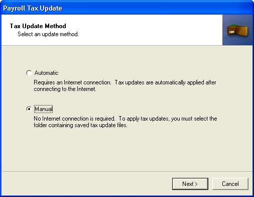

# U.S. 2026 Payroll Tax Update

This tax update applies to:

- Microsoft Dynamics GP on Microsoft SQL Server

This article provides guidance for how to install the 2026 U.S. Payroll Tax Update for Microsoft Dynamics GP and describes changes.

This is the first tax update for 2026 and replaces all previous tax updates. It includes State tax table changes that take effect January 1, 2026. 

This document assumes that you are familiar with the Microsoft Dynamics GP U.S. Payroll module.

Check out these blogs for detailed documentation on how you calculate payroll taxes in Microsoft Dynamics GP:

[How to calculate Federal Tax with Dependent Claim Amount Field](https://community.dynamics.com/blogs/post/?postid=f65a8b3b-ef87-432c-a3c4-80ed7077a79d)

[Does Microsoft Dynamics GP calculate tax correctly?](https://community.dynamics.com/blogs/post/?postid=c9a75bcc-8f50-411f-a364-95a5121f6335)

[Tips to install the U.S. Payroll Tax Update](https://community.dynamics.com/blogs/post/?postid=dbc1295b-297f-4441-aa2f-7c2502bffc97)

## Changes in January Round 1 update 

- FICA Social Security Limit 184,500 (Previously $176,100)
- Federal tax
- California
- Colorado
- Hawaii
- Iowa
- Kentucky
- Maine
- Missouri
- Nebraska
- New Mexico
  New York
- Oklahoma
- Rhode Island
- South Carolina
- Yonkers

### Withholding changes for Federal

The maximum taxable earnings for Social Security increase in 2026 to \$184,500 from \$176,100. 

The Personal Exemption is $4,300 for SINGLE, MAR, HOH, NRA

Withholding rates for taxpayers filing as *NRA*:

> [!NOTE]
> For non-resident aliens, if the employee filled out a W-4 after 01/01/2020, the filing status *Non Resident Alien HR (NRAHR)* must always be used.

| If Over | But Not Over | Tax Amount | Tax Rate | On Excess Over|
|------------|-----------------|---------------|-------------|-------------------|
| 0          | 19,300          | 0             | 0%          | 0                 |
| 19,300     | 31,700          | 0             | 10%         | 19,300            |
| 31,700     | 69,700          | 1,240.00      | 12%         | 31,700            |
| 69,700     | 125,000         | 5,800.00      | 22%         | 69,700            |
| 125,000    | 221,075         | 17,966.00     | 24%         | 125,000           |
| 221,075    | 275,525         | 41,024.00     | 32%         | 221,075           |
| 275,525    | 659,900         | 58,448.00     | 35%         | 275,525           |
| 659,900    | And Over        | 192,979.25    | 37%         | 659,900           |

Withholding rates for taxpayers filing as *NRAHR*:

| If Over | But Not Over | Tax Amount | Tax Rate | On Excess Over |
|-------------|------------------|----------------|--------------|--------------------|
|             | 24,150           | 0              | 0%           | 0                  |
| 24,150      | 30,350           | 0              | 10%          | 24,150             |
| 30,350      | 49,350           | 620.00         | 12%          | 30,350             |
| 49,350      | 77,000           | 2,900.00       | 22%          | 49,350             |
| 77,000      | 125,038          | 8,983.00       | 24%          | 77,000             |
| 125,038     | 152,263          | 20,512.00      | 32%          | 125,038            |
| 152,263     | 344,450          | 29,224.00      | 35%          | 152,263            |
| 344,450     | And Over         | 96,489.63      | 37%          | 344,450            |

Withholding rates for taxpayers filing as *MAR*:

| If Over | But Not Over | Tax Amount | Tax Rate | On Excess Over|
|------------|-----------------|---------------|-------------|-------------------|
| 0          | 19,300          | 0             | 0%          | 0                 |
| 19,300     | 44,100          | 0             | 10%         | 19,300            |
| 44,100     | 120,100         | 2,480.00      | 12%         | 44,100            |
| 120,100    | 230,700         | 11,600.00     | 22%         | 120,100           |
| 230,700    | 422,850         | 35,932.00     | 24%         | 230,700           |
| 422,850    | 531,750         | 82,048.00     | 32%         | 422,850           |
| 531,750    | 788,000         | 116,896.00    | 35%         | 531,750           |
| 788,000    | And Over        | 206,583.50    | 37%         | 788,000           |

Withholding rates for taxpayers filing as *MARHR*:

| If Over  | But Not Over | Tax Amount | Tax Rate | On Excess Over |
|-------------|------------------|----------------|--------------|--------------------|
| 0           | 16,100           | 0              | 0%           | 0                  |
| 16,100      | 28,500           | 0              | 10%          | 16,100             |
| 28,500      | 66,500           | 1,240.00       | 12%          | 28,500             |
| 66,500      | 121,800          | 5,800.00       | 22%          | 66,500             |
| 121,800     | 217,875          | 17,966.00      | 24%          | 121,800            |
| 217,875     | 272,325          | 41,024.00      | 32%          | 217,875            |
| 272,325     | 400,450          | 58,448.00      | 35%          | 272,325            |
| 400,450     | And Over         | 103,291.75     | 37%          | 400,450            |

Withholding rates for taxpayers filing as *SINGLE*:

| If Over | But Not Over | Tax Amount | Tax Rate | On Excess Over |
|---------|--------------|------------|----------|----------------|
| 0       | 7,500        | 0          | 0%       | 0              |
| 7,500   | 19,900       | 0          | 10%      | 7,500          |
| 19,900  | 57,900       | 1,240.00   | 12%      | 19,900         |
| 57,900  | 113,200      | 5,800.00   | 22%      | 57,900         |
| 113,200 | 209,275      | 17,966.00  | 24%      | 113,200        |
| 209,275 | 263,725      | 41,024.00  | 32%      | 209,275        |
| 263,725 | 648,100      | 58,448.00  | 35%      | 263,725        |
| 648,100 | And Over     | 192,979.25 | 37%      | 648,100        |

Withholding rates for taxpayers filing as *SGLHHR*:

| If Over     | But Not Over     | Tax Amount     | Tax Rate | On Excess Over |
|-------------|------------------|----------------|----------|----------------|
| 0           | 8,050            | 0              | 0%       | 0              |
| 8,050       | 14,250           | 0              | 10%      | 8,050          |
| 14,250      | 33,250           | 620.00         | 12%      | 14,250         |
| 33,250      | 60,900           | 2,900.00       | 22%      | 33,250         |
| 60,900      | 108,938          | 8,983.00       | 24%      | 60,900         |
| 108,938     | 136,163          | 20,512.00      | 32%      | 108,938        |
| 136,163     | 328,350          | 29,224.00      | 35%      | 136,163        |
| 328,350     | And Over         | 96,489.63      | 37%      | 328,350        |

Withholding rates for taxpayers filing as *HOH*:

| If Over     | But Not Over     | Tax Amount     | Tax Rate | On Excess Over    |
|-------------|------------------|----------------|----------|-------------------|
| 0           | 15,550           | 0              | 0%       | 0                 |
| 15,550      | 33,250           | 0              | 10%      | 15,550            |
| 33,250      | 83,000           | 1,770.00       | 12%      | 33,250            |
| 83,000      | 121,250          | 7,740.00       | 22%      | 83,000            |
| 121,250     | 217,300          | 16,155.00      | 24%      | 121,250           |
| 217,300     | 271,750          | 39,207.00      | 32%      | 217,300           |
| 271,750     | 656,150          | 56,631.00      | 35%      | 271,750           |
| 656,150     | And Over         | 191,171.00     | 37%      | 656,150           |

Withholding rates for taxpayers filing as *HOHHR*:

| If Over     | But Not Over     | Tax Amount     | Tax Rate | On Excess Over     |
|-------------|------------------|----------------|----------|--------------------|
| 0           | 12,075           | 0              | 0%       | 0                  |
| 12,075      | 20,925           | 0              | 10%      | 12,075             |
| 20,925      | 45,800           | 885.00         | 12%      | 20,925             |
| 45,800      | 64,925           | 3,870.00       | 22%      | 45,800             |
| 64,925      | 112,950          | 8,077.50       | 24%      | 64,925             |
| 112,950     | 140,175          | 19,603.50      | 32%      | 112,950            |
| 140,175     | 332,375          | 28,315.50      | 35%      | 140,175            |
| 332,375     | And Over         | 95,585.50      | 37%      | 332,375            |

### Withholding changes for California

For Filing Status of HOH and MAR2:  

- Personal Exemption is $168.30 from $163.90
- Standard Deduction is $11,412 from $11,080
- Low Income Limit is $37,791 from $36,736 

For Filing Status of MAR1 and SINGLE:

- Personal Exemption is $168.30 from $163.90
- Standard Deduction is $5,706 from $5,540
- Low Income Limit is $18,896 from $18,368

Withholding rates for taxpayers filing as *HOH*:

| If Over | But Not Over  | Tax Amount  | Tax Rate  | On Excess Over                  |
|-------------|------------------|----------------|--------------|--------------------|
| 0           | 22,173           | 0              | 1.1%         | 0                  |
| 22,173      | 52,530           | 243.90         | 2.2%         | 22,173             |
| 52,530      | 67,716           | 911.75         | 4.4%         | 52,530             |
| 67,716      | 83,805           | 1,579.93       | 6.6%         | 67,716             |
| 83,805      | 98,990           | 2,641.80       | 8.8%         | 83,805             |
| 98,990      | 505,208          | 3,978.08       | 10.23%       | 98,990             |
| 505,208     | 606,251          | 45,534.18      | 11.33%       | 505,208            |
| 606,251     | 1,000,000        | 56,982.35      | 12.43%       | 606,251            |
| 1,000,000   | 1,010,417        | 105,925.35     | 13.53%       | 1,000,000          |
| 1,010,417   | And Over         | 107,334.77     | 14.63%       | 1,010,417          |

Withholding rates for taxpayers filing as *MAR1* and *MAR2*:

| If Over     | But Not Over     | Tax Amount     | Tax Rate     | On Excess Over     |
|-------------|------------------|----------------|--------------|--------------------|
| 0           | 22,158           | 0              | 1.1%         | 0                  |
| 22,158      | 52,528           | 243.74         | 2.2%         | 22,158             |
| 50,998      | 82,904           | 911.88         | 4.4%         | 52,528             |
| 80,490      | 115,084          | 2,248.42       | 6.6%         | 82,904             |
| 111,732     | 145,448          | 4,372.30       | 8.8%         | 115,084            |
| 141,212     | 742,958          | 7,044.33       | 10.23%       | 145,448            |
| 721,318     | 891,542          | 68,169.60      | 11.33%       | 742,958            |
| 891,542     | 1,000,000        | 85,004.17      | 12.43%       | 891,542            |
| 1,000,000   | 1,485,906        | 98,485.50      | 13.53%       | 1,000,000          |
| 1,485,906   | And Over         | 164,228.58     | 14.63%       | 1,485,906          |

Withholding rates for taxpayers filing as *SINGLE*:

| If Over     | But Not Over     | Tax Amount     | Tax Rate     | On Excess Over     |
|-------------|------------------|----------------|--------------|--------------------|
| 0           | 11,079           | 0              | 1.1%         | 0                  |
| 11,079      | 26,264           | 121.87         | 2.2%         | 11,079             |
| 26,264      | 41,452           | 455.94         | 4.4%         | 26,264             |
| 41,452      | 57,542           | 1,124.21       | 6.6%         | 41,452             |
| 57,542      | 72,724           | 2,186.15       | 8.8%         | 57,542             |
| 72,724      | 371,479          | 3,522.17       | 10.23%       | 72,724             |
| 371,479     | 445,771          | 34,084.81      | 11.33%       | 371,479            |
| 445,771     | 742,953          | 42,502.09      | 12.43%       | 445,771            |
| 742,953     | 1,000,000        | 79,441.81      | 13.53%       | 742,953            |
| 1,000,000   | And Over         | 114,220.27     | 14.63%       | 1,000,000          |

### Withholding changes for Colorado

All filing status have the same fixed flat tax of 4.40% was 4.55% (2022).

- The Personal Exemption amount is $11,000 for MAR
- The Personal Exemption amount is $5,500 For SINGLE

**The following new filing status were added January 2022:**

- HOH1J - Head of Household 1 Job - Exemption amount  $22,000  
- MAR1J - Married Filing Jointly 1 Job - Exemption amount  $30,000  
- SIN1J - Single/Mar filing Single 1 Job - Exemption amount  $14,000  

In January 2022 the state of Colorado released a new form called [DR-0004](https://tax.colorado.gov/withholding-forms) this is optional for an employee to complete.  

There are 2 other parts to this form that have many different exemption amounts, we cannot accommodate all of them in the tax tables.

A new “OTHER” filing status was added (OTH1J) with Exemption increments of $500 that will accommodate all the "other" amounts on the form if an employee enters. 

OTH1J - OTH, +1 Jobs or Child Cr Allow - Exemption amount of $500

As an example, lets say I fill out the form and choose an amount of 2500. It does not match any of the above filing status so I would pick the OTHER status and put a 5 under Cards | Payroll | State Tax in the Number of Dependents field OR Additional Allowances. Which is 2500/500 = 5.

### Withholding changes for Hawaii

- The Standard Deduction Amount is $4,350 (New 2025)
- Personal Exemption is $1,144
  
Withholding rates for taxpayers filing as *MAR*:

| If Over     | But Not Over     | Tax Amount     | Tax Rate     | On Excess Over     |
|-------------|------------------|----------------|--------------|--------------------|
| 0           | 19,200           | 0              | 1.4%         | 0                  |
| 19,200      | 28,800           | 269.00         | 3.2%         | 19,200             |
| 28,800      | 38,400           | 576.00         | 5.5%         | 28,800             |
| 38,400      | 48,000           | 1,104.00       | 6.4%         | 38,400             |
| 48,000      | 72,000           | 1,718.00       | 6.8%         | 48,000             |
| 72,000      | 96,000           | 3,350.00       | 7.2%         | 72,000             |
| 96,000      | 250,000          | 5,078.00       | 7.6%         | 96,000             |
| 250,000     | And Over         | 16,782.00      | 7.9%         | 250,000            |

Withholding rates for taxpayers filing as *SHOH*:

| If Over     | But Not Over     | Tax Amount     | Tax Rate     | On Excess Over     |
|-------------|------------------|----------------|--------------|--------------------|
| 0           | 9,600            | 0              | 0%           | 0                  |
| 9,600       | 14,400           | 134.00         | 3.2%         | 9,600              |
| 14,400      | 19,200           | 288.00         | 5.5%         | 14,400             |
| 19,200      | 24,000           | 552.00         | 6.4%         | 19,200             |
| 24,000      | 36,000           | 859.00         | 6.8%         | 24,000             |
| 36,000      | 48,000           | 1,675.00       | 7.2%         | 36,000             |
| 48,000      | 125,000          | 2,539.00       | 7.6%         | 48,000             |
| 125,000     | And Over         | 8,391.00       | 7.9%         | 125,000            |

### Withholding changes for Iowa

Iowa withholding calculations, federal withholding is no longer subtracted from taxable wages.  

> [!NOTE]
> Iowa W4 changed in the year 2024 and the tax tables support the amounts, they are held in the Personal Exemption table below.

- Standard Deduction for EXP1 is $13,000 previously \$12,000
- Standard Deduction for EXP2 is $26,000 previously \$24,050

New filing status as of January 1, 2025
- Standard Deduction for HOH is $19,500 Head of Household
- Standard Deduction for MAR is $26,000 Married Joint No Earned Inc
- Standard Deduction for OTHER is $13,000 Other, Mar Joint with Earn Inc

All filing statuses have the same fixed flat tax of 3.80%

Personal Exemption Tax Type rates for ALL filling Status:

| If Over  |But Not Over | Tax Amoun   | Tax Rate     | On Excess Over     |
|----------|-------------|-------------|--------------|--------------------|
| 0        | 1           | 40          | 0%           | 0                  |
| 1        | 2           | 80          | 0%           | 0                  |
| 2        | 3           | 120         | 0%           | 0                  |
| 3        | 4           | 160         | 0%           | 0                  |
| 4        | 5           | 200         | 0%           | 0                  |
| 5        | 6           | 240         | 0%           | 0                  |
| 6        | 7           | 280         | 0%           | 0                  |
| 7        | 8           | 320         | 0%           | 0                  |
| 8        | 9           | 360         | 0%           | 0                  |
| 9        | 10          | 400         | 0%           | 0                  |
| 10       | 11          | 440         | 0%           | 0                  |
| 11       | 12          | 480         | 0%           | 0                  |
| 12       | 13          | 520         | 0%           | 0                  |
| 13       | 14          | 560         | 0%           | 0                  |
| 14       | 15          | 600         | 0%           | 0                  |
| 15       | 16          | 640         | 0%           | 0                  |
| 16       | 17          | 680         | 0%           | 0                  |
| 17       | 18          | 720         | 0%           | 0                  |
| 18       | 19          | 760         | 0%           | 0                  |
| 19       | 20          | 800         | 0%           | 0                  |
| 20       | 21          | 840         | 0%           | 0                  |
| 21       | 22          | 880         | 0%           | 0                  |
| 22       | And Over    | 920         | 0%           | 0                  |

### Withholding changes for Kentucky

- The Standard Deduction Amount is $3,360 from $3,270
- The Tax Rate reduced to 3.5%

### Withholding changes for Maine

- Personal Exemption is $5,300 was $5,150

Withholding rates for taxpayers filing as *SINGLE*, Tax table type:

| If Over     | But Not Over     | Tax Amount     | Tax Rate     | On Excess Over     |
|-------------|------------------|----------------|--------------|--------------------|
|  0          | 27,400           | 0              | 5.8%         | 0                  |
| 27,400      | 64,850           | 1,589          | 6.75%        | 27,400             |
| 64,850      | And over         | 4,117          | 7.15%        | 64,850             |

Special table type:

| If Over     | But Not Over     | Tax Amount     | Tax Rate     | On Excess Over     |
|-------------|------------------|----------------|--------------|--------------------|
| 0           | 102,250          | 0              | 0            | 12,450             |
| 102,250     | 177,250          | 75,000         | 0            | 0                  |

Withholding rates for taxpayers filing as MAR, Tax table type:

| If Over     | But Not Over     | Tax Amount     | Tax Rate     | On Excess Over     |
|-------------|------------------|----------------|--------------|--------------------|
| 0           | 54,850           |                | 5.80%        | 0                  |
| 54,850      | 129,750          | 3,181          | 6.75%        | 54,850             |
| 129,750     | And Over         | 8,237          | 7.15%        | 129,750            |

Special table type:

| If Over     | But Not Over     | Tax Amount     | Tax Rate     | On Excess Over     |               
|-------------|------------------|----------------|--------------|--------------------|
| 0           | 204,550          | 0              | 0            | 27,750             |
| 204,550     | 354,550          | 150,000        | 0            | 0                  |

### Withholding changes for Missouri

- The Standard Deduction is $24,150 prior \$22,500 for filing status HOH
- The Standard Deduction is $32,200 prior \$30,000 for filing status MAR1
- The Standard Deduction is $16,100 prior \$15,000 for filing status MAR2 and SINGLE

Withholding rates for all filing status:

| If Over     | But Not Over     | Tax Amount     | Tax Rate     | On Excess Over     |
|-------------|------------------|----------------|--------------|--------------------|
| 0           | 1,348            | 0              | 0%           | 0                  |
| 1,348       | 2,696            | 0              | 2.0%         | 1,348              |
| 2,696       | 4,044            | 27             | 2.5%         | 2,696              |
| 4,044       | 5,392            | 61             | 3.0%         | 4,044              |
| 5,392       | 6,740            | 101            | 3.5%         | 5,392              |
| 6,740       | 8,088            | 148            | 4.0%         | 6,740              |
| 8,088       | 9,436            | 205            | 4.5%         | 8,088              |
| 9,436       | And over         | 263            | 4.7%         | 9,436              |

### Withholding changes for Nebraska

The Personal Exemption amount is $2,440 formerly \$2,360 for Filing Status MAR and SINGLE.

Withholding rates for taxpayers filing as *MAR*:

| If Over     | But Not Over     | Tax Amount     | Tax Rate     | On Excess Over     |
|-------------|------------------|----------------|--------------|--------------------|
| 0           | 8,190            | 0              | 0            | 0                  |
| 8,190       | 13,010           | 0              | 2.26%        | 8,190              |
| 13,010      | 32,400           | 108.93         | 3.22%        | 13,010             |
| 32,400      | 50,400           | 733.29         | 4.21%        | 32,400             |
| 50,400      | 62,530           | 1,491.09       | 4.35%        | 50,400             |
| 62,530      | 82,920           | 2,018.75       | 4.48%        | 62,530             |
| 82,920      | And over         | 2,932.22       | 4.60%        | 82,920             |

Withholding rates for taxpayers filing as *SINGLE*:

| If Over     | But Not Over     | Tax Amount     | Tax Rate     | On Excess Over     |
|-------------|------------------|----------------|--------------|--------------------|
| 0           | 3,430            | 0              | 0            | 0                  |
| 3,430       | 6,710            | 0              | 2.26%        | 3,430              |
| 6,710       | 21,810           | 74.13          | 3.22%        | 6,710              |
| 21,810      | 31,610           | 560.35         | 4.21%        | 21,810             |
| 31,610      | 40,130           | 972.93         | 4.35%        | 31,610             |
| 40,130      | 75,370           | 1,343.55       | 4.48%        | 40,130             |
| 75,370      | And over         | 2,922.30       | 4.60%        | 75,370             |

### Withholding changes for New Mexico

Withholding rates for taxpayers filing as *MAR*:

| If Over     | But Not Over     | Tax Amount     | Tax Rate     | On Excess Over     |
|-------------|------------------|----------------|--------------|--------------------|
| 0           | 16,100           | 0              | 0%           | 0                  |
| 16,100      | 24,100           | 0              | 1.5%         | 16,100             |
| 24,100      | 32,100           | 120            | 3.2%         | 24,100             |
| 32,100      | 41,100           | 376            | 3.2%         | 32,100             |
| 41,100      | 57,100           | 664            | 4.3%         | 41,100             |
| 57,100      | 66,100           | 1,352          | 4.3%         | 57,100             |
| 66,100      | 102,100          | 1,739          | 4.7%         | 66,100             |
| 102,100     | 116,100          | 3,431          | 4.7%         | 102,100            |
| 116,100     | 331,100          | 4,089          | 4.9%         | 116,100            |
| 331,100     | And Over         | 14,624         | 5.9%         | 331,100            |

Withholding rates for taxpayers filing as *SINGLE*:

| If Over     | But Not Over     | Tax Amount     | Tax Rate     | On Excess Over     |
|-------------|------------------|----------------|--------------|--------------------|
| 0           | 7,500            | 0              | 0%           | 0                  |
| 7,500       | 13,000           | 0              | 1.5%         | 7,500              |
| 13,000      | 20,000           | 82.50          | 3.2%         | 13,000             |
| 20,000      | 24,000           | 306.50         | 3.2%         | 20,000             |
| 24,000      | 33,000           | 434.50         | 4.3%         | 24,000             |
| 33,000      | 41,000           | 821.50         | 4.3%         | 33,000             |
| 41,000      | 58,000           | 1,165.50       | 4.7%         | 41,000             |
| 58,000      | 74,000           | 1,964.50       | 4.7%         | 58,000             |
| 74,000      | 217,500          | 2,716.50       | 4.9%         | 74,000             |
| 217,500     | And Over         | 9,748.00       | 5.9%         | 217,500            |

Withholding rates for taxpayers filing as *HOH*:

| If Over     | But Not Over     | Tax Amount     | Tax Rate     | On Excess Over     |
|-------------|------------------|----------------|--------------|--------------------|
| 0           | 11,250           | 0              | 0%           | 0                  |
| 11,250      | 19,250           | 0              | 1.5%         | 11,250             |
| 19,250      | 27,250           | 120            | 3.2%         | 19,250             |
| 27,250      | 36,250           | 376            | 3.2%         | 27,250             |
| 36,250      | 52,250           | 664            | 4.3%         | 36,250             |
| 52,250      | 61,250           | 1,352          | 4.3%         | 52,250             |
| 61,250      | 97,250           | 1,739          | 4.7%         | 61,250             |
| 97,250      | 111,250          | 3,431          | 4.7%         | 97,250             |
| 111,250     | 326,250          | 4,089          | 4.9%         | 111,250            |
| 326,250     | And Over         | 14,624         | 5.9%         | 326,250            |

### Withholding changes for Rhode Island

For all Filing Status the Personal Exemption ($1,000) wage limit increased to $283,250

Withholding rates for taxpayers filing as *MAR* and *SINGLE*:

| If Over     | But Not Over     | Tax Amount     | Tax Rate     | On Excess Over     |
|-------------|------------------|----------------|--------------|--------------------|
| 0           | 79,900           | 0              | 3.75%        | 0                  |
| 79,900      | 181,650          | 2,996.25       | 4.75%        | 79,900             |
| 181,650     | And Over         | 7,829.38       | 5.99%        | 181,650            |

### Withholding changes for Vermont

The Personal Exemption amount is $5,300

Withholding rates for taxpayers filing as *MAR*:

| If Over | But Not Over | Tax Amount| Tax Rate | On Excess Over  |
|-------------|------------------|----------------|--------------|--------------------|
| 0           | 11,475           | 0              | 0%           | 0                  |
| 11,475      | 93,975           | 0              | 3.35%        | 11,475             |
| 93,975      | 210,925          | 2,763.75       | 6.60%        | 93,975             |
| 210,925     | 315,475          | 10,482.45      | 7.60%        | 210,925            |
| 315,475     | And Over         | 18,428.25      | 8.75%        | 315,475            |

Withholding rates for taxpayers filing as *SINGLE*:

| If Over  | But Not Over  | Tax Amount| Tax Rate | On Excess Over  |
|-------------|------------------|----------------|--------------|--------------------|
| 0           | 3,825            | 0              | 0%           | 0                  |
| 3,825       | 53,225           | 0              | 3.35%        | 3,825              |
| 53,225      | 123,525          | 1,654.90       | 6.60%        | 53,225             |
| 123,525     | 253,525          | 6,294.70       | 7.60%        | 123,525            |
| 253,525     | And Over         | 16,174.70      | 8.75%        | 253,525            |

### Withholding changes for Missouri

- The Standard Deduction is $22,500 prior \$21,900 for filing status HOH
- The Standard Deduction is $30,000 prior \$29,200 for filing status MAR1
- The Standard Deduction is $15,000 prior \$14,600 for filing status MAR2 and SINGLE

Withholding rates for all filing status:

| If Over     | But Not Over     | Tax Amount     | Tax Rate     | On Excess Over     |
|-------------|------------------|----------------|--------------|--------------------|
| 0           | 1,313            | 0              | 0%           | 0                  |
| 1,313       | 2,626            | 0              | 2.0%         | 1,313              |
| 2,626       | 3,939            | 26             | 2.5%         | 2,626              |
| 3,939       | 5,252            | 59             | 3.0%         | 3,939              |
| 5,252       | 6,565            | 98             | 3.5%         | 5,252              |
| 6,565       | 7,878            | 144            | 4.0%         | 6,565              |
| 7,878       | 9,191            | 197            | 4.5%         | 7,878              |
| 9,191       | And over         | 256            | 4.7%         | 9,191              |

### Withholding changes for Nebraska

The Personal Exemption amount is $2,360 formerly \$2,250 for Filing Status MAR and SINGLE.

Withholding rates for taxpayers filing as *MAR*:

| If Over     | But Not Over     | Tax Amount     | Tax Rate     | On Excess Over     |
|-------------|------------------|----------------|--------------|--------------------|
| 0           | 7,910            | 0              | 0            | 0                  |
| 7,910       | 12,560           | 0              | 2.26%        | 7,910              |
| 12,560      | 31,270           | 105.09         | 3.22%        | 12,560             |
| 31,270      | 48,650           | 707.55         | 4.91%        | 31,270             |
| 48,650      | 60,360           | 1,560.91       | 5.07%        | 48,650             |
| 60,360      | 80,040           | 2,154.61       | 5.23%        | 60,360             |
| 80,040      | And over         | 3,183.87       | 5.37%        | 80,040             |

Withholding rates for taxpayers filing as *SINGLE*:

| If Over     | But Not Over     | Tax Amount     | Tax Rate     | On Excess Over     |
|-------------|------------------|----------------|--------------|--------------------|
| 0           | 3,310            | 0              | 0            | 0                  |
| 3,310       | 6,480            | 0              | 2.26%        | 3,310              |
| 6,480       | 21,050           | 71.64          | 3.22%        | 6,480              |
| 21,050      | 30,510           | 540.79         | 4.91%        | 21,050             |
| 30,510      | 38,740           | 1,005.28       | 5.07%        | 30,510             |
| 38,740      | 72,750           | 1,422.54       | 5.23%        | 38,740             |
| 72,750      | And over         | 3,201.26       | 5.37%        | 72,750             |

### Withholding changes for New Mexico

Withholding rates for taxpayers filing as *MAR*:

| If Over     | But Not Over     | Tax Amount     | Tax Rate     | On Excess Over     |
|-------------|------------------|----------------|--------------|--------------------|
| 0           | 15,000           | 0              | 0%           | 0                  |
| 15,000      | 23,000           | 0              | 1.5%         | 15,000             |
| 23,000      | 31,000           | 120            | 3.2%         | 23,000             |
| 31,000      | 40,000           | 376            | 3.2%         | 31,000             |
| 40,000      | 56,000           | 664            | 4.3%         | 40,000             |
| 56,000      | 65,000           | 1,352          | 4.3%         | 56,000             |
| 65,000      | 101,000          | 1,739          | 4.7%         | 65,000             |
| 101,000     | 115,000          | 3,431          | 4.7%         | 101,000            |
| 115,000     | 330,000          | 4,089          | 4.9%         | 115,000            |
| 330,000     | And Over         | 14,624         | 5.9%         | 330,000            |

Withholding rates for taxpayers filing as *SINGLE*:

| If Over     | But Not Over     | Tax Amount     | Tax Rate     | On Excess Over     |
|-------------|------------------|----------------|--------------|--------------------|
| 0           | 7,500            | 0              | 0%           | 0                  |
| 7,500       | 13,000           | 0              | 1.5%         | 7,500              |
| 13,000      | 20,000           | 82.50          | 3.2%         | 13,000             |
| 20,000      | 24,000           | 306.50         | 3.2%         | 20,000             |
| 24,000      | 33,000           | 434.50         | 4.3%         | 24,000             |
| 33,000      | 41,000           | 821.50         | 4.3%         | 33,000             |
| 41,000      | 58,000           | 1,165.50       | 4.7%         | 41,000             |
| 58,000      | 74,000           | 1,964.50       | 4.7%         | 58,000             |
| 74,000      | 217,500          | 2,716.50       | 4.9%         | 74,000             |
| 217,500     | And Over         | 9,748.00       | 5.9%         | 217,500            |

Withholding rates for taxpayers filing as *HOH*:

| If Over     | But Not Over     | Tax Amount     | Tax Rate     | On Excess Over     |
|-------------|------------------|----------------|--------------|--------------------|
| 0           | 11,250           | 0              | 0%           | 0                  |
| 11,250      | 19,250           | 0              | 1.5%         | 11,250             |
| 19,250      | 27,250           | 120            | 3.2%         | 19,250             |
| 27,250      | 36,250           | 376            | 3.2%         | 27,250             |
| 36,250      | 52,250           | 664            | 4.3%         | 36,250             |
| 52,250      | 61,250           | 1,352          | 4.3%         | 52,250             |
| 61,250      | 97,250           | 1,739          | 4.7%         | 61,250             |
| 97,250      | 111,250          | 3,431          | 4.7%         | 97,250             |
| 111,250     | 326,250          | 4,089          | 4.9%         | 111,250            |
| 326,250     | And Over         | 14,624         | 5.9%         | 326,250            |

### Withholding changes for Oklahoma

Withholding rates for taxpayers filing as *MARH*:

| If Over     | But Not Over     | Tax Amount     | Tax Rate     | On Excess Over     |
|-------------|------------------|----------------|--------------|--------------------|
| 0           | 12,700           | 0              | 0%           | 0                  |
| 12,700      | 14,700           | 0              | .25%         | 12,700             |
| 14,700      | 17,700           | 5.00           | .75%         | 14,700             |
| 17,700      | 20,200           | 27.50          | 1.75%        | 17,700             |
| 20,200      | 22,500           | 71.25          | 2.75%        | 20,200             |
| 22,500      | 27,100           | 134.50         | 3.75%        | 22,500             |
| 27,100      | And Over         | 307.00         | 4.75%        | 27,100             |

Withholding rates for taxpayers filing as *SINGLE*, *MFS*, *MAR2*:

| If Over     | But Not Over     | Tax Amount     | Tax Rate     | On Excess Over     |
|-------------|------------------|----------------|--------------|--------------------|
| 0           | 6,350            | 0              | 0%           | 0                  |
| 6,350       | 7,350            | 0              | .25%         | 6,350              |
| 7,350       | 8,850            | 2.50           | .75%         | 7,350              |
| 8,850       | 10,100           | 13.75          | 1.75%        | 8,850              |
| 10,100      | 11,250           | 35.63          | 2.75%        | 10,100             |
| 11,250      | 13,550           | 67.25          | 3.75%        | 11,250             |
| 13,550      | And Over         | 153.50         | 4.75%        | 13,550             |

### Withholding changes for South Carolina

- The Personal Exemption is $4,860 for Filing Status ONE.
- The Standard Deduction Maximum is $7,300 for ONE Filing Status.

Tax Type rates for all Filing Status:

| If Over     | But Not Over     | Tax Amount     | Tax Rate     | On Excess Over     |
|-------------|------------------|----------------|--------------|--------------------|
| 0           | 3,560            | 0              | 0.0%         | 0                  |
| 3,560       | 17,830           | -106.80        | 3.0%         | 0                  |
| 17,830      | And over         | -677.36        | 6.2%         | 0                  |

## Resources to assist you

If you have questions about U.S. Payroll tax updates and your Microsoft Partner isn't available, there are several resources, in addition to this document, to assist in answering your questions.

### U.S. Payroll Tax Updates

Take a look at [this location](/dynamics/s-e/gp/tugp2018_391) to find out the tax changes included in each update and to download the update. All instructions for downloading and installing the tax updates also are provided here.

### Discussion

On the [Dynamics GP community site](https://community.dynamics.com/gp), you can start a tax update discussion with other members of the Microsoft customer community. This database provides you with the opportunity to exchange information with other customers, which is perfect for providing tips and answers to questions about tax updates.

## Preparing for installation

Use the instructions in this section to prepare for the U.S. Payroll Tax Update. For detailed information about the changes in the current tax update round, see *Changes in this update*.

### Are you using a supported version?

To identify the version, you're using, start Microsoft Dynamics GP. Choose Help\>\> About Microsoft Dynamics GP. The information window displays the version number in the lower right corner.

This U.S. Payroll Tax Update is supported for Microsoft Dynamics GP on Microsoft SQL Server.

If you're not using one of the supported versions, you must upgrade to a supported version before installing this tax update.

### Have you obtained the update files?

If your computer is connected to the Internet, the Payroll Update Utility (PUE) automatically can download the tax table update file (TX.cab) from the Internet.

If your computer isn't connected to the Internet, you can obtain the file from [Dynamics GP Downloads](/dynamics/s-e/gp/tugp2018_391) or your Microsoft Partner and copy it to your computer before running what's known as a "manual" installation.

Tax updates are distributed in the form of .CAB files. Copy the .CAB file to a folder that you can readily access, such as the folder that contains Dynamics.exe. Copying the .CAB file to your computer does not complete the installation. Refer to the following section for instructions on how to install the tax update.

## Installing the tax update

The tax update installation can be run from any workstation. The update installs payroll tax table data on the server computer where your existing Microsoft Dynamics GP application data is located. You need to install the tax table update only once.

If you have issues installing the update, review the article on [Tips to install the U.S. Payroll Tax
Update.](https://community.dynamics.com/gp/b/dynamicsgp/archive/2017/05/09/tips-to-install-the-u-s-payroll-tax-update)

Before you begin, ask all Microsoft Dynamics GP users to exit the application until the update is complete. Exit all other applications, turn off the screen saver, and back up important data (including Forms.dic, Reports.dic, and Dynamics.vba if they exist) before you proceed with the installation.

1. Log onto Microsoft Dynamics GP with the system administrator rights, (user SA) and open the Payroll Tax Update window.
    (Microsoft Dynamics GP menu \>\> Maintenance \>\> U.S. Payroll Updates \>\> Check for Tax Updates)

2. Select an update method, and then choose Next.

    

    - The Automatic option downloads the current tax table update from the Internet to the default location. An Internet connection is required.
    - The Manual option processes the tax table update from a location you choose. You might choose Manual if you need to update a computer that isn't connected to the Internet. To use this method, you should already have obtained the tax table update file, [TX.cab](/dynamics/s-e/gp/tugp2018_391), and copied it to a location your computer can readily access.

3. If you selected Automatic, enter your 10-digit authorized telephone number. Choose Log in to start the download.

    If you selected Manual, specify the location where the tax table update file is located.

4. Choose Process to start the update.

5. Verify that the latest Payroll tax table update has been installed. Choose Microsoft Dynamics GP menu \>\> Tools \>\> Setup \>\> System \>\> Payroll Tax. The Last Tax Update value should be *12/18/2025*.

## What's next

If you upgrade to another version of Microsoft Dynamics GP, you must install the most recent service pack (if any), as well as the most recent tax table updates for that release, to ensure you have the latest tax information. Newer releases of Microsoft Dynamics GP do not include current payroll tax information.
