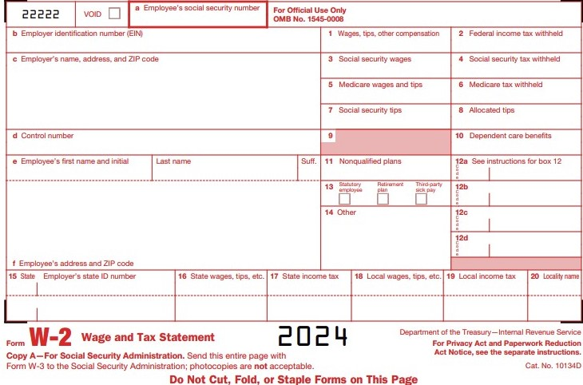

# W-2 Wage and tax statement data source guide

All W-2 information comes from the Year-end Wage File. This document describes each box on the W-2 statement and explains where information in the Year-end Wage File comes from within your back-office application. Refer to this information if you have questions about the amounts appearing on your Year-end
Employee Wage Report or your W-2 statements. We recommend that you print the Year-end Wage Report to verify the information before you print the W-2 statements.

| **Box** | **Label**  | **Source of data displayed in box** |
|---------|-------------|---|
| Void    | Void  | Nothing will be printed in this box.    |
| Box a   | Employee’s social security number| Taken from Employee Social Security Number in the Employee Maintenance window.   |
| Box b   | Employer’s identification number (EIN)  | Taken from Employer Identification Number in the Year-End Print W-2 Forms window. The Employer ID Number is entered originally in the Payroll Tax ID Setup window. Enter the number assigned to you by the IRS (using the format 00-0000000). This should be the same number that you use on your 941 Report.   |
| Box c   | Employer’s name, address, and ZIP code   | Taken from Company Name, Address, City, State, and ZIP Code in the Year-End Print W-2 Forms window.  |
| Box d   | Control Number (Optional) | Taken from Starting Control Number in the Year-End Print W-2 Forms window. This number will increase with each W-2 statement printed. |
| Box e   | Employee’s name (first name and middle initial, last name, suffix) | Taken from Last Name, First and Middle in the Employee Maintenance window. The suffix (Suff.) box will be left blank because the IRS does not require it.  |
| Box f   | Employee’s address  | Taken from Address, City, State, and ZIP Code in the Employee Maintenance window.   |
| Box 1   | Wages, tips, other compensation  | Displays the total of the following: (Gross Wages Year To Date from the Employee Summary window + the Year To Date totals for all benefits marked as subject to federal tax in the Payroll Benefit Summary window + the Reported Tips and Charged Tips from the Employee Tip Summary windows) - (the Year To Date total for all deductions marked as sheltered from federal tax in the Payroll Deduction Summary window). |
| ||**Note:** Gross Wages Year to Date in the Employee Summary window consists of wages for all pay types except Earned Income Credit pay types, charged tips, and reported tips and business expenses not treated as wages.|
| Box 2   | Federal income tax withheld | Taken from the Federal Withholding Year to Date in the Employee Summary window and Employee Tip Summary window.   |
| Box 3   | Social Security wages   | Taken from the FICA Soc Sec Wages Year To Date field in the Employee Summary window. The system checks the maximum Social Security wage limit at the time the Year-End Wage File is created to be sure it hasn’t been exceeded. If the maximum wage limit has been reached, then only the amount up to the maximum is reported.   |
| Box 4   | Social Security tax withheld   | Represents the sum of the FICA Social Security Tax Withheld Year to Date in the Employee Summary window and the FICA SS W/H in the Employee Tip Summary window. The system checks the maximum Social Security tax withholding amount at the time the Year-End Wage File is created to be sure the maximum hasn’t been exceeded. If the maximum withholding amount has been reached, then only the amount up to the maximum is reported.   |
| Box 5   | Medicare wages and tips   | Represents the sum of the FICA Medicare Wages Year To Date in the Employee Summary window and the FICA Medicare Tips in the Employee Tip Summary window.    |
| Box 6   | Medicare tax withheld    | Represents the sum of the FICA Medicare Tax Withheld Year To Date in the Employee Summary window and the FICA Med W/H in the Employee Tip Summary window.     |
| Box 7   | Social Security tips   | Taken from the FICA Social Security Tips in the Employee Tip Summary window.  |
| Box 8   | Allocated tips   | Taken from the year-to-date total of wages from history for Allocated Tips pay types in the Employee Tip Summary window.      |
| Box 10  | Dependent care benefits     | This field is blank. The previous Advanced EIC Payment amount is no longer used.   |
| Box 11  | Nonqualified plans    | Taken from the year-to-date total from history for deductions to be printed in W-2 Box 11 as defined in the Payroll Deduction Maintenance window, plus the year-to-date total from history for benefits to be printed in W-2 Box 11 as defined in the Payroll Benefit Summary window.   |
| Box 12  | See instructions for Box 12   | Fill in the items in this box as described below. Report only items that are included in the list below.  |
| ||**Note:** Make sure that the Retirement plan checkbox in box 13 is marked if you’ve entered any of the following codes in box 12: D, E, F, H, and S.|
|         | Code A   | Uncollected social security or RRTA tax on tips (include this tax on Form 1040).  |
|         | Code B       | Uncollected Medicare tax on tips (include this tax on Form 1040).   |
|         | Code C      | Cost of group-term life insurance over \$50,000.       |
|         | Code D      | Elective deferrals to a section 401(k) cash or deferred arrangement. Also includes deferrals to a SIMPLE retirement account that is part of a section 401(k) arrangement.     |
|         | Code E      | Elective deferrals under a section 403(b) salary reduction agreement.   |
|         | Code F         | Elective deferrals under a section 408(k)(6) salary reduction SEP.   |
|         | Code G          | Elective deferrals and employer contributions (including nonelective deferrals) to a section 457(b) deferred compensation plan.    |
|         | Code H         | Elective deferrals to a section 501(c)(18)(D) tax-exempt organization plan.   |
|         | Code J        | Nontaxable sick pay.   |
|         | Code K     | 20% excise tax on excess golden parachute payments.    |
|         | Code L      | Substantiated employee business expense reimbursements (nontaxable).   |
|         | Code M       | Uncollected social security or RRTA tax on cost of group-term life insurance over \$50,000 (former employees only).    |
|         | Code N    | Uncollected Medicare tax on cost of group-term life insurance over \$50,000 (former employees only).    |
|         | Code P      | Excludable moving expense reimbursements paid directly to employee.      |
|         | Code Q       | Nontaxable combat pay is reported by military employers.     |
|         | Code R        | Employer contributions to your Archer medical savings account (MSA).  |
|         | Code S     | Employee salary reduction contributions under a section 408(p) SIMPLE.   |
|         | Code T      | Adoption benefits. You must complete Form 8839, Qualified Adoption Expenses, to compute any taxable and nontaxable amounts.  |
|         | Code V    | Income from exercise of non-statutory stock options.    |
|         | Code W          | Employer contributions to your Health Savings Account. (See new Form 8889.)   |
|         | Code Y      | Deferrals under Section 409A on nonqualified deferred compensation plans.   |
|         | Code Z       | Income under Section 409A on nonqualified deferred compensation plans.   |
|         | Code AA     | Designated Roth contributions to a section 401(k) plan.    |
|         | Code BB       | Designated Roth contributions under a section 403(b) salary reduction agreement.    |
|         | Code CC       | HIRE exempt wages and tips paid to qualified employees.  |
| ||**Note:** Edit this amount only if the employee is qualified. Entering amounts for non-qualified employees will cause inaccurate reporting on your W-3.|
|         | Code DD     | Employer sponsored health coverage   |
|         | Code EE      | Designated Roth contributions under a governmental section 457(b) plan.   |
|         | Code FF     | A new box 12 Code FF has been added to the W-2 statement to report the total amount of permitted benefits under a qualified small employer health reimbursement arrangement (QSEHRA). These new QSEHRAs allow eligible employers to pay or reimburse medical care expenses of eligible employees after the employees provide proof of coverage. 
| Box 13  | Statutory employee    | This box will be marked if the employee is identified as a statutory employee in the Employee Tax Information window. A statutory employee is an employee who is subject to FICA withholding but not federal withholding.    |
|         | Retirement plan     | This box will be marked if the employee is identified as having a retirement plan in the Employee Tax Information window. This box should be marked if an employee was an active participant in a retirement plan, such as a 401(k) plan.   |
|         | Third-party sick pay     | This box will be marked if the employee is identified as having received third-party sick pay in the Edit W-2 Information window. This box should be marked if Form W-2 will be filed by a third-party sick pay payer.      |
| Box 14  | Other               | Adds the year-to-date wages from summary for Business Expense pay types to be printed in W-2 Box 14 as defined in the Payroll Pay Code Maintenance window, the year-to-date-total from summary for benefits to be printed in W-2 Box 14 as defined in the Payroll Benefit Maintenance window, and the year-to-date-total from summary for any deductions to be printed in W-2 Box 14 as defined in the Payroll Deduction Maintenance window. |
| ||**Note:** If two deductions or benefits are defined to print in W-2 Box 14 with the same W-2 label, the two deductions or benefits will be combined and printed as one amount.|
| Box 15  | State and Employer’s state    | The first state is the active state in the Employee State Tax Information window. The employer’s State ID is taken from the tax code in the Payroll Tax ID Setup window for the state tax code that is being reported on the W-2 statement. If state income tax was withheld for the employee for two states, both states can be printed on the same W-2 statement (the second state will be listed below the dotted line). The Transaction Entry Default in the Employee Tax Information window will be printed first, followed by all other states, which will be printed in alphabetical order. If state income tax was withheld for the employee for more than two states, additional states will be listed on a second W-2 statement. An additional W-2 statement will be printed automatically after the first W-2 statement is printed. |
| Box 16  | ID Number     | Taken from the year-to-date state taxable wages in Employee State Tax Summary.  |
| Box 17  | State wages, tips, etc.   | Taken from the year-to-date state income tax in Employee State Tax Summary.    |
| Box 18  | State income tax        | Taken from the year-to-date local taxable wages in Employee Local Tax Summary.  |
| Box 19  | Local wages, tips, etc.    | Taken from the year-to-date local income tax in Employee Local Tax Summary.   |
| Box 20  | Local income tax        | If local income tax was withheld for the employee for two localities, both will be printed on the first W-2 statement (the second locality will be listed below the dotted line). If local income tax was withheld for the employee for more than two localities, additional localities will be listed on a second W-2 statement. An additional W-2 statement will be printed automatically after the first W2 statement is printed.   |
