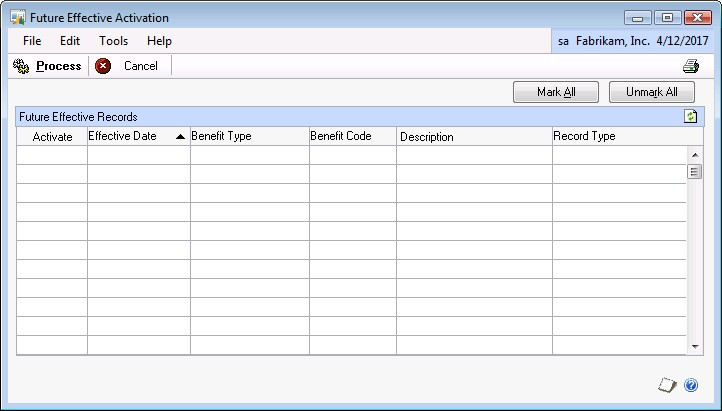
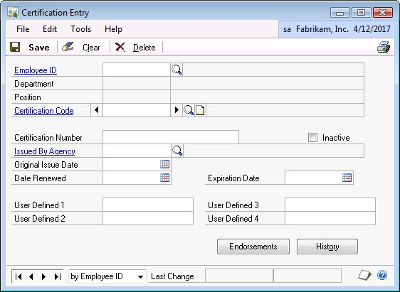
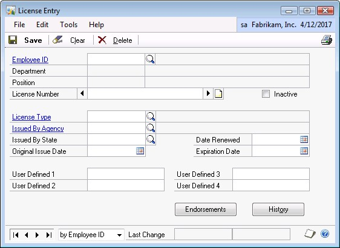
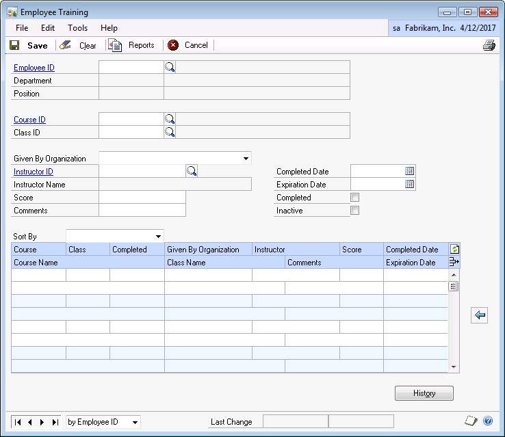
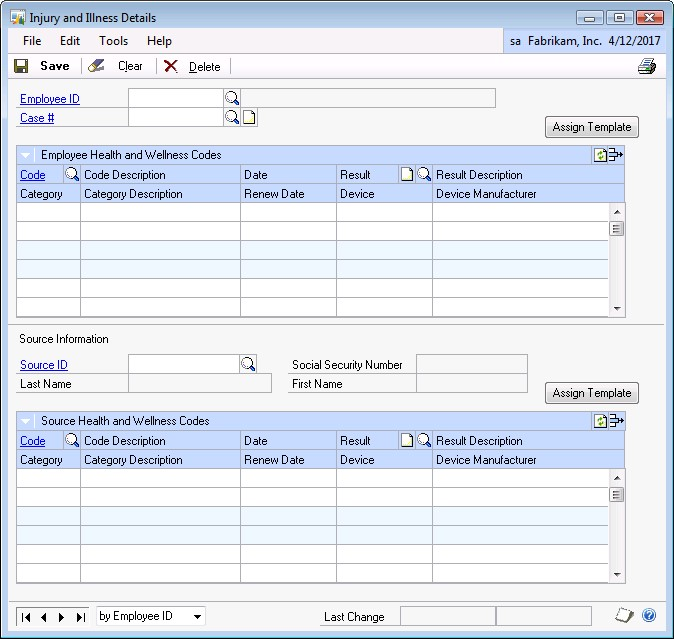

# Advanced Human Resources in Microsoft Dynamics GP - Employee Maintenance

After completing the [required setup](advanced-hr-setup.md) for advanced HR in Dynamics GP, the next step is to assign
data to employee records. Advanced Human Resources allows the organization
to input data for benefit plan changes in advance of the effective date by
using future effective records, allows certifications, licenses and training
courses and classes to be assigned to individual employees once attained or
completed, and finally allows for the collection of additional data for a
work-related injury or illness.

## Benefit Lifecycle Manager

The first component of Advanced Human Resources is the Benefit Lifecycle
Manager. This component has added additional fields to the employee
dependent and beneficiary windows. In addition, benefits can now be assigned
to dependents for better tracking of insurance coverages and costs.

### Employee Dependents Window

Within the Employee Dependents window, data fields have been added to set up
dependents associated with the employee. To open this window, click the **HR
and Payroll** series button, click **Human Resources o**n the Cards content
pane, click **Employee** and then click **Dependents**.

The data fields are listed below:

- **Status** – Active or Inactive

- **Status Comment** – These options are defined in the Plan Status Reason
    window

- **Change Date**

- **Marital Status** – Married, Single or N/A

- **Change Date**

- **Disabled** checkbox

- **Disabled Date**

### Employee Beneficiaries Window

Within the Employee Beneficiaries window, additional data fields are
available to define beneficiaries associated with the employee and specific
benefit plan. To open this window, click the **HR and Payroll** series
button, click the **Human Resources** on the Cards content pane, click
**Employee - Benefits**, select a **Benefit Enrollment** option, select an
**Employee ID**, select a **Benefit code**, click the **Benefit** icon and
then click **Beneficiary Definition**.

The data fields are listed below:

- **Plan Status** – Active or Inactive

- **Status Change Reason** – lookup button now allows information to be
    defaulted from existing Dependents.

- **Status Comment** – These options are defined in the Plan Status Reason
    window

- **Change Date**

- **Marital Status** – Married, Single or N/A

- **Change Date**

- **Disabled** checkbox

- **Disabled Date**

### Assign Template Window

Selecting a Template will create employee and code records for all codes
associated with that Template. You can then assign any Dates and Results to
those codes in this window.

Example: There may be a template for New Employees that would have listed 5
Immunizations, Vaccinations and Tests that a new employee would need. You
could assign that template and the system would create the 5 records. If
only 3 were needed, then you would uncheck the 2 that do not apply.

To open the Assign Template window, click the **HR and Payroll** series
button, click **Human Resources** on the Cards content pane, click
**Employee**, click **Health and Wellness**, enter an **Employee ID** and
then click the **Assign Template** button.

1. Enter or select a **Template Code**.

2. The **Description** displays from the Health and Wellness Template Setup
    window.

3. The Scrolling window allows you to associate Health and Wellness codes with
    a Template Code.

### Employee Benefit Dependents Window

The Employee Benefit Dependents window allows Human Resources to define the
employee dependents associated with a specific employee benefit plan. To
open this window, click the **HR and Payroll** series button, click **Human
Resources** on the Cards content pane, click **Employee - Benefits** and
select a **Benefit Enrollment** option, enter an **Employee ID**, select a
**Benefit code**, click the **Benefits icon** and then click **Dependents**.

### Future Effective Activation Window

The Future Effective Activation window is used to activate the future effective date records. The following steps should be followed. To open this window, click the **HR and Payroll** series button, click **Human Resources** on the Utilities content pane and then click **Activate Future Effective Benefits**.

Within the Future Effective Activation scrolling window, the records can be
sorted ascending or descending by columns. This window will display all
Future Effective records that currently exist and will default sorted by
Effective Date in ascending order.

- Select the **Activate** checkbox to process the Future Effective Activation for this benefit code. When selected, if corresponding HR or Payroll Future
    Effective records exist the system prompts: "Do you want to select corresponding HR/Payroll records?

  - **Yes** prompts the user to select the Activate checkbox for all records that exist equal to the Benefit Code.

  - **No** prompts the user to select the Activate checkbox for the one record.

    Select **Mark All** or **Unmark All** to select or unselect all Future Effective records displayed in the scrolling window.

- **Process** validates that there are current records marked as ACTIVATE.

  - If there are no current records marked as ACTIVATE or any records available to process, the system prompts: "You have not marked any
        records for processing."

  - If there are current records marked as ACTIVATE the process moves the current Microsoft Dynamics GP records to the Benefit Lifecycle Manager history tables, then moves the Benefit Lifecycle Manager FutureEffective records into the core Microsoft Dynamics GP tables and remove them from the Benefit Lifecycle Manager pending tables. Remember to  ACTIVATE the codes on or past the Effective Date. By ACTIVATING before the Effective Date will make the changes current, regardless of the Effective Date.

Once the process is complete, the window will close.

The records in the window can be printed by selecting the **Print** icon on
the window. The print will display the records in the order that they appear
on the window.

## Certification, License and Training Manager

The next component of Advanced Human Resources is Certification, License and
Training Manager. Using this component, the user can assign certifications
such as a Human Resources certification to a particular employee. In
addition, licenses with unique identifying numbers can be assigned. This
could be as simple as a driver's license or as complex as the DEA and other
Medical Licenses required by a doctor. Another part of Advanced Human
Resources enhances the Employee

Training window allowing more information to be tracked. Finally, Advanced
Human Resources allows the user to update multiple employee training records
with completion and expiration dates by using a course/class combination.

### Certification Entry Window

Use the Certification Entry window to add or update the Certification data
for a specific employee. Multiple certifications may be assigned to an
employee. You will be able to quickly update the expiration date of a
certification and retain the prior expiration date for historical purposes.

To open the Certification Entry window, click the **HR and Payroll** series
button, click **Human Resources** on the Cards content pane, click
**Employee** and then click **Certifications**.

Enter or select an **Employee ID** to assign the Certification Code. The
**Department** and **Position** fields displays from the Employee
Maintenance window.

Enter or select a **Certification Code**.

The following fields may or may not be required based on the Training Course
Required options selected on the Certification Setup window:

- **Issued By Agency**

- **Original Issued Date**

- **Expiration Date**

- **Certification Number**

- **Date Renewed**

Use the **User Defined** textboxes to track four additional pieces of
Certification related information.

Select the **Endorsements** button to open the Endorsement Employee
Certification Assignment window.

Select the **History** button to open the Certification History window to
display the history information corresponding to the Certification Entry
record currently open.

The **Inactive** checkbox will inactivate the current Certification Entry.

Information on this window can be made available to employees and their
managers by using.

### License Entry Window

Use the License Entry window to add or update License data for a specific
employee. Multiple licenses may be assigned to an employee. You will be able
to quickly update the expiration date of a license and retain the prior
expiration date for historical purposes.

To open this window, click the **HR and Payroll** series button, click
**Human Resources** on the Cards content pane, click **Employee** and then
click **Licenses**.

1. Enter or select an **Employee ID** to assign the License Number. The
    **Department** and **Position** fields displays from the Employee
    Maintenance window.

2. Enter a **License Number**. This number must be unique and not assigned to
    any employee.

3. Select or enter a **License Type** that corresponds to the **License Number**.

4. Use the **User Defined** textboxes to track four additional pieces of License related information.

5. Select **Endorsement** to open the Endorsement Employee License Assignment window.

6. Select **History** to open the License History window to display the history information corresponding to the License Entry record currently open.

The **Inactive** checkbox will inactivate the current License Entry.

Information on this window can be made available to employees and their
managers by using.

### Employee Training Window

The modified Employee Training window replaces the Core Employee Training
window. To open the Employee Training window, click the **HR and Payroll**
series button, click **Human Resources** on the Cards content pane, click
**Employee** and then click the second **Training** option.

The additional fields include the following:

- **Given By Organization** - enter the name of the Organization led the class

- **Instructor ID** - enter the name of the instructor

- **Expiration Date** - enter the expiration date for this class

- **Score** - enter the score that the employee earned for this class

- **Inactive** - select the inactive checkbox if appropriate for the employee

Enter or select an **Employee ID**. The **Department** and **Position**
fields displays from the Employee Maintenance window.

Enter or select a **Course ID** and **Class ID**.

Enter or select the following if the field is Required based on the Training
Course Definition Additional Information window:

- **Given By Organization**

- **Instructor ID**

- **Score**

Enter a **Comment** when applicable.

Enter or select a **Completed Date** and **Expiration Date**.

Select the **Completed** checkbox to select this Course ID/Class ID as
completed when applicable.

Select the **Inactivate** checkbox to inactivate this Course ID/Class ID
when applicable.

Select the **History** button to open the Training History window for the
corresponding Employee Training record currently open.

Information on this window can be made available to employees and their
managers by using.

### Mass Training Update Window

The Mass Training Update feature allows the user to access one window where
any/all employee(s) can be updated for a Course and Class combination
including the additional information made available in Certification,
License and Training Manager as it relates to the completion and expiration
dates of their training.

To open the Mass Training Update window, click the **HR and Payroll** series
button, click **Human Resources** on the **Utilities** content pane and then
click **Mass Training Update**.

Enter or select the **Course ID**, **Class ID**, **Instructor ID**, **Given
By Organization**, **Completed Date** and **Expiration Date**.

Update Records will allow you to update multiple employee records by
**Instructor ID**, **Given By Organization**, **Completed Date** and/or
**Expiration Date**.

## Employee Health and Wellness Manager

Health and Wellness information can be tracked for employees including
additional information for work-related injuries and illnesses. For example
in the health care industry an employee may be required to have certain
vaccinations or immunizations and to keep them up to date during their
employment. This information, along with results can be tracked by assigning
the various categories and codes set up to an employee.

There is also additional information that can be collected by employee for a
work-related injury or illness. Source information can be added to the
records allowing the user to simultaneously track ongoing treatment for both
parties.

### Health and Wellness Entry Window

Use the Health and Wellness Entry window to provide features for tracking
all immunizations, vaccinations and tests required for each employee. The
results for each test can also be recorded.

To open the Health and Wellness Entry window, click the **HR and Payroll**
series button, click **Human Resources** on the Cards content pane, click
**Employee** and then click **Health and Wellness**.

Enter or select an **Employee ID**. The **Description** displays from the
Employee Maintenance window.

Enter or select the **Health and Wellness Code** that you wish to assign to
employee. The **Description** and **Category** displays from the Health and
Wellness Code Setup window.

Enter or select the **Date Entered**, **Result** and **Renew Date**.

Select the **History** button to open the Health and Wellness History window
for the current employee and code.

### Injury and Illness Details Window

The purpose of the Injury and Illness Details window is to provide features
for tracking injury information for each employee and sources. The results
for each test can also be recorded.

The Injury and Illness Detail window will enable you to schedule follow-up
vaccinations, immunizations and tests. The history will be tracked
indefinitely for each incident of immunizations, vaccinations and tests.

To open the Injury and Illness Details window, click the **HR and Payroll**
series button, click **Human Resources** on the Cards content pane, click
**Employee** and then click **Injury and Illness Details**.

Enter or select an **Employee ID**. The **Description** displays from the
Employee Maintenance window.

Enter or select a **Case \#**.

The scrolling window allows you to enter Injury and Illness data related to
the Employee and Case Number selected.

The **Assign Template** button opens the Assign Templates window.

The **Source Information** section allows you to enter the Source related to
this Employee and Case Number.

Enter or select a **Source ID**. The **Social Security Number**, **Last
Name** and **First Name** displays from the Source Setup window.

The Source Health and Wellness Codes scrolling window allows you to enter
Injury and Illness data related to the Employee and Case Number and Source
ID selected.

The **Assign Template** button will open the Assign Templates window.

### Assign Templates Window

Use the Assign Template window to check which line items from the
appropriate template to assign to an employee or source.

To open the Assign Templates, click the **HR and Payroll** series button,
click **Human Resources** on the Cards content pane, click **Employee**,
click **Injury and Illness Details** and then click the **Assign Template**
button.

Enter or select a **Template Code**. The **Description** displays from the
Health and Wellness Template Setup window.

Health and Wellness Codes scrolling window allows you to associate Health
and Wellness codes with a Template Code.

### Summary

Advanced Human Resources allows for the tracking of additional dependent and
beneficiary information, as well as allowing benefit information to be
assigned to dependents. In addition, the organization can track information
related to certifications and licenses held by their employees. Finally,
Health and Wellness information can be tracked for employees including
additional information for work-related injuries and illnesses.

Key points to remember from this chapter:

- Assign benefit plans to enrolled dependents.

- Future Effective records need to be activated on or after the effective
    date.

- Certifications and Licenses can be tracked as they relate to employees
    including the related history.

- Employee records can be updated with course and class completion and
    expiration dates using the Mass Training Update feature.

- Templates can be assigned to employees for health related data or in the
    case of a work-related injury or illness.

- Source data can be tracked for work-related injuries and illnesses.

## See also

[Advanced Human Resources in Microsoft Dynamics GP](AdvancedHumanResource.md)  
[Advanced Human Resources - Inquiries and Reports](advanced-hr-inquiries-reports.md)  
[Advanced Human Resources - Training and Certification for Employee Self Service](advanced-hr-inquiries-training-certification.md)  
[Advanced Human Resources - Setup](advanced-hr-setup.md)  
[Human Resources - Overview](HumanResource.md)  
[Human Resources - Company Setup and Organizational Structure](human-resources-company-setup.md)  
[Human Resources - Position Control Setup](human-resources-position-control.md)  
[Human Resources Social Security Number Mask](../whats-new/human-resource-social-security-number-mask.md)  
