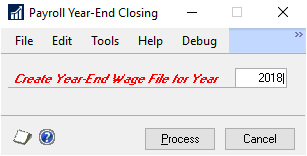
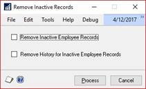
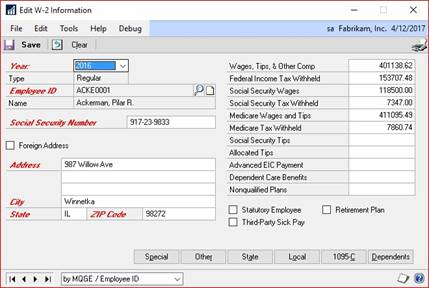
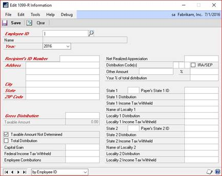
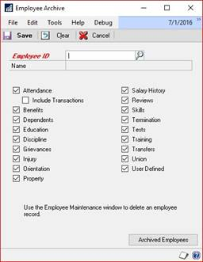
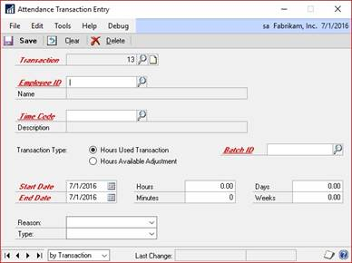
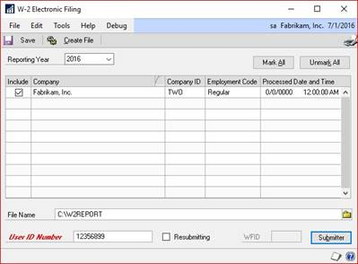

# U.S. Year-end Update in Dynamics GP

The Year-End Update is supported for Dynamics GP.

## Introduction

This document contains instructions for updating the U.S. Payroll module for Dynamics GP so that your system is compliant with the filing requirements.

Also included in this document are instructions for completing payroll year-end procedures. These instructions assume that you are already familiar with U.S. Payroll for Dynamics GP.

You can find information about year-end payroll procedures in the [Payroll Company Routines (U.S. 2024 Year-end Update in Dynamics GP)](PayrollUS.md#payrollcompanyroutine) and [Government Form and Report Routines](PayrollUS.md#govformreportroutines) sections in the [U.S. Payroll](PayrollUS.md) documentation for Dynamics GP.

> [!NOTE]
> The instructions in this article expand on the instructions in your Payroll documentation, and in some cases, supersede them.

### What's in this document

This document provides information about the tax year filing requirements and includes instructions for installing the updates necessary to make Dynamics GP compliant for filing. Additionally, you will find instructions for completing year-end payroll procedures using your Payroll system.

To make best use of the year-end update, you should be familiar with system-wide features described in the System User's Guide, the System Setup Guide, and the System Administrator's Guide.

To view information about the release of Dynamics GP that you're using and which modules or features you are registered to use, go to the Help menu. Choose Help \>\> About Dynamics GP.

> [!NOTE]
> Some illustrations might show dates for previous tax years. Other than the dates illustrated, the other information is accurate for the current year-end process.

### Year-end resources

If you have questions about Payroll year-end closing procedures and your Microsoft Partner isn't available, there are several resources, in addition to this document, to assist in answering your year-end questions.

- Year-end information

    [Dynamics GP Downloads](/dynamics/s-e/gp/mdgp2018_release_download_378)

    Look here to find year-end updates, instructions, and tax updates. Instructions for downloading and installing the updates are also provided here.

- eSupport

    [https://serviceshub.microsoft.com/supportforbusiness](https://serviceshub.microsoft.com/supportforbusiness)

    For support requests that can be handled with e-mail. On average, the response time is nearly twice as fast as telephone support. That's a big benefit during the critical year-end season.

- Community

    [https://community.dynamics.com/gp](https://community.dynamics.com/gp)

Start a year-end discussion with other members of the Microsoft customer community. This database provides you with the opportunity to exchange information with other customers, which is perfect for providing tips and answers to year-end questions.

## Chapter 1: Changes in the year-end update

The U.S. 2024 Year-end Update contains software changes to allow you to comply with 2024 filing requirements as well as the most recent fixes for Dynamics GP and other quality report fixes related to the payroll year-end.

### Payroll form changes

- There are no form changes for payroll for the 2024 reporting year.

Blog post with details of year-end: [Dynamics GP-2024 Year-End Blog Series Schedule](https://community.dynamics.com/blogs/post/?postid=f30372ff-bf84-ef11-ac21-7c1e520c9c1).

### Updates for ACA reporting, form 1095-C

Only the instructions on the back page have been updated. All other information on the form remains the same.

### Forms whose format is not changing for 2024

The formats of a number of forms are not changing for the 2024 tax year. The forms that are not changing include:

- W-3 statement
- W-4 statement
- W-2 statement

If you choose not to install the 2024 year-end update, you can still apply the 2025 Payroll Tax Update.

## Chapter 2: Payroll year-end checklists

This chapter contains checklists that you can use for year-end. Use the checklist that most suits the way your company handles Payroll year-end activities. The following checklists are provided:

- [Printing 2024 statements before processing 2025 pay runs](#printoldbeforenew)

- [Processing 2025 pay runs before printing 2024 statements](#printnewbeforeold)

### <a name=printoldbeforenew></a>Printing 2024 statements before processing 2025 pay runs

Use this checklist to install the year-end maintenance and update, to close the payroll year, to update your Payroll system with the 2024 Payroll tax changes, and to print 2023 wage statements before performing 2024 pay runs.

Detailed instructions for completing each step are found in the chapters and sections indicated.

| **Step** | **Description**|
|----------|----------------|
| 1        | Verify that you have installed a 2024 Payroll tax update. The first tax update for the year was 12/20/2023 or a later date is fine.   |
| 2        | Complete all 2024 pay runs.    |
| 3        | Complete all payroll month-end, period-end, or quarter-end procedures. Note: You can install the year-end update (step 5) before this step, as long as you create a backup before installing.  |
| 4        | Make a backup of your company database(s). Label the backup "Pre Year-end Wage file".  |
| 5        | Install the U.S. Year-end Update. See [Installing the year-end update](#installing-the-year-end-update). Note: Do not restart Dynamics GP on any workstation until the update has been installed on all workstations that run the application. |
| 6        | Create the Year-end Wage file. See [Creating the Year-end Wage file](#creating-the-year-end-wage-file). Note: 2025 Payroll tax updates can be installed any time after the Year-end Wage file has been created. |
| 7        | Make a backup of your company database(s). Label the backup *Post Year-end Wage file*.  |
| 8        | Verify W-2 and 1099-R statement information. Note: If you make changes to the statement information, we recommend that you make another backup.  |
| 9        | Print the W-2 Validation Report, W-2 statements, and W-3 Transmittal form. See [Chapter 6 Report procedures](#chapter-6-report-procedures). |
| 10       | Print the 1099-R Validation Report, 1099-R forms, and 1096 Transmittal Form. See [Chapter 6 Report procedures](#chapter-6-report-procedures).    |
| 11       | Prepare and submit W-2 information in the federal EFW2 format, if required. See [Chapter 5 Submitting W-2 reports electronically](#chapter-5-submitting-w-2-reports-electronically). |
| 12       | Archive Human Resources information for inactive employees (optional).   |
| 13       | Set up fiscal periods for 2025.  |
| 14       | Delete Human Resources information for inactive employees (optional).   |
| 15       | Close the fiscal periods for the Payroll series for the 2024 year (optional).  |
| 16       | Install the 2025 Payroll tax update.  |

### <a name=printnewbeforeold></a>Processing 2025 pay runs before printing 2024 statements

Use this checklist if you need to process 2025 pay runs before printing 2024 wage statements.

Detailed instructions for completing each step are found in the chapters and sections indicated

| **Step** | **Description**  |
|----------|---------------------|
| 1        | Verify that you have installed a 2024 Payroll tax update. The first tax update for the year was 12/20/2023 or a later date is fine.|
| 2        | Complete all 2023 pay runs.   |
| 3        | Complete all payroll month-end, period-end, or quarter-end procedures. Note: You can install the year-end update (step 5) before this step, as long as you create a backup before installing. |
| 4        | Make a backup of your company database(s). Label the backup "Pre Year-end Wage file".   |
| 5        | Install the U.S. Year-end Update. See [Installing the year-end update](#installing-the-year-end-update). Note: Do not restart Dynamics GP on any workstation until the update has been installed on all workstations that run Dynamics GP. |
| 6        | Create the Year-end Wage file. See [Creating the Year-end Wage file](#creating-the-year-end-wage-file). Note: 2025 Payroll tax updates can be installed any time after the Year-end Wage file has been created. |
| 7        | Make a backup of your company database(s). Label the backup *Post Year-end Wage file*. |
| 8        | Verify W-2 and 1099-R statement information. Note: If you make changes to the information, we recommend that you make another backup. |
| 9        | Archive Human Resources information for inactive employees (optional). |
| 10       | Set up fiscal periods for 2025.|
| 11       | Clear Human Resources information for inactive employees (optional).  |
| 12       | Close the fiscal periods for the Payroll series of the 2024 year (optional).   |
| 13       | Install the 2025 Payroll tax update.|
| 14       | Process 2025 pay runs.              |
| 15       | Print the W-2 Validation Report, W-2 statements, and W-3 Transmittal forms. See [Chapter 6 Report procedures](#chapter-6-report-procedures). |
| 16       | Print the 1099-R Validation Report, 1099-R forms, and 1096 Transmittal Form. See [Chapter 6 Report procedures](#chapter-6-report-procedures).   |
| 17       | Prepare and submit W-2 information in the federal EFW2 format, if required. See [Chapter 5 Submitting W-2 reports electronically](#chapter-5-submitting-w-2-reports-electronically).|

## Chapter 3: Preparation and FAQs

Use the instructions in this chapter to prepare for the U.S. Year-end Update.

### Supported releases

The U.S. 2024 Year-end Update supports Dynamics GP (18.7 or higher)

To identify the release that you're using, start Dynamics GP. Choose Help \>\> About Dynamics GP.

If you're not using one of the supported releases, upgrade to a supported version before installing this update.

For more information about product discontinuation dates, see [Software Lifecycle Policy for Microsoft Dynamics GP](../terms/lifecycle.md).

### Obtaining the year-end update

Download update files and documentation from [Dynamics GP Downloads](/dynamics/s-e/gp/usgpye2018_396), or obtain them from your Microsoft Partner.

### Obtaining a User Identification Number to submit EFW2 files electronically

If you plan to submit W-2 statements electronically using the EFW2 format, you must first register for a User Identification Number (User ID) with the Social Security Administration.

Use one of the following options to obtain a User Identification Number:

- Internet: [www.socialsecurity.gov/bso/bsowelcome.htm](https://www.socialsecurity.gov/bso/bsowelcome.htm)  
- Telephone: 1-800-772-6270 Monday through Friday  

### Non-supported electronic filing

Dynamics GP currently supports electronic filing of W-2 information in the federal EFW2 format. Some states also accept this format.

Dynamics GP does not support electronic filing of 1099-R forms, State Unemployment Tax (SUTA) forms, or state W-2 forms in formats other than EFW2. You will need to use separate software or services for filing these items. Contact a Microsoft Developer that offers compatible electronic filing products.

This is the contact information for two Microsoft Dynamics partners:

Aatrix

2617 S Columbia Rd

Grand Forks, ND  58201

Telephone: (800) 426-0854

E-mail: *efile.aatrix.com*

Web Site: [www.aatrix.com](https://www.aatrix.com/)


Greenshades Software, Inc.  
7020 AC Skinner Parkway  
Suite 100  
Jacksonville FL 32256  
Telephone: (888) 255-3815  
E-mail: *sales\@greenshades.com*  
Web site: [www.greenshades.com](https://www.greenshades.com/)

> [!IMPORTANT]
> It is imperative you file electronically. The Taxpayer First Act mandates electronic filing of IRS forms including W-2s.
Beginning in 2022, if you send 100 or more W-2s/1099's, you must send them electronically. In 2023, the limit is lowered to 10. The IRS is pushing for businesses to file electronically, W-2, 1099, and so on. Dynamics GP does not file Payables 1099's electronically. 
Review this blog to help you prepare for year-end and electronic filing: [1099 Changes to expect -Get ready for Year-end](https://community.dynamics.com/blogs/post/?postid=2246f6af-3f2a-4faf-9da5-544613326c20).


### Frequently asked questions

As you complete year-end tasks, refer to the answers in this section.

- What will happen if I've already closed the 2024 Payroll tax year and don't install the 2025 tax update right away?

    Until you install the tax update containing FICA, federal, and state tax changes, the tax calculations for your 2025 pay runs may be incorrect.

- If I use multiple companies with my accounting system, do I have to install the year-end tax update for each company?

    No. The update will be reflected in all companies. However, you do need to install the update on each workstation using Dynamics GP.

- I need to print my 2025 checks before I can print W-2s. What should I do?

    After you create the Year-end Wage file, close the year. Install the 2024 tax update, and you can print checks. Follow the checklist for [Processing 2025 pay runs before printing 2024 statements](#printnewbeforeold).

- How do I print multiple W-2 statements for each employee?

  There are two ways:

  - Using Laser form "sets"

    To print all the required forms for each employee at a time (you're using laser form "sets"), simply enter the number of copies you need to print in the "number of copies" field in the Print dialog box that appears after you choose Print in the Print W-2 Forms window. For example, to print four copies of the W-2 statement for each employee, enter "4" in the Print dialog box. Information for two employees will be printed per page: Copy A for two employees, Copy B for two employees, Copy C for two employees, Copy D for two employees, etc. until the required number of copies has been printed for all employees.

  - Using Laser form "sheets"

    To print all forms for all employees, repeat the Printing W-2 Statements procedure as many times as necessary to print the required number of copies. For example, to print copies of the W-2 statements, put the Copy A sheets into the printer and follow the procedure. Copy A W-2 statements will be printed for each employee. Then, put the Copy B sheets into the printer and repeat the procedure, and so on, until all required forms are printed for all employees.

- I can't make W-2 forms align correctly. What can I do?

  Try the following method to correct alignment issues:

  1. Print the W-2s to the screen.
  2. Choose the printer icon button on the top left.
  3. A print dialog box with horizontal and vertical alignments will appear on the right. Adjust according to the situations below:

  | **Problem**               | **Adjustment**                                           |
  |---------------------------|----------------------------------------------------------|
  | Form prints too high      | Enter a positive vertical adjustment (.25 is one line).  |
  | Form prints too low       | Enter a negative vertical adjustment (-.25 is one line). |
  | Form prints too far right | Enter a negative horizontal adjustment.                  |
  | Form prints too far left  | Enter a positive horizontal adjustment.                  |

- I have closed the year and I want to print the 941 for the prior year, but it is blank. Why?

  The 941 report is date sensitive, so you need to be sure the Dynamics GP user date and the year you're printing the 941 for are the same.

- The amounts on my benefit, deduction or pay code amounts display as twice the amount they should be. What causes this?

  You might have duplicated the label on a code, which cause the amount that's displayed to be doubled. For information on how to fix this, see the blog post [Benefit, Deduction and/or Pay Code Amounts are Doubled on My W-2s](https://community.dynamics.com/gp/b/dynamicsgp/archive/2014/01/14/benefit-and-or-deduction-amounts-are-doubled-on-my-w-2s.aspx).  

- How do I verify federal withholding taxes?

  If an employee's federal withholding taxes seem incorrect or you want to verify the amounts, follow these steps to help pinpoint the error source.

  Verify your employee's records in the Payroll Employee Tax Maintenance window (Cards \>\> Payroll \>\> Tax). Check to see if any additional amounts have been entered in the Additional Withholding and Estimated Withholding fields.

  1. Open the Deduction Setup window. (Dynamics GP menu \>\> Tools \>\>  Setup \>\> Payroll \>\> Deduction. Verify that all deductions are marked as TSA are marked correctly.
  2. Make sure that the pay frequency of the employee's pay codes matches the pay period of your company.  

    For example, if you pay your employees semimonthly, the pay frequency for the employee's pay code, deduction, and benefit should also be semimonthly. For additional information, review the blog [How to Verify Dynamics GP is Calculating Payroll Taxes Correctly](https://community.dynamics.com/gp/b/dynamicsgp/posts/is-microsoft-dynamics-gp-calculating-payroll-taxes-correctly). 

- What will happen if I have deductions and/or benefits set to print in the same box on the W-2 statement with the same label?

  The amounts will be combined and print as one.

- How do I print W-2 statements for Medicare Qualified Government employees?

  In the Print W-2 Forms window (Dynamics GP menu \>\> Tools  \>\> Routines \>\> Payroll \>\> Print W-2s), select the Medicare Qualified Government Employee option in the Employee Type box. The W-2 statements for Medicare Qualified Government Employees are printed separately.

- What is the source of the Employer Identification Number that appears as a default in the Print W-2 Forms window?

  The number is the federal or state ID entered in the Unemployment Tax Setup window (Dynamics GP menu \>\> Setup \>\> Payroll \>\>Unemployment Tax) in the Unemployment Tax ID field.

- In both the Edit W-2 Information and the Print W-2 Forms windows, there is a list used to select the year. Is there a limit to the number of years available? Also, is each year added to the year-end wage file, or does each year have separate year-end wage files created during the year-end closing process?

  During the Payroll year-end closing process, the Year-end Wage File is created. Multiple years of history can be saved. If you choose the same year twice when performing the process, the previous file will be replaced by the new file. As long as the correct year is entered each time, the new year's information will be added to the file. This information can be cleared using the Remove Payroll Year-end Information window.

- If I add information in the Edit W-2 Special Information window (Special button in the Edit W-2 Information window) without entering information in the Edit W-2 Information window, where will that information appear?

  It will print this information on the additional W-2.
  
  - Where should I report the cost of coverage of an employer-sponsored group health plan on the W-2?

    Applicable employer-sponsored group health plan values should be reported in Box 12 DD on the W-2. To add a W-2 box and label to a specific Employee:

    1. Navigate to Cards >> Payroll >> Deduction or Benefit
    1. Pull up the appropriate Employee ID, and the appropriate Code.
    1. Next to W-2 Box: Use arrows to navigate to desired W-2 box space, and enter the appropriate W-2 box.
    1. Next to W-2 Label: Enter appropriate W-2 label.

    Remember: There are 4 possible labels available for every deduction, so verify the label is assigned only once to avoid duplication of values – See FAQ 2. It would be recommended to keep the codes consistent at the setup level, versus changing them at the employee level, just roll it down from setup.

- Should box 12DD print on the W-3 it seems to be missing?

  Not every box and label that prints on the W-2 is summed on the W-3.  Review the instructions for details but examples that do not print on the W-3 are codes A-C, J-R, T-W, Z, DD, FF, GG, and HH are not reported on the form W-3.

- How does the Retirement Plan checkbox get marked on the W-2, when I do not have it marked  under Cards | Payroll | Tax?

  Per the W-2 instructions this box should be marked if the employee was an "active participant" for any part of the year, such as, 401K, 403B, SEP, 457B, 501C. For example, if you have a $100.00 on the employee W2 in Box 12 D, the retirement plan box will be marked when you create the year end wage file, even if it is not marked under Cards | Payroll | Tax.

  Also on the validation report it will warn you when you have labels for retirement plans and the box is not marked.  Special Codes are deferred comp, but W-2 Retirement Plan is not checked.

- The correct Last Year-end Update date doesn't appear in the Payroll Setup window, even though I installed the 2024 year-end update and see the changes included in the update. Is there something I need to do?

  The Last Year-end Update date is read from the LastYearEndUpdate= line in the Dex.ini file. When you install a year-end update on a computer, the Dex.ini file on that computer is updated. However, in some Windows Terminal Server deployments, there is only a single installation of Dynamics GP, which many users access. Each user typically has a Dex.ini file in their home Windows folder. Installing the year-end update on the server doesn't update each user's Dex.ini file. In these situations, you should manually update each user's Dex.ini file so that the appropriate line reads LastYearEndUpdate=11/21/2024.

  For more information about how the Year-end Update date is changed, search the [Microsoft Dynamics Knowledge Base](https://support.microsoft.com/help/981312/the-date-in-the-last-year-end-update-field-is-not-updated-after-you-in) and view article number 981312.

## Chapter 4: Payroll year-end procedures

Use the instructions in this chapter to start your Payroll year-end closing tasks. The first section provides an overview of the tasks involved. The remaining sections provide additional detail for specific steps.

### Payroll year-end closing

Use this procedure to close the Payroll year. After closing the year, you need to install the Payroll tax update before processing 2024 pay runs. There are two year-end checklists you can use to close the year for payroll. The steps in this section correspond most closely to [Printing 2024 statements before processing 2025 pay runs](#printing-2024-statements-before-processing-2025-pay-runs) section. For more information, see the checklists in [Chapter 2, "Payroll year-end checklists](#chapter-2-payroll-year-end-checklists).

To complete payroll year-end closing:

1. You already should have completed the tasks in [Chapter 3, "Preparation and FAQs](#chapter-3-preparation-and-faqs).
2. Complete all 2024 pay runs. The information created during the pay runs is used for month-end or period-end, quarter-end, and any additional year-end reports that you print. You can reprint period-end, quarter-end, or additional reports and re-create the Year-end Wage file at any time.

    > [!IMPORTANT]
    > It's important that you complete all pay runs for 2024 before you install a 2025 Payroll tax update. If you install a 2025 Payroll tax update before completing your pay runs, taxes will be calculated at 2025 rates for the remainder of the 2024 pay runs.
    > When you run the first payroll for the new year, make sure your Dynamics GP user date is also in that year, if your user date is in a prior year, Social Security Maximums could be wrong and no tax withheld.

3. Complete your company's standard payroll month-end or period-end, and quarter-end procedures (optional). These procedures might include printing several month-end or period-end and quarter-end reports. You can reprint these reports at any time.
4. Back up your Dynamics GP data. Label the backup "Pre Year-end Wage file." If you encounter a problem while creating the Year-end Wage file, you can restore information from this backup. The Internal Revenue Service requires you to keep these records for at least four years.
5. Install the U.S. 2024 Year-end Update on each client workstation that will use Dynamics GP. Before installing the update, ask all Dynamics GP users to exit the application until the update is complete on every workstation. For more information, see [Installing the year-end update](#installing-the-year-end-update).

    > [!NOTE]
    > This step can be done any time, even if you haven't completed all your 2024 pay runs. This step must be done before you create the Year-end wage file.

6. Create the Year-end Wage file. For information, see [Creating the Year-end Wage file](#creating-the-year-end-wage-file).

    > [!NOTE]
    > 2025 Payroll tax updates can be installed any time after the Year-end Wage file has been created. However, if you create the Year-end Wage file, then install 2025 updates and re-create the 2024 year-end file, your FICA limits may be incorrect.

7. Back up your Dynamics GP. This backup must be separate from the "Pre Year-end Wage file" backup. Label the backup "Post Year-end Wage file." You can use this backup if you encounter problems while printing W-2 statements. The Internal Revenue Service requires you to keep these records for at least four years.

8. Verify W-2 and 1099-R statement information. If you're printing W-2 statements before closing the year 2024 or after processing a 2025 pay run, we suggest that you verify that the W-2 and 1099-R statement information is correct before you close the payroll year. For information, see [Printing the Year-end Wage Report](#printing-the-year-end-wage-report). You also might want to make changes to Your W-2 records. For information, see [Editing W-2 records](#editing-w-2-records).

9. To verify 1099-R statement information, you can print 1099-R statements using the Print 1099-R Forms window. If you make changes to your 1099-R records, we recommend that you make another backup. For information, see [Editing 1099-R statement information](#editing-1099-r-statement-information).

    > [!NOTE]
    > For more information about validation report warnings, search the [Microsoft Dynamics Knowledge Base](https://mbs.microsoft.com/knowledgebase/search.aspx) and view article number 872100.

Next, print the W-2 statements and W-3 Transmittal form. You should print a W-2 statement for each employee who has worked for the company during the year. For more information, see [Printing W-2 forms and reports](#printing-w-2-forms-and-reports).

1. Print the W-2 Validation Report to verify that the information to be printed on W-2 statements is correct. The report displays warnings if there are employee record errors, except for employees with no wages, tips, or withholding information entered on their W-2 forms. W-2 forms will not be printed for employees with no earnings or withholding information. For instructions, see [Printing W-2 forms and reports](#printing-w-2-forms-and-reports).

2. Create an EFW2 transmission file, if required. If your company has more than 100 employees, the Social Security Administration requires you to create and submit federal W-2 wage reports electronically. For information, see [Chapter 5: Submitting W-2 reports electronically](#chapter-5-submitting-w-2-reports-electronically).

3. Archive inactive employee Human Resources information (optional). If you're using Human Resources with Payroll and you want to save inactive employee information while removing Payroll history records, you can archive the information. Archiving information is beneficial if you need to provide information for references, re-hiring, or other reporting purposes. For more information, see [Archiving Human Resources information for inactive employees](#archiving-human-resources-information-for-inactive-employees).

   It is always best practice when you run payroll or an HR accrual for the new year that the Dynamics GP user date is also in the new year, so the system knows what year you are running the payroll process for.

4. Set up fiscal periods for 2025. Enter the number and length of each company's open fiscal periods in the Fiscal Periods Setup window. For more information, see [Setting up fiscal periods](#setting-up-fiscal-periods).

5. Delete inactive employee Human Resources information (optional).
    Deleting Human Resources information saves hard disk space and ensures that unused data is not available in lookup lists. For information, see [Deleting information for inactive employees](#deleting-information-for-inactive-employees).

    To accrue time using the Human Resources attendance system, see [Setting up attendance](#setting-up-attendance).

6. Close the fiscal periods for the year 2024 (optional).
    Closing any Payroll periods that are still open for the year 2021 keeps transactions from being accidentally posted to the wrong period. For information, see [Setting up fiscal periods](#setting-up-fiscal-periods).

    If you need to post Payroll transactions to a fiscal period you've already closed, use the Fiscal Periods Setup window to reopen the period before posting the transaction.

7. Install the 2025 Payroll tax update.  

You also can print W-2 statements and 1099-R forms and create an EFW2 transmission file after you've installed the 2024 Tax Update and performed pay runs for the year 2024. To view the checklist, see [Processing 2024 pay runs before printing 2023 statements](#printoldbeforenew).

### Installing the year-end update

Use these instructions to install the U.S. Year-end Update.

If the files Reports.dic, Forms.dic, and Dynamics.vba are present in your application, make backup copies before installing the U.S. Year-end Update.

You will need to install the year-end update on every workstation that runs Dynamics GP. Before you begin, ask all Dynamics GP users to exit the application until the update is complete.

**To install the year-end update:**

1. Download the update from [Dynamics GP Downloads](/dynamics/s-e/gp/usgpye2018_396).
    Save the relevant file to a folder on the local disk drive of the server workstation that runs Dynamics GP.

    > [!NOTE]
    > The year-end update file also includes all prior Microsoft Dynamics updates, such as Dynamics GP October release 18.4.1361, 18.5.1556, 18.6 and 18.7.

2. Double-click the file that you just downloaded. Progress windows appear as space requirements are verified and files are installed.

3. A message may appear, asking if you want to restart now or later. Click Yes to restart now, you will need to run the update file again after restarting.

4. Start Dynamics GP Utilities.

5. In the Welcome to Dynamics GP Utilities window, verify your server name, enter the system administrator user ID and password, and click OK.

6. In the second welcome window, click Next.

7. In the Upgrade Dynamics GP window, click Next.

    The Server Installation Progress window describes the process as it progresses.

8. In the Confirmation window, click Finish.

    Dynamics GP Utilities updates your company databases. This process may take several minutes to complete. The Server Installation Progress window describes the process as it progresses.

9. After the update process is finished and is successful, the Additional Tasks
    window opens.

    If the update process wasn't successful, the Update Company Tables window opens and a red x appears next to the name of the company. You must contact Dynamics GP Technical Support. More more information, see [Year-end resources](#year-end-resources).

10. In the Additional Tasks window, choose Update modified forms and reports and click Process. The Locate Launch File window appears.

11. Select the location of the launch file (Dynamics.set). In most cases you can accept the default location. Click Next. The Update Modified Forms and Reports window appears.

12. Mark the check box next to Dynamics GP and any additional components listed.

13. When you mark a component's check box, a Product Details window may appear, allowing you to select the location of the component's original code dictionary. You also can open the Product Details window by selecting a component and clicking Details.

    > [!NOTE]
    > When you apply an update (.msp file), any dictionaries whose compatibility ID has changed are backed up to a folder named  "Version\<Version Number\>Backup". This folder is located in the same folder as Dynamics.exe. The \<Version Number\> value is the version you were using before applying the update. If the original dictionary exists in the backup folder, Dynamics GP Utilities will automatically display its location in the Product Details window, and you can click OK to accept the location. If the location is missing or incorrect, click the file folder icon and browse to the appropriate location.

14. When you have finished selecting components, click Update. A Report Upgrade Progress window displays the status of the update. When the process finishes, click Close.

    Log files containing detailed information about the update are saved in the \\Data folder. For each component, a report named "Update\<Version_Name\>.log" is generated. An update summary named "Update\<Version\>.txt" is also generated.

15. In the Modified Forms and Reports window, click Next. The Additional Tasks window opens, where you can start Dynamics GP, or exit Dynamics GP Utilities.

16. We recommend that you start Dynamics GP and print all of your modified reports, and access all your modified forms to verify whether the reports and forms were updated correctly.

17. After installing the U.S. Year-end Update on a server for Dynamics GP, install the U.S. Year-end Update on all remaining client computers or Terminal Services.

    You can set up Automated Client Update to update all client workstations. For information about setting up the automatic updates,  refer to your System Administrator manual.

    > [!NOTE]
    > To install the update on an operating system with User Account Control (UAC) activated, a user must be running Dynamics GP with administrative privileges. (From the Start menu, select and right-click the Dynamics GP shortcut, and then select Run as Administrator.) For other ways to install the update on Windows clients with UAC activated, see Installing with UAC activated.

18. To confirm the update is installed, check your Dynamics GP Version under Help | About Microsoft Dynamics GP.  The version should be 18.6.1695 or later.

#### Installing with UAC activated

User Account Control (UAC) is an enhanced security feature in Windows 7 and later versions. UAC is activated by default. Before performing actions that could affect your computer's operation, such as installing software updates, UAC asks for permission. To install the update on a client computer when UAC is active, copy the .msp file to each client workstation, then use one of the following methods:

- Start Dynamics GP as a user that has administrative privileges on the local computer. (To do this, right-click on the Dynamics GP shortcut and choose Run as administrator.) Double-click the .msp file to install it.

- Start the Command Prompt (located in the Accessories group) as a user that has administrative privileges on the local computer. (To do this, right-click on the Command Prompt shortcut and select Run as administrator.) Set the current directory to the location where you copied the .msp file.

    For Dynamics GP, as an example, enter the following command for U.S. English installs:

    ```Msiexec /p MicrosoftDynamicsGP18-KB4602608-ENU.msp /1\*v C:\\MSPErrorlog.txt```

- If you want the user to install updates and service packs without having administrative privileges on the local computer, you can change permissions for the folder where Dynamics GP is installed. Be aware that doing this makes your computer less secure.

View properties for the folder and display the Security tab. Grant Modify permissions to an appropriate group, such as Users or Authenticated Users. Once the folder permissions are changed, any user in the group can install the .msp file by double-clicking it.

View properties for the folder and display the Security tab. Grant Modify permissions to an appropriate group, such as Users or Authenticated Users. Once the folder permissions are changed, any user in the group can install the .msp file by double-clicking it.

### Creating the Year-end Wage file

To ensure that information in the Year-end Wage file is correct, verify that you've set up W-2 box and W-2 label settings within both the Employee Benefit Maintenance window (Cards \>\> Payroll \>\> Benefit) and the Employee Deduction Maintenance window (Cards \>\> Payroll \>\> Deduction) for each benefit and deduction.

Be sure that the W-2 options are marked correctly in the Employee Tax Maintenance window (Cards \>\> Payroll \>\> Tax).

Verify your Employer State ID number in the Payroll Tax Identification Setup window (Dynamics GP menu \>\> Tools \>\> Setup \>\> Payroll \>\> Tax ID).

This is the number that will be printed on the W-2 statements. You can maintain an Unemployment ID number and State Tax ID number in Dynamics GP.

Be sure that you've installed the U.S. Year-end Update and updated your Payroll information before creating the Year-end Wage file. Also, be sure that you've made a full backup of all your company data and stored it in a safe place.

Use the Payroll Year-end Closing window to create a table of annual wage information. The data from this table will be used to create W-2 statements and 1099-R statements.

**To create the Year-end Wage file:**

1. Open the Payroll Year-end Closing window. (Dynamics GP menu \>\> Tools \>\> Routines \>\> Payroll \>\> Year-end Closing)

    

2. Enter 2024 for the reporting year.

3. Choose Process to create the Year-end Wage file that will be used for printing W-2 statements and 1099-R forms. You can store multiple years of year-end wage information in Dynamics GP. To clear previous year-end wage information, use the Remove Payroll Year-end Information window (Dynamics GP menu \>\> Tools \>\> Utilities \>\> Payroll\>\> Remove Year-end Information).

    

You can install 2025 tax tables any time after you've created the Year-end Wage file. You also may need to process 2024 pay runs before printing 2023 wage statements. For more information, see the checklist [Processing 2024 pay runs before printing 2023 statements](#printnewbeforeold).

### Editing W-2 records

You can verify and update information for an employee's W-2 statement in the Edit W-2 Information window.

However, when you make changes in this window, only the information in the Year-end Wage file changes. The employee record doesn't change, so it might be necessary to make permanent changes to the record (if the employee's address changes, for example).

**To edit W-2 records:**

1. Open the Edit W-2 Information window. (Dynamics GP menu \>\> Tools \>\> Routines \>\> Payroll \>\> Edit W-2s)

    

2. Select 2024 and select an employee. The employee's Social Security number and address are displayed in editable fields.

    > [!NOTE]
    > Social Security numbers that aren't valid are listed in the W-2 Validation Report. For more information, see [Printing W-2 forms and reports](#printing-w-2-forms-and-reports).
    > If the employee has a foreign address, mark the Foreign Address option. Fields specific to a foreign address will be displayed.

3. You can edit Special and Other box information by choosing Special or Other to open the Edit Additional Special Information and Edit Additional Other Information windows. If two deductions or benefits are defined to be printed in the same W-2 box with the same label, the amounts will be combined.

4. Edit wage and withholding information. Additional W-2 statements will be printed only for employees with multiple state tax records, multiple local tax records, multiple special records, and multiple other records.

    > [!NOTE]
    > The Advanced EIC Payment field is no longer used on the W-2. If you have an amount in that field other than zero, you will see a warning on the W-2 Validation Report.  

5. Specify the type of employee for whom you're editing W-2 information. Information from the Employee Tax Maintenance window will appear as default entries. Settings include:

    **Statutory Employee**  
        Mark this box if the employee is subject to FICA withholding but not federal withholding.

    **Retirement Plan**  
        Mark this box if the employee is an active participant in a retirement plan.

6. Edit optional information, as needed. Choose State or Local to open the Edit State Tax Information or the Edit Local Tax Information windows. Use these windows to view state and local tax information that will be printed on the main W-2 statement and supporting W-2 statements for the employee.

    When you've finished editing information, choose OK to close the window and return to the Edit W-2 Information window.

7. Choose Save to store the information and close the window.

### Editing 1099-R statement information

Use the Edit 1099-R window to update a retired employee's 1099-R information. The 1099-R statement shows an employee's distribution to a retirement plan.

When you make changes in the Edit 1099-R window, only the information in the Year-end Wage file is changed, not the employee record itself. If the change is permanent, such as an address change, you also will need to change the employee record.

**To edit 1099-R records:**

1. Open the Edit 1099-R window. (Dynamics GP menu \>\> Tools \>\> Routines \>\> Payroll \>\> Edit 1099Rs)

    

2. Select 2024 for the calendar year and select an employee. The employee's Social Security number and address are displayed in editable fields.

3. Edit miscellaneous information. If necessary, you can change the gross distribution amount or the current-year total amount of the pension that the employee received. If you know the amount of the distribution that is taxable, enter that amount. Otherwise, leave the Taxable Amount Not Determined field marked and the taxable amount at 0.

    If the employee has an excess in deferrals or earnings, be sure to enter the amount in excess in the appropriate amount field.

4. Edit state and local tax information. If necessary, you can change the amounts of the federal and state income tax withheld. You also can change the state and payer's state ID, the local tax withheld, and the name of the locality to which the tax was paid. If an employee is receiving a W-2 statement as well as a 1099-R statement, the withholding amounts will bepro-rated.

5. Choose Save to store the information and close the window.

### Archiving Human Resources information for inactive employees

Use the Employee Archive window to store inactive employee Human Resources information, such as discipline records, reviews, and position history.

It's important to archive inactive employee Human Resources information before deleting inactive employees if you would like to keep this information in the system.

**To archive Human Resources information for an inactive employee:**

1. Open the Employee Archive window. (Dynamics GP menu \>\> Tools \>\> Utilities \>\> Human Resources\>\> Archive Employee)

    

2. Select the inactive employee whose information you want to archive.

3. Mark the information to archive.

4. Choose Save to apply the changes. For more information about archiving employee records or accessing archived employee records, see the Human Resources documentation included with Dynamics GP.

### Setting up fiscal periods

Setting up periods for the future fiscal year allows you to enter transactions into the 2025 fiscal year before closing the 2024 fiscal year. Enter the number and length of each company's open fiscal periods for 2025 in the Fiscal Periods Setup window.

After clearing financial information, you also can use the Fiscal Periods Setup window to:

- Close any Payroll periods that are still open for the year, which helps to keep transactions from being posted to the wrong period or year.

- Reopen a fiscal period that you've already closed.

**To set up fiscal periods:**

1. Open the Fiscal Periods Setup window. (Dynamics GP menu \>\> Tools \>\> Setup \>\> Company \>\> Fiscal Periods)

    

2. Enter the year. Also enter the first and last days of the fiscal year. The fiscal year isn't limited to a calendar year; it can be any length.

3. If you're entering information for an historical year, mark the Historical Year option.

4. Enter the number of fiscal periods in the fiscal year. For example, enter 4 for quarterly periods, or 12 for monthly periods.

5. Choose Calculate to calculate first and last days for each period. The beginning date of each period appears in the scrolling window.

    > [!NOTE]
    > You can reenter information and recalculate periods as many times as
necessary.

6. Review the beginning dates of each period in the Date column. Make changes as needed.

7. In the Period Name column, review and rename the periods, as needed. For example, enter Quarter 1 for Period 1.

8. Use the Series Closed columns to prevent posting to a series after a period has been closed. This step is part of your period-end procedures.

9. Choose OK to save the information and close the window.

### Setting up attendance

Use the Attendance Setup window to specify if your company accrues time using Payroll or the Human Resources attendance system. If you're using Human Resources, you also can set up vacation and sick time accrual methods in this window.

**To set up attendance:**

1. Open the Attendance Setup window. (Dynamics GP menu \>\> Tools \>\> Setup \>\> Human Resources \>\> Attendance \>\> Setup)

    

2. Specify how your company accrues benefit time.

    - **Human Resources**  
        Mark Human Resources to use the Human Resources attendance system.

    - **Payroll**  
        Mark Payroll to use your accounting system to track attendance. Proceed to step 7.

3. Mark the Print Available Time on Payroll Checks option in the Employee Attendance Maintenance window (Cards \>\> Human Resources \>\> Employee - Attendance \>\> Maintenance) to print available vacation and/or sick time on payroll checks.

4. Mark the Allow entry of attendance type and reason in Payroll option to link attendance type and reason codes to payroll transactions in the Payroll Transaction Entry window. This option is available only when the accrue type is Human Resources and U.S. Payroll is registered.

5. Enter the current payroll, or accrual, year and the last day that you accrued attendance.

    These fields are available with Human Resources when U.S. Payroll is not registered. They also are available when the accrue type is Human Resources and U.S. Payroll is registered.

6. Select whether seniority is based on Months or Days.

7. You can choose to update the Vacation Calendar with attendance transactions. Mark the Update Vacation Calendar option.

    Reset benefit time available. For instance, an employee has 12.75 vacation hours available and you want the balance to be zero; you'd create an adjusting transaction for -12.75 hours for the vacation time code. If you don't reset vacation and sick time available, the hours that were available at the end of the year are carried over to the next year.

    - **Accruing with Human Resources**  
        If you marked Human Resources as your accrual type in step 2, you can reset benefit time available by creating an Hours Available Adjustment in the Attendance Transaction Entry window (Transactions \>\> Human Resources \>\> Transaction Entry).

        

        For more information, see the Human Resources documentation included in Dynamics GP.

    - **Accruing with Payroll**  
        If you marked Payroll as your accrual type in step 2, (Dynamics GP menu \>\> Tools \>\> Utilities \>\> Payroll \>\> Mass Update) and reset benefit time available. In the Update list, choose Vacation Time Available or Sick Time Available.

8. In the Attendance Setup window, enter the number of days that equal a week and the number of hours that equal a day to define your organization's work schedule. For example, a standard 40-hour work week might be Number of days in a week = 5 and Number of hours in a day = 8.

9. Choose Options to open the Attendance Setup Options window.

10. Enter an attendance reason for absence—such as Jury Duty—and add it to the Reason list by choosing the insert button. Then, enter an attendance type for the reason—such as Miscellaneous—and add it to the Type list.

    The reasons and types that you enter will be displayed in the Attendance Transaction Entry window. If you marked the Allow entry of attendance type and reason in Payroll option in the Attendance Setup window, then the reasons and types will be displayed in the Payroll Transaction Entry window.

    To remove an attendance reason or type from a list, select it and choose Remove. Predefined reasons and types cannot be removed.

11. Choose OK to save your changes and return to the Attendance Setup window.

12. Choose OK again to save the settings in the Attendance Setup window.

It is always best practice when you run payroll or an HR accrual for the new year that the Dynamics GP user date is also in the new year, so the system knows what year you are running the payroll process for.

### Deleting information for inactive employees

The Remove Inactive Records window deletes inactive records in both Payroll and in Human Resources. Deleting information for employees that you've inactivated ensures that unused data is not being stored in the system and is not available in lookup lists.

> [!NOTE]
> Don't delete inactive records until after you've created the Year-end Wage file and have printed all government statements and reports for the year. Once inactive employee records are removed, you won't be able to reprint statements and reports. You should also make sure to archive all employee information that you want to keep.

**To delete information for inactive employees:**

1. Open the Remove Inactive Records window. (Dynamics GP menu \>\> Tools \>\> Utilities \>\> Payroll \>\>Remove Inactive Records)

    

2. Choose the type of information to delete. If you mark Remove Inactive Employee Records and do not mark Remove History for Inactive Employees, information for Payroll history reports will be retained.

3. Choose Process.

When processing is complete, the Remove Inactive Employee Records Utility Log will be printed.

## Chapter 5: Submitting W-2 reports electronically

The Taxpayer First Act mandates electronic filing of IRS forms including W-2s.
Dynamics GP currently supports electronic filing of W-2 information in the federal EFW2 format. Some states also accept this format for state W-2 electronic filing. For states that require other electronic formats for W-2 filing, see [Non-supported electronic filing](#non-supported-electronic-filing).

For more information about the electronics *submission* formats and free accuracy checking tools, visit the SSA website at [https://www.ssa.gov/bso/bsowelcome.htm.](https://www.ssa.gov/bso/bsowelcome.htm).

### Creating EFW2 files

Use the W-2 Electronic Filing window to create the EFW2 transmission file and to select which companies to include in the file.

You must register with the SSA to submit the file. For information on how to register and obtain a User Identification Number with the SSA, see [Obtaining a User Identification Number to submit EFW2 files electronically](#obtaining-a-user-identification-number-to-submit-efw2-files-electronically).

Before you begin, be sure you have completed these procedures:

- Completed all pay runs for the year.

- Created the Year-end Wage file. For more information, see [Creating the Year-end Wage file](#creating-the-year-end-wage-file).

- Verified W-2 amounts on the Year-end Employee Wage report. For more information, see [Printing the Year-end Wage Report](#printing-the-year-end-wage-report).

> [!IMPORTANT]
> Make sure no one edits W-2 information while you're working in the W-2 Electronic Filing window.

**To create the EFW2 file:**

1. Open the W-2 Electronic Filing window. (Dynamics GP menu \>\> Tools \>\> Routines \>\> Payroll \>\>W-2 Electronic Filing)

    When you first open the window, a message prompts you to register with the SSA to submit W-2 information electronically.

    

2. Enter the reporting year.

3. Mark the Include option for the first company to include in the EFW2 file.

4. If information for a selected company is incomplete, a yellow alert icon will appear in the scrolling window heading. Click the icon to open the Electronic Filing Employer Information window. Enter the missing employer information and verify the Kind of Employer selection. Choose OK to close the window.

    

5. Repeat steps 3 and 4 for each company to include in the EFW2 file.

6. Enter the destination and file name for the EFW2 file. The default file name is W2Report, without an extension. If you add an extension, the SSA requires that it be a valid extension, such as ".txt".

7. Enter the User Identification Number assigned to you by the SSA when you registered to submit EFW2 files electronically. You must enter your User Identification Number before you can choose Create File. For more information, see [Obtaining a User Identification Number to submit EFW2 files electronically](#obtaining-a-user-identification-number-to-submit-efw2-files-electronically).

8. Choose Submitter to enter submitter information in the Electronic Filer Submitter Information window. To ensure that your file is valid, you must enter an e-mail address.

    

    Address information should be no more than 22 characters per line. Excess characters will be cut off in the file.

    Choose OK to save the changes and return to the W-2 Electronic Filing window.

9. Choose Create File to create the EFW2 file now, or choose Save to store the information for creating the file later. Choosing Save will also save changes in the Electronic Filer Submitter Information window.

10. If a message is displayed stating that not all fields have been entered, choose Submitter and verify that the information is complete.

    The W-2 Electronic Filing Summary Report is printed after the EFW2 file is created. This report is for informational purposes only.   We recommend using AccuWage to check all EFW2 files before sending. This an online submission at the [SSA website](https://www.ssa.gov/bso/bsowelcome.htm).

### Submitting the EFW2 files

The following guidelines summarize the filing instructions provided by the SSA. Read the SSA's instructions carefully before submitting your EFW2 file.

For information on Microsoft developers that provide electronic filing services for state taxes, see [Non-supported electronic filing](#non-supported-electronic-filing).

- BSO filing

    You can use the SSA's Business Services Online website to upload wage information in EFW2 format to the SSA over the Internet. To use BSO, go to [www.socialsecurity.gov/bso/bsowelcome.htm.](https://www.socialsecurity.gov/bso/bsowelcome.htm). You'll need to register for a User Identification Number to use BSO services.

- EDT filing

    You can use the Electronic Data Transfer (EDT) system to file wage information using the EFW2 format. The system connects SSA's national  computer with various states, federal offices, and SSA sites. For details, refer to the Electronic Data Transfer (EDT) Guide at [www.socialsecurity.gov/employer/pub.htm.](https://www.socialsecurity.gov/employer/pub.htm)

## Chapter 6: Report procedures

You can generate either detailed reports or summary reports in your year-end procedures, as needed. You also can customize your reports.

### Printing the Year-end Wage Report

Print the Year-end Wage Report from the Year-end Wage Report window to verify W-2 amounts before printing W-2 statements. This report contains the same information that appears on the W-2 statement with the headings for each field. It won't include Form 1099-R statement information. The Year-end Wage file must be created before you can print the Year-end Employee Wage report.

To print the Year-end Wage Report:

1. Open the Year-end Wage Report window: (Dynamics GP menu \>\> Tools \>\> Routines \>\> Payroll \>\>Year-end Wage Report)

    

2. Enter 2022 as the year.

3. Select a sorting option for displaying information: Employee ID, Employee Name, Department/Employee, or Social Security Number.

4. Mark All to include every employee in the report or enter a starting and ending employee ID to include a select group of employees.

5. Choose Print.

### Printing W-2 forms and reports

Use the Print W-2 Forms window to print the following forms and reports.

| **Reports**           | **Descriptions**   |
|-----------------------|--------------------|
| W-2 Validation Report | Shows W-2 information before printing W-2 statements, usually for verification purposes. Information is validated according to the Software Edit Criteria specified by the Social Security Administration. |
| W-2 Alignment Form    | Shows if the forms are aligned correctly in the printer before printing statements. Print this before printing W-2 statements.   |
| W-2 Statement         | Shows income earned and taxes deducted and is distributed to your employees for use in preparing federal, state, and local tax returns.  |
| W-3 Transmittal Form  | Contains a summary of the W-2 statements after they are printed out. The Social Security Administration requires you to submit this form along with the W-2 statements.  |

You must print a W-2 statement for each employee who worked for you during the year. In the Print W-2 Forms window you can specify which information should be printed on the W-2 statement, and then print the statement. In addition, be sure that the employee information for Box 13 of the W-2 form is accurately entered in the Edit W-2 Information window before printing a validation report.

Print the W-2 Validation report before printing W-2 statements to verify that the information to be printed on W-2 statements is correct. If the W-2 Validation Report shows any errors that need to be corrected, use the Print W-2 Forms window or the Edit W-2 Information window to make changes to the appropriate W-2 forms. For more information, see [Editing W-2 records](#editing-w-2-records).

If you're submitting W-2 wage reports electronically, you can also use AccuWage from [www.socialsecurity.gov](https://www.socialsecurity.gov/) to verify if the information in your file is correct.

**To print W-2 forms and reports:**

1. Open the Print W-2 Forms window. (Dynamics GP menu \>\> Tools \>\> Routines \>\> Payroll \>\> Print W-2s)

    

2. Enter 2024 as the reporting year.

3. Select a printing option. Mark Normal Year-end to print W-2 statements for all employees at the end of the year, including inactive employees and employees who've already had W-2 statements printed.

4. Select an employment type.

    - If you're printing W-2 statements for employees who are required to pay both
    FICA/Social Security and FICA/Medicare tax, mark Regular.
    - If you're printing W-2 statements for employees who are exempt from
    FICA/Social Security tax but subject to FICA/Medicare tax, mark Medicare
    Qualified Government Employee; also mark Medicare Qualified Government
    Employee in the Employee Tax Maintenance window.

5. Mark All to print W-2 statements for every employee or enter a starting and ending employee ID to print statements for a select group of employees.

6. Select a sorting order for the W-2 statements: Employee ID, Employee Name, Department/Employee Name, or Social Security Number.

7. Enter the company name, and select the company address ID. Also verify the federal government employer identification number (EIN) and selection for Kind of Employer.

8. Select a form type to print.

    - **1 Wide-Continuous** Select this option to print your form or report in a continuous form, with one copy of the form or report for each page printed.
    - **2 Wide-Continuous** Select this option, also called Alternate Format, to print your form or report in a continuous form, with two copies of the form or report for each page printed.
    - **1-Wide Single Feed** Select this option to print your form or report on a single sheet of paper. To print all forms for all employees using this format, repeat the procedure for each form. For example, to print the A, B, and C copies of the W-2 statements, first put the Copy A sheets in the printer and complete this procedure; next put the Copy B sheets into the printer and complete this procedure; finally, put the Copy C sheets into the printer and complete this procedure.  
    - **4-Up Laser Forms** Select this option to print your form or report in a sheet of paper, but with four forms or reports for each page. The page contains Copy B, Copy C, and two Copy 2 forms. Copy A and Copy D must be printed separately. Copy A will be included in EFW2 files, if you are submitting federal W-2 files electronically.
    -  **1 Wide - Form with Box** Select this option to print your W2 form on blank paper.  When you choose this type the W2 will print the in the current year’s format with boxes and labels

9. Select the form or report to print.

10. Verify that you've loaded the correct form in the printer.

11. Choose Print.

You can print as many copies of W-2 statements as needed. To print all the required forms for each employee (using laser form sets), enter the number of copies you need in the Print dialog box. Information for two employees will be printed per page, on each form, Copy A through Copy D, until the required number of copies have been printed. For more information, refer to the *How do I print multiple W-2 statements for each employee?* question in [Frequently asked questions](#frequently-asked-questions).

> [!NOTE]
> If you need to reprint W-2s for any reason, you can reprint them as a group or individually. Use the Employee ID field to restrict the range of W-2 statements printed.

### Printing 1099-R forms and reports

Use the Print 1099-R Forms window to print the following forms and reports.

| **Reports**           | **Descriptions**    |
|-----------------------|---------------------|
| 1099-R Validation     | Shows 1099-R information before printing 1099-R statements, usually to ensure the information printed on the 1099-R statements is correct.  |
| 1099-R Alignment      | Shows if the forms are aligned correctly in the printer before printing statements. Print this before printing 1099-R statements.   |
| 1099-R Statements     | Shows the distribution of pension payments for use in preparing federal, state, and local tax returns. It also shows an employee's distribution from a retirement plan. |
| 1096 Transmittal Form | Contains a summary of the 1099-R statements.    |

 **To print 1099-R forms and reports:**

1. Open the Print 1099-R Forms window. (Dynamics GP menu \>\> Tools \>\> Routines \>\> Payroll \>\> Print 1099Rs)

    

2. Enter 2024 for the calendar year. The default year is the current system year.

3. Mark All to print 1099-R statements for every employee or enter a starting and ending employee ID to print statements for a select group of employees.

4. Select the sorting order for the 1099-R statements: Employee ID, Employee Name, Department/Name, or Social Security Number.

5. Enter the company name, and select the appropriate company address ID. Also verify the federal government employer identification number (EIN).

6. Select a form type to print: Continuous or Single Feed.

7. Select the form or report to print.

8. Verify that you've loaded the correct form in the printer.

9. Choose Print.
