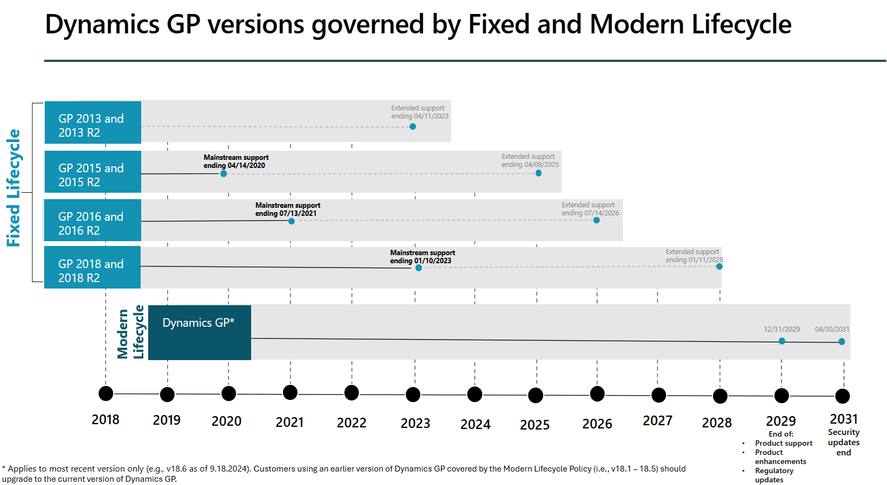

# Understand the Lifecycle Policies for Dynamics GP

In October 2019, Microsoft introduced the Modern Lifecycle Policy for Microsoft Dynamics GP. Before this date, the solution was governed by the Fixed Lifecycle Policy. The Modern Policy offers continuous support and servicing, including bug fixes and the latest tax updates. Customers stay current by taking at least one of the three yearly planned Dynamics GP releases.  

The following illustration shows the lifecycle of the various versions of Dynamics GP:

  

The [Lifecycle](/lifecycle/products/?terms=Dynamics%20GP) site shows key information about each version of Dynamics GP. The following sections provide direct links for each listed version.  

## If your Dynamics GP solution is governed by Modern Lifecycle

The current version of Dynamics GP, version 18.x, is governed by the Modern Lifecycle Policy. The [Modern Lifecycle Policy](/lifecycle/policies/modern) offers support and servicing, including bug fixes, and latest tax updates. Under this policy, Dynamics GP customers stay current by taking at least one of the three all-inclusive Dynamics GP updates, typically released in June, October, and December each year. The updates will typically consist of hotfixes, tax updates, and any relevant regulatory updates. The updates can also include changes in usability or reliability to address top customer issues, and other areas that are critical in making sure that businesses run successfully on Dynamics GP.  

As Microsoft continues focusing on innovation and investments in cloud solutions and technologies, we will end Dynamics GP support on December 31, 2029 (previously announced end date was September 30, 2029), for product enhancements, regulatory (tax) updates, and technical support. Security updates/patches, if needed, will be made available until April 30, 2031. Learn more at [https://aka.ms/GPblog](https://aka.ms/GPblog).

The following table outlines the release schedule for the three committed all-inclusive updates of Dynamics GP each year.

|Milestone |Example date  |
|---------|---------|
|June update|June 1 |
|October update|October 1 |
|December update|December 1 |

For more information, see [Modern Lifecycle Policy for Dynamics GP](/lifecycle/products/dynamics-gp).  

We recommend that Dynamics GP customers reach out to their Dynamics GP reselling partner with any questions or concerns. Microsoft remains committed to provide updates as described earlier. The Dynamics GP partner ecosystem has always been strong and will continue to release new add-ons that extend Dynamics GP.  

> [!TIP]
> We are encouraging customers to transition to Dynamics 365 Business Central, which offers advanced AI tools and robust security features to help businesses thrive in the new era of cloud and AI computing.
>
> We understand migrating and modernizing systems can sound daunting – please reach out to your Microsoft partner or leverage this list of Microsoft partners and experts in both Dynamics GP, Business Central and migration best practices to get your journey started at [https://aka.ms/GPPartnerList](https://aka.ms/GPPartnerList).

## If your Dynamics GP solution is governed by Fixed Lifecycle

The following older versions of Dynamics GP are governed by the **Fixed Lifecycle Policy**:

| **Product** | **Mainstream support** | **Extended support** |Lifecycle definition|
|--|--|--|-- |
| Dynamics GP 2013 and GP 2013 R2 | Ended April 4, 2018 | Ends April 11, 2023 |[Dynamics GP 2013](/lifecycle/products/dynamics-gp-2013)/[Dynamics GP 2013 R2](/lifecycle/products/dynamics-gp-2013-r2)|
| Dynamics GP 2015 and GP 2015 R2 | Ended April 14, 2020 | Ends April 8, 2025 |[Dynamics GP 2015](/lifecycle/products/dynamics-gp-2015)/[Dynamics GP 2015 R2](/lifecycle/products/dynamics-gp-2015-r2)|
| Dynamics GP 2016 and GP 2016 R2 | Ended July 13, 2021 | Ends July 14, 2026 |[Dynamics GP 2016](/lifecycle/products/dynamics-gp-2016)/[Dynamics GP 2016 R2](/lifecycle/products/dynamics-gp-2016-r2)|
| Dynamics GP 2018 and GP 2018 R2 | Mainstream support ends January 10, 2023 | Ends January 11, 2028 |[Dynamics GP 2018](/lifecycle/products/dynamics-gp-2018)/[Dynamics GP 2018 R2](/lifecycle/products/dynamics-gp-2018-r2)|

Installing any compatible Dynamics GP tax release or hotfix on Dynamics GP 2018 or Dynamics GP 2018 R2 will bring you to version 18.5 or later, which enacts the Modern Lifecycle Policy. There are no tax releases or hotfixes available for Dynamics GP 2018 or Dynamics GP 2018 R2 that would allow you to stay on the fixed lifecycle.

## See Also

[Microsoft Lifecycle Policies for Microsoft Dynamics GP](/lifecycle/products/?terms=Dynamics%20GP)  
[Migrate to Business Central Online from Dynamics GP](/dynamics365/business-central/dev-itpro/administration/migrate-dynamics-gp)  
[System requirements](../upgrade/system-requirements.md)  
<!--[Modified Forms and Reports Update Now Required for All Microsoft Dynamics GP Service Pack, Hotfix and Compliance Releases](/dynamics/s-e/gp/hot_topic_mdgp10_modifiedreportsformsupdaterequiredforpatchreleases_407)  -->
