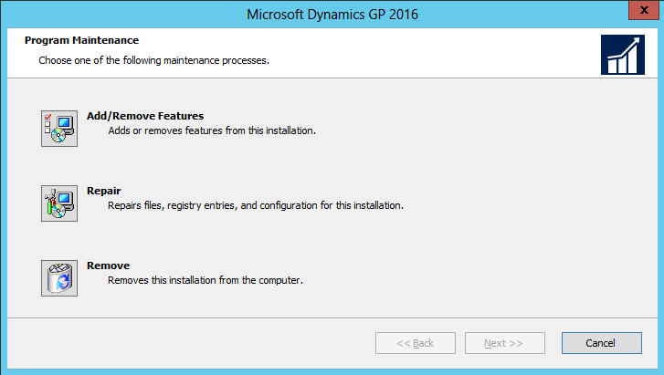

# Additional features and components upgrade

Depending on your organization's needs, you may have purchased additional features or components that add specialized functionality to your Dynamics GP system. After you've installed Dynamics GP and upgraded your data using Dynamics GP Utilities, you can install additional features and components that integrate with Dynamics GP.

## Dynamics GP features

After you've upgrade Dynamics GP, you may decide to purchase an additional feature or remove a feature. Some features add a single function to your Dynamics GP system while some, such as Manufacturing, allow you to complete a range of related business and accounting tasks that use one or more modules. Dynamics GP Utilities upgrades the tables for the features along with the Dynamics GP tables. If you choose to add a feature, we recommend that you install each registered Dynamics GP feature and additional component on all client computers. You can use the Select Features window to install or uninstall a feature. See the **Adding or removing additional features** section for more information.

### The following table lists the Dynamics GP features. The features available depends on the country or region you selected when installing Dynamics GP

For all countries and regions:

| A4                        | Manufacturing                       |
|---------------------------|-------------------------------------|
| Analysis Cubes Client     | Multilingual Checks                 |
| Analytical Accounting     | Payment Document Management         |
| Date Effective Tax Rates  | Professional Services Tools Library |
| Electronic Bank Reconcile | Project Accounting                  |
| Encumbrance Management    | Revenue/Expense Deferrals           |
| Enhanced Intrastat        | Safe Pay                            |
| Fixed Asset Management    | Service Based Architecture          |
| Grant Management          | VAT Daybook                         |
| Web Client Runtime        |                                     |

For all countries and regions except Canada and the United States:

| Bank Management      | Scheduled Installments  |
|----------------------|-------------------------|
| Direct Debit Refunds |                         |

For the United States:

| Bank Management      | Scheduled Installments  |
|----------------------|-------------------------|
| Human Resources      |                         |
| Payroll Suite        |                         |

For Belgium and France:

| Bank Management      | Scheduled Installments  |
|----------------------|-------------------------|
| Export Financial Data|                         |

## Adding or removing additional features

Use the installation wizard to add or remove features from your Dynamics GP installation. You also can use the Program Maintenance window, opened from the Add or Remove Programs control panel, to add or remove features. You should make a complete backup of your data before adding or removing features. Removing a feature does not remove tables from the database. Dynamics GP Utilities upgrades the tables for the feature along with the Dynamics GP tables.

You can't log in to Dynamics GP on a client computer if a component installed on the client has different version information than the server. You can use the GP\_LoginErrors.log file in your temporary directory to help resolve the version information issue. The log file will contain the product name, along with the dictionary version and the database version.

To add or remove additional features:

1. Start the installation wizard. You can use either of the following methods.

- From the Dynamics GP media, double-click the Setup.exe file. Click Dynamics GP. Select the existing instance of Dynamics GP in the Instance Selection window and click Next.

—or—

- Open the Control Panel &gt; Programs and Features or Uninstall a program. Select Dynamics GP. Click Change to open the Program Maintenance window.

  

2. Click Add/Remove Features.

3. In the Select Features window, select the features to install or uninstall. When you install a new feature, you won't reinstall features that have been installed previously.

### When you click a button for a feature, a pop-up menu of options appears. Refer to the table for more information about each option.

| Option                                                                         | What happens                                                                                                             |
|--------------------------------------------------------------------------------|--------------------------------------------------------------------------------------------------------------------------|
|  Run from My computer     | The selected feature will be installed on the local hard disk. (This option installs the feature, but not sub–features.) |  
|  Run all from My computer | Will install the feature and all of its sub–features.                                                                    |  
|  Not available            | Will not install the selected feature or sub–features.                                                                   |  

After you have specified the feature or features, click Next.

4. In the Install Program window, click Install.

5. The Installation Progress window appears, where you can view the status of a feature.

6. In the Installation Complete window, click Exit.

7. Start Dynamics GP Utilities.

To start Dynamics GP Utilities, you must have appropriate user privileges. If you are using an operating system that has User Account Control (UAC) enabled, you will be prompted to run the program as a user with administrative privileges. Refer to your operating system's documentation for more information.

8. The Welcome To Dynamics GP Utilities window opens when you are logged into the server you selected. Read the message and click Next.

9. Follow the instructions in the Dynamics GP Utilities windows. Depending on the feature and whether you're installing the feature on your server or a client, you may have to upgrade tables and upgrade your companies and register the feature. You do not have to reapply the update for the features you selected.

10. After the upgrade process is finished, the Additional Tasks window opens, and you can perform additional tasks, start Dynamics GP, or exit the installation. See [Company data conversion](company-data-conversion.md) for more detailed information about each task in the Additional Tasks window.

## Additional components

A smaller set of additional products or components are separate installations available on the Dynamics GP media. These additional components are listed in the main Dynamics GP installation window. For more information about accessing this window, see the **Installing an additional component** section.

The following table lists the additional components.

| Additional components | Description      |
|-----------------------|------------------|
| Analysis Cubes Server     | Installs Analysis Cube Server configuration wizards for SQL Server 2012, SQL Server 2014, and SQL Server 2016.     |
| Dynamics GP Add-in for Microsoft Word    | Installs the code necessary to enable template mapping so you can create and modify Word templates for Dynamics GP.   |
| eConnect     | A document integration tool that enables high volume, high speed programmatic integration to and from applications and the Dynamics GP back office solution. |
| Integration Manager     | Allows you to perform a one-time data conversion from your existing system to Dynamics GP products, or to perform ongoing integrations from other applications.    |
| Tenant Service     | A service that will provide tenant and user configuration information to applications. This service is required if you are setting up Dynamics GP Web Client for multiple tenants.   |
| Web Client    | The web server components that will provide browser access to Dynamics GP.    |
| GP Web Resource Cache      | Install on each session server to improve performance by enabling web client caching.       |
| Web Services Runtime      | The runtime engine that adds a Web Services interface to Dynamics GP. Install this component if you want to run integrations that access Dynamics GP data through Web Services. Several prerequisites must be met before you can install this component. Refer to the Web Services Installation and Administration Guide for more details. |
| Web Services Management Tools      | Installs the Security Console and Exceptions Management Console, which you can use to administer security and exception information for Web Services for Dynamics GP. Install this component if you want to manage Web Services from a workstation separate from where the Web Services Runtime is installed.    |
| Companion Application Services     | A tool that enables you to connect your Dynamics GP application to a data source.     |
| GP PowerShell  | PowerShell cmdlets that perform various configuration tasks for a Dynamics GP web client installation.    |
| OData Services     |     |

There are some additional components that are released only in the [Microsoft Dynamics GP Resource Directory](../resources.md#GP2018) article.

## Installing an additional component

Use this procedure to install an additional component after you've installed Dynamics GP and upgraded your company data using Dynamics GP Utilities. Before installing additional components, you should make a complete backup of your data.

Each additional component has its own installation instructions and documentation that you can access before you install the component. After you review the documentation you can install the component.

To install an additional component:

1. From the Dynamics GP media, double-click the Setup.exe file.

2. Click the additional component you want to install and then click View Documentation.

3. After you review the documentation, install the component by clicking the additional component you want to install and then clicking Install.

4. Depending on the component you installed, you may be instructed to restart your computer.

5. When installation of the additional component is complete, you can either install another component or close the main Dynamics GP installation window.
