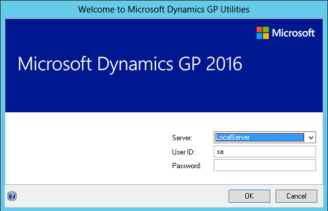
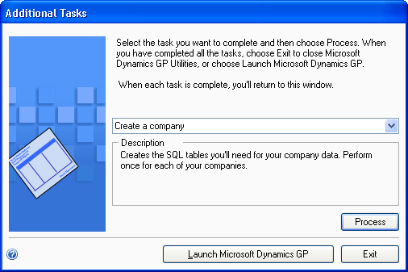

# Insatall [!INCLUDE[prodshort](../includes/prodshort.md)] on subsequent computers

Use the information in this chapter to install to [!INCLUDE[prodshort](../includes/prodshort.md)] 2018 on each client computer. You also can use [!INCLUDE[prodshort](../includes/prodshort.md)] Utilities to synchronize the [!INCLUDE[prodshort](../includes/prodshort.md)] dictionary on each additional client with your account framework.

This chapter contains the following sections:

-   [Installing [!INCLUDE[prodshort](../includes/prodshort.md)] (additional computers)](#_Installing_Microsoft_Dynamics)  

-   [Synchronizing a client’s account framework](#synchronizing-a-clients-account-framework)  

## Installing [!INCLUDE[prodshort](../includes/prodshort.md)] (additional computers)

Use the information in this section to install a client in a multiuser system after you’ve installed [!INCLUDE[prodshort](../includes/prodshort.md)] 2018 on the first computer, and created company data using [!INCLUDE[prodshort](../includes/prodshort.md)] Utilities.

To install [!INCLUDE[prodshort](../includes/prodshort.md)] (additional computers):

1. From the [!INCLUDE[prodshort](../includes/prodshort.md)] 2018 media, double-click the Setup.exe file.

2. If one or more of the following components isn’t installed on your computer, the [!INCLUDE[prodshort](../includes/prodshort.md)] Bootstrapper Setup window opens and you can choose to install the missing component or components.

-   • Dexterity Shared Components 18.0

-   • Microsoft Application Error Reporting 11.0

-   • Microsoft Lync 2010 SDK Runtime

-   • Microsoft SQL Server Native Client 11.0

-   • Microsoft Windows Installer 4.5

-   • Microsoft .NET Framework 4.6

-   • Microsoft .NET Framework 3.5

-   • Open XML SDK 2.0 for Microsoft Office

-   • Visual C++ 2015 Runtime Libraries

-   • Visual Basic for Applications Core

After all the components are installed, you may need to restart your computer before continuing the installation of [!INCLUDE[prodshort](../includes/prodshort.md)].

3. Click [!INCLUDE[prodshort](../includes/prodshort.md)].

The installation program verifies that your system has the minimum operating system required to run [!INCLUDE[prodshort](../includes/prodshort.md)]. If your system does not meet requirements, the installation won’t continue.

4. Select the primary country or region where you do business in the Country/ Region Selection window. Click Next.

5. Follow the instructions in the windows to accept the software license agreement. To install [!INCLUDE[prodshort](../includes/prodshort.md)], you must accept this agreement.

6. In the Select Features window, select the features to install. We recommend that you install all the features that you are registered to use on all client computers.

When you click a button for a feature, a pop-up menu of options appears. Refer to the table for more information about each option.

| Option                                                                         | What happens                                                                                                             |
|--------------------------------------------------------------------------------|--------------------------------------------------------------------------------------------------------------------------|
|  Run from My computer     | The selected feature will be installed on the local hard disk. (This option installs the feature, but not sub–features.) |  
|  Run all from My computer | Will install the feature and all of its sub–features.                                                                    |  
|  Not available            | Will not install the selected feature or sub–features.                                                                   |  

If you’ve installed a feature in a previous release, use the Select Features window to install that component. See [!INCLUDE[prodshort](../includes/prodshort.md)] features on page 47 for a list of [!INCLUDE[prodshort](../includes/prodshort.md)] features.

7. Specify the folder where the [!INCLUDE[prodshort](../includes/prodshort.md)] files should be installed. To select a different folder, click Browse.

After you have specified the installation folder, click Next.

8. To set up an ODBC data source, enter the name you assigned to the SQL Server when you installed Microsoft SQL Server. Click Next.

If you don’t want to set up an ODBC data source, mark the Do not create a data source option.

9. Select the system database name you are upgrading.

Click Next.

10. If you have selected to install the Service Based Architecture feature, provide the Windows account that will be used as the service account for the Service Based Architecture service.

  

The Service Based Architecture feature will create a Windows service on the computer. The Windows account provided will be the identity used for this service.

11. In the Install Program window, click Install.

The Installation Progress window appears, where you can view the status of the installation.

12. In the Installation Complete window, click Exit.

13. Before you start [!INCLUDE[prodshort](../includes/prodshort.md)] Utilities, check for and install the most current [!INCLUDE[prodshort](../includes/prodshort.md)] update for [!INCLUDE[prodshort](../includes/prodshort.md)] 2018. See CustomerSource ([*https://mbs.microsoft.com/customersource/northamerica/GP/learning/documentation/system-requirements/dynamicsgpresource\#GP2018*](https://mbs.microsoft.com/customersource/northamerica/GP/learning/documentation/system-requirements/dynamicsgpresource#GP2018)) for the latest update information.

14. After installing [!INCLUDE[prodshort](../includes/prodshort.md)] and the most recent update, you can perform the following steps.

To start [!INCLUDE[prodshort](../includes/prodshort.md)] Utilities, you must have appropriate user privileges. Typically, this means being part of the Administrators group or the Power Users group. If you are using an operating system that has User Account Control (UAC) enabled, you will be prompted to run the program as a user with administrative privileges. Refer to your operating system's documentation for more information.  

-   Start [!INCLUDE[prodshort](../includes/prodshort.md)] Utilities.

-   Follow the instructions in the [!INCLUDE[prodshort](../includes/prodshort.md)] Utilities windows to synchronize your account framework. See Synchronizing a client’s account framework for more information about synchronizing your account framework.

-   After using [!INCLUDE[prodshort](../includes/prodshort.md)] Utilities, you can install additional component applications on the server computer. See Installing an additional component on page 51 for more information.

## Synchronizing a client’s account framework

Synchronize the account framework of each client where you install [!INCLUDE[prodshort](../includes/prodshort.md)]. Scripts and files installed previously on the server are used by [!INCLUDE[prodshort](../includes/prodshort.md)] Utilities to complete the client setup.

To start [!INCLUDE[prodshort](../includes/prodshort.md)] Utilities, you must have appropriate user privileges. Typically, this means being part of the Administrators group or the Power Users group. If you are using an operating system that has User Account Control (UAC) enabled, you will be prompted to run the program as a user with administrative privileges. Refer to your operating system's documentation for more information.  

To synchronize a client’s account framework:

1. Start [!INCLUDE[prodshort](../includes/prodshort.md)] Utilities.

2. In the Welcome to [!INCLUDE[prodshort](../includes/prodshort.md)] Utilities window, verify your server name, and enter your User ID and Password. Click OK.

  

3. In the Welcome to [!INCLUDE[prodshort](../includes/prodshort.md)] Utilities window, click Next.

The [!INCLUDE[prodshort](../includes/prodshort.md)] dictionary is synchronized automatically with your account framework.

4. After the account framework is synchronized, the Additional Tasks window opens. In the Additional Tasks window, you can choose to complete additional tasks, launch [!INCLUDE[prodshort](../includes/prodshort.md)], or end the installation. If you select any task, choose Process; otherwise, choose Exit.

  

Repeat the client installation process for each computer you’ll use as a client or process server for [!INCLUDE[prodshort](../includes/prodshort.md)].

See Chapter 6, “Company data conversion,” for more information about additional tasks using [!INCLUDE[prodshort](../includes/prodshort.md)] Utilities.
