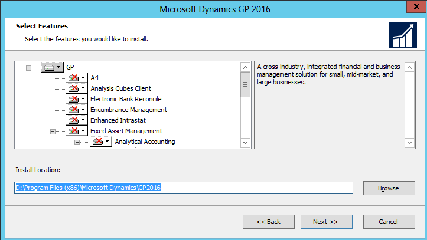
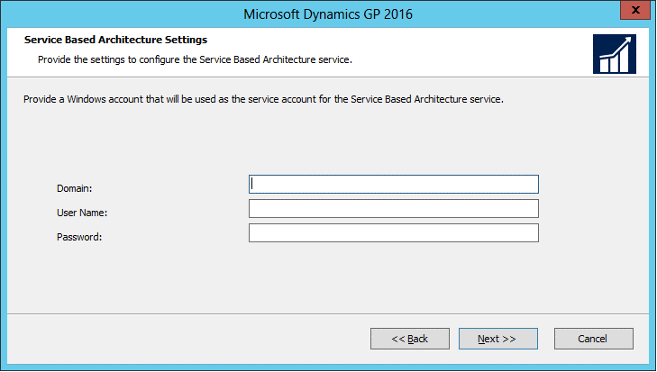

# Install Dynamics GP on the first computer

Use the information in this chapter to install Dynamics GP 2018 R2.  

## Installation overview

In a multiuser local area network environment, Dynamics GP applications are typically installed on a server, and then on each client. However, Dynamics GP is not required to be installed on the server. You must install the Dynamics GP databases on one computer first. After the Dynamics GP databases are installed on that computer, you’ll be using the Dynamics GP installation media or using an installation package to install on all remaining clients. For more about creating an installation package for your clients, see [Installation package](installation-package.md).

The program files of the previous release aren’t removed by the Dynamics GP 2018 upgrade process.

## Installing Dynamics GP (first computer)

Before you begin, be sure you’ve completed the preparation steps listed in [Data preparation](data-preparation.md) and [System preparation](system-preparation.md). You must be logged in to Windows as a user with system administrator privileges.

To install Dynamics GP (first computer):

1. From the Dynamics GP installation media, double-click the Setup.exe file to open the Dynamics GP installation window.

2. If one or more of the following components isn’t installed on your computer, the Dynamics GP 2018 Bootstrapper Setup window opens and you can choose to install the missing component or components.

    -   Dexterity Shared Components 18.0

    -   Microsoft Application Error Reporting 11.0

    -   Microsoft Lync 2010 SDK Runtime

    -   Microsoft SQL Server Native Client 10.0

    -   Microsoft Windows Installer 4.5

    -   Microsoft .NET Framework 3.5

    -   Microsoft .NET Framework 4.6

    -   Open XML SDK 2.0 for Microsoft Office

    -   Visual C++ 2015 Runtime Libraries

    -   Visual Basic for Applications Core

    After all the components are installed, you may need to restart your computer before continuing the installation of Dynamics GP.

3. Click Dynamics GP.

    The installation program verifies that your system has the minimum operating system required to run Dynamics GP. If your system does not meet requirements, the installation will not continue.

4. Select the primary country or region where you do business in the Country/ Region Selection window. Click Next.

5. Follow the instructions in the screen to accept the software license agreement. To install Dynamics GP, you must accept this agreement and click Next.

6. In the Select Features window, select the features to install.

  

When you click a button for a feature, a pop-up menu of options appears. Refer to the table for more information about each option.

| Option      | What happens          |
|-------------|-----------------------|
|  Run from My Computer      | The selected feature will be installed on the local hard disk. (This option installs the feature, but not sub–features.) |
|  Run all from My Computer       | Will install the feature and all of its sub–features.|
|  Not Available | Will not install the selected feature or sub–feature.|  

If you’ve installed a feature in a previous release, be sure that you’ve selected to install that feature in the Select Feature window. You can review the DYNAMICS.SET file for a list of features you have installed.  

7. Specify a new folder where the Dynamics GP files should be installed. To select a different folder, click Browse.

    After you have specified the installation location, click Next.

8. In the SQL Server window, you can set up an ODBC data source in the SQL Server window by entering the name you assigned to the SQL Server when you installed Microsoft SQL Server.

    If you don’t want to set up an ODBC data source, mark the Do not create a data source option.

9. Select the system database name that you are upgrading.

    Click Next.

10. If you have selected to install the Service Based Architecture feature, provide the Windows account that will be used as the service account for the Service Based Architecture service.

  

The Service Based Architecture feature will create a Windows service on the computer. The Windows account provided will be the identity used for this service.

11. In the Install Program window, click Install.

12. The Installation Progress window appears, where you can view the status of the installation.

13. In the Installation Complete window, click Exit.

14. Before you start Dynamics GP Utilities, check for and install the most current Dynamics GP update for Dynamics GP 2018. See [CustomerSource](https://mbs.microsoft.com/customersource/northamerica/GP/learning/documentation/system-requirements/dynamicsgpresource#GP2018) for the latest update information.

> [!NOTE]
> To start Dynamics GP Utilities, you must have appropriate privileges. Typically this means being prat of the Administrators group or the Power Users group. If you are using an operating system that has User Account Control, (UAC) enabled, you will be prompted to run the program as a user with administrative privileges. Refer to your operating system documentation for more information.  

15. After installing Dynamics GP and the most recent update, you can perform the following steps.

    -   Start Dynamics GP Utilities.

    -   Follow the instructions in the Dynamics GP Utilities windows to upgrade tables on your server, upgrade your companies, and upgrade modified forms and reports. See [Company data conversion](company-data-conversion.md) for more information.

    -   After using Dynamics GP Utilities, you can install additional component applications on the server computer. See [Creating an Installation package](installation-package.md) or [Installing an additional component](additional-features-and-components-upgrade.md) for more information.  
