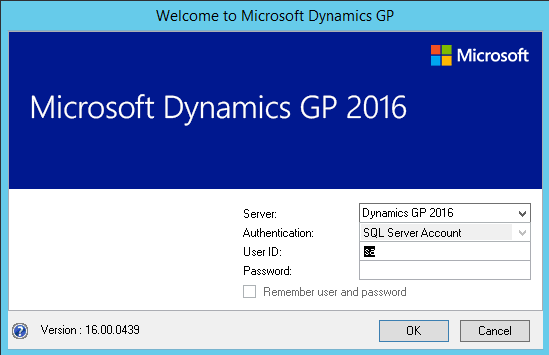
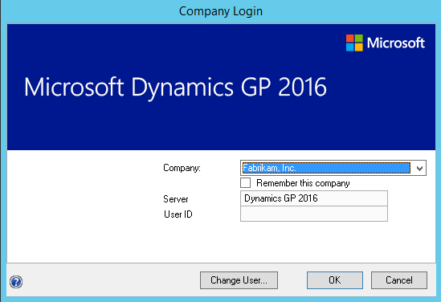
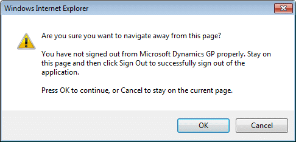
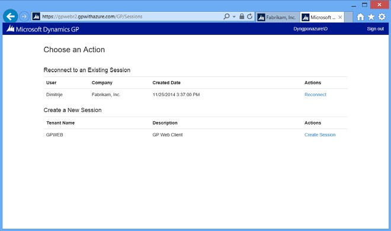
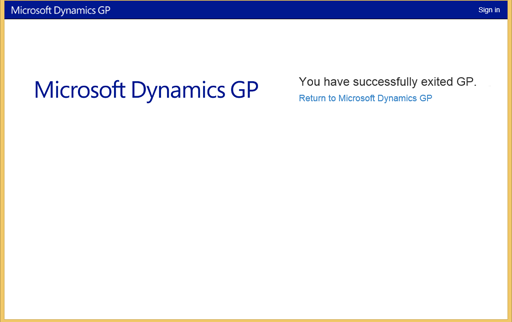
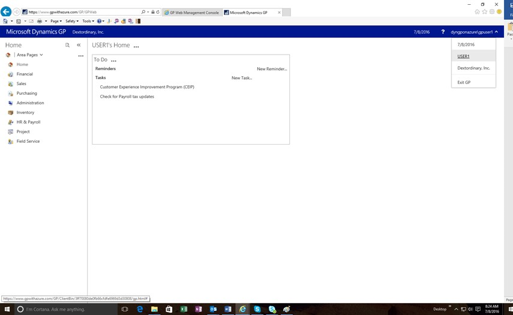
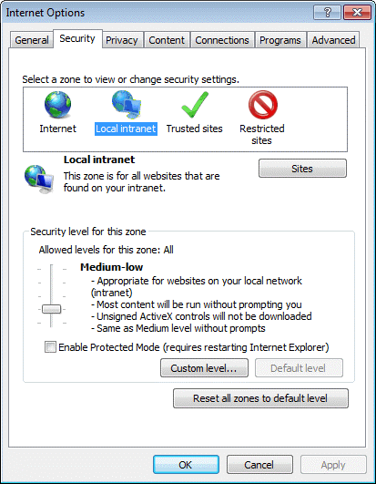

# Connecting to the web client

To have the Dynamics GP web client installation work as efficiently as possible, it’s important that users follow the proper process for connecting to the web client. Information about this is divided into the following topics:

-   [Signing in](#signing-in)  

-   [Disconnecting from a session](#disconnecting-from-a-session)  

-   [Reconnecting to a session](#reconnecting-to-a-session)  

-   [Signing out](#signing-out)  

-   [Signing in as the sa or DYNSA user](#signing-in-as-the-sa-or-dynsa-user)  

-   [Web browser security settings](#web-browser-security-settings)  

## Signing in

To sign in to the web client, use the following procedure.

1. Open Internet Explorer or other support web browser.

2. Enter the URL of the Dynamics GP web client site. The default address of the site is:

    [https://ServerName:PortNumber/GP](https://ServerName:PortNumber/GP)  

    **ServerName**   is the fully-qualified domain name (FQDN) for the server that is hosting the web site. This name must match the name you used when you requested the security certificate that you applied to the site when setting up SSL.

    **PortNumber**   is the port for the web site that you are using. If you chose to install on the default web site (port 80) then you do not need to supply the port number.

    A typical URL to access the Dynamics GP web client looks similar to the following:

    <https://gpuaweb.contoso.com/GP>

3. View the sign on page. If the site displays a security certificate error, report the issue to your system administrator, and do not continue the sign on process.

  

4. Enter your user credentials (User Name and Password). These are either domain user credentials or machine user credentials, depending on how the web client installation is configured. The User Name will have the format:

    domain\\username or machine\\username

These are not your Dynamics GP login name and password.  

5. Specify the security level for the session. You can click Show descriptions to display details of the two security options.

    This is a public computer   Choose this option if the computer is public or is shared by multiple users. Be sure that you close the browser window when you are finished with your session.

    This is a private computer   Choose this option if this is a private computer that only you have access to. When you choose this security level, you can mark the Remember me check box to save your user name and password. These will be used to automatically sign in to Dynamics GP the next time you access this page for the web client.

6. Click **Sign In**.

7. If you are using a multitenant configuration, and have access to more than one tenant, you will be prompted to choose the tenant (installation of Dynamics GP) that you want to connect to. Choose the Create Session action for the tenant.

    If you are using a single tenant configuration, or have access to only one tenant, no prompt will be displayed.

8. A session will be created. The window you see first will depend on settings for your Dynamics GP user.

    -   If your Dynamics GP user ID has only SQL Server Account information, the Dynamics GP login window will be displayed.

  

Log in with your Dynamics GP login name and password.

-   If your Dynamics GP user ID has Windows Account information, the Web Client SQL User will be used to access Dynamics GP data.

**One company**   If you have access to only one company, that company will automatically be used. The first page you see in Dynamics GP will be the Home page.

**Multiple companies**   If you have access to multiple companies, the Company Login window will be displayed, allowing you to select the company to use.

  

## Disconnecting from a session

In general, you should avoid closing the web browser when you have an active connection to the Dynamics GP web client. When you close the web browser while connected, your web client session remains active on the server. The resources used by your session are still dedicated to it and cannot be used for other web client sessions.

To help prevent you from accidentally closing the web browser, the following message is displayed when you attempt to close the web page or navigate away to another web page.

  

If you accidentally navigated away from the web client session, click **Cancel** to return to the web client.

Sometimes, disconnecting from a session by closing the web browser can be useful. The following are two examples:

-   Assume you need to shut down your computer, but you have multiple windows open in the Dynamics GP web client with data displayed in them. Disconnecting from the session allows those windows to remain open. When you reconnect to the session, which is discussed in the next section, the windows will have maintained their state information.

-   A long-running process that you want to allow to finish is another reason to close the web browser and leave the session running on the server. After the process has started, it will continue processing, even after the web browser has been closed.

## Reconnecting to a session

Reconnecting to an existing session is just like the process of signing in to the web client.

To reconnect to a session:

1. Open Internet Explorer.

2. Enter the URL of the Dynamics GP web client site.

3. At the sign on page, enter your user credentials, and click **Sign In**. The Session Central Service will find any existing session that you had disconnected from. These sessions will be listed.

  

4. Select the one of the sessions in the list and then click **Connect to Existing Session** to reconnect.

The web client will restore as many of the existing session’s session characteristics as possible. The web client will does not know which area page had been displayed. It will restore the correct set of windows, though the exact placement of the windows may not match the configuration that existed when you disconnected from the session.

## Signing out

To exit the web client, click **Exit GP** in the upper-right corner of the web browser. You will be logged out of Dynamics GP, the web client session will end on the server, and the exit page will be displayed.

  

To go back into Dynamics GP, click **Enter Dynamics GP**. If you had chosen the option to remember your user name and password on the sign on page, you will not be prompted for them.

If you want to remove the stored user name and password from the machine, click **Sign Out**, in the upper-right corner of the page.

When you have finished working with Dynamics GP, it’s a good idea to exit Dynamics GP, rather than to just disconnect from the session. Some of the advantages of exiting include the following:

-   System resources are made available for other web client sessions.

-   It releases a Dynamics GP user in the system, so you are less likely to encounter the user limit.

-   It reduces the possibility of data loss that might be caused the web client session had to be forcibly ended.

## Signing in as the sa or DYNSA user

For some special circumstances, you may need to sign in to the Dynamics GP web client as the “sa” or “DYNSA” user. If you don’t have your Windows account information associated with a Dynamics GP user, you will see the standard Dynamics GP log in window that you can use to sign in as “sa” or “DYNSA”.

If your Windows account information is associated with a Dynamics GP user, you will be automatically signed in as that GP user. The standard Dynamics GP log in window will not be displayed. In this situation, use the following procedure to sign in as the “sa” or “DYNSA” user:

1. After the initial sign in operation is complete, click the user name in the lower- left corner of the web client.

  

2. The login window will be displayed. Choose **SQL Server Account** as the authentication type.

  

3. Specify “sa” or “DYNSA” as the User ID. Enter the appropriate password, and then click **OK**.

## Web browser security settings

You may be accessing the Dynamics GP web client through an intranet or over the Internet. Depending on the access method, you may need to adjust your web browser security settings to allow printing and local file access to work properly. Do this in the **Internet Options** window for Internet Explorer.

  

You will have to do one or both of the following actions:

-   Display the **Security** tab. Add the URL for the Dynamics GP web client site to the **Trusted sites** list.

-   Reduce the security level for the specified zone. For example, if you are running the Dynamics GP web client in an intranet setting, reduce the security level for the **Local intranet zone**.

