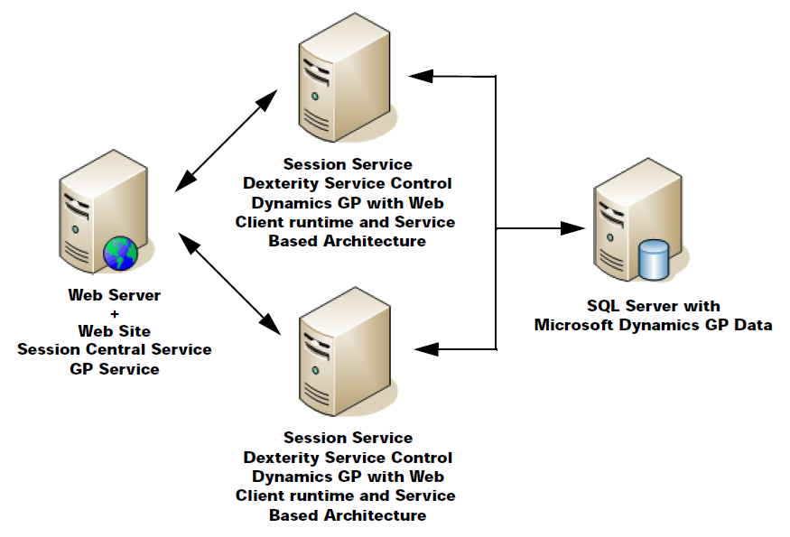

# Deployment configurations

There are three common deployment configurations for the Microsoft Dynamics GP web components. This chapter discusses these configurations. It is divided into the following sections:

-   [Single machine](#single-machine)  

-   [Scale out](#scale-out)  

-   [Multitenant](#multitenant)  

## Single machine

The single machine configuration is the simplest configuration to use when deploying the Microsoft Dynamics GP web components. In this configuration, the web client, service based architecture and web management console components are installed on a single server machine. This includes the Web Site, Session Central Service, Session Service, and Microsoft Dynamics GP web client runtime for the web client. It also includes the GP Service, Dex Service Control and Microsoft Dynamics GP with the service based architecture feature and Web Management Console snap-ins required to manage the environment.

A typical single machine configuration is shown in the following illustration.

  

This configuration is used when the number of users accessing the system is low. It is also commonly used by developers who are creating and testing integrations for Microsoft Dynamics GP.

One limitation of the single machine configuration is that there is no redundancy. If the server machine is down, such as when installing an update, no web client users will be able to access Microsoft Dynamics GP.

The installation process for this configuration is described in Chapter 10, “Single machine installation.”  

## Scale out

The scale out configuration is used when an organization has a larger number of users that will be accessing the Microsoft Dynamics GP web components. In this configuration, one server contains the web site, Session Central Service, GP Service and Web Management Console. Two or more session host machines each contain the Session Service, Dex Service Control and Microsoft Dynamics GP (web client runtime and service based architecture). The Session Central Service and GP Service balances the processing load among the session host machines.

A typical scale out configuration is shown in the following illustration.

  

The scale out configuration has some redundancy. If one of the session host machines must be taken out of service, such as when installing an update, the other session host machines will continue supporting web client users. A fully redundant configuration can be achieved by adding an additional Web Server that is load balanced with the initial Web Server. Additional session host machines can be added as needed to support a higher number of users.

The installation process for this configuration is described in Chapter 11, “Scale out installation.”  

## Multitenant

The multitenant configuration is typically used by organizations that host Microsoft Dynamics GP for other customers. This configuration can support a large number of users. This configuration has the following characteristics:

-   There are multiple front-end web servers that are each running the Session Central Service and the GP Service. These web servers are load balanced for redundancy.

-   Multiple session host machines host the sessions of the Microsoft Dynamics GP web client and service-based architecture. Each of these session host machines contains the Session Service, Dexterity Service Control, and the Microsoft Dynamics GP web client runtime and service-based architecture.

-   The Tenant Service is used with this configuration to allow multiple Microsoft Dynamics GP installations to be run on the same physical server.

The multitenant configuration has the best redundancy of any of the typical Microsoft Dynamics GP web client configurations. In addition to multiple session host machines, having multiple front-end web servers can allow web client users to access the system even when one of the web servers is unavailable.

This is a more complex configuration and is not covered in this documentation.  
