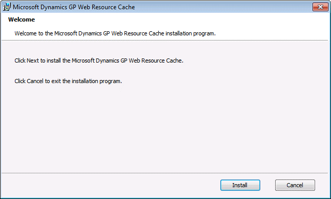

# GP Web Resource Cache

The Dynamics GP Web Resource Cache is an optional component that you can install on the session host machines of your web client installation to help improve the performance and resource utilization. It is a Windows service that runs on the session host machines for the web client installation. Information about caching is divided into the following sections:

-   [Caching for the web client](#caching-for-the-web-client)  

-   [Installing the GP Web Resource Cache](#installing-the-gp-web-resource-cache)  

-   [Managing the cache](#managing-the-cache)  

## Caching for the web client

Any form that is displayed by the web client is first retrieved from the application dictionary and then converted into a format that can be used by the web client. Because the result is the same each time, it is useful to cache the converted form.

In the standard Dynamics GP web client installation, form caching is done at the session level. Each user session on the session host machine has its own cache folder that stores cached versions of the forms that the user has opened during that session. If a user re-opens a form that had previously been opened, the cached version is used. When the user closes the session, the contents of the cache are deleted.

The GP Web Resource Cache allows caching at the machine level. When a user accesses a form in the web client, the form is cached on the session host machine. If any other user session running on that machine accesses that same form in the web client, the cached version is used. The content of the machine level cache is persistent. It is not affected when users close their web client sessions.

The machine level cache can help improve performance in three ways:

-   It’s faster to use the cached version of a form, rather than to retrieve and convert the form definition from the application dictionary.

-   Because it is persistent beyond the life of individual user sessions, the cached information does not have to be re-created for each session.

-   The cached information is shared. The first time a web client user accesses a form, the form is cached. After that time, other web client users will access the cached version of the form.

If a form in the Dynamics GP web client installation has changed, such as being customized with the Modifier, the cache is updated automatically the next time the form is accessed.

## Installing the GP Web Resource Cache

You can install the GP Web Resource Cache on any session host machine (a machine that is running the Session Service). Use the following procedure to install the cache:

To install the GP Web Resource Cache:

1. From the Dynamics GP installation media, double-click the Setup.exe file to open the Dynamics GP installation window.

2. Click **GP Web Resource Cache** and then click **Install**.

3. At the Welcome screen, click **Install**.

  

4. After the installation is complete, click Finish. The GP Web Resource Cache will begin working immediately.

## Managing the cache

In most cases, you won’t need to do any configuration or management actions for the GP Web Resource Cache. There are actions you can take to manage the cache, and some configuration settings that you can use to control the behavior of the cache.

### Starting and stopping the cache

The GP Web Resource Cache is a Windows service, so you can use the Services control panel to start or stop the cache. As soon as you stop the cache, any new web client sessions will fall back to session level caching.

Any time the GP Web Resource Cache is not available, session level caching is used.  

### Cache configuration file

A configuration file for the GP Web Resource Cache can be found in this location: C:\\Program Files\\Microsoft Dynamics\\GP Web Resource Cache\\Providers

The configuration file has the following name: Microsoft.Dynamics.GP.Web.Services.Runtime.Caching.Provider.FileSystem.dll.config

The following settings are found in this configuration file:

**Location**   This setting specifies the complete path to the location of the machine level cache. The default value is the empty string ("") which causes the cache to be created in the temporary folder for the user account that is running the GP Web Resource Cache service.

You may want to supply a specific location for the machine level cache for special circumstances, such as when you have a high-performance storage device like a solid state disk available. You should always keep the machine level cache on the local machine. Do not put it on a network or shared location.

**CleanupInterval**   The GP Web Resource Cache will automatically remove infrequently used content. This setting specifies how often the GP Web Resource Cache will scan the cache content for content that has not been accessed within the specified time period (defined by the CleanupMaxAge setting). The default value is once a day. The format for this setting is days:hours:minutes:seconds.

**CleanupMaxAge**   This setting specifies the minimum amount of time that must have elapsed since the content was last accessed before it is removed by the automatic cleanup action. The default value is 30 days. The format for this setting is days:hours:minutes:seconds.

After you have made any changes to the configuration file, be sure to restart the Dynamics GP Web Resource Cache service in the Services control panel.  
