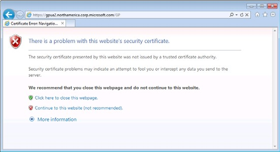
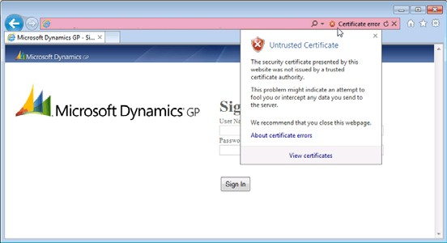
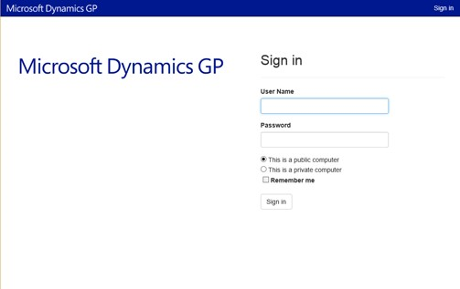

# Importing a Self-signed Security Certificate

You use certificates to help secure connections over a wide area network (WAN), such as connections to and from Dynamics GP. Implementing security certificates on your deployment environment requires modifications to various web components.  

## About security certificates

A certificate is a file that Dynamics GP uses to prove its identity and establish a trusted connection with the client that is trying to connect.  

### Certificates for production

In a production environment, you should obtain a certificate from a certification authority or trusted provider. Some large organizations may have their own certification authorities, and other organizations can request a certificate from a third-party organization.  

### Self-signed certificates

When you are using a self-signed security certificate, there is no certificate authority available to verify the certificate. If you use another computer to connect to the Dynamics GP web client installation that is using a self-signed security certificate, you will see a certificate error displayed in the web browser.

  

If the same self-signed security certificate is used for both the web site and for the web client runtime service, the certificate error can prevent you from successfully logging into the Dynamics GP web client. The solution is to import the security certificate into the machine that will be accessing the web client. This article describes how to do this.  

## Retrieve the security certificate

First, you must retrieve the security certificate from the server, and then you must install the certificate onto your local machine.

### To retrieve the security certificate

1. Open a browser on the computer that will be used to connect to the Dynamics GP web client.

2. Connect to the Dynamics GP web client site. The browser will display a message indicating that there is a problem with the web site’s security certificate. Click Continue to this website.

3. The URL area of the browser you will appear in red, indicating a security certificate error. Click **Certificate error** to display the details of the error.

      

4. In the drop-down, click **View certificates**.

5. In the **Certificate** window, click the **Details** tab.

6. Click **Copy to File** to open the **Certificate Export** wizard. Click Next.

7. Choose the DER encoded binary X.509 format, and click Next.

8. Click Browse to open a file dialog box that allows you to name the certificate file and select a location for it. A common practice is to name the certificate based on the computer that it is being accessed. In this example, the computer being accessed is named GPUA2, so the certificate is named GPUA2.cer. Choose a convenient location for the file, such as the desktop. Click Save.

9. In the **Certificate Export** wizard, click Next. Then click Finish. A message will be displayed indicating that the security certificate was exported.

10. Click OK to close the **Certificate** window.

## Import the security certificate

The following procedure uses the Certificates snap-in for Microsoft Management Console (MMC). If you do not already have this snap-in installed, you can add it to the MMC. You must add the Certificates snap-in with the scope of *Local computer*. For more information, see [How to: View certificates with the MMC snap-in](/dotnet/framework/wcf/feature-details/how-to-view-certificates-with-the-mmc-snap-in). Alternatively, you can use the Certificate Manager tool. For more information, see [View certificates with the Certificate Manager tool](/dotnet/framework/wcf/feature-details/how-to-view-certificates-with-the-mmc-snap-in#view-certificates-with-the-certificate-manager-tool).

### To install the security certificate

1. In the MMC or the Certificate Manager tool, in the left pane, expand the **Certificates (Local Computer)** node, and then expand the **Trusted Root Certification Authorities** node.

      

2. Choose **Actions**, and then choose **Import**.  

    This opens the **Certificate Import** wizard. Follow the steps in the wizard to import the certificate.

Once the certificate has been imported, you can now access the Dynamics GP web client.  

  

## See also

[How to: View certificates with the MMC snap-in](/dotnet/framework/wcf/feature-details/how-to-view-certificates-with-the-mmc-snap-in)  
