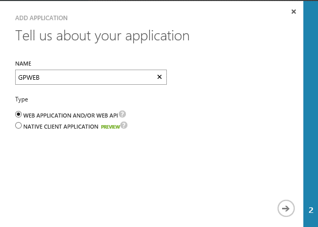
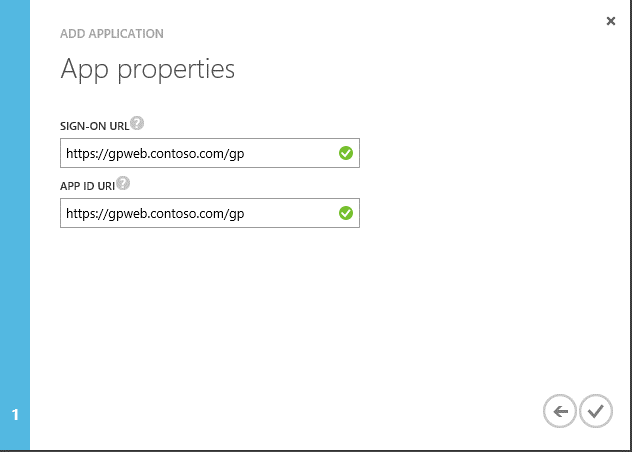
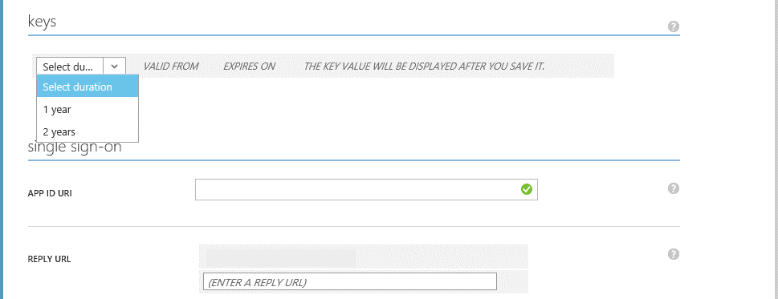
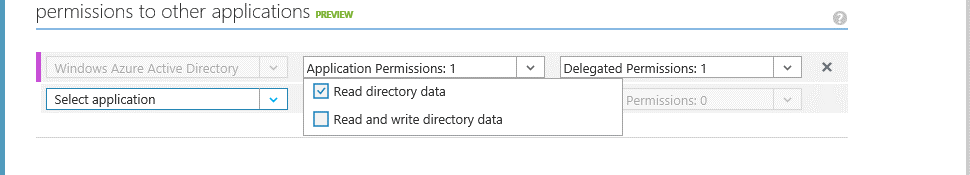
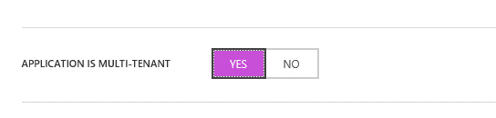

# Register application for organizational accounts

To set up the Dynamics GP web components for user access using Organizational Accounts, you must register the application in your Microsoft Azure Active Directory. This information is divided into the following sections:

- [Add application](#add-application)  

- [Configure for sign on](#configure-for-sign-on)  

- [Configure for multiple tenants](#configure-for-multiple-tenants)  

## Add application

For an application to use Azure AD for sign in and authorization you must first register it with Azure AD by providing information about that application.

To successfully register the application with Azure AD, you will need to know the URL that you will be using when you deploy the Dynamics GP web components. A typical URL to access the Dynamics GP web client looks similar to the following:

https://gpuaweb.contoso.com/GP

Use the following steps to register your Dynamics GP web components installation with Azure AD.

1. Sign on to the Azure Management Portal.

2. Click on the Active Directory icon on the left menu, and then click on the directory you want to user for the application.

3. On the top menu, click Applications. If no apps have been added to your directory, this page will only show the Add an App link. Click on the link, or alternatively you can click on the Add button on the command bar.

4. On the What do you want to do page, click on the link to Add an application my organization is developing.

###

5. On the Tell us about your application page, you must specify a name for your application as well as indicate the type of application you are registering with Azure AD. You will choose the web application and/or web API radio button.

  

When finished, click the arrow icon on the bottom-right corner of the page.

6. On the App properties page, provide the Sign-on URL and App ID URI for your web components. These can be the same value or different values. The APP ID URI must be a unique URI in Azure. Click the checkbox in the bottom-right corner of the page to add the application.

  

7. Your Application has been added and you will be taken to the Quick Start page for your application. After your application has been added, you can begin updating your application to enable users to sign in, access web APIs in other applications, or configure a multi-tenant application (which allows other organizations to access your application).

## Configure for sign on

Once the application has been added to Azure Active Directory, you will need to configure the application to support sign on to Dynamics GP. You will need to capture the configuration information for use when deploying the Dynamics GP web components.

Use the following steps in order to configure the application for sign on.

1. On your application’s configuration properties page, select the drop-down in the keys section in order to generate a key. You can select to create a key that is good for either one or two years. The key will be generated when you select to save the application configuration changes.

  

2. In the permissions to other application section, select the Read directory data checkbox for the Application Permissions drop-down for the Microsoft Azure Active Directory row. This allows Dynamics GP to look up user accounts in the Azure Active Directory when setting up GP users.

  

3. Select the Save button at the bottom of the page to save your changes.

4. When the application configuration changes have been saved, the key will be displayed. It is important that you copy and store this key since you will not be able to retrieve the key after leaving the page.

## Configure for multiple tenants

If you want to allow users from multiple Azure Active Directory tenants to access a multitenant web components deployment, you will configure the application as multitenant. A multitenant application will need to be provisioned in each tenant's directory, which requires user or administrator consent to register them in their directory.

In order to configure the application as multitenant, the domain name in the APP ID URI must be from a verified domain within your organization's directory. Use these steps to add the domain if you haven't already.

Use the following steps to configure the application as mulitenant.

1. On your application’s configuration properties page, select Yes to indicate that the application is mulitenant.

  

2. Select Save to save your changes.

For an administrator to enable their organization's users to use the application, the administrator will need to sign up for the application using a special URL to your Dynamics GP web client deployment. A typical sign up URL looks similar to the following:

https://gpuaweb.contoso.com/GP/tenant

The administrator will select the sign-up button, which will prompt them for their Azure Active Directory credentials if they are not already signed in. Once the administrator has signed up, the application has been registered in their Azure Active Directory and users from that directory can be assigned to GP users.

  
