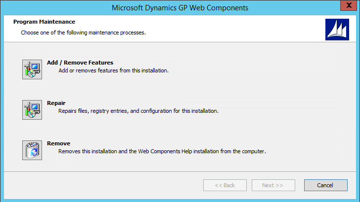
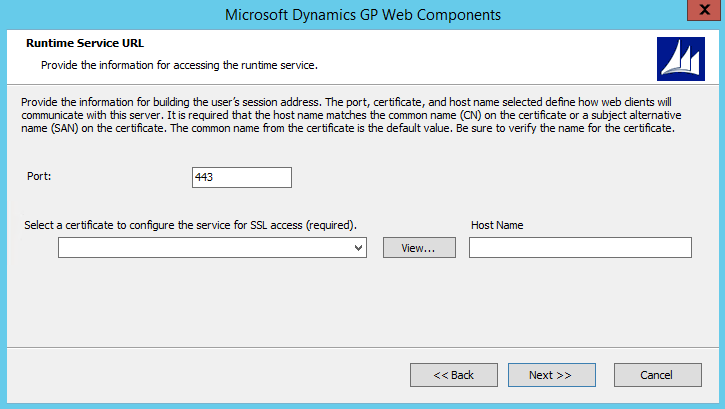

# Repairing the web client

If the Dynamics GP web client installation becomes damaged, the repair operations available may help resolve the issues. Information about repairing is divided into the following sections:

- [Common repair scenarios](#common-repair-scenarios)  

- [Performing a repair](#performing-a-repair)  

## Common repair scenarios

When using the Dynamics GP web client, there are some common scenarios that can be fixed through using a repair operation.

### Corrupted configuration

The Dynamics GP web client has numerous configurable components. If something has corrupted the configuration for one of these components, the repair action can return the component to its originally installed condition.

### Expired security certificates

The security certificates that are used in the web client installation have a finite lifespan. When a security certificate expires, it will no longer function properly in the web client installation. The security certificate must be replaced. After the new security certificate is installed into the certificate store on the machine, you can select the new certificate during the web client repair process.

### Changed user credentials

If the credentials (user name and/or password) have changed for one of the user accounts that is used in the web client installation, the web client will not work correctly. For instance, one of the services for the web client may not start. You can supply the updated credentials as part of the web client repair process.

## Performing a repair

To repair the Dynamics GP web client installation, complete the following steps:

1. Log in to the machine where the repair operation is to be performed.

2. Open the Programs and Features control panel.

3. From the list, select Dynamics GP Web Components. Click **Change**.

4. In Program Maintenance, click **Repair**.

  

5. The components to be configured during the repair process will depend upon which components are installed on the machine where the repair is being performed. Supply the required values for each component that will be repaired. For example, if you were replacing an expired security certificate, you would choose the new certificate during the repair process.6. After all of the components have been configured, click **Next** to start the repair actions. The repair steps will be performed.

  

6. After all of the components have been configured, click **Next** to start the repair actions. The repair steps will be performed.

7. After the repair is complete, click **Exit**. The Web Client Configuration Wizard will start.

8. At the Welcome screen, click **Next**.

9. If required, specify the type of authentication you want to use to connect to the SQL Server where the database for the Web Management Console is being stored. Click **Next** to continue.

10. If required, specify the type of authentication you want to use to connect to the SQL Server where the database for the Session Central service is being stored. Click Next to continue.

11. Review the status information for the databases. Click **Next** to continue.

12. After the repair actions are complete, click **Exit**.
