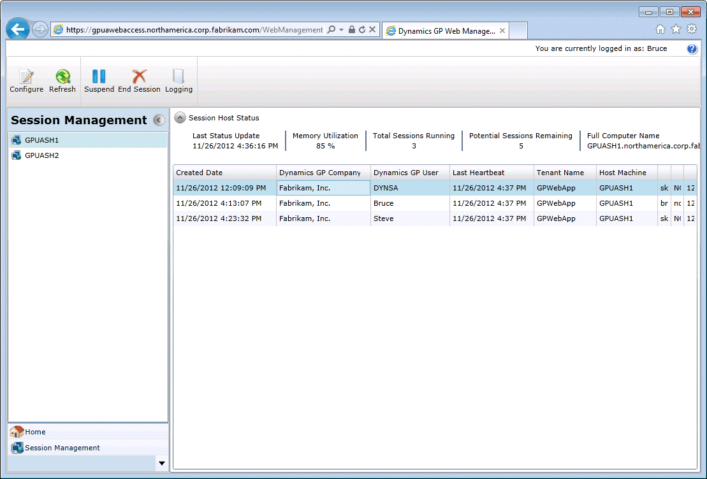

# Scale out installation

This chapter contains the procedures you need to follow to install and verify the Dynamics GP web components in the scale out configuration.

## Install the web server

Use the following procedure to install components on the web server machine.

1. From the Dynamics GP installation media, double-click the **Setup.exe** file to open the Dynamics GP installation window.

2. Click Web Components and then click **Install**.

3. In the License Agreement window, read the terms and conditions. Select **I accept the terms in the License Agreement**. Click **Next**.

4. Click **Custom**.

      

5. Select the features that you want to install. On the web server machine, you will typically install the Web Server, Session Central, Web Site, and the Web Management Console.

    The Web Management Console and the management snap-ins, SBA Session Manager, Tenant Manager and Web Client Session Manager, related to the web components you are installing. The GP Service feature for Service Based Architecture.

      

    If you are using the Tenant Service, you should mark the Tenant Manager snap- in as well. Use the default location for the installed components or choose a different location.

    Click **Next** to continue.

6. Specify the SQL Server that will manage the Web Components database. You must supply credentials that allow you to connect to the SQL Server and create the database.

      

    If the user installing the Dynamics GP web components has sufficient privileges, you can use Windows Trusted Authentication. Otherwise, you should use SQL Authentication and supply a SQL Login ID and Password for a SQL user account with sufficient privileges.

    Click **Next** to continue.

7. Select the supported Authentication Type.

      

    Specify if you will allow users to authenticate to the Dynamics GP web client and service based architecture using their Windows Account, Organizational Account or Mixed Mode. Since a single Dynamics GP system database can be set up for either Windows or Organizational Accounts, select Mixed Mode only if you are using a multitenant configuration with some tenants using Windows and some tenants using Organizational Accounts.

    If you have selected Organizational Account or Mixed Mode, provide the Organizational Account settings for the Azure Application you registered in Chapter 6 Register Azure Application for Organizational Accounts. The information you provide will be validated.

    Click **Next** to continue.

      

8. Supply the name of the Windows account configured as the "Log On As" account for the SQL Server service hosting the Dynamics GP databases. The dialog is only displayed when selecting Organizational Account or Mixed Mode for the authentication type.

      

    Provide a Windows security group for a multitenant deployment with different Windows accounts.

    Click **Next** to continue.

9. Supply the names of the Windows security groups that specify which users can access the Dynamics GP web client and which users can access the Web Management Console.

    For machine groups, the name must be prefixed by the machine name. For domain groups, the name must be prefixed by the domain name.

      

    Click **Next** to continue.

10. Indicate whether you are using a multitenant configuration. If you are installing the web client for a stand-alone instance of Dynamics GP, simply click Next.

    Refer to the Tenant Installation and Administration Guide for complete details about deploying Dynamics GP web components in a multitenant configuration.

11. Supply the information about the Dynamics GP installation if this is not a multitenant configuration. This information is used to start a Dynamics GP runtime process and creates a connection to the Dynamics GP databases.

      

    Specify the SQL Login and password for the Web Client SQL Server login that you created for the Dynamics GP system database. You created this user when you ran Dynamics GP Utilities during the installation of Dynamics GP. You must specify the GP instance name to use service based architecture. If you only have a single installation of Dynamics GP on your machine, leave the DEFAULT instance name. If you have a named instance, provide the instance name you provided during the installation. You must also specify the locations of the components for the Dynamics GP installation. If you are not using the default locations for the Dynamics GP components, use the Browse buttons to select the location of each component.

    Click **Next** to continue. You will be prompted to re-enter the password for the SQL login that you specified. Enter the password and click **OK**.

12. Specify the Windows account that Dynamics GP processes will run as for users that log in using their Organizational Account. This dialog will only be displayed if the selected authentication type was Organizational Account or Mixed Mode for a single tenant deployment.

    Click **Next** to continue.

13. Configure the Session Central Service.

      

    Specify the Port (the default is 48650). Optionally, you can specify the security certificate to use. You can use the same certificate that you are using for the Dynamics GP web client site as long as the security certificate's common name is the address the Session Host machines can use to communicate with the 10 web server machine.

    Supply the credentials for the user account that will be running the Session Central Service.

    Click Next to continue.

14. Select the web site that will host the Dynamics GP web client. This site must have been configured to use secure sockets layer (SSL).

      

    Specify the user account that will run the application pool for the Dynamics GP web client.

    Decide whether the same web site will be used to host the Web Management Console. If you do not mark the option to use the same site, you will be prompted to select the web site and provide credentials to run the application pool for the site.

    Click **Next** to continue.

15. Specify the web server farm configuration.

    If you are installing the web site onto only a single web server, simply click **Next** to continue.

    If you are installing the web client site on multiple web servers in a load balanced configuration, choose Deploy on multiple web servers. Specify the SQL Server that will manage the Web Client Session State database. You must supply credentials that allow you to connect to the SQL Server and create the database.

    If the user installing the Dynamics GP web client has sufficient privileges, you can use Windows Trusted Authentication. Otherwise, you should use SQL Authentication and supply a SQL Login ID and Password for a SQL user account with sufficient privileges.

    Click **Next** to continue.

16. Configure the GP Service.

      

    Specify the Port (the default is 443).

    Specify the security certificate to use. This is required for the GP service. You can use the same certificate that you are using for the Dynamics GP web client site.

    Verify the host name. The host name must match the common name (CN) or the subject alternative name (SAN) on the security certificate. If you are using a wild card certificate, replace the \* in the host name with the address that the client machines will use to access this machine.

    Click **Next** to continue.

17. Review the installation settings and then click Install.

18. Click **Exit**. The Web Components Configuration Wizard will start.

19. At the Welcome screen, click **Next**.

20. Specify the type of authentication you want to use to connect to the SQL Server where the database for the Web Components will be created. Click **Next** to continue.

21. If necessary, verify that the databases will be created. Click **Next** to continue.

22. Click **Exit**.

23. The Dynamics GP Web Client Help installer will be started. Click **Install** to complete the help installation process.

24. Click **Finish** to close the installer.

## Install the host machines

It is assumed that you have installed a Dynamics GP desktop client onto the session host machine, and that the desktop client is able to log in to Dynamics GP. The following prerequisites must have been completed:

- The web client runtime components for the Dynamics GP installation must also have been installed on the session host machine to use the web client. Refer to [Web client runtime components](/dynamics-gp/web-components/installation-overview#dynamics-gp-web-client-runtime) for more information.  

- The service based architecture components for the Dynamics GP installation must also have been installed on the session host machine to use service based architecture.

- It is also assumed that you have installed the security certificate on each session host machine as described in the **Installing a security certificate on a server**.

Use the following procedure to install components on each session host machine. You will repeat this process for each session host machine that you add to the web components deployment.

1. From the Dynamics GP installation media, double-click the Setup.exe file to open the Dynamics GP installation window.

2. Click the Web Components and then click Install.

3. In the License Agreement window, read the terms and conditions. Select I accept the terms in the License Agreement. Click Next.

4. Click Custom.

      

5. Select the Session Server feature if installing the web client. Select the Dex Service Control feature if installing service based architecture.

      

    Specify the location where you want to install the web component files.

    > [!WARNING]
    > If you don't install to the default location, pay attention to the path length you specify for the install location. If the path length exceeds 100 characters, you may get application errors, such as not being able to re-open forms in the web client.  

    Click **Next** to continue.

6. Specify the SQL Server that is managing the Web Components database. You must supply credentials that allow you to connect to the SQL Server and access this database.

      

    If the user installing the Dynamics GP web components has sufficient privileges, you can use Windows Trusted Authentication. Otherwise, you should use SQL Authentication and supply a SQL Login ID and Password for a SQL user account with sufficient privileges.

    Click **Next** to continue.

7. Supply the name of the Windows security group that specifies which users can access the Dynamics GP web client. For machine groups, the name must be prefixed by the machine name. For domain groups, the name must be prefixed by the domain name.

      

    Click **Next** to continue.

8. Indicate whether you are using a multitenant configuration. If you are installing the web client for a stand-alone instance of Dynamics GP, simply click Next.

    If you are installing the Dynamics GP web client for a multitenant configuration, choose Deploy for multiple tenants. Supply the URLs for the Tenant Discovery Service and the Tenant Management Service. Click Next.

    Refer to the Tenant Installation and Administration Guide for complete details about deploying Dynamics GP web components in a multitenant configuration.

9. Configure the Session Service.

      

    Specify the Port (the default is 48651). Optionally, you can specify the security certificate that you want to use. You can use the same certificate that you installed onto the server to use for the runtime service as long as the security certificate's common name is the address the Web Server machines can use to communicate with the session host machine.

    Supply the credentials for the user account that will be running the Session Service.

    Click **Next** to continue.

10. Configure the Runtime Service URL.

      

    Specify the Port (the default is 443).

    Specify the security certificate to use. This is required for the runtime service. You can use the certificate that you installed on the session host machine.

    Verify the host name. The host name must match the common name (CN) or the subject alternative name (SAN) on the security certificate. . If you are using a wild card certificate, replace the \* in the host name with the address that the client machines will use to access this machine.

    Click **Next** to continue.

11. Configure the Dex Service Control.

      

    Specify the Port (the default is 48655). Optionally, you can specify the security certificate that you want to use. You can use the same certificate that you installed onto the server to use for the runtime service as long as the security certificate's common name is the address the Web Server machines can use to communicate with the session host machine.

    Click **Next** to continue.

12. Review the installation settings and then click **Install**.

13. Click **Exit**. The Web Components Configuration Wizard will start.

14. At the Welcome screen, click **Next**.

15. Specify the type of authentication you want to use to connect to the SQL Server where the database for the Web Components is located. Click **Next** to continue.

16. Review the configuration actions that will be performed. Click **Next** to continue.

17. Click **Exit**.

18. Restart the Session Central Service for the Dynamics GP web client installation. You must do this on the machine where you installed the Session Central Service, typically the machine that is hosting the web site. This step is necessary to allow the Session Central Service to establish communication with the session host machine.

## Verify the web client installation.

After the components for the scale out web components installation have been installed, give the system a few minutes to get synchronized. The Session Central Service will be updated with information that is provided by the Session Service running on each session host machine. The GP Service will be updated with information that is provided by the Dex Service Control running on each session host machine.

## Web Management Console

You can use the Web Management Console to verify that the session host machines are accessible.

1. In the Web Management Console, click the Session Management snap-in to verify the web client. You should see the session host machines listed in the pane on the left side of the console.

      

2. In the Web Management Console, click the Dexterity Management snap-in to verify the web client. You should see the session host machines listed in the pane on the left side of the console.

      

## Creating a session

After you have verified that the session host machines are working, verify that you can access the web client.

1. Open Internet Explorer.

2. Enter the URL of the Dynamics GP web client site. The default address of the site is:

    `https://ServerName:PortNumber/GP`

    **ServerName** is the fully-qualified domain name (FQDN) for the server that is hosting the web site. This name must match the name you used when you requested the security certificate that you applied to the site when setting up SSL.

    **PortNumber** is the port for the web site that you are using. If you chose to install on the default web site (port 443) then you do not need to supply the port number.

    A typical URL to access the Dynamics GP web client looks similar to the following:

    `https://gpuaweb.contoso.com/GP`

3. After entering the URL, you will be directed to the logon page. This is the first page that will be displayed to users who are accessing the Dynamics GP web client using a Windows Account. A deployment where users will use an Organizational Account for access will be redirected to the Azure sign in page.

      

4. Enter your user credentials. These are domain user credentials or machine user credentials for a user that is part of the security group you created to control access to the Dynamics GP web client. This security group is described in Chapter 5, “Security groups and user accounts.” These are not your Dynamics GP login name and password. Enter your Organization Account credentials, if prompted, on the Azure sign-in page.

    Click **Sign In**.

5. A session will be created. The window you see first will depend on settings for your Dynamics GP user. Log in with your Dynamics GP login name and password.

    - If your Dynamics GP user ID has Directory Account information, the Dynamics GP login window will be displayed.

          

        Log in with your Dynamics GP login name and password.

    - If your Dynamics GP user ID has Directory Account information, the Web Client SQL User will be used to access Dynamics GP data.

        **One company**: If you have access to only one company, that company will automatically be used. The first page you see in Dynamics GP will be

        **Multiple companies**: If you have access to multiple companies, the Company Login window will be displayed, allowing you to select the company to use.

  

## Verify the service based architecture installation

After the Dynamics GP service based architecture installation is complete, verify that you can access service based architecture.

These verification steps are for Windows and Mixed Mode authentication types only. An Organizational Account only deployment will require an application or tool that will obtain an Organizational Account user token from Azure Active Directory.

1. Open a browser.

2. Enter the URL to the discovery service. The default address is:

    `https://ServerName:PortNumber/GPService/Tenants(DefaultTenant)/help`

    **ServerName**   is the fully-qualified domain name (FQDN) for the server that is hosting the web components. This name must match the name you used when you requested the security certificate that you applied to the site when setting up SSL.

    **PortNumber**   is the port for the web site that you are using. If you chose to install on the default port (port 443) then you do not need to supply the port number.

    **DefaultTenant**   is the tenant name in a single tenant deployment.

    A typical URL to access the Dynamics GP service based architecture looks similar to the following:

    `https://gpuaweb.contoso.com/GPService/Tenants(DefaultTenant)/help`

3. After entering the URL, you may be prompted for your Windows credentials. Enter your user credentials. These are domain user credentials or machine user credentials that has been assigned to your GP user ID.
