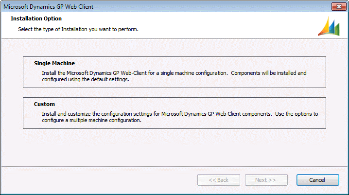
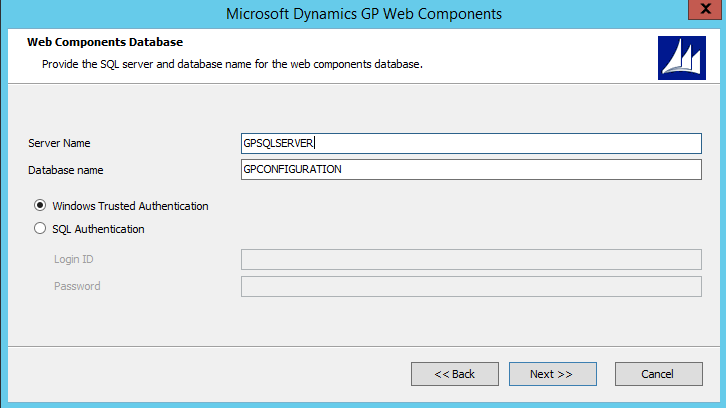
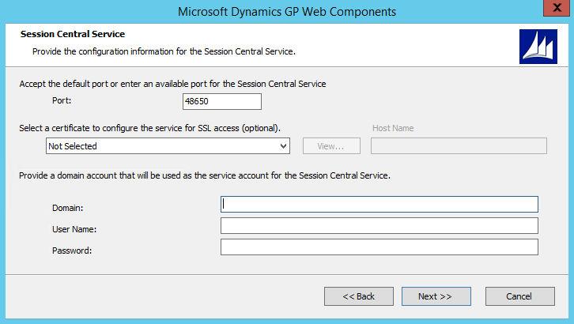
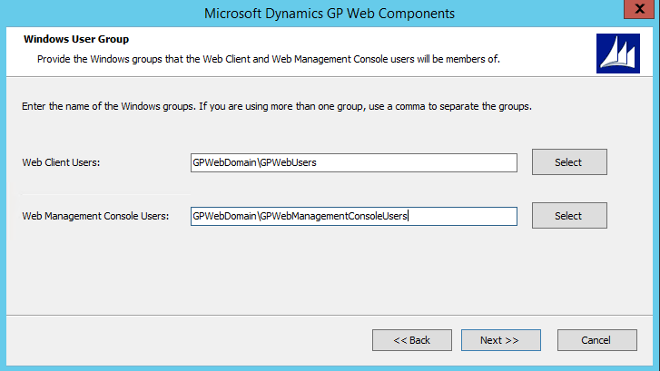
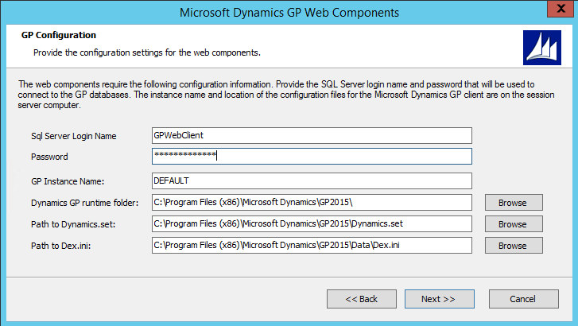
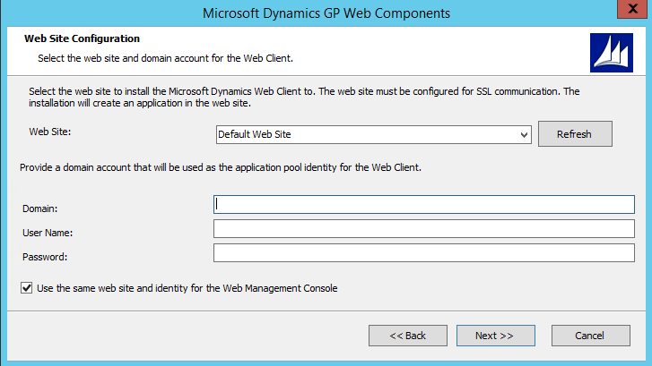
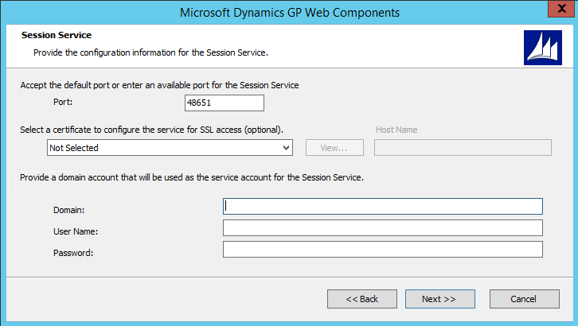
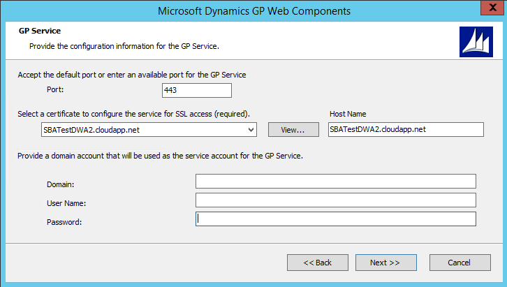

# Single machine installation

This chapter contains the procedures you need to follow to install and verify the Dynamics GP web components on a single machine installation. Using the single machine installation option performs a simple installation of all components using default settings for a single tenant configuration and Windows authentication. If you want to only install specific components, a multitenant configuration or use Organizational Accounts, use the Custom installation option to perform the installation.

The following sections are included:

-   [Install the web components](#install-the-web-components)  

-   [Verify the web client installation](#verify-the-web-client-installation)  

-   [Verify the Service Based Architecture installation](#verify-the-service-based-architecture-installation)  

## Install the web components

Use the following steps to install the Dynamics GP web components on a single machine.

1. From the Dynamics GP installation media, double-click the **Setup.exe** file to open the Dynamics GP installation window.

2. Click **Web** components and then click **Install**.

3. In the License Agreement window, read the terms and conditions. Select **I accept the terms in the License Agreement**. Click **Next**.

4. Click **Single Machine** to perform a single machine installation.

  

5. Specify the SQL Server that will manage the Session Central database. You must supply credentials that allow you to connect to the SQL Server and create the database.

  

If the user installing the Dynamics GP web client has sufficient privileges, you can use Windows Trusted Authentication. Otherwise, you should use SQL Authentication and supply a SQL Login ID and Password for a SQL user account with sufficient privileges.

Click **Next** to continue.

6. Configure the Session Central Service.

  

Specify the Port (the default is 48650). Optionally, you can specify the security certificate that you want to use, however given all communication to the Session Central Service is initiated from other components on this server makes it unnecessary.

Supply the credentials for the user account that will be running the Session Central Service.

Click **Next** to continue.

7. Supply the names of the Windows security groups that specify which users can access the Dynamics GP web client and which users can access the Web Management Console.

For machine groups, the name must be prefixed by the machine name. For domain groups, the name must be prefixed by the domain name.

  

Click **Next** to continue.

8. Supply the information about the Dynamics GP installation. This information is used to start a Dynamics GP runtime process and creates a connection to the Dynamics GP databases.

  

Specify the SQL Login and password for the Web Client SQL Server login that you created for the Dynamics GP system database. You created this user when you ran Dynamics GP Utilities during the installation of Dynamics GP. You must specify the GP instance name to use service based architecture. If you only have a single installation of Dynamics GP on your machine, leave the DEFAULT instance name. If you have a named instance, provide the instance name you provided during the installation. You must also specify the locations of the components for the Dynamics GP installation. If you are not using the default locations for the Dynamics GP components, use the Browse buttons to select the location of each component.

Click **Next** to continue. You will be prompted to re-enter the password for the SQL login that you specified. Enter the password and click **OK**.

9. Select the web site that will host the Dynamics GP web client. This site must have been configured to use secure sockets layer (SSL).

  

Specify the user account that will run the application pool for the Dynamics GP web client.

Decide whether the same web site will be used to host the Web Management Console. If you do not mark the option to use the same site, you will be prompted to select the web site and provide credentials to run the application pool for the site.

Click **Next** to continue.

10. Configure the Session Service.

  

Specify the Port (the default is 48651). Optionally, you can specify the security certificate that you want to use, however given all communication to the Session Central Service is initiated from other components on this server makes it unnecessary.

Supply the credentials for the user account that will be running the Session Service.

Click **Next** to continue.

11. Configure the Runtime Service URL.

  

Specify the Port (the default is 443).

Specify the security certificate to use. This is required for the runtime service. You can use the same certificate that you are using for the Dynamics GP web client site.

Verify the host name. The host name must match the common name (CN) or the subject alternative name (SAN) on the security certificate. If you are using a wild card certificate, replace the \* on the host name with the address that the client machines will use to access this machine.

Click **Next** to continue.

12. Configure the GP Service.

  

Specify the Port (the default is 443).

Specify the security certificate to use. This is required for the GP service. You can use the same certificate that you are using for the Dynamics GP web client site.

Verify the host name. The host name must match the common name (CN) or the subject alternative name (SAN) on the security certificate. If you are using a wild card certificate, replace the \* in the host name with the address that the client machines will use to access this machine.

Click **Next** to continue.

13. Review the installation settings and then click **Install**.

14. Click Exit**.** The Web Client Configuration Wizard will start.

15. At the Welcome screen, click **Next**.

16. Specify the type of authentication to use to connect the to the SQL Server where the database for the Web Components will be created. Click **Next** to continue.

17. If necessary, verify that the databases will be created. Click Next to continue.

18. Click **Exit**.

19. The Dynamics GP Web Client Help installer will be started. Click Install to complete the help installation process.

20. Click **Finish** to close the installer.

## Verify the web client installation

After the Dynamics GP web client installation is complete, verify that you can access the web client.

To verify the web client installation:

1. Open Internet Explorer.

2. Enter the URL of the Dynamics GP web client site. The default address of the site is:

https://ServerName:PortNumber/GP

**ServerName***   *is the fully-qualified domain name (FQDN) for the server that is hosting the web site. This name must match the name you used when you requested the security certificate that you applied to the site when setting up SSL.

**PortNumber**   is the port for the web site that you are using. If you chose to install on the default web site (port 443) then you do not need to supply the port number.

A typical URL to access the Dynamics GP web client looks similar to the following:

https://gpuaweb.contoso.com/GP

3. After entering the URL, you will be directed to the logon page. This is the first page that will be displayed to users who are accessing the Dynamics GP web client.

  

If you are using a self-signed security certificate and are accessing the Dynamics GP web client from another computer, you will see a certificate error. To resolve this error, you must import the security certificate into the certificate store on the machine that is accessing the web client.

4. Enter your user credentials. These are domain user credentials or machine user credentials for a user that is part of the security group you created to control access to the Dynamics GP web client. This security group is described in Chapter 5, “Security groups and user accounts”. These are not your Dynamics GP login name and password.

Click **Sign In**.

5. A session will be created. The window you see first will depend on settings for your Dynamics GP user.

If your Dynamics GP user ID has only SQL Server Account information, the Dynamics GP login window will be displayed.

  

Log in with your Dynamics GP login name and password.

If your Dynamics GP user ID has Windows Account information, the Web Client SQL User will be used to access Dynamics GP data.

**One company   **If you have access to only one company, that company will automatically be used. The first page you see in Dynamics GP will be the Home page.

**Multiple companies**   If you have access to multiple companies, the Company Login window will be displayed, allowing you to select the company to use.

  

## Verify the Service Based Architecture installation

After the Dynamics GP service based architecture installation is complete, verify that you can access service based architecture.

To verify the Service Based Architecture installation:

1. Open a web browser.

2. Enter the URL to the discovery service. The default address is:

https://ServerName:PortNumber/GPService/Tenants(DefaultTenant)/help

ServerName is the fully-qualified domain name (FQDN) for the server that is hosting the web components. This name must match the name you used when you requested the security certificate that you applied to the site when setting up SSL.

PortNumber is the port for the web site that you are using. If you chose to install on the default port (port 443) then you do not need to supply the port number.

DefaultTenant is the tenant name in a single tenant deployment.

A typical URL to access the Dynamics GP service based architecture looks similar to the following:

https://gpuaweb.contoso.com/GPService/Tenants(DefaultTenant)/help

3. After entering the URL, you may be prompted for your Windows credentials. Enter your user credentials. These are domain user credentials or machine user credentials that has been assigned to your GP user ID.

4. You should see results in your browser that look like the following image.

  
