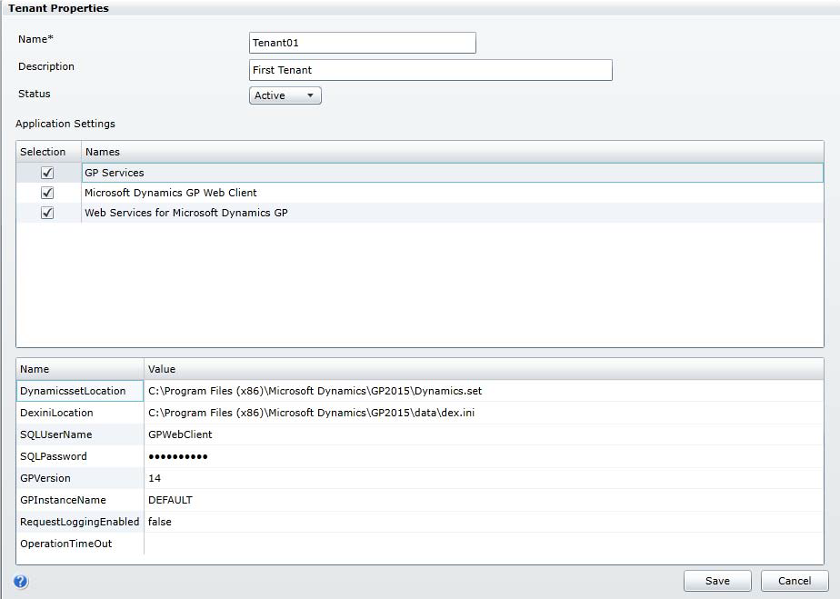

# Multitenant Applications

This portion of the documentation explains the configuration and maintenance options for Microsoft Dynamics GP multitenant applications. The following information is discussed:

- Chapter 12, “Configuring the Web Client,” describes how you configure the Microsoft Dynamics GP Web Client application for a tenant.
- Chapter 13, “Configuring Web Services,” describes how you specify web service and tenant configuration information. The Web Services for Microsoft Dynamics GP Configuration Wizard uses this configuration information to add web services access to the tenant.

## Chapter 12: Configuring the Web Client
This portion of the documentation describes how you use the Tenant Manager to
make the Dynamics GP Web Client available for use with tenants. The
documentation also describes how you provide information that is used to
configure the web client for a specified tenant.

The following items are discussed:
- Before you start
- To add the Web Client to the list of applications
- To configure the Web Client application for a tenant
- What to do next

### Before you start
To add and configure the Dynamics GP Web Client for a tenant, you have to first
complete the following tasks:
- Install Tenant Services
- Install Microsoft Dynamics GP for the tenant
- Install the Web Management Console and the Tenant Manager snap-in

In addition, you should have already added the tenant. To add a tenant, you use the
Tenant Manager snap-in. For information about how to add a tenant, see To add a
tenant on page 64.

To add the Dynamics GP Web Client to the tenant, you use the Tenant Manager
snap-in to supply important configuration information. The following table shows
the information you will need to gather:

File | Description
-|-
Dynamics.exe | The Dynamics executable file from the Microsoft Dynamics GP instance for the tenant. You need to specify the path to the folder where the file was installed. For example: c:\Program Files (x86)\Microsoft Dynamics\GP2015\
Dynamics.set | The Dynamics set file from the Microsoft Dynamics GP instance for the tenant. You need to specify the file and its location. For example: c:\Program Files (x86)\Microsoft Dynamics\GP2015\Dynamics.set
Dex.ini | The Dex initialization file from the Microsoft Dynamics GP instance for the tenant. You need to specify the file and its location. For example: c:\Program Files (x86)\Microsoft Dynamics\GP2015\Data\Dex.ini
SQLUserName | The name for the SQL login that was specified to be used for the web client when the web client runtime was installed for the Microsoft Dynamics GP instance.
SQLPassword | The password for the SQL login being used for the web client for the Microsoft Dynamics GP instance.
RuntimeProcessUserName | The name of the Windows account that the runtime process will run as when a user logs in using an Organizational Account. You only need to provide a value if you are using Organizational Accounts.
RuntimeProcessPassword | The password for the Windows account used to run the runtime process.

### To add the Web Client to the list of applications
Before you can begin using the web client with tenants, you have to add Web Client
to the list of multitenant applications in the Tenant Manager snap-in. If you
previously added the default applications (Microsoft Dynamics GP Web Client and
Web Services for Microsoft Dynamics GP) to the list of applications, you do not
need to repeat the steps in this section.

The following steps describe how to add the Microsoft Dynamics GP Web Client to
the list of applications in the Tenant Manager snap-in:

1. Verify your login is a Service Admin

    Verify that your login has the Service Admin role for Tenant Services. You must
    be a Service Admin to add the web client to the list of applications. The Service
    Admins are identified in the Users section of the Tenant Manager snap-in.

    In addition, your login must have authorization to use the Microsoft Dynamics
    GP Web Management Console. Your login must be a member of the security
    group you specified during the install of the Tenant Manager.

2. Start the Web Management Console.

    In a browser, open the Microsoft Dynamics GP Web Management Console. To
    start the Web Management Console, you use a URL similar to the following:

        https://ServerName:PortNumber/WebManagementConsole/

    Replace ServerName with the name of the server that is running the Web
    Management Console. If the web site isn’t using port 80, supply the PortNumber
    as well.

3. Click Tenant Manager.

    To open the snap-in in the Web Management Console, click Tenant Manager in
    the navigation pane.

4. Click Applications in the navigation pane.

    The Tenant Manager shows the multitenant applications that are available.

5. Click Add.

    Click the Add button in the ribbon of the Web Management Console. The Add
    Application window opens.

6. Click Add default applications.

    This adds GP Services, Microsoft Dynamics GP Web Client and Web Services
    for Microsoft Dynamics GP as multitenant applications.

7. Click Save.

    To verify the changes, click Applications in the Tenant Manager navigation
    pane. You should see GP Services, Microsoft Dynamics GP Web Client and Web
    Services for Microsoft Dynamics GP in the list.

### To configure the Web Client application for a tenant
You use the Tenant Manager snap-in to configure the web client application for a
tenant. If you do not provide the required configuration information, the web client
will not run.

The following steps describe how to configure the web client for a tenant:

1. Verify your login is a Service Admin

    Verify you are using a login that has the Service Admin role in tenant services.
    If you are not a Service Admin, you will not be able to access the Tenant
    Properties window. The Service Admins are identified in the Users section of
    the Tenant Manager snap-in.

    In addition, your login must have authorization to use the Microsoft Dynamics
    GP Web Management Console. Your login must be a member of the security
    group you specified during the install of the Tenant Manager.

2. Start the Web Management Console.

    In a browser, open the Dynamics GP Web Management Console. To start the
    Web Management Console, you use a URL similar to the following:

        https://ServerName:PortNumber/WebManagementConsole/

    Replace ServerName with the name of the server that is running the Web
    Management Console. If the web site isn’t using port 80, supply the PortNumber
    as well.

3. Click Tenant Manager.

    Click Tenant Manager at the bottom of the navigation pane. The snap-in opens
    in the Web Management Console.

4. Click Tenants in the navigation pane.

    The Tenant Manager shows the list of available tenants.

5. Click the tenant and then click Edit.

    To add a multitenant application to a tenant, you first click the tenant and then
    click Edit in the ribbon of the Web Management Console. The Tenant Properties
    window opens.

6. Select Microsoft Dynamics GP Web Client

    In the Application Settings section, click the checkbox in the Selection column
    for the Microsoft Dynamics GP Web Client.

7. Specify the value for each web client application property.

    When you click the Microsoft Dynamics GP Web Client, the web client
    application properties appear as a list.

    You have to specify the value for each application property. The following table
    shows the properties and describes how to specify a value for each property:

    Property name | Description
    -|-
    DynamicsexeLocation | Specify the folder where you find the Dynamics.exe file of the Microsoft Dynamics GP instance that is associated with the tenant. For example: c:\Program Files (x86)\Microsoft Dynamics\GP2013\
    DynamicssetLocation | Specify the location of the Dynamics.set file of the Microsoft Dynamics GP that is associated with the tenant. For example: c:\Program Files (x86)\Microsoft Dynamics\GP2013\Dynamics.set 
    DexiniLocation | Specify the location of the Dex.ini file for the Microsoft Dynamics GP instance that is associated with the tenant. For example: c:\Program Files (x86)\Microsoft Dynamics\GP2013\Data\Dex.ini
    HeartbeatTimeout | The amount of time a Web Client session can be in a disconnected state before it is terminated. The default value of 0.00:00:0 means the session is never terminated. You can change the value to specify the length of time before the session terminates. The format is hours.minutes:seconds. For example, the following sets the value to 20 minutes: 00.20:00:00
    RuntimeLogEnabled | Specify whether to enable logging for the application. To enable logging, set the property value to true. The default value is: false
    CustomRuntimeSettings | Specify whether enable more detailed logging for the application. To enable logging, set one or more values to true. The default value is: ScriptLogEnabled=false|TimingLogEnabled=false|SqlLogEnabled=false
    SQLUserName | The name for the SQL login that was specified to be used for the web client when the web client runtime was installed for the Microsoft Dynamics GP instance.
    SQLPassword | The password for the SQL login being used for the web client for the Microsoft Dynamics GP instance.
    RuntimeProcessUserName | The name of the Windows account that the runtime process will run as when a user logs in using an Organizational Account. You only need to provide a value if you are using Organizational Accounts.
    RuntimeProcessPassword | The password for the Windows account used to run the runtime process.

8. Click Save.

    To save the application configuration information, click the Save button.

### What to do next
You can add the users that you want to access the Web Client as tenant users for the
tenant. 

## Chapter 13: Configuring Web Services
This portion of the documentation describes how you use the Tenant Manager to
make Web Services for Microsoft Dynamics GP available for use with tenants. The
documentation also describes how you provide information that is used to
configure web services for a specified tenant. You have to complete these steps
before you can run the Web Services for Microsoft Dynamics GP Configuration
Wizard.

The following items are discussed:
- Before you start
- To add Web Services to the list of applications
- To specify Web Services configuration information
- What to do next

### Before you start
Before you add and configure Dynamics GP Web Services for a tenant, you have to
first complete the following tasks:
- Install Tenant Services
- Install Microsoft Dynamics GP for the tenant
- Install the Web Management Console and the Tenant Manager snap-in
- Install Dynamics GP Web Services

In addition, you should have already added the tenant. To add a tenant, you use the
Tenant Manager snap-in. 

To add Web Services for Microsoft Dynamics GP to the tenant, you use the Tenant
Manager snap-in to supply important configuration information. The following
table shows the information you will need to gather:

Required information | Description
-|-
Dynamics GP SQL Server | Get the name of the SQL Server where you installed Microsoft Dynamics GP for the tenant.
Dynamics GP system database | Get the name of the Microsoft Dynamics GP system database for the tenant. You specified the database name during the install of Microsoft Dynamics GP. To find the name of the database, open Microsoft SQL Server Management Studio, connect to the SQL Server, and view the list of databases on the server.
Dynamics Security Administration service SQL Server | Get the name of the SQL Server where you want to add the security Administration database. You can use the same SQL Server you use for Dynamics GP or you can use another SQL Server.
URL for Dynamics GP Web Services | Get the name of the web server and the port number you use to connect to web services. For example, a typical install of web services might use the following URL: https://GPServer:48620/DynamicsGPWebServices/DynamicsGPService.asmx You will use GPServer and 48620 to configure the URL for the multitenant web services.
URL for the Dynamics Security Administration service | Get the name of the web server and the port number you use to connect to Microsoft Dynamics Security Administration service. For example, a typical install of the security administration service might use the following URL: https://GPWebService:48621/DynamicsAdminService.asmx You will use GPWebService and 48621 to configure the URL for the multitenant web services security.

### To add Web Services to the list of applications
Before you can begin using web services with tenants, you have to add Web
Services to the list of applications in the Tenant Manager snap-in. If you previously
added the default applications (Web Services for Microsoft Dynamics GP, GP
Services, and Microsoft Dynamics GP Web Client) to the list of applications, you do
not need to repeat the steps in this section.

The following steps describe how to add Web Services for Microsoft Dynamics GP
to the list of applications in the Tenant Manager snap-in:

1. Verify your login is a Service Admin

    Verify that your login has the Service Admin role for Tenant Services. You must
    be a Service Admin to add web services to the list of applications. The Service
    Admins are identified in the Users section of the Tenant Manager snap-in.
    In addition, your login must have authorization to use the Microsoft Dynamics
    GP Web Management Console. Your login must be a member of the security
    group you specified during the install of the Tenant Manager.

2. Start the Web Management Console.

    In a browser, open the Microsoft Dynamics GP Web Management Console. To
    start the Web Management Console, you use a URL similar to the following:

        https://ServerName:PortNumber/WebManagementConsole/

    Replace ServerName with the name of the server that is running the Web
    Management Console. If the web site isn’t using port 80, supply the PortNumber
    as well.

3. Click Tenant Manager.

    To open the snap-in in the Web Management Console, click Tenant Manager in
    the navigation pane.

4. Click Applications in the navigation pane.

    The Tenant Manager shows the multitenant applications that are available.

5. Click Add.

    Click the Add button in the ribbon of the Web Management Console. The Add
    Application window opens.

6. Click Add default applications.

    This adds GP Services, Microsoft Dynamics GP Web Client and Web Services
    for Microsoft Dynamics GP to the list of applications.

7. Click Save.

    To verify the changes, click Applications in the Tenant Manager navigation
    pane. You should see GP Services, Microsoft Dynamics GP Web Client and Web
    Services for Microsoft Dynamics GP in the list.

### To specify Web Services configuration information
You use the Tenant Manager snap-in to provide configuration information that
associates web services with a tenant. You have to complete these steps prior to
running the Web Services for Microsoft Dynamics GP Configuration Wizard. The
wizard uses this information to configure web services for the tenant. If you do not
provide all the configuration information, the wizard will not be able to finish.

The following steps describe how to add web services configuration information for
a tenant:

1. Verify your login is a Service Admin

    Verify your are using a login that has the Service Admin role in tenant services.
    If you are not a Service Admin, you will not be able to access the Tenant
    Properties window. The Service Admins are identified in the Users section of
    the Tenant Manager snap-in.

    In addition, your login must have authorization to use the Microsoft Dynamics
    GP Web Management Console. Your login must be a member of the security
    group you specified during the install of the Tenant Manager.

2. Start the Web Management Console.

    In a browser, open the Dynamics GP Web Management Console. To start the
    Web Management Console, you use a URL similar to the following:

        https://ServerName:PortNumber/WebManagementConsole/

    Replace ServerName with the name of the server that is running the Web
    Management Console. If the web site isn’t using port 80, supply the PortNumber
    as well.

3. Click Tenant Manager.

    Click Tenant Manager at the bottom of the navigation pane. The snap-in opens
    in the Web Management Console.

4. Click Tenants in the navigation pane.

    The Tenant Manager shows the list of available tenants.
5. Click the tenant and then click Edit.

    To add web services to a tenant, you first click the tenant and then click Edit in
    the ribbon of the Web Management Console. The Tenant Properties window
    opens.

6. Select Web Services for Microsoft Dynamics GP

    In the Application Settings section, click the checkbox in the Selection column
    for Web Services for Microsoft Dynamics GP.

7. Specify the value for each web services application property.

    When you click Web Services for Microsoft Dynamics GP, the web service application properties appear as a list. The following illustration shows the properties for Web Services for Microsoft Dynamics GP.

    

    You have to specify the value for each application property. The following table
    shows the properties and describes how to specify a value for each property.

Property name | Description
-|-
DynGPSQLServer | Specify the name of the SQL Server where you installed Microsoft Dynamics GP for the tenant.
DynGPSystemDB | Specify the name of the Microsoft Dynamics GP system database for the tenant. The database has to be on the SQL Server that you specified in the previous property.
DynGPWebServiceURL | Specify the URL for the Dynamics GP service. The URL uses the following format: https://machine_name:port/Dynamics/GPService Replace machine_name with the name of the server onto which you installed Web Services for Microsoft Dynamics GP. The default port value is 48620.For example if the machine running the Dynamics GP service was named GPServer, the URL would be: https://GPServer:48620/Dynamics/GPService If this port value does not work to access the service, you will need to contact your administrator to find what port the Dynamics GP service is running on.
SecAdminServiceURL | Specify the URL of the Microsoft Dynamics Security Administration service. The URL uses the following format: https://machine_name:port/ Replace machine_name with the name  of the server onto which you installed the Microsoft Dynamics Security Administration Service.  The default port value is 48621. For example if the machine running the Microsoft Dynamics Security Administration service was named GPWebService, the URL would be:  https://GPWebService:48621/ If this port value does not work to access the service, you will need to contact your administrator to find what port the Microsoft Dynamics Security Administration service is running on.
SecServiceDB | Specify the name of the Microsoft Dynamics Security Administration service database for the tenant. The database will be created when you run the Web Services for Microsoft Dynamics GP Configuration Wizard. To identify the tenant associated with the security Administration database, you should include the tenant ID in the database name. For example, the name of the security administration service database for the tenant named Tenant01 would be Tenant01_DynGPSecurity. 
SecServiceSQLServer | Specify the name of the SQL Server where want to add the database you specified in the previous property. The database can be on the same SQL Server you use for the Microsoft Dynamics GP or you can specify another SQL Server.

8. Click Save.

    The values for the application properties are saved.
    
### What to do next
Run the Web Services for Microsoft Dynamics GP Configuration Wizard, which can
be found on the server where you initially installed web services. You need to run
the wizard for each tenant that you configured to use web services. When you run
the wizard, you will be asked to specify the tenant. 

You can add the tenant users that you want to access web services for the tenant.

To enable a tenant user to access web services, you will also need to use the
Dynamics Security Console to add the user, specify a company, and assign a
security role.

## Chapter 14: Configuring GP Services
This portion of the documentation describes how you use the Tenant Manager to
make the Dynamics GP Service Based Architecture available for use with tenants.
The documentation also describes how you provide information that is used to
configure the web client for a specified tenant.

The following items are discussed:
- Before you start
- To add GP Services to the list of applications
- To configure the GP Services application for a tenant
- What to do next

### Before you start
To add and configure the Dynamics GP Service Based Architecture for a tenant, you
have to first complete the following tasks:

- Install Tenant Services
- Install Microsoft Dynamics GP for the tenant
- Install the Web Management Console and the Tenant Manager snap-in

In addition, you should have already added the tenant. To add a tenant, you use the
Tenant Manager snap-in. 

To add the Dynamics GP Service Based Architecture to the tenant, you use the
Tenant Manager snap-in to supply important configuration information. The
following table shows the information you will need to gather:

File | Description
-|-
Dynamics.set | The Dynamics set file from the Microsoft Dynamics GP instance for the tenant. You need to specify the file and its location. For example: c:\Program Files (x86)\Microsoft Dynamics\GP2015\Dynamics.set 
Dex.ini | The Dex initialization file from the Microsoft Dynamics GP instance for the tenant. You need to specify the file and its location. For example: c:\Program Files (x86)\Microsoft Dynamics\GP2015\Data\Dex.ini
SQLUserName | The name for the SQL login that was specified to be used for the web client when the web client runtime was installed for the Microsoft Dynamics GP instance.
SQLPassword | The password for the SQL login being used for the web client for the Microsoft Dynamics GP instance.
GPVersion | The major version from the Microsoft Dynamics GP instance for the tenant. The value for Microsoft Dynamics GP instances is 14.
GPInstanceName | The instance name from the Microsoft Dynamics GP instance for the tenant. The value will be DEFAULT if the Microsoft Dynamics GP instance was not a named instance.

### To add GP Services to the list of applications
Before you can begin using the service based architecture with tenants, you have to
add GP Services to the list of multitenant applications in the Tenant Manager snapin.
If you previously added the default applications (GP Services, Microsoft Dynamics GP Web Client and Web Services for Microsoft Dynamics GP) to the list of applications, you do not need to repeat the steps in this section.

The following steps describe how to add the Microsoft Dynamics GP Service Based
Architecture to the list of applications in the Tenant Manager snap-in:

1. Verify your login is a Service Admin
Verify that your login has the Service Admin role for Tenant Services. You must
be a Service Admin to add web client to the list of applications. The Service
Admins are identified in the Users section of the Tenant Manager snap-in.
In addition, your login must have authorization to use the Microsoft Dynamics
GP Web Management Console. Your login must be a member of the security
group you specified during the install of the Tenant Manager.
2. Start the Web Management Console.
In a browser, open the Microsoft Dynamics GP Web Management Console. To
start the Web Management Console, you use a URL similar to the following:
https://ServerName:PortNumber/WebManagementConsole/
Replace ServerName with the name of the server that is running the Web
Management Console. If the web site isn’t using port 80, supply the PortNumber
as well.
3. Click Tenant Manager.
To open the snap-in in the Web Management Console, click Tenant Manager in
the navigation pane.
4. Click Applications in the navigation pane.
The Tenant Manager shows the multitenant applications that are available.
5. Click Add.
Click the Add button in the ribbon of the Web Management Console. The Add
Application window opens.
6. Click Add default applications.
This adds GP Services, Microsoft Dynamics GP Web Client and Web Services
for Microsoft Dynamics GP to the list of applications.
7. Click Save.
To verify the changes, click Applications in the Tenant Manager navigation
pane. You should see GP Services, Microsoft Dynamics GP Web Client and Web
Services for Microsoft Dynamics GP in the list.

### To configure the GP Services application for a tenant
You use the Tenant Manager snap-in to configure the service based architecture
application for a tenant. If you do not provide the required configuration
information, the service based architecture will not run.
The following steps describe how to configure the service based architecture for a
tenant:
1. Verify your login is a Service Admin
Verify your are using a login that has the Service Admin role in tenant services.
If you are not a Service Admin, you will not be able to access the Tenant
Properties window. The Service Admins are identified in the Users section of
the Tenant Manager snap-in.
In addition, your login must have authorization to use the Microsoft Dynamics
GP Web Management Console. Your login must be a member of the security
group you specified during the install of the Tenant Manager.
2. Start the Web Management Console.
In a browser, open the Dynamics GP Web Management Console. To start the
Web Management Console, you use a URL similar to the following:
https://ServerName:PortNumber/WebManagementConsole/
Replace ServerName with the name of the server that is running the Web
Management Console. If the web site isn’t using port 80, supply the PortNumber
as well.
3. Click Tenant Manager.
Click Tenant Manager at the bottom of the navigation pane. The snap-in opens
in the Web Management Console.
4. Click Tenants in the navigation pane.
The Tenant Manager shows the list of available tenants.
5. Click the tenant and then click Edit.
To add web services to a tenant, you first click the tenant and then click Edit in
the ribbon of the Web Management Console. The Tenant Properties window
opens.
6. Select GP Services
In the Application Settings section, click the checkbox in the Selection column
for GP Services.
7. Specify the value for each gp services application property.
When you click GP Services, the gp services application properties appears as a
list. The following illustration shows the properties for Web Services for
Microsoft Dynamics GP.

You have to specify the value for each application property. The following table
shows the properties and describes how to specify a value for each property.

Property name | Description
-|-
Dynamics.set | The Dynamics set file from the Microsoft Dynamics GP instance for the tenant. You need to specify the file and its location. For example: c:\Program Files (x86)\Microsoft Dynamics\GP2015\Dynamics.set
Dex.ini | The Dex initialization file from the Microsoft Dynamics GP instance for the tenant. You need to specify the file and its location. For example: c:\Program Files (x86)\Microsoft Dynamics\GP2015\Data\Dex.ini
SQLUserName | The name for the SQL login that was specified to be used for the web client when the web client runtime was installed for the Microsoft Dynamics GP instance.
SQLPassword | The password for the SQL login being used for the web client for the Microsoft Dynamics GP instance.
GPVersion | The major version from the Microsoft Dynamics GP instance for the tenant. The value for Microsoft Dynamics GP instances is 14.
GPInstanceName | The instance name from the Microsoft Dynamics GP instance for the tenant. The value will be DEFAULT if the Microsoft Dynamics GP instance was not a named instance.
RequestLoggingEnabled | Specify whether to enable logging for the application. To enable logging, set the property value to true. The default value is: false
OperationTimeOut |  The amount of time a service request can run before it is terminated. The default value of 0.00:00:0 means the request is never terminated. You can change the value to specify the length of time before the session terminates. The format is days.hours.minutes:seconds. For example, the following sets the value to 20 minutes: 0.20:00:00

8. Click Save.

    To save the application configuration information, click the Save button.
    
### What to do next
You can add the users that you want to access the Service Based Architecture as
tenant users for the tenant.

## Appendix A: Scale Groups

The scale groups feature introduced in Microsoft Dynamics GP 2013 R2 works in
conjunction with tenant services to provide enhanced flexibility when deploying
several installations of the Microsoft Dynamics GP web client. The primary users of
this feature will be organizations that host multiple installations of Microsoft
Dynamics GP.

Information about scale groups is divided into the following sections:
- What scale groups provide
- Default scale group
- Configuring scale groups

### What scale groups provide
To better understand the functionality that scale groups provide, it’s helpful to
review how multiple installations of Microsoft Dynamics GP with the web client
were hosted before scale groups were available.

#### Without Scale Groups
Microsoft Dynamics GP allows up to 51 instances of the application to be installed
on a single machine. In a typical hosting configuration, one Microsoft Dynamics GP
instance is assigned to one tenant. The following illustration shows how an
installation with five tenants would be configured.

The Session Host server has the five instances of Microsoft Dynamics GP installed.
The Tenant Services server has a tenant defined for each GP instance. When a user
logs in to the web client, Session Central will direct the user to the appropriate GP
instance, based on the tenant configuration specified in Tenant Services.

This configuration works well, but two issues are commonly encountered. The first
issue occurs when the limit of 51 Microsoft Dynamics GP instances is reached on the
Session Host server. The only solution is to install another deployment group
consisting of a Web Server, a Session Central server, and a Session Host server.

The second issue occurs when a specific tenant has the requirement to support more
concurrent web client sessions. You can address this need by adding additional
Session Host servers. However, recall that each session host machine in the
installation must have the same set of GP instances. That means that you must
install and manage all of the GP instances on the additional session host machine,
even though only one tenant requires the additional capacity.

#### With Scale Groups
Scale groups provide a way to logically group session host machines. Each tenant is
assigned to a specific scale group. The session hosts in that scale group have the GP
instances needed to support those tenants. The following illustration shows one
way the previous hosting installation could be configured with scale groups.

In this example, two scale groups (Scale Group A and Scale Group B) are defined.
Tenants 1, 2, and 3 are assigned to Scale Group A. Tenants 4 and 5 are assigned to
Scale Group B. Scale Group A has one session host machine, while Scale Group B
has two session host machines.

Let’s examine how scale groups help to solve the two common issues encountered
in the non-scale groups configuration. First, the 51 instance limit is no longer an
issue. If a session host machine has reached the limit, you can simply create a new
scale group and add another session host machine to the new scale group. The new
tenant can be assigned to the new scale group. There is no need for an additional
web server and session central server.

Scale groups also help solve the second issue because they provide flexibility when
you need to scale out a tenant. In this example configuration, let’s assume that
Tenant 4 needed additional processing capability. An additional session host
machine was added to Scale Group B. Because only tenants 4 and 5 are assigned to
Scale Group B, the additional session host machine had to have only GP Instances 4
and 5 installed on it. Session Host 1 and the tenants assigned to it were unaffected
by the change to scale out Tenant 4.

### Default scale group
When the Session Central Service and Tenant Service are installed, there is always
one default scale group that is available. This scale group is named “Default Group”
and has the Id value 0.

When a session host machine is added to a Microsoft Dynamics GP web client
installation, you can specify which scale group it is assigned to. If the session host
machine is not assigned to a specific scale group, it will be considered part of the
Default Group scale group. In a similar way, a tenant that you create is
automatically assigned to the Default Group scale group.

        By automatically considering new session host machines and tenants are part of the Default
        Group scale group, the default functionality of the system is the same as it was before scale groups were available.

### Configuring scale groups
Dynamics GP 2013 PowerShell module. You can install this PowerShell module
from the Microsoft Dynamics GP 2013 installation media. For details about
installing the PowerShell module and using the cmdlets, refer to the Microsoft
Dynamics GP 2013 PowerShell Users Guide.

#### Connecting to the Session Central Service
After starting the Microsoft Dynamics GP 2013 PowerShell command prompt, the
first command you must enter connects to the Session Central Service. All of the
other cmdlets require this connection to work properly. The following example
shows this cmdlet.

    Set-GPSessionCentralAddress -Address https://gpweb.contoso.com:48650/SessionCentralService

#### Creating scale groups
To create scale groups, use the New-GPScaleGroup cmdlet. The following example
shows how to create a scale group.

    New-GPScaleGroup -ScaleGroupName "SG_A" -Description "Scale Group A"

#### Assigning session hosts to scale groups
After scale groups have been created, you can assign session host machines to the
scale groups. Use the Update-GPSessionHost cmdlet to set the properties of the
session host machine, including the scale group the session host is assigned to. The
following example assigns the SessionHost1 session host to the SG_A scale group,
which has the Id 1.

    Update-GPSessionHost -SessionHostId "SessionHost1" -ScaleGroupId 1

#### Assigning tenants to scale groups
Use the Add-ScaleGroupTenant cmdlet to assign a tenant to a scale group. The
following example adds Tenant01 to the SG_A scale group.

    Add-GPScaleGroupTenant -ScaleGroupName "SG_A" -TenantName "Tenant01"

#### Retrieving configuration information
Several PowerShell cmdlets are available to retrieve information about the scale
groups, tenants, and session hosts. For example, the following command lists all of
the tenants that are assigned to the SG_A scale group.

    Get-GPScaleGroupTenant -ScaleGroupName "SG_A"

#### Setting configuration options
Additional PowerShell cmdlets are available to set configuration options for scale
groups, tenants, and session hosts. For example, the following command makes the
scale group SG_A inactive.

    Get-GPScaleGroup -ScaleGroupName “SG_A” | Update-GPScaleGroup -SetInactive

#### Removing assignments
Several PowerShell cmdlets are available to remove assignments that have been
made. For example, the following command removes the scale group assignment
for Tenant 01. Tenant 01 will then be assigned to the Default Group scale group.

    Remove-GPScaleGroupTenant -TenantName "Tenant01"

## See also

[Tenant Services Basics](tenant-services-basics.md)  
[Tenant Services Installation](tenant-services-installation.md)  
[Tenant Services Configuration and Administration](tenant-services-config-admin.md)  
