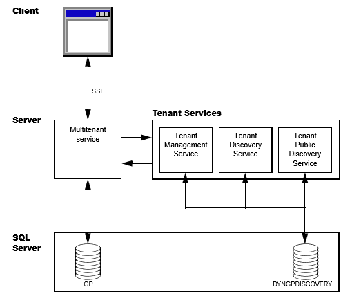
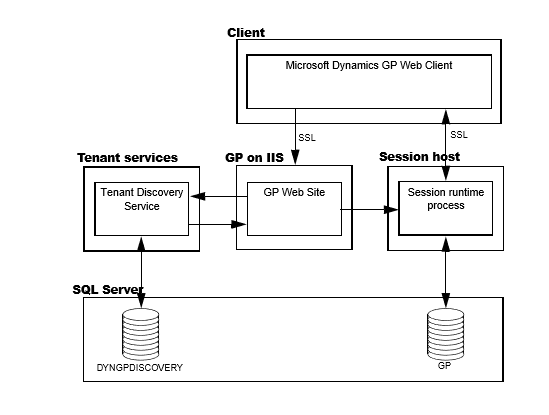
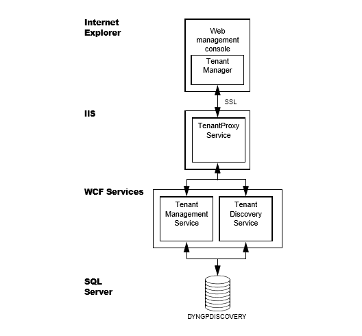
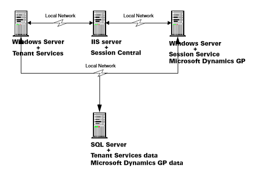
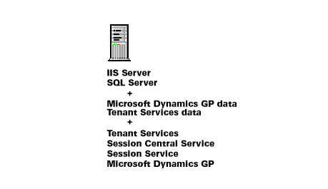

# Tenant Services Basics

## Chapter 1 Tenant Services Overview
Microsoft Dynamics GP Tenant Services are Windows Communication Foundation (WCF) services that help you to host Microsoft Dynamics GP for more than one organization in your data center. The following topics introduce Microsoft Dynamics GP Tenant Services:
* What are Tenant Services? 
* What can Tenant Services do?
* Getting started
### What are Tenant Services?
Microsoft Dynamics GP Tenant Services are three WCF services:
- Microsoft Dynamics GP Tenant Discovery Service
- Microsoft Dynamics GP Tenant Management Service
- Microsoft Dynamics GP Tenant Public Discovery Service

You install Tenant Services when you want your data center to host Microsoft Dynamics GP for more than one organization. Each organization is called a tenant. Hosting multiple tenants enables several organizations to share servers and other resources.

Tenant Services helps you to isolate the data and configuration information for each tenant. As a result, a user is not aware that there are other users from other organizations that are also working with Microsoft Dynamics GP in a shared data center. 

To work with tenant data, you use a multitenant application. A multitenant application includes a service that runs in your data center and is shared by all the tenants. When you install Tenant Services, you can use the following Microsoft Dynamics GP multitenant applications:

- Microsoft Dynamics GP Web Client
- Web Services for Microsoft Dynamics GP
- Microsoft Dynamics GP Service Based Architecture

For example, a user views data and performs operations using the Microsoft Dynamics GP web client. The user is unaware that people from other organizations are also using the shared web client infrastructure to work with other tenants.
What can Tenant Services do?

Tenant Services enables you to setup and manage a multitenant environment for Microsoft Dynamics GP. You should install Tenant Services when you want to use Microsoft Dynamics GP in the following scenarios:

1. Host multiple organizations in a data center. You want to host Microsoft Dynamics GP for multiple, unrelated organizations. For example, you create a tenant for each organization and enable the web client for each tenant. 
2. Host separate tenants for a single organization. You want to host multiple Microsoft Dynamics GP tenants for a single organization. For example, you create a tenant where you perform tests of the multitenant applications. The tenant keeps the data in the test environment separate from the data in your production tenant.

### Getting started
How you start depends on your role:
System administrator If you are the system administrator, complete the following:
* Review Chapter 2, “Tenant Services architecture,” to understand the components that work with Tenant Services. This information can help you to understand how Tenant Services works in a multitenant Microsoft Dynamics GP environment.
* Review Chapter 4, “Prerequisites,” to determine whether your system has all the prerequisites for Tenant Services. You may need to install some additional software or complete additional configuration before installing Tenant Services.
* Review Chapter 5, “Tenant Services Installation,” to acquaint yourself with the Tenant Services installation procedure. 
* Review Chapter 9, “Configuring Tenants,” to learn how to add tenants, users, and multitenant applications.
* Review Chapter 10, “Maintenance,” to learn what you can do to change, repair, or remove an existing Tenant Services installation.
Software Developer If you are a developer and you want to create a multitenant application, complete the following:
* Review Chapter 2, “Tenant Services architecture,” to familiarize yourself with the services and components of Tenant Services. You should understand how Tenant Services enables a multitenant application to access Microsoft Dynamics GP data for a tenant.
* Determine which Tenant Service endpoint you want your application to target. To get tenant information, you can use the Tenant Discovery Service or the Tenant Public Discovery Service. 
If your application will run on a different network than where you installed Tenant Services, you have to use the Tenant Public Discovery Service. 
If your application will run on the same network where you installed Tenant Services, you can use the Tenant Discovery Service. Applications that run on the same network can also use the Tenant Management Service.
* Discuss the installation procedure with the system administrator to learn what security and port settings were used during the Tenant Services installation. If you plan to use the Tenant Public Discovery Service, verify that the service was installed.
* Review the Microsoft Dynamics GP Web Client Service Reference documentation. Use the reference to learn about the classes and operations of the Tenant Discovery Service and the Tenant Management Service.

## Chapter 2: Tenant Services architecture
Before you install Tenant Services, it might help to understand multitenancy. You should also be familiar with how Microsoft Dynamics GP implements multitenancy. Information about the Microsoft Dynamics GP multitenant environment is divided into the following sections:
* Multitenancy and Microsoft Dynamics GP 
* Tenant Services architecture 
* Tenant Manager and the Web Management Console

### Multitenancy and Microsoft Dynamics GP
Multitenancy is a software architecture where an application runs as a service and is used by multiple, independent organizations that are called tenants. The service runs in a single, shared physical environment. Users from several tenants can simultaneously use the application because the service logically isolates data and configuration information for each tenant.
To use Microsoft Dynamics GP in a multitenant environment, you install the following components to the servers in you data center:
* You first install Tenant Services. Tenant Services are WCF services that enable Microsoft Dynamics GP multitenant applications to logically isolate data and configuration information for each tenant.
* You install Microsoft Dynamics GP for each tenant organization. When you install Microsoft Dynamics GP you have to specify a separate, named system data base for each tenant organization.
An important advantage of multitenancy is that you can use a single SQL Server for all the tenants. 
* You install the Tenant Manager snap-in and the Web Management Console. You use the Tenant Manager to add and configure tenants and multitenant applications. The Tenant Manager uses Tenant Services to perform operations on tenants, applications, and users.
* You install a multitenant application. Microsoft Dynamics GP multitenant applications include the Microsoft Dynamics GP Web Client, Service Based Architecture, and Web Services for Microsoft Dynamics GP. Each multitenant application includes a service that is shared by all the tenants.

The following sections describe the key structural concepts in a Microsoft Dynamics GP multitenant environment.

#### Tenant
A tenant is an organization that can use a multitenant application to access Microsoft Dynamics GP. You use the Tenant Manager snap-in to create tenants. Each tenant has a unique name. 

You assign a multitenant application to a tenant. You also assign a tenant user to a tenant. The tenant users assigned to a tenant can use all the multitenant applications for that tenant.

#### Application 
A multitenant application is a client that connects to a shared service. You use a multitenant application to perform operations that use Microsoft Dynamics GP data for a specified tenant. The install includes the following multitenant applications:
- Microsoft Dynamics GP Web Client 
- Web Services for Microsoft Dynamics GP 
- Microsoft Dynamics GP Service Based Architecture

You first have to use the Tenant Manager snap-in to add the application to your multitenant environment. You then use Tenant Manager to assign the application to the tenant.

After you assign an application to a tenant, you use the Tenant Manager to populate the application properties. The application properties enable you to configure the service for the specified tenant. 

#### User 
A user is a person that can perform operations with tenants and multitenant applications. There are two types of users:
* Service users 
* Tenant users

A service administrator is a person that has access to all tenants, multitenant applications, tenant users, and service administrators. The Tenant Services install adds two service administrators. The following table shows the type of service administrators:

Service user type | Description
-|-
Delegating user | The log on identity for the service that the multitenant application uses. For example, the login for the application pool for the Dynamics GP Web Client must be a delegating user. The delegating user enables the service to work on behalf of the logged in user. For example, access to a Tenant Services operation is based on the credentials of the logged in user and not the service identity. You cannot use the same login for both a delegating user and a service administrator. A delegating user should not be assigned to a tenant. You can have more than one delegating user. 
Service administrator | A user that can add, update, or remove tenants, tenant users, multitenant applications, and service administrators. To add a service administrator, you have to add the login ID of the person to the Users list in Tenant Manager. A service administrator should not be assigned to a tenant. You can have more than one service administrator. You cannot use the same login for both a delegating user and a service administrator.

A service user is a user that has access to all tenants, multitenant applications, tenant users, and service administrators or can work on behalf of another user. 

A tenant user is a person or group that is authorized to use a multitenant application to perform operations for a tenant. You use the Tenant Manager snap-in to add a tenant user to a tenant. The following table shows the type of service users.

Tenant user type | Description
-|-
Tenant administrator | A user that can add other tenant users to a tenant. You can upgrade any tenant user to be a tenant administrator.
Tenant user | A user that is assigned to a tenant. When you assign a user to a tenant, that person is authorized to use any of the multitenant applications for that tenant. A tenant can have one or more than one tenant user. In addition, a tenant user can be associated with more than one tenant. To add a tenant user, you associate the login ID of the person or the group with the tenant.

### Tenant Services architecture
Microsoft Dynamics GP Tenant Services is a collection of WCF services that help a multitenant application to access Microsoft Dynamics GP for a tenant. Tenant Services run on a server in your data center. You have to install Tenant Services before you can use any multitenant application. The following diagram shows how a multitenant application uses Tenant Services:

#### Client and the multitenant service 
A multitenant application includes a client and a multitenant service. The multitenant application enables you to perform operations that use Microsoft Dynamics GP data for a specified tenant. You can use the following multitenant applications:
* Microsoft Dynamics GP Web Client 
* Web Services for Microsoft Dynamics GP 
* "Microsoft Dynamics GP Service Based Architecture

To start a multitenant application, you have to login to the client with the credentials of a tenant user. You must also have permissions to access Microsoft Dynamics GP data. The multitenant service uses the Tenant Discovery Service to determine whether your login ID is a tenant user. If you are not a tenant user, access to the multitenant service is denied.
If your login is a tenant user, the multitenant application needs to identify the tenant you want to work with. To help specify the tenant, you see the following behaviors:
* If your login is associated with a single tenant, you are logged in to that tenant. You do not need to perform any additional action.
* If your login is associated with more than one tenant, you can get a list of available tenants. You can then choose the tenant that you want to log in to. 

After you choose the tenant, the multitenant service gets configuration information that enables the service to work with Microsoft Dynamics GP data for the specified tenant. You can now use the client to perform operations for the specified tenant.

#### Tenant Services 
Microsoft Dynamics GP Tenant Services includes three Windows Communication Foundation (WCF) services. These services enable you to add, view, and update tenants, users, and multitenant applications. The following table describes the WCF services.

Service name | Description
-|-
Microsoft Dynamics GP Tenant Discovery Service | You use the Tenant Discovery Service to get basic tenant information for a specified user and a specified multitenant application. You can use this information to select the tenant you want to work with.
Microsoft Dynamics GP Tenant Management Service | You use the Tenant Management Service to create, update, and remove tenants, multitenant applications, tenant users, and service administrators. 
Microsoft Dynamics GP Public Tenant Discovery Service | You use the Tenant Public Discovery Service to get basic tenant information for a specified user or a specified tenant application. You use the public discovery service when your multitenant application has to access tenant information from the internet. By default, the public discovery service is not initially installed. 

#### DYNGPDISCOVERY database 
Information about tenants, users, and multitenant applications is stored in a SQL Server database. The default name for the database is DYNGPDISCOVERY. You can specify a different name during installation. You can place the Tenant Services database on the same SQL Server you use for Microsoft Dynamics GP.

To add, update or remove records from the database, you use the Tenant Manager snap-in and the Web Management Console..

#### Security 
The diagram shows that the client communicates with the multitenant service over a network. To help secure the information in the messages between the client and the service, you have to use security certificates and Secure Sockets Layer (SSL). You use SSL to encrypt the messages.

The Tenant Discovery Service and Tenant Management Service do not require security certificates and SSL. However, it is recommended that you use SSL with these services whenever possible.

If you use the Tenant Public Discovery Service, you are required to have a security certificate and SSL. You use the Tenant Public Discovery Service when your multitenant application is on a different network than where you installed tenant services.

To get information from any of the Tenant Services, you must provide an authenticated Windows login. Your login ID is used to determine what tenants and services you can access.

#### Web client example 
The following illustration shows an example of how Tenant Services works with a multitenant application. The example shows Tenant Services and the Microsoft Dynamics GP Web Client.

To begin, you use a web browser to start the Dynamics GP web client. The browser contacts the GP web site on your IIS web server. You are prompted to enter your login credentials and click Sign In. The service behind the GP web site queries the Tenant Discovery Service to determine whether your login credentials are authorized to use the web client. The service is called the Session Central Service.

The Session Central Service then determines whether you were previously using the web client. If an existing web client session is found, you can choose to reconnect. 
If you choose to start a new web client, the Session Central Service uses the Tenant Discovery Service to get the list of tenants that you can access. The list is retrieved from the DYNGPDISCOVERY database. You then have to specify the tenant you want to use:
* If the query returns one tenant, the web client defaults to use that tenant.
* If the query returns more than one tenant, you will see a list of tenants in the browser. You select the Create Session action for the tenant you want to use.

After you choose the tenant, the Session Central Service uses the Tenant Discovery Service to get web client configuration information for that tenant. The configuration information includes how to connect to Microsoft Dynamics GP for the tenant. The Session Central Service uses the configuration information to start another service called a session runtime process.
The Session Central Service returns the URL for the session runtime process to the browser. The browser uses that URL to connect to the session runtime process and the web client appears. For more information about the web client, see the Web Client Installation and Administration Guide.

In a single tenant environment where Tenant Services are not installed, you will find a file named TenantConfiguration.xml at the root of the Session Central Service installation folder. The file contains default tenant information that is automatically used when you login to the web client.

#### Tenant Manager and the Web Management Console
After you install Tenant Services you will want to add tenants, multitenant applications, tenant users, and service administrators. To perform these operations, you have to install the Tenant Manager snap-in for the Microsoft Dynamics GP Web Management Console. For more information about how to install the Web Management Console, see Chapter 6, “Tenant Manager Installation.”

Tenant Manager is the application you use to manage your multitenant environment. To view the Tenant Manager, you use your browser to open the Web Management Console.

The following illustration shows the architecture of the Tenant Manager. Notice how the Tenant Manager uses Tenant Management Service and Tenant Discovery Services to get and save information about tenants, multitenant applications, tenant users, and service administrators in the DYNGPDISCOVERY database.

You might also notice that the Tenant Manager uses a service named Tenant Proxy Service. The Tenant Proxy Service is an intermediate service that helps the Silverlight Tenant Manager application to use the operations of the WCF Tenant Services. 
Tenant 

## Chapter 3: Tenant Services preparation
If you plan to use Microsoft Dynamics GP in a multitenant environment, you need to spend time planning how to use Tenant Services. You use Tenant Services when you want to use a multitenant application like the Web Client or web services with Microsoft Dynamics GP. If you plan to use other applications, you do not need to install Tenant Services. 
Planning information is divided into the following sections:

* Deployment configurations 
* User accounts 
* Signed security certificates

### Deployment configurations
Which configuration you choose will depend on what types of integration you need, and the server resources you have available. 

#### Scale-out 
A scale-out configuration is a multiserver deployment configuration. Typically, you use the scale-out configuration to support the Microsoft Dynamics GP Web Client. To create a multitenant environment, you have to add Tenant Services to the scaleout configuration.

You use the scale-out configuration when you expect to host more than one organization and a large number of users. To obtain optimal performance, you should use the scale-out configuration whenever possible.

The following illustration shows a basic scale-out configuration that you would use for Microsoft Dynamics GP Web Client. Notice that Tenant Services is installed on a separate server, and accesses the SQL Server over the local network. 

Typically, you install Tenant Services onto a separate server. However, you can put Tenant Services on any server that can be accessed by the other servers in your deployment.

In addition, you can install Tenant Services on more than one server. The separate Tenant Services installs use the same SQL Server database. This would enable you to load-balance Tenant Services and to provide additional reliability.

Also notice how the scale-out configuration includes a separate IIS server and a session host server.

The scale-out configuration provides the following advantages:

- Better performance for a large number of tenants.
- Better resistance to failure.
- Easier maintenance. You make changes to the tenant services without having to take your multitenant environment offline.

In multiserver configuration you can use a firewall to shield the tenant services from outside access. In the web client example, access to the tenant services is provided by the Session Central Service on the web server. 

For additional security you can also have a firewall between the tenant service, the session host server and the SQL Server. The firewall can provide additional security by further restricting access to the SQL Server. 

#### Single-server 
An alternate configuration adds Tenant services to a single-server deployment. In this configuration, you install Tenant Services on the same server as Microsoft Dynamics GP and the SQL Server. The following illustration shows the configuration for a single server:

This configuration is best suited for development and evaluation environments where the number of tenants and users is expected to be small.

### User accounts
You will need at least two user accounts during the installation of tenant services. For the multiple-server installation, you have to use domain accounts. For the single-server installation, you can use machine accounts. Ideally, these user accounts should have limited privileges, and a password that does not expire. 

Create the user accounts before you start installing the Microsoft Dynamics GP Tenant Services. You must have user accounts for the following: 

#### Tenant Services Installation
The login you use to install Microsoft Dynamics GP Tenant Services is added as a service administrator. You can use this login to access the Tenant Manager snap-in of the Web Management Console where you can add tenants, applications, and user to your multitenant environment.

#### Service login IDs 
You have to specify a user account as the login ID for the Tenant Discovery Service, Tenant Management Service, and the Tenant Public Discovery Service. Use a different user account than you use to install Tenant Services. The service logins are given SQL permissions to the tenant database.

#### Tenant Manager
If you install the Microsoft Dynamics GP Web Management Console and the Tenant
Manager snap-in, you have to specify a login ID for the IIS application pool. You
can use the same user account that you use for the service login IDs.

The user account that you specify for the application pool will be added as a
delegating user for Tenant Services. You should not use this login for a service
administrator, tenant administrator, or tenant user.

> [!NOTE]
> You cannot use the login of a service administrator as a delegating user. If you try to use the same login for both, you will not be able to use the Tenant Manager snap-in of the Web Management Console.

### Signed security certificates
You can use security certificates and secure sockets layer (SSL) to help improve the
security of data being transmitted to the Tenant Services. You will use the security
certificate when you install Tenant Discovery Service, Tenant Management Service,
and the Tenant Public Discovery Service. In addition, you use a security certificate
to help secure the web site that hosts the Web Management Console and the Tenant
Manager snap-in.

The easiest way to implement SSL for Tenant Services is to get a signed security
certificate. To get a signed security certificate, you purchase it from a third-party
supplier. When you use a third-party signed security certificate the third-party
handles the certificate validation when users connect to the site. No additional
action is needed by the users.

The following sections describe the types of signed security certificates that you can
use.

#### Single domain
This type of security certificate is issued for a specific machine. For example, you
could get a security certificate issued for the machine with the following name:

- GPTenantServices.contoso.com

You would typically use this type of certificate when installing your multitenant
environment in a single machine configuration. This is the least expensive type of
certificate to purchase.

#### Multiple domain
This type of security certificate is issued for a set of specific machines. You must
know the machine names at the time that you purchase the security certificate. For
example, you could get a security certificate issued that you use with the following
machine names:

- GPTenantServices.contoso.com
- GPweb.contoso.com
- GPServiceHost1.contoso.com
- GPServiceHost2.contoso.com

You would typically use the multiple domain certificate when installing Tenant
Services in a scale-out configuration. The certificate would contain an entry for each
machines that will be part of your configuration. This security certificate is more
expensive because the same certificate can be used on multiple machines.

#### Wildcard
This type of security certificate is not issued for specific machines. Instead, it is
issued for a specified domain. The security certificates can be used for any machines
that follow the naming convention of the domain. For example, if you purchased a
wildcard certificate for the *.contoso.com domain, any machine in that domain
(such as GPTenantServices.contoso.com) could use the wildcard certificate.

You would typically use the wildcard certificate when installing a multitenant
Microsoft Dynamics GP environment in the scale-out configuration. The wildcard
certificate is especially useful when you expect to add additional machines to the
configuration but do not know the names at the time you are purchasing the
certificate. The extra flexibility does come with a cost. Wildcard certificates are the
most expensive signed certificate.

> [!NOTE]
> The certificate must list “Server Authentication” as one of its intended purposes. To view the intended purpose, use the Certificates snap-in for the Microsoft Management Console and view the Intended Purpose column.

## See also

[Multitenant Applications](tenant-services-applications.md)  
[Tenant Services Installation](tenant-services-installation.md)  
[Tenant Services Configuration and Administration](tenant-services-config-admin.md)  
