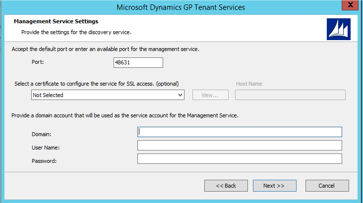

# Tenant Services Installation
This portion of the documentation explains how to install the Microsoft Dynamics
GP Tenant Services. The following information is discussed:
- Chapter 4, "Prerequisites," describes the software required and the actions you
must perform before you install the Microsoft Dynamics GP Tenant Services.
- Chapter 5, "Tenant Services Installation," describes the steps to install Tenant
Services.
- Chapter 6, "Tenant Manager Installation," describes the steps to install the
Tenant Manager and the Web Management Console.

## Chapter 4 Prerequisites
Before installing Microsoft Dynamics GP Tenant Services, there are several
prerequisites you must check. This portion of the documentation describes the
software requirements and the additional steps to perform before installing Tenant
Services. The following topics are discussed:

- Operating system
- User accounts
- Security group
- SQL Server
- Security Certificates
- Internet Information Services (IIS)

### Operating system
To install Microsoft Dynamics GP Tenant Services, the computer must be running
the 64-bit version of Windows Server 2008 R2 (Standard or Enterprise) or later.

### User accounts
You will have to have domain user accounts that you can use during the install.
Before you begin the install, you need to create the following accounts:

1. Create the service administrator account.

    Select or create the domain user account that you will use to install Tenant Services. The install will add the account as a service administrator for Tenant Services. The user account must be in the Administrators security group on the server where you will install Tenant Services. In addition, you will use this login when you first open the Web Management Console. You can then use the Tenant Manager snap-in to add other service administrator accounts. 

2. Create an account for the services and application pool.

    Select or create a user account that you can use as the log on ID for the Tenant Discovery Service, Tenant Management Service, Tenant Public Discovery Service, and the DynGPWebMgmt application pool for the Web Management Console. 
    
    You should not use the same account that you use to install Tenant Services. The log on account for the application pool has to be a delegating user. You cannot have an account that is both a service administrator and delegating user.

### Security group
Security groups are used to specify which users are allowed to access the Microsoft Dynamics GP Web Management Console. You use the security group to grant your tenant service administrator access to the Tenant Manager snap-in. You also have to add tenant administrator accounts to the group. 

> [!NOTE]
> You can also use a domain group to specify who has access to the Tenant Manager snap-in.

To create the security group, complete the following steps:
1. Start Server Manager.

    Start Server Manager on the computer where you install the Web Management Console and the Tenant Manager snap-in.
2. Expand Groups in Local Users and Groups.

    Expand Configuration, expand Local Users and Groups, and then click Groups. Right-click Groups and then click New Group. The New Group windows opens.
3. Type the group name and description.

    Enter a name that uniquely identifies the group. For example, you enter TSUsers for the group name. You can enter a description of the group but it is not required.

4. Click Add to add a member to the group.

    To add a member to the group, click Add. You use Select Users, Computers, Service Accounts, or Groups to enter the login ID you want to add to the group. Click Check Names to validate the ID. Click OK to add the specified user to the group. 
    You should add the login IDs of the service user accounts that you created earlier to the group.

5. Create the group.

    Click Create. The group is added to the list of groups. The group contains the member or members you specified in the previous step. Click Close to close the New Group window.

### SQL Server
Identify the SQL Server you want Tenant Services to use. Tenant Services stores
information about tenants, users, and multitenant applications in a database. When
you configure Tenant Services, you will specify the SQL Server where you want to
add the database.

You need Microsoft SQL Server 2012 or higher. SQL Server can be on the same
machine where you install Tenant Services or on a separate machine within the
domain. In addition, you can use the same SQL Server that you use for Microsoft
Dynamics GP data.

### Security Certificates
Get the security certificates for your servers. The following steps describe how to
determine what security certificates you need and where to place the files.

1. Obtain the security certificate.
    
    Get the security certificate (.cer) file from the third-party certificate supplier.

    Component | Description
    -|-
    Tenant Services | If you will install Tenant Services to a separate machine in a scale-out configuration, you have to obtain a security certificate for that machine. If you will install Tenant Services in a single-server or similar configuration and you already have a security certificate for that server, you do not need another.
    Web Management Console with the Tenant Manager snap-in | If you will install the Web Management Console and the Tenant Manager snap-in on a separate web server, you have to obtain a security certificate for that machine. If you will install the Tenant Manager on the web server you use for the web client, you do not need another security certificate.

2. Place the security certificate on the Tenant Services server.

    Place your Tenant Services security certificate file in a location that you can access from the machine where you plan to install Tenant Services.

3. Place the security certificate on the web server.

    Place the web server security certificate file in a location that you can access from the machine where you plan to install the Web Management Console and the Tenant Manager snap-in.

### Internet Information Services (IIS)
After you install Tenant Services, you have to install the Tenant Manager snap-in
for the Microsoft Dynamics GP Web Management Console. The Tenant Manager is
the web application that you use to add and configure tenants, users, and
multitenant applications.

The Web Management Console requires a web server where you have installed IIS
7.5 or later. If you plan to install the Microsoft DynamicsGP web client, you can also
use that web server to host the Web Management Console.

To install IIS on a Windows Server 2008 R2 machine, complete the following steps:

1. Open the Server Manager.

2. Click Roles.

3. Click Add Roles.

    The Add Roles Wizard opens. Click Next.
4. Select the Web Server role.

    Click Web Server (IIS) in the list of Server Roles. Click Next to continue.
5. Click Next to close the Introduction screen.

6. Select the role services.

    In addition to the default role service that appear in the Select Role Services window, you have to click ASP.NET. If you are asked to add role services required for ASP.NET, click Add Required Role Services. Click Windows Authentication in the Security list. Click Next.
7. Click Install.

    In the Confirm Installation Selections window, click Install. The specified role and role services are added to the server.

8. Click Close.

    After the installation is complete, click Close.

## Chapter 5: Tenant Services Installation

 This portion of the documentation describes how to install Microsoft Dynamics GP
Tenant Services. The following information is discussed:

- Install the security certificate
- Install Tenant Services
- Configure the Tenant Services database
- Upgrading an earlier installation
- What to do next

### Install the security certificate
If you are adding Tenant Services to a scale-out configuration for the Microsoft
Dynamics GP web client installation, you have to supply a security certificate for
the server where you want to install Tenant Services. To install a security certificate
onto the server, complete the following procedure:

1. Verify you are logged in with administrator privileges.

    The user you are currently logged in as must be in the Administrator group for the computer on which you are installing Tenant Services.

2. Open the Run prompt.

    Choose Start > Run or press Window-R.

3. Open the Microsoft Management Console.

    In the Open field, type MMC and the click OK.

4. Open the Add or Remove Snap-ins window.

    In the Microsoft Management Console, open the File menu and choose Add/Remove Snap-in.

5. Add the Certificates snap-in.

    In the Add or Remove Snap-ins window, choose the Certificates snap-in from the Available snap-ins list, and then click Add.

6. Specify the computer account.

    In the Certificate snap-in dialog box, choose Computer account, and then click Next.

7. Select to manage the local computer.

    In the Select Computer dialog box, choose Local computer, and then click Finish.

8. Add the snap-in to the console.

    In the Add or Remove Snap-ins window, click OK.

9. Expand Personal in the Certificates node.

    In the left pane, expand the Certificates (Local Computer) node, and then expand the Personal node.

10. Start the certificate import wizard.

    Under Personal, right-click the Certificates node, click All Tasks, and then click Import. When the Certificate Import Wizard appears, click Next.

11. Specify the security certificate file.

    In the File to Import screen, click Browse. Navigate to the location where placed the security certificate (.cer) file that you got for the tenant server. Select the .cer file, and click Open.

12. Import the security certificate.

    In the Certificate Import Wizard, click Next.

13. Verify the certificate store.

    In the Certificate Store screen, verify that the certificate is being added to the Personal store. Click Next.

14. Complete the import.

    Click Finish to complete the import process.

15. Close the Microsoft Management Console window.

### Install Tenant Services
To install Tenant Services, complete the following procedure:

1. Start the Tenant Services installer.

    To install the Tenant Services, run Setup from the Microsoft Dynamics GP install media. Click Tenant Services and then click Install. You can also start the install by opening the AdProd folder on the install media, expand TenantServices, and then double-click TenantServices.

2. Install prerequisites.

    If you see a window that prompts you to install prerequisite components, click
    Install. If you previously installed Tenant Services, Microsoft Dynamics GP, or
    another product, you might not see this window.

3. Review the license agreement.

    After reviewing the license agreement, mark the option to accept the terms. Click Next to continue.

4. Specify the components to install.

    Select the features you would like to install. The install allows you to select from the following features:

    

    Name | Description
    -|-
    Tenant Discovery Service | Installs the Tenant Discovery Service. The default is to install this service.
    Tenant Management Service | Installs the Tenant Management Service. The default is to install this service.
    Tenant Public Discovery Service | Installs the Tenant Public Discovery Service. The public discovery service is optional. The default is to not install this service. You install the Tenant Public Discovery Service when you have multitenant applications other than Microsoft Dynamics GP that get tenant information from outside your domain.

    When you click a button for a feature, a pop-up menu of options appears. Refer to the following table for information about each option.

    Option | What happens
    -|-
    Run from My Computer | Installs the feature on the local hard disk. This option installs the feature but not sub features.
    Run all from My Computer | Installs the feature and all of its sub features. Not Available Do not install the selected feature. You can install the feature later using Add or Remove Programs.
    Not Available | Do not install the selected feature. You can install the feature later using Add or Remove Programs.

    To include a feature, click the button and select "Run from My Computer" To exclude a feature, click the button and select "Not Available"

5. Configure the Tenant Discovery Service settings.

    To install the discovery service you have to specify the following settings:

    Setting | Description
    -|-
    Port | The default port value is 48630. If the port is in use, the next available port is selected. In addition, you can enter the port number that you want the service to use.
    Certificate | Specify a security certificate when you want the connections to the service to use SSL. A certificate is optional. The default value is Not Selected. If you do not specify a certificate, SSL will not be used to encrypt messages to and from the service. To review information about available certificates, click the certificate in the drop-down list, and then click the View button. A dialog window opens that provides detailed information about the certificate.
    Host name | The fully qualified domain name of the server where you have installed the security certificate.
    Domain | Enter the domain name associated with login ID you want to use with the service.
    User name | Specify the login name for the service. 
    Password | Enter the password for the specified login ID.

    

6. Configure the Tenant Management Service settings.

    To install the management service you have to specify the following settings:

    |Setting | Description|
    |-|-|
    |Port | The default port value is 48631. If the port is in use, the next available port is selected. In addition, you can enter the port number that you want the service to use.|
    |Certificate | Specify a certificate when you want the connections to the service to use SSL. A certificate is optional. The default value is Not Selected. If you do not specify a certificate, SSL will not be used to encrypt messages to and from the service. To review information about available certificates, click the certificate in the drop-down list, and then click the View button. A dialog window opens that provides detailed information about the certificate.|
    |Host name | The fully qualified domain name of the server where you have installed the security certificate.|
    |Domain | Enter the domain name associated with login ID you want to use with the service.
    |User name | Specify the login name for the service.|
    |Password | Enter the password for the specified login ID.|

    

    Click Next to continue.

7. Configure the Tenant Public Discovery Service settings 

    If you specified that you want to install the public discovery service, you have to supply the following settings:

    |Setting | Description|
    |-|-|
    |Port | The default port value is 48632. If the port is in use, the next available port is selected. In addition, you can enter the port number that you want the service to use.|
    |Certificate | If you install the public discovery service, you have to use SSL. SSL insures that messages to and from the service are encrypted. Specify the security certificate you want the service to use. If you do not specify a certificate, you will not be able to proceed with the install. To review information about available certificates, click the certificate in the drop-down list, and then click the View button. A dialog window opens that provides detailed information about the certificate.|
    |Host name  | The fully qualified domain name of the server where you have installed the security certificate.
    |Domain | Enter the domain name associated with login ID you want to use with the service.
    |User name | Specify the login name for the service.|
    |Password | Enter the password for the specified login ID.|

    

    Click Next to continue.

8. Start the installation.

    Click Install to begin the installation process. The install will run for several minutes.

9. Complete the installation.

    Once the installation completes, you can choose to run the Tenant Service
    Configuration Wizard. To start the wizard, click Run the Microsoft Dynamics
    GP Tenant Services Configuration Wizard. Click Exit.

### Configure the Tenant Services database
After you install Tenant Services, you have to specify a database that the services
can use. The tenant services store configuration information for tenants, users, and
multitenant applications in the specified database.

You use the Tenant Services Config Wizard to specify the database for Tenant
Services. The wizard enables you to specify the Microsoft SQL Server and database
you want to use for the tenant service. To use the wizard, complete the following
steps:

1. Start the Tenant Services Configuration Wizard

    Click Start, click Administrative Tools, and then click Tenant Services Config Wizard. The Microsoft Dynamics GP Tenant Services Configuration Wizard opens. Click Next.

2. Specify the SQL Server.

    Enter the machine name of the SQL Server where you want to put the Tenant Services database.

3. Specify the name of the database.

    The wizard adds the DYNGPDISCOVERY database to the specified server.

    

4. Specify the type of authentication you use with the SQL server.

    The default uses Windows Trusted Authentication. You can use Windows
    Trusted Authentication when your login has permissions to add a database to
    the specified SQL server.
    If you click to use SQL Authentication, you have to provide the Login ID and
    password you want to use to connect to the specified SQL server.
    Click Next.

5. Confirm the configuration.

    If you are asked to confirm the configuration, click Next.

6. Click Exit.

    Click Exit to close the wizard. The Tenant Services database is installed and
    ready to use.

### Upgrading an earlier installation
If you have a Tenant Services installation from an earlier release of Microsoft
Dynamics GP, you can upgrade it to the current version. The same upgrade method
is used whether you are upgrading to a new major version or just applying a service
pack. The upgrade makes changes to the following services:

- Microsoft Dynamics GP Tenant Discovery Service
- Microsoft Dynamics GP Tenant Management Service
- Microsoft Dynamics GP Tenant Public Discovery Service

To upgrade Tenant Services, complete the following steps:

1. Verify the user you are logged in as.
    
    You must be in the Administrator role for the computer on which you are
    upgrading the installation.

2. Open a command prompt window

    Click Start >> All Programs >> Accessories, right-click Command Prompt, and then click Run as administrator. The Command Prompt window opens.

3. Find the install file for the upgrade.

    The installer for the Tenant Services upgrade is found in the \AdProd\TenantServices\Updates folder of the Microsoft Dynamics GP installation media. In the Command Prompt window, change folders to the location where you found the upgrade install file.

4. Start the upgrade.

    In the Command Prompt window, type the name of the install file and press Enter. Watch the Command Prompt window to see when the upgrade is done.

5. Start the Tenant Services Configuration Wizard.

    After you run the upgrade, you should run the Microsoft Dynamics GP Tenant
    Services Configuration Wizard. To run the wizard, click Start > All Programs > Administrative Tools > Tenant Service Config Wizard. After the Microsoft Dynamics GP Tenant Services Configuration Wizard opens, click Next. 

6. Verify the SQL connection information

    The wizard shows the existing SQL connection information for Tenant Services.
    Verify the following values and then click Next:

    - Server name
    - Database name
    - Type of authentication

    For more information about the wizard, see Configure the Tenant Services
    database.

7. Close the Tenant Services Configuration Wizard

    Click Exit to close the wizard.

8. Verify Tenant Services restarted.

    Open Server Manager, expand Configuration, and then click Services. Verify
    that the Microsoft Dynamics GP Tenant Discovery Service and the Microsoft
    Dynamics GP Tenant Management Service have started.

After you upgrade the Tenant Services, you should also upgrade the Tenant
Manager snap-in and the Microsoft Dynamics GP Web Management Console. To
learn more about the Tenant Manager upgrade, see Upgrading an earlier installation
in the Tenant Manager Installation section.

### What to do next
After you install and configure Microsoft Dynamics GP Tenant Services, consider taking the following steps:

- Install or upgrade the Tenant Manager snap-in for the Microsoft Dynamics GP Web Management Console. You use the Tenant Manager to create, update, and remove tenants, users, and multitenant applications. For information about how to install the Tenant Manager snap-in, see Chapter 6, "Tenant Manager Installation".

- Learn about developing multitenant applications that use the Microsoft Dynamics GP Tenant Services. To learn about the services and the application programming interface (API) they provide, find and review the Microsoft Dynamics GP Web Client Services Reference.

## Chapter 6: Tenant Manager Installation
This portion of the documentation describes how to install the Microsoft Dynamics
GP Web Management Console and the Tenant Manager. You use the Tenant
Manager to view and update tenants, users, and multitenant applications in a
multitenant environment.

You can also add the Tenant Manager to an existing Web Management Console.
You use Add/Remove Features to add the Tenant Manager to the Web
Management Console.

The following information describes how to install the Web Management Console
and the Tenant Manager:

* Add the security certificate to the web site
* Configure the web site to use SSL.
* Install Tenant Manager and the Web Management Console
* Configure the Web Management Console database
* Upgrading an earlier installation
* Start the Tenant Manager
* What to do next

### Add the security certificate to the web site

Before you install the Web Management Console, specify the security certificate for
the site. To add the certificate, complete the following steps:

1. Verify you are logged in with administrator privileges.

    The user you are currently logged in as must be in the Administrator group for the computer on which you are installing the Tenant Manager.

2. Start IIS Manager.

    In Administrative Tools, open Internet Information Services (IIS) Manager.

3. Specify the computer.

    In the left pane, click the computer name.

4. Open Server Certificates.

    In the IIS group, double-click Server Certificates.

    

  5. Click Complete Certificate Request.

   In the Actions pane, click Complete Certificate Request. The Complete Certificate Request window opens.

6. Specify the certificate file for the web server.

    Click the browse button, navigate to the location where you placed the security
    certificate (.cer) file you obtained from the third-party certificate supplier.

7. Specify a name for the certificate.

    Type a name in the Friendly name field. Enter a name that easily identifies the
    certificate.

8. Import the security certificate.

    To import the security certificate, click OK.  

### Configure the web site to use SSL.
The web site you use for the Microsoft Dynamics GP Web Management Console can
be configured to use SSL. To use SSL, complete the following steps:

1. Specify the site on the web server.

    In Internet Information Services (IIS) Manager, expand the Sites group in the
    left pane. Click the web site that you are configuring to use SSL. For example,
    click the Default Web Site.

2. View Bindings for the web site.

    In the Actions pane, click Bindings. The Site Bindings window appears.

3. Open the Add Site Bindings window.

    In the Site Bindings window, click Add.

4. Specify the binding type and choose the security certificate.

    In the Add Site Bindings window select https for the type. In the SSL certificate,
    click the name of the security certificate that you added earlier. Click OK.

5. Close the Site Bindings window.

    Click Close.

### Install Tenant Manager and the Web Management Console
To install the Tenant Manager and the Web Management Console, complete the
following steps:

1. Start the MIcrosoft Dynamic GP installer.

    Start the installer on the server that has the web site you want to use for the
    Web Management Console.

2. Click Web Client

    In the list of Additional Products, click Web Client, and then click Install.

3. Review the License Agreement.

    Review the License Agreement. To continue the install, click to accept the terms
    of the agreement. Click Next.

4. Specify the type of install.

    In the Install Options window, click Custom. The Select Features window
    opens.

5. Specify Tenant Manager for the Web Management Console.

    In the Select Features window, click the Web Management Console and Tenant
    Manager drop down lists and click Run from My Computer. Click Service
    Based Architecture and Web Client drop down lists and click Not Available.

    The following illustration shows how to install the Web Management Console
    and the Tenant Manager.

    
    
     If you add Tenant Manager to an existing Web Management Console, do not make changes that set Session Central, Web Site, Web Client Session Manager, or Session Server to Not Available. You should leave the existing values.
    
    Specify the install location for the Web Management Console. You can use the default location or specify another folder. Click Next.

6. Specify the name of the Web components.

    Enter the name of the SQL server where you want the database to appear. You
    can keep the default name for the database or specify the name you want to use.

    Specify the type of authentication you use with the SQL Server. If the user
    installing the Web Management Console has sufficient privileges, you can use
    Windows Trusted Authentication. Otherwise, you should use SQL
    Authentication and supply a SQL Login ID and Password for a SQL user
    account with sufficient privileges. Click Next.

7. Specify the name of the Web Management Console user group.

    Enter the name of your web management console user group in the Web
    Management Console Users text box. Click Next.

8. Specify the URL for the discovery and management services.

    In the Tenant Configuration window, click the checkbox labeled Deploy for
    multiple tenants.
    Enter the URL for the discovery and management services. The URL should use
    the format of the following URLs.

    - https://\<servername\>:\<port\>/TenantDiscoveryService    
    - https://\<servername\>:\<port\>/TenantManagementService

        To get the URL for the Tenant Discovery Service you can use the Microsoft.Dynamics.MultitenantService.Discovery.config file. The baseAddress node contains the URL of the service. The file is found in the c:\Program Files\Microsoft Dynamics\Tenant  Services\DiscoveryService folder on the server where you installed Tenant Services. To get the URL for the Tenant Management Service, you can use the Microsoft.Dynamics.MultitenantServices.Management.config file. The file is found in the C:\Program Files\Microsoft Dynamics\Tenant Services\ManagementService folder.

9. Specify the web site for the Web Management Console.

    Click the web site in the drop down list where you want to install the Web
    Management Console. The Web Site Configuration shows the settings for the
    web client web site.
    
    

    Enter the domain, name, and password for login identity you want to use for the application pool. Click Next.

10. Specify the database for the Web Management Console.

    Enter the name of the SQL server where you want the database to appear. You
    can keep the default name for the database or specify the name you want to use.
    
    Specify the type of authentication you use with the SQL Server. If the user
    installing the Web Management Console has sufficient privileges, you can use
    Windows Trusted Authentication. Otherwise, you should use SQL
    Authentication and supply a SQL Login ID and Password for a SQL user
    account with sufficient privileges. Click Next.

11. Begin the install.

    Click Install to continue with the installation.

12. Click Exit.

    When the install is complete, click Exit to close the install window    

### Configure the Web Management Console database
To use the Web Management Console, you first have to configure a data store. To
create the database that you specified during the install, you run the Web Client
Components Wizard.

1. Start the wizard.

    Start the Microsoft.Dynamics.GP.Web.ConfigurationWizard application. You
    can use Windows Explorer to find the application. Typically, the install places
    the application in the following folder: c:\Program Files\Microsoft
    Dynamics\GP Web Components\
    
    To start the wizard, double click the application. The following window
    appears.

2. Specify the type of authentication you use with the SQL server.

    The default uses Windows Trusted Authentication. You can use Windows
    Trusted Authentication when your login has permissions to add a database to
    the specified SQL server.

    If you click to use SQL Authentication, you have to provide the Login ID and
    password you want to use to connect to the specified SQL server.
    Click Next.

3. Create the Web Components database.

    In the Configuration Status and Action window, click Next.

4. Click Exit to close the wizard.

    After the wizard runs, click Exit to close the window.  

### Upgrading an earlier installation
If you have a Tenant Manager installation from an earlier release of Microsoft
Dynamics GP, you can upgrade it to the current version. The same upgrade method
is used whether you are upgrading to a new major version or just applying a service
pack.

To upgrade the Tenant Manager snap-in, you run the Web Components upgrade.
The upgrade can also make changes to any of the following components that are
installed on the server:

- Session Management snap-in  
- GP Web Management Console
- Web site for the Web Management Console
- Web site for the GP Web Client
- GP Session Central Service
- GP Session Services

To upgrade Tenant Manager, complete the following steps:

1. Verify the user you are logged in as.

    You must be in the Administrator role for the computer on which you are
    upgrading the installation.

2. Open a command prompt window

    Click Start >> All Programs >> Accessories, right-click Command Prompt, and
    then click Run as administrator. The Command Prompt window opens.

3. Find the install file for the upgrade.

    The installer for the Tenant Manager upgrade is found in the
    \AdProd\WebComponents\Updates folder of the Microsoft Dynamics GP
    installation media.
    In the Command Prompt window, change folders to the location where you
    found the upgrade install file.

4. Start the upgrade.

    In the Command Prompt window, type the name of the install file and press
    Enter. Watch the Command Prompt window to see when the upgrade is done

5. Start the Web Components Configuration Wizard.

    After you run the upgrade, you should run the Dynamics GP Web Components
    Configuration Wizard. To run the wizard, click Start >> All Programs >>
    Administrative Tools >> Dynamics GP Web Components Configuration
    Wizard. After the Dynamics GP Web Components Configuration Wizard
    opens, click Next.

6. Verify the SQL connection information

    The wizard shows the existing SQL connection information for the Web
    Management Console. Verify the following values and then click Next:

    * Server name
    * Database name
    * Type of authentication

7. View the Configuration Status and Actions.

    Click Next.

8. Close the Web Client Configuration Wizard.

    Click Exit to close the wizard.

    For more information about the Web Client Configuration Wizard, see Configure
    the Web Management Console database.

9. Clear the cache of your web browser.

    You have to clear the cache of the web browser you use to connect to the Tenant Manager and the Web Management Console. In Internet Explorer, click Settings, Safety, and Delete browsing history. Click Temporary Internet files, click Cookies, and then click Delete.

    Repeat this step on any machine where you use the web browser to view the Web Management Console. If you do not clear the cache, you might not see the upgrade or you might encounter an error while trying to open the Tenant Manager snap-in.

For more information about the Web Components upgrade, see the Microsoft Dynamics GP Web Client Install and Administration Guide.

### Start the Tenant Manager
After you install the Tenant Manager console, you have to specify the services you want to manage. To configure the Tenant Manager, complete the following steps:

1. Open Internet Explorer.

    You must be logged in with an ID that you specified as a service administrator
    for the Tenant Services. Use the login ID that you used to install Tenant
    Services.

2. Enter the address of the Microsoft Dynamics GP Web Management Console.

    The default address for the Web Management Console is:

      `https://ServerName:PortNumber/WebManagementConsole`

    The address requires that you specify the following information:

    |URL component | Description|
    |-|-|
    |ServerName | The fully-qualified domain name (FQDN) for the server that hosts the web site. The name must match the name you used when you requested the security certificate that you applied to the site when setting up SSL.|
    |PortNumber | The port for the web site that you are using. If you chose to install on the default web site (port 80) then you do not need to supply the port number.|

    A typical URL to access the Microsoft Dynamics GP Web Management Console looks similar to the following:

      `https://gpweb.contoso.com/WebManagementConsole`

3. View the Web Management Console home page.

    The home page appears is the browser. The left pane of the console is the
    Navigation pane that shows the snap-ins that the console contains. The Tenant
    Manager should appear at the bottom of the Navigation Pane.

    

4. Click Tenant Manager.

    Click the Tenant Manager in the navigation pane of the Web Management
    Console. The Tenant Manager opens in the console.

5. Specify the URL for the Tenant Management Service.

    You have to specify the URL for the Tenant Management Service. Enter the
    URL in the dialog window and press Enter.

    The following example shows the format of the URL:

      `https://<servername>:<port>/TenantManagementService`

    

    To get the URL, use the Microsoft.Dynamics.MultitenantServices.Management.config
    file. The baseAddress node contains the URL of the service. The file is found in the
    c:\Program Files\Microsoft Dynamics\Tenant Services\ManagementService folder
    on the server where you installed Tenant Services.

6. View the Tenant Manager snap-in.

    In the Navigation pane of the console, click Tenant Manager. The Tenant
    Manager snap-in opens in the console..

    The navigation pane shows a list that includes Tenants, Users, Applications,
    and Exceptions. To view or update manage tenants, you use the buttons in the
    ribbon.

    

## What to do next
After you install and configure Microsoft Dynamics GP Tenant Services, consider taking the following steps:

- If you installed the Web Management Console and Tenant Manager on a separate machine from the where you installed Session Central, you have to restart the Session Central service. This enables the Session Central service to use the additional security.

- Use the Microsoft Dynamics GP Web Management Console to create, update, and remove tenants, users, and multitenant applications. For more information, see [Chapter 9: Configuring Tenants](tenant-services-config-admin.md#chapter-9-configuring-tenants).

- Learn about actions you will need to take to configure and maintain the Microsoft Dynamics GP Tenant Services components that you installed. Details are found in [Tenant Services Configuration and Administration](tenant-services-config-admin.md).

## See also

[Multitenant Applications](tenant-services-applications.md)  
[Tenant Services Configuration and Administration](tenant-services-config-admin.md)  
