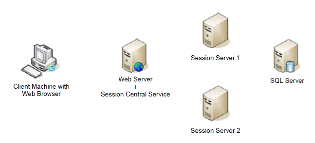
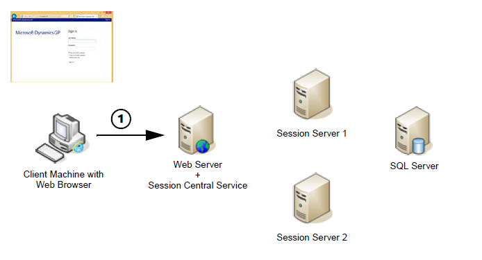
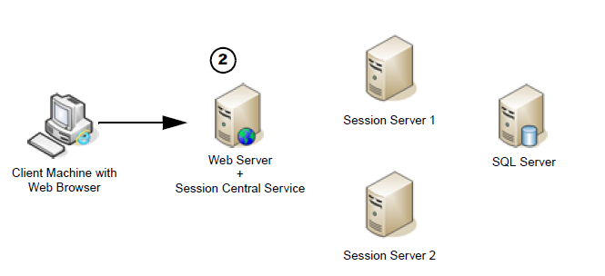
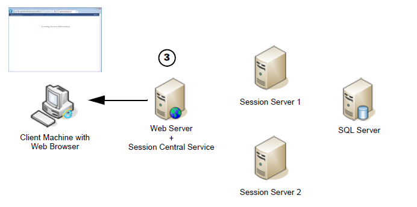
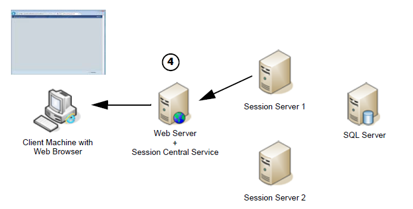
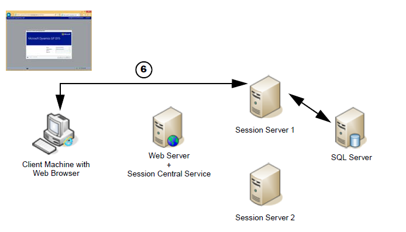
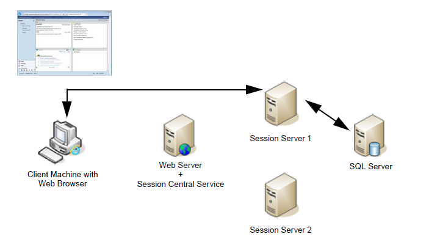

# Web Client Operation

It is important to understand how all of the components of the Dynamics GP web client installation work together as a user logs in, performs standard operations, and logs out of the web client. This information can be helpful when you are troubleshooting any issues with the web client. The following topics are discussed:

-   [Logon](#logon)  

-   [Standard operations](#standard-operations)  

-   [Logoff](#logoff)  

## Logon

The logon process has multiple steps, although most of them are not visible to the web client user. For simplicity, the log on process for a typical scale out configuration is described. The parts of the configuration are shown in the following illustration.

  

*1. User accesses the web client site.*

In the first step of the logon process, the client machine with a web browser accesses the URL for the Dynamics GP web client site. The logon page for the site is displayed.

  

*2. The user supplies their windows account credentials. *

Typically, these will be their domain credentials, but could also be their Organizational Account credentials. If the web site can verify that the user is allowed to access the Dynamics GP web client, the logon process is allowed to proceed.

  

*3. The Session Central Service directs the session request.*

Session information for the current user is retrieved.

  

The session Central Service performs several action to determine how it will direct the user ’s request.

-   It will determine whether the user has existing sessions already running on the session host machines. If one or more sessions exist, they are presented in a list for the user. The user can re-connect to an existing session or create a new session.

-   If no previous sessions exist, the Session Central Service will determine on which session host machine the new session will be created.

*4. The HTML application is loaded into the browser on the client computer.*

  

*5. The Session Service creates a new runtime session.*

On the session host machine that was chosen by the Session Central Service, the Session Service will create a new instance of the runtime service. This is the process that accesses the business logic in the application dictionaries and the data in the SQL database. It also communicates with the application to display the client user interface.

  

*6. The Dynamics GP application is displayed.*

After the connection is established between the HTML application on the client and the runtime session on the session server machine, the Dynamics GP application will start. If the user credentials can be matched to a Dynamics GP user account, the user will be signed in. Otherwise, the login window will be displayed.

  

## Standard operations

When a user logs on to the Dynamics GP web client, a connection is created between the HTML application that is loaded in the web browser and the runtime session that is created on the session host server. After this connection is established, the web server that hosts the site for the Dynamics GP web client does not play any part in the interaction.

  

The connection between the HTML application and the runtime session transmits all of the information needed to present the application user interface, as well as any input supplied by the user. The runtime session on the session server machine interacts with the SQL Server database, just as the Dynamics GP desktop client would.

If the user is disconnected, such as by closing their web browser without logging out of Dynamics GP, the runtime session on the session server machine will remain running. The next time the user logs in, that existing runtime session will be found by the Session Central Service. The user will have the option to reconnect to that existing session and continue where they left off.

## Logoff

When the user clicks the Exit GP link in the upper-right corner of the Dynamics GP web client window, the standard Dynamics GP logoff procedure is performed. The connections between the runtime session and the SQL Server are closed, and the runtime session is ended. The user is returned to the main logon screen for the Dynamics GP web client site
