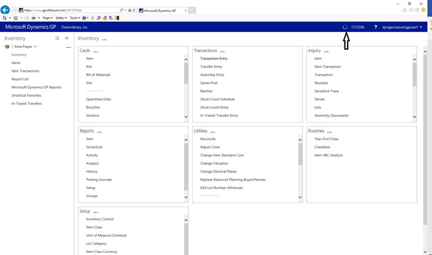
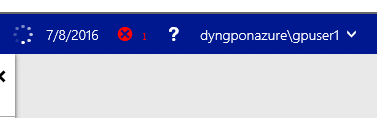
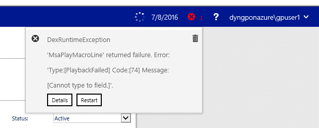
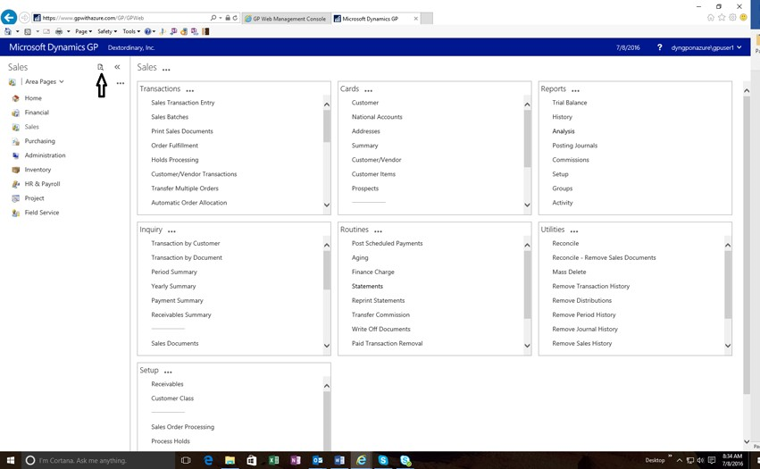
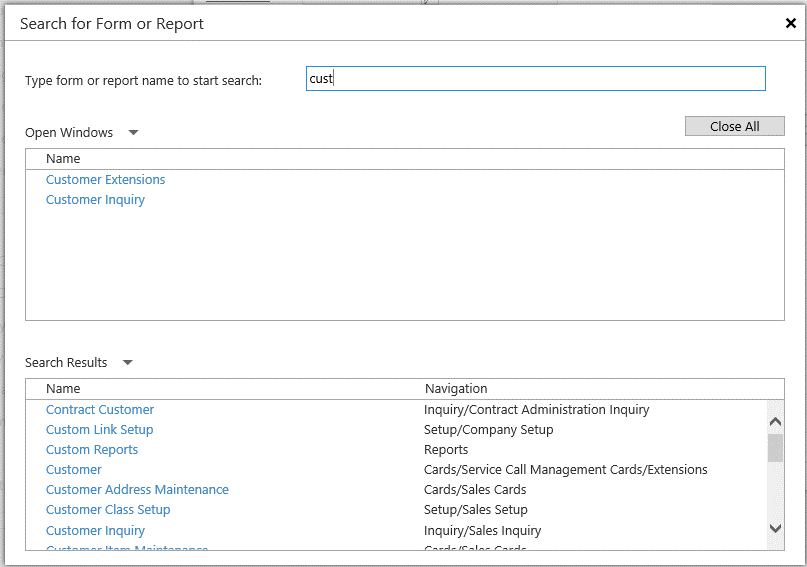
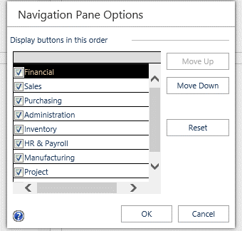
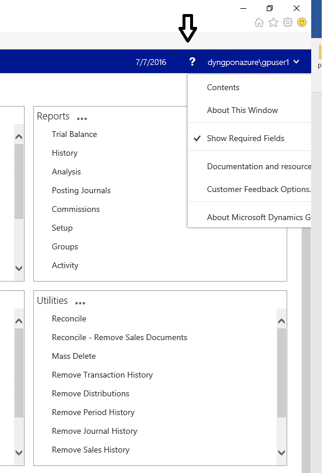
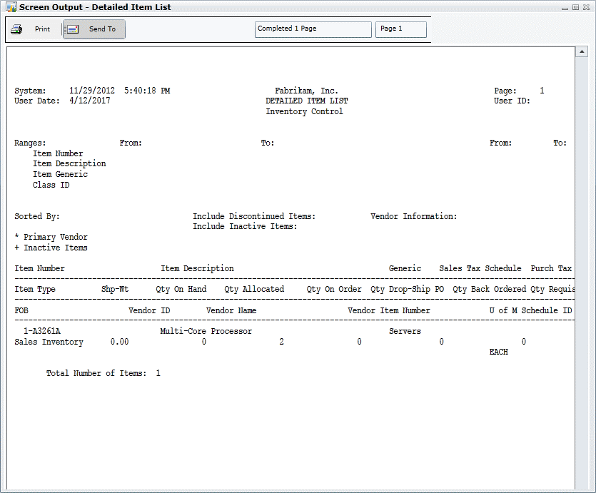

# Working with the web client

Working with the Microsoft Dynamics GP web client is very similar to working with the desktop client. This chapter provide information about functionality that is specific to the web client. It is divided into the following topics:

-   [Connection status](#connection-status)  

-   [Web client errors](#web-client-errors)  

-   [Accessing windows in the web client](#accessing-windows-in-the-web-client)  

-   [Changing the order of items in the navigation pane](#changing-the-order-of-items-in-the-navigation-pane)  

-   [Accessing help](#accessing-help)  

-   [Reports and Printing](#reports-and-printing)  

## Connection status

Use the Connection Status indicator in the upper right corner of the window to help you determine the status of the web client.

  

## Web client errors

In an error occurs with the web client, the details of the error may be accessible from the status bar at the top of the web client window.

  

In some cases when an error might occur that you cannot recover from, you can attempt to recover from the error using the Restart button on the error window. If you are unable to successfully recover in this way you will need to close your web client session and reconnect using the standard sign in procedure.

  

You can click the error icon to display the details of the error that occurred. The information provided can be helpful when you work with your system administrator to troubleshoot issues with the web client.

  

## Accessing windows in the web client

Search functionality provides an option for accessing and opening windows in the web client as an alternative to the standard navigation. The search window is opened from an icon at the top of the navigation pane.

Note that you’ll use the search window to locate and open multiple windows at the same time in the web client.  

  

To use this functionality, click the search icon to open the Search window. Begin typing the name of the window you’re looking for. As you type, the windows that most closely match the letters you type are displayed in the search window.

  

## Changing the order of items in the navigation pane

To the change the order, click the elipsis (...), and the click the Navigation Pane Options Setup dialog to rearrange the items.

  

The dialog allows you to change the order in which items are listed in the navigation pane.

  

## Accessing help

The Help menu is available in the status bar in the upper right corner of the web client window.

  

You can choose Contents to display help for the active application. You can choose About This Window to display context-sensitive help for the current window. The same Help menu items are available in the ribbon for most windows in the web client.

## Reports and Printing

You can use standard Report Writer reports, Report Writer reports with Word templates, and SSRS reports with the Microsoft Dynamics GP web client.

## Standard Report Writer reports

When you print a Report Writer report, you will see the standard Report Destination dialog. If you choose the Standard report type, and choose to send the report to the screen, then the report will be displayed in the Screen Output window.

### Standard Report Writer reports

When you print a Report Writer report, you will see the standard Report Destination dialog. If you choose the Standard report type, and choose to send the report to the screen, then the report will be displayed in the Screen Output window.

  

If you choose the Standard report type, and choose to send the report to the printer, you will be prompted to indicate whether you trust the application to print to the local printer. Click OK to allow printing to continue.

  

After the report has been sent to the printer, a dialog box is displayed to indicate that printing is complete.

### Report Writer reports with Word templates

When you print a Report Writer report and choose the Template report type, Microsoft Dynamics GP will use a Word template for the report. If a Word template has already been previously defined for the report, that template will be used. If no template has been defined for the report, a template will be automatically generated by the Report Template Generator and used.

You will be prompted for a location where you want to safe the local report. If you have configured the application to run in trusted mode, you will be asked this only one time for your web client session.

The Microsoft Dynamics GP web client doesn’t remove any content from the location you specify. It’s up to you to be sure that any sensitive information is removed from the location that you choose on your local workstation.  

### SSRS reports

You can generate SQL Server Reporting Services (SSRS) reports from the web client. These reports are rendered in a separate web browser window.
