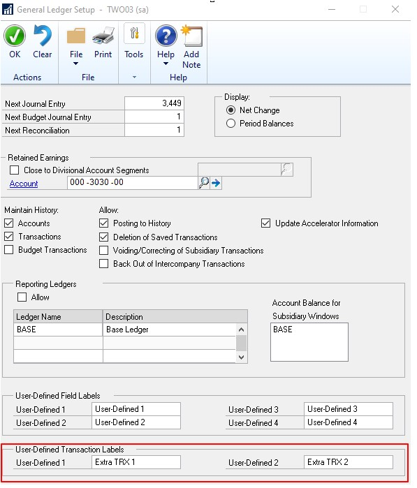
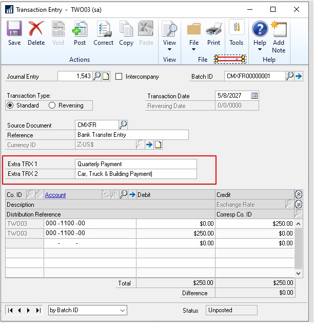
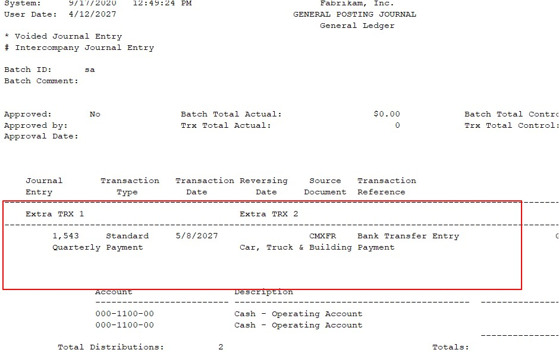
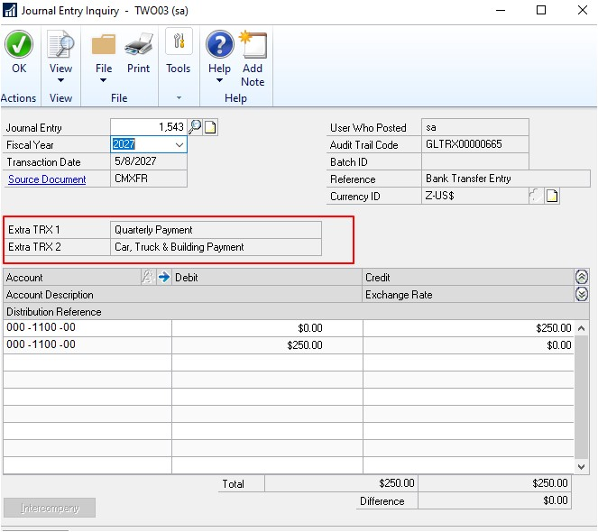
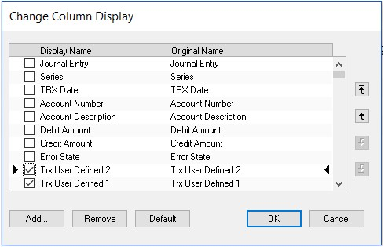
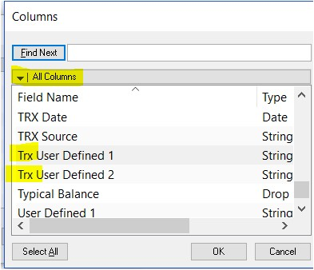

---
title: Additional User-Defined Fields
description: New in october 2020 - Additional User Defined Fields
ms.date: 10/01/2020
ms.topic: article
ms.prod: dynamics-gp
author: theley502
ms.author: theley
manager: jswymer
---

# Additional User-Defined Fields in General Ledger Transaction Entry

In the **General Ledger Transaction Entry** window, there are now two new user-defined fields. When users enter transactions into the General Ledger, they like to add information/comments regarding the transactions. User-defined labels for the user-defined fields are at the bottom of the **General Ledger Setup** window.

Go to the **Financial** Home Page, under **Setup**, choose **Financial**, and then choose **General Ledger**.

The field length for the user-defined labels is the same as the other user-defined label fields, namely 15. The size of the user-defined fields is 30 characters in the transaction entry window.

The user-defined fields are added to the following reports:

* Edit list
* Posting journal

The fields are available in Report Writer to be added to other reports as needed.

## Set up the user-defined fields

Go to the **Financial** Home Page, under **Setup**, click **Financial**, and then choose **General Ledger**.

To see the user-defined fields that you set up earlier, you can go to **Transaction**, choose **Financial**, and then choose **General**.

The following image shows an example report for the **General Posting Journal**.

Once a transaction has been posted with user-defined information populated, you will be able to see this in the *inquiry* windows. Located under the **Financial** Home page, choose **Inquiry**, then **Financial**, and **Journal Entry Inquiry**.  

You can also add the new fields to a SmartList, not least with the new feature to quickly add multiple fields at once to a SmartList. For more information, see [Bulk-edit SmartList Columns](bulk-edit-smartlist-columns.md).  

## Table Changes

| **Table Physical Names**   | **Table Technical Name** | **New field**        |
|-----------------------------|---------------------------|-----------------------|
| GL20000                     | GL\_YTD\_TRX\_OPEN        | User\_Defined\_Text01 |
| GL20000                     | GL\_YTD\_TRX\_OPEN        | User\_Defined\_Text02 |
| GL30000                     | GL\_YTD\_TRX\_HIST        | User\_Defined\_Text01 |
| GL30000                     | GL\_YTD\_TRX\_HIST        | User\_Defined\_Text02 |
