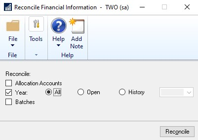
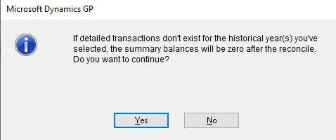

---
title: Automate Financial Full Reconcile 
description: new in October 2020 - Automate Financial Full Reconcile
ms.date: 10/01/2020
ms.topic: article
ms.prod: dynamics-gp
author: theley502
ms.author: theley
manager: edupont
---

# Automate Financial Full Reconcile

In the Reconcile Financial Information window, from the Financial Home page, choose Utilities, select Financial and then Reconcile, users can now choose "ALL" for all years to be reconciled from the oldest year to newest year. Prior to this new feature, users would have to reconcile one year at a time.

The process will complete one year before it starts reconciling the next year. Just like now we don't allow the user to select another year until the first reconciliation is complete.

> [!TIP]
> This is still the same dexterity process we have had in the past and may cause performance slow down if you do all years depending on data set

A warning message will appear if detailed transactions do not exist for any historical years selected.

