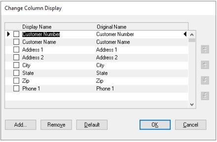

# Bulk-edit SmartList Columns

With the October 2020 release of Dynamics GP, you now have the ability to bulk-edit the columns on a SmartList.  

In order to see this new functionality you will need to start by opening SmartList (choose **Microsoft Dynamics GP**, and then choose **SmartList**). You'll then navigate to the specific SmartList that you want to edit, such as the default **Sales**, then choose **Customers**, and then choose the **Columns** button:

When the **Change Column Display** window opens, you'll notice that there is a new column with checkboxes.

If you want to remove more than one column you can mark them, then click Remove.

Similarly, if you mark multiple columns and use the arrow buttons on the right you can reorder more than one column at a time.

