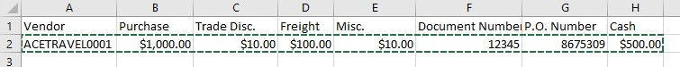
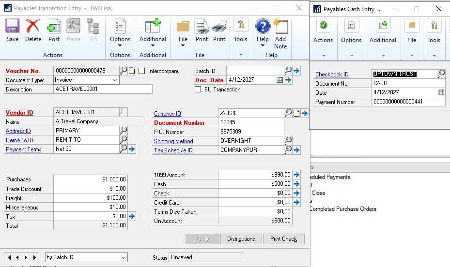

---
title: Copy/Paste Purchasing transactions from Excel 
description: New in October 2020 - Copy/Paste Purchasing transactions from Excel
ms.date: 10/01/2020
ms.topic: article
ms.prod: dynamics-gp
author: theley502
ms.author: theley
manager: edupont
---

# Copy/Paste Purchasing transactions from Excel

We all know how much our users like the Copy and Paste functionality in General Ledger, why not add it in other areas? The new feature enables users to define purchase transactions, along with distributions, and import them into the Payables Transaction entry window in GP. This will improve efficiency, reduce rekeying errors, and enhancement user experience.

With this feature, you can choose to do distributions or not, similar to our General Ledger copy paste.

Use the Transaction Entry window to copy/paste PM Transactions and PM Distributions.

The Excel Spreadsheet must have the required fields in this order to copy paste correctly; not all amount fields need to have an amount. You must copy/paste all data fields only; do not include the header fields.

- Vendor

- Purchases

- Trade Discount

- Freight

- Misc.

- Document Number

- P.O. Number

- Cash - if the cash field has an amount, the Payables Cash Entry window will automatically open after clicking the "Paste" button.

In the Payables Transactions Window found under Purchasing, click Transactions, and choose Transaction Entry. Choose the Vendor ID and put your cursor in the 'Purchasing' field and then click the 'Paste' button in the tool bar.

> [!TIP]
> This feature will also work in Web Client.

> [!TIP]
> Like General Ledger copy and paste, if you mark the Intercompany checkbox the Paste option is unavailable.

Distributions will default from the Vendor record unless you paste in distributions. It is not required to do distributions.

In the Payables Transactions Window found under Purchasing, click Transactions, and choose Transaction Entry. Choose the Vendor ID, click Distributions, copy lines from Excel, Select Paste option from the menu which will populate the information. Close the Distribution window, if you are prompted with a warning you can choose OK.

Now paste the rest of the payable's transaction once the distributions are copied.

