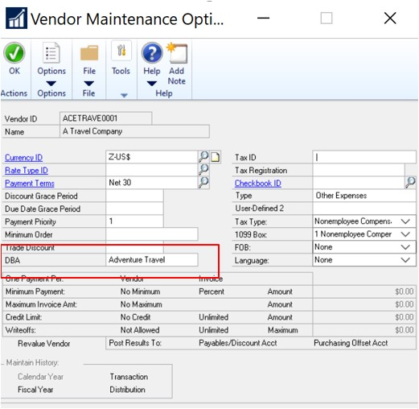
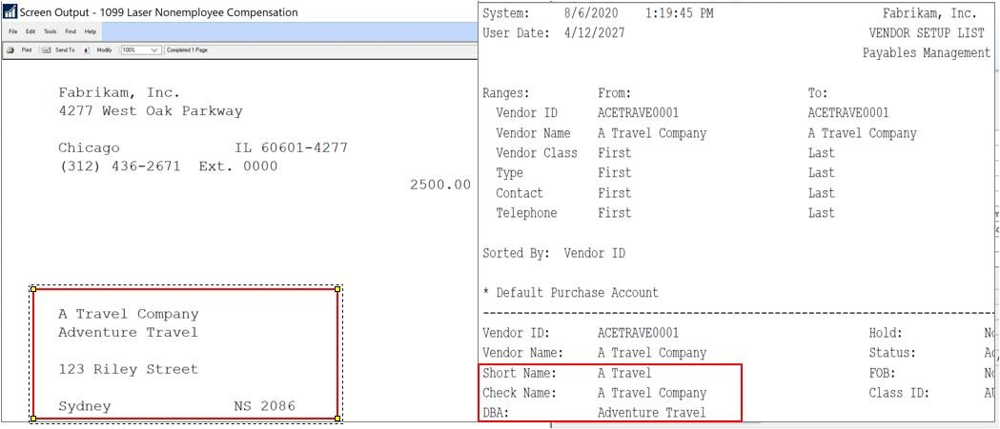

---
title: DBA for Vendor 
description: New in october 2020 - DBA for Vendor
ms.date: 10/01/2020
ms.topic: article
ms.prod: dynamics-gp
author: theley502
ms.author: theley
manager: edupont
---

# DBA for Vendor

When a business is created in the United States or Canada many times, they have the option of using a DBA, or "Doing Business As" name, in addition to the legal entity name. The DBA name is the operating name of the business, or how the business is known to customers, or operating name. As opposed to the legal name of the business.

Vendors that have a DBA name, in addition to the legal company name, and want to have the DBA name appear on the 1099 that is issued to them, can now do so.

Add DBA (Doing Business As) field to the Vendor maintenance window, reporting and 1099s.

It is common for companies to have a legal name registered but do business under another name, the name customers see. The feature enables the user of both the legal name of a company and DBA.

From the Purchasing home page under Cards, choose Vendor and click Options

> [!NOTE]
> This feature will be rolled back to Microsoft Dynamics GP 2016 in the 2020 Year-end update.

By default, this was added to the following reporting:

A column (Char, 65 in length) was added to the PM00200 table, VENDDBA This new field will be in all country installs for Dynamics GP.  
No changes were made for this new field in eConnect or Integration Manager

