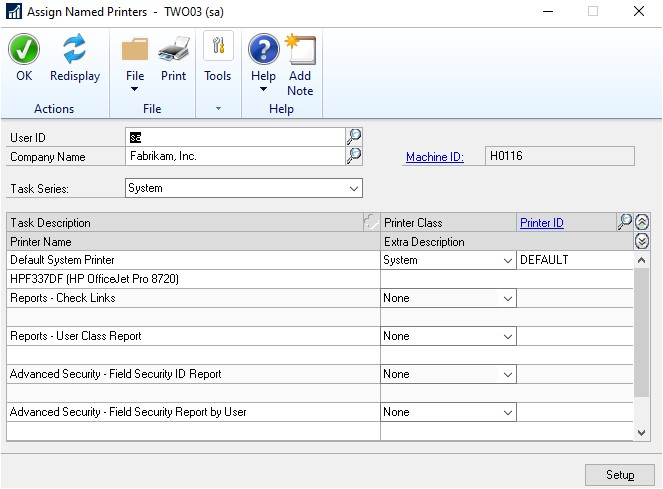
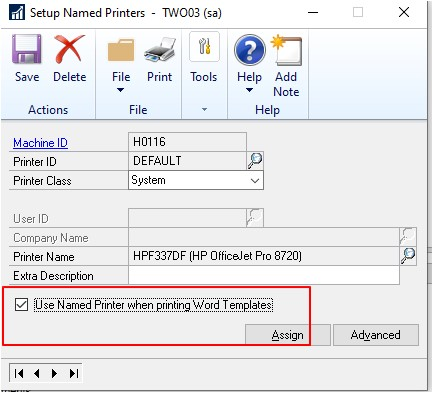

---
title: Disable Print Dialog when Printing to Word 
description: New in October 2020 - Disable Print Dialog when Printing to Word
ms.date: 10/01/2020
ms.topic: article
ms.prod: dynamics-gp
author: theley502
ms.author: theley
manager: edupont
---

# Disable Print Dialog when Printing to Word

With the October 2020 update for Dynamics GP, you can now use Named Printers with Word Templates. This lets users access full one-click printing when using Word templates.

To enable this feature you must first have Named Printers setup, you can find instructions for a new setup at [https://docs.microsoft.com/en-us/dynamics-gp/installation/systemadminguide#setting-up-namedprinters](../installation/systemadminguide.md#setting-up-named-printers).

Once you have the basic Named Printers setup, you can mark each printer to use Named Printers for Templates. Just open the Assign Named Printers window. Go to Tool, click setup, choose system, and click Named Printers.

Once you open this window, all you need to do is click the Setup button and select the Printer ID the users usually use, then mark the 'Use Named Printer when printing word Templates' checkbox. Click Save on the Setup Named Printers window, and now when users click print the document will be sent directly to the printer after generation.

> [!NOTE]
> There is a new column (UseNamedPrnForWordTemplate) added to the System (Dynamics DB) table STN41100, ST\_Printer\_Options\_MSTR.
