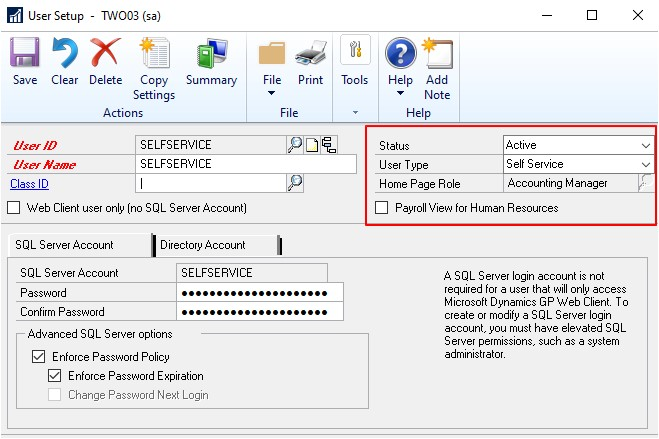
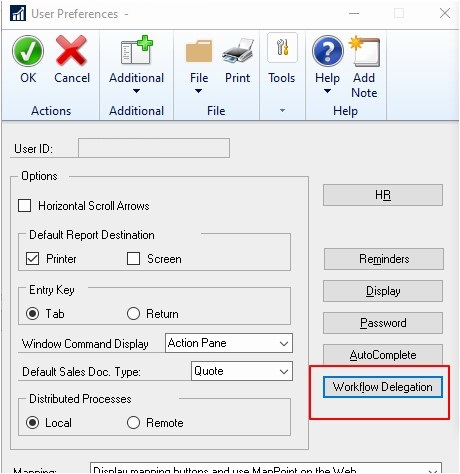
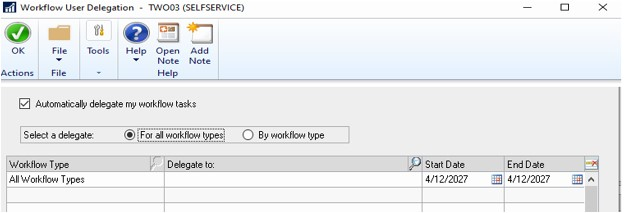

---
title: Enable Self-Service User Type Access to User Preference 
description: New in October 2020 - Enable Self-Service User Type Access to User Preference
ms.date: 10/01/2020
ms.topic: article
ms.prod: dynamics-gp
author: theley502
ms.author: theley
manager: edupont
---

# Enable Self-Service User Type Access to User Preference

Enable Self Service user types the ability to manage User Preference and Workflow Delegation settings.

This feature is pretty self-explanatory and was a long-time request by our customers. You need to access this window to set delegation and if you are a manager setup as a user type of self service prior to Dynamics GP 18.3, you could not access this window to set up delegation.

In the user setup, I have a user setup as a self-service user type. You can access this by choosing Tools, then Setup, click System and then choose User.

The access to this window is under Dynamics GP, click User Preferences then choose the Workflow Delegation option.

