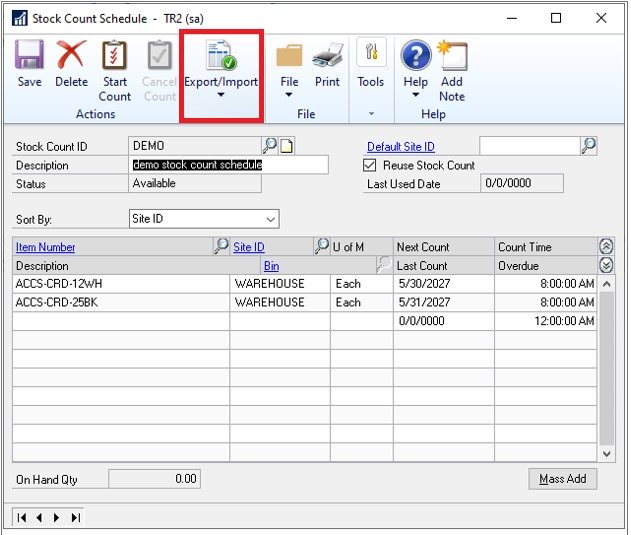
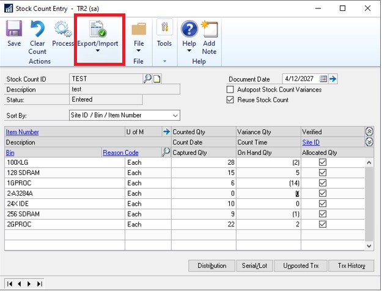
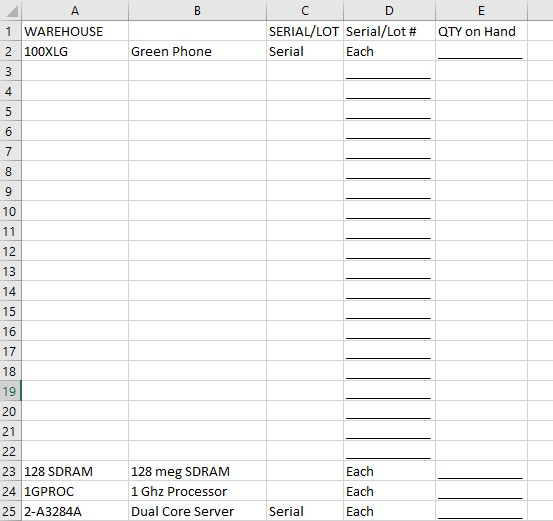

# Export/Import Stock Counts to Excel

With Stock counts, you now have the ability to export and import data with Excel within the Stock Count windows giving you more flexibility with this process.

The Stock Count Schedule window now has a new action called Export/Import. This will allow you the ability to export the data to an excel file. The Export/Import Action will not be available until the Start Count action has been selected. If the Cancel count option has been selected, the export action will be disabled again. The export can be done several times as long as the count has been started.

The export action will create a file called *stockcountmmddyy.xlsx* that you can save to a location of your choosing. From there, you can edit the file.

> [!IMPORTANT]
> We recommend you add in the qty, serial/lot numbers as you would if you were doing it manually in the stock count entry window.

> [!NOTE]
> Import action will not be available from the Stock Count Schedule window. Only Export is available.

To open the Stock Count schedule window, go to Inventory, click Transactions, choose Stock Count Schedule.

The Stock Count entry window also has the Export/Import action. Once you export the file in the stock count schedule, updated the information in the excel file you saved, you can come back to this window and choose the Export/Import button where you can import the excel file.

To open the Stock Count Entry window, go to Inventory click Transactions and choose Stock Count Entry.

The Excel file format should be modeled after the IV Stock Count Forms by Site ID report. This should give you the correct format to print off and do a stock count and then be able to put the right information into the Excel file. Refer to export2.csv file to see the formatting that should be used for the Excel file.

If the stock count is not in the status of "started" the import action will be grayed out. If you have already run an import, and you want to run another import on the same stock count, you will need to select the stock count ID and choose 'clear count'. This will reset the status to started.

Excel file example:

## Fields in the spreadsheet

A1 – Site ID; C1 - Header for Serial/Lot indicator; D1 - header for Serial/lot\#; E1 – header Quantity on hand

A2 Item Number; B2 Item Description; C2 indicator if item is serial/lot/blank; D2 UofM e2 Quantity that has been counted; D3-D… Serial \#s/Lot \#s that have been counted.

There is error logic if the format of the excel file has been edited. If there is missing information when trying to import, you should receive an error message that not all required information has been provided. The import should still complete and the stock count should be "saved". When saving the records, the status for the stock count will change to entered.

The user will need to open the stock count entry window and finish making edits to the count before they could finish the "process". We should NOT run the process of the stock count. We should only be importing the information and saving. The rest of the stock count process would need to be manually completed.

