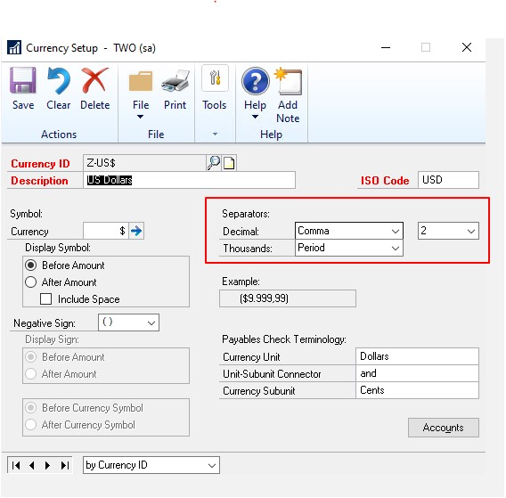

# Match Excel Copy and Paste Decimal Places to Currency Setup

In earlier versions of Dynamics GP, the Excel copy/paste function ignored the Decimal/Thousands separators in the Currency Setup. This is located by choosing Administration, then Setup, click System and then choose Currency.

When using the Excel Paste feature, Dynamics GP imports the data directly into the SQL tables. This does not interlace with the GP front end in any way. What this means is that this data is not checked against the Currency setup. This, therefore, means your settings for separators is not considered when using this feature.

Other currencies have spaces and periods for the thousand separators, and commas for the decimal separator. Prior to this fix, Excel copy/paste would use the period as the decimal separator, spaces, and periods as the thousand separators, and commas for the decimal separator; ignoring the currency setup and brought the data in incorrectly.

> [!NOTE]
> [This was a large REQUEST by our customers to change how this works ](https://experience.dynamics.com/ideas/idea/?ideaid=3ade4137-e639-e811-bbd3-0003ff68aa57)

With this new feature, Dynamics GP now recognizes the Excel copy/paste Decimal/Thousands separators in the Currency Setup window.

Eliminates rounding issues that are, sometimes, almost impossible to find.

This update will use the decimal places defined in currency setup instead of the data in Excel.

The value will be stored in SQL based on the currency decimal places defined in Currency Setup and not Excel.

> [!NOTE]
> In version 18.3, if you copy and paste in General Ledger and you see the error message *Decimal places do not match currency setup*, we recommend that you check the settings in the Excel file. Specifically, the format for the debit/credit columns must be **Number**, not **Accounting**. Also, make sure there are no extra spaces in the fields. You can also create a case and ask for a template if you still have problems with copy and paste not working.

