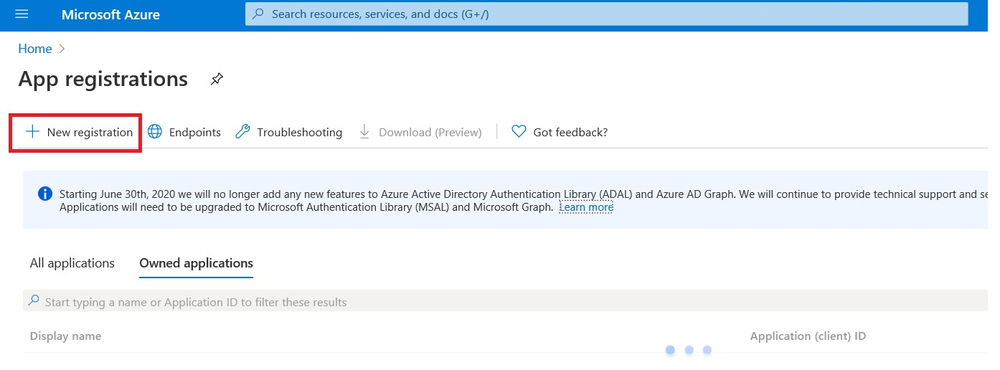
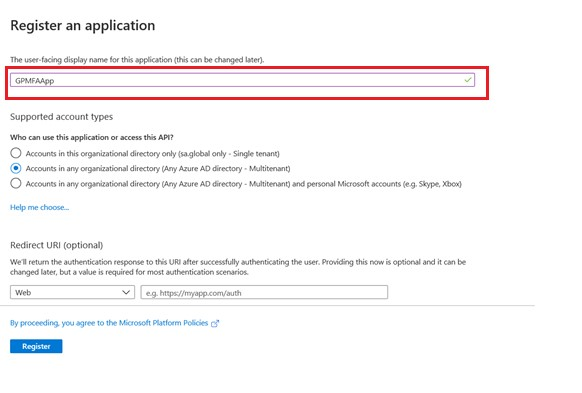
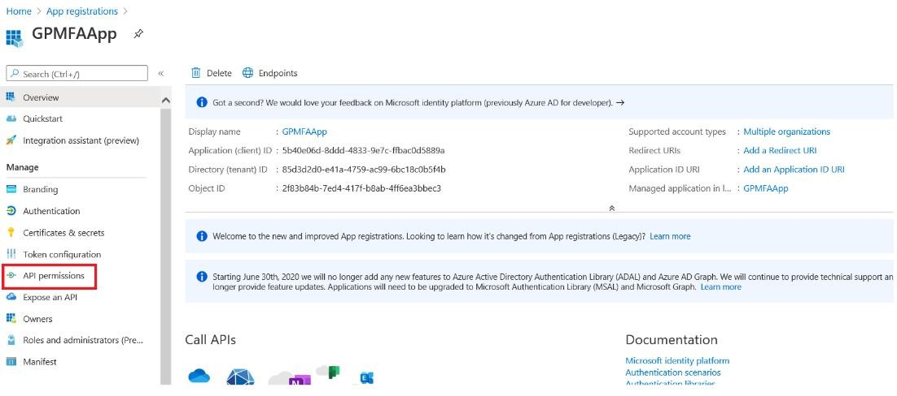
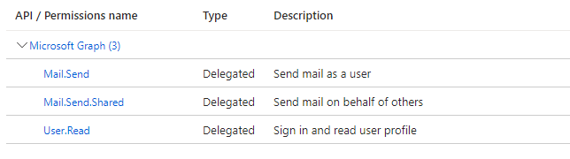
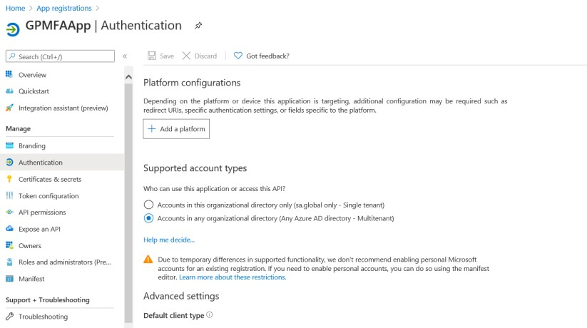
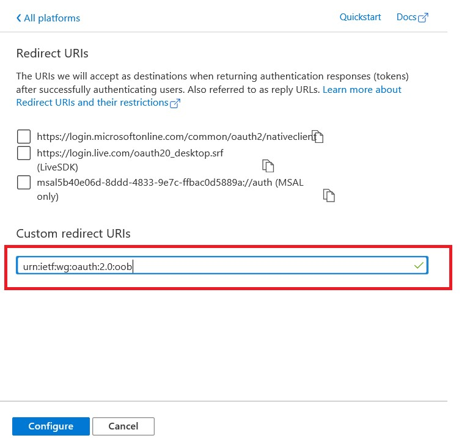
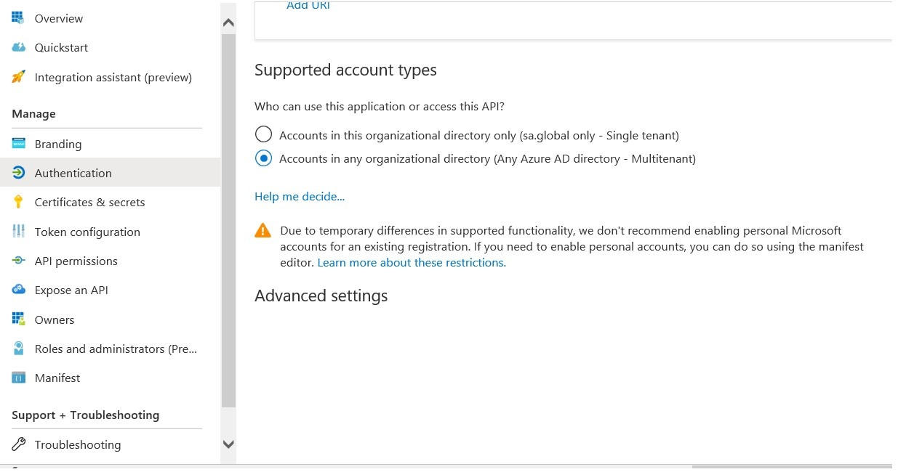
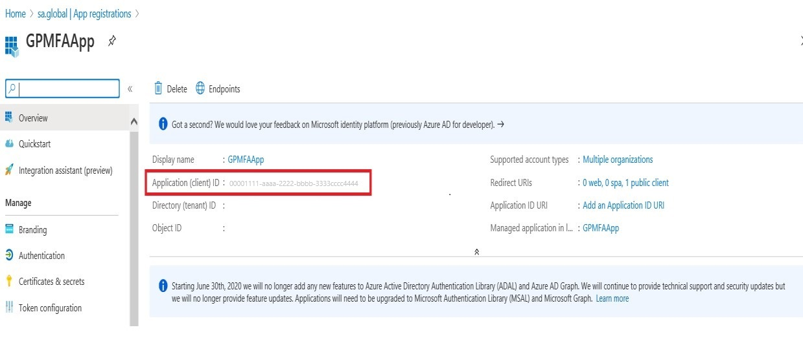

# Multi-Factor Authentication

[!INCLUDE [azure-ad-to-microsoft-entra-id](~/../shared-content/shared/azure-ad-to-microsoft-entra-id.md)]

Starting with the Dynamics GP October 2020 release, you will have the ability to use Multi-Factor Authentication for e-mail functionality. This new feature relies on a Microsoft Entra ID App Registration. In this first section we will go over how to perform the Azure side the of the configuration.

## Register the app

1. First, you'll need to have an administrator who can log into the [Azure Portal](https://portal.azure.com/).

2. In the search box, type *App Registration* and select that option:

    

3. Click on **New Registration** as shown in the below screenshot:

    

4. You will then choose settings for your new application.
   
    1. Enter a display name for the application (e.g. GPMFAApp)
    2. For **Supported account types** prior to the Fall 2023 (18.6) release, you were limited to the second option (**Account in any organizational directory (Any Microsoft Entra ID account – Multitenant)**).  If you are on 18.6 or later, you can also use the (**Account in this organizational directory only (%domain% only - Single tenant)**) option. Choosing the wrong option can lead to an Unknown Error when using MFA in Dynamics GP.

    

6. Click on Register button.

7. Click on API Permission on the left side panel as shown in the screenshot.

    

8. Click on Add permission button.

    

9. Microsoft Graph – By default, Microsoft Graph application will have read permission for the user profile. To allow a Graph application to send an email, we need to add some specific permissions.

    

10. Click on "Delegated permissions".

11. Search for "Mail.Send" in the Select permission search box.

12. Mark the "Mail.Send" and "Mail.Send.Shared" checkboxes and click on Add permissions.

    

13. Mail.Send and Mail.Send.Shared permissions will be added under Microsoft Graph.

    

14. Click on "Authentication" on the left panel under Manage option.

    

15. Click on "+Add Platform" and select "Mobile and desktop applications".

    

16. Enter the value "urn:ietf:wg:oauth:2.0:oob" in the Custom Redirect URIs text box as shown in the screen shot. This uri will redirect to the original application.

    

17. Click on Configure button

18. Save the changes for the application.

    > [!NOTE]
    > Multi-Factor (Modern Auth) Authentication is supported in Web Client with 18.5 release or later. 
    > [Refer to Web Client setup with Modern Auth](https://community.dynamics.com/gp/b/dynamicsgp/posts/modern-authentication-in-web-client)

    

19. Click on Overview on the left side pane. The Application (client) ID will be used in the Microsoft Dynamics GP client.

    

From the setup that was done in Azure, now launch Microsoft Dynamics GP 18.3 or later and go to Tools, Select Setup, choose Company and click Company E-mail Setup.  Enter the Application (Client) ID into this Desktop Properties section of this window.  

If you're using a Single tenant app registration you will also need to pull the Directory (Tenant) ID from the aboeve Overview window and enter that into the Tenant ID field.

> [!NOTE]
> There is a new column (MSGraphClientID) added to the company table SY04900, syEmailSetupOptions.
