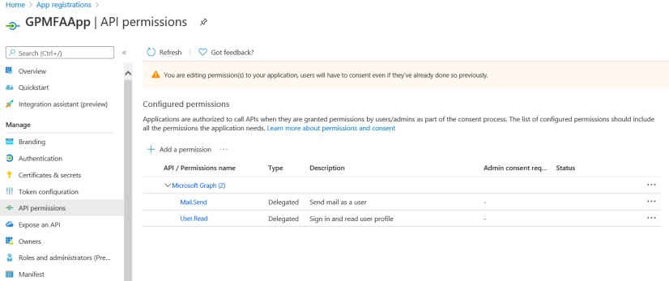
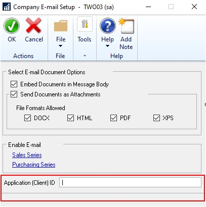

---
title: Multi-Factor Authentication 
description: New in October 2020 - Multi-Factor Authentication
ms.date: 10/01/2020
ms.topic: article
ms.prod: dynamics-gp
author: theley502
ms.author: theley
manager: edupont
---

# Multi-Factor Authentication

Starting with the Dynamics GP October 2020 release, you will have the ability to use Multi-Factor Authentication for e-mail functionality. This new feature relies on an Azure Active Director App Registration. In this first section we will go over how to perform the Azure side the of the configuration.

## Register the app

1. First, you'll need to have an administrator who can log into the [Azure Portal](https://portal.azure.com/).

2. In the search box, type *App Registration* and select that option:

    

3. Click on **New Registration** as shown in the below screenshot:

    

4. You will then choose settings for your new application.
    a. Enter a display name for the application (e.g. GPMFAApp)
    b. For **Supported account types** select the second option (**Account in any organizational directory (Any azure AD account – Multitenant)**) for most all configurations.             Choosing the wrong option can lead to an Unknown Error when using MFA in Dynamics GP.

    

5. Click on Register button.

6. Click on API Permission on the left side panel as shown in the screenshot.

    

7. Click on Add permission button.

    

8. Microsoft Graph – By default, Microsoft Graph application will have read permission for the user profile. To allow graph application to send an email, we need to add "Mail.Send" permission.

    

9. Click on delegated permission.

10. Search for "Mail. Send" in the select permission search box.

11. Mark "Mail. Send" checkbox and click on add permission.

    

12. Mail.Send permission will be added under Microsoft Graph.

    

13. Click on "Authentication" on the left panel under Manage option.

    

14. Click on Add Platform.

    

15. Enter the value "urn:ietf:wg:oauth:2.0:oob" in the Custom Redirect URIs text box as shown in the screen shot. This uri will redirect to the original application.

    

16. Click on Configure button

17. Save the changes for the application.

    > [!NOTE]
    > As of now, Multi-Factor Authentication is not supported in Web Client. Once the Web Client changes are implemented, Default client type must be set to "Yes" as shown in the screen shot.

    

18. Click on Overview on the left side pane. The Application (client) ID can used in the Microsoft Dynamics GP.

    

From the setup that was done in Azure, now launch Microsoft Dynamics GP 18.3 and go to Tools, Select Setup, choose Company and click Company E-mail Setup.

> [!NOTE]
> There is a new column (MSGraphClientID) added to the company table SY04900, syEmailSetupOptions.
