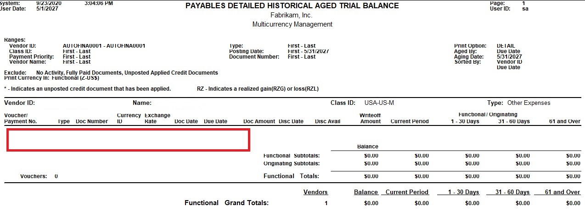

---
title: Removed Fully Applied Multicurrency Documents from PM HATB 
description: New in October 2020 - Removed Fully Applied Multicurrency Documents from PM HATB
ms.date: 10/01/2020
ms.topic: article
ms.prod: dynamics-gp
author: theley502
ms.author: theley
manager: jswymer
---

# Removed Fully Applied Multicurrency Documents from PM HATB

With Dynamics GP 18.3, you will now be able to Exclude Fully Applied Multicurrency documents from the PM Historical Aged Trial Balance report.

In earlier versions of Dynamics GP, if an invoice went through a revalue before it was paid, the document(s) (Invoice and payment) would print on the report even though they were fully applied. They would show with an aged total of $0.00 which made the report longer due to unnecessary data listed. 

Previously, in most cases the only workaround to removing these fully applied documents was to update in SQL the SettledGainLossCurTrxAmt field to 0.0000 in the MC020105. There were other scenarios as well with other field manipulations, but in all cases manipulation in the backend was the only solution to remove these types of documents from the report.  

This new change allows you, without manipulation to data in the backend, to print the report without seeing fully paid MC documents.

In the example below, an invoice that was entered, revalued, and then paid. Now when printing the PM HATB the documents are no longer listed. In previous versions the documents would appear.

