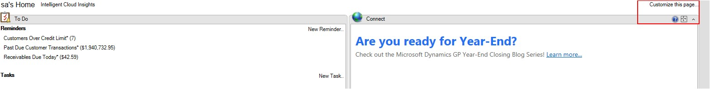
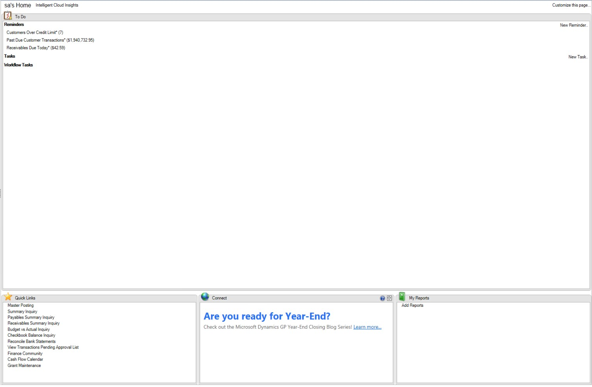

# Save Per-User Column Layouts of Home Page

In the Dynamic GP October 2020 release, users can customize and save the layout of their Home Page. To use this functionality you start by clicking on **Customize this page** in the upper-right corner of the Home Page:

You can then use bottom section of the Customize Home Page window to select the Column Layouts:

Also in this window you can select how you want the columns to stack when you maximize a specific section of the Home Page. For example, if you have it set to Bottom and in the Home Page you select the Maximize button:

The window will look like this with the columns stacked at the bottom of the page:

While the number of columns you want to display does not carry over to the module area pages (e.g. Financial, Sales, Purchasing, etc.) the column stacking option does. This will help maintain a similar experience as users navigate around Microsoft Dynamics GP.

The column number setting is held in the syHomePageLayout (SY08100) table in the system database. The SectionIDs in this table have the following values:

1 = To Do

1.  = Business Analyzer

2.  = My Reports

3.  = Quick Links

4.  = Connect

5.  = Time Management

6.  = Procurement

7.  = Project Time and Expense

8.  = PowerBI

The Column Stack setting is held in the syHomePage (SY08000) table, specifically the

ColumnStackPosition field

1.  = Top

2.  = Bottom

3.  = Right

4.  = Left

