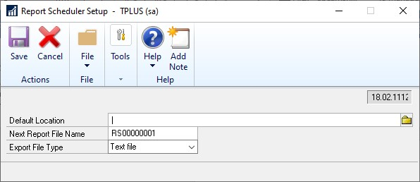
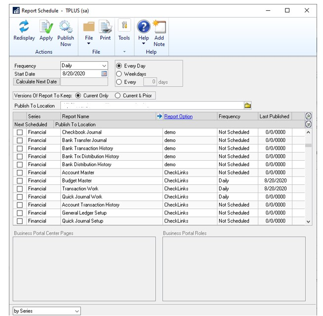
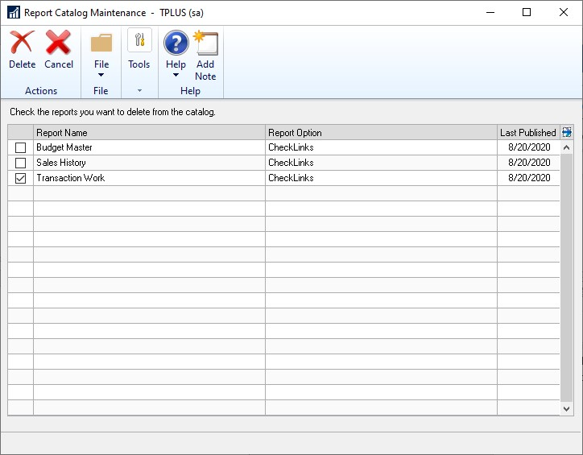

---
title: Schedule Check Links 
description: New in October 2020 - Schedule Check Links
ms.date: 10/01/2020
ms.topic: article
ms.prod: dynamics-gp
author: theley502
ms.author: theley
manager: edupont
---

# Schedule Check Links

With the October 2020 release of Dynamics GP, users can set up a schedule to run **Check Links** outside of normal business hours. This will let users run the processes without having to manually select the Check Links process. A customer can setup which logical file groups they want to run check links on. This process will utilize the Report Scheduler setup and functionality, so it will require that Microsoft Dynamics GP be open and logged into the correct company. Also, this feature is just scheduling the existing Check Links processes, so performance is not expected to be any different than manually running them. This is the same Dexterity code we all know and love in the Check Links process, it was not rewritten to anything different in the 18.3 release.

## Setup

In order to set a default location for the Checks Links reports to save you can go to Click Tools, choose Routines, select Company and Report Setup to open Report Schedule Setup. This is not a required step for scheduling Check Links.

To select which check links you want to schedule you will navigate to the Report Schedule window by choosing Tools, then click Routines, select Company and click Report Schedule:

This list will populate depending on what dictionaries you have loaded on the client you are logged into.

The Report Option for the new records will be "Check Links". You can choose the frequency of Daily, Weekly, or Monthly and you have further options for Every Day, Weekdays or every X number of days. If you had setup a default publish location in the Report Scheduler Setup window this will default to that location, otherwise you will need to enter a location before you are able to apply your selections.

If you want to remove reports from being scheduled, you would use the Report Catalog Maintenance window by choosing Tools, then click Routines, select Company and click Report Catalog Maintenance:

