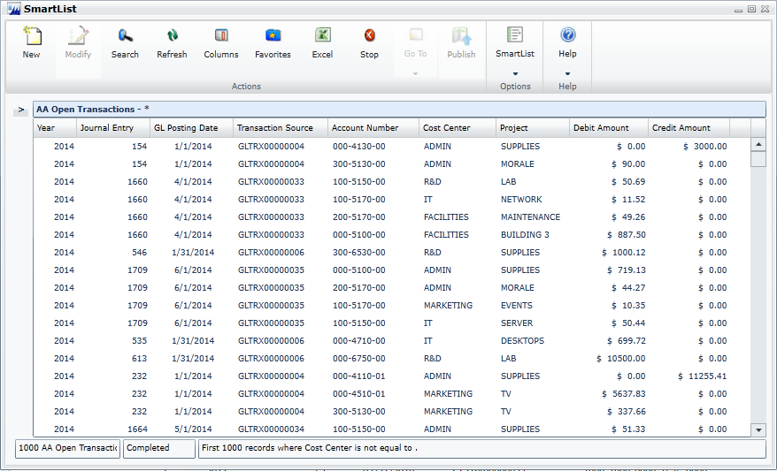
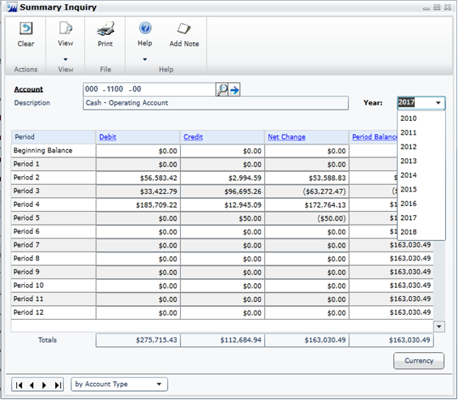
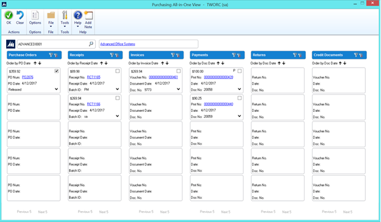

# What’s new in Dynamics GP 2015

This section describes enhancements that were added to the product since the release of Dynamics GP 2015. Some enhancements described in this documentation are optional and can be purchased through your Microsoft partner. If you currently have a license for one of these modules and have an active enhancement program, you automatically will receive the enhancements contained in that module.

## Workflow enhancements

### Workflow – Payables Transaction Approval

A new workflow type for Payables Transaction approval in Workflow Maintenance is now available. When you set up and mark this workflow active, the Payables Transaction Approval workflow type will allow you to submit and approve transactions in the Payables Transaction Entry window. Approval is also available through the email notification and the navigation lists. The PM Batch Approval workflow type is still available as well. If the PM Batch Approval workflow type and the Payables Transaction Approval workflow type are both Active the batch origin of Payables Trx Entry is not available for batch approval.

The Payables Transaction Entry window is the primary window for the Payables Transaction Approval workflow type. As soon as the data is entered or modified in the window, you can view the InfoBar, showing the status of the workflow. The Payables Transaction Entry window has Workflow action added to the ribbon.

The workflow process to follow is similar to the other workflow processes available in Dynamics GP.

You can define messages that can be sent out for workflow activities that are specific to the Payables Transaction Approval workflow type using the Message Setup window.

To approve a single transaction in the Payables Transaction Entry window, add the transaction to a batch and then follow the workflow process to Submit and approve.

### Workflow – Document Attachment

When a document has been added to a transaction or record using the Dynamics GP Document Attachment feature, these attachments can now be sent with the workflow task notification email. This feature is available for PM Batch Approval, Purchase Order Approval, Purchase Requisition Approval, Vendor Approval, and Payables Transaction Approval. For example, you can now enter a payables invoice, scan it and attach the record from the vendor, and then submit the invoice for approval. When the approver receives the email, they will get the invoice information and the attachment will show the scanned invoice from the vendor.

A new checkbox is added in the Workflow Maintenance window for the specified workflow types, which when selected will allow you to send the document attachment documents for Workflow Assignment type messages.

The prerequisites to make this checkbox available are:

- The Allow Document Attachments checkbox must be marked in the Document Attachment Setup window (Administration – Setup – Company – Document Attachment Setup).

- The Send Message checkbox above it in the Workflow Maintenance window is marked.

You can now email Document Attachment documents when the messages are sent through workflow. All attachments will be sent in the order they are attached. Attachments from the header will be first, then attachments from line items.

You can view the status of the document attached in the Document Attachment Status Inquiry window (Document Attach &gt;&gt; Attach (Document Attachment Management) &gt;&gt; Line expansion next to Date). A new status called Workflow Message has been added.

## Platform enhancements

### Service Based Architecture

Service Based Architecture (SBA) is a functionality delivered as a service call over https that adheres to the pattern of Service Oriented Architecture. Service Oriented Architecture (SOA) is a software design and software architecture design pattern based on distinct pieces of software providing application functionality as services to other applications. In layman’s terms, it is a service that exposes functionality in Dynamics GP that can be accessed using a URI (Uniform Resource Identifier). This allows a user to access the modules in Dynamics GP.

Currently, the Timecard functionality in HR and Payroll in Dynamics GP is also available on SBA which allows it to integrate with the Time Management App. The user who wants to use the Time Management App needs to be granted access to the SBA objects in the Security Task Setup window.

SBAs allow you to log into the ERP modules through an app, which seamlessly integrates the data flow between them. The app may be installed on any platform.

The following SBA objects are added to facilitate the Timecard Management Application integration into Dynamics GP 2015 R2:

| **Objects**                       | **Module in which the object is added**   |
|-----------------------------------|-------------------------------------------|
| ServiceGetHRAttendanceInfo        | Human Resources                           |
| ServiceGetTimeCodesListAll        | Human Resources                           |
| ServiceGetWorkflowListAll         | System                                    |
| ServiceGetWorkflowListByType      | System                                    |
| ServiceCreateTimeCard             | Payroll                                   |
| ServiceCreateTimeCardLines        | Payroll                                   |
| ServiceDeleteTimeCardLine         | Payroll                                   |
| ServiceGetActiveTimeCardList      | Payroll                                   |
| ServiceGetApprovedTimeCardList    | Payroll                                   |
| ServiceGetEmployeeDetails         | Payroll                                   |
| ServiceGetPayCodesListAll         | Payroll                                   |
| ServiceGetPayScheduleAll          | Payroll                                   |
| ServiceGetRestrictionCode         | Payroll                                   |
| ServiceGetSubmittedTimeCardList   | Payroll                                   |
| ServiceGetTimeCard                | Payroll                                   |
| ServiceRecallTimeCard             | Payroll                                   |
| ServiceSubmitTimeCard             | Payroll                                   |
| ServiceUpdateTimeCardLine         | Payroll                                   |
| ServiceGetHRAttendanceInfo        | Human Resources                           |
| ServiceGetTimeCodesListAll        | Human Resources                           |
| ServiceGetWorkflowListAll         | System                                    |

### Scriptable Provisioning & Management

To deliver Dynamics GP as a cloud offering, you must be able to centralize and automate the provisioning and management of the application. A number of new cmdlets have been added to the Dynamics GP PowerShell module, which make automated provisioning easier. The additions include cmdlets for installing the runtime and other components, creating the GP system and company databases, and adding tenants along, among others. Automating these tasks speeds up delivery and minimizes human involvement, reducing cost and the possibility of human error. View the PowerShell Users Guide for a complete list of the available cmdlets.

## Reporting enhancements

### Display Debits before Credits

In the Dynamics GP 2015 R2, the Debit column is moved to display before the Credit column by default in account transaction reporting options in which the Credit column previously displayed before the Debit column. This applies to SmartLists and excel Reports and the associated data connection, as well as the database tables and views on which the reports are based.

### Default SmartList Visibility 

When creating a new SmartList Favorite, system administrators now have the option to select a default value for to whom the SmartList Favorite will be visible, including the following options: System, Company, User Class, and User ID. System is the default option selected for the visibility. By adding this option to select a default value for the Default SmartList Visibility drop-down list, system administrators can select to whom new SmartList Favorites, by default, will be visible, and make them visible by default only to the user creating the Favorite. This will help reduce clutter in other users’ SmartList Favorites and allow administrators to more easily manage and clean up the lists.

Follow these steps to define the default selection for visibility to users.

1. Open the System Preferences window.
Administration &gt;&gt; Setup &gt;&gt; System &gt;&gt; System Preferences.

2. In the Default SmartList Visibility drop-down, select the option to default in the Visible To drop-down list when adding a new SmartList Favorite.

### Workflow SmartList Designer Create View Approval

You can now define workflow for creating views within a SQL database. Within SmartList Designer you can send a SmartList through workflow to create a SQL view based on the SmartList query. The SmartLists with the workflow status of Completed can then be used to publish refreshable Excel reports. The views which are created can also be used outside of SmartList Designer and Dynamics GP 2015 R2 for other reporting needs. The primary purpose of the workflow type is to define the user(s) that can create the view within the SQL database. Only specific users have access to create objects within the SQL database and creating a workflow will allow those users insight into the views needed to be created. You must have setup one active workflow in order for the SQL view to go through the approval process. Set up SmartList workflows from the Administration series within the Workflow Maintenance window.

### Historical Received Not Invoiced Report

The Historical Received Not Invoiced report (SRS) is a report that details the Purchase Orders and Receipts and Invoices that have been matched against the Purchase Orders. This report will be created using SQL Reporting Services Report Builder 3.0. You can specify a cutoff date based on transaction date or GL Post Date to use the report for Historical purposes. This new report will be different in the fact that it will look at each document and the date (transaction or GL Post Date) to determine if the transaction should print on the report. If the date falls within the cutoff date the user entered, the transaction will print on the report. This report will allow users to see what was received into inventory but not invoiced yet as of a specific date. This report will be a new report separate of the received not invoiced report.

### Mask Employee Social Security Number on Reports

You have the ability to mask the employee’s Social Security Number on specific payroll reports that you generate. Access the Report Masking window (HR & Payroll&gt;&gt;Setup&gt;&gt;Payroll &gt;&gt; SSN Mask) and mark the checkbox next to each report you want to apply the mask to and select OK. When the selected report is generated, the Social Security Number value will appear as XXX-XX-XXXX on the report.

### Analytical Accounting Transaction Lists

The SmartLists and Excel Reports for Analytical Accounting (AA) transaction information now include more of the data that is tracked by AA. The SmartLists and Excel Reports are also modified to display each AA dimension as a column in the list, rather than having a single column for all AA dimensions. For example, the below SmartList shows how the list would display for a company tracking Cost Center and Project as AA transaction dimensions. You can summarize and work with the data in Excel using pivot table functionality.

  

### Combine General Ledger Inquiry

In Dynamics GP 2015 R2 in General Ledger, you can view open and historical information in the same window for Summary Inquiry, Detail Inquiry and for Account Summary. Any Go Tos or drill backs will now go to the single window instead of the user picking open or history.

  

## Purchasing and sales enhancements

### Purchasing all-in-one view

A Purchasing All-in-One View window is now available for locating vendor records and displaying related purchasing documents in the same window. For example, suppose a vendor calls asking about a specific payment. You can use the Purchasing All-in-One View window to select that vendor and then view all documents related to the payment, such as the PO, receipt, invoice, credits, miscellaneous charges and finance charges, and payment to assist you in responding to your vendor’s inquiries.

You can access the Purchasing All-in-One View window from the following windows and navigation lists:

- Your home page

- Vendor Maintenance

- Purchase Order Processing Document Inquiry

- Vendor Inquiry

- Payables Transaction Inquiry - Vendor

- Payables Transaction Inquiry – Document

- Purchase Order Processing Document Inquiry

- Purchase Order Processing Item Inquiry

- Navigation Lists and any views of these lists

- Vendors

- All Purchasing Transactions

- Payables Transactions

- Purchase Order Transactions

The icon for the Purchasing All-in-One View window is available only if a single record is selected in the navigation list. The data that’s displayed in the Purchasing All-in-One View window depends on your selection in the navigation list. For example, if you select only a vendor record in the navigation list, the vendor ID and name information are displayed in the Purchasing All-in-One View window. If you select a transaction in the navigation list, the vendor ID, name and transaction information are displayed.

  

When you open the Purchasing All-in-One View window from Purchasing &gt;&gt; Inquiry &gt;&gt; All-in-One View, or Home &gt;&gt; Quick Links &gt;&gt; All-in-One View, the window opens without any data. You can specify the vendor and the details of the information to display in the window. Mark the checkbox in the upper right corner of the document to display only the related documents.

The Options button allows you to select which columns and document types to display in the window. For example, if you don’t use Purchase Orders, clear the Purchase Orders selection and the first column displays receipts. The Credit Documents column marked to display by default, but with this column marked, up to six columns of data can be shown. You can view the last five transactions by document date, arranged by the newest to the oldest in each column. Use the sort order (**˅** or **˄**) buttons to change the order for transaction information. You can view the next set of transactions by clicking Next 5.

Each section displays a summary of the transactions that you select to display in columns in the window. Click the down arrow (**˅**) icon to view the details and return to the summary display by clicking the up arrow (**˄**) icon. The filters provided in the section’s heading open a pop-up window that lets you apply additional filters, as well as search for a specific transaction. The clear filters icon will reset the filters back to the default selection.

### Automatically Deposit Cash Receipts

You can now opt to have cash receipts entered in Receivables Management directly update the checkbook balance without the need to manually post the cash receipt deposit in Bank Reconciliation. To select the option, mark the “Automatically post cash receipt deposits” checkbox in the Company Setup Options window. When this option is marked, cash receipts entered in Cash Receipt Entry, Receivables Transaction Entry, Sales Transaction Entry, and Invoice Entry and on return documents in Payables Transaction Entry will be deposited automatically in the checkbook, updating the checkbook balance.

The option to automatically post cash receipts was earlier available only to those customers who had Analytical Accounting installed. This option is now available to all customers.

### Date effective tax rates

The ability to enter the tax rates in advance for transactions, and calculate the taxes based on the rates specified for a date range, has been added to the main dictionary. This functionality includes the ability to recalculate taxes for saved transactions by modifying the tax rates that are used based on the latest tax rates, which are specified by tax authorities. You can mass modify the tax rates, and regenerate the taxes for the saved transaction batches.

Follow these steps to create the set up for the date effective tax.

1. Open the Company Setup Options window.

2. Dynamics GP &gt;&gt; Tools &gt;&gt; Set up &gt;&gt; Company &gt;&gt; Company &gt;&gt; Options

3. In the Company Setup Options window, mark the Enable Tax Date checkbox, to allow you to use the tax date option for calculating the tax rate for the transaction based on Tax date.

4. Mark the Use Date-effective Tax checkbox. Select the option to calculate the tax. The option that you select here is used for updating the taxes for saved transactions within the tax effective date range. Transactions that are corrected will be based on the date you select here. You can select the Document date, or Posting date or the Tax date to calculate the tax.

> [!WARNING]
> Select posting date if you want to calculate tax based on the posting date that you specify. Select Tax date if you want to calculate tax based on the tax date that you specify. Select Document date if you want to calculate tax based on the document date that you specify.  

You must set up the date range for the specified Tax ID for GP 2015, to calculate the tax amount or percentage for the transaction. Follow these steps to create the date range for the tax ID.

1. Open the Date Effective Tax Rates window.

2. Dynamics GP &gt;&gt; Tools &gt;&gt; Set up &gt;&gt; Company &gt;&gt; Tax Details &gt;&gt; Select the tax ID in the Tax Detail ID field to set up the date range for &gt;&gt; Date effective Tax Rates.

3. Specify the date range for the specified tax amount or percentage.

You can mass modify the tax percentage of multiple tax IDs. You can choose to modify the tax percentage or amount for the taxes detail or the tax type based on date range, or for the tax without any specifying any date range, or both. Follow these steps to mass modify the tax percentage.

1. Open the Mass Modify Taxes window.
Dynamics GP &gt;&gt; Tools &gt;&gt; Utilities &gt;&gt; Company &gt;&gt; Mass Modify Tax Percentage

2. Select the option to modify the tax percentage. You can choose:

- Date effective Tax – To update the dates specified in the date range, and the percentage that you have specified in the Date effective Tax rates window.

- Tax details – To update the tax percentage that you have specified in the Tax Detail Maintenance window.

- Both – To update the tax percentage that you have specified in the Date effective Tax rates window, and in the Tax Detail Maintenance window.

3. Click Insert to view the list of the tax IDs listed for the modification.

> [!WARNING]
> Within the specified Tax IDs, if you do not want to modify any Tax ID, you can select the Tax ID record, and click Remove.  

4. Click Modify to modify the listed Tax IDs based on your specifications.

You can also regenerate taxes for the transaction batches with the updated tax percentage. You can regenerate taxes for all the saved transactions of all the modules (except GL) or the selected module, only if you mark the use date effective tax in the Company Setup Options window. You can specify the modules and the batches for which you want the taxes to be regenerated or regenerate the taxes for all the batches in all the modules (except GL) at one time. Follow these steps to regenerate the taxes for the saved batch transactions.

1. Open the Regenerate Taxes window.
Dynamics GP &gt;&gt; Tools &gt;&gt; Company &gt;&gt; Utilities &gt;&gt; Regenerate Taxes

2. Select the module to regenerate the updated tax for the batches. You can choose All to update the tax for the saved batch transactions in all the modules (except GL). Or, you can choose the module to update the tax for the saved batch transactions in the selected module.

3. If you choose a particular module to update the batch transactions, specify the batches in the batch range fields.

4. Click Insert to view the list of the batches that will be updated with the modified tax percentage.

> [!WARNING]
> You can select a batch ID record and click Remove, to prevent updating the transactions with the modified tax percentage.  

5. Click Process to recalculate the tax for the transaction in the module and batch specified.

Important

1. The tax calculation of a transaction will be overridden if there is a date effective tax rate that exist for any tax detail.

2. If the tax calculation routine does not find the rate for a particular date range, then the percentage in the tax detail maintenance will be taken.

3. For the receiving transaction entry, only shipment/Invoice will be considered for date effective tax calculation.

4. For the returns transaction entry, only return with credit and inventory with credit type of transactions will be considered for date effective tax calculation.

5. You can regenerate taxes for transactions when workflow is active for the Receivables Management Batch Approval, Payables Management Transaction and Payables Management Batch Approval. For the transactions with the status Pending, Approved, and Rejected, you will be notified with a message for the workflow. If you continue, the workflow status of the transactions is reset.

### Sales Visual Customer over Credit limit function

The credit limit functionality has been enhanced in this release. Where you could require a password when entering a line item on a sales document for a customer that has exceeded their credit limit, now you can also cause a message to be displayed, alerting the salesperson that their customer has exceeded their credit limit sooner in the process of entering the sales transaction. You can also cause a visual indicator to display when a customer has exceeded their credit limit. This display helps you identify customers that have exceeded their credit limit when viewing inquiries or saved transactions.

Follow these steps to set up these options in Receivables Management:

1. Click Sales &gt;&gt; Setup &gt;&gt; Receivables.

2. In the Options section, mark the Display Over Credit Icon checkbox.

3. Mark the Warn if Customer Over Credit checkbox.

> [!WARNING]
> Though you set up these options in Receivable Management, the warning is displayed in all the modules for all the transactions of the customer who exceeds the credit limit.  

### Enable Email on All Purchase Orders and Sales orders

Additional email enhancements have been added for Dynamics GP 2015 R2. The application now includes the ability to email all document format types (Short, Long, or Other) for all Purchase Order and Sales Order documents.

A template must exist for the document you wish to email and it must be assigned to a customer or vendor, or be set as the default template for a particular company.

### VAT Tax Routine

A new routine called VAT Tax Routine is added in Dynamics GP 2015 R2 which will look for any cash receipt overpayments that have been posted and applied to invoices where the discount was not taken but VAT tax was calculated on the original invoice. This routine will print the list of the customers who have not used the discount so that debit memos can be entered to adjust the payments they’ve made. The debit memos, however, must be created manually to adjust the unapplied amount from the cash receipt.

Select the Calculate Terms Discount Before Taxes checkbox in the Company Setup Options window to calculate the VAT tax for the payments made after the discount period. You can print the report before running the routine process or run the routine to update the tax details and then print the report.

You can use the Process and Print Report option to run the routine, update the tax details and print the report. Using this report, you can create debit memos towards the customers to offset the payments.

## Other enhancements

### Self Service User Type

A Self Service user type is added in the Dynamics GP 2015 R2 release. This user type will enable users that require very limited access to the system, the ability to perform tasks such as entering payroll time, entering project time and expenses, or creating a requisition.

Follow these steps to assign the Self-service user type to a user.

1. Click Administration &gt;&gt; Setup &gt;&gt; User.

2. Select the user ID of the user that you want to assign the self-service user type.

3. In the User Type field, select the self-service option. This option is displayed only if you have the Self Service license.

The following table describes the action that follows when you assign a user with self-service user type:

| User          | Self-service user type assignment possible | Message displayed  |
|---------------|--------------------------------------------|-------|
| POWERUSER     | No                                         | This user has been assigned access to the “POWERUSER” security role and cannot be defined as a Self Service Type. Please review the security that has been setup for this user |
| Existing User | Yes                                        | Setting this user to Self Service type will restrict the user to employee self-service tasks |
| New User      | Yes                                        | None |

> [!WARNING]
> When an existing user type is changed from self-service to Full or Limited user types, you will get a message to review the security set up for the user.  

### Employee Self Service – W2

Employees can now view and print their own W2. With Dynamics GP 2015 R2, this functionality is now available as part of Time Management self-service.

  

### Time Management App

The Time Management App is available for download from the Windows Store, Google Play Store, or Apple Store. With this app, users can enter timecards within different companies that they access to within Dynamics GP 2015 R2. Within the navigation bar, users can see the companies that they have access to. The summary panel displays the pay codes, balances and active pay periods of the selected company.

Before you can use this app to create, view, modify, and/or submit timecards, you must configure your Dynamics GP 2015 R2 environment to integrate with the app.

If the accrue type is Payroll, the app allows you to enter time codes against vacation or sick time paycodes.

If the accrue type is HR, the app allows you to enter time against Time Codes that are setup as Benefit Time Types. A calendar within the app allows you to see what pay periods are active and shows you which codes and dates a user has entered time off against.

## See Also

[What's New](introduction.md)  
