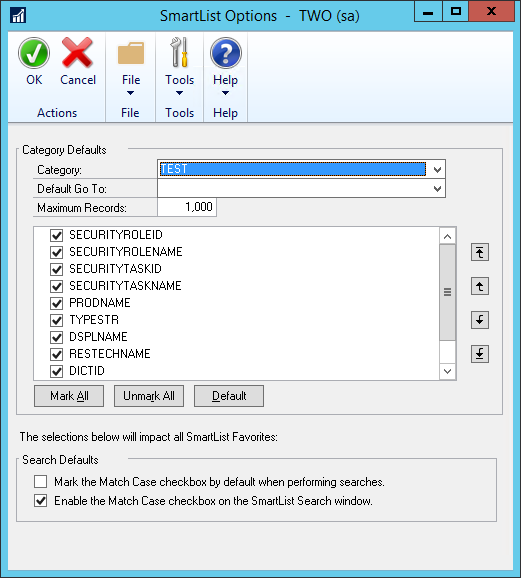
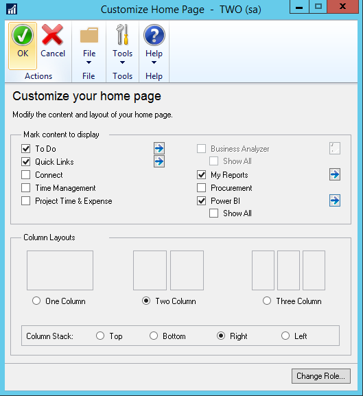

# What’s new in Dynamics GP 2016

The following sections describe enhancements included in Dynamics GP 2016.

## System-wide changes

### Web Client enhancements

The user interface for the Dynamics GP Web Client has been refreshed to provide a more updated appearance. The banner in space now enables users to log in and log out, as well as indicating what company they’re logged into number of enhancements to the user experience.

### Support for additional browsers and mobile devices

Web Client now includes support for multiple devices, including iPad and Android tablets, as well as using multiple web browsers. The supported browsers include:

-   Internet Explorer

-   Microsoft Edge

-   Safari

-   Chrome

### Open Web Client windows using search

A new search feature let you locate and open windows through search. The new search feature also works with applications that integrate with the Web Client.

### Ability to scan multiple pages

When you’re using the scan function that’s part of the Document Attachment feature, you now can scan more than one page at a time if you’re using a document feeder. Previously Document Attachment could scan only one page at a time. With GP 2016 we will have the ability to use the Document Attachment scanning functionality to scan in multiple pages (instead of one at a time). Supported scanners need to use WIA (Windows Image Acquisition) technology, along with a document feeder. The scanning process creates files in .TIF format.

### Word templates for batch approval workflow

Workflow batch approvals now have a default Word template for the edit list for the following batches in the following areas:

-   General Ledger

-   Payables

-   Receivables

The edit lists can be emailed to an approver to provide complete information about the transactions in the batches before approving the workflow step.

### Workflow condition management

New options are available for automatically processing workflows when something in the workflow doesn’t meet specified conditions. If a condition is not met, the workflow can continue to the next step or it can be rejected.

Prior to this change, you could specify conditions under which action is required for a step in a workflow. If the condition set for a step wasn’t met, the step would not be run, nor would any subsequent steps be run. If there were no parallel steps running, then the workflow would end at the step where the condition was not met, and the step status was set to No Action Needed.

With this enhancement, two additional options will be added letting you select the action that occurs when a condition isn’t met. The first is to continue to the next step in the workflow. Rather than stopping the workflow completely if a condition isn’t met, the step that doesn’t meet the condition won’t be completed, but the workflow moves to the next step in the sequence. This allows you to create workflows that contain steps that are completed only if specific conditions, but that don’t stop the workflow if the conditions aren’t met.

The second option is to reject the workflow if the condition for the step is not met. This allows the user to set up a workflow that automatically rejects documents based on specific conditions, rather than having a user manually review and reject the document.

### Workflow reassignment notifications 

Now you can configure a workflow to automatically notify a new approver when they need to act on a workflow that’s in process. Notifications can be sent to a new approver for who was delegated to the workflow, who is part of an escalation process, or who is an alternate approver.

### Configurable OData Service points added

Now you can define end-points for an OData Service, which allows Dynamics GP data to be read by any tool that supports OData feeds. The open data protocol, typically referred to as OData, defines a data model and a protocol that can let any client access information that’s exposed by any data source.

### OData Service deployment enhancements 

OData Service is now available with Dynamics GP as a separate install. You can access the installation option under the Additional Products selection in the Dynamics GP installation program. The service is available for single-tenant implementations only.

## Business Intelligence enhancements

### Import and export SmartLists from SmartList Designer

Now you can export and import SmartList definitions that have been created with SmartList Designer from one install to another. This is handy for partners who create SmartLists for one customer, then import them into an implementation for another customer. Customers can use the same functionality to export and import SmartLists across sites or divisions.

### SmartLists created in SmartList Designer have default columns defined in the SmartList Options window 

All the columns that are included in new SmartLists that are created in the SmartList Designer will be displayed in the SmartList Options window by default. From the Options window, you can include or exclude columns from the default view. You can also change order in which the columns display.

  

Prior to this change, new SmartLists could not have default columns defined in the SmartList Options window.

### Export numbers to Excel, formatted as numbers

When a report is exported to Excel, numbers will now be formatted as numbers. Prior to this change, numbers were formatted as text in Dynamics GP reports that were exported to Excel.

### Power BI reports can be added to home pages

A new web part has been added to Home Pages that allow users to easily add Power BI Reports to their workspace. To display a report, check the Power BI box, and then click the blue arrow to go into the Power BI Details window. This window will show you the available reports that you can add to your Home Page.

  

Once you’ve added reports you will have a Power BI section added to the home page. You can scroll through the available reports here. You can expand the size of the window to be larger or smaller as needed. Clicking on a report will launch the report in your browser, as long as Pop-up blocker is disabled. You can’t modify the reports within the Power BI window on the GP Home Page.

### Create SmartList from the Favorite using SmartList Designer

You can create a new SmartList from a favorite using SmartList Designer. And you can do so without having to remove extra columns from the default SmartList. Currently when you create a copy of a SmartList it takes the default SmartList and uses that to make the new one. With this enhancement, you can create a copy from a favorite which has different columns (usually less) than the default

## Financial enhancements

### Budget import exception report

When you import a budget from Excel, an exception report will list accounts that aren’t set up in General Ledger, as well as any duplicates that are found in the import file. You can use Transaction Entry windows to edit the transactions to use existing accounts, or create the accounts that are listed on the exception report.

### Scotia Bank EFT format added as a default EFT file format

The electronic file format used by the Canada-based Scotia Bank is now one of the default EFT formats available in Dynamics GP. Default formats are available for use in electronic transactions for both sales and purchases.

### Analytical Accounting user access settings

The process for giving users access to Analytical Accounting transaction dimension codes is now more efficient. You can use the User Access to Trx Dimension Codes window, in Analytical Accounting, to grant this access to multiple users. Prior to this change, access to transaction dimension codes was granted one user at a time.

### Payables batch credit card payment option

An option has been added that enables payables computer check batches to be paid using a credit card. The payment will create an invoice for the credit card vendor and a remittance form will print that list the invoices that were paid with that credit card transaction. A new Card Name field has been added to the Payables Batch Entry window to use a credit card as the payment method for a specific batch. A credit card record must be set up in the Credit Card Setup window. You can use either bank card or a credit card, but the invoice will be created for the credit card vendor only if that vendor is assigned to the credit card.

### Edit attachments that flow to transactions

You can edit information in attachments that included on transactions through the document attachment function. This feature allows you to edit the attachment properties of a document that flowed from a master record. For example, in the case where information flowed from customer to a sales quote, you might then want to send it to the customer via email. Now you can mark the email checkbox to help automate that task.

In addition, you can manage how information flows to transactions using options that have been added as part of this enhancement. From the Document Attachment Management window, you can open the Attachment Properties window. The option allows you to define and choose whether or not information can flow into document attachments, and whether or not attachments can be sent via email.

### Deposit cash receipts batches automatically

When you mark the option to automatically post cash deposits, and you post a batch that includes cash receipts from Receivables Management, a single deposit will be created that includes all the cash receipts in the batch. This batch post happens wherever you batch-post something that has cash received, such as cash receipts, receivables transactions, or sales transactions.

If you post receivables transactions at the transaction level, each cash receipt will result in a separate deposit being created and posted.

## Distribution enhancements

### All-in-one document view for sales and inventory transactions

A new window, Purchasing All-in-One View, was added for GP 2015 R2 that let you view all related documents for a single purchasing transaction in the same window. For GP 2016, similar functionality has been added for sales documents. You can open the Sales All-in-One View window while viewing a customer record in master record windows, such as the Customer Maintenance window, most Inquiry windows, navigation lists, as well as from the Dynamics GP home page. The most recent documents display in the window by default. To see the next set of five transactions, use the navigation buttons under each column.

The Inventory All-in-One View window displays inventory increase and decrease transactions and is accessible from the Item Maintenance window, as well as most item inquiry windows, navigation lists, and the Inventory home page.

### Prepay purchase order total

Now you can pay the total amount of a purchase order with a prepayment. The prepayment includes taxes, freight, and miscellaneous charges, as well as total of all the line items. Prior to this enhancement, prepayments could not exceed the subtotal amount of the purchase order.

## Project Accounting enhancements

### Project expenses – document attachments

Documents such as receipts now can be attached to employee expense transactions from the PTE Employee Expense Entry window. This enhancement uses the Document Attachment functionality that lets header and line attachments, such as invoices or receipts, to be added to an employee expense. You can also see these attachments in Payables Management after the expense transaction has been posted to that module.

### Project Accounting fields in Purchase Requisition Entry

Two new fields have been added to the Purchase Requisition Entry window that shows the project number and cost category for each line on a purchase requisition. The project-related information is also included on the purchase order that’s created after the requisition is approved. You’re not required to enter information in the new fields, so if your organization approves purchase requisitions through a workflow process, that process won’t be affected by this enhancement.

### Add Unit Cost field in PTE Employee Expense window

A field has been added to the Project Time and Expense window (PTE Employee Expense entry) that you can use to view and edit expense transactions. Other fields in this window are renamed to make window easier to use.

-   The Item field is renamed to Cost Category ID.

-   The Billing field is renamed to Bill Type

-   The Amount field is renamed to Purchases

The new fields include the Unit Cost and U of M fields.

### Project Time Entry reports added

Two new Project Time Entry reports have been added for GP 2016. The PTE Timesheet Edit List is printed from the PTE Timesheet Entry window. The PTE Expense Report Edit List is printed from the PTE Expense Report Entry window.

## Payroll enhancements

### Inactive pay codes lookup option

There is now an option to exclude inactive pay codes from lookup windows throughout Payroll. A drop-down list in the Pay Codes window to select all pay codes to include in lookup windows, or to exclude the inactive codes. The option is available for Employee Pay Codes and Pay Codes lookup windows.

### Enhanced Payroll posting accounts setup

Now you can see all posting accounts in a navigation list and filter and sort accounts using the functionality that’s typically available for navigation lists. You also can export the accounts to Excel, edit them there, and then import them. On the import, an exception report will print when there are any duplicate accounts, missing accounts or when there are payroll data or other issues that cause the record import to fail.

## See Also

[What's New](introduction.md)  
