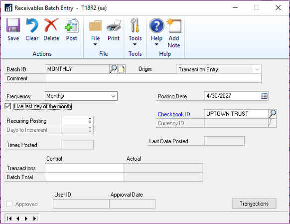
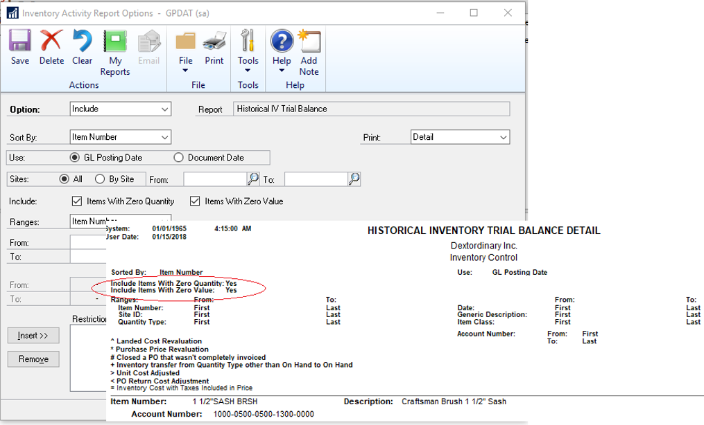
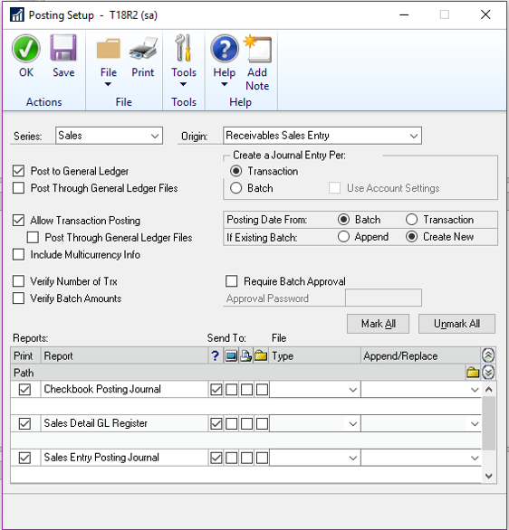
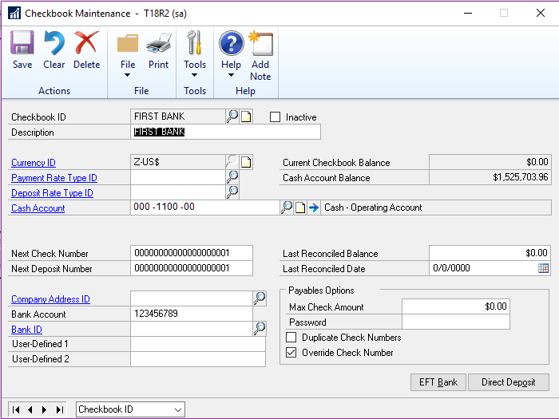
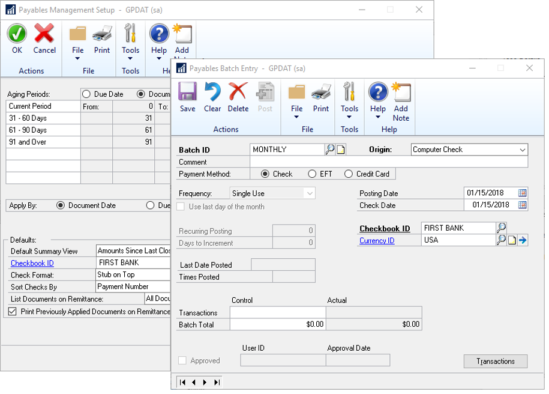
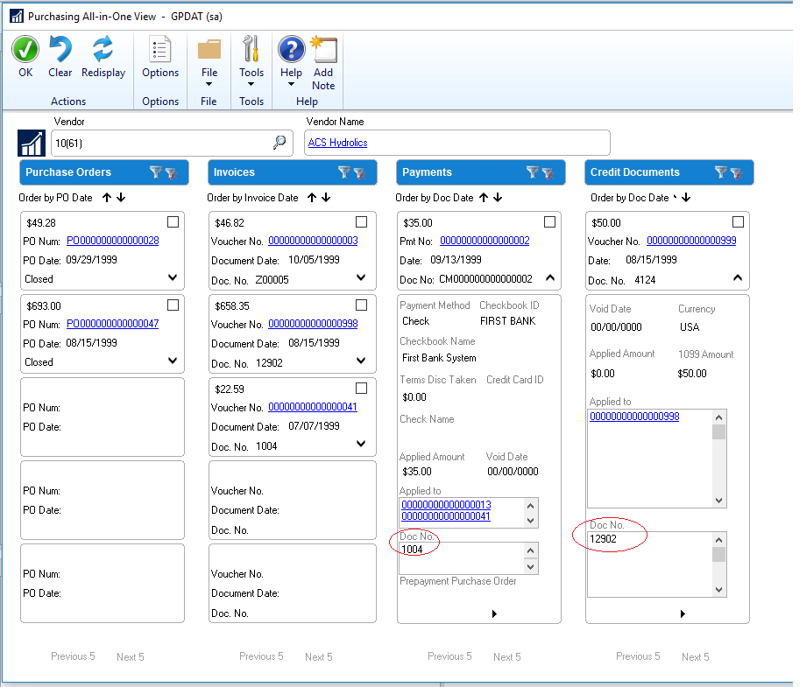
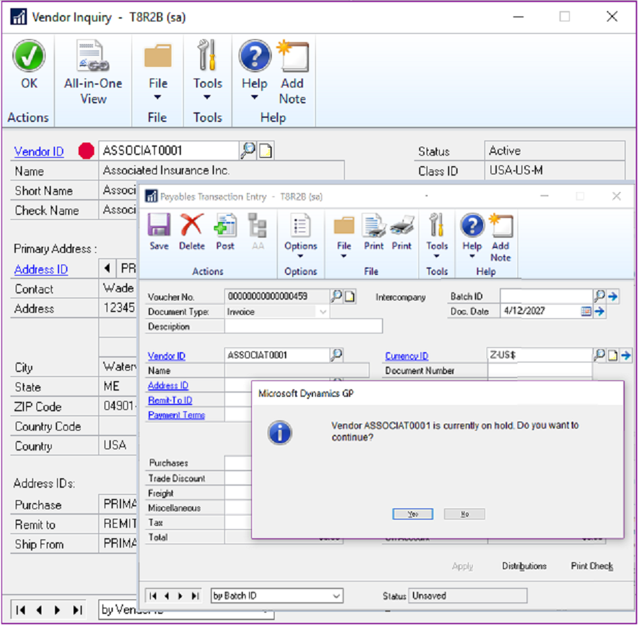
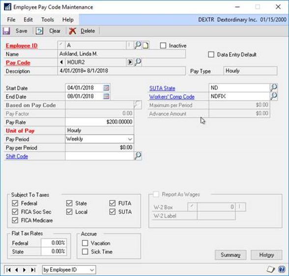
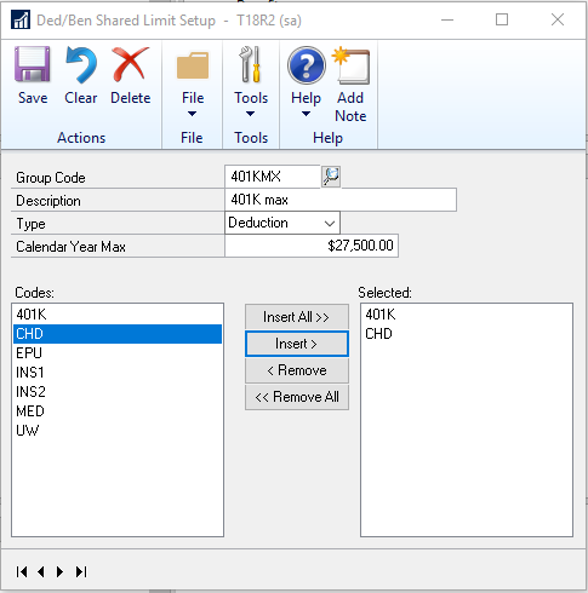

# What’s New in Dynamics GP 2018 R2

This chapter lists enhancements to Dynamics GP for the Dynamics GP 2018 R2 release. The Dynamics GP 2018 R2 release enhances specific areas of the product.

## Financial enhancements

A number of updates have been made to the finance area in Dynamics GP.

### Monthly recurring batches

With the release of Dynamics GP 2018 R2, users can specify if a monthly or bi-monthly recurring batch must end on the last day of the month in Payables, Receivables, and Inventory Management. When marked, it will automatically set the posting date to the last day of the month. So, if the batch is posted the next posting date would be set to May 31. This is great because before (and without the box checked) it would default the posting date to May 30.  

Three windows have been changed to accommodate the new monthly and bi-monthly recurring batch functionality:

- Receivables Batch Entry
- Payables Batch Entry
- Inventory Batch Entry

A new field,  **Use last day of the month** has been added underneath the **Frequency** field in all three windows. The **Use last day of the month** option is available only when the **Frequency** field has been set to **Monthly** or **Bi-Monthly**. When the **Use last day of the month** option is marked for a monthly recurring batch, the **Posting Date** will be the last day of each month (EOM). When the **Use last day of the month** option is marked for a bi-monthly recurring batch, the **Posting Date** will be the last day of every other month (EOM). 

  

To open these windows, on the Microsoft Dynamics GP menu, point to **Transactions**, choose the relevant area, and then click **Batches**. For Receivables choose Receivables Batches.

> [!NOTE]
> In earlier versions of Dynamics GP, the next posting date associated with a monthly batch frequency defaulted to 30 days from the previous posting date. Similarly, the next posting date associated with a bi-monthly batch frequency defaults to 60 days from the previous posting date.  

> [!IMPORTANT]
> The first time a user enters transactions associated with a batch marked to **Use the last day of the month**, the **Document Date** field for those transactions will default to the value of the **GP User Date** (shown in the lower left hand corner of Dynamics GP). As such, if users want the document date to match the posting date, they must update the **Document Date** field accordingly in the **Transaction Entry** window. For every recurrence after the first posting, Dynamics GP will automatically update the transaction document dates to match the posting date that is associated with the recurring batch.  

### Exclude items on the HITB report with zero quantity or value

Additional options are added to the **Historical Inventory Trial Balance** report so that you can exclude items with zero quantity or zero value.  

  

To select these options in the **Inventory Activity Reporting Options** window, go to the **Reports** menu, point to **Inventory**, choose **Activity**, and the choose the New or Modify button. In this window, you will see two new options which can be selected individually or both at the same time as described in the following table:

|Option  |Description|
|---------|---------|
|Items With Zero Quantity |Selecting this option will include inventory items on the Historical Inventory Trial Balance even if they have 0 quantity. If this option is not marked, then inventory items that do not have quantity will not be printed on the report. |
|Items With Zero Value  |Selecting this option will include inventory items on the Historical Inventory Trial Balance even if they have 0 value.  If this option is not marked, then inventory items that do not have value will not be printed on the report. |

> [!NOTE]
> Item with 0 quantity and 0 value that do not have any transaction history in the SEE30303 (Inventory Transaction History Detail) table will not be included on the report regardless of selection.

### Transaction level post through G/L

Users can now post through the general ledger at the transaction level in several windows. A new option has been added to **Posting Setup** to allow transactions to post through the general ledger if marked to post through.  

  

### Duplicate check numbers

You can now prevent or enable the use of duplicate check numbers for more than just Payables Checks by setting or clearing the **Duplicate Check Numbers** field in the **Checkbook Maintenance** window. If the field is cleared, then Dynamics GP will prevent users from using a duplicate check number in the **Bank Transaction Entry**, **Miscellaneous Checks**, and **Payroll Manual Check-Adjustment Entry** windows.  

  

If the check number has already been used, the user will receive the following error: "This check number has been used". The user will have to enter an unused check number to successfully post the transaction.  

### Don't display inactive checkbooks in lookup

Users can choose to exclude inactive checkbooks in the **Checkbooks Lookup** window with this new feature in Dynamics GP 2018 R2. We are simplifying the default checkbook on batches and making the lookup easier with an option to not see inactive checkbooks.  

The new action is added as a view in the **Checkbooks Lookup** window. To exclude inactive checkbook IDs,choose the black drop-down arrow next to **View**, and then choose **Exclude Inactive Checkbooks**. To save as the default view, simply choose **Set as Default View** in the same list. The **Checkbooks Lookup** window can be accessed from any window in Dynamics GP that has a **Checkbook ID** field with a magnifying glass next to it.  

The **Default View** field in the ASIEXP99 table (DYNAMICS database) will be set to *2* when **Exclude Inactive Checkbooks** is the default view. There are no changes to table structure with this new functionality.  

### Bulk update master records as inactive from navigation lists

In Dynamics GP 2018 R2, users can inactivate and reactivate master records for accounts, checkbooks, customers, sales people, vendors, employees, and items from Navigation Lists. Additionally, users can inactivate one employee at a time from navigation lists.  

The **Inactivate** option becomes available when the user has selected one or more master records on the navigation list. The **Reactivate** option becomes available when the user has selected one or more inactive master records on the navigation list. If a master record is marked as inactive, a visual indicator shows to the right of the *Select* checkbox on the navigation list to indicate that the record is inactive.  

For each of the different types of master records, Dynamics GP checks that the record meets the relevant criteria to be marked as inactive. The **Inactivate** option follows existing rules and logic in Dynamics GP for each master record type. Users will be notified if the change succeeded or failed through the yellow status bar at the top of the list. If the record could not be marked as inactive or reactivated, users can print a **Status Message Detail** report to get more information around why the change failed.  

Options with the names **Inactivate** and **Reactivate** have been added to the **Modify** section of the **Accounts Navigation List**,  **Checkbooks Navigation List**, **Customers Navigation List**, **Salespeople Navigation List**, **Vendors Navigation List**, **Items Navigation List**, and **Employees Navigation List** windows. 

Additionally, vendors can be marked as **Temporary** in the **Vendors Navigation List** window and a different visual indicator shows to the right of the *Select* checkbox.

> [!NOTE]
> Employees must be inactivated/reactivated one at a time. If more than one Employee ID is selected, the **Inactivate** and **Reactivate** options are grayed out. When a user clicks the **Inactivate** or **Reactivate** option, the **Employee Maintenance** window will automatically open.  

## Purchasing enhancements

A number of updates have been made to the purchasing area in Dynamics GP.

### Checkbook ID defaults on computer check batch

The Checkbook ID defaults in when you create a check batch in the **Select Payments** window, **Edit Payment Batch** window and **Batch Entry** window when computer check is the origin. Set up the default in the **Payables Management Setup** window.  

  

### Allow partial purchase on a purchase requisition from a purchase order

When you create a purchase order, you can now enter a quantity that is less than the total quantity requested. This is also possible if you create a purchase order from one or more requisitions.  

When you create a purchase order from one or more purchase requisitions, you now have the option to purchase a quantity less than what was initially requested in the **Purchase Order Preview** window. The remaining quantity on the requisition will then be canceled.  

For example, if you have a quantity of 70 of the item *128 SDRAM* on a requisition, but you only want to purchase 35 items, you can now adjust that quantity in the **Purchase Order Preview** window. When you adjust the **Qty To Purchase** field to 35, you receive a warning that the remaining quantity ordered will be canceled. When the purchase order is generated, the purchase requisition will move to history if all lines on the requisition have been fully or partially ordered with the remaining quantity on the partially ordered lines canceled.  

If you drill back on the transaction in the **Purchase Requisition Inquiry** zoom, there will be a red icon as a visual indicator to show that the quantity was only partially ordered.  

> [!NOTE]
> Historic purchase requisitions will have a status of **Partially Purchased** to reflect that part of the original quantity on the requisition was canceled during the purchase process. By clicking on the link button next to **Quantity Ordered**, you can see the partial quantity that is on the purchase order and the quantity not purchased what was canceled.  

### Add vendor document number to Purchasing All-in-One View

The vendor's document number now shows in the **Purchasing All-in-One Document View**. With the release of Microsoft Dynamics GP 2018 R2, users can now view the **Applied-To Document Number** that is associated with payments, credit memos, and returns in the **Purchasing All-In-One View** window.  The all-in-one view is great for viewing related documents but most times the vendor document number is the one known, not the document number. Therefore, it has been added in the payments and credit documents columns for easy reference.  

To open the **Purchasing All-In-One View** window, in the Dynamics GP menu, point to **Inquiry**, choose **Purchasing**, and choose **Purchasing All-In-One View**. To view the document number of an invoice, finance charge, or miscellaneous change, simply click the black arrow in the lower right-hand corner of the payment, return, or credit memo to expand the view.  

  

### Send a purchase order using another template

A new option to send a purchase order as an email using the format "Other format" has been added to the **Purchase Order Entry** and **Purchase Order Inquiry Zoom** windows. this means that users can choose if they want to email the Blank Paper or the Other form. This can be useful if you are using different purchase order formats depending on the type of vendor that the purchase order is being emailed to.  

After selecting a purchase order format, you can click the Send button at the bottom of the window. The vendor's email address and the message ID entered on the purchase order transaction will be used and the email will be sent in the format selected.  

> [!NOTE]
> Email functionality is dependent on Word Templates being enabled and properly configured in your company.  

### Warning when the vendor is on hold

If you are entering a payables transaction for a vendor that is marked as on hold, you now get a visual indicator. This is similar to the customer hold status that was implemented in an earlier version of Dynamics GP. Additionally, Dynamics GP throws a warning message when a user attempts to enter a transaction when the vendor is on hold.  

  

You can see the vendor hold status in the following pages:

- Vendor Inquiry
- Transactions by Vendor
- Purchasing All-in-One Viewer
- Payables Transaction Entry Zoom

In these windows, a red dot now displays next to the vendor name or ID if the vendor is on hold.  

## Sales enhancements

A number of updates have been made to the sales area in Dynamics GP.  

### Retain Ship-To-Address Name with Customer Modifier

In Dynamics GP 2018 R2, the **Ship-To-Address Name** value is retained when a customer is modified with the **Customer Combiner and Modifier Utility**. To open the **Customer Combiner and Modifier Utility**, in the Dynamics GP menu,choose **Tools**, point to **Utilities**, choose **Sales**, and then choose **Customer Combiner and Modifier**.  

The **Ship-To-Address Name** field is shown in the **Customer Address Maintenance** window. To open the **Customer Address Maintenance** window, in the Dynamics GP menu, choose **Cards**, point to **Sales**, and then choose **Addresses**.  

### New SmartList for deposits associated with unposted sales transactions

In Dynamics GP 2018 R2, users can easily view deposit amounts associated with unposted sales invoices and orders through the new **Deposits on Unposted Sales Transactions** SmartList. This SmartList is a new option under Sales Transactions so you can quickly see customers that have put a deposit on a sales transaction, but the sales transaction hasn't been posted. No more searching through the sales records to see the deposits, now you have a new SmartList to view the details. This new default SmartList is filtered to look at Sales Order WORK transactions (SOP10100) with a **Deposit Received** amount (DEPRECVD field) greater than zero.  

### Additional sort options in Sales Order Processing Item Inquiry

In the **Sales Order Processing Item Inquiry** window, a new field with sort options has been added to the window so that you can change the display within the scrolling window. The sort options include Item Number, Document Number, Document Type, Document Date, and Customer ID. Item Number will be the default sort when the window is opened.

### Sales Order Transaction Navigation List-Print Document option for Functional or Originating Currency

With Dynamics GP 2018 R2, there is a new option when printing documents from the **Sales Order Transactions Navigation List** window that allows you to choose if you want to print the document in the Originating or Functional currency. In the **Currency to Print** field, a new option for **Functional** lets you print the invoice in the company's currency. The default currency is still *Originating* but now you have the option to print in *Functional* currency from the navigation list. After you mark a document or documents on the **Sales Order Transactions Navigation List** window, you can select the **Print Documents** action dropdown on the Action Pane. In this window you will see a new option labeled **Currency To Print**.  

### Print and email sales documents at the same time

We have added the ability to both print and email sales documents at the same time in three areas. This feature will be useful in allowing you to print and email sales invoices all in one process. Previously you would have been required to print the document or range of documents, and then once that process was completed, you would have to go back into the window, mark the documents again and email the documents.  

> [!NOTE]
> Email functionality is dependent on Word Templates being enabled and properly configured in your company.  

In the **Sales Document Print Options** and **Print Sales Document** windows, new fields specify if you want to print or email the document. In the **Sales Order Transactions Navigation List** window, when you choose the action to send a transaction in email, you can now choose to print a copy.  

### Email customer statements

In the **Customer Maintenance** window, you can now email statements with the click of a button. A new email button can be found on the Menu bar of the **Customer Maintenance** window.  

When you click the email button, Dynamics GP will email a customer statement to the customer that you have selected in the window. The settings from your 'BLANK FORM' statement ID will be used for this functionality. If a Statement ID of 'BLANK FORM' does not already exist in your company, then Dynamics GP will create a new Statement ID with the name 'BLANK FORM' with the following settings:

|Field |Value  |
|---------|---------|
|Date to Print |End of Month |
|Form  |On Blank Paper Print |
|For|All Options Marked|

> [!NOTE]
> Email functionality is dependent on Word Templates being enabled and properly configured in your company.  

## Human resources & payroll enhancements

A number of updates have been made to the HR and payroll areas in Dynamics GP.  

### Payroll check register FICA totals

The report has employee and employer FICA amounts and a total for both. The following FICA totals have been added to the **Payroll Check Register** report: 
FICA Medicare = Employee FICA Medicare total + Employer FICA Medicare total
FICA Social Security = Employee Social Security total + Employer Social Security total

In earlier versions of Dynamics GP, the **Employee Medicare** and **Employer Medicare** values were totaled separately. Additionally, the **Employee Social Security** and **Employer Social Security** values were totaled separately.  

### Changes to Payroll Check Register Report

Two new calculated fields added to the **Payroll Check Register** report to accommodate the ability to view these totals: **FICA Med Total Owed**, **FICA Soc Total Owed**. The **Payroll Check Register** report can be printed after checks are 'calculated' (pre-posting report), and/or during the Payroll Computer Check posting process.  

> [!NOTE]
> If you are printing a modified version of this report, you may not see the new fields, you will need to set your security back to the original report to see this new feature.

### Start and end dates for pay codes

With the release of Dynamics GP 2018 R2, users can assign a start date and/or an end date to pay codes in the **Employee Maintenance** window. This functionality is similar to the start/end dates that are already used for benefits and deductions in the Payroll module. This new feature will allow users to setup new pay codes without having to worry about when to start using them, or when to inactivate those they no longer wish to use. This will be very useful to you when you are activating a new hire and terminating an existing salary employee.  

> [!NOTE]
> In earlier versions of Dynamics GP, it was not possible to restrict whether a pay code is included in a pay run via start and/or end dates. Instead, users would generally 'inactivate' a pay code (most often a salary type pay code) to ensure it's not included in a pay run.

  

The **Start Date** and **End Date** fields are not required in the **Employee Pay Code Maintenance** window. The following table describes the effect of the settings of these fields:

|Settings|Effect  |
|---------|---------|
|Both the **Start Date** and **End Date** fields are empty | There are no date restrictions for the pay code, and Dynamics GP will treat the pay code as it did in earlier versions.|
|**Start Date** is set|Dynamics GP will check if the **Start Date** field in the **Employee Pay Code Maintenance** window falls on or after the date in the **Pay Period From Date** field in the **Build Payroll Checks** window.|
|**End Date** is set|Dynamics GP will check if the **End Date** field in the **Employee Pay Code Maintenance** window falls on or before the date in the **Pay Period To Date** field in the **Build Payroll Checks** window.|
|Both the **Start Date** and **End Date** fields are set|Dynamics GP will check if the **Start Date** field in the **Employee Pay Code Maintenance** window falls on or after the date in the **Pay Period From Date** field in the **Build Payroll Checks** window, and if the **End Date** field in the **Employee Pay Code Maintenance** window falls on or before the date in the **Pay Period To Date** field in the **Build Payroll Checks** window.|

The **Payroll Transaction Entry** window has been updated to accommodate the new start and end dates for pay codes. When a user enters transactions for a pay code, and the **Pay Period From** and **Pay Period To** dates do not fall on or between the pay code start/end dates, the pay code will not be available in the **Pay Code Lookup** window. Also, Dynamics GP will generate the following error message:"The transaction is outside of the pay code start/end date" when either the user manually enters the pay code in the **Code** field, or the user edits an existing transaction, and the pay code start/end dates do not fall on or between the pay code start/end dates.  

The **Payroll Build Checks** window has been updated to accommodate the new start and end dates for pay codes. Dynamics GP compares the pay code start and end dates from the **Employee Pay Code Maintenance** window to the pay period from/to dates in the **Build Payroll Checks** window to determine whether pay code transactions should be included in the pay run. For automatic pay types, when the start/end dates in the **Employee Pay Code Maintenance** window do not fall on or between the pay period from/to dates in the **Build Payroll Checks** window, Dynamics GP will not include the pay code for that specific employee in the pay run. For pay codes entered as transactions as part of a batch, when a pay code transaction in a batch has a start/end date in the **Employee Pay Code Maintenance** window that does not fall on or between the pay period from/to dates in the **Build Payroll Checks** window, Dynamics GP will throw the following warning on the **Build Checks** report: "The transaction is outside of the pay code start/end date". The transaction for that pay code/employee will not be included in the rest of the pay run.  

The batch will remain available after the pay run has been posted. The pay code transactions not included in the pay run will remain in the batch until they are successfully posted.  

### Shared maximums for benefits and deductions

It is now possible to assign a shared calendar year maximum for groups of benefits and/or groups of deductions. This will be a huge benefit to your organization for employees who may contribute to two 401K plans.  

A new window has been added to accommodate the new deduction and benefit shared maximum functionality, the **Ded/Ben Shared Limit** window.  

  

> [!NOTE]
> When a deduction/benefit group code is saved in the **Ded/Ben Shared Limit Setup** window, the shared yearly maximum will be applied to all employees who are assigned to those deductions. Each deduction or benefit can be assigned to one group code.  
> All deductions/benefits under the selected column will be subject to the shared calendar year maximum.  
> If an employee is assigned only one or some of the deductions/benefits under the selected column, they will still be subject to the shared calendar year maximum assigned in the **Ded/Ben Shared Limit Setup** window.  

All deductions included in the pay run will show on the **Build Checks** report, which hasn't changed.  

Also, when the pay run is run as *Calculated*, and the **Calendar Year Maximum** has been met for a group of deductions during the pay run,Dynamics GP will try to take the full deduction amount(s) for all TSA deductions first (those deductions with more TSA's get priority). Next, Dynamics GP will try to take the full deduction amount(s) for sequenced deductions. Finally, Dynamics GP will try to take the full deduction amount(s) for non-sequenced/non-TSA deductions (alphanumerically).  

When the pay run is run as *Calculated*, and the **Calendar Year Maximum** has been met for a group of benefits during the pay run, Dynamics GP will first try to take the full benefit amount for taxable benefits alphanumerically, and then try to take the full benefit amount for non-taxable benefits alphanumerically.  

## Workflow

Dynamics GP 2018 R2 includes a new **Sales Transaction Approval** workflow where you can create approvals based on several conditions such as whether a customer credit limit is exceeded on the transaction or not. Not only can you set workflow approval on customer credit limits, but you can set workflow approvals on all transaction types in Sales Transaction Entry. We added a new email message to work with sales transactions, just like the other workflow types. Workflow history is displayed in inquiry windows too.  

The default WF ASSIGN SOP APPROVAL* email message for the **Sales Transaction Approval** workflow will have the option to add many customer and transaction related fields, such as the customer credit limit information so that you can write in the email if the customer credit limit has been exceeded. This way there is high visibility for the approver when they receive the E-Mail notification to approve the transaction. The wording and fields on the email Message ID can also be customized to your preference.  

The workflow history for the **Sales Transactions Approval** workflow is also displayed on inquiry windows and navigation lists.  

## System enhancements

A number of general enhancements have been made in this release.

### Password maximum length

In Dynamics GP 2018 R2, the maximum length for a user's password is increased to 21 characters, from the previous 15 characters.  This is very similar to other Microsoft products, example Microsoft SQL Server.  

This will allow more complexity with Dynamics GP user passwords with the added characters being allowed, to add more security to your Dynamics GP environment.  

### Password expiration notification

Dynamics GP 2018 R2 now provides users with a notification 7 days in advance of their login password expiring. This allows users to proactively update their passwords before the expiration date specified in the password policy configured by the system administrator.  

### Hide Business Analyzer in navigation lists for all users and all lists

System administrators can now turn off Business Analyzer for the Home Page and/or navigation lists at the system level in the **System Preferences** window. These are global settings to make it easier to turn off the feature if companies are not using Business Analyzer.  

Individual users can still choose to turn on Business Analyzer using customization options to display Business Analyzer on their Home Page or in navigation list pages. This is managed in the **Customize Home Page** window and in the Show/Hide menu for navigation list pages, respectively.  

### SmartList Designer favorites display in navigation lists

SmartList Favorites created via SmartList Designer will now appear in the SmartList Favorites navigation lists.  

### Intelligent Edge - Intelligent Cloud Insights

With the release of Dynamics GP 2018 R2, you will notice a new tab on your home page: **Intelligent Cloud Insights**. Essentially, you can connect your Dynamics GP to a Dynamics 365 Business Central cloud tenant that you can synchronize data to. This enables cloud scenarios for your Dynamics GP that will then show in the **Intelligent Cloud Insights** tab with insights from machine learning and other cloud scenarios.  

When you upgrade to GP 2018 R2 with an existing install, the users' Home Page tab will default as usual, but you will see a new tab called **Intelligent Cloud Insights**. If you do a new install of Dynamics GP 2018 R2, the Home Page will default to the **Intelligent Cloud Insights** tab.  

For more information, see [Frequently Asked Questions about Connecting to the Intelligent Cloud](/dynamics365/business-central/dev-itpro/administration/faq-intelligent-cloud) in the docs for Dynamics 365 Business Central.
