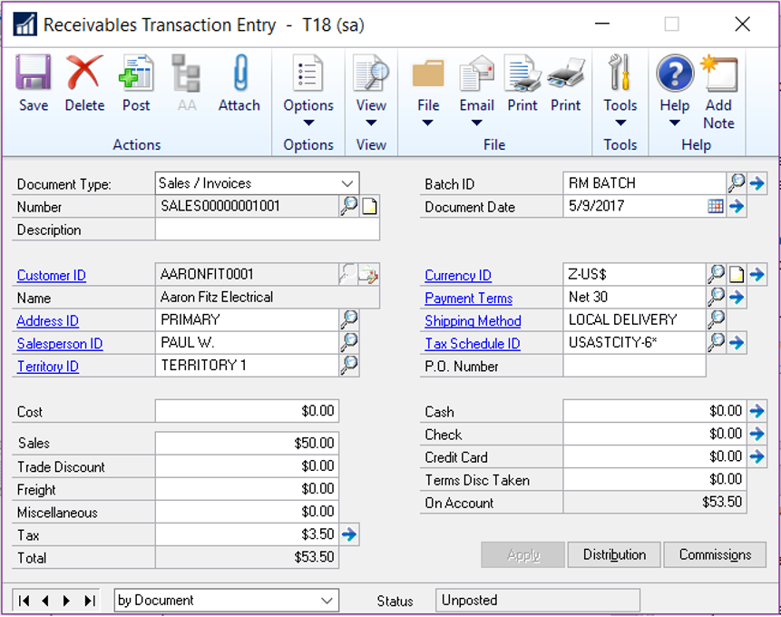
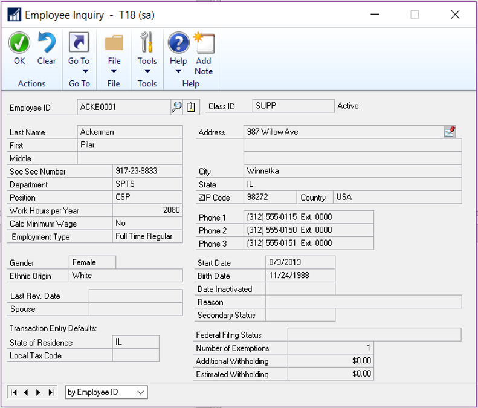
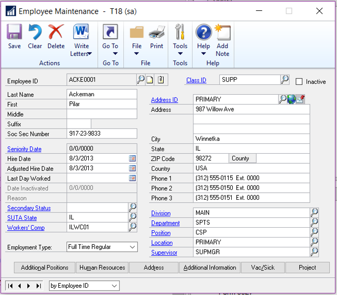
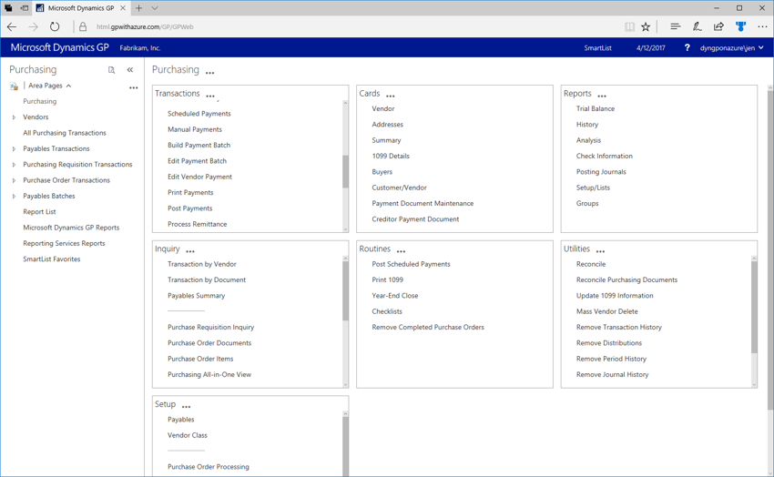

# What’s New in Dynamics GP 2018

This chapter lists enhancements to Dynamics GP for the GP 2018 release. The Dynamics GP 2018 release enhances specific areas of the product, while also expanding existing functionality, notably in the document attachment and workflow areas. The user experience has also been enhanced to make finding the information you use to make business decisions faster and easier.

## Platform and system-wide enhancements

### Login remembered when working in System Manager

Now you’ll only need to enter the system password once during an active session when working in multiple system windows. Previously, users were prompted to log in multiple times when accessing different system windows.

### Comprehensive document attachment

This release broadens the availability of the document attachment capability to additional master record windows, inquiries and transaction entry windows. The option to attach new documents in Inquiry windows is also included. Document attachment is available from the ribbon in additional transaction entry windows, as shown in the following illustration.

  

In some master record windows, documents are attached using a button next to the record ID fields, as shown in the following illustration.

  

Similar buttons have been added to additional master record windows.

  

Document attachment has been added to the following windows for GP 2018.

| Transaction entry windows |
|---------------------------|
 |General Ledger Transaction Entry|
 |Receivables Transaction Entry|
 |Asset General Information (FA)    |

| Inquiry windows           |
|---------------------------|
 |Employee Inquiry|
 | I-9 Form|
 |Customer Inquiry|
 |Vendor Inquiry|
 |Project Inquiry|
 | PA Project Inquiry |

## Workflow 4.0

The capabilities of workflow have been extended in the GP 2018. In addition to new workflows, including general ledger account approvals and purchase order invoice approval, you can copy a step within a workflow, and send reminder email messages from workflow.

### Reminder emails

This enhancement lets you set a reminder time period on the workflow that’s used to notify users if they haven’t reacted to their assigned workflow task within the specified time frame.

### Copy workflow step

This enhancement adds efficiency to the process of setting up workflows by enabling you to copy steps within a workflow, renaming the step and including substeps to a workflow.

### Reporting for workflow

A new workflow history report has been added for GP 2018. The report can be filtered by workflow type, workflow approvers, workflow status, and by the approval date. The option to include workflow comments on the report is also available.

### Additional fields are available for Payables transaction workflow

Additional fields have been added to the Payables transaction workflow. To use the new fields, mark the Extended fields list option in the Work Maintenance window, and then select the fields you want to use in the Workflow Condition Editor. The new fields include:

- Vendor account

- Comment 1

- Comment 2

- Vendor class ID

- Payment priority

### Additional messages are available for purchase order workflow

This enhancement lets you add account descriptions to workflow message that are distributed via email for Purchase order workflows and purchase requisition workflows.

### Bank used for EFT added to vendor approval workflow

Additional information is now included in the Vendor approval workflow that shows the bank that the vendor uses for electronic funds transfers (EFT). To use the new field, mark it in the Extended fields list option in the Work Maintenance window, and then add it to the workflow in the Workflow Condition Editor. These extended fields are all the EFT banking fields that can be set up on the vendor for EFT information. They include the country/region, bank name, bank account, and SWIFT code.

### New workflows for new accounts, receipt transactions, and purchasing invoices

New workflows have been added to control the addition of general ledger accounts, purchase receipt transactions and purchasing invoices. The workflow for general ledger accounts can be initiated from any area of the system for any new accounts, or for any accounts that are in a workflow state, for example when an account has been edited, but not yet approved.

## User experience enhancements

A number of enhancements improve the experience of working with Dynamics GP. The following subsections describe those enhancements.

### Additional sorting options added

A number of enhancements have been added to GP 2018 that make it easier and faster to find information. The new sorting options can be displayed in either ascending or descending order.

| Window                                     | New sorting options |
|--------------------------------------------|---------------------|
| Receivables Transaction Inquiry – Customer | |
| Receivables Transaction Inquiry – Document  | By type < /br>  By document number  < /br> By document amount < /br> By amount remaining < /br>  Document date        |
| Payables Transaction Inquiry – Vendor | |
| Payables Transaction Inquiry – Document     | By document number  < /br>  By type < /br>  By original amount < /br> By unapplied amount < /br> By document date     |
| Bank Reconciliation window     | By payment amount  < /br>  By deposit amount    |

### Unique passwords can be entered for individual SmartList favorites

Users now have the option to assign a unique password to SmartList favorites. The password restricts the users who can modify the favorite to only those that know the password. In previous versions, anyone who knew the system password could modify the favorite.

### A shortcut to SmartList has been added to the web client

Now you can navigate to SmartList directly from the web client, making access to SmartList inquiries and reports faster and easier.

### Auto-complete now included in the web client

Functionality that recognizes partial entries in fields is now part of the web client, as it has been in the desktop client.

### One-click navigation to SmartList from web client

A shortcut has been added to the banner in web client windows, allowing one-click navigation to SmartList – for those who have been granted access to SmartList. User whose permissions do not include SmartList won’t see the shortcut.

  

Additional enhancements to the user experience include:

- Help icons have been updated to link to online support documents.

- Option to maximize the Bank reconciliation window in the web client

## BI enhancements

The GP OData service has been updated to include paging and filtering, as well as adding support for OData version 4.

Along with the enhancements that are included in GP 2018, we are pleased to announce an upcoming GP Content pack that will be based on the GP 2018 OData service.

## Financials enhancements

### Print a single statement from Customer Maintenance

Now you can print a statement for a single customer, from the Customer Inquiry window for that customer. The statement will use the statement format that’s assigned in the Receivables Setup window.

### One payment per invoice set or one payment per-vendor

Now you can choose to make payments on individual invoices, or to choose a single payment per vendor. The choice of payment options is made in the Vendor Maintenance window. The default setting is to generate a single payment per vendor when you build payment batches using the Build Payment Batch window.

### Save select payment settings

An option that allows you to save the settings used to build a payments batch has been added to the Payment Option ID field in the Build Payment Batch window.

### Copy user access across dimensions in Analytical Accounting

In the User Access to Trx Dimensions window, you can specify which users have access to dimensions and copy the user access settings from one user and apply them another one.

### Payables checks windows renamed to reflect alternate payment options

Payables Management Checks windows have been renamed to reflect the ability to payments through credit cards, electronic funds transfers, or potentially other methods.

## Distribution and supply chain enhancements

### Purchase order generation list opens with newest POs

When you create purchase orders from the Purchase Orders Preview window using the Generate button, the new purchase orders can be displayed in the purchase order transactions list. When you use the Generate button, the PO Navigation List will automatically open with the newly generated purchase orders displayed.

### PO information displayed for requisition originator

When a purchase order is created from a requisition, the PO information is displayed on the requisition list so that the requisition originator can be aware that the items on the requisition have been ordered. The enhancement also displays the PO Number on the Procurement role center.

### Print purchase requisition

Now you can print a purchase requisition report from the Requisition Entry and from the Requisition List windows.

### Display Hold status in the sales transaction entry

Now you can display a Hold status, on transactions that have that status, from the Sales Transaction Entry and Sales Transaction Inquiry Zoom windows. An icon will display and can be selected to zoom to the sales process Hold window.

## Human Resources and Payroll enhancements

### Roll down payroll setup options from setup to inactive records

Now you have an option to roll down changes to inactive employee records. The options that are included in this feature include: changes to

- Pay codes

- Deductions

- Benefits

- Shift codes

### Turn off garnishment reports in posting setup

Additional control over printing garnishment reports has been added to the Posting Setup in Payroll. You can select whether to print garnishment detail or summary reports when you complete a pay run. The default setting is to allow users the option to print garnishment reports when you complete a pay run.

### Change the department code in all data tables

Now you can allow users to modify an existing department code and the changes will automatically update all the tables that contain that department code, including History tables.

### Restrict inactive deduction and benefit codes in lookup windows

This enhancement lets you restrict the inactive records in lookup windows on a per user basis. You can restrict both company benefits and deductions, as well as employee benefits and deductions.

### Advanced wellness and health insurance integration

This enhancement lets you track employee actions that contribute to lower insurance premiums, such as refraining from smoking or maintaining membership in a gym or health club.

## See Also

[What's New](introduction.md)  
