# What’s New in Dynamics GP in October 2019

This page lists enhancements to Dynamics GP in the October 2019 release. The Dynamics GP October 2019 release enhances specific areas of the product.

## Financial enhancements

A number of updates have been made to the finance area in Dynamics GP.

### Long description for payables transaction entries

New option in Payables for very long descriptions up to 200 characters. ​

Displays on the following pages:

- ​Transaction Entry​

- Payables Transaction Entry Zoom​

- PM Blank Document​

Prints on the following checks in Payables Check Entry (single invoice)​

- Check With Stub on Top​

- Check With Stub on Bottom​

- Check With Stub on Top and Bottom-Text​

- Check With Stub on Top and Bottom-Graphical​

- Check With Two Stub on Top​

- User-Defined Check1​

- User-Defined Check2​

- PM Transaction Inquiry​

​Does not post to the general ledger.​

### Expand the view of fiscal periods

​You can extend the window display length to give you an expanded view of the fiscal periods.

Extend the window display length

### Show user who posted for Journal Entry Inquiry​

The Journal Entry Inquiry window now has a new field that shows the user who posted the entry.

The **User Who Posted** field shows for both open entries and historical entries.

### Add Class ID to Fixed Assets Transfer​

Class ID is now added to the scrolling window.

If you change the class ID, you get default GL accounts. The class ID is shown in the **Fixed Assets Transfer** and **Fixed Assets Mass Transfer** windows.

### Document Attach available in Bank Reconciliation​

You can now attach documents in the following windows:

- Bank Deposit Entry
- Bank Transaction Entry
- Bank Deposit Entry Zoom
- Bank Transaction Entry Zoom

### Visual Cue for EFT Vendor on Edit Payment Batch​

In **Edit Payment Batch** window, you can now use a visual cue to identify vendors that are set up to receive EFT payments.

### Show Check Number in Apply Sales Document window​

In the **Apply Sales Document** window​, you can now see the check or card number that was entered on the payment at the time of entry.

### Payroll option to not include additional withholding​

In the **Build Payroll Checks** window, you can now specify if the check must include additional federal, state, or local taxes. The fields are selected by default to retain existing functionality.

There is also a new option to save settings with the Default ID.

### Payables Integration to Payroll Enhancement​

You can specify remittance address for vendors to use when creating the invoice from Payroll.

A new **Payroll Integration to Payables Edit List** report is now available from Posting Setup.

### Deduction/Benefit Quick Assignment functionality​

You can bulk-assign codes to one or more employees for the following codes:

- Deduction Code (Payroll)
- Benefit Code (Payroll)
- Miscellaneous Benefit (HR)
- Retirement Benefit (HR)
- Life Insurance (HR)
- Health Insurance (HR)

Go to the **Quick Code Assignment** window from the **Deduction Setup** window, and then mark all or unmark all.

### Exclude inactive records for HR benefit and Deduction lookups​

You can switch between viewing all benefits and filtering out inactive benefits in the following windows:

- Miscellaneous Benefit Setup / Miscellaneous Benefits Enrollment
- Health Insurance Setup / Health Insurance Enrollment
- Life Insurance Setup / Life Insurance Enrollment
- Retirement Plan Setup / Retirement Plans Enrollment

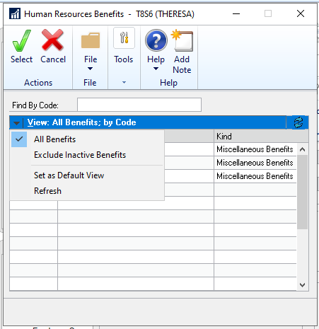

You can also save the current view as the default view.

### Employment history reason for change for all dates​

The **Reason** field now captures the reason for the change to an employee's information when the hire date, adjusted hire date, or last day worked fields are entered or edited in the **Employee Maintenance** window. The same applies when the HR status is updated on the Employee HR Maintenance window that modifies those dates. The reasons and dates are then saved to the employment history for the employee.

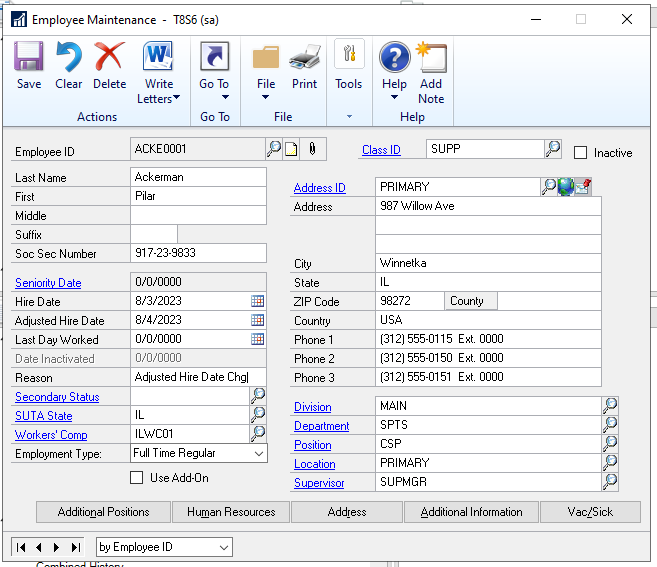

### Payroll Reprint pay statements by audit code

You can now reprint pay statements for an entire check run. In the Reprint Journals window, choose **Reprint Pay Stub**, specify the **Audit Trail Code**, and this will print a duplicate pay stub report for all employees included.

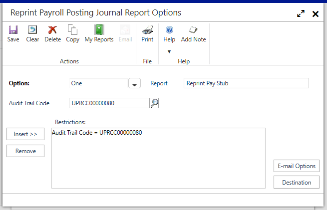

## Workflow enhancements

A number of updates have been made to the workflow area in Dynamics GP.

### User Security Workflow​

You can now set up a workflow for editing or adding user security.

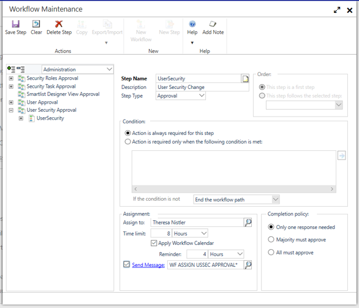

### User Workflow​

You can now set up a workflow for editing or adding users.

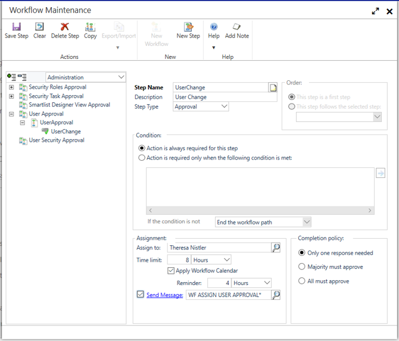

### Security Roles Workflow​

You can now set up a workflow for modifying security roles.

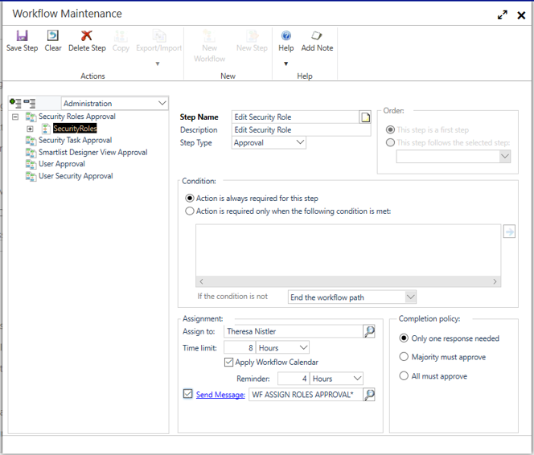

### Security Tasks Workflow​

You can now set up a workflow for modifying security tasks.

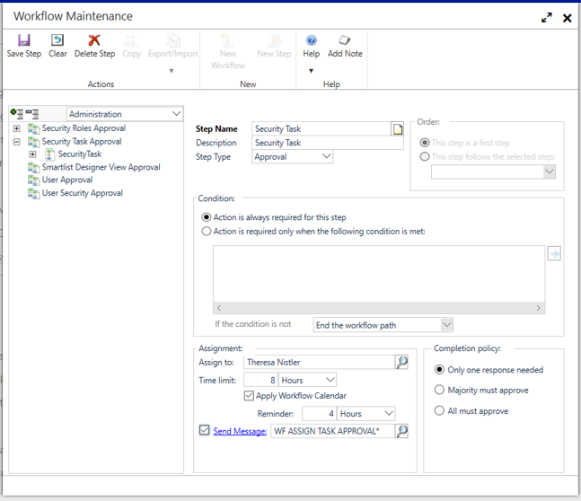

### Export and import workflow​s

You can now export a workflow to a .json file. Then you can copy that to another workflow, or another company.

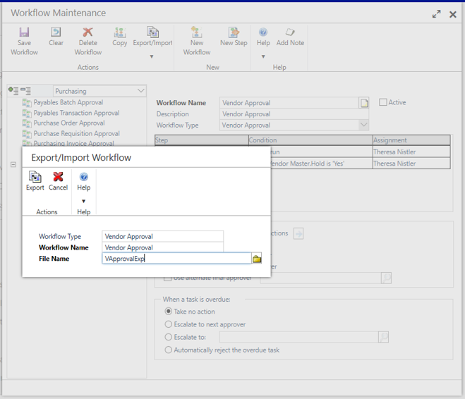

When you import an exported workflow from a .json file, you must specify the name of the new workflow.

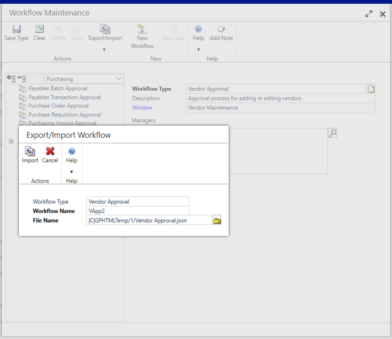

After import, set up workflow approvers and message options.

### Change approver for active workflow tasks​

In the new **Edit Workflow Approver** window, you can modify who a task is assigned to as the manager of that workflow.

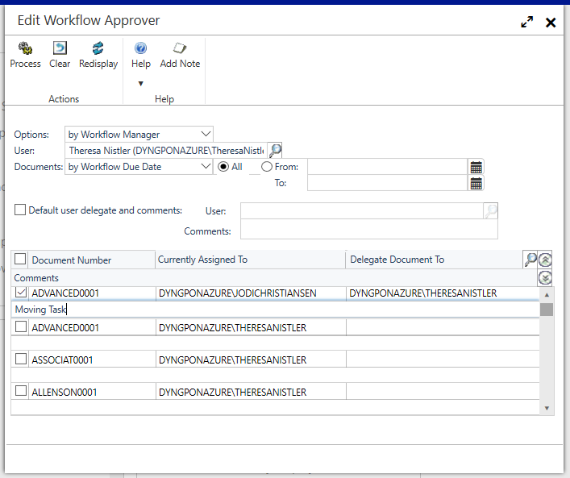

Workflow managers can delegate workflow tasks, and the *sa* account can delegate workflow tasks.

### Vendor approval enhancements

You can now specify that a workflow step is only required if the vendor hold status is changed, or when the document attach status is updated for the vendor.

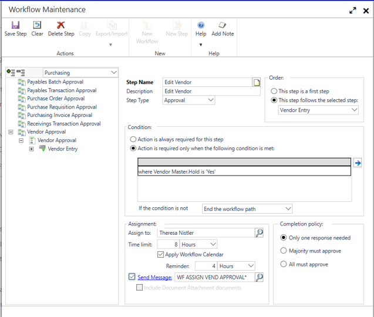

## System enhancements

A number of updates have been made to Dynamics GP across the product areas.

### Compatibility with SQL Server 2019​, Windows Server 2019​, and Office 2019​

This version of Dynamics GP is compatible with SQL Server 2019​, Windows Server 2019​, and Office 2019.

### Date options in SmartLists​

With these new search options, users do not need to change dates in search criteria.

- The Dynamics GP system date is set to November 11, 2019  
- **Prior Month** – all values from October 1-31  
- **Prior Period** – all values from 1st day of the previous period to last day based on period setup  
- **Next Month** – all values from December 1-December 31  
- **Next Period** – all values from 1st day of the next period to the last day based on period setup  

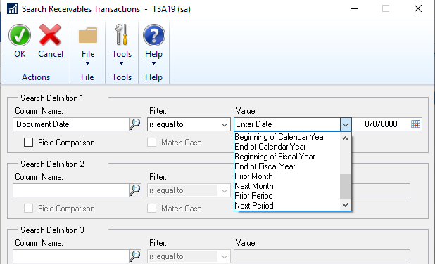

### Sort companies in User Access​ Setup

In the **User Access​ Setup** window, you can change the sort order of the companies that the user can access.

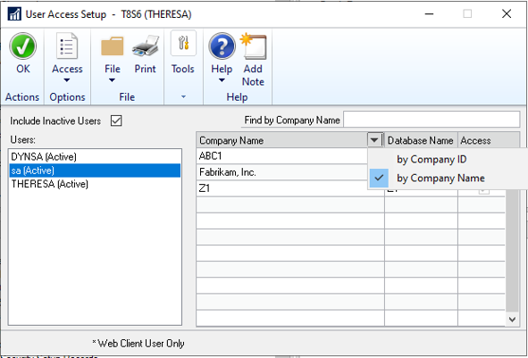

Type to search and find a company.

### Filter inactive users in User Access Setup​

Specify if you want to include inactive users in the User Access Setup window.

### More than 32 report options in Report Group​

You can add more than 32 report options to a report group.

## Top feature requests

### Copy Report Option​

You can now copy report options from another report to the current report, make changes, and save changes. This is a fast way to set standard values for different reports.

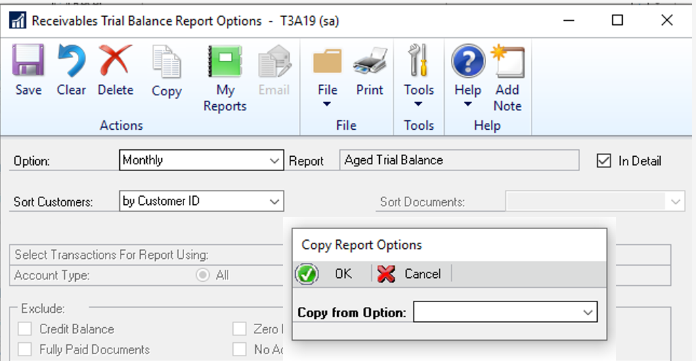

### Filter Item Stock Inquiry by Date​

You can set date filters in the **Item Stock Inquiry** window to restrict the view. Choose **Redisplay** to filter data based on the **From** and **To** dates.

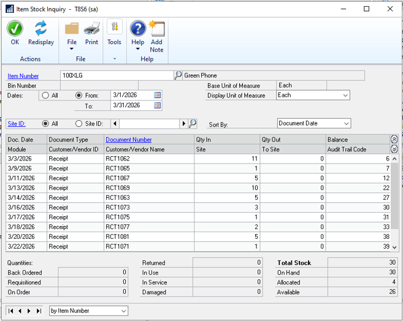

### Exclude Inactive Items on Item Price List​

You can now specify if you want to exclude inactive items from the **Item Price** list.

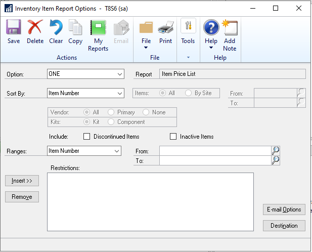

### Minimize transaction when Go To is selected for PO that exists​

The transactions windows are minimized when you choose **Go To** for a PO.  

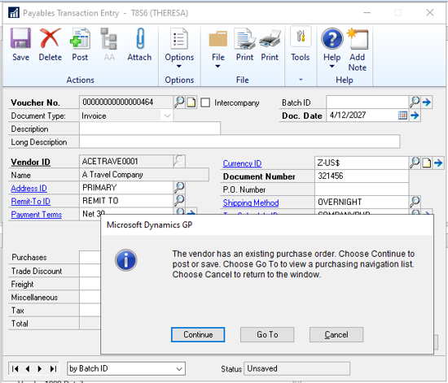

The purchasing transactions navigation list displays on top, and the **Payables Transaction Entry** remains open with the transaction entered. 
Return to the transaction entry to post or delete the transaction.

### Save setting for how to show new POs

You can now specify if  the user wants to be notified when a new PO is created

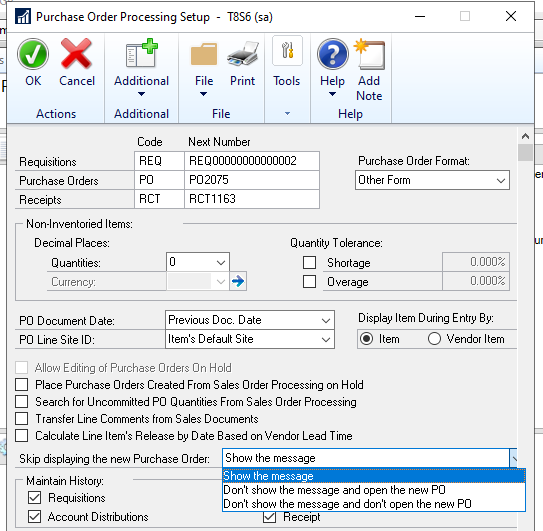

### Inactive field added to Item SmartList​

A new field, **Inactive**, is added to the default Item SmartList. You can add it as an available column in SmartList.

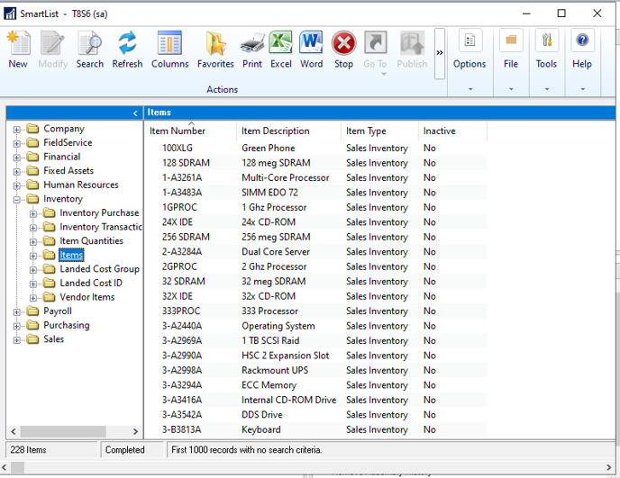

### Show the User ID in the Item master table​

Write the User ID to the item record when added or updated. You can add the field as a column in Items SmartList query.

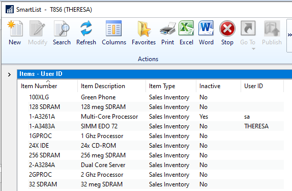

### Paste from Excel in Web Client​

You can now insert rows from Excel into the General Journal using the Dynamics GP web client.

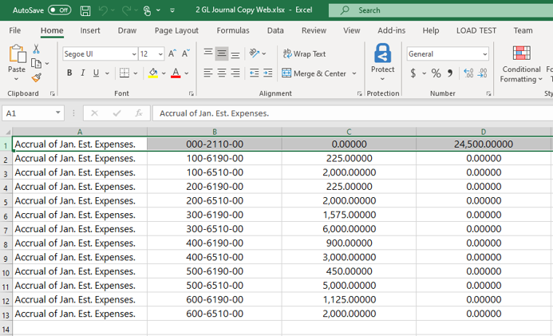

## See also

[System requirements](../installation/system-requirements.md)  
[Upgrade introduction](../upgrade/introduction.md)  
