# What’s New in Dynamics GP in October 2019

This chapter lists enhancements to Dynamics GP in the October 2019 release. The Dynamics GP October 2019 release enhances specific areas of the product.

## Financial enhancements

A number of updates have been made to the finance area in Dynamics GP.

### Long description for payables transaction entries

Enable option in Payables ​

Enter up to 200 characters ​

Displays on the following pages:

- ​Transaction Entry​

- Payables Transaction Entry Zoom​

- PM Blank Document​

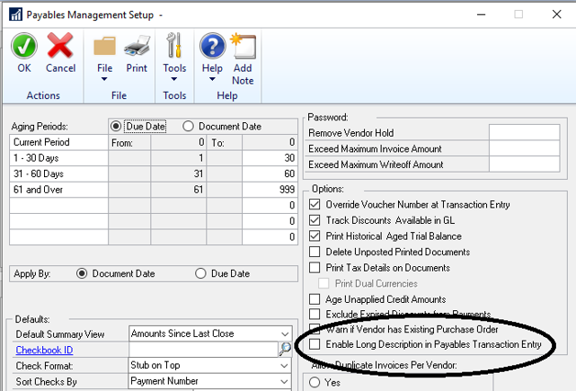

Prints on the following checks in Payables Check Entry (single invoice)​

- Check With Stub on Top​

- Check With Stub on Bottom​

- Check With Stub on Top and Bottom-Text​

- Check With Stub on Top and Bottom-Graphical​

- Check With Two Stub on Top​

- User-Defined Check1​

- User-Defined Check2​

- PM Transaction Inquiry​

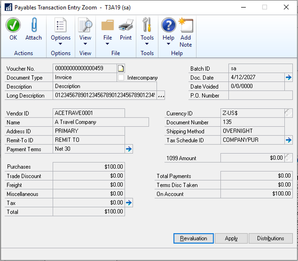

​Does not post to the general ledger.​

### Expand the view of fiscal periods

​You can extend the window display length to give you an expanded view of the fiscal periods.

Extend the window display length

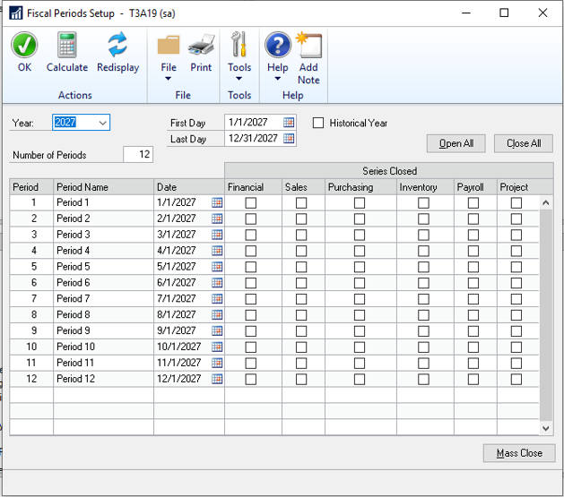

### Show user who posted for Journal Entry Inquiry​

The Journal Entry Inquiry window now has a new field that shows the user who posted the entry.

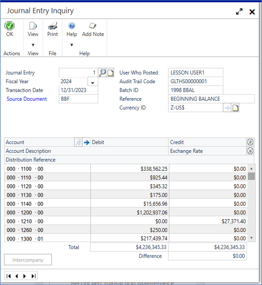

The **User Who Posted** field shows for both open entries and historical entries.

### Add Class ID to Fixed Assets Transfer​

Class ID is now added to the scrolling window.

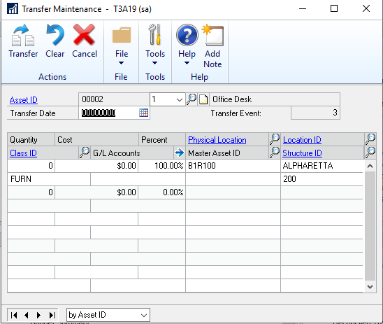

If you change the class ID, you get default GL accounts. The class ID is shown in the **Fixed Assets Transfer** and **Fixed Assets Mass Transfer** windows.

### Document Attach available in Bank Reconciliation​

You can now attach documents in the following windows:

- Bank Deposit Entry
- Bank Transaction Entry
- Bank Deposit Entry Zoom
- Bank Transaction Entry Zoom

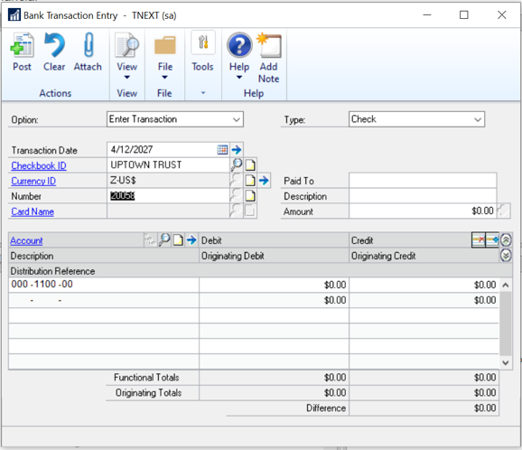

### Visual Cue for EFT Vendor on Edit Payment Batch​

In **Edit Payment Batch** window, you can now use a visual cue to identify vendors that are set up to receive EFT payments.

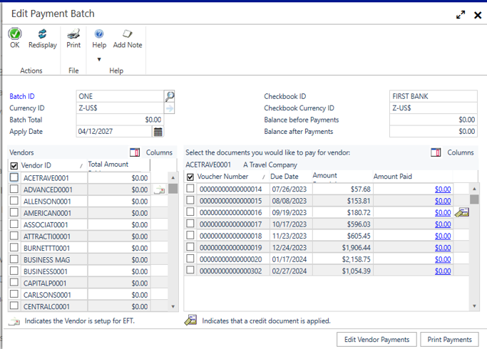

### Show Check Number in Apply Sales Document window​

In the **Apply Sales Document** window​, you can now see the check or card number that was entered on the payment at the time of entry.

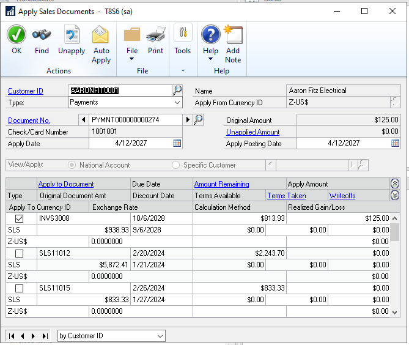

### Payroll option to not include additional withholding​

In the **Build Payroll Checks** window, you can now specify if the check must include additional federal, state, or local taxes. The fields are selected by default to retain existing functionality.

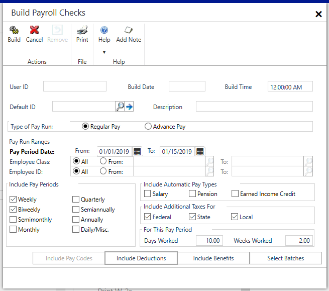

There is also a new option to save settings with the Default ID.

### Payables Integration to Payroll Enhancement​

You can specify remittance address for vendors to use when creating the invoice from Payroll.

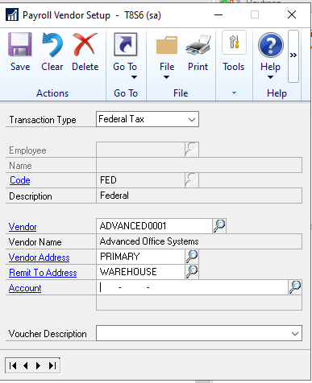

A new **Payroll Integration to Payables Edit List** report is now available from Posting Setup.

### Deduction/Benefit Quick Assignment functionality​

You can bulk-assign codes to one or more employees for the following codes:

- Deduction Code (Payroll)
- Benefit Code (Payroll)
- Miscellaneous Benefit (HR)
- Retirement Benefit (HR)
- Life Insurance (HR)
- Health Insurance (HR)

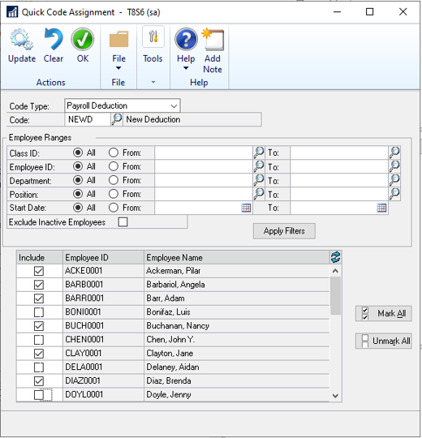

Go to the **Quick Code Assignment** window from the **Deduction Setup** window, and then mark all or unmark all.

### Exclude inactive records for HR benefit and Deduction lookups​

### Employment history reason for change for all dates​

### Payroll Reprint Pay statements by Audit Code

## Workflow functionality

### User Security Workflow​

### User Workflow​

### Security Roles Workflow​

### Security Tasks Workflow​

### Import Workflow​

### Export Workflow​

### Change approver for active workflow tasks​

### Vendor Approval Workflow submit on Hold or Doc Attach​

## System enhancements

### Compatibility with SQL Server 2019​, Windows Server 2019​, and Office 2019​

### Date options in SmartLists​

### Sort companies in User Access​

### Search option in User Access​

### Filter inactive users in User Access Setup​

### More than 32 report options in Report Group​

## Top feature requests

### Copy Report Option​

### Filter Item Stock Inquiry by Date​

### Exclude Inactive Items on Item Price List​

### Minimize transaction when Go To is selected for PO that exists​

### Save setting for Display new PO per user​

### Inactive field added to Item SmartList​

### Show User ID in the Item master table​

### Paste from Excel in Web Client​

### History drop-down defaults to the most recent year